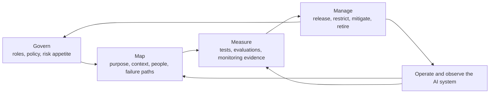

## Model Governance Connects Risk Decisions to Operations
<!-- section-summary: Model governance defines purpose, ownership, evidence, decision rights, controls, monitoring, and retirement for an AI system. -->

**Model governance** is the operating process that decides how an organization may develop, release, use, monitor, change, and retire a model-powered system. It gives each important decision a known owner, each release a reviewed evidence trail, and each production use a boundary that teams can enforce.

Governance answers practical questions. What decision does the model influence? Who can be affected? Who owns model quality after launch? Which evidence supports release? Who has authority to accept the remaining risk? Which version can serve production traffic? What happens when monitoring finds a problem? When should the system receive another review or leave service?

A committee or document can participate in governance, while neither one supplies the whole system. Production governance connects policy to the tools and workflows that teams already use: data catalogs, experiment tracking, model registries, CI/CD, identity and access management, serving platforms, observability, incident response, and change records.

This article uses a hospital readmission follow-up system as a supporting example. The model ranks recently discharged patients for care-coordinator review. The example keeps purpose, human involvement, segment evaluation, privacy, fallback, and monitoring visible. The engineering patterns still apply to recommendation, fraud, forecasting, computer vision, and LLM systems. Legal and regulatory requirements need review from qualified specialists for the organization and jurisdiction.

## The Governance Framework Has Four Connected Responsibilities
<!-- section-summary: Governance maps the system and risk, assigns authority, connects evidence to decisions, and keeps controls active through operation and retirement. -->

The NIST AI Risk Management Framework 1.0 organizes AI risk work through **Govern, Map, Measure, and Manage**. NIST describes it as a voluntary framework and provides a Playbook whose suggestions can be adapted to an organization's context. NIST is revising AI RMF 1.0, so teams using it should track the current official material and record which version informed their process.

For an MLOps team, the four functions translate into a clear engineering flow:

- **Govern** establishes policies, roles, accountability, risk appetite, and review expectations.
- **Map** describes the complete AI system, intended use, people affected, context, dependencies, and credible failure paths.
- **Measure** collects evidence about data, performance, robustness, privacy, security, human factors, and production behaviour.
- **Manage** turns that evidence into decisions such as release, restrict, monitor, mitigate, roll back, or retire.



The arrows show why governance needs a lifecycle. Mapping determines what the team must measure. Measurement supplies evidence for a management decision. Production operation can reveal a new affected group, failure path, or product use, which sends the team back to mapping and policy. A periodic review checks the whole loop rather than repeating an approval ceremony with old evidence.

Several supporting systems sit underneath this flow. An inventory gives the system a stable identity. Risk classification makes controls proportional. Evidence lineage connects a release to its data, code, evaluation, and review. Access and deployment controls enforce the decision. Monitoring and incident response keep the decision active after launch.

## Govern the Complete AI System, Not Only the Model File
<!-- section-summary: The governed subject includes the intended use, data, model, product workflow, human role, interfaces, controls, and fallback. -->

A model file has weights or learned parameters. Risk appears through the complete system that uses those parameters. The same model can create very different outcomes when one product gives it advisory status and another uses it to automate a consequential decision.

An **AI system inventory** is a controlled list of these complete uses. Each entry should describe the intended purpose, prohibited uses, users, affected people, input data, model components, human role, product action, owners, risk tier, deployed environments, fallback, monitoring, and review date.

The hospital example can use a stable record like this:

```yaml
system_id: ai-system-readmission-followup-001
name: Readmission follow-up prioritization
intended_purpose: Rank recently discharged patients for care coordinator review
prohibited_uses:
  - autonomous clinical decisions
  - denial of care
business_owner: care-coordination
technical_owner: ml-platform-risk
incident_owner: care-ml-oncall
risk_tier: high
human_role: clinician and care coordinator review
live_model: health_prod.risk.readmission_30d@champion
fallback: rules://discharge-followup-v6
next_review: 2026-10-01
```

The system ID stays stable while model versions change. A new model, threshold, or runtime can update the existing entry when the intended purpose and system boundary remain the same. A separate product use may need another inventory entry even when it reuses the same model artifact, because its users, decisions, and risks can differ.

This record supports normal work and emergencies. A release pipeline can verify that the proposed model belongs to an active system. An incident responder can locate the owner, fallback, live version, and relevant assessment. A governance team can find overdue reviews, orphaned owners, and systems whose stated purpose no longer matches product behaviour.

The inventory needs links rather than duplicated reports. Large evaluations, impact assessments, data descriptions, and runbooks live in their own controlled systems. The inventory points to their current reviewed versions and records who owns each one.

## Map Purpose, Context, and Harm Before Choosing Controls
<!-- section-summary: System mapping explains the decision, affected people, operating context, dependencies, human role, and credible failures that controls must address. -->

Governance can drift into generic checklists when teams skip the system map. A meaningful map starts with the product decision. The hospital system ranks patients for follow-up review after discharge. A care coordinator sees the ranking and can apply professional judgement. The model has no authority to deny care.

That description identifies several boundaries. The prediction happens after discharge. The input data can only include information available at that time. The care coordinator remains part of the workflow. A missing or delayed prediction needs a fallback queue. The system affects which cases receive earlier attention, so missed high-risk patients and uneven performance across patient groups deserve direct evaluation.

A useful map covers several views:

| View | Questions |
|---|---|
| Purpose | Which decision or action does the system support? Which uses are prohibited? |
| People | Who uses it, who is affected, and who can challenge or override it? |
| Data | Which sources and attributes enter training and inference? Which retention and access rules apply? |
| Model | What task, threshold, limitations, and uncertainty does the model have? |
| Product workflow | Where does the prediction appear, and what action follows? |
| Dependencies | Which data, services, vendors, interfaces, and human processes must work? |
| Failure | Which errors, misuse, drift, outages, or feedback effects can cause harm? |
| Recovery | Which fallback, rollback, notification, and support path limits impact? |

Risk classification follows this map. A **risk tier** is an internal category that controls the depth of evidence, approval, monitoring, and review. The names may be low, medium, high, and critical. The useful part is the rule attached to each tier.

A low-impact internal recommendation may need a product owner, basic quality evidence, and normal service monitoring. A high-impact patient-prioritization system may require subgroup evaluation, privacy and security review, human-workflow assessment, explicit fallback, senior approval, detailed audit records, and a shorter review cycle.

Risk can also change after launch. A model may move into a new region, population, interface, or automated workflow. The inventory update should trigger a new mapping and control review rather than allowing the old approval to cover a materially different use.

## Decision Rights Give Every Approval a Meaning
<!-- section-summary: Named roles separate evidence production, independent review, risk acceptance, deployment authority, operation, and incident response. -->

An owner is a person or group accountable for the AI system as an operated product. Several teams can contribute, while one accountable group needs to answer for model health, evidence quality, review cadence, incidents, and retirement.

Governance works best when it distinguishes several kinds of authority. The team that produces evidence should not silently approve its own highest-risk release. The people who accept product or domain risk may differ from the engineers who verify runtime safety. The identity allowed to deploy production should differ from the identity used to train candidates.

| Decision role | Typical responsibility |
|---|---|
| Business or product owner | Confirms purpose, benefit, acceptable tradeoffs, and user impact |
| Model or technical owner | Owns model quality, technical evidence, and lifecycle maintenance |
| Data owner | Approves data source, quality, access, retention, and permitted use |
| Domain or safety reviewer | Reviews failure consequences and the human workflow |
| Privacy and security reviewer | Reviews data protection, threat, identity, and control evidence |
| Platform or release owner | Verifies packaging, registry, deployment, monitoring, and rollback |
| Incident owner | Has authority to restrict, disable, or restore the system during an event |

The exact role names vary. The control should say which decision each role makes, which evidence it receives, and whether its approval can expire. A privacy approval for one dataset and purpose should not automatically cover a new source or use. A model approval should bind to one model version, evaluation packet, and deployment configuration.

Separation of duties needs proportionality. A small team may have one person filling several roles. High-impact systems still need a meaningful independent review or escalation path. The objective is to prevent an unreviewed decision from passing through one person's accounts and assumptions.

## Measure With an Evidence Chain, Not a Folder of Reports
<!-- section-summary: Governance evidence links the system, risk, data, run, model, evaluations, approvals, release, and production outcomes through stable identities. -->

Governance evidence should let a reviewer answer one question: why was this exact system version allowed to perform this exact use? A collection of dashboards and PDFs only helps when each item clearly refers to the same governed subject.

```mermaid
flowchart LR
    I["AI system and intended use"] --> K["Risk tier and required controls"]
    K --> D["Dataset and feature versions"]
    D --> T["Training run and environment"]
    T --> V["Model version and signature"]
    V --> E["Evaluation and impact evidence"]
    E --> A["Named approvals and decision"]
    A --> R["Serving release and access policy"]
    R --> P["Production monitoring, incidents, outcomes"]
    P --> Q["Periodic review or change request"]
```



This is an **evidence chain** because every record links to the next through stable identities. A release packet can bring the links together without copying all underlying content. It names the AI system, model version, training run, dataset snapshot, code and environment, evaluation reports, policy version, required approvals, deployment target, monitoring plan, and rollback target.

The packet should include evidence that matches the mapped risks. Overall accuracy may tell little about a protected segment. A privacy review cannot substitute for a security assessment. A model card can summarize intended use and limitations, while the release decision still needs current evaluation and deployment evidence.

Automation checks completeness and consistency. It can verify that the model version exists, its signature is present, the dataset and run identities resolve, required reports are current, thresholds pass, approvals refer to the same artifact, and rollback points to a loadable version. Human reviewers then spend attention on judgement: whether the use remains appropriate, the tradeoffs are acceptable, and the evidence addresses realistic harm.

Every decision should produce its own record. A release decision names the subject, policy and evidence versions, reviewers, result, reason, conditions, timestamp, and expiry. A rejection or restriction matters as much as an approval because it explains what the team learned and what must change.

## Manage Risk by Enforcing the Decision in the Delivery Path
<!-- section-summary: Registry, identity, CI/CD, serving, and policy controls turn a governance decision into the version and behaviour that production actually uses. -->

Approval has operational value only when the delivery path enforces it. If a reviewer approves model version 17 and a shared serving account can load any object from a bucket, the runtime has no reliable connection to the decision.

A model registry helps create that connection. Registries such as MLflow Model Registry provide named models, immutable versions, lineage, tags, annotations, and aliases. Managed backends can add role-based access control and audit. Databricks uses Unity Catalog as its modern governed model-lifecycle surface, with centralized permissions, cross-workspace access, lineage, and aliases.

The registry still represents one layer. CI/CD verifies the packet and promotes a version. Identity policy restricts who can register, approve, deploy, and serve. The serving configuration identifies an approved immutable version or controlled alias. Audit logs record changes. The deployment record links traffic, runtime image, feature contract, and rollback target to the governed model.

Environment boundaries can strengthen the handoff. Development identities create experiments and candidates. Staging identities run release tests against reviewed data and services. Production identities can load only approved artifacts. A production alias change or deployment requires the release workflow and its evidence gate.

Exceptions need the same discipline. An urgent release may use an expedited path with named authority, limited scope, additional monitoring, expiry, and mandatory follow-up. A hidden manual bypass creates an ungoverned second process and weakens the evidence chain.

## Monitoring Keeps the Approval Conditions Alive
<!-- section-summary: Post-release governance watches the technical system, model behaviour, human workflow, and real outcomes against the approved use and limits. -->

A release decision uses evidence from a point in time. Production data, users, dependencies, and product behaviour continue to change. Monitoring tests whether the conditions behind that decision still hold.

Governance monitoring includes several layers. Service metrics cover latency, errors, saturation, and availability. Data checks cover schema, freshness, missing values, and feature parity. Model monitoring covers score distributions, calibration, segment performance, and mature labels. Human-workflow signals cover overrides, appeals, review delay, and unusual patterns. Product and harm indicators track the outcome the system was intended to improve and the negative outcomes it was meant to avoid.

Each signal needs a response path. A serving outage may trigger fallback. A feature-contract break may block predictions. A segment-quality alert may restrict use while the team investigates. A new product use may require remapping and approval. Monitoring without decision rules creates dashboards that record risk without managing it.

The incident record should connect the live release, affected period, model and feature versions, observed signals, decisions, owners, mitigations, and customer or user impact. This evidence feeds the next review and can reveal missing controls in the original map.

Human feedback also needs interpretation. A rising override rate can signal poor model quality, a confusing interface, a workflow change, or cautious adoption. Governance brings domain and technical owners together so the response addresses the actual cause.

## Periodic Review and Retirement Complete the Lifecycle
<!-- section-summary: Periodic review decides whether the approved purpose, risk, evidence, controls, and ownership remain valid, while retirement removes the system cleanly. -->

A periodic review revisits the whole governed system. The owner brings the current inventory, purpose, risk tier, evidence, incidents, monitoring trends, data changes, dependency changes, access records, user feedback, and outstanding actions. The review then makes a lifecycle decision.

Useful outcomes include continue, continue with conditions, retrain, change a threshold, add a control, restrict population or use, roll back, replace, or retire. Each outcome gets an owner and due date. Repeating the meeting without changing the system when evidence requires action would provide ceremony without control.

Review frequency should reflect risk and change. A high-impact system may have a short scheduled cycle and event-triggered reviews. A low-impact stable system may use a longer cycle. Material changes such as new data, a new population, an automated action, a major model family change, or a new vendor should trigger review even when the calendar date is far away.

**Retirement** is a controlled removal path. The team stops new use, removes the production alias or deployment, enables the fallback, closes dedicated access, preserves required evidence, updates the inventory, communicates with affected users, and confirms that downstream systems no longer depend on the retired output. Archived evidence follows retention and deletion requirements.

Retirement also applies to shadow systems and old experiments that still have credentials, endpoints, or copied data. An inventory helps the organization find these forgotten assets before they create security, privacy, or cost risk.

## Common Governance Failures
<!-- section-summary: Governance breaks when the system scope, ownership, evidence, approval, runtime controls, and post-release action drift apart. -->

An **orphan system** still serves users after its owner leaves or the responsible team changes. Inventory checks should detect inactive owner groups, missing incident contacts, and overdue reviews. Ownership transfer should be part of team and service changes.

An **evidence mismatch** attaches a strong report to the wrong model, dataset, or release. Immutable run IDs, model versions, code commits, environment digests, and deployment records prevent reviewers from relying on filenames and manual uploads.

An **approval gap** records a decision without enforcing it at runtime. Registry permissions, controlled aliases, deployment identities, protected environments, and audit logs connect approval to the serving version.

A **purpose drift** keeps the original approval while the product changes how it uses the output. Inventory updates and event-triggered review should treat new populations, decisions, automation, and interfaces as governance changes.

An **action gap** produces monitoring findings with no owner or response. Every material alert and review decision needs an action, authority, and deadline. Governance changes production behaviour when risk changes.

## How the Pieces Work Together
<!-- section-summary: Governed AI systems connect purpose, context, ownership, proportional evidence, enforceable decisions, monitoring, review, and retirement. -->

Model governance gives an AI system a controlled lifecycle. The team inventories the complete use, maps the decision and credible harm, assigns owners and a risk tier, collects evidence that matches those risks, and records who has authority to release or restrict the system. Registry, identity, CI/CD, and serving controls enforce that decision.

Production monitoring checks whether the approved conditions still hold. Incidents, product changes, new populations, and scheduled reviews can reopen the decision. Retirement removes the system and its access cleanly when its purpose ends or its risk can no longer be justified.

The framework keeps governance connected to engineering. Documents summarize the decisions, while stable identities, automated checks, access boundaries, deployment controls, monitoring, and incident records make those decisions real in production.

## References

- [NIST: AI Risk Management Framework](https://www.nist.gov/itl/ai-risk-management-framework)
- [NIST: AI RMF Playbook](https://airc.nist.gov/airmf-resources/playbook/)
- [NIST: AI RMF 1.0](https://nvlpubs.nist.gov/nistpubs/ai/NIST.AI.100-1.pdf)
- [MLflow Model Registry](https://mlflow.org/docs/latest/ml/model-registry/)
- [MLflow Model Signatures and Input Examples](https://mlflow.org/docs/latest/ml/model/signatures/)
- [Databricks: Manage model lifecycle in Unity Catalog](https://docs.databricks.com/aws/en/machine-learning/manage-model-lifecycle/)
- [GitHub Docs: Managing environments for deployment](https://docs.github.com/en/actions/how-tos/deploy/configure-and-manage-deployments/manage-environments)
