## Table of Contents

1. [What Model Governance Actually Governs](#what-model-governance-actually-governs)
2. [List Every Model-Powered System And Its Use](#list-every-model-powered-system-and-its-use)
3. [Describe The Real Use And Its Potential Impact](#describe-the-real-use-and-its-potential-impact)
4. [Give Every Decision a Named Owner](#give-every-decision-a-named-owner)
5. [Match The Review Depth To The System's Risk](#match-the-review-depth-to-the-systems-risk)
6. [Record The Exact Data, Code, Model, And Policy In Each Release](#record-the-exact-data-code-model-and-policy-in-each-release)
7. [What Reviewers Need Before Approving A Model](#what-reviewers-need-before-approving-a-model)
8. [Allow Production Deployment Only For The Approved Release](#allow-production-deployment-only-for-the-approved-release)
9. [Handle Temporary Exceptions And Changes That Affect Approval](#handle-temporary-exceptions-and-changes-that-affect-approval)
10. [Check That Approved Conditions Still Hold In Production](#check-that-approved-conditions-still-hold-in-production)
11. [Review Live Systems, Retire Them Safely, And Govern External Models](#review-live-systems-retire-them-safely-and-govern-external-models)
12. [How Governance Works With Risk, Compliance, Security, And Privacy](#how-governance-works-with-risk-compliance-security-and-privacy)
13. [What Standards And Engineering Platforms Can Control](#what-standards-and-engineering-platforms-can-control)
14. [The Main Idea](#the-main-idea)
15. [References](#references)

## What Model Governance Actually Governs
<!-- section-summary: Model governance controls the important decisions around a model-powered system from proposed use through retirement. -->

A model can pass technical evaluation while its intended use, remaining risk, or release authority remains disputed. **Model governance is how an organization controls those important decisions.** It establishes who may propose a use, which risks require investigation, what evidence supports release, who may accept remaining risk, and how the system can later be restricted or retired.

The governed subject is the complete production use. It includes the model, its data, the product workflow, the people who rely on the output, automated rules around the model, the serving environment, and the fallback path. A model artifact sitting in a registry has limited practical effect. The same artifact placed inside a hiring screen, a fraud queue, or a music recommender can create very different consequences.

Consider a model that assigns a risk score. A fraud investigator may use the score to decide which transactions deserve manual review. A payment service may use the same score to block a purchase automatically. The input and model can remain identical. The second use grants the output greater authority, so it needs stronger validation and accountable approval. Appeals and monitoring also need deeper treatment. Governance therefore follows the **decision and its consequences**. The algorithm name is one technical detail inside that wider use.

This also explains why governance continues after release. New users, data sources, and thresholds can alter the governed use. Vendors and product actions can change it further. Production evidence can reveal a failure that pre-release testing missed.

Governance needs authority to reopen an earlier decision, change its conditions, or end the use.

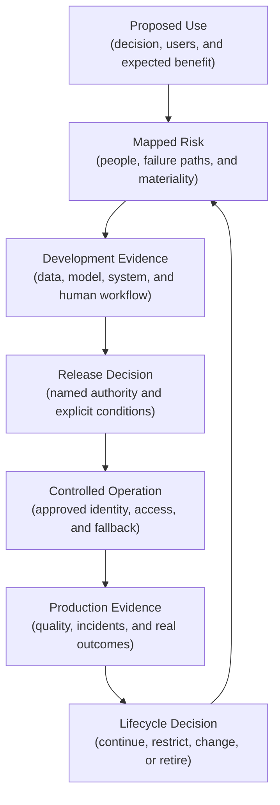
```mermaid
flowchart TD
    A["Proposed Use<br/>(decision, users, and expected benefit)"] --> B["Mapped Risk<br/>(people, failure paths, and materiality)"] --> C["Development Evidence<br/>(data, model, system, and human workflow)"]
    C --> D["Release Decision<br/>(named authority and explicit conditions)"] --> E["Controlled Operation<br/>(approved identity, access, and fallback)"]
    E --> F["Production Evidence<br/>(quality, incidents, and real outcomes)"] --> G["Lifecycle Decision<br/>(continue, restrict, change, or retire)"] --> B
```

You can think of governance as a chain of accountable decisions. Policies define the allowed boundaries. Evidence explains the current system. People with named authority make judgements. Technical controls carry those judgements into production. Records preserve what happened for operators, reviewers, auditors, and affected users.

The details vary by organization and jurisdiction. Legal and sector-specific obligations require qualified review. Privacy, employment, financial, and medical contexts can add distinct duties.

The engineering framework in this article supports that review by making the system and evidence concrete. It also identifies the owners and decisions that qualified specialists need to examine.

## List Every Model-Powered System And Its Use
<!-- section-summary: A governed inventory gives each model-powered use a stable identity, current owners, approved scope, risk state, and lifecycle status. -->

An organization first needs a reliable list of the model-powered systems it operates and the decisions they support. A model registry can list trained artifacts, yet it may miss a spreadsheet model used by an operations team, an external model API called from application code, or one model reused in three products. An **AI system inventory** closes that gap by recording each real use as a governed object.

An inventory entry receives a stable system ID. That identity survives retraining, deployment changes, and owner transfers. It describes the approved purpose, prohibited uses, users, affected people, model and vendor dependencies, data classes, business and technical owners, risk tier, current lifecycle state, production routes, fallback, and review cadence. The record links to detailed evidence held elsewhere.

Suppose a forecasting model first supports an internal planner who can ignore its output. A later team connects it to automatic purchasing. The model version may stay the same, though the decision authority and potential loss have changed. The inventory should either create a distinct governed use or record a material scope change. Reusing the old approval would hide the new consequence.

Inventory design also helps during an incident. An operator should be able to search a production endpoint or vendor route and find its system owner, current model identity, allowed use, rollback path, monitoring view, and open exceptions. A quarterly spreadsheet assembled from memory leaves that operational question unanswered.

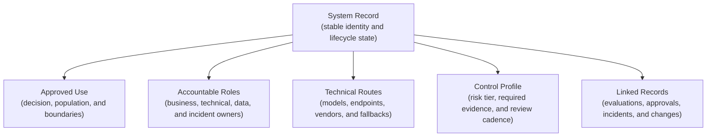
```mermaid
flowchart TD
    A["System Record<br/>(stable identity and lifecycle state)"] --> B["Approved Use<br/>(decision, population, and boundaries)"] & C["Accountable Roles<br/>(business, technical, data, and incident owners)"]
    A --> D["Technical Routes<br/>(models, endpoints, vendors, and fallbacks)"] & E["Control Profile<br/>(risk tier, required evidence, and review cadence)"] & F["Linked Records<br/>(evaluations, approvals, incidents, and changes)"]
```

A focused inventory record might use YAML because humans can review it and automation can validate it:

```yaml
system_id: decision-system-042
name: Transaction review prioritization
lifecycle_state: production
intended_use:
  decision: rank transactions for investigator review
  population: supported card transactions after authorization
  output_authority: advisory
prohibited_uses:
  - automatic account closure
  - reuse for employee monitoring
owners:
  accountable: payments-risk
  technical: fraud-ml
  data: payments-data
  incident: fraud-oncall
control_profile:
  risk_tier: high
  review_cadence: quarterly
production:
  model_ref: models:/fraud-review/27
  policy_ref: policies/fraud-review/v8
  fallback_ref: rules/fraud-review/v5
```

The record uses durable role or group identities. Ownership then survives ordinary staffing changes. A separate control can verify that every owner group remains active and that every production route resolves to an approved system.

## Describe The Real Use And Its Potential Impact
<!-- section-summary: Intended use describes the real decision and its boundaries, while materiality determines how much harm or organizational impact deserves control. -->

A governance review needs to know how the system will be used before it can judge the evidence or safeguards. The **intended use** explains the task in operational language: the prediction, the person or service receiving it, the decision that follows, the population covered, the point in the workflow, and the authority granted to the output. **Prohibited uses** mark foreseeable applications that fall outside the evidence or the organization’s risk tolerance.

“Predict customer risk” supplies too little information. “Rank recent transactions for a trained investigator, who reviews the evidence and decides whether to escalate the case” gives a reviewer something concrete. It reveals the human role, the action, and the limit on automation. The prohibited-use statement can then exclude automatic account closure or reuse in unrelated employment decisions.

The next question is **materiality**: how important could the system’s effects grow for people and the organization? The assessment considers consequences, scale, and reversibility. It also considers decision authority, vulnerable groups, operational dependence, legal obligations, and reputation. Perfect numerical precision is unnecessary. The purpose is to direct stronger review toward more consequential uses.

An email classifier that sorts an employee’s own inbox may receive a light control profile. A visually similar classifier that suppresses public safety reports deserves deeper scrutiny because missed messages can affect many people and may remain invisible. A recommender that suggests songs carries different materiality from one that prioritizes housing applications. The models can share techniques while their governed uses require different evidence and authority.

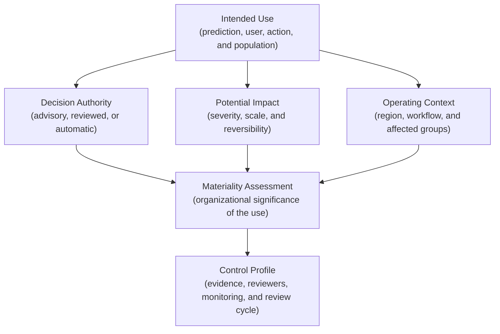
```mermaid
flowchart TD
    A["Intended Use<br/>(prediction, user, action, and population)"] --> B["Decision Authority<br/>(advisory, reviewed, or automatic)"] & C["Potential Impact<br/>(severity, scale, and reversibility)"] & D["Operating Context<br/>(region, workflow, and affected groups)"]
    B & C & D --> E["Materiality Assessment<br/>(organizational significance of the use)"] --> F["Control Profile<br/>(evidence, reviewers, monitoring, and review cycle)"]
```

The mapping exercise should also describe credible failure paths. A false positive may send a legitimate transaction to review. A false negative may miss suspicious activity. A delayed prediction may arrive after an investigator has already decided. A confusing explanation may push reviewers toward automation bias. A feedback loop may cause past interventions to distort future labels. Each path points toward a different evaluation or control.

Model cards support this work by recording intended uses and limitations. They also preserve evaluation conditions and performance across relevant groups. A **system card** can describe the broader deployed system. It connects model behavior with product safeguards and human controls, then documents red-team findings and remaining limitations. Both documents summarize evidence. The inventory and release record still need stable links to the exact versions under review.


*The same risk score can support an investigator or block a purchase automatically. Greater decision authority and harder-to-reverse consequences require deeper evidence, approval, recourse, and release controls.*

## Give Every Decision a Named Owner
<!-- section-summary: Decision rights state who prepares evidence, who challenges it, who accepts risk, who deploys, and who may restrict the system. -->

Governance relies on **decision rights**, which specify who has authority to make each lifecycle decision. A generic “approved by the team” record hides whether the reviewer understood the product harm, the model evidence, the data rights, or the production controls. Named roles make the decision understandable and accountable.

The accountable product or business owner owns the purpose, expected benefit, affected workflow, and acceptable trade-offs. The model owner owns model quality and maintenance. The data owner controls permitted sources, access, retention, and data-quality expectations. Security and privacy reviewers examine their disciplines. A domain or safety reviewer challenges consequences in the real workflow. The release owner verifies packaging, deployment, monitoring, and rollback. The incident owner has authority to restrict traffic, invoke fallback, or disable the system.

These roles can sit in different reporting lines. For a high-impact release, an independent validator supplies a second judgement on the developers’ work. The validator can reproduce key results, challenge assumptions, and inspect the highest-risk segments. A smaller organization may combine several responsibilities, yet the release record should still show which judgement was made under which role. External review or a senior risk forum can supply additional independence for consequential cases.

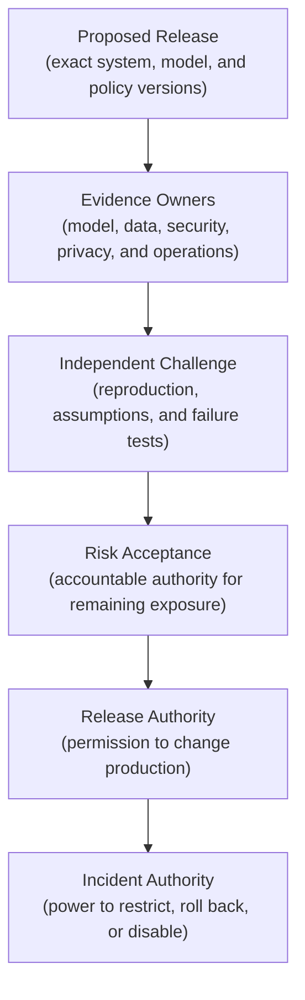
```mermaid
flowchart TD
    A["Proposed Release<br/>(exact system, model, and policy versions)"] --> B["Evidence Owners<br/>(model, data, security, privacy, and operations)"] --> C["Independent Challenge<br/>(reproduction, assumptions, and failure tests)"]
    C --> D["Risk Acceptance<br/>(accountable authority for remaining exposure)"] --> E["Release Authority<br/>(permission to change production)"] --> F["Incident Authority<br/>(power to restrict, roll back, or disable)"]
```

Decision rights should cover rejection and restriction as clearly as approval. A validator may return the candidate for more segment evidence. A privacy reviewer may approve one data source and reject another. A release authority may allow a small canary with a manual fallback while withholding full rollout. An incident commander may override normal release cadence to protect users.

Every approval binds to a subject and scope. A data-use approval authorizes its recorded purpose. A release approval names model version 27 and policy version 8, leaving version 28 for another decision. An exception names its approved region. Those boundaries turn a person’s judgement into a decision that software and later reviewers can interpret.

## Match The Review Depth To The System's Risk
<!-- section-summary: Risk tiers translate materiality into concrete requirements for evidence, independence, release authority, monitoring, and review. -->

A low-impact internal aid and a high-impact automated decision should receive different levels of review. A **risk tier** is the internal category that selects the control profile for a governed use. The labels can be low, medium, high, and critical, or another scheme that fits the organization. Each tier must select a concrete control profile.

For a low-materiality internal aid, the organization might require a named owner and basic data checks. A model card and ordinary peer review can document the result. Service monitoring and a yearly lifecycle review can complete that profile.

A high-materiality automated decision needs more. Its profile may add an impact assessment and subgroup evaluation. Robustness testing, specialist review, and independent validation deepen the challenge. Senior risk acceptance and a tested appeal path address decision authority. Restricted deployment identity, stronger monitoring, and a shorter review cycle address operation.

This is proportional governance. It directs scarce specialist attention toward uses with greater potential impact. It also gives engineers predictable requirements early in development. A team should learn the expected evidence before investing months in a system that lacks an acceptable fallback or lawful data path.

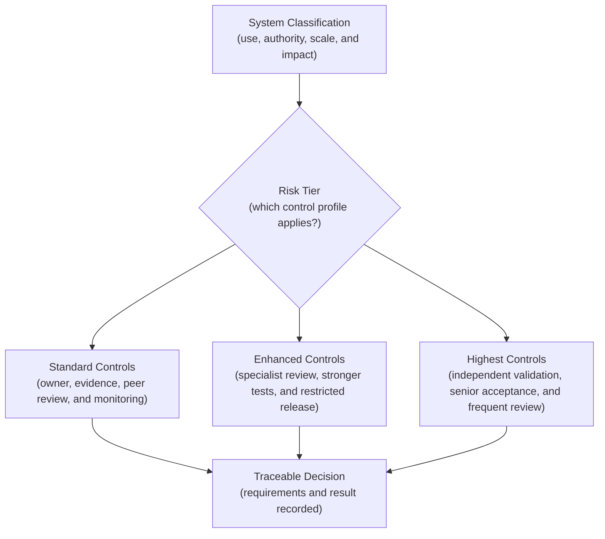
```mermaid
flowchart TD
    A["System Classification<br/>(use, authority, scale, and impact)"] --> B{"Risk Tier<br/>(which control profile applies?)"}
    B --> C["Standard Controls<br/>(owner, evidence, peer review, and monitoring)"] & D["Enhanced Controls<br/>(specialist review, stronger tests, and restricted release)"] & E["Highest Controls<br/>(independent validation, senior acceptance, and frequent review)"]
    C & D & E --> F["Traceable Decision<br/>(requirements and result recorded)"]
```

Tiering criteria need examples and escalation rules. Automatic action and sensitive data commonly increase materiality. Safety effects and legal rights can raise it further. Vulnerable populations, broad scale, difficult reversal, and limited recourse add other reasons for escalation.

Unknown purpose or missing evidence should prevent a convenient low-risk classification. The team can use a temporary “unclassified” state that blocks production until an authorized owner resolves it.

The tier itself can change. A chat summarizer used for personal notes may gain a higher control profile after integration with a clinical record. A vendor may add tool execution to a previously text-only model. A new region may introduce different obligations and affected groups. The change process should compare the new system map with the approved one and recalculate the tier.

## Record The Exact Data, Code, Model, And Policy In Each Release
<!-- section-summary: Stable identities connect the approved system to its data, code, run, model, policy, evaluation, deployment, and production evidence. -->

A later reviewer must be able to identify the exact data, code, model, and decision policy that entered production together. Generic names such as `final_model.pkl` and `evaluation_latest.pdf` lose that connection. Teams therefore use stable, machine-readable identities across the lifecycle.

The system ID identifies the governed use. A dataset snapshot or table version identifies the training population. A code commit and container digest identify the implementation and environment. A training run identifies the execution. A model version or artifact digest identifies the learned output. A feature-contract version identifies the serving inputs. A decision-policy version identifies thresholds, rules, and human-routing behavior around the model. An evaluation bundle identifies the datasets, metrics, slices, and acceptance policy. A release ID identifies the deployed combination.

This separation matters because model weights are only one changing part. A team can keep the same model and lower its decision threshold. That policy change may send twice as many cases to human review and create a new operational risk. Another release can keep the model and threshold while changing feature code. A later investigation needs to distinguish those events.

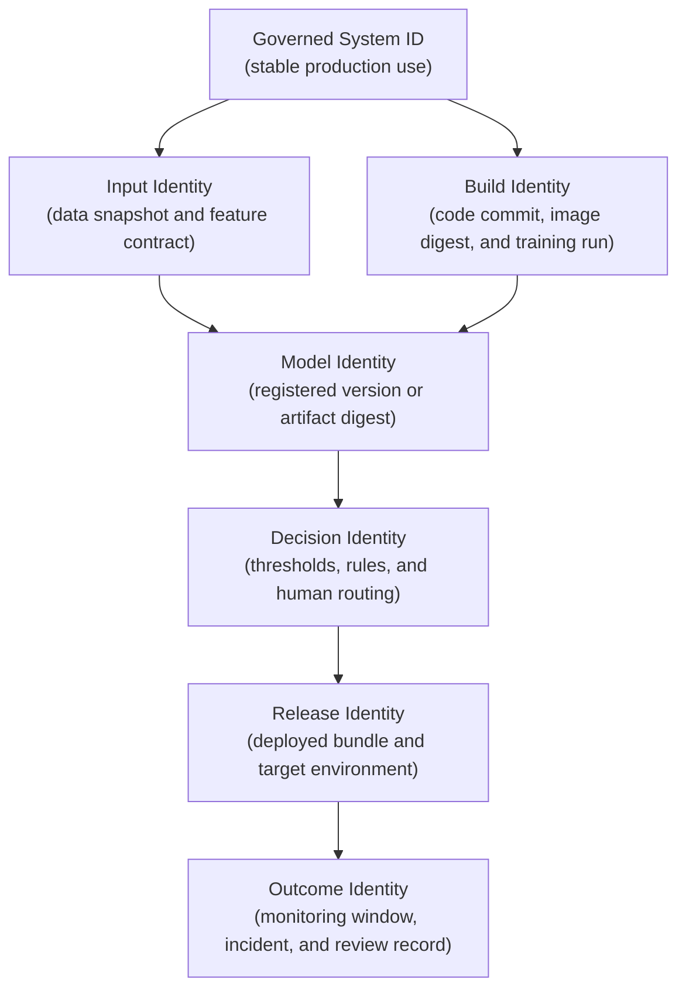
```mermaid
flowchart TD
    A["Governed System ID<br/>(stable production use)"] --> B["Input Identity<br/>(data snapshot and feature contract)"] & C["Build Identity<br/>(code commit, image digest, and training run)"]
    B & C --> D["Model Identity<br/>(registered version or artifact digest)"] --> E["Decision Identity<br/>(thresholds, rules, and human routing)"]
    E --> F["Release Identity<br/>(deployed bundle and target environment)"] --> G["Outcome Identity<br/>(monitoring window, incident, and review record)"]
```

MLflow Model Registry, Models in Databricks Unity Catalog, Amazon SageMaker Model Registry, Model Registry on Gemini Enterprise Agent Platform, and Azure Machine Learning registries can preserve model names, versions, metadata, and lineage. Data catalogs and table formats such as Delta Lake or Iceberg can preserve governed data identities. Git and an OCI registry preserve code and image identities. A ticket or workflow system preserves human decisions. Joining these systems through stable references creates the evidence chain.

A registry alias such as `Champion` is a mutable operational pointer. It helps a serving application find the currently selected version. The immutable model version remains the audit identity. A release record should therefore capture both: which alias changed and which version received it.

## What Reviewers Need Before Approving A Model
<!-- section-summary: Development evidence explains the system and its measured behavior, while independent validation tests whether that evidence supports the proposed use. -->

A reviewer needs enough evidence to decide whether one exact system can support its proposed use under the stated safeguards. Overall model accuracy supplies one part. The review may also need data rights, lineage, label quality, segment behavior, calibration, and robustness.

Privacy and security require their own questions. The human workflow and load behavior may need separate tests. Fallback, monitoring coverage, and unresolved limitations also deserve explicit evidence.

The word **evidence** matters here. A claim such as “the model is fair” is too broad to review. Evidence names the groups, metric, dataset, and sample size. It records uncertainty and the threshold, then presents the observed result.

A claim such as “the API is resilient” needs load conditions and failure injection. Fallback and recovery results show the response. The record also explains how closely the test environment represents production.

### What The Development Team Must Show

The development team should document why the system exists and how it works. A model card can describe the model’s intended use, training and evaluation context, performance characteristics, limitations, and relevant group results. A broader system card or impact assessment can connect the model to product safeguards, human roles, dependencies, and credible harms.

For example, a transaction-review model may meet the overall recall target while missing a higher share of suspicious transactions in a newly supported payment route. The team should show that segment result, its uncertainty, expected case volume, and the operational mitigation. Hiding the slice behind the aggregate metric would deprive the approver of the most relevant evidence.

The packet should also state residual risk: risk that remains after planned controls. A human review queue can reduce the impact of false positives, though queue overload may weaken that safeguard. The review-capacity test and alert threshold then belong in the evidence.

### How Independent Review Tests The Team's Claims

**Independent validation** is a review conducted by people with enough distance from the development decision to challenge it credibly. The validator checks traceability, reproduces important measurements, examines assumptions, tests sensitive slices and failure paths, and decides whether the evidence supports the stated use.

The depth should follow materiality. A medium-risk model may receive peer review from another team. A high-impact system may require a separate validation function, domain specialists, or external assessment. Independence concerns decision authority and incentives as well as organizational charts. A reviewer who helped choose every acceptance threshold may struggle to challenge those same choices.

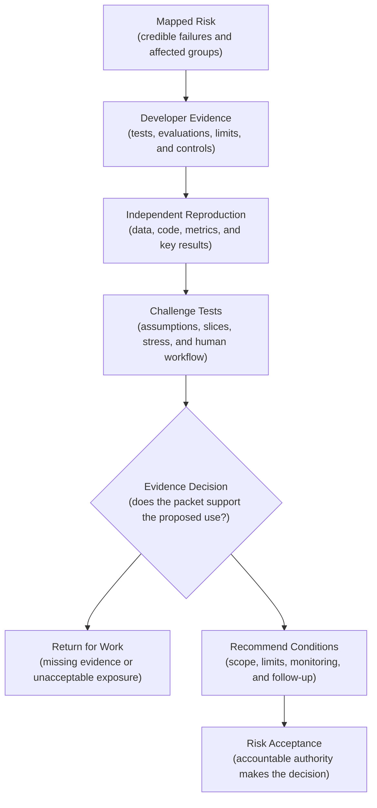
```mermaid
flowchart TD
    A["Mapped Risk<br/>(credible failures and affected groups)"] --> B["Developer Evidence<br/>(tests, evaluations, limits, and controls)"] --> C["Independent Reproduction<br/>(data, code, metrics, and key results)"]
    C --> D["Challenge Tests<br/>(assumptions, slices, stress, and human workflow)"] --> E{"Evidence Decision<br/>(does the packet support the proposed use?)"}
    E --> F["Return for Work<br/>(missing evidence or unacceptable exposure)"] & G["Recommend Conditions<br/>(scope, limits, monitoring, and follow-up)"]
    G --> H["Risk Acceptance<br/>(accountable authority makes the decision)"]
```

Validation should preserve disagreements. A validator may accept the measured quality yet reject the proposed automation level. The release owner could approve an advisory pilot with human confirmation and a strict volume cap. That narrower decision converts uncertainty into an enforceable operating condition.

## Allow Production Deployment Only For The Approved Release
<!-- section-summary: A release packet, automated policy checks, protected approval, registry controls, and immutable deployment references carry a governance decision into production. -->

Approval has little effect if the deployment path can load a different artifact or policy. Release governance must bind the human decision to the exact bundle that enters production.

The release packet provides that connection. It gathers stable references to the system, risk profile, model, data, code, environment, feature contract, policy, evaluations, approvals, open conditions, monitoring plan, and rollback target. The packet is small enough for automation to parse and rich enough for a reviewer to trace each claim.

```yaml
release_id: release-fraud-review-028
system_id: decision-system-042
risk_tier: high
artifacts:
  model_ref: models:/fraud-review/28
  model_digest: sha256:7b46...
  data_ref: catalog.ml.training_events@version=814
  code_commit: 8d2c5a1
  image_digest: sha256:319a...
  feature_contract: fraud-features/v12
  decision_policy: fraud-review/v9
evidence:
  evaluation_bundle: evals/fraud-review/28
  model_card: cards/fraud-review/28
  security_review: reviews/security/1842
approvals:
  independent_validation: review/validation/772
  accountable_risk_owner: decision/risk/991
operations:
  monitoring_policy: monitors/fraud-review/v7
  rollback_release: release-fraud-review-027
  exception_refs: []
```

CI can verify deterministic requirements. It can check that references resolve, required artifacts exist, digests match, evaluation gates pass, approver roles satisfy the control profile, exceptions remain active, and the rollback target is loadable. Policy-as-code engines such as Open Policy Agent can evaluate structured YAML or JSON against versioned rules.

A focused Rego rule can block a high-tier release that lacks independent validation:

```rego
package ml.release

deny contains "high-tier release requires independent validation" if {
  input.risk_tier == "high"
  object.get(input.approvals, "independent_validation", "") == ""
}

deny contains "release requires a rollback target" if {
  object.get(input.operations, "rollback_release", "") == ""
}
```

These rules handle objective completeness. Human reviewers still judge whether the validation is credible, the use remains appropriate, and the residual risk is acceptable. Encoding that judgement as a boolean threshold would create false precision.

The release workflow then uses an identity with narrowly scoped permissions. GitHub Actions protected environments can require reviewers and restrict deployment branches; availability varies by repository visibility and plan. GitLab protected environments, Azure DevOps checks, Jenkins approval stages, and managed cloud pipelines provide similar patterns. Registry permissions limit who can create or move production aliases. The serving platform loads the approved immutable version or a tightly controlled alias. Deployment and audit logs preserve the change.

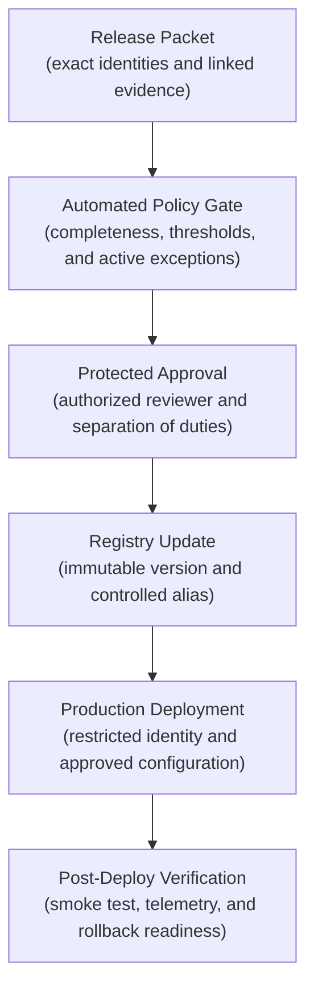
```mermaid
flowchart TD
    A["Release Packet<br/>(exact identities and linked evidence)"] --> B["Automated Policy Gate<br/>(completeness, thresholds, and active exceptions)"] --> C["Protected Approval<br/>(authorized reviewer and separation of duties)"]
    C --> D["Registry Update<br/>(immutable version and controlled alias)"] --> E["Production Deployment<br/>(restricted identity and approved configuration)"]
    E --> F["Post-Deploy Verification<br/>(smoke test, telemetry, and rollback readiness)"]
```

No single product supplies this complete control path. MLflow or a managed registry identifies models. Unity Catalog or another catalog governs data and AI assets. Git and CI preserve code review and automated checks. An identity provider supplies roles. A ticket or workflow tool records decisions. The serving platform enforces runtime configuration. Observability and incident systems preserve production evidence.


*A governed system record and immutable release bundle meet at the deployment gate. Only matching use, artifact, policy, environment, approval, and requester authority may enter production.*

## Handle Temporary Exceptions And Changes That Affect Approval
<!-- section-summary: Exceptions grant temporary, scoped permission under compensating controls, while change control decides whether new evidence or approval is required. -->

Some urgent changes cannot follow the ordinary control path in full. A security patch may require release before a routine evaluation finishes, or a critical data source may fail while a lower-quality fallback keeps an essential workflow operating. Governance records these choices as visible, bounded, and temporary exceptions.

An **exception** is a temporary, scoped departure from an applicable named control. Its record identifies that control, the reason for departure, the affected systems and environments, the risk owner, the approving authority, compensating controls, expiry, and required follow-up. The delivery gate reads this record. After expiry, the named control applies again. A long-lived workaround should enter the ordinary change process because its risk has become part of regular operation.

For example, a label pipeline outage may prevent a scheduled quality report from reaching maturity. The accountable owner might approve a limited canary for an urgent reliability fix. The exception can cap traffic, preserve the previous model and decision policy, require daily manual sample review, and expire after a short window. The structured record gives the delivery gate enforceable scope and expiry. An informal chat message supplies neither field.

**Change control** asks whether a proposed difference stays inside the approved operating envelope. Routine retraining can follow a pre-approved path if the data sources, task, and population remain within defined boundaries. The model family and evaluation policy must also stay inside that envelope. Deployment controls complete the boundary.

A new automated action or population usually requires remapping. A sensitive feature, model family, vendor, or material threshold can also require fresh approval.

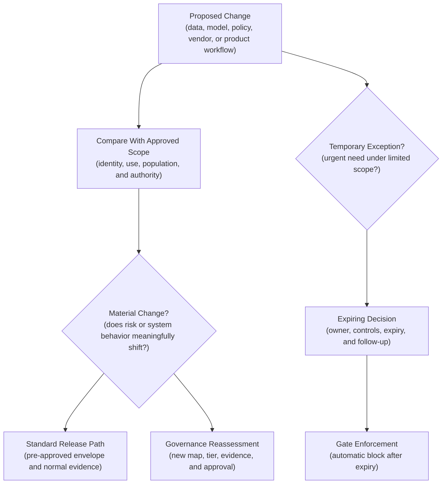
```mermaid
flowchart TD
    A["Proposed Change<br/>(data, model, policy, vendor, or product workflow)"] --> B["Compare With Approved Scope<br/>(identity, use, population, and authority)"] --> C{"Material Change?<br/>(does risk or system behavior meaningfully shift?)"}
    C --> D["Standard Release Path<br/>(pre-approved envelope and normal evidence)"] & E["Governance Reassessment<br/>(new map, tier, evidence, and approval)"]
    A --> F{"Temporary Exception?<br/>(urgent need under limited scope?)"} --> G["Expiring Decision<br/>(owner, controls, expiry, and follow-up)"] --> H["Gate Enforcement<br/>(automatic block after expiry)"]
```

The comparison should be automated where identities permit. CI can detect a changed dataset reference, model family, or feature contract. It can also compare the policy version, external provider, and deployment region. The governance policy then selects the required review path. Product owners report shifts in user experience or decision authority because those changes depend on business context.

## Check That Approved Conditions Still Hold In Production
<!-- section-summary: Production monitoring tests the assumptions and operating conditions that supported approval, then routes meaningful findings to authorized action. -->

Approval relies on assumptions about data, behaviour, traffic, dependencies, and human safeguards. Production monitoring checks whether those assumptions and the recorded operating conditions remain credible after real users and changing data enter the system.

The monitoring plan should trace back to the system map. Service signals cover latency, errors, saturation, and availability. Data signals cover schema, freshness, missingness, and feature parity. Model signals cover score distributions, calibration, segment quality, and mature outcomes. Human-workflow signals cover override, appeal, queue delay, and automation bias. Product and harm signals cover the benefit and negative outcomes that justified the system.

Consider an advisory triage model. Offline evaluation may assume that a trained reviewer inspects every high-score case. Production telemetry later shows the review queue exceeding its capacity, so investigators start accepting recommendations with minimal inspection. Model accuracy may remain stable, while a key human safeguard has weakened. Governance monitoring should surface review delay and action rates alongside model metrics.

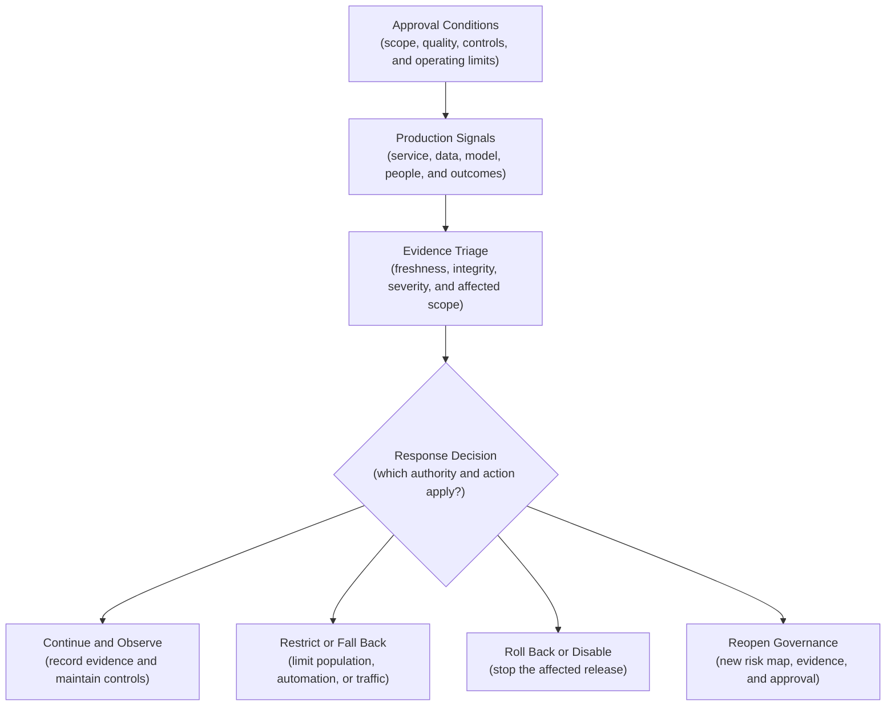
```mermaid
flowchart TD
    A["Approval Conditions<br/>(scope, quality, controls, and operating limits)"] --> B["Production Signals<br/>(service, data, model, people, and outcomes)"] --> C["Evidence Triage<br/>(freshness, integrity, severity, and affected scope)"]
    C --> D{"Response Decision<br/>(which authority and action apply?)"}
    D --> E["Continue and Observe<br/>(record evidence and maintain controls)"] & F["Restrict or Fall Back<br/>(limit population, automation, or traffic)"]
    D --> G["Roll Back or Disable<br/>(stop the affected release)"] & H["Reopen Governance<br/>(new risk map, evidence, and approval)"]
```

Every material signal needs an owner and response rule. A schema break can block inference. A segment-quality decline can restrict a population and send cases to manual review. An unexpected use can trigger a scope investigation. A security event can disable the endpoint or revoke credentials. A governance dashboard connects each signal to the authority and action responsible for it.

Incident records join the live release with the affected interval. They identify model and policy versions, then preserve the data condition and user impact. The decision owner, mitigation, and recovery evidence complete the record.

The post-incident review can then repair the responsible layer. A corrupt outcome join needs a data repair. An unauthorized product use needs restriction and governance review. Model rollback and retraining solve different classes of failure.

## Review Live Systems, Retire Them Safely, And Govern External Models
<!-- section-summary: Periodic review rechecks the governed use, retirement removes its authority and dependencies, and external models receive the same system-level control. -->

A **periodic review** revisits the production use after evidence has accumulated. The accountable owner brings the current inventory, monitoring trends, incidents, user feedback, open exceptions, dependency changes, access history, and unresolved actions. The review can continue the use, add conditions, request new evidence, restrict scope, replace a component, or retire the system.

The cadence should follow risk and change rate. A high-impact system deserves frequent review and event-triggered reassessment. A stable internal aid can use a longer cycle. New automation, a new population, a major data source, a vendor update, a serious incident, or repeated override can trigger review before the planned cadence.

**Retirement** removes the system’s authority cleanly. The team stops new traffic, moves callers to a fallback or replacement, removes production aliases and endpoints, revokes dedicated access, checks downstream dependencies, communicates with affected users, updates the inventory, and preserves required evidence. Retention and deletion policies determine how long models, data, logs, and decision records remain.

External models and APIs need the same system-level governance. The organization may lack access to training data or weights, though it still controls whether and how the provider enters its product. The review should cover vendor terms, data use, and retention. Residency and security add further conditions. Model and API versioning need explicit treatment.

Update notice and evaluation on the organization’s use case address change risk. Fallback, provider incidents, rate limits, and deprecation address continuity. An exit plan completes the control picture.

Suppose a document assistant calls a managed foundation-model API. The provider silently moving a route to a new model could alter quality, safety behavior, latency, or cost. The application should pin a supported version where possible, record the resolved provider route, evaluate updates before promotion, and preserve a fallback. The inventory identifies the external dependency and the owner responsible for vendor changes.

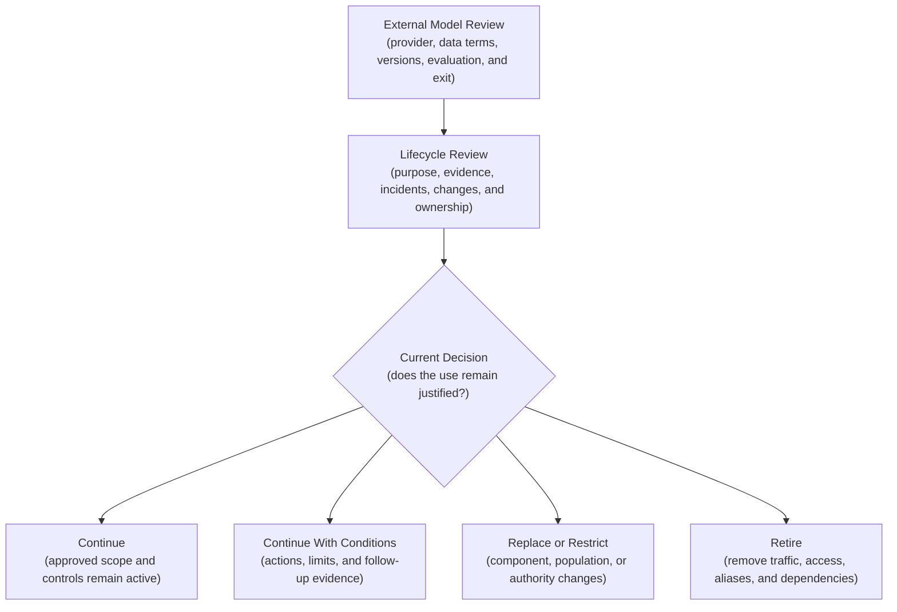
```mermaid
flowchart TD
    G["External Model Review<br/>(provider, data terms, versions, evaluation, and exit)"] --> A["Lifecycle Review<br/>(purpose, evidence, incidents, changes, and ownership)"] --> B{"Current Decision<br/>(does the use remain justified?)"}
    B --> C["Continue<br/>(approved scope and controls remain active)"] & D["Continue With Conditions<br/>(actions, limits, and follow-up evidence)"]
    B --> E["Replace or Restrict<br/>(component, population, or authority changes)"] & F["Retire<br/>(remove traffic, access, aliases, and dependencies)"]
```

An audit trail should preserve the lifecycle story: who proposed the use, how it was classified, which evidence supported release, who approved it, which version served, which exceptions applied, what production revealed, and why the organization continued or ended the system. Append-only records, immutable artifact references, access logs, and controlled corrections strengthen that history.

## How Governance Works With Risk, Compliance, Security, And Privacy
<!-- section-summary: Governance assigns authority and lifecycle decisions, while risk, compliance, security, privacy, and responsible AI contribute distinct questions and evidence. -->

Several specialist disciplines contribute to a model-governance decision, and each asks a different question. Separating their responsibilities shows which owner must supply evidence and prevents one review from being treated as coverage for every concern.

**AI risk management** identifies, analyzes, prioritizes, and treats uncertainty and potential harm. It supplies the risk map, assessment methods, treatments, and residual-risk evidence. Governance decides who performs that work, which level is required, who accepts the result, and how the decision stays active.

**Compliance** interprets laws, regulations, contracts, policies, and sector obligations. It identifies required controls and evidence for the specific organization and jurisdiction. Governance embeds those requirements into ownership, review, delivery gates, monitoring, and records.

**Security** protects confidentiality, integrity, availability, and authorized behavior against accidents and adversaries. For ML systems this can include training-data poisoning, model theft, dependency compromise, prompt injection, unsafe tool use, endpoint abuse, and secret exposure. Governance makes the security review and remaining risk part of the lifecycle decision.

**Privacy** addresses lawful and appropriate data use, minimization, access, retention, disclosure, and rights. A technically accurate model can still use data outside its permitted purpose. The data owner and privacy reviewer supply evidence and conditions that production systems must enforce.

**Responsible AI** expresses desired qualities and social commitments. Fairness, transparency, and explainability are common themes. Human oversight and contestability shape the surrounding workflow. Safety and accountability connect those values to consequences.

These principles need context-specific definitions. Governance assigns owners, evaluations, controls, and escalation paths so the principles influence real decisions.

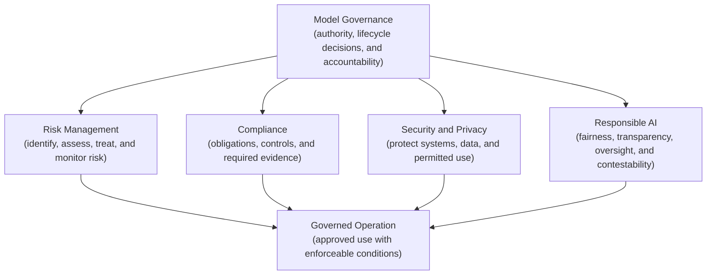
```mermaid
flowchart TD
    A["Model Governance<br/>(authority, lifecycle decisions, and accountability)"] --> B["Risk Management<br/>(identify, assess, treat, and monitor risk)"] & C["Compliance<br/>(obligations, controls, and required evidence)"]
    A --> D["Security and Privacy<br/>(protect systems, data, and permitted use)"] & E["Responsible AI<br/>(fairness, transparency, oversight, and contestability)"]
    B & C & D & E --> F["Governed Operation<br/>(approved use with enforceable conditions)"]
```

The disciplines share evidence and still ask different questions. A bias evaluation may support responsible-AI review and legal analysis. An access log may support security, privacy, and audit. One artifact can serve several reviews if its scope and identity are clear. The final decisions should preserve which authority accepted which part.

## What Standards And Engineering Platforms Can Control
<!-- section-summary: Frameworks and standards organize governance expectations, while engineering platforms store identities, enforce permissions, run gates, and preserve operational evidence. -->

Standards describe management practices, risk outcomes, and review expectations. Engineering platforms record identities, enforce permissions, run gates, and preserve operational evidence. Each organization still determines its exact risk tiers and product boundaries, while qualified specialists interpret legal applicability.

The **NIST AI Risk Management Framework** organizes AI risk work through Govern, Map, Measure, and Manage. NIST presents the framework and its Playbook for voluntary use. The Playbook offers suggested actions that organizations can tailor. NIST also emphasizes that the functions are continuous and that governance cuts across the other activities.

**ISO/IEC 42001** specifies requirements for establishing, implementing, maintaining, and continually improving an artificial intelligence management system. Its scope sits at the organizational management-system level: policy, objectives, responsibilities, processes, evaluation, and improvement across the organization’s AI activities.

**ISO/IEC 23894** provides guidance for managing AI-related risk and integrating that work into organizational activities and functions. It can inform risk processes inside an AI management system. Certification, regulatory mapping, and legal applicability require specialist interpretation.

Engineering platforms implement parts of the operating system:

- MLflow Model Registry and managed registries preserve model identities, versions, metadata, aliases, and lineage.
- Databricks Unity Catalog adds governed names, access controls, lineage, discovery, and audit for data and AI assets.
- Amazon SageMaker Model Cards can capture intended use, risk rating, training, evaluation, and lifecycle documentation; Amazon SageMaker Model Registry supplies approval states for model versions.
- Model Registry on Gemini Enterprise Agent Platform and Azure Machine Learning registries provide managed model versioning and metadata across cloud workflows.
- GitHub Actions environments and comparable CI/CD controls can require authorized review before a production job runs.
- Open Policy Agent can evaluate structured release evidence against versioned policy rules.
- Identity, ticketing, observability, incident, and audit systems carry the remaining responsibilities.

A team can start with ordinary tools. A reviewed inventory in Git, an MLflow registry, protected CI environment, issue workflow, cloud IAM, OpenTelemetry, and an incident platform can form a credible first implementation. Larger organizations may add a governance, risk, and compliance platform or managed AI-governance service. The architecture should preserve stable identities and decision ownership as tools change.

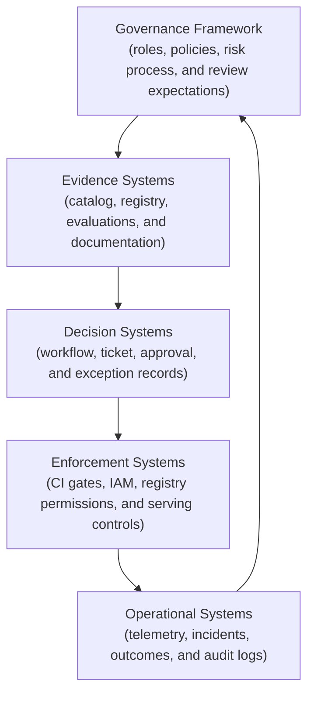
```mermaid
flowchart TD
    A["Governance Framework<br/>(roles, policies, risk process, and review expectations)"] --> B["Evidence Systems<br/>(catalog, registry, evaluations, and documentation)"] --> C["Decision Systems<br/>(workflow, ticket, approval, and exception records)"]
    C --> D["Enforcement Systems<br/>(CI gates, IAM, registry permissions, and serving controls)"] --> E["Operational Systems<br/>(telemetry, incidents, outcomes, and audit logs)"] --> A
```

This layered view prevents a common purchasing mistake. A registry governs access to model versions. Product and risk owners judge whether the intended use is acceptable. A policy engine verifies required fields, while authorized reviewers judge whether a fairness trade-off is justified. A ticket records approval, and the deployment control verifies that production loaded the approved digest. Governance connects these capabilities into one traceable decision system.

## The Main Idea
<!-- section-summary: Effective model governance joins a defined use, proportional controls, accountable authority, traceable evidence, technical enforcement, and continuing lifecycle decisions. -->

Model governance gives a model-powered system a controlled lifecycle. The organization inventories the complete use, defines its boundaries, assesses materiality, assigns decision rights, and selects a proportional control profile. Development and independent review produce evidence tied to stable identities. An accountable authority decides whether the remaining risk is acceptable.

Release tooling then enforces that decision through immutable references, policy checks, protected approval, registry permissions, deployment identity, and post-deploy verification. Exceptions receive scope, compensating controls, ownership, and expiry. Material changes reopen the relevant parts of governance.

Production monitoring checks the conditions that supported approval. Incidents and reviews can continue, restrict, replace, or retire the system. External models follow the same system-level process even if their internal training remains outside the organization.

The result is a practical operating system for accountable decisions. Standards shape the process, specialists supply discipline-specific evidence, and industrial platforms enforce individual controls. Stable links among purpose, evidence, authority, production state, and lifecycle action make governance operational and auditable.


*Governance follows one use from definition and impact classification through evidence, accountable decision, exact-release enforcement, monitoring, and live review. Returned evidence and rejected releases never reach deployment.*

## References

- [NIST: AI Risk Management Framework](https://www.nist.gov/itl/ai-risk-management-framework)
- [NIST: AI RMF Core](https://airc.nist.gov/airmf-resources/airmf/5-sec-core/)
- [NIST: AI RMF Playbook](https://airc.nist.gov/airmf-resources/playbook/)
- [ISO: ISO/IEC 42001 Artificial Intelligence Management System](https://www.iso.org/standard/42001)
- [ISO: ISO/IEC 23894 Guidance on AI Risk Management](https://www.iso.org/standard/77304.html)
- [Google Research: Model Cards for Model Reporting](https://research.google/pubs/model-cards-for-model-reporting/)
- [OpenAI: Deployment Safety Hub and System Cards](https://deploymentsafety.openai.com/)
- [MLflow: Model Registry Workflows](https://mlflow.org/docs/latest/ml/model-registry/workflow/)
- [Databricks: Manage Model Lifecycle in Unity Catalog](https://docs.databricks.com/aws/en/machine-learning/manage-model-lifecycle/)
- [Databricks: Unity Catalog](https://docs.databricks.com/aws/en/data-governance/unity-catalog/)
- [AWS: Amazon SageMaker Model Cards](https://docs.aws.amazon.com/sagemaker/latest/dg/model-cards.html)
- [AWS: Update the Approval Status of a Model](https://docs.aws.amazon.com/sagemaker/latest/dg/model-registry-approve.html)
- [Microsoft: Azure Machine Learning Registries for MLOps](https://learn.microsoft.com/en-us/azure/machine-learning/concept-machine-learning-registries-mlops?view=azureml-api-2)
- [Google Cloud: Model Registry on Gemini Enterprise Agent Platform](https://docs.cloud.google.com/gemini-enterprise-agent-platform/machine-learning/model-registry/introduction)
- [Google Cloud: Gemini Enterprise Agent Platform name changes](https://docs.cloud.google.com/gemini-enterprise-agent-platform/vertex-ai-name-changes)
- [GitHub Docs: Deployments and Environments](https://docs.github.com/en/actions/reference/workflows-and-actions/deployments-and-environments)
- [Open Policy Agent: Using OPA in CI/CD Pipelines](https://www.openpolicyagent.org/docs/cicd)
