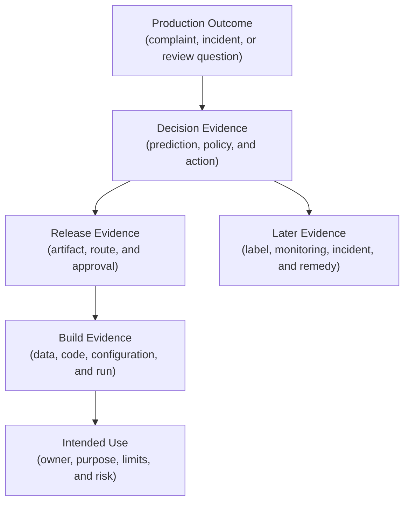
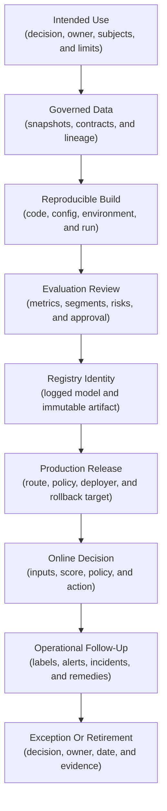
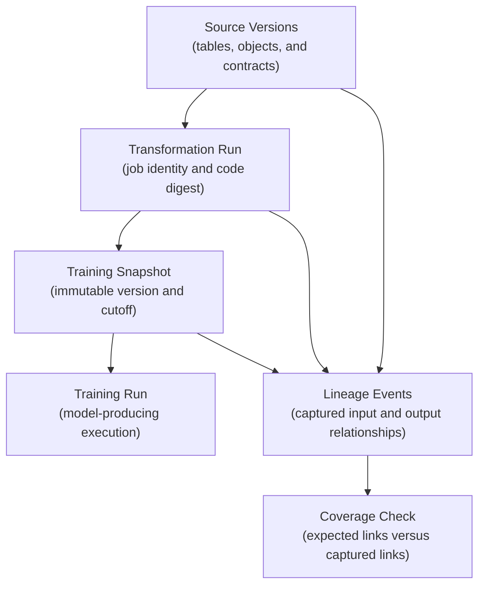
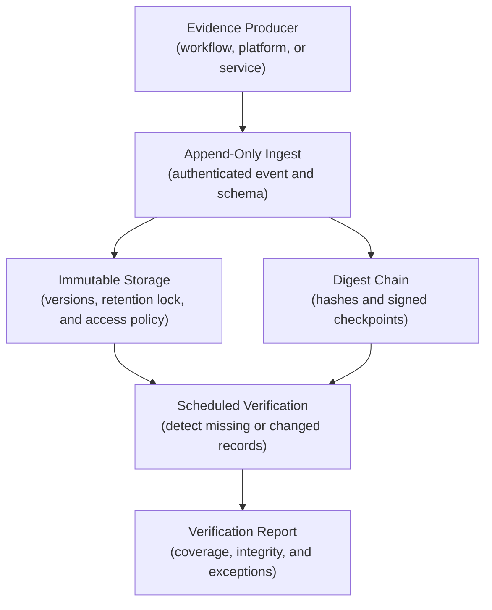
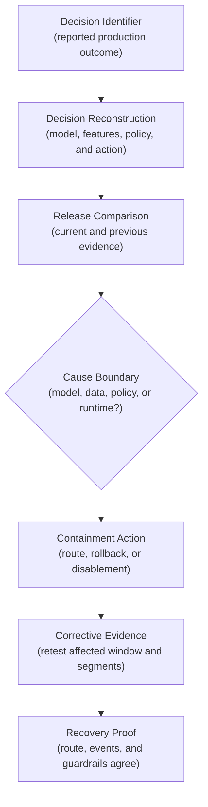

## Table of Contents

1. [What An ML Audit Trail Lets You Reconstruct](#what-an-ml-audit-trail-lets-you-reconstruct)
2. [How Runtime Logs, Build History, Data History, And Audit Records Differ](#how-runtime-logs-build-history-data-history-and-audit-records-differ)
3. [What To Record From Design Through Retirement](#what-to-record-from-design-through-retirement)
4. [Record What The System May Do And Who It Affects](#record-what-the-system-may-do-and-who-it-affects)
5. [Identify Data Snapshots And Lineage](#identify-data-snapshots-and-lineage)
6. [Record The Exact Code, Configuration, And Runtime](#record-the-exact-code-configuration-and-runtime)
7. [Record How Training Results Led To Approval](#record-how-training-results-led-to-approval)
8. [Record Registry And Release Decisions](#record-registry-and-release-decisions)
9. [Record What The Model Predicted And What The Product Did](#record-what-the-model-predicted-and-what-the-product-did)
10. [Record Monitoring Findings, Incidents, And Retirement](#record-monitoring-findings-incidents-and-retirement)
11. [What Every Audit Event Must Record](#what-every-audit-event-must-record)
12. [Control Who Can Read Audit Evidence And How Long It Remains](#control-who-can-read-audit-evidence-and-how-long-it-remains)
13. [Detect Changes To Important Audit Evidence](#detect-changes-to-important-audit-evidence)
14. [Check That Required Audit Records Are Present](#check-that-required-audit-records-are-present)
15. [Investigate A Production Decision](#investigate-a-production-decision)
16. [What Each Tool Records And What It Misses](#what-each-tool-records-and-what-it-misses)
17. [Main Idea](#main-idea)
18. [References](#references)

## What An ML Audit Trail Lets You Reconstruct
<!-- section-summary: An ML audit trail connects a production outcome to the evidence that created, approved, served, and later reviewed it. -->

At a high level, an **ML audit trail** is the durable evidence that lets an authorised person reconstruct the history of a model release or an individual model-assisted decision. The reviewer should be able to start from a complaint, incident, approval question, or prediction identifier and work back to the data, code, model, evaluation, and human decisions that shaped it.

Imagine a customer disputes a rejected application. The API log may show a successful response with status `200`. That record proves that the endpoint answered. It rarely proves which immutable model artifact produced the score, which policy converted the score into a rejection, which feature values were available at decision time, or who approved that combination for production. Those missing links are the reason an ML audit trail exists.

The trail should also move forward. An investigator may need the later label and monitoring alerts. Human overrides, incident records, corrective actions, and retirement decisions explain the response. This forward path shows how the organisation acted after the model produced its output.



This is a reconstruction system rather than a warehouse of every possible log line. The team decides which questions must remain answerable, then records enough linked evidence to answer them. A lower-risk recommendation may need sampled prediction evidence. A regulated eligibility decision may require a complete decision record for every case.

## How Runtime Logs, Build History, Data History, And Audit Records Differ
<!-- section-summary: Observability, provenance, lineage, and audit records answer related questions, yet each has a different purpose and retention model. -->

Logs, provenance, lineage, and audit records preserve different parts of the system's history. Treating them as interchangeable creates gaps because each one answers a different question and may follow a different retention policy.

### What Observability Shows About Runtime Behaviour

Logs, metrics, and traces help operators understand a running service. OpenTelemetry describes traces as the path of a request through distributed components. A trace contains spans, and each span represents one operation with timing and attributes. This is ideal for finding a slow feature lookup or a failed model call.

Observability data may be sampled, aggregated, or retained briefly to control cost. Those choices are reasonable for operations. They also mean a trace cannot be the only durable evidence for a consequential decision.

### What Provenance Shows About An Artifact's Origin

**Provenance** connects an artifact to the process that produced it. For a model image, that may include the source commit, build workflow, builder identity, dependencies, and artifact digest. SLSA defines provenance as verifiable information about where, when, and how an artifact was produced.

Provenance answers “How was this object built?” It does not explain why the business approved the model or which customer decision later used it.

### What Lineage Shows About Data Movement

**Data lineage** connects inputs, processing jobs, and outputs. OpenLineage models this around jobs, runs, and datasets, with facets that add details about execution and data. Unity Catalog can capture table and column lineage for supported Databricks workloads.

Lineage can show that a training table came from three prepared datasets. It may not capture an external manual file, an unsupported transformation, or the human decision to accept a data limitation. Completeness has to be tested rather than assumed.

### What Audit Records Show About Governed Actions

An audit record captures an action or decision that the organisation has chosen to preserve: an approval, deployment, policy change, access grant, prediction, exception, rollback, or retirement. It includes the actor, target, time, reason, and immutable references to relevant evidence.

The full audit trail links all four kinds of evidence. A trace ID helps locate runtime operations. A decision ID identifies the durable business event. Artifact digests and lineage identifiers connect that decision to reproducible technical inputs. Approval records explain the human authority behind the release.

## What To Record From Design Through Retirement
<!-- section-summary: A complete trail follows the model from its original purpose through production decisions and eventual retirement. -->

An audit trail must cover the system from its original purpose through deployment, production decisions, incidents, and retirement. Each lifecycle stage records evidence that the next stage can reference, starting before training with the approved purpose and accountable owner.



Each arrow should be joinable. The evaluation record refers to a model ID and data snapshot. The release record refers to the approved evaluation and artifact digest. The prediction event refers to the deployed route, model, and policy. The incident record refers to affected decision IDs and the corrective release.

The chain does not require one giant database. Mature systems usually keep evidence in the tool that owns it and place stable identifiers in a smaller audit index or evidence packet. This preserves system boundaries while still supporting investigation.

## Record What The System May Do And Who It Affects
<!-- section-summary: The first evidence explains the business decision, affected people, owner, acceptable use, and conditions that require review. -->

The first audit record states what the system may do, which decision or workflow it supports, and who may be affected. This **intended-use record** also names the person or service consuming the output, the action that follows, and the accountable owner.

Consider a model that predicts whether a machine needs preventive maintenance. A useful intended-use record says that the score helps a maintenance planner choose which machines receive inspection during the next shift. It states that the score cannot automatically shut down equipment and that safety alarms override it. False negatives risk unplanned failure; false positives consume inspection capacity. These facts determine the evaluation, monitoring, and approval evidence that later stages need.

The record should describe excluded uses as concrete boundaries. A model approved for prioritising human review should not silently become an automatic rejection system. The serving route and decision policy should carry an intended-use version so an investigator can see which boundary applied at the time.

Exceptions belong in the same history. If an owner accepts a temporary segment limitation, record the affected scope, compensating control, approver, expiry, and evidence required to close it. An exception without an expiry can quietly turn into permanent policy.

## Identify Data Snapshots And Lineage
<!-- section-summary: Training and decision evidence must point to the data versions that actually existed at the relevant time. -->

“Trained on the customer table” is too vague for reconstruction. Tables change and late records arrive. Corrections overwrite values, while feature code also evolves. The audit trail needs an immutable table version or snapshot identifier. An object manifest or content digest can identify the exact training input in other storage systems.

For lakehouse data, Delta table versions can identify a reproducible snapshot. For object storage, a manifest can list versioned object URIs and checksums. Warehouses may use time-travel snapshots or materialised training tables. The record should include the data contract version and the point-in-time cutoff used to prevent future information from leaking into training examples.

Lineage explains how that snapshot was produced. OpenLineage events can describe the job, run, input datasets, and output datasets. Unity Catalog provides governed lineage for supported Databricks operations and exposes lineage system tables for programmatic review. Its documentation also notes that lineage capture has limitations, so teams should test coverage for their actual languages, jobs, and external systems.

Suppose a performance regression appears only in one region. The investigator follows the training snapshot to its prepared feature table, then follows lineage to a regional source. A backfill job changed the meaning of a missing value two days before training. The lineage path narrows the search; the snapshot and job run provide the exact evidence needed to reproduce it.



## Record The Exact Code, Configuration, And Runtime
<!-- section-summary: Reproducibility requires immutable identities for source, configuration, dependencies, builder, and produced artifacts. -->

Reproducing a model requires more than its source files. A Git commit identifies the code, while hyperparameters, resolved dependencies, the base container, secrets, and environment variables can also change the resulting build or its data access.

Record the commit SHA, clean or dirty source state, training configuration digest, dependency lockfile digest, base-image digest, build-workflow identity, and final artifact digest. Keep secret values out of the record; store the secret name and version reference only where policy permits. The goal is to identify the environment without copying credentials into audit storage.

CI systems can produce a provenance attestation that binds source and build information to the output digest. SLSA build provenance provides an industry framework for this relationship. Sigstore Cosign can verify signatures and attestations attached to container images or blobs. The release workflow should verify the expected builder identity and artifact digest before deployment.

```yaml
evidence:
  source_commit: "7db4c67..."
  training_config_digest: "sha256:2d91..."
  dependency_lock_digest: "sha256:6b2e..."
  builder_identity: "github-actions:train-model"
  workflow_ref: ".github/workflows/train.yml@refs/heads/main"
  container_digest: "sha256:b48a..."
  model_artifact_digest: "sha256:ab17..."
  provenance_attestation: "oci://registry.example/ml/train@sha256:91fc..."
```

The record uses digests because tags and filenames can move. Verification means recalculating or checking those digests and confirming that the attestation's signer or workload identity matches the trusted build policy. Merely storing a checksum beside an object provides no protection if an attacker can replace both.

## Record How Training Results Led To Approval
<!-- section-summary: Training evidence identifies the execution, while evaluation and review explain why one model was considered suitable for release. -->

The audit trail must show which training execution produced the candidate, how that candidate was evaluated, and why a reviewer accepted or rejected it. MLflow Tracking commonly stores the run's parameters, metrics, datasets, artifacts, and identity. MLflow 3 also gives each Logged Model its own identity so later evidence can point to the exact artifact.

This distinction matters because one run can produce several checkpoints or candidates. A run ID identifies the execution. A logged-model ID identifies the exact model artifact being evaluated. The audit chain should use the model ID or artifact digest at every approval and release boundary.

Evaluation evidence should identify the tested dataset snapshot and evaluation code version. It records overall metrics and important segments. Calibration or threshold analysis explains how scores turn into decisions. Robustness checks, security checks, and comparison with the current production model complete the technical review. The record should also capture failures and accepted limitations. A screenshot of a dashboard is weak evidence because filters and underlying data can change.

The reviewer decision is its own event. Record the candidate model ID, evaluation report digest, decision, reviewer identity, authority used, comments or risk acceptance, and timestamp. Keep the review in an approval system or governed workflow rather than encoding a person's name in a mutable model tag.

For example, a candidate improves aggregate recall but performs worse for a low-volume equipment type. The reviewer rejects release and requests more data. The training metrics explain the measured result; the review event explains why the organisation did not promote it. Both belong in the trail.

## Record Registry And Release Decisions
<!-- section-summary: Registry and release records bind an approved artifact to the exact production route and rollback target. -->

A model registry gives governed models stable names, versions, aliases, tags, and access controls. It is the bridge between experimentation and release, although registry metadata alone cannot prove that production actually served a version.

The release event should identify the immutable registered-model version or Logged Model ID, artifact digest, serving image digest, evaluation decision, policy version, deployment workflow, actor or workload identity, previous route, and rollback target. It should also record the environment and the traffic change: registered, deployed dark, canary percentage, promoted, rolled back, or retired.

```json
{
  "event_type": "model_route_changed",
  "audit_event_id": "01J...",
  "occurred_at": "2026-08-02T10:41:27.318Z",
  "recorded_at": "2026-08-02T10:41:28.004Z",
  "actor": {"type": "workload", "id": "ci:release-model"},
  "target": {"endpoint": "risk-prod", "route": "champion"},
  "model": {"registered_version": "42", "artifact_digest": "sha256:ab17..."},
  "policy_version": "decision-policy-v9",
  "approval_id": "approval-01J...",
  "previous_model_version": "39",
  "traffic_percent": 10,
  "trace_id": "6c88..."
}
```

This envelope is intentionally focused. A schema registry or versioned contract should define required fields and enumerations. Detailed evaluation reports, build attestations, and deployment logs stay in their owning systems and appear as immutable references.

Human and workload identities should be distinguishable. A CI service may execute the change, while a named reviewer authorises it. Record both. Cloud audit logs then provide independent evidence that the workload called the deployment or registry API.

## Record What The Model Predicted And What The Product Did
<!-- section-summary: Runtime evidence should distinguish the model's output from the policy and business action that followed. -->

Production evidence needs both the model's output and the action that followed. A threshold, rules engine, human review, or product policy may turn one score into a very different product decision, so recording only the prediction leaves that step invisible.

Use a durable `prediction_id` for the model output and a `decision_id` for the governed action. The prediction record points to the immutable model and feature evidence. The decision record adds the policy version, thresholds or rules applied, outcome, downstream action, and human override if one occurred. One decision may use several predictions; one batch prediction may contribute to many decisions.

Suppose a fraud model returns `0.81`. Policy version 12 sends scores above `0.80` to manual review, and an analyst approves the payment after checking additional evidence. The audit trail should preserve all three stages: model score, policy route, and human resolution. Writing “model approved payment” would misstate the actual control flow.

Raw features and prompts often contain sensitive data. Store compact decision evidence, governed snapshot references, safe segment fields, and digests. Authorised investigators can follow those references to restricted source systems. Sampling may be reasonable for low-risk recommendations; high-impact automated decisions may require complete per-decision records under the applicable organisational and legal policy.

OpenTelemetry trace IDs help locate the API, feature-store, model-server, and rules-engine operations for one request. They are operational correlation identifiers, and sampling or retention can remove them. The durable decision ID remains the primary audit join. Store the trace ID as an optional pointer rather than treating it as the decision record.

## Record Monitoring Findings, Incidents, And Retirement
<!-- section-summary: Monitoring, investigation, corrective action, exception, and retirement records show how the organisation responded to production evidence. -->

Deployment does not end the audit history. Monitoring findings, investigations, corrective actions, exceptions, and retirement decisions show how the organization responded after the model began affecting real work.

Monitoring jobs should record the evaluated model route, prediction window, label window, dataset or query version, metric definitions, segment filters, thresholds, and resulting alerts. A chart without those identities may change after a dashboard query is edited.

An alert creates an investigation record. The record links affected model versions and decision populations to the evidence reviewed. The final action may be no change, a threshold adjustment, traffic reduction, rollback, retraining request, data repair, or temporary exception. Record the owner, authority, reason, effective time, and verification result.

Consider a monitoring alert for rising false negatives in one segment. The first investigation finds that label join coverage fell after an upstream schema change. The team repairs the outcome pipeline and reruns the same monitoring window before changing the model. The audit trail shows why no model rollback occurred: the evidence feed was incomplete, and the corrected run restored the metric.

Retirement is another governed event. Record the retired model and routes, replacement or archive location, unresolved exceptions, retention policy, and confirmation that endpoints or batch jobs no longer call it. A registry alias change alone may leave an old scheduled job active.

## What Every Audit Event Must Record
<!-- section-summary: Reliable reconstruction depends on append-only events, immutable object identities, explicit actors, and timestamps with known meaning. -->

Every audit event needs to identify what happened, who acted, which object changed, and which time the record describes. An **event** might record that a reviewer approved a candidate, a route changed, a policy was updated, or an exception expired. **State** describes the latest known condition, such as which model currently owns the `champion` alias.

State is useful for serving and dashboards. Events preserve history. If the registry only shows the current alias target, it cannot prove which version served last week. Store append-only route-change events and derive current state from them or reconcile them against the operational system.

Every event needs a globally unique event ID and schema version. The event type and two timestamps describe what happened and how it entered the store. Actor, target, action, and outcome describe the governed activity. Immutable references connect the activity to its evidence. Add a reason or approval reference for governed changes. Use UTC timestamps with an explicit offset and enough precision for the workload.

Two times matter because delivery can be delayed. `occurred_at` records the source event time; `recorded_at` shows arrival in the audit store. Clock skew, offline devices, batch uploads, and queue delays can change ordering. Use sequence numbers or source versions where exact order matters, and monitor the difference between the two timestamps.

Actor identity should distinguish a human, service account, workload identity, and delegated action. “admin” provides little evidence. A cloud audit record may show that a CI workload called an API; the approval record shows which person or group authorised the workflow. Preserve both relationships.

## Control Who Can Read Audit Evidence And How Long It Remains
<!-- section-summary: Audit evidence needs purpose-based retention, restricted access, privacy controls, and deletion behaviour designed before collection. -->

Audit records can expose model routes, service accounts, customer identifiers, feature names, prompts, decisions, and security events. Their sensitivity requires explicit access and retention rules. Access should follow least privilege, with separate roles for writing, operating the pipeline, investigating incidents, and administering retention.

Retention comes from the questions the organisation must answer and the policies that govern the decision. Runtime traces may be useful for weeks. Release and approval events may need to remain for the lifetime of a model plus an archive period. High-impact decision evidence may follow a case or regulatory retention schedule. Avoid copying one duration across every evidence class.

Data minimisation should happen at the producer. Use opaque IDs, safe segments, digests, and governed source references. Redaction after central ingestion leaves sensitive values in queues, backups, and intermediate logs. Hashing an email or small identifier set does not make it anonymous because attackers can guess likely values.

Deletion and legal hold can conflict with ordinary expiry. Define which system owns deletion requests, which derived records must be removed or de-identified, and which records have a justified retention obligation. Keep a deletion event that proves the action without retaining the deleted sensitive content.

Audit access also needs an audit trail. Record who searched or exported sensitive evidence, the approved case or incident, and the result. Databricks warns that exported system-table information can expose sensitive deployment data; the same risk applies to cloud audit exports and central security lakes.

## Detect Changes To Important Audit Evidence
<!-- section-summary: Append-only storage, retention locks, signed digests, and independent control planes help reveal modification or deletion. -->

Important audit evidence needs controls that reveal or prevent later modification. “Immutable” can describe several strengths: an append-only table prevents normal application updates, object versioning preserves older versions, and write-once-read-many storage can block overwrite and deletion for a retention period. Cryptographic signatures and hash chains make later changes detectable.

Choose the strength from the threat and evidence value. Ordinary operational records may use tightly controlled append-only tables and backups. Release approvals, build attestations, and security audit logs may justify stronger storage. Amazon S3 Object Lock provides governance and compliance retention modes; compliance mode prevents deletion during retention even by the account root user. Other clouds offer equivalent immutable-storage controls.

CloudTrail can deliver signed digest files that contain hashes of delivered log files and chain to earlier digests. Its validation command detects modification or deletion in the referenced trail files. Enabling digest delivery is only the first step; teams should schedule validation and alert on failures.

Artifact signing addresses a different threat. A signed container digest or model bundle lets deployment verify that the artifact came from an approved builder and has not changed. Cosign supports signature and attestation verification. The release policy must verify signer identity and artifact claims rather than accepting the presence of any signature.



## Check That Required Audit Records Are Present
<!-- section-summary: An audit trail is trustworthy only after teams test required links, delivery coverage, retention, and integrity. -->

An audit trail can appear healthy while required records are missing. A new serving path may omit the decision ID, a telemetry sampler may drop traces, or a lineage integration may not support one transformation engine. Regional exports can stop delivering, and schema changes can send events to a dead-letter queue.

Define a required evidence contract for each governed workflow. A production release may require its intended-use version, candidate model ID, and data snapshot.

Evaluation decision, artifact digest, and approver connect the technical result to authority. Workload identity, route event, and rollback target describe the production change. A prediction path may require model and policy identity plus decision and source-snapshot references according to its risk tier.

Reconciliation compares independent systems. Join deployed route events to registry versions. Join registered model artifacts to training runs and evaluation decisions. Compare CI deployments with cloud audit API calls. Compare prediction counts with decision-event counts. Missing links create a measurable completeness rate and an owner for repair.

```sql
SELECT
  r.release_event_id,
  r.model_id,
  r.approval_id,
  CASE
    WHEN m.model_id IS NULL THEN 'missing_model'
    WHEN a.approval_id IS NULL THEN 'missing_approval'
    WHEN r.artifact_digest <> m.artifact_digest THEN 'digest_mismatch'
    ELSE 'complete'
  END AS evidence_status
FROM audit.model_release_events AS r
LEFT JOIN governance.model_inventory AS m USING (model_id)
LEFT JOIN governance.approval_events AS a USING (approval_id);
```

Run this kind of control continuously and before sensitive releases. Test retention by retrieving records near the oldest required boundary. Test restoration from backup. Validate object locks and digest chains. Exercise an investigation with a known decision ID and measure whether a reviewer can reach each required stage without privileged tribal knowledge.

## Investigate A Production Decision
<!-- section-summary: A concrete investigation shows how linked evidence guides containment, root cause analysis, and recovery proof. -->

Suppose a user reports that a risk decision was inconsistent with a similar case from the previous week. Support provides the durable `decision_id`. The investigator retrieves the prediction, policy result, human override state, model version, feature snapshot, and trace pointer.

The two decisions used the same model artifact. Their policy versions differ because a release changed the manual-review threshold. The release event links the newer policy to an approval, CI workflow, and canary report. Cloud audit logs confirm that the approved workload changed the route. The policy was released correctly, so rolling back the model would not address the cause.

Segment evidence shows that the new threshold sends too few borderline cases to review. The release owner routes new traffic back to the previous policy version, leaves the model artifact unchanged, and records the containment event. A follow-up evaluation tests the corrected threshold on the original decision window and affected segments.

Recovery requires more than a healthy API. The route record must show the intended policy version. New decision events must carry it. The affected-segment review rate must return inside its guardrail. The incident record then links the cause, containment, corrective evaluation, restored route, and verification results.



## What Each Tool Records And What It Misses
<!-- section-summary: Industrial tools contribute different parts of the evidence chain and should be joined through stable identifiers. -->

No single tool records the complete lifecycle. MLflow Tracking and MLflow 3 Logged Models can identify experiments, runs, datasets, metrics, artifacts, and individual model objects. A managed or open-source model registry adds governed names, versions, aliases, and access controls. These systems own model-development and registry evidence; they do not replace deployment or business-decision records.

Unity Catalog can govern data and AI assets and capture supported lineage. OpenLineage offers a provider-neutral event model for jobs, runs, and datasets across compatible tools. Neither automatically captures every external transformation, so coverage checks and custom integrations remain part of the design.

Git and CI systems identify reviewed source and the workflow that executed a build. SLSA provenance and signed attestations bind build inputs and builder identity to artifact digests. Container registries and object stores preserve the artifacts. Deployment platforms and cloud audit logs record which workload changed production state.

OpenTelemetry correlates runtime operations through traces, spans, logs, and context propagation. It helps locate the technical path behind a prediction. A governed decision store preserves the durable decision ID, model and policy identity, output, action, and later outcome.

Cloud audit systems such as AWS CloudTrail, Google Cloud Audit Logs, and Azure Activity Log provide provider-side evidence of control-plane actions. Immutable object storage and security archives protect selected records according to the retention policy. A warehouse or audit index joins references across these systems and runs completeness controls.

The architecture works because each tool owns a clear part of the chain. Stable identifiers and digests cross the boundaries. Copying every raw record into one ungoverned table would increase exposure and still leave meaning unresolved.

## Main Idea
<!-- section-summary: A useful ML audit trail reconstructs purpose, production action, and organisational response through verified linked evidence. -->

An ML audit trail should let an authorised reviewer start from a model release or production decision and reach the full evidence chain. That chain covers intended use, governed data, reproducible build inputs, training, evaluation, approval, registry identity, deployment route, prediction, business action, monitoring, incident response, exceptions, and retirement.

Logs, traces, lineage, provenance, registries, and cloud audit records each contribute evidence. Durable decision IDs, immutable artifact and data identities, explicit actors, meaningful timestamps, protected retention, and continuous reconciliation connect them. The result is a history that engineers can investigate, reviewers can verify, and owners can act on.

## References

- [MLflow Tracking](https://mlflow.org/docs/latest/ml/tracking/)
- [MLflow Logged Models](https://mlflow.org/docs/latest/ml/tracking/model-tracking/)
- [MLflow Model Registry](https://mlflow.org/docs/latest/ml/model-registry/)
- [Databricks Unity Catalog lineage](https://docs.databricks.com/aws/en/data-governance/unity-catalog/data-lineage)
- [Databricks lineage system tables](https://docs.databricks.com/aws/en/admin/system-tables/lineage)
- [Databricks audit log system table](https://docs.databricks.com/aws/en/admin/system-tables/audit-logs)
- [OpenLineage specification](https://openlineage.io/docs/spec/)
- [OpenLineage facets](https://openlineage.io/docs/spec/facets/)
- [OpenTelemetry signals](https://opentelemetry.io/docs/concepts/signals/)
- [OpenTelemetry specification overview](https://opentelemetry.io/docs/specs/otel/overview/)
- [SLSA provenance](https://slsa.dev/spec/v1.2/provenance)
- [Sigstore Cosign signature verification](https://docs.sigstore.dev/cosign/verifying/verify/)
- [AWS CloudTrail log-file integrity validation](https://docs.aws.amazon.com/awscloudtrail/latest/userguide/cloudtrail-log-file-validation-intro.html)
- [Amazon S3 Object Lock](https://docs.aws.amazon.com/AmazonS3/latest/userguide/object-lock.html)
- [Google Cloud Audit Logs overview](https://cloud.google.com/logging/docs/audit)
- [Azure Activity Log](https://learn.microsoft.com/azure/azure-monitor/platform/activity-log)
- [OWASP Logging Cheat Sheet](https://cheatsheetseries.owasp.org/cheatsheets/Logging_Cheat_Sheet.html)
