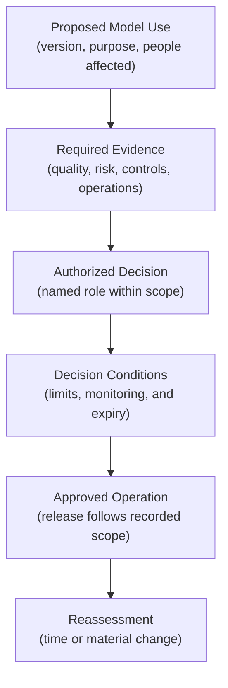
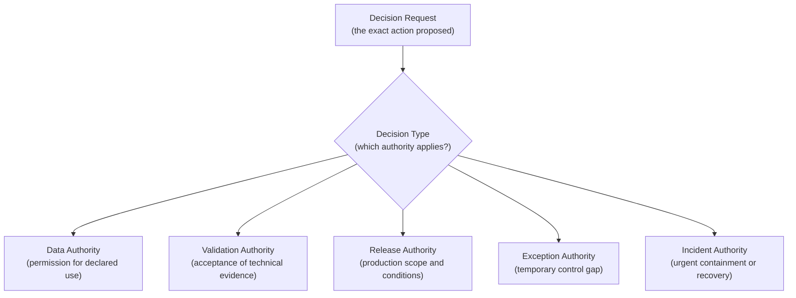
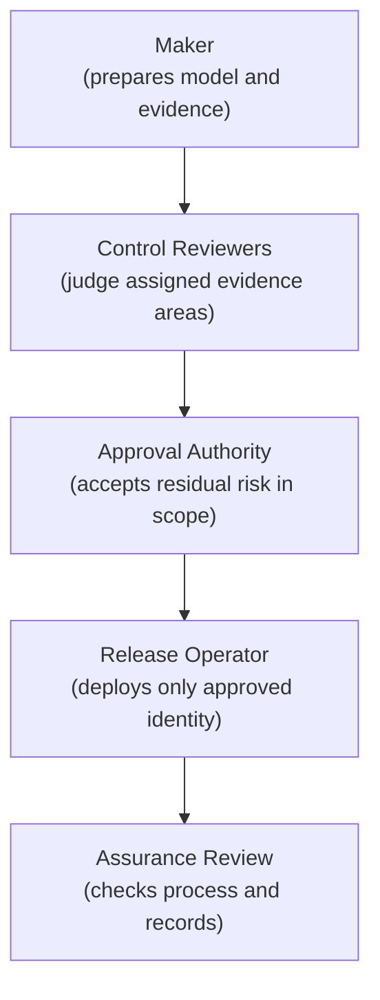
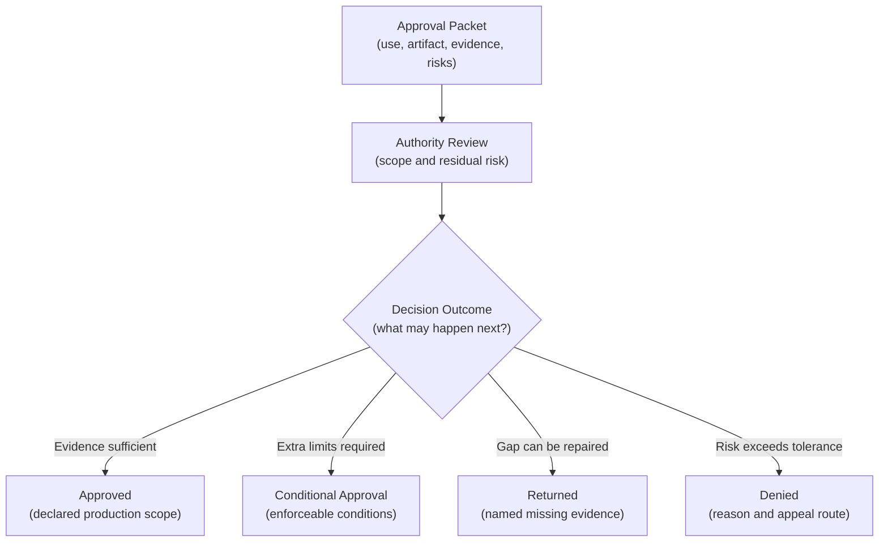
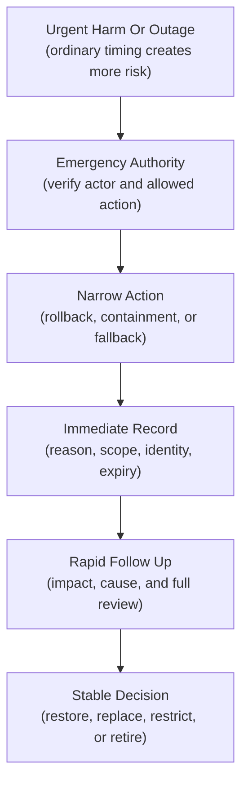
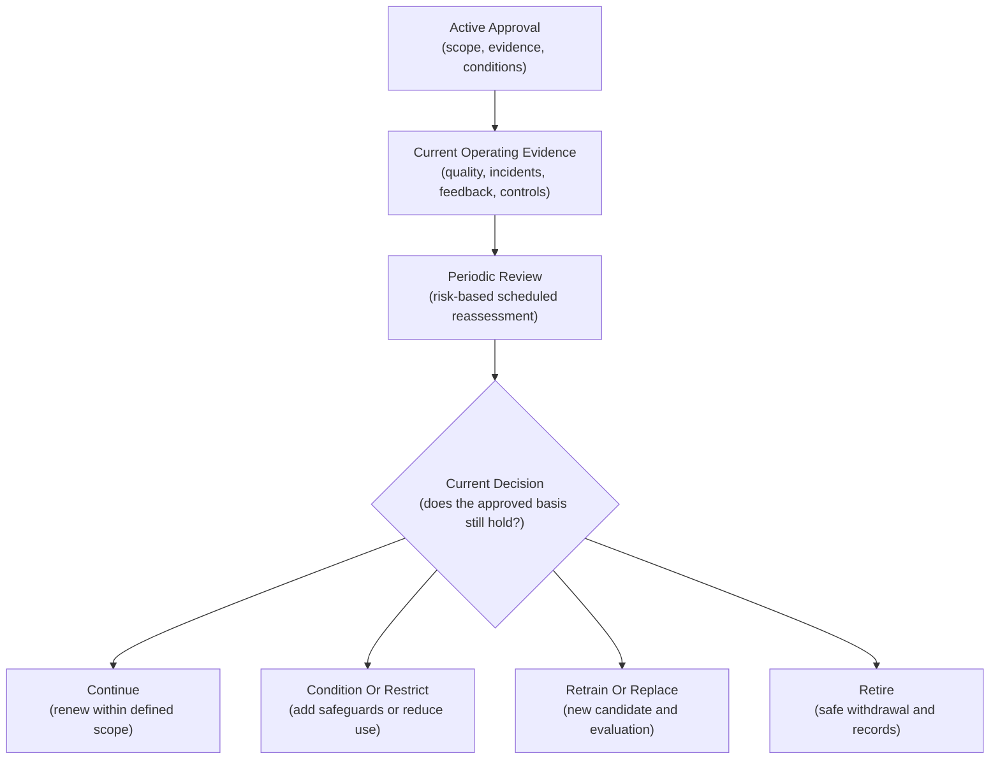
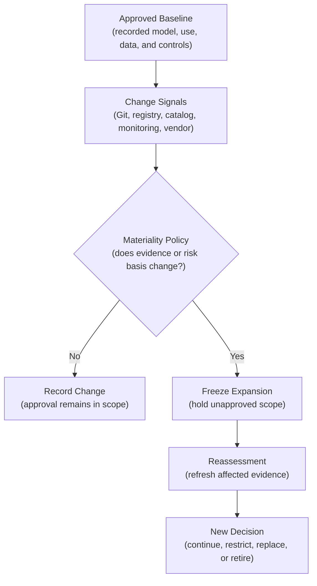
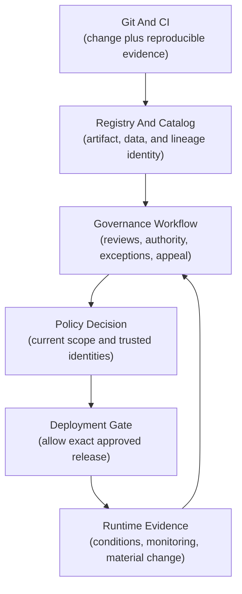

## Table of Contents

1. [Why Governance Decisions Need Named Authority](#why-governance-decisions-need-named-authority)
2. [Different Decisions Need Different Authorities](#different-decisions-need-different-authorities)
3. [Separate The Person Proposing A Change From The Person Approving It](#separate-the-person-proposing-a-change-from-the-person-approving-it)
4. [Base Approval On Evidence And Recorded Conditions](#base-approval-on-evidence-and-recorded-conditions)
5. [Use A Shorter Controlled Path For Emergency Release](#use-a-shorter-controlled-path-for-emergency-release)
6. [Exceptions Waivers And Risk Acceptance Mean Different Things](#exceptions-waivers-and-risk-acceptance-mean-different-things)
7. [Exceptions Need Automatic Expiry And Escalation](#exceptions-need-automatic-expiry-and-escalation)
8. [Review A Live Approval On A Schedule](#review-a-live-approval-on-a-schedule)
9. [Review Early After A Major System Change](#review-early-after-a-major-system-change)
10. [A Review Can Continue Restrict Retrain Or Retire](#a-review-can-continue-restrict-retrain-or-retire)
11. [Review Supplier And Platform Changes That Affect The System](#review-supplier-and-platform-changes-that-affect-the-system)
12. [Disagreement Needs An Appeal Route](#disagreement-needs-an-appeal-route)
13. [How Engineering Tools Enforce An Approval](#how-engineering-tools-enforce-an-approval)
14. [What The Final Audit Record Must Show](#what-the-final-audit-record-must-show)
15. [The Main Idea](#the-main-idea)
16. [References](#references)

## Why Governance Decisions Need Named Authority

<!-- section-summary: Governance connects a decision to a named authority, a defined scope, current evidence, and a period of validity. -->

At a high level, **approval authority** is the formally assigned power to decide
whether an AI system may proceed for a particular use. The authority belongs to
a role or governing body with a declared scope. It does not arise from
seniority, repository access, or familiarity with the model.

Imagine a model that prioritizes applications for human review. Its evaluation
report shows strong overall accuracy, a small performance gap for one segment,
and a monitoring plan for that gap. Someone must decide whether the remaining
risk is acceptable. The model developer can explain the evidence. The production
engineer can deploy the artifact. Neither fact establishes who may accept the
residual risk for this use.

**Residual risk** means the risk left after the team applies its controls. An
approval records that an authorized decision-maker considered that remaining
risk against the organization’s policy and allowed a defined next step. The
scope might permit a limited pilot, a production canary, or full deployment. It
may cover one model version, one purpose, one region, and one time period.

Named authority solves three practical problems. The team knows where to send
the decision. The approver knows what they are accountable for. An investigator
can later reconstruct why the system was allowed to operate.



This lifecycle aligns with the NIST AI RMF GOVERN function. GOVERN 2.1 calls for
clear roles, responsibilities, and communication. GOVERN 1.5 calls for ongoing
monitoring and periodic review with defined roles and review frequency. The NIST
Playbook also suggests policies for approval, conditional approval, and
disapproval. ISO/IEC 42001 takes a management-system view: organizations
establish, operate, maintain, and continually improve the processes used to
govern AI. ISO/IEC 23894 supplies guidance for integrating AI risk management
into organizational activities.

These frameworks describe outcomes and management responsibilities. Each
organization still has to translate them into decision roles, evidence
requirements, workflows, and technical gates that fit its context.

## Different Decisions Need Different Authorities

<!-- section-summary: Data use, model release, policy change, exception, emergency action, and retirement are separate decisions with separate accountability. -->

“The model was approved” can hide several different decisions. A data owner may
approve the intended use of a dataset. A model-risk reviewer may accept
validation evidence. A product owner may approve the way predictions influence
users. A release authority may allow production traffic. An incident commander
may order an emergency rollback.

An **authority matrix** maps each decision type to the role that may make it,
the evidence that role needs, and the scope of its power. In simple terms, it
answers: who can decide what, under which conditions?

The matrix should use decisions instead of broad job titles. “ML lead” is
ambiguous. “May approve medium-risk model versions for an internal
recommendation use after required validation” is testable. The role’s authority
can be limited by risk tier, business area, environment, region, traffic
percentage, financial exposure, or duration.

The following compact matrix illustrates the distinction. A real policy adds
named role groups, escalation routes, and local risk tiers.

| Decision                   | Typical authority                       | Evidence the authority needs                             | Common scope limit             |
| -------------------------- | --------------------------------------- | -------------------------------------------------------- | ------------------------------ |
| Approve data use           | Data owner or data-governance role      | Provenance, consent or use basis, quality, retention     | Dataset, purpose, region       |
| Accept model validation    | Independent validation role             | Test design, metrics, slices, limitations                | Model version and intended use |
| Approve production use     | Accountable product or risk authority   | Accepted controls, residual risks, runbook, monitoring   | Environment, traffic, duration |
| Approve an exception       | Designated exception or risk authority  | Gap, rationale, compensating controls, owner, expiry     | One control and one release    |
| Authorize emergency action | Incident authority                      | Active harm or outage, recovery plan, time limit         | Incident and temporary change  |
| Retire the system          | System owner plus accountable authority | Replacement, dependency analysis, records, safe shutdown | System or use case             |

A high-impact decision may require a committee or two independent approvals. A
low-risk internal experiment may use one trained owner. The degree of
independence should follow possible harm, reversibility, scale, and uncertainty.



Avoid one universal `ml-admin` group that can alter policy, approve evidence,
promote models, and bypass deployment gates. Broad access makes the identity of
the decision-maker less meaningful.

## Separate The Person Proposing A Change From The Person Approving It

<!-- section-summary: Maker-checker control gives the proposal and the independent judgment to different people or groups. -->

A governance decision needs distance between the person proposing a change and
the person judging whether it meets the required standard. This control pattern
is called **maker-checker**: the maker prepares the request, while the checker
reviews it. In model governance, the developer or model owner is often the
maker, while a validator, risk owner, or release authority acts as the checker.

This separation reduces self-review. A developer who chose the training data,
metric, and threshold has valuable context and may also share the same
assumptions that created a weakness. An independent reviewer brings a different
responsibility and can challenge the evidence without pressure to defend the
work.

**Segregation of duties** is the broader design principle behind maker-checker.
Sensitive powers are distributed so one identity cannot prepare evidence,
approve the same evidence, change the approval policy, and release the system
alone. Static controls keep conflicting roles apart. Runtime controls inspect
the identities attached to a specific request.

Independence should be proportional to risk. A reversible internal ranking
experiment may need peer review. A model that influences access to an important
service may need separate domain, risk, privacy, security, and accountable-use
judgments. Adding reviewers without distinct responsibilities creates ceremony.
Each checker should own a defined question.

For example, a security reviewer asks whether the serving path and artifact
supply chain meet security controls. A domain reviewer asks whether the outcome
and limitations make sense in practice. A model validator asks whether the
evaluation supports the stated claims. The final authority considers the
accepted evidence and residual risks as a whole.



The system should compare immutable identity IDs, not display names. A person
changing teams, a shared account, or two service accounts controlled by the same
pipeline can otherwise defeat the intended separation.

## Base Approval On Evidence And Recorded Conditions

<!-- section-summary: An approval packet connects a specific model use to current evidence, accepted residual risks, operating limits, and a review date. -->

An approver needs a decision-ready evidence packet. This is a coherent set of
records that explains the proposed use, the tested artifact, the main risks, the
controls, and the operational plan. A folder full of links makes the approver
search for the actual decision.

Begin with the intended use. State which decision the model supports, who or
what consumes the output, which people may be affected, and which uses are
excluded. Then identify the exact model artifact, feature or prompt contract,
preprocessing, policy thresholds, and deployment target.

The quality evidence should match the decision. Include validation results,
meaningful slices, calibration or threshold analysis, known limitations,
robustness tests, and comparison with the current production baseline. Risk
evidence may cover privacy, security, fairness, safety, human oversight,
explainability, and legal or contractual obligations according to the context.

Operational evidence shows that the team can run the system responsibly. It
includes service objectives, monitoring coverage, alert ownership, fallback
behaviour, rollback evidence, incident response, data retention, access
controls, and a plan for collecting outcomes after deployment.

An authority can reach several results:

- **Approved** means the use may proceed within the recorded scope.
- **Conditionally approved** means the use may proceed only while explicit
  conditions remain satisfied.
- **Denied** means the evidence or residual risk does not support the requested
  use.
- **Returned for evidence** means the decision remains open because a named gap
  needs work.

Conditions must be machine-checkable or assigned to a named owner. “Monitor
carefully” is too vague. “Limit traffic to 10%, alert if the protected-segment
recall proxy breaches its boundary, and review after 14 days” gives operators an
enforceable boundary.



Record any condition with an owner, measurement source, threshold, start time,
and consequence of breach. A condition that nobody observes cannot protect the
approved use.

## Use A Shorter Controlled Path For Emergency Release

<!-- section-summary: Emergency authority permits urgent containment or recovery through a predefined path with narrow scope and rapid follow-up review. -->

An incident can make the ordinary approval timeline unsafe. A harmful prediction
pattern may require immediate rollback. A critical vulnerability may require a
runtime patch. A failed dependency may require a temporary fallback model.

**Emergency authority** is the predefined power to take a narrow urgent action
for containment or recovery. It does not give an operator permanent freedom to
skip governance. The emergency path identifies who can declare the emergency,
which actions they may authorize, how long the authority lasts, and which
evidence can arrive after the action.

Suppose a live model begins routing an unusual number of cases away from
required human review. The incident commander can direct traffic to the last
approved model immediately. The decision record captures the triggering signal,
affected release, rollback target, commander identity, and start time. A
follow-up review then determines cause, impact, corrective action, and whether
service may return to the newer model.

A riskier emergency change, such as deploying an unplanned fallback, should use
the smallest traffic scope and strongest available compensating controls. These
may include human review of every output, tighter rate limits, disabled
automation, enhanced monitoring, or a short expiry.



Test the emergency path before an incident. Verify identity, rollback access,
notification, record creation, and recovery timing. A theoretical break-glass
process can fail at the moment it is most needed.

## Exceptions Waivers And Risk Acceptance Mean Different Things

<!-- section-summary: Exceptions, waivers, and risk acceptance record different departures or decisions and should remain distinct in policy and tooling. -->

Governance language often mixes three concepts that lead to different actions.
All three allow a team to proceed, yet they change different parts of the
governance decision. Clear vocabulary prevents a temporary control gap from
being recorded as permanent acceptance or an inapplicable rule.

### Exception

An **exception** permits a temporary departure from one named policy control.
The control still applies. The record explains why it cannot currently be met
and how the team reduces risk during the gap.

### Waiver

A **waiver** removes or relaxes a requirement for a defined scope through the
authority that owns that requirement. Some organizations use “waiver” as a
synonym for exception. If both terms exist, policy should define the
distinction. A common convention reserves waiver for a policy-level
determination that a requirement does not apply to a specific case, while
exception covers temporary non-compliance with an applicable requirement.

### Risk Acceptance

**Risk acceptance** records an authorized decision to tolerate a known residual
risk. It may accompany an approval even if every required control is complete. A
model can satisfy its controls and still carry residual error, misuse, or
operational risk.

Consider a production release whose independent documentation review will finish
in two weeks. If the documentation control applies and the team wants to release
early, it requests an exception. It names that control, supplies the draft
evidence, limits traffic, assigns an owner, and sets a two-week expiry. If
policy says the control was designed only for external decisions and the use is
strictly internal, the policy owner may grant a scoped waiver. If all controls
pass and the decision-maker accepts a documented rare-error risk, that is risk
acceptance.

An exception record needs:

- the exact control and release scope;
- the reason for the gap and remaining risk;
- compensating controls that operate during the gap;
- an accountable owner and remediation plan;
- independent approval under the exception policy;
- an expiry and the action taken at expiry.

Some controls should be declared non-exceptionable. A workflow should reject the
request immediately if policy forbids temporary operation without that control.

## Exceptions Need Automatic Expiry And Escalation

<!-- section-summary: An exception ends automatically at its deadline and drives escalation before the connected approval loses its basis. -->

An exception without automatic expiry can turn temporary debt into permanent
practice. The workflow should calculate an end timestamp from policy, store it
with the exception, and prevent renewal through a silent field edit.

The connected model approval cannot outlive a required exception. If a model
receives six months of approval and one required control has a 14-day exception,
the approved use needs a decision at or before day 14. The team can complete the
control, obtain a newly evaluated exception, restrict the use, or stop the
release.

Escalation begins before expiry. The owner receives an early reminder with the
missing evidence and remediation task. The accountable system owner and
exception authority receive later warnings. If the deadline passes, the system
changes the exception to `expired` and triggers the policy consequence. That
consequence may block the next deployment, freeze traffic expansion, route all
outputs to human review, or remove the model from service.

```yaml
exception:
  id: exc-0182
  control_id: independent-segment-review
  release_id: model-release-47
  rationale: review evidence will complete after the limited pilot starts
  compensating_controls:
    - traffic_percentage_lte_5
    - human_review_for_every_positive_decision
  owner: identity://model-risk-owner
  approved_by:
    - identity://exception-authority-a
    - identity://exception-authority-b
  expires_at: 2026-09-14T16:00:00Z
  expiry_action: stop_candidate_traffic
```

The values illustrate the contract. In production, the workflow derives maximum
duration and valid approver roles from versioned policy. It also verifies
distinct identities, connects each compensating control to telemetry, and
prevents the requester from approving their own exception.

Repeated exceptions deserve a separate signal. Three requests for the same
control gap may indicate an unrealistic policy, a missing platform capability,
or a team avoiding remediation. Escalate the pattern to the policy owner instead
of treating each request as unrelated.

## Review A Live Approval On A Schedule

<!-- section-summary: Periodic review reassesses an approved system at a risk-based cadence using current evidence and operating context. -->

A production approval needs a scheduled reassessment because its data, use,
controls, suppliers, and operating conditions can change. This **periodic
review** asks whether the current evidence still supports the live decision,
even if the model artifact itself has not changed.

Cadence should follow risk and rate of change. A high-impact model with rapid
data drift may need frequent review. A stable low-impact internal tool may use a
longer interval. Risk policy sets the maximum interval, and the approval
authority can require an earlier review as a condition.

The review packet starts from the previous decision and adds live evidence.
Typical inputs include production quality, drift, incidents, appeals, overrides,
security findings, data changes, monitored segments, human-review outcomes,
exception history, vendor notices, and whether the intended use expanded.

This is more than checking that documents exist. Reviewers ask whether the
controls worked. A monitoring dashboard may be present while labels arrive too
late to detect harm. A human-review control may exist while reviewers routinely
accept recommendations without investigation. Periodic review examines
effectiveness as well as presence.



The NIST AI RMF places periodic review inside ongoing governance, and its
Playbook emphasizes continual improvement rather than a one-time checklist.
ISO/IEC 42001 likewise frames AI governance as a management system that is
maintained and continually improved.

## Review Early After A Major System Change

<!-- section-summary: Material-change rules detect changes large enough to invalidate the evidence, scope, or risk assumptions behind an approval. -->

A scheduled review can be months away while the system changes today. **Material
change** means a change significant enough to question the basis of the current
approval. It triggers reassessment before the ordinary review date.

Policy should define materiality for the system class. Useful triggers include:

- a new model artifact, architecture, foundation model, or quantization path;
- a changed training dataset, feature source, prompt, retrieval corpus, or label
  definition;
- a new intended use, user group, region, language, or automated action;
- movement in quality, calibration, drift, incident, complaint, or appeal
  signals beyond a limit;
- a changed policy threshold, human-oversight design, fallback, or monitoring
  control;
- a severe vulnerability or a major change in a cloud, model, data, or API
  provider.

Detection can combine declarations and automation. A pull request template asks
whether the use, data, model, or control changed. CI compares model and
preprocessing digests. The registry records a new artifact. The catalog reports
a data-contract or lineage change. Monitoring opens a review after a risk
threshold breach. Procurement or vendor management supplies third-party notices.



Material change does not always require repeating every review. Reassess the
evidence affected by the change and confirm that the remaining decision packet
is still current. A new serving image may require security and operational
review while leaving the validated model metrics unchanged. A new population or
decision use usually requires broader evaluation.

## A Review Can Continue Restrict Retrain Or Retire

<!-- section-summary: Review outcomes change the operating decision according to current evidence instead of merely marking the review complete. -->

A periodic or event-driven review must produce an operational result. “Reviewed”
says nothing about what the system may do next.

**Continue** renews the approval within a defined scope and duration. **Continue
with conditions** adds monitoring, human oversight, evidence, or a shorter
review interval. **Restrict** narrows traffic, population, geography,
automation, or available actions. **Retrain or replace** starts a new candidate
lifecycle while the current system follows an explicit interim policy.
**Suspend** stops the use temporarily. **Retire** withdraws the system and
manages its dependencies, records, and replacement.

Suppose monitoring shows stable overall quality but declining recall for a small
high-impact segment. The authority could restrict automatic decisions for that
segment, route them to trained reviewers, require a retrained candidate, and set
a near-term review. That result is more precise than either approving everything
or shutting down the entire service.

Every outcome needs an effective time, owner, implementation state, and
verification step. A restriction written in a ticket has no effect until routing
or policy enforcement changes. The governance workflow should keep the decision
pending until the operational system reports the expected state.

Retirement deserves the same care as deployment. Identify callers, archive
required evidence, revoke credentials, stop monitoring that no longer serves a
purpose, preserve records according to retention policy, and verify that traffic
no longer reaches the retired model.

## Review Supplier And Platform Changes That Affect The System

<!-- section-summary: A change in an external model, API, dataset, library, or cloud service can alter the evidence behind an approved system. -->

Supplier and platform changes can alter a production system even if the
organization's application code stays unchanged. A third party may supply a
foundation model, hosted API, dataset, moderation service, feature feed, serving
runtime, or cloud control, and each dependency belongs in the review scope.

The approval record should identify third-party dependencies and the properties
the decision relies on: model or API version, data-use terms, retention
behaviour, region, safety controls, availability, evaluation results, and
notification commitments. Procurement evidence and technical evidence belong to
the same review boundary because either can invalidate the approved use.

NIST AI RMF GOVERN 6 addresses policies and accountability for third-party AI
risks, while MANAGE 3 addresses monitoring and response for third-party
components. ISO/IEC 23894 covers organizations that develop, provide, deploy, or
use AI systems, which supports examining risk across those dependency
relationships.

If a hosted model provider changes a default model alias, the application may
receive different outputs without changing its own Git commit. Pin a version
where the provider supports it. Detect response metadata or model identity.
Rerun representative evaluations before adopting a new version. If pinning is
unavailable, policy should require stronger monitoring, a fallback, and an
explicit response to vendor change notices.

A provider change can lead to the same outcomes as an internal change: continue
after evidence refresh, restrict use, switch to an approved fallback, negotiate
a control, or retire the dependency.

## Disagreement Needs An Appeal Route

<!-- section-summary: An appeal reviews the evidence, policy interpretation, or process through an authority distinct from the original disputed decision. -->

Reasonable reviewers can disagree. Evidence may be incomplete, policy language
may be ambiguous, and different risks can pull in opposite directions. A
governance process needs a documented way to challenge a decision without
informal pressure on the original reviewer.

An **appeal** asks a designated authority to reconsider a decision or process.
The requester states what they dispute: a factual error, missing evidence,
inconsistent policy application, a disproportionate condition, or a process
failure. The original decision remains effective during the appeal unless policy
grants a temporary hold or emergency action.

The appeal reviewer should be independent of the disputed decision and have
authority over the relevant policy. They can uphold the decision, request new
evidence, modify conditions, return the matter for a fresh review, or identify a
policy issue for the policy owner. Record the reasoning either way.

Appeals are also governance feedback. Repeated disputes about one rule can
reveal unclear policy. A pattern affecting one team or population may reveal
inconsistent application. Periodic process review should analyze appeal
outcomes, reversals, processing time, and recurring causes.

## How Engineering Tools Enforce An Approval

<!-- section-summary: Git, CI, registries, catalogs, workflow systems, policy engines, and deployment gates each enforce one part of the governance decision. -->

An approval reaches production through several engineering tools. Each tool
enforces the part it can verify and links its result to one shared decision
identity. This prevents a collection of green checks from referring to
different artifacts or policy versions.

### Use Git And CI To Record The Proposed Change

**Git and code review** hold versioned policy, evaluation code, infrastructure,
and change proposals. Branch protection and CODEOWNERS can require review from
the teams that own specific policy or deployment files. Git records the proposed
change; it should link to the model and governance decision instead of
pretending that code review alone approves model use.

**CI** builds the evidence packet. It can verify artifact digests, run quality
gates, check required reports, compare policy versions, and publish signed
results. CI should fail if evidence refers to a different model, data snapshot,
preprocessing package, or threshold policy.

### Use Registries And Catalogs To Identify Approved Assets

**Model registries and data catalogs** hold governed identities and lineage. A
registry such as Amazon SageMaker Model Registry stores versioned model packages and
exposes approval status. Models in Unity Catalog or another governed registry
can carry permissions and lineage. Treat a registry status as an enforcement
signal backed by the full decision record, not as the complete approval itself.

### Use Workflow Systems To Coordinate Human Decisions

**Ticket or workflow systems** coordinate human tasks, due dates, evidence,
conditions, appeals, and exception remediation. They need stable IDs and
append-only decision history. Closing a ticket should not grant deployment
unless the decision service has produced an approved, current result.

### Use Policy Engines To Check The Current Approval Scope

**Policy engines** evaluate machine-readable rules against trusted facts. Open
Policy Agent can load versioned policy bundles and emit decision logs containing
the queried policy, inputs, and bundle metadata. Sensitive fields require
masking before logs leave the enforcement point. The engine is well suited to
questions such as whether the approval is current, the artifact digest matches,
the environment is inside scope, and the requester differs from the approver.

### Block Deployment Unless The Approval Is Current

**Deployment gates** block release until the decision is valid. GitHub Actions
environments support required reviewers, optional prevention of self-review, and
deployment protection rules. A custom protection rule can query an external
governance service. GitHub currently documents custom deployment protection
rules as Public Preview and subject to change. Platform availability, repository
visibility, and plan restrictions should be checked before choosing that
implementation. Comparable gates can run in GitLab CI, Jenkins, Argo CD, or a
cloud pipeline.



Enforcement should compare immutable identities: model digest or registry
version, data or feature snapshot, environment, policy version, decision ID,
validity window, and actor identity. A mutable label such as `approved` or
`production` can move and needs resolution to the exact object evaluated by the
gate.

## What The Final Audit Record Must Show

<!-- section-summary: An audit record preserves the proposal, evidence, authority, reasoning, conditions, implementation, and later review as one traceable history. -->

The final record must let another reviewer reconstruct the proposal, evidence,
authority, decision, and later outcome. This durable history is the **audit
record** for the governance decision.

The record usually connects:

- decision ID, request ID, system, use, model artifact, data identity, and
  environment;
- policy and authority-grant versions evaluated at decision time;
- requester, reviewers, approver, exception owners, and authenticated identity
  IDs;
- evidence artifact digests, findings, residual risks, and dissenting views;
- outcome, reasoning, scope, conditions, expiry, and next review date;
- exception or waiver records and their compensating controls;
- deployment event, runtime verification, incidents, appeals, and later review
  outcome.

Store large reports in appropriate evidence storage and keep immutable hashes
and references in the decision record. Protect sensitive personal, security, and
commercial data with access controls and retention rules. Auditability does not
require exposing every record to every employee.

Append new events instead of rewriting history. If an approver corrects a
factual error, record the correction and its author. If an exception expires,
append the expiry and resulting action. If a policy changes, keep the old policy
version that governed the original decision.

An audit query should be able to answer a concrete question such as: “Why did
model version 47 serve 5% of production traffic on Tuesday?” The answer should
connect the approved scope, authority, evidence, active exception, deployment
event, and runtime state without relying on somebody’s memory.

## The Main Idea

<!-- section-summary: Accountable governance turns approval into a scoped and reviewable decision enforced across the delivery system. -->

Approval is a decision about a defined AI use. The organization assigns that
decision to a named authority, separates proposal from independent judgment, and
supplies evidence that matches the risk. Conditions, exceptions, emergency
actions, and appeals each have distinct meanings and controlled paths.

The decision remains current only while its scope, evidence, controls,
dependencies, and time window still hold. Automatic expiry and material-change
detection bring outdated decisions back into review. Git, CI, registries,
catalogs, workflow systems, policy engines, and deployment gates enforce
different parts of the same record.

Good governance lets a team explain who decided, what they knew, which limits
applied, how the system was operated, and what would cause the decision to
change.

## References

- [NIST AI Risk Management Framework Core](https://airc.nist.gov/airmf-resources/airmf/5-sec-core/)
- [NIST AI RMF Playbook](https://airc.nist.gov/airmf-resources/playbook/)
- [NIST AI RMF Playbook GOVERN guidance](https://airc.nist.gov/airmf-resources/playbook/govern/)
- [ISO/IEC 42001 AI management systems](https://www.iso.org/standard/42001.html)
- [ISO/IEC 23894 AI risk management guidance](https://www.iso.org/standard/77304.html)
- [GitHub Actions deployments and environments](https://docs.github.com/en/actions/reference/workflows-and-actions/deployments-and-environments)
- [GitHub Actions deployment reviews](https://docs.github.com/en/actions/how-tos/deploy/configure-and-manage-deployments/review-deployments)
- [Amazon SageMaker Model Registry](https://docs.aws.amazon.com/sagemaker/latest/dg/model-registry-models.html)
- [Open Policy Agent bundles](https://www.openpolicyagent.org/docs/management-bundles)
- [Open Policy Agent decision logs](https://www.openpolicyagent.org/docs/management-decision-logs)
