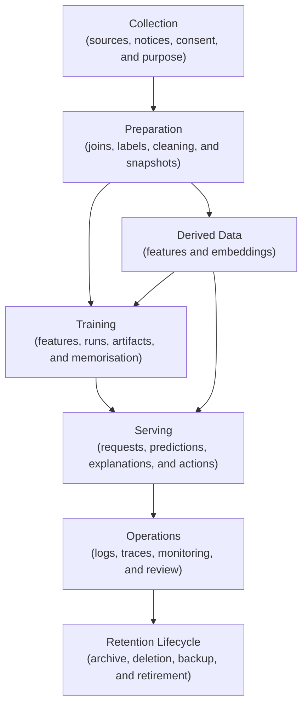
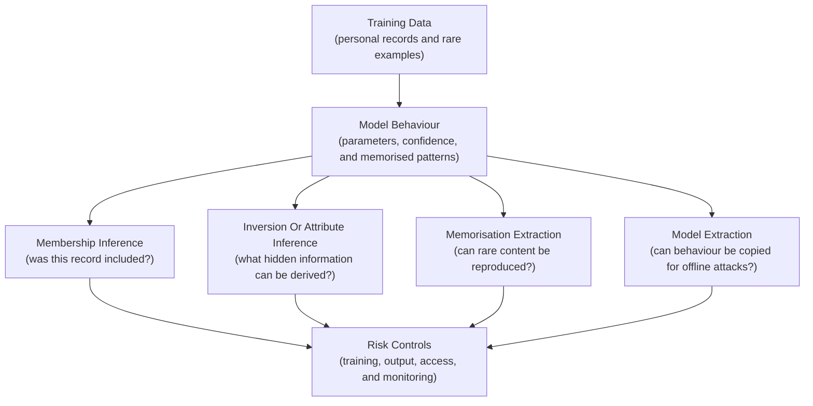
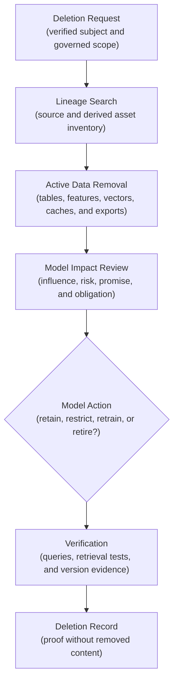
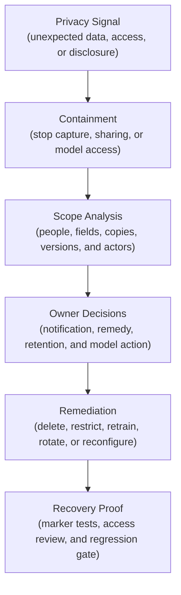

## Table of Contents

1. [Where Privacy Risk Appears In An ML System](#where-privacy-risk-appears-in-an-ml-system)
2. [Find Every Place Personal Data Can Be Exposed Or Misused](#find-every-place-personal-data-can-be-exposed-or-misused)
3. [Limit Collection To An Approved Purpose](#limit-collection-to-an-approved-purpose)
4. [Recognise Identifiers Sensitive Attributes And Proxies](#recognise-identifiers-sensitive-attributes-and-proxies)
5. [Minimise Training And Feature Data](#minimise-training-and-feature-data)
6. [Understand What Models Can Reveal](#understand-what-models-can-reveal)
7. [Treat Embeddings And Vector Stores As Sensitive Data](#treat-embeddings-and-vector-stores-as-sensitive-data)
8. [Protect Inference APIs And Outputs](#protect-inference-apis-and-outputs)
9. [Keep Logs Traces And Monitoring Private](#keep-logs-traces-and-monitoring-private)
10. [Control Who Can Access Data And Which Keys Protect It](#control-who-can-access-data-and-which-keys-protect-it)
11. [Plan Retention Consent Changes And Deletion](#plan-retention-consent-changes-and-deletion)
12. [Choose Privacy Techniques For A Specific Threat](#choose-privacy-techniques-for-a-specific-threat)
13. [Evaluate And Red-Team Privacy Risk](#evaluate-and-red-team-privacy-risk)
14. [How Cloud And Data Platforms Enforce Privacy Controls](#how-cloud-and-data-platforms-enforce-privacy-controls)
15. [Respond To A Privacy Incident](#respond-to-a-privacy-incident)
16. [Check Privacy Controls Before Every Release](#check-privacy-controls-before-every-release)
17. [Main Idea](#main-idea)
18. [References](#references)

## Where Privacy Risk Appears In An ML System
<!-- section-summary: ML privacy risk concerns the problems people can experience because a system collects, derives, uses, exposes, or retains information about them. -->

Privacy risk can appear wherever an ML system collects, derives, copies, uses, or retains information about people. **Privacy risk is the possibility that this processing creates unwanted exposure, surveillance, loss of control, unfair treatment, embarrassment, financial harm, or use outside the expected purpose.**

Security and privacy overlap, although they ask different questions. Security asks whether an unauthorised actor can reach the data or system. Privacy also asks whether an authorised system should collect the data, whether it uses the data for the stated purpose, and whether people can exercise the organisation's promised choices. A perfectly encrypted dataset can still create privacy harm if it contains unnecessary information or powers an unexpected decision.

Machine learning expands the surface because it creates derived data. Raw records turn into features, labels, embeddings, model parameters, explanations, predictions, monitoring segments, and review exports. Removing a name from the first table does not automatically remove the person's information from those later objects.

Consider a support-routing model trained on customer messages. The product team only needs a topic and urgency category. The raw message may contain names and account numbers. Health details or payment information may also appear.

Copying the full text into training snapshots and experiment artifacts creates new disclosure paths. Prediction logs and an observability vendor create two more copies for a narrow classification task.

The final NIST Privacy Framework 1.0 treats privacy risk across the complete data lifecycle, from collection through disposal. That lifecycle provides a practical structure for ML engineering: follow each data action, identify the possible problem for people, then choose controls that reduce the specific risk. NIST also publishes a Privacy Framework 1.1 Initial Public Draft, which should be treated as draft guidance until its status changes.

## Find Every Place Personal Data Can Be Exposed Or Misused
<!-- section-summary: A privacy threat map follows raw and derived information across every store, transformation, model interface, and operational copy. -->

A privacy review first maps where information enters, moves, changes, and leaves the system. This **privacy threat map** follows every transformation and copy, including notebooks, temporary files, feature stores, experiment tracking, model artifacts, inference requests, logs, traces, monitoring tables, human-review tools, backups, and external processors.

The completed map should show which person or group each data object describes, which owner controls it, which systems receive a copy, and where access or retention rules change. Reviewers can then connect each exposure path to a specific control and verify that derived data receives the same attention as its source.



For each arrow, ask five questions. What information moves? Which person or group could it describe? Which purpose authorises the movement? Which identities can read or change it? What happens after the purpose ends or a deletion request arrives?

The map should include third parties and managed services. A hosted experiment tracker or external model API may receive personal data. Telemetry platforms and annotation providers can receive it as well, even if the primary warehouse stays inside the organisation.

Record the processor and region. Add its retention, training-use policy, deletion mechanism, and contract owner.

The map needs boundaries as well as assets. The restricted raw-data zone, curated ML zone, training runtime, production serving account, observability system, and reviewer workspace usually have different owners and access policies. Privacy failures often occur at the transfer between them.

## Limit Collection To An Approved Purpose
<!-- section-summary: Purpose limitation states the allowed use before data enters the ML workflow and prevents useful data from quietly serving unrelated decisions. -->

**Purpose limitation** means describing why data is processed and keeping later use compatible with that purpose. The statement should name the decision, user, action, affected population, and expected benefit. “Improve AI” or “analytics” is too broad to guide engineering.

Suppose a maintenance organisation collects technician notes to diagnose equipment failures. A proposal later uses those notes to score employee performance. The source data is technically available, yet the new use changes who is evaluated and what action follows. It requires a separate assessment, notice or consent analysis where applicable, and governance decision. Existing storage access does not grant automatic permission for the new purpose.

Collection controls should connect the purpose to concrete sources and fields. Record which source system supplied the data, which notice or agreement applies, what choices people were given, and which downstream uses are prohibited. Version this record because products, populations, and policies change.

```yaml
dataset_contract:
  name: support_intent_training
  purpose: route incoming support requests to the correct specialist queue
  data_subjects: account holders and message authors
  approved_outputs: [topic, urgency_band]
  prohibited_uses: [employee_scoring, advertising_profile, identity_verification]
  source_notice_version: support-data-use-v3
  owner: support-operations
  review_id: privacy-review-0184
  deletion_key: conversation_id
```

Pipelines must enforce the contract. A training job should select approved fields from the approved dataset version. CI can reject an unreviewed source or purpose version. Lineage can reveal new upstream inputs, and a data owner can require another review after contract changes.

## Recognise Identifiers Sensitive Attributes And Proxies
<!-- section-summary: Privacy classification covers obvious identifiers, linkable combinations, sensitive attributes, free text, and features that act as proxies. -->

A **direct identifier** points clearly to a person, such as a name, email address, government identifier, or account number. Removing these fields is useful, though it is only the first layer.

A **quasi-identifier** can identify or narrow down a person in combination with other information. Exact age, small geographic area, unusual job title, timestamp, and rare diagnosis can form a unique pattern. Public or commercially available data can then connect that pattern back to a named person.

A **sensitive attribute** describes information whose disclosure or use can create substantial harm. Health, finances, precise location, biometrics, communications, and protected characteristics are common examples. The exact classification and obligations depend on jurisdiction, sector, contract, and organisational policy.

Features can also act as **proxies**. A model may exclude a protected attribute while using postcode, school, language, device pattern, or purchasing history that strongly correlates with it. Proxy analysis belongs in both privacy and fairness review because the feature can reveal or reconstruct sensitive information and influence decisions about the same groups.

Free text and images deserve special attention. A support note can contain many data classes in one field. A photo may include faces, documents, location clues, or people in the background. Automated discovery tools such as cloud data-loss-prevention services can find common patterns, but they cannot understand every context or infer the correct purpose. Use discovery as one input to a reviewed inventory. Product and human context supply the purpose decision.

## Minimise Training And Feature Data
<!-- section-summary: Data minimisation reduces collection, precision, scope, copies, and retention while preserving the information required for the approved task. -->

**Data minimisation** means using the smallest amount and precision of information that can achieve the approved purpose. In ML, this includes rows, columns, history window, geographic detail, time precision, free text, and the number of systems that receive a copy.

Suppose a delivery-support model needs to estimate whether a parcel is likely to miss its promised day. Exact home addresses are unnecessary after a restricted preparation job calculates distance and route-zone bands. The training table can use those bands, a recent-event summary, and an opaque shipment ID. Address and recipient name stay in the operational source system.

Test minimisation with experiments. Train a baseline without a sensitive or high-risk feature and measure the utility difference. Compare broad age bands with exact age. Shorten the history window. Remove rare categories or group them under a reviewed taxonomy. If a risky field provides little meaningful improvement, exclusion is the strongest control.

Feature stores and materialised tables can multiply derived copies. Give each feature an owner and approved purpose. Add its source lineage and sensitivity class. Freshness and retention rules describe its operational lifetime.

Restrict online features to the serving identities that use them. A feature catalogue entry should identify whether a value is approved for training, serving, monitoring, or only one of those contexts.

Synthetic data can reduce some direct disclosure risks, yet synthetic rows can still resemble training records or preserve rare combinations. Evaluate similarity, memorisation, attribute disclosure, and downstream bias. Treat the generator and its training data as sensitive assets.


*Purpose minimisation keeps raw personal details behind a restricted boundary and sends only the fields required for support routing into the ML path.*

## Understand What Models Can Reveal
<!-- section-summary: A trained model can leak information through membership signals, reconstructed attributes, memorised content, or copied model behaviour. -->

Privacy risk continues after raw data access is removed. The model parameters and outputs can carry information learned from training examples.

### Membership Inference Tests Whether A Record Was Used In Training

A **membership inference attack** estimates whether a particular record appeared in training. Models that behave much more confidently on training examples can expose a useful signal. Membership can itself be sensitive; learning that someone belonged to a disease dataset or debt programme reveals information even without reconstructing the record.

Evaluate plausible attacker access. A public probability API offers more probing opportunity than an internal endpoint returning a coarse category. Compare train and holdout behaviour, run established attack baselines, and measure advantage over chance. Strong regularisation, fewer output details, query controls, and privacy-preserving training can reduce risk.

### Model Inversion And Attribute Inference Reconstruct Sensitive Information

**Model inversion** uses model access to reconstruct representative inputs or sensitive details. **Attribute inference** predicts a hidden attribute from other information and model responses. High-dimensional outputs and embeddings can make these attacks practical in some settings.

For example, an identity model that returns a detailed similarity vector may reveal more than an API that returns a bounded match decision. Reduce output precision and fields to what the product needs. Authenticate clients, rate-limit probing, and monitor unusual query patterns.

### Memorisation And Extraction Can Reveal Training Content

Large or over-parameterised models can memorise rare training content. Repeated prompting or carefully chosen inputs may extract names, secrets, code, or unique phrases. Deduplication, secret and personal-data scanning, exclusion of unsuitable sources, training controls, output filtering, and adversarial extraction tests all contribute to mitigation.

**Model extraction** aims to copy a model's behaviour or parameters through queries or artifact access. This is often discussed as intellectual-property theft, but it can also expose privacy-sensitive behaviour and enable stronger offline membership or inversion attacks. Protect artifact storage and inference interfaces accordingly.



## Treat Embeddings And Vector Stores As Sensitive Data
<!-- section-summary: Embeddings preserve information about source content and require the same purpose, access, tenant, retention, and deletion controls as other derived data. -->

An **embedding** is a numeric representation that places related inputs near one another in a vector space. Humans cannot read it directly like ordinary text, yet it still preserves information about the source. Similarity probing, membership inference, and inversion techniques can reveal that information or details about the embedding model.

A vector database also stores metadata used for filtering and retrieval. Document titles, tenant IDs, access groups, source locations, and chunk text can be more directly sensitive than the vector. A retrieval system that filters after similarity search may allow an unauthorised document to influence ranking or leak through diagnostics.

Apply authorisation before returning content and as early as the platform supports during retrieval. Separate tenant namespaces or collections where isolation requirements justify it. Include tenant and policy scope in caches. Encrypt storage and transport, restrict exports, and keep raw text out of query traces unless an approved secure debugging path requires it.

Consider an internal assistant indexing human-resources documents. A user asks a harmless question whose nearest vector belongs to a restricted performance review. Even if the response layer removes the document, the trace may log its title and chunk. The privacy boundary must cover retrieval, reranking, response generation, citations, cache entries, and telemetry.

Deletion requires a source-to-vector mapping. Store stable document and chunk identifiers, embedding-model version, and index namespace so a deletion workflow can remove every derived vector and cache entry. Rebuild or compact indexes according to the vector store's deletion semantics, then verify that retrieval no longer returns the removed content.

## Protect Inference APIs And Outputs
<!-- section-summary: Inference controls limit who can query a model, how much detail they receive, and whether repeated requests can expose private information. -->

An inference API is a privacy interface. Its inputs may contain personal data, and its outputs may reveal sensitive scores, categories, explanations, retrieved documents, or training information. Treat request and response contracts as governed data contracts.

Authenticate callers and authorise the specific model, tenant, and action. Use quotas and rate limits to constrain automated probing. Bound batch size and output precision.

If the application needs a category, return that category and omit the full probability vector. Keep internal feature values and nearest-neighbour distances out of ordinary responses. Prompts and chain-of-thought-style internals also stay inside the governed service boundary.

Caching needs the same scope. A response generated from private documents cannot use a key based only on the user's question. The key and storage boundary need the tenant, access-policy version, retrieval snapshot, model version, and other context that changes the authorised answer. Some high-impact decisions should skip response caching entirely.

Abuse monitoring should look for repeated variations around one record, broad enumeration, confidence harvesting, extraction patterns, and unusual batch use. Detection must avoid creating another privacy problem through raw payload collection. Use safe fingerprints, counts, bounded samples, and restricted investigation workflows.

## Keep Logs Traces And Monitoring Private
<!-- section-summary: Telemetry should preserve operational and model evidence without copying raw requests, features, prompts, or sensitive identifiers into broad-access systems. -->

Observability systems often have broader access and shorter governance histories than data platforms. Automatic HTTP instrumentation may capture URLs, headers, query strings, or error messages. Application logging can copy full prediction requests during debugging. LLM traces may include prompts, retrieved chunks, tool arguments, and generated answers.

Define an allowlist for telemetry fields. A prediction event may include an opaque prediction ID, model digest, policy version, safe segment, output category, latency, and trace ID. Detailed feature values remain in a restricted governed snapshot. Raw identifiers and free text stay out of standard logs.

```json
{
  "event": "prediction_completed",
  "prediction_id": "01J...",
  "model_id": "logged-model-7f2...",
  "policy_version": "routing-v5",
  "result": "specialist_queue",
  "safe_segment": "business_account",
  "latency_ms": 84,
  "trace_id": "8c12...",
  "payload_logged": false
}
```

Redaction must occur before export. Removing fields in the dashboard still leaves them in the collector or storage backend. Configure application instrumentation and OpenTelemetry Collector processors around a reviewed allowlist. Protect the remaining telemetry with access controls, encryption, retention, and query auditing.

Monitoring aggregates can also expose small groups. A dashboard showing an outcome for one rare postcode or diagnosis group may reveal an individual's result. Enforce minimum cohort sizes, suppress or combine sparse segments, and restrict drill-down. Keep the unsuppressed source in the governed data system for authorised analysis.

## Control Who Can Access Data And Which Keys Protect It
<!-- section-summary: Identity limits who can use data, encryption limits exposure of stored and transmitted bytes, and key boundaries separate control from storage. -->

Privacy controls must limit which people and workloads can reach each data class. Use separate workload identities for ingestion, feature preparation, training, serving, monitoring, and audit. Each identity receives the smallest set of data and actions required for its job.

Human access should use groups and time-bounded elevation for sensitive investigation. Regular review covers people and service identities because automated jobs often have broader access than people.

On a lakehouse, Unity Catalog can govern tables, volumes, models, and functions. Row filters, column masks, dynamic views, and attribute-based access-control policies can expose curated views without granting the base table. Direct path access must not bypass the governed table boundary.

Encryption protects data in transit and at rest. Managed services usually encrypt storage by default; customer-managed keys add control over key lifecycle and access for selected assets. Data minimisation, purpose enforcement, and application authorisation address separate parts of the privacy design.

Store keys in a key-management service. Keep notebooks and environment files free of key material. Separate key administrators from data readers where the risk warrants it. Grant the training workload permission to use the data-encryption key without giving it administrative control over the key. Plan rotation, revocation, backup, and recovery because disabling a key can make evidence or models unavailable.

Private networking and egress controls reduce unintended disclosure. SageMaker AI supports VPC configuration and network isolation for applicable jobs. Gemini Enterprise Agent Platform (formerly Vertex AI) can participate in VPC Service Controls for supported services. Azure Machine Learning provides managed network and private-endpoint patterns. Check the current support matrix for the exact training, registry, endpoint, and generative-AI feature. Workspace-level settings may cover only part of the data path.

## Plan Retention Consent Changes And Deletion
<!-- section-summary: Retention and deletion must follow raw data into snapshots, features, models, vectors, logs, caches, backups, and external processors. -->

Retention should be purpose-based for each asset class. Raw source extracts may expire quickly after a curated snapshot is built. Training snapshots may remain while a model is active and reproducibility is required. Debug payloads should have a much shorter life. Approval and aggregate evaluation evidence can often remain without raw personal data.

A consent withdrawal or deletion request needs a stable deletion key and lineage across derived assets. The workflow should locate source rows, prepared tables, and feature values.

It also follows vector entries, prediction payloads, caches, review exports, and processor copies. Backups may follow delayed deletion under an approved policy; document the delay and prevent deleted records from returning during restoration.

Removing a training row does not reliably remove its influence from an existing model. Exact **machine unlearning** is an active area with method-specific guarantees. A defensible baseline is to remove the data from future datasets, mark affected model versions, assess whether the active model must be retrained, and rebuild from a clean snapshot where policy requires removal.

The decision depends on the model and the privacy risk. Promised data rights and applicable obligations also shape it. A low-risk aggregate model may continue until scheduled retraining under an approved policy. A model trained on data collected without authority may require immediate containment and rebuild. Record the choice, owner, affected versions, and verification evidence.


*Deletion follows every derived copy, then checks whether an active model must be restricted, retrained, or retired before the request can close.*



## Choose Privacy Techniques For A Specific Threat
<!-- section-summary: Privacy-enhancing technologies solve specific threat models and require explicit guarantees, parameters, and utility evaluation. -->

Some privacy threats need specialised mathematical or infrastructure controls. **Privacy-enhancing technologies**, often shortened to **PETs**, include differential privacy, secure aggregation, federated learning, trusted execution environments, and cryptographic computation methods. Each addresses a particular boundary. The defined threat and required guarantee determine which technique fits.

**Differential privacy** provides a mathematical way to bound how much an output changes because one person's data is included. In private training, implementations commonly clip each example's gradient and add calibrated noise before updating the model. The privacy budget is often expressed with epsilon and delta. Smaller epsilon generally represents a stronger bound, but the complete guarantee depends on adjacency, accounting, clipping, sampling, and implementation details.

Opacus integrates differential privacy with PyTorch. `PrivacyEngine()` initializes the privacy manager. `make_private_with_epsilon(...)` wraps and configures the model, optimizer, and data loader for the requested privacy target. After training, `get_epsilon(...)` reports the epsilon spent for the selected delta; record that measured result with the training evidence.

```python
from opacus import PrivacyEngine


privacy_engine = PrivacyEngine()
model, optimizer, train_loader = privacy_engine.make_private_with_epsilon(
    module=model,
    optimizer=optimizer,
    data_loader=train_loader,
    target_epsilon=4.0,
    target_delta=1e-6,
    epochs=10,
    max_grad_norm=1.0,
)

train(model, optimizer, train_loader)
epsilon = privacy_engine.get_epsilon(delta=1e-6)
```

Record the neighbouring-dataset definition, sampling assumptions, accountant, clipping norm, noise configuration, achieved epsilon and delta, utility changes, and library version. NIST SP 800-226 explains that practical differential-privacy guarantees depend on more than quoting epsilon.

Federated learning keeps raw training data at participating sites, but model updates can still leak information and the coordinator remains a trust boundary. Secure aggregation can hide individual updates from the coordinator. Differential privacy may limit what aggregated updates reveal. The system still needs identity, poisoning defences, participation policy, and deletion semantics.

## Evaluate And Red-Team Privacy Risk
<!-- section-summary: Privacy evaluation tests data handling, model leakage, API abuse, telemetry, isolation, and deletion against realistic attacker capabilities. -->

Start with a threat model. Identify the attacker or curious insider, their access, the sensitive fact they seek, and the harm that disclosure could cause. A public inference client, tenant user, model operator, notebook author, and cloud administrator have different capabilities.

Data tests scan training and evaluation inputs for direct identifiers, secrets, unexpected free text, rare combinations, and contract drift. Join analysis measures whether quasi-identifiers create tiny groups. Feature-ablation tests show whether risky inputs provide enough value to justify their use.

Model tests compare training and holdout confidence, run membership-inference baselines, probe attribute inference, search for memorised strings, and test extraction resistance under realistic query limits. Embedding tests check nearest-neighbour leakage and source reconstruction risk. Generative systems need prompt extraction and sensitive-content regurgitation tests across retrieved and fine-tuning data.

System tests cross tenant boundaries, inspect logs and traces, attempt unauthorised batch queries, verify network egress, and exercise key revocation. Deletion tests start from a known source record and confirm removal from tables, vector indexes, caches, monitoring datasets, and external processors.

The report should state the attacker assumptions, dataset, tool versions, thresholds, findings, residual risk, owner, and release decision. A passed scanner alone provides weak evidence because it tests only known patterns at one point in the lifecycle.

## How Cloud And Data Platforms Enforce Privacy Controls
<!-- section-summary: Modern platforms provide identity, governance, isolation, encryption, discovery, and audit primitives that teams combine around one privacy design. -->

Production platforms enforce different parts of the privacy design through governed storage, workload identity, network boundaries, encryption, and audit records. On Databricks, Unity Catalog provides central permissions, lineage, governed tags, row filters, column masks, dynamic views, and audit events. Use attribute-based policies for consistent masking across many tagged tables where the feature and runtime support the required workload. Keep raw sources in restricted schemas and expose curated training views.

On AWS, IAM roles, KMS keys, S3 access controls, VPC endpoints, CloudTrail, Macie, and SageMaker AI network controls cover different boundaries. Macie can help discover sensitive data in S3. SageMaker VPC configuration controls access to VPC resources, while network isolation blocks network calls from supported training or inference containers. Treat those modes as distinct choices.

Google Cloud teams commonly combine IAM, Cloud KMS, Sensitive Data Protection, VPC Service Controls, Cloud Audit Logs, and Gemini Enterprise Agent Platform controls. Azure teams use managed identities, Key Vault, Microsoft Purview or data-classification services, private networking, Azure Monitor, and Azure Machine Learning security controls. Verify feature-specific availability for managed generative AI, vector search, endpoints, and training jobs.

Open-source stacks can use Apache Ranger or warehouse policies for data access, OpenLineage for data movement, Vault or a cloud KMS for keys, OpenTelemetry with allowlist processors for telemetry, and policy-as-code for release gates. Opacus supports differentially private PyTorch training where the threat model calls for it.

These tools implement control points. The privacy design still defines the purpose, permitted data, affected people, threat model, retention, deletion, and acceptance authority. Product names cannot supply those decisions.

## Respond To A Privacy Incident
<!-- section-summary: Privacy response contains disclosure, preserves evidence, traces affected data and models, fulfils notification duties, and proves remediation. -->

Suppose an engineer discovers that inference traces have included raw support messages for several weeks. The first action is containment: disable payload capture at the producer and collector, restrict access to the affected telemetry store, suspend exports, and preserve the evidence needed for investigation under authorised handling.

The team identifies the exposure window, fields, tenants, users with access, exports, backups, and downstream processors. Trace configuration history reveals which release enabled the attribute. Access logs show who queried or exported it. Data lineage and processor inventories identify copies outside the primary store.

Privacy and security owners lead the response with legal and product owners. Together they decide notification and individual-remedy obligations. Engineers should avoid making that legal determination alone, but they need to provide accurate scope and timestamps quickly.

The incident record links the configuration release and affected systems. It also links evidence, containment, deletion actions, and owner decisions.

Recovery proof includes a synthetic request containing known sensitive markers. The new trace must omit them at the application, collector, backend, export, and dashboard layers. Queries verify deletion or restricted retention for the affected window. A regression test then blocks future telemetry configuration that captures unapproved fields.



## Check Privacy Controls Before Every Release
<!-- section-summary: A privacy-ready release has data, model, API, telemetry, retention, and response evidence that matches the approved design. -->

Every release must connect its privacy approval to the exact dataset, feature definitions, model artifact, policy, serving contract, and telemetry configuration that will reach production. A generic approval for a project name can drift away from the released system.

The release packet records the approved purpose and data contract, lineage snapshot, excluded data, feature-ablation evidence, model privacy tests, API output contract, tenant-isolation tests, telemetry allowlist, access-policy checks, retention configuration, deletion exercise, residual risks, and accountable approvals. Each item uses an immutable version or digest where possible.

CI can verify machine-readable boundaries. It can compare training columns with the approved schema and reject raw payload logging. Artifact scans look for secrets or identifiers. Further checks verify network policy and lifecycle rules. High-risk models also require a privacy-test report.

Human reviewers still interpret the purpose and potential harms. They judge attacker realism and residual risk.

After release, monitor the controls themselves. Alert on new data sources, schema additions, unusual inference queries, large exports, failed deletions, sparse monitoring groups, disabled redaction, key-policy changes, and expired exceptions. Privacy posture changes as the system and its users change.

## Main Idea
<!-- section-summary: ML privacy engineering follows raw and derived information through the entire lifecycle and applies controls matched to specific risks for people. -->

Privacy risk in ML extends from collection to deletion. Direct identifiers are only one part of the problem. Quasi-identifiers, sensitive attributes, proxies, features, embeddings, model behaviour, outputs, logs, and long-lived copies can also expose or misuse information about people.

Start with a clear purpose and a complete threat-surface map. Minimise data and outputs, govern access, keep telemetry on an allowlist, test model leakage, protect vector retrieval, separate encryption keys from storage access, and build verified retention and deletion paths. Use differential privacy or other PETs only with an explicit threat model and measured guarantee.

The production standard is evidence. A team should be able to show what data the release used, why each use was permitted, what privacy attacks and system paths were tested, which residual risks remain, who accepted them, and how the system will contain and prove recovery from an incident.


*A privacy release decision joins purpose, data, model, API, telemetry, retention, and operational evidence, then reopens the controls when production signals or deletion requests arrive.*

## References

- [NIST Privacy Framework 1.0](https://www.nist.gov/system/files/documents/2020/01/16/NIST%20Privacy%20Framework_V1.0.pdf)
- [NIST Privacy Framework 1.1 Initial Public Draft](https://www.nist.gov/privacy-framework)
- [NIST Privacy Risk Assessment Methodology](https://www.nist.gov/privacy-framework/nist-pram)
- [NIST SP 800-226: Guidelines for Evaluating Differential Privacy Guarantees](https://csrc.nist.gov/pubs/sp/800/226/final)
- [NIST Adversarial Machine Learning Taxonomy](https://csrc.nist.gov/pubs/ai/100/2/e2025/final)
- [OWASP Secure AI/ML Model Ops Cheat Sheet](https://cheatsheetseries.owasp.org/cheatsheets/Secure_AI_Model_Ops_Cheat_Sheet.html)
- [OWASP RAG Security Cheat Sheet](https://cheatsheetseries.owasp.org/cheatsheets/RAG_Security_Cheat_Sheet.html)
- [OpenTelemetry data collection security guidance](https://opentelemetry.io/docs/security/handling-sensitive-data/)
- [Opacus Privacy Engine](https://opacus.ai/api/privacy_engine.html)
- [Databricks Unity Catalog row filters and column masks](https://docs.databricks.com/aws/en/data-governance/unity-catalog/filters-and-masks/)
- [Databricks Unity Catalog ABAC policies](https://docs.databricks.com/aws/en/data-governance/unity-catalog/abac/)
- [Amazon SageMaker AI network isolation](https://docs.aws.amazon.com/sagemaker/latest/dg/mkt-algo-model-internet-free.html)
- [Amazon Macie](https://docs.aws.amazon.com/macie/latest/user/what-is-macie.html)
- [Google Cloud Sensitive Data Protection](https://cloud.google.com/sensitive-data-protection/docs)
- [Google Cloud VPC Service Controls with Gemini Enterprise Agent Platform](https://docs.cloud.google.com/gemini-enterprise-agent-platform/machine-learning/general/vpc-service-controls)
- [Azure Machine Learning network isolation](https://learn.microsoft.com/azure/machine-learning/how-to-managed-network)
- [Azure Machine Learning customer-managed keys](https://learn.microsoft.com/azure/machine-learning/concept-customer-managed-keys)
- [HHS de-identification guidance](https://www.hhs.gov/hipaa/for-professionals/special-topics/de-identification/index.html)
