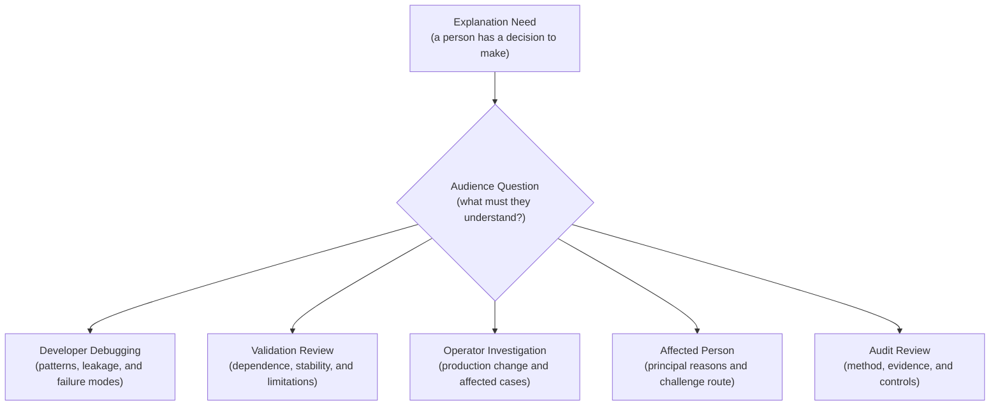
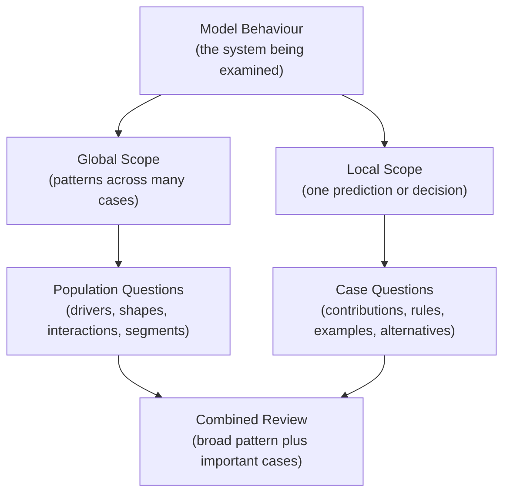
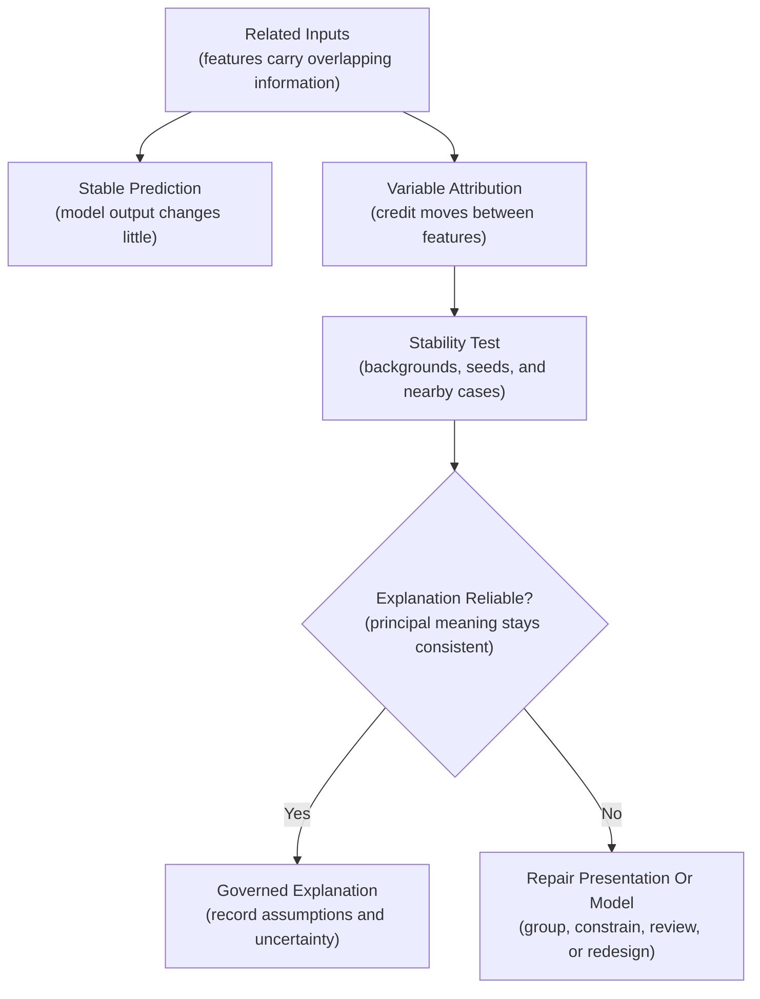
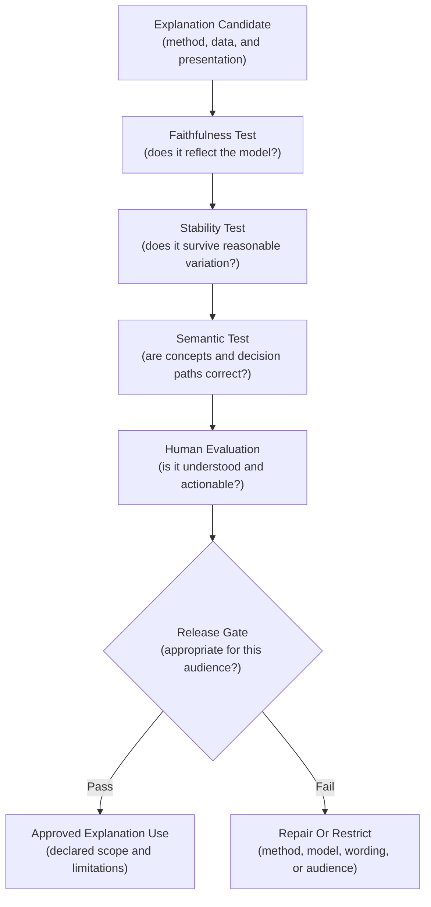
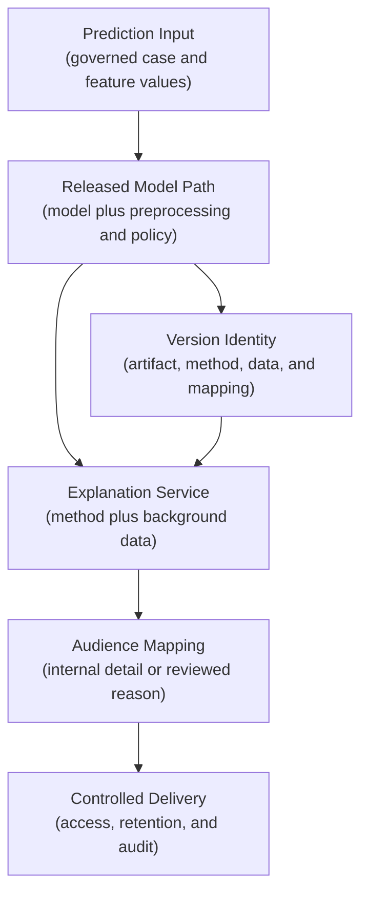
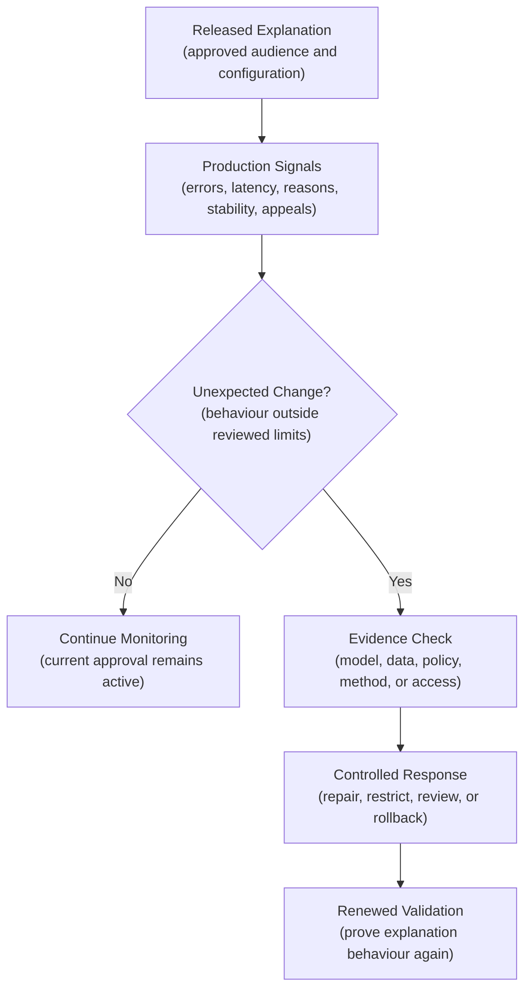

## Table of Contents

1. [Start With The Person Who Needs The Explanation](#start-with-the-person-who-needs-the-explanation)
2. [Compare Global And Local Explanations](#compare-global-and-local-explanations)
3. [Compare Readable Models With Explanations Added After Training](#compare-readable-models-with-explanations-added-after-training)
4. [How Feature Attribution Connects Inputs To A Prediction](#how-feature-attribution-connects-inputs-to-a-prediction)
5. [Correlated Features Complicate Attribution](#correlated-features-complicate-attribution)
6. [Use Counterfactual Explanations Only For Realistic Changes](#use-counterfactual-explanations-only-for-realistic-changes)
7. [Explain A Prediction Through Similar Past Cases](#explain-a-prediction-through-similar-past-cases)
8. [Show Confidence And Uncertainty With The Explanation](#show-confidence-and-uncertainty-with-the-explanation)
9. [Explain Features In Language People Understand](#explain-features-in-language-people-understand)
10. [Check Whether An Explanation Matches The Model And Remains Stable](#check-whether-an-explanation-matches-the-model-and-remains-stable)
11. [Choose An Explanation Tool For The Model And Question](#choose-an-explanation-tool-for-the-model-and-question)
12. [Record Which Model And Method Produced Each Explanation](#record-which-model-and-method-produced-each-explanation)
13. [Help People Understand, Challenge, And Act On An Explanation](#help-people-understand-challenge-and-act-on-an-explanation)
14. [Release And Monitor The Explanation System](#release-and-monitor-the-explanation-system)
15. [The Main Idea](#the-main-idea)
16. [References](#references)

## Start With The Person Who Needs The Explanation

<!-- section-summary: An explanation names its audience, answers their defined question, and supports a concrete action or decision. -->

The intended reader and decision determine which explanation the system should
produce. **Explainability** means producing understandable evidence about how a
model behaves or how it reached a particular output. A developer, affected
person, operator, and auditor ask different versions of “why?”

A developer debugging a model may ask, “Did it learn an accidental shortcut?” A
model validator may ask, “Does the model rely on stable and acceptable factors
across important groups?” An operator investigating an incident may ask, “Which
input or model path changed after the release?”

An affected person has a different need: “What were the principal reasons for
this result, and how can I correct wrong information or challenge the decision?”
An auditor or regulatory reviewer may ask whether the organization used a
suitable explanation method, validated it, controlled access, and connected it
to the actual decision process.

One chart cannot satisfy all of these audiences. A global feature ranking may
help a developer find leakage and provide little information about one person’s
case. A local attribution can describe one prediction and provide no proof that
changing the highlighted feature would improve a real-world outcome.

The first design step is therefore to write an explanation question:

- Who will receive the explanation?
- Which decision will they make with it?
- Does the question concern the model as a whole or one result?
- What harm could a misleading answer cause?
- Which action, correction, appeal, or investigation follows?



The question determines the scope, method, validation, language, and access
controls that follow.


*Explanation design starts with the audience's question and the action that follows, because one chart cannot serve every decision.*

## Compare Global And Local Explanations

<!-- section-summary: Global explanations summarize behaviour across a population, while local explanations examine one prediction or case. -->

A **global explanation** describes model behaviour across a dataset or
population. It can show which features the model relies on most, how predicted
output varies across feature ranges, which interactions matter, and whether
important segments exhibit different patterns.

Suppose a delivery-delay model uses route length, weather, depot load, and
package type. A global explanation may show that depot load has become the
dominant factor across recent traffic. That finding helps developers investigate
a changed source or an emerging operational bottleneck. It does not explain why
one package received a 45-minute estimate.

A **local explanation** examines one prediction. It may show feature
contributions, a decision-tree path, a nearby counterfactual, a similar
historical example, or the deterministic policy rule that converted a score into
an action. The package-level explanation might show that severe weather and
current depot load moved this estimate above the model’s usual baseline.

Global and local evidence should be read together. A factor with modest average
importance can dominate a small high-risk segment. A factor that is globally
important may have almost no influence on a particular case. Reports should
identify the model version, preprocessing, explanation configuration, dataset,
time window, and segments used for each scope.



## Compare Readable Models With Explanations Added After Training

<!-- section-summary: Intrinsic explanation comes from the model's own readable structure, while post-hoc methods analyze a fitted model after training. -->

Some models expose readable logic directly, while others need a separate method
to analyse their behaviour after training. An **intrinsically interpretable
model** belongs to the first group. A short decision tree shows its paths, a
sparse linear model shows weighted terms, and a scorecard shows points.

InterpretML’s Explainable Boosting Machine is one current example. It is a
boosted generalized additive model that can provide exact global and local
decompositions of its own prediction. “Exact” here refers to the decomposition
of that EBM. It does not guarantee that the features are causal, the training
data is fair, or the product decision is appropriate.

A **post-hoc explanation** analyzes a model after it has been fitted. SHAP,
permutation importance, Integrated Gradients, surrogate models, and many
example-based methods belong here. They let teams examine complex tree ensembles
or neural networks without replacing them.

Post-hoc methods make assumptions and often approximate a narrow property. A
local surrogate approximates the original model near one input. Integrated
Gradients attributes a neural-network output relative to a chosen baseline. SHAP
allocates output difference under a chosen explainer and feature-dependence
assumption.

Model choice is part of explainability design. If clear, stable explanations are
central to a high-impact use and an interpretable model meets the performance
requirement, its direct structure may reduce explanation risk. Complex post-hoc
analysis can still support debugging, but it should not be treated as a
universal substitute for readable decision logic.

## How Feature Attribution Connects Inputs To A Prediction

<!-- section-summary: Feature attribution allocates model behaviour among inputs under a method's baseline and assumptions. -->

Many explanation tools divide a model output among its input features. This
method is called **feature attribution**. Global attribution aggregates
information across many cases, while local attribution describes one
prediction.

Permutation importance is a global method. It shuffles one feature in evaluation
data and measures how much a chosen performance metric degrades. A large drop
indicates that the model depends on that feature for that metric and dataset.
The result changes with the metric and data slice. Shuffling can also create
unrealistic combinations.

SHAP is a family of methods based on Shapley values. A local SHAP explanation
compares an output with an expected or baseline output and allocates the
difference among features. TreeExplainer provides efficient calculations for
supported tree models. Its current documentation makes the feature-dependence
choice explicit through options such as interventional and tree-path-dependent
behaviour.

```python
import shap

background = X_reference.sample(300, random_state=42)
explainer = shap.TreeExplainer(
    model,
    data=background,
    feature_perturbation="interventional",
    model_output="probability",
)
explanation = explainer(X_cases)
```

The background data represents the reference population used to interpret
“higher or lower than expected.” It should be reviewed, versioned, and
appropriate for the question. Changing it can change the values.

For a neural network, Captum provides PyTorch attribution methods such as
Integrated Gradients. Integrated Gradients accumulates gradients along a path
from a baseline input to the actual input. Captum can report a convergence delta
linked to the method’s completeness property. That diagnostic checks the
attribution calculation; it does not establish a causal explanation or product
validity.

Attribution says something about the fitted model under the method’s
assumptions. It cannot prove that a feature caused the real-world outcome, that
using the feature is acceptable, or that changing the feature alone will create
a desired result.

## Correlated Features Complicate Attribution

<!-- section-summary: Related features can share or exchange attribution because several inputs carry overlapping information. -->

Real features rarely vary independently. Monthly income and annual income carry
similar information. Distance and travel time are related. Several image pixels
describe the same object. This correlation creates ambiguity about how credit
should be divided.

Suppose a model uses both debt-to-income ratio and monthly debt. A local method
may rank the ratio first under one background sample and monthly debt first
under another. The prediction can remain stable while the reported principal
reason changes. Removing one feature may cause the model to rely more heavily on
the other.

Different attribution methods handle feature dependence differently. SHAP
TreeExplainer exposes alternative assumptions. Permutation importance can
understate the value of one correlated feature because its partner still carries
similar information. A simple coefficient can also mislead if scale and
correlation are ignored.

Practical responses include grouping related features into a governed concept,
comparing several reasonable dependence assumptions, reporting uncertainty, and
testing the stability of top reasons. If the distinction matters to a
customer-facing explanation, redesigning the feature set or decision component
may be safer than claiming that one correlated input uniquely drove the result.


*Correlated inputs can leave the prediction stable while changing the principal reason, so teams group related features, compare assumptions, and test explanation stability.*



## Use Counterfactual Explanations Only For Realistic Changes

<!-- section-summary: Counterfactual explanations describe model alternatives, while feasibility and causal knowledge determine whether those alternatives make sense. -->

A person may ask what could change the model's result. A **counterfactual
explanation** searches for a nearby input that would receive a different output.
For an internal review queue, it might show that a smaller requested amount
would move a case below the manual-review threshold.

This describes the model’s response to a hypothetical input. It does not prove
that changing the real-world factor will cause a better outcome. The model may
rely on correlation. Other related variables may change at the same time. The
suggested change may be impossible, unlawful, unsafe, or outside the person’s
control.

The counterfactual generator must enforce feasibility constraints. Immutable
attributes stay fixed. Numeric values remain inside realistic ranges. Related
features follow domain rules. The search includes the full model-plus-policy
decision, because changing a score may have no effect if a deterministic rule
still blocks the action.

Several diverse feasible alternatives often communicate uncertainty better than
one precise prescription. A domain reviewer should assess actionability and
possible harm before counterfactuals support recourse.

**Recourse** means an available path a person can take to seek a different
outcome. It may involve correcting inaccurate data, supplying missing evidence,
requesting human reconsideration, or taking an actionable step. Counterfactual
generation can inform recourse research, while the organization must design and
validate the actual recourse process.

## Explain A Prediction Through Similar Past Cases

<!-- section-summary: Example-based explanations show representative or similar cases, and their value depends on meaningful similarity and privacy protection. -->

Some audiences understand a prediction more readily by comparing it with
carefully selected past cases. An **example-based explanation** provides that
comparison. A prototype represents a common pattern, a criticism represents a
poorly covered or unusual pattern, and a nearest-neighbour explanation shows
cases close to the current input under a defined distance measure.

For an image-quality model, prototypes can show typical images for each learned
region. A reviewer can see that one failure resembles low-light images absent
from training. For a tabular decision, a similar case can reveal how the model
treats nearby inputs.

Similarity needs a domain meaning. Standard Euclidean distance can let a
large-scale numeric feature dominate and treat unrelated categories as close.
Embedding distance can capture learned similarity and inherit the embedding
model’s errors. Document the representation, scaling, distance function,
candidate pool, and exclusion rules.

Privacy is central because a “similar example” may expose another person’s
record. Prefer reviewed synthetic or anonymized prototypes for broad
communication. Restrict case-level retrieval to authorized reviewers, minimize
displayed fields, log access, and respect retention and deletion requirements.

Example-based evidence can reveal coverage and data problems. It cannot prove
causal influence, justify the use of sensitive data, or replace task and segment
evaluation.

## Show Confidence And Uncertainty With The Explanation

<!-- section-summary: Calibration and uncertainty tell readers how much confidence to place in a prediction and its explanation. -->

A detailed explanation can still accompany an uncertain prediction. The system
therefore needs to show how much confidence people should place in both the
prediction and its explanation. A classifier may output 0.81, although that
number has a stable probability meaning only if the model is calibrated for the
relevant population.

**Probability calibration** asks whether cases assigned a probability near 0.8
experience the outcome about 80% of the time. Reliability diagrams, Brier score,
and expected calibration error help evaluate this relationship. Check important
segments because overall calibration can hide group differences.

**Predictive uncertainty** describes uncertainty in the model output.
**Explanation uncertainty** describes how much the explanation changes across
plausible background samples, seeds, model fits, methods, or nearby inputs. They
are related and distinct. A confident prediction can have unstable attribution
among correlated features.

Interfaces should communicate the kind of uncertainty they measured. A range
across an ensemble, variation across bootstrap samples, and disagreement among
explainers have different meanings. Avoid one generic confidence badge.

For human decision support, show enough context to prevent false precision:
predicted probability if it is calibrated, relevant uncertainty, input-quality
warnings, explanation limitations, and the route for escalation. A long ranked
list with exact decimal contributions can imply more certainty than the evidence
supports.

## Explain Features In Language People Understand

<!-- section-summary: Explanation systems translate transformed model inputs into governed concepts that preserve their true data and decision meaning. -->

Model inputs often use technical representations that people never see:
standardized values, one-hot columns, hashes, embeddings, rolling aggregates,
missing-value indicators, and target-encoded categories. An attribution to
`feature_1847` has no useful meaning outside the pipeline, so the explanation
must translate it back into the governed concept a person recognizes.

The explanation layer needs a **feature semantic contract**. For each
explainable concept, record its human meaning, source, observation time,
transformation, units, freshness, missing-value behaviour, sensitive
classification, and allowed audience. Link the concept to the exact
preprocessing version.

Suppose `recent_activity_30d` counts events available before the prediction
cutoff. The explanation should say “recent activity in the previous 30 days,”
not expose the warehouse column name. If a preprocessing bug accidentally
includes future events, a polished label cannot repair the leakage. Data lineage
and feature-time validation remain necessary.

Group transformed columns back into understandable concepts carefully. One-hot
categories can be grouped under their source field. Token or pixel attributions
may need regions, phrases, or domain concepts. Aggregation can hide opposing
contributions, so validate that the grouped value remains faithful to the
underlying model output.

Sensitive and proprietary features require access controls. Internal validators
may see more detail than customer-service staff or affected people. Redaction
should preserve the principal reason instead of replacing it with meaningless
wording.

## Check Whether An Explanation Matches The Model And Remains Stable

<!-- section-summary: Explanation validation tests whether evidence reflects the model, remains sufficiently stable, and supports its intended audience and action. -->

An explanation needs tests that show whether it reflects the model and behaves
consistently under reasonable variation. A visually plausible result can still
describe the model poorly, change after a harmless perturbation, or lead a
person toward the wrong action.

### Test Whether The Explanation Reflects The Model's Behaviour

**Faithfulness** asks whether the explanation accurately reflects the model
behaviour it claims to describe. For an additive explanation, the contributions
should reconstruct the explained output within tolerance. For a local surrogate,
predictions from the surrogate should match the original model in the
neighbourhood being described. For a feature ranking, removing or perturbing
highly ranked inputs should affect the model in the expected direction under a
valid perturbation design.

### Test Whether Small Changes Produce Similar Explanations

**Stability** asks whether small reasonable changes cause unreasonable
explanation changes. Repeat explanations across approved background samples,
random seeds, retrained model replicas, and nearby cases. Define the metric from
the use: top-reason agreement, rank correlation, attribution-distance, sign
agreement, or reason-code consistency.

```python
def top_reason_agreement(explanations):
    top_reasons = [item.top_feature for item in explanations]
    reference = top_reasons[0]
    return sum(reason == reference for reason in top_reasons) / len(top_reasons)


explanations = [
    explain(case, model=model, background=background)
    for background in approved_background_samples
]

assert top_reason_agreement(explanations) >= 0.80
```

This focused gate checks one property. A production test runs it across
representative cases and protected segments. The threshold comes from the
explanation’s purpose and risk. Internal debugging may tolerate more variation
than an external principal-reason system.

Also test sensitivity, completeness, segment behaviour, feature-semantic
mapping, and policy alignment. A reason-code test should verify that every
displayed reason comes from a factor or rule used in the final decision.
Deliberately insert stale mappings, missing features, correlated inputs, and
near-threshold cases to prove that unsafe explanations fail closed or route to
review.

Human evaluation remains important. Ask representative users whether they
understand the explanation, draw the intended conclusion, and know the next
action. Plausible wording can still create a false causal impression.



## Choose An Explanation Tool For The Model And Question

<!-- section-summary: Tool selection follows the model family, explanation question, deployment environment, and evidence required from the method. -->

Explainability tools package particular methods for particular model families.
The choice follows the question and validation requirement, because a familiar
library name does not tell reviewers which algorithm, baseline, assumptions, or
output the team used.

### SHAP Supports Model-Aware Attribution

SHAP supports several explainers for local and global feature attribution.
TreeExplainer targets supported tree ensembles and exposes feature-dependence
and background-data choices. Generic explainers can cover more model types with
different computational costs and assumptions. Record the explainer class and
configuration instead of saying only “we used SHAP.”

### Captum Targets PyTorch Networks

Captum targets PyTorch models and includes Integrated Gradients, saliency, layer
attribution, neuron attribution, and other methods. It is useful for
differentiable neural networks. Baseline choice, target output, input
representation, and convergence diagnostics still require domain decisions.

### InterpretML Includes Glass-Box Models

InterpretML includes glass-box models such as Explainable Boosting Machines and
a framework for global and local explanations. An EBM can be a strong candidate
if direct feature-shape inspection matters. Its interpretable form does not
remove the need for quality, fairness, calibration, and data review.

### Use Platform Tools For Several Explanation Views

Platform-native tools can reduce integration work. Azure Machine Learning’s
Responsible AI dashboard currently brings together model overview, error
analysis, feature importance, counterfactual analysis, and causal analysis for
supported scenarios. A shared interface does not merge the evidential meaning of
those methods. Feature attribution still describes model behaviour,
counterfactual analysis still needs feasibility, and causal analysis needs
causal assumptions and appropriate data.

Other cloud platforms expose explanation capabilities for supported model types.
Verify supported frameworks, deployment modes, quotas, regional availability,
generated artifact format, and feature maturity in current official
documentation. Keep a portable evaluation artifact if the explanation is part of
a release gate or audit record.

No library proves that a model is fair, lawful, safe, or causally correct. Tools
calculate evidence. Governance determines which question that evidence can
support.

## Record Which Model And Method Produced Each Explanation

<!-- section-summary: Production explanations bind the model, preprocessing, reference data, method, and presentation into a controlled versioned artifact. -->

A production explanation must identify the model, preprocessing, reference data,
method, and presentation that produced it. The same model can give different
explanations after feature names, background data, or a library default changes.

Create an explanation identity that records:

- model artifact and runtime version;
- preprocessing and feature-semantic contract;
- explainer library, method, target output, and configuration;
- background or reference dataset identity and sampling rule;
- reason-code or presentation mapping;
- validation results, approved audiences, limitations, and owner.

Access control follows the data. Raw inputs, attribution values, retrieved
examples, and logs may expose personal or commercially sensitive information.
Compute only what the use requires, redact governed fields, limit access by
audience, encrypt stored artifacts, apply retention rules, and audit case-level
access.

Latency also matters. A model-agnostic explainer may need many model calls.
Synchronous explanations can violate the service objective. Common designs
precompute global reports, calculate local explanations asynchronously for
review, or use a fast model-specific method for a narrow online need.

Caching can reduce cost if the key includes the complete explanation identity
and input identity. A cached explanation from an earlier model, preprocessing
version, policy, or background set is stale even if the user-facing case ID is
unchanged.



## Help People Understand, Challenge, And Act On An Explanation

<!-- section-summary: People need explanations connected to correction, review, appeal, and feasible recourse instead of isolated technical scores. -->

People need more than a technically correct chart. They need to understand the
reason, correct bad data, challenge the decision, and learn which actions are
actually available. An explanation can also influence a reviewer who may anchor
on the first reason or treat contribution magnitude as causal strength.

Train reviewers on the method’s meaning and limits. Show data-quality warnings,
policy rules, uncertainty, and model identity beside the explanation. Give the
reviewer a way to inspect source values, record disagreement, override through
an authorized path, and escalate unusual cases.

**Contestability** means a person can question a result and receive meaningful
review. The process needs a correction path for inaccurate data, a channel for
additional context, an identified human decision-maker, response timing, and a
durable record. The explanation should help locate the contested factor or rule.

Recourse should describe actions that are feasible, safe, and genuinely
connected to the decision process. “Reduce age by five years” is impossible.
“Provide the missing verified document” may be actionable. “Lower debt” may take
years and may not cause approval because other policy rules still apply.

Affected-person language needs product, domain, accessibility, privacy, and
qualified legal review according to the use. Internal SHAP feature names should
not automatically become external reasons. The final explanation must reflect
the model-plus-policy component that actually produced the outcome.

## Release And Monitor The Explanation System

<!-- section-summary: Release gates prove explanation quality for the intended audience, and production monitoring detects drift, failures, and unsafe use. -->

Treat the explanation system as part of the release. A candidate gate verifies
explanation identity, supported input shapes, faithfulness, stability, segment
behaviour, semantic mappings, latency, access policy, and fallback behaviour.

Use representative local cases: common cases, important segments, missing-data
patterns, near-threshold decisions, unusual shapes, and known failure modes. If
a local explanation is unavailable or unstable, the product should follow a
declared fallback such as qualified human review. It should not invent a generic
reason.

Production monitoring can track explanation generation errors, latency, cache
hit rate, missing mappings, top-reason distribution, attribution magnitude,
stability on a recurring sample, access failures, human overrides, appeals, and
reason-code outcomes.

Explanation drift is a diagnostic signal. A new dominant reason may come from
input drift, a feature pipeline change, a model release, a policy change, or a
different background sample. Investigate those sources before choosing a
response.



Monitoring should also watch use. An explanation approved for developer
debugging may be inappropriate for customer communication. Access logs and
presentation-layer controls help keep each method inside its reviewed purpose.

## The Main Idea

<!-- section-summary: Reliable explainability connects a named audience and question to validated evidence, explicit limits, and a responsible next action. -->

Reliable explainability connects the person, question, and decision. Global and
local scope answer different needs. Intrinsic and post-hoc methods expose
different evidence. Attribution, counterfactuals, examples, calibration, and
uncertainty each have specific meanings and limits.

The explanation earns trust through faithfulness, stability, semantic accuracy,
human evaluation, version control, privacy protection, and production
monitoring. SHAP, Captum, InterpretML, and platform dashboards can calculate and
present useful evidence. They cannot establish causality, fairness, legality, or
safe recourse by themselves.

The intended person can use the explanation to understand the actual
model-plus-policy process, recognize uncertainty, and choose the appropriate
next step.


*A controlled explanation release binds the approved audience to a versioned method, validates faithfulness and stability, and reopens review when production behaviour changes.*

## References

- [SHAP Explainer documentation](https://shap.readthedocs.io/en/stable/generated/shap.Explainer.html)
- [SHAP TreeExplainer documentation](https://shap.readthedocs.io/en/stable/generated/shap.TreeExplainer.html)
- [Captum Integrated Gradients](https://captum.ai/docs/extension/integrated_gradients)
- [Captum attribution algorithms](https://captum.ai/docs/attribution_algorithms)
- [InterpretML documentation](https://interpret.ml/docs/)
- [InterpretML Explainable Boosting Machine](https://interpret.ml/docs/ebm.html)
- [scikit-learn permutation feature importance](https://scikit-learn.org/stable/modules/permutation_importance.html)
- [scikit-learn probability calibration](https://scikit-learn.org/stable/modules/calibration.html)
- [Azure Machine Learning model interpretability](https://learn.microsoft.com/en-us/azure/machine-learning/how-to-machine-learning-interpretability?view=azureml-api-2)
- [Azure Machine Learning Responsible AI dashboard](https://learn.microsoft.com/en-us/azure/machine-learning/how-to-responsible-ai-dashboard?view=azureml-api-2)
- [NIST Four Principles of Explainable Artificial Intelligence](https://www.nist.gov/publications/four-principles-explainable-artificial-intelligence)
