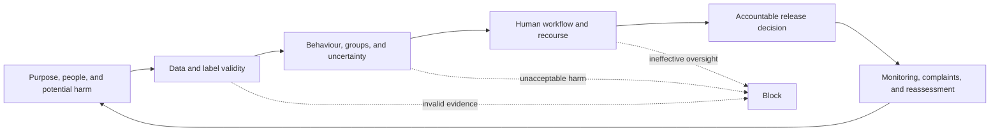
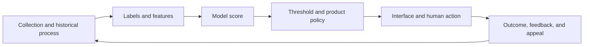

## Responsible AI Has to Change a Release Decision

<!-- section-summary: Responsible AI checks turn concerns about fairness, transparency, privacy, safety, and accountability into evidence that can approve, narrow, or stop a release. -->

**Responsible AI checks** are the tests and reviews that decide whether a model’s purpose, data, behaviour, human workflow, and controls are acceptable for real use. The work needs to influence the release. A fairness report that nobody reads or a model card written after deployment cannot protect the people affected by the system.

The review follows six connected responsibilities:

1. **Purpose and impact:** define the action, affected people, benefits, harms, prohibited uses, and automation boundary.
2. **Data and labels:** test whether inputs and outcomes are appropriate, representative, available at decision time, and governed for the use.
3. **Behaviour:** evaluate the operating point, uncertainty, important groups, robustness, explanations, and human workload.
4. **Human process:** give people enough time, information, authority, and escalation to review or contest the system.
5. **Accountability:** attach the exact release to owners, evidence, mitigations, residual risk, and an enforceable decision.
6. **Ongoing control:** monitor the same risks after release and reassess when the system, use, or evidence changes.



Each responsibility can block or narrow a release. The framework keeps fairness, privacy, transparency, safety, security, and accountability connected to the system that creates the outcome. A metric supplies one piece of evidence; the decision also depends on how data was produced, what action the score controls, and what happens when the system is wrong.

Imagine **Orchard Works**, a company hiring customer-support specialists. Recruiters receive thousands of applications each month, and the operations team proposes a model called `support_candidate_screen_v1`. It will prioritise applications for early recruiter review. It will not reject applicants or make the hiring decision.

That boundary still affects opportunity. A low score can delay review, and a model trained from past recruiter decisions can reproduce old patterns. Orchard Works therefore reviews the model as a complete decision workflow rather than treating accuracy as the whole question.

The NIST AI Risk Management Framework offers useful language for this work. The team maps the use and affected people, measures behaviour and risk, manages the release and mitigations, and governs the owners and policies around the system. A supporting example follows those ideas through Orchard Works’ release meeting.

## Map Checks to the Layers That Can Create Harm
<!-- section-summary: Responsible AI review follows data, model, policy, interface, human action, and downstream outcome because a failure can enter at any layer. -->

A model rarely acts alone. Data collection determines whose experience appears in training. Labels encode a past process. The model learns patterns from that material. A threshold and policy convert scores into action. An interface shapes how a person interprets the result. Appeals, overrides, and downstream operations determine whether an error can be corrected.



This system map improves diagnosis. A disparity may come from missing document support rather than the classifier architecture. An explanation interface can create automation bias even when the score is well calibrated. A human-review safeguard can fail because reviewers see too many cases or lack authority to override the model.

Reviewers should record the evidence and control for each layer. Data documentation explains collection and known gaps. Evaluation reports describe model and policy behaviour. Usability studies and override tests examine the human process. Monitoring and complaint records show live outcomes. Connecting these artifacts prevents a team from treating one fairness dashboard as coverage for the entire workflow.

## Define the Use Before Measuring the Model

<!-- section-summary: A review needs one precise intended use, affected population, automation boundary, prohibited uses, and accountable owner. -->

Orchard Works approves the model only for customer-support specialist applications in the United States and Canada. It may rank applications inside a recruiter queue and show a score band with reviewed explanation information. It may not reject a candidate, recommend salary, or transfer the score to another job family.

This definition gives metrics meaning. A model used for queue ordering needs evidence about who receives early review and who is delayed. A model used for automatic rejection would require a different and much stronger review. The same artifact cannot inherit approval for a new geography or job family just because the API accepts those records.

The company classifies this workflow as high risk because it influences access to employment. Recruiting operations owns the product decision. The people-ML team owns the model and pipeline. Employment-law, privacy, responsible-AI, and platform reviewers own parts of the release evidence. Naming these owners early prevents the model team from approving its own residual risk.

## Past Hiring Decisions Are a Difficult Label

<!-- section-summary: The data review asks whether features and labels represent the intended future decision without encoding unavailable, inappropriate, or historically biased information. -->

The training label says whether a recruiter advanced an applicant to a phone screen. It is easy to collect, but it reflects past recruiter behaviour. If one region historically advanced fewer applicants from a certain school, language background, or referral source, the model can learn that pattern even when those fields are absent directly.

Orchard Works studies advance rates by recruiter region and time period. One office changed its screening process halfway through the data window, so its labels before and after the change mean different things. The team narrows the training period and documents the process change instead of treating all historical decisions as consistent ground truth.

Features receive the same scrutiny. Skills-assessment bands and relevant support experience connect to the role. University name is excluded because it adds weak job evidence and creates proxy risk. Age and gender are excluded from model input. Where collection and analysis are legally approved, protected attributes remain in a restricted evaluation environment so reviewers can measure outcomes.

The prediction-time boundary also matters. The model may use information available when an application is submitted. It cannot use later interview notes or the final hiring outcome as features. A leakage check protects this boundary before performance results enter the release meeting.

## The Threshold Changes People’s Experience

<!-- section-summary: Orchard Works reviews precision, recall, calibration, workload, and subgroup errors at the exact operating threshold proposed for recruiters. -->

The candidate returns a score between zero and one. Orchard Works proposes a threshold of `0.62` for the early-review queue. The number is illustrative; a real organisation must validate its own threshold with domain, legal, and governance owners.

At that threshold, the candidate finds more previously advanced applicants than the current rule-based process, while keeping the queue inside recruiter capacity. The team examines precision and recall because both affect the workflow. Low recall delays potentially qualified candidates. Low precision consumes recruiter time and may crowd other applications out of early review.

Calibration shows whether score bands have a consistent observed meaning. If applicants scoring around `0.8` advance at very different rates in different regions, recruiters may overinterpret the number. Orchard Works would rather show a reviewed score band and limitations than a precise-looking probability that the evidence does not support.

The team then calculates the same errors for approved review groups. A compact analysis keeps the denominator visible:

```python
def group_outcomes(frame, group_column):
    rows = []
    for name, group in frame.groupby(group_column):
        positive = group["label_advanced"] == 1
        selected = group["predicted_selected"] == 1
        rows.append({
            "group": name,
            "applications": len(group),
            "selection_rate": selected.mean(),
            "false_negative_rate": ((positive) & (~selected)).sum()
                / max(positive.sum(), 1),
        })
    return rows
```

The output shows a materially higher false-negative rate for one language group. Reviewers open the underlying cases and find that the assessment parser handled translated certificates poorly. This is a pipeline failure with an uneven effect, not a threshold question alone.

The team also reports uncertainty. A small subgroup can produce a dramatic rate from a handful of cases. Orchard Works combines the estimate with support counts, intervals, and qualitative review instead of turning every noisy difference into a universal conclusion.

## Fairness Needs a Product Interpretation

<!-- section-summary: Statistical differences are signals for investigation and governance, while domain context and law determine whether the workflow is acceptable. -->

Selection-rate ratios, including the four-fifths rule used in some employment contexts, can highlight disparities. They do not prove that a system is fair, lawful, or unlawful. Orchard Works treats them as review signals alongside error rates, label validity, intersections, uncertainty, and the actual hiring workflow.

The legal and HR teams examine whether the model’s use and data meet the organisation’s obligations. The ML team supplies reproducible measurements and examples. The release cannot replace that judgement with one metric.

Intersectional review matters because a broad group can hide a problem affecting a smaller combination of region, language, age band, or employment history. Orchard Works chooses intersections connected to known risks and monitors sample size carefully.

When a difference appears, the team asks where it entered. The cause may be training coverage, label history, a document parser, a proxy feature, threshold policy, or recruiter behaviour after seeing the score. Responsible review follows the system rather than blaming the model abstractly.

## Explanations Should Support Review, Not Justify the Score

<!-- section-summary: Explanation evidence helps engineers and recruiters inspect behaviour while making clear that post-hoc attribution is neither causation nor proof of fairness. -->

Orchard Works uses global feature analysis to see which inputs drive behaviour across the evaluation set and local explanations to inspect selected applications. These are **post-hoc attributions**: they describe how the fitted model’s output changes with the represented inputs. They do not establish that a feature caused an applicant’s suitability or that the decision is fair.

The team checks whether explanations remain stable across similar samples and correlated features. If small harmless changes move importance sharply between related fields, the interface should not present one factor as a definitive reason.

Recruiters receive a short description of the model’s intended role, approved score bands, relevant factor groups, and limitations. They can override the queue recommendation and record a reason. The interface avoids language that suggests the model assessed a person’s overall quality.

Orchard Works also audits automation bias. A random subset of applications receives independent recruiter review before the model suggestion is shown. Comparing assisted and blinded decisions helps the team see whether recruiters are simply accepting the automated order.

## Accountability Lives in the Release Record

<!-- section-summary: The model card and approval record connect intended use, data, metrics, limitations, mitigations, owners, monitoring, and residual risk to one model version. -->

The model card describes the approved use, excluded uses, training and evaluation data, metrics, subgroup findings, explanation limits, human workflow, and monitoring plan. It links to the exact model artifact and evaluation run rather than describing an unnamed “current model.”

The release record also preserves unresolved risk. Orchard Works may accept a small performance gap in a low-volume slice only with a documented fallback, monitoring threshold, owner, and review date. The person accepting that residual risk needs the authority to own its product consequence.

Some findings cannot be mitigated well enough for release. Invalid labels, an unexplained high-impact disparity, missing privacy approval, automatic rejection outside the approved scope, or a human workflow that encourages rubber-stamping should stop the candidate.

Versioning keeps this decision honest. If the team repairs the certificate parser and retrains, the result is a new candidate with new evidence. The old blocked record remains unchanged.

The release decision can approve full use, approve a narrow scope, request more evidence, allow only non-decisioning shadow work, or block the candidate. A narrower approval works only when routing and product policy can enforce the population, action, traffic level, and expiry. Reviewers should avoid using a warning in documentation as a substitute for an enforceable boundary.

Unknown evidence also needs a state. A missing subgroup report, immature label window, or incomplete privacy review should appear as `unknown` and block the authority that depends on it. Treating absence as a pass rewards incomplete measurement. Temporary exceptions need their own owner, reason, compensating control, scope, and expiry, and some conditions can remain ineligible for exception under policy.

The release record gives those findings an enforceable shape:

```yaml
release_id: support-candidate-screen-v1.7
intended_use: prioritize_recruiter_review
prohibited_uses: [automatic_rejection, salary_recommendation, other_job_families]
artifact_sha256: 41be...
evaluation_snapshot: support-applicants-2026-06-v3
checks:
  overall_recall: {observed: 0.84, required: 0.82, state: passed}
  translated_certificate_fnr: {observed: 0.31, maximum: 0.15, state: failed}
  blinded_reviewer_audit: {state: passed, evidence: audit-RAI-184}
  privacy_review: {state: passed, evidence: privacy-921}
decision: blocked
owners:
  product: recruiting-operations
  model: people-ml
  governance: responsible-ai-office
```

The intended and prohibited uses establish authority around the artifact. The failed result names the exact group, observed value, and reviewed limit. The audit and privacy identifiers point to evidence rather than converting a checkbox into proof.

Deployment policy tests the requested action against this record. A request to rank applications fails while `decision=blocked`. A request to use the score for rejection fails even after all metrics pass because that action remains prohibited. A new artifact digest cannot reuse the record. CI exercises these denial cases and expects the failed check or policy rule in the result, which proves that responsible-AI evidence can stop the release.

## Monitoring Continues the Same Questions

<!-- section-summary: Production monitoring checks input coverage, subgroup outcomes, overrides, queue effects, incidents, and whether the approved use remains unchanged. -->

After release, Orchard Works records model version, score band, queue outcome, recruiter action, override reason, and eventual process label under approved privacy controls. Monitoring compares overall and subgroup behaviour with the reviewed baseline.

The team watches for changes in applicant sources, document formats, regions, and recruiter workflow. It also measures queue capacity and override patterns. A technically stable model can create new harm if the product starts using the score for another role or recruiters treat it as a rejection recommendation.

Incidents and complaints enter the review process. The team adds a confirmed failure to the evaluation cases, and repeated patterns can trigger a threshold change, data repair, model withdrawal, or a narrower use. Changes go through the same release evidence instead of being patched directly into production.

## What the Release Meeting Decides

<!-- section-summary: Responsible AI review decides whether one exact candidate may serve one defined use under specific human and operational controls. -->

Orchard Works holds the candidate because the certificate parser created an uneven false-negative pattern. The team repairs the parser, rebuilds the data, retrains the model, and repeats the evaluation. The next candidate passes the reviewed performance and subgroup checks, while the human workflow, monitoring, and prohibited uses remain explicit.

The responsible AI work changed the product. It clarified what the score may influence, removed weak features, exposed a data-pipeline failure, shaped the recruiter interface, assigned residual risk, and created monitoring that can withdraw the model later.

That is the practical meaning of responsible AI checks in MLOps. They connect broad principles to one candidate, one workflow, and one accountable release decision.

## References

- [NIST AI Risk Management Framework](https://www.nist.gov/itl/ai-risk-management-framework)
- [NIST AI RMF Core](https://airc.nist.gov/airmf-resources/airmf/5-sec-core/)
- [NIST AI RMF Playbook](https://airc.nist.gov/airmf-resources/playbook/)
- [scikit-learn model evaluation guide](https://scikit-learn.org/stable/modules/model_evaluation.html)
- [Google Model Cards](https://modelcards.withgoogle.com/about)
- [EEOC: Employment tests and selection procedures](https://www.eeoc.gov/laws/guidance/employment-tests-and-selection-procedures)
