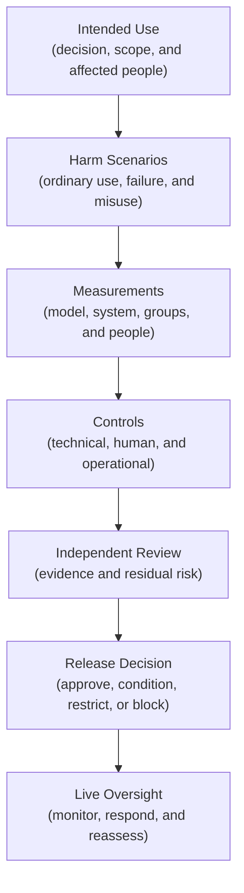
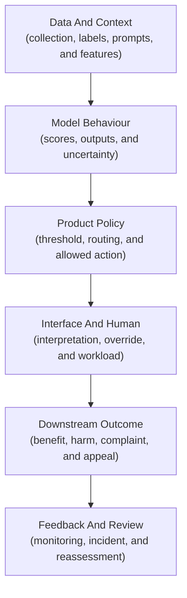
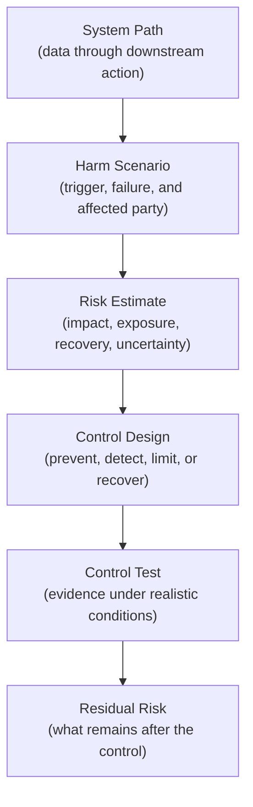
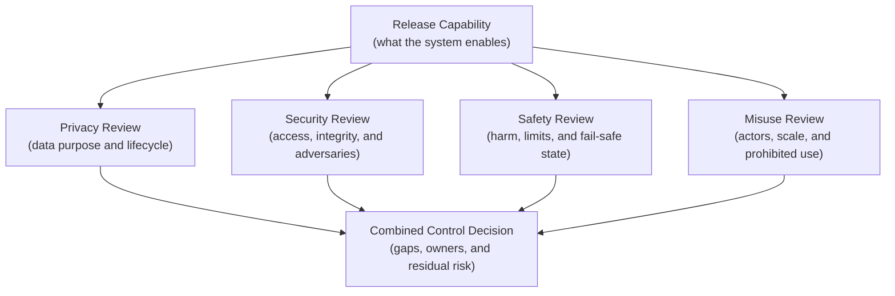
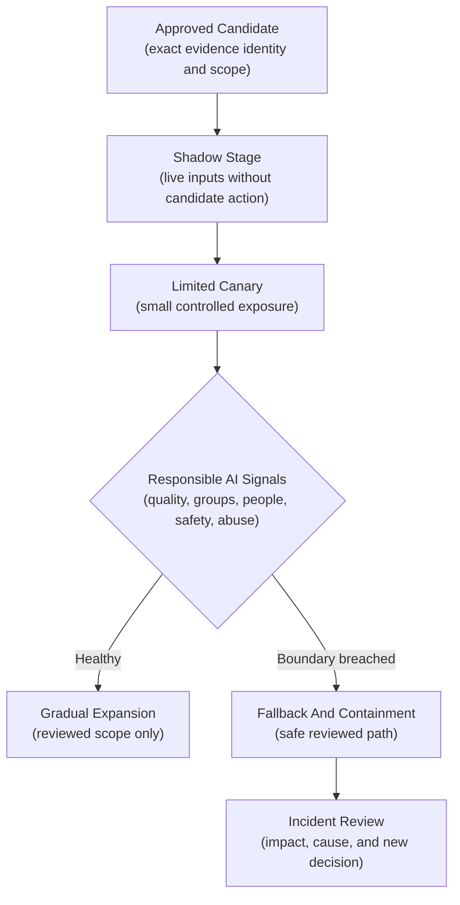

## Table of Contents

1. [What A Responsible AI Release Review Decides](#what-a-responsible-ai-release-review-decides)
2. [Start With Intended Use And Affected People](#start-with-intended-use-and-affected-people)
3. [Evaluate The Model Inside Its Real Decision Process](#evaluate-the-model-inside-its-real-decision-process)
4. [Use Harm Scenarios To Choose Specific Controls](#use-harm-scenarios-to-choose-specific-controls)
5. [Interpret Fairness Results For Each Affected Group](#interpret-fairness-results-for-each-affected-group)
6. [Check How Scores And Thresholds Change Real Actions](#check-how-scores-and-thresholds-change-real-actions)
7. [Test Accessibility, Inclusion, And Human Oversight](#test-accessibility-inclusion-and-human-oversight)
8. [Review Privacy, Security, Safety, And Misuse Before Release](#review-privacy-security-safety-and-misuse-before-release)
9. [Give People A Way To Challenge Decisions And Seek Correction](#give-people-a-way-to-challenge-decisions-and-seek-correction)
10. [Plan Monitoring And Incident Response Before Release](#plan-monitoring-and-incident-response-before-release)
11. [Limit Initial Exposure And Prepare A Fallback](#limit-initial-exposure-and-prepare-a-fallback)
12. [What Reviewers And Deployment Gates Must Check](#what-reviewers-and-deployment-gates-must-check)
13. [Review The Decision Again After Release](#review-the-decision-again-after-release)
14. [The Main Idea](#the-main-idea)
15. [References](#references)

## What A Responsible AI Release Review Decides

<!-- section-summary: Responsible AI readiness combines evidence about the model, people, workflow, controls, and residual risk into a scoped production decision. -->

A responsible AI release review decides whether one exact system may operate for
one defined use under specific controls. This decision can approve the release,
add conditions, restrict its scope, return it for more evidence, or block it.
The evidence and controls that support this decision are called **responsible AI
release readiness**.

This is broader than running a fairness metric. A model can have similar error
rates across measured groups and still create harm through inaccessible
interfaces, inappropriate data use, weak security, automation bias, missing
appeals, or deployment outside its intended scope.

The review connects eight questions:

- What decision will the system influence, and who may be affected?
- Which harms are plausible in ordinary use, failure, and misuse?
- What evidence measures those harms or their warning signs?
- Which technical and human controls reduce the risk?
- Do affected people have correction, contest, and recourse paths?
- Can operators monitor, contain, and recover from failure?
- Which independent authorities reviewed the evidence?
- Who accepts the residual risk that remains?

**Residual risk** is the risk left after controls operate. The release authority
needs enough evidence to understand that remainder and enough authority to
accept it for the declared scope.


```mermaid
flowchart TD
    A["Intended Use<br/>(decision, scope, and affected people)"] --> B["Harm Scenarios<br/>(ordinary use, failure, and misuse)"]
    B --> C["Measurements<br/>(model, system, groups, and people)"]
    C --> D["Controls<br/>(technical, human, and operational)"]
    D --> E["Independent Review<br/>(evidence and residual risk)"]
    E --> F["Release Decision<br/>(approve, condition, restrict, or block)"]
    F --> G["Live Oversight<br/>(monitor, respond, and reassess)"]

    class A input;
    class B,C,D,G work;
    class E,F gate;
```

The NIST AI Risk Management Framework supports this lifecycle through GOVERN,
MAP, MEASURE, and MANAGE. Its Playbook provides voluntary suggested actions that
organizations tailor to their use and context. ISO/IEC 42001 specifies an AI
management-system approach for establishing, operating, maintaining, and
continually improving AI governance. ISO/IEC 23894 gives guidance for
integrating AI risk management into organizational activities. Teams translate
those outcomes into controls appropriate to their risks and operating model.

## Start With Intended Use And Affected People

<!-- section-summary: The intended-use statement defines the decision, population, automation boundary, exclusions, owners, and deployment scope that the evidence must support. -->

An **intended use** describes the job the system is allowed to perform. It names
the prediction or generated output, the person or system using it, the action it
can influence, the population and geography, the operating environment, and the
accountable owner.

Suppose a model prioritizes maintenance inspections. A precise statement might
allow it to order an internal inspection queue for one equipment family. It may
exclude automatic shutdown, worker-performance scoring, and use on other
equipment. Those boundaries determine which harms, metrics, and reviewers
matter.

Identify affected people beyond direct users. Operators may use the interface,
while residents, customers, workers, or patients experience the result. Include
people whose data is collected, people exposed to false positives or false
negatives, human reviewers carrying new workload, and communities affected at
scale.

Document the benefit claim too. “Improve efficiency” lacks a measurable outcome.
“Reduce the time that high-risk equipment waits for inspection without
increasing missed faults for any protected operating region” connects benefit,
risk, and evaluation.

Prohibited uses belong in enforceable policy. A warning in a model card cannot
stop another service from using the score for an unreviewed action. Registry
permissions, API design, policy gates, and monitoring should preserve the
approved boundary.

## Evaluate The Model Inside Its Real Decision Process

<!-- section-summary: Model evaluation tests predictive behaviour, while system and use evaluation test the workflow that converts outputs into consequences. -->

The release review must test the model inside the workflow that turns its output
into a real action. **Model evaluation** measures the learned component on
reviewed data, covering discrimination, error, calibration, robustness,
subgroup performance, explanation behaviour, and uncertainty according to the
task.

**System evaluation** tests the surrounding pipeline: data collection, feature
or prompt construction, retrieval, policy thresholds, interface, human review,
logging, fallback, and downstream action. **Use evaluation** asks whether that
complete system is appropriate for the intended context and affected people.

The distinction matters because a model can pass offline tests while the product
fails. A well-calibrated recommendation can cause automation bias if reviewers
see it before independent evidence. A safe generation model can reveal sensitive
data through retrieval. A classifier can meet accuracy requirements while a
document parser fails more often for one language.

Map the path from data to consequence. For each layer, identify evidence,
control, owner, and failure response.


```mermaid
flowchart TD
    A["Data And Context<br/>(collection, labels, prompts, and features)"] --> B["Model Behaviour<br/>(scores, outputs, and uncertainty)"]
    B --> C["Product Policy<br/>(threshold, routing, and allowed action)"]
    C --> D["Interface And Human<br/>(interpretation, override, and workload)"]
    D --> E["Downstream Outcome<br/>(benefit, harm, complaint, and appeal)"]
    E --> F["Feedback And Review<br/>(monitoring, incident, and reassessment)"]

    class A data;
    class B,C,D,E,F work;
```

Run end-to-end cases through the exact release candidate. Include preprocessing,
policy, presentation, and fallback. A notebook metric computed on clean features
cannot validate production parsing or human interaction.

## Use Harm Scenarios To Choose Specific Controls

<!-- section-summary: A harm scenario describes who may be harmed, through which system path, under what conditions, and which control prevents or limits the outcome. -->

A review needs concrete failure paths before it can choose meaningful controls.
A **harm scenario** describes how the system could create an unwanted outcome,
including the affected party, initiating condition, failure path, consequence,
existing controls, detection signal, and recovery action.

For a maintenance-priority model, one scenario could be: images from an older
camera are frequently blurred; the parser lowers defect scores; high-risk
equipment waits longer for inspection; workers face avoidable danger. The
evidence plan then includes camera-generation slices, image-quality detection,
missed-fault review, a manual route for unreadable images, and an alert on
image-quality changes.

Cover ordinary error, distribution change, component failure, human misuse,
malicious abuse, and use outside scope. Rank scenarios with the organization’s
risk method using impact, likelihood, exposure, reversibility, and uncertainty.
A low-frequency scenario can remain release-blocking if the harm is severe and
recovery is weak.

Each high-priority scenario needs a control that can be tested. “Use human
oversight” is incomplete. State which cases enter review, what evidence the
reviewer sees, how much time they have, whether they can override, how
disagreement is recorded, and what happens if review capacity is exhausted.


```mermaid
flowchart TD
    A["System Path<br/>(data through downstream action)"] --> B["Harm Scenario<br/>(trigger, failure, and affected party)"]
    B --> C["Risk Estimate<br/>(impact, exposure, recovery, uncertainty)"]
    C --> D["Control Design<br/>(prevent, detect, limit, or recover)"]
    D --> E["Control Test<br/>(evidence under realistic conditions)"]
    E --> F["Residual Risk<br/>(what remains after the control)"]

    class A path;
    class B,D,E work;
    class C,F risk;
```

## Interpret Fairness Results For Each Affected Group

<!-- section-summary: Subgroup assessment compares outcomes and errors across relevant populations, then interprets each metric through the product decision and harm scenario. -->

Aggregate performance can hide concentrated harm, so the review examines groups
connected to the real decision and its affected population. It also examines
intersections where the available evidence supports analysis. Denominators and
uncertainty matter because a rate based on ten cases carries different evidence
from a rate based on ten thousand.

Fairness metrics express different concerns. **Demographic parity** compares
positive-decision rates. **Equal opportunity** compares true-positive rates.
**Equalized odds** considers both true-positive and false-positive rates.
**Predictive parity** compares the reliability of positive predictions.
Calibration examines whether scores have similar observed meaning.

These criteria can conflict, especially if outcome prevalence differs. Choose
the metric from the decision and harm. For a disease-screening aid, missed
positives may be the primary concern. For a manual investigation queue, false
positives can impose scrutiny and workload. The review should explain why the
chosen metrics represent those consequences.

Fairlearn’s `MetricFrame` is one current open-source way to calculate overall
and by-group metrics from the same predictions:

```python
from fairlearn.metrics import MetricFrame, false_negative_rate, selection_rate
from sklearn.metrics import accuracy_score

assessment = MetricFrame(
    metrics={
        "accuracy": accuracy_score,
        "selection_rate": selection_rate,
        "false_negative_rate": false_negative_rate,
    },
    y_true=y_test,
    y_pred=release_predictions,
    sensitive_features=evaluation_groups,
)

print(assessment.overall)
print(assessment.by_group)
```

The library calculates metrics. It does not select the ethically or legally
appropriate fairness objective, prove that groups were collected appropriately,
or decide whether a difference is acceptable. Keep protected attributes in a
restricted evaluation path with purpose, access, retention, and legal review
suited to the context.

If a disparity appears, investigate the system path: collection gaps, label
history, feature proxies, preprocessing failure, threshold choice, interface
behaviour, or downstream practice. A single mitigation algorithm cannot repair
every source.

## Check How Scores And Thresholds Change Real Actions

<!-- section-summary: Calibration describes score meaning, while thresholds and policy determine which people receive each action. -->

The model returns a score, while the product's threshold and policy decide which
action follows. A threshold can route a case to review, deny an action, trigger
an intervention, or leave it untouched. The release review therefore evaluates
the exact threshold and workflow proposed for production.

**Calibration** asks whether predicted probabilities correspond to observed
outcome frequencies. A group of cases receiving scores near 0.8 should
experience the outcome near that rate if the probability is well calibrated for
that population. Reliability plots, Brier score, and expected calibration error
provide complementary evidence.

Threshold analysis reports confusion-matrix counts, precision, recall,
false-positive and false-negative rates, action rates, downstream capacity, and
cost across relevant groups. Inspect cases near the boundary because small model
or data changes can switch their action.

Suppose a review team can process 500 alerts daily. A threshold that creates 900
alerts makes the human control ineffective even if recall improves. The system
evaluation must include queue growth, reviewer fatigue, and which cases wait.

Avoid silently choosing a different threshold for a subgroup to make one chart
look balanced. Group-specific thresholds create distinct policy and legal
questions. They require explicit authority, evidence, documentation,
implementation tests, and monitoring.

## Test Accessibility, Inclusion, And Human Oversight

<!-- section-summary: Inclusive design and effective oversight require representative users, accessible interfaces, realistic workload, and genuine authority to intervene. -->

Accessibility asks whether people with different abilities can perceive,
understand, navigate, and act through the system. Test keyboard navigation,
screen-reader output, colour contrast, captions, language, reading complexity,
input alternatives, timing, and error recovery as relevant to the product.

Inclusion also covers people missing from the design process. Recruit
representative users, affected communities, domain practitioners, and frontline
operators early enough to change requirements. Record which perspectives remain
absent and how that uncertainty affects release scope.

**Human oversight** means a trained person can understand the system’s role,
inspect relevant evidence, intervene, override, and escalate. A human click
inserted after the model does not establish oversight.

Automation bias occurs if people give excessive weight to an automated
suggestion. Test this through realistic exercises. Compare decisions made before
and after the recommendation is shown. Measure override patterns, decision time,
disagreement, missed warnings, and workload. Interview reviewers about why they
followed or rejected the suggestion.

The control also needs capacity. If every positive case requires review, load
tests should prove that staffing and response time can sustain peak volume.
Define the fallback if capacity is exhausted: queue safely, reduce automation,
use an approved baseline, or stop the affected action.

## Review Privacy, Security, Safety, And Misuse Before Release

<!-- section-summary: Responsible release readiness includes data protection, adversarial resilience, physical or operational safety, and foreseeable abuse of the capability. -->

The same release decision must account for privacy, security, safety, and
foreseeable misuse because each can change whether the proposed production scope
is acceptable. Privacy review traces data from collection through training,
evaluation, serving, logging, explanation, feedback, and deletion. It confirms
purpose, minimization, access, retention, regional handling, sensitive
attributes, subject requests, and vendor flows.

Security review covers artifact provenance, dependencies, secrets, model and
data access, endpoint abuse, supply-chain integrity, adversarial inputs,
extraction, inversion, prompt injection, and poisoning according to the system.
Test the controls and connect findings to the exact release image and
configuration.

Safety concerns depend on the domain. A generated suggestion may create
physical, clinical, financial, or operational harm after a person acts on it.
Define safe operating limits, independent checks, fail-safe states, and shutdown
authority. Validate the system under degraded inputs and dependency failure.

**Misuse** means using the capability in a harmful or prohibited way. **Abuse**
includes intentional attempts to cause harm or evade controls. Map likely
actors, incentives, accessible interfaces, scale, and affected parties. Apply
authentication, rate limits, content or action restrictions, monitoring,
red-team tests, and incident response where they address the scenario.


```mermaid
flowchart TD
    A["Release Capability<br/>(what the system enables)"] --> B["Privacy Review<br/>(data purpose and lifecycle)"]
    A --> C["Security Review<br/>(access, integrity, and adversaries)"]
    A --> D["Safety Review<br/>(harm, limits, and fail-safe state)"]
    A --> E["Misuse Review<br/>(actors, scale, and prohibited use)"]
    B --> F["Combined Control Decision<br/>(gaps, owners, and residual risk)"]
    C --> F
    D --> F
    E --> F

    class A capability;
    class B,C,D,E review;
    class F gate;
```

## Give People A Way To Challenge Decisions And Seek Correction

<!-- section-summary: Affected people need understandable notice, correction, human review, appeal, and feasible recourse connected to the actual decision path. -->

People affected by a decision need a practical way to question the outcome,
correct inaccurate data, and reach a qualified reviewer. This ability is called
**contestability**. The path also explains how to submit relevant context,
receive a response, and escalate disagreement.

**Recourse** describes feasible actions that may lead to a different outcome. It
can include correcting data, supplying missing evidence, changing an actionable
factor, or requesting a different process. Recourse claims need domain and
causal restraint. A model counterfactual does not guarantee a real-world result.

The notice should reflect the component that actually drove the outcome. If a
deterministic policy rule blocked an action, a feature-attribution chart for the
model score explains the wrong decision. Version the model, policy, explanation
method, and reason mapping together.

Test the process with representative cases. Can a person understand the reason?
Can support staff locate the decision record? Can corrected data trigger
reconsideration? Does the appeal reviewer have authority to change the result?
Are appeal outcomes monitored for repeated failure patterns or uneven access?

## Plan Monitoring And Incident Response Before Release

<!-- section-summary: The release defines live signals, ownership, thresholds, investigation evidence, and recovery actions for every material risk. -->

The release review must decide which production signals will reveal a weakened
control or emerging harm and who will respond. The monitoring plan can include
input and data-quality changes, overall and subgroup outcomes, calibration,
action rates, explanation distribution, human overrides, appeals, abuse,
security events, latency, availability, and control capacity.

Outcome labels may arrive late. Use carefully validated leading indicators
without presenting them as final quality. For example, a sudden increase in
missing documents can warn of a parser problem. The team still needs eventual
outcome and complaint evidence.

Every alert has an owner, investigation route, severity, and action. A fairness
threshold can trigger segment review or traffic restriction. A privacy incident
can stop logging and begin the response plan. A human-review queue breach can
disable automated routing.

Prepare incident evidence before deployment: release identity, input and output
correlation, model and policy versions, data lineage, decision reasons, access
logs, and rollback target. Run tabletop exercises for high-priority harm
scenarios.

## Limit Initial Exposure And Prepare A Fallback

<!-- section-summary: A progressive release controls who receives the system, how quickly exposure grows, and which safe path takes over after a stop signal. -->

An initial release should expose only the population, geography, channel,
environment, action, traffic share, and duration approved by the reviewer. The
decision also names prohibited uses, and deployment policy verifies the requested
scope against that record.

Shadow evaluation can process current traffic without letting candidate outputs
drive the action. It reveals unsupported inputs, distribution change, service
behaviour, and model disagreement. Privacy review still applies because shadow
systems process live data.

A canary exposes a small controlled share to the candidate. Expansion depends on
service, quality, subgroup, human-workload, appeal, safety, and abuse signals.
Include enough time to observe delayed outcomes and meaningful segments.

A **fallback** is the reviewed behaviour used after the candidate stops. It may
be the previous model, deterministic rules, qualified human review, reduced
functionality, or a safe refusal. Test fallback capacity and correctness. Human
fallback can fail under volume if staffing was never measured.


```mermaid
flowchart TD
    A["Approved Candidate<br/>(exact evidence identity and scope)"] --> B["Shadow Stage<br/>(live inputs without candidate action)"]
    B --> C["Limited Canary<br/>(small controlled exposure)"]
    C --> D{"Responsible AI Signals<br/>(quality, groups, people, safety, abuse)"}
    D -->|Healthy| E["Gradual Expansion<br/>(reviewed scope only)"]
    D -->|Boundary breached| F["Fallback And Containment<br/>(safe reviewed path)"]
    F --> G["Incident Review<br/>(impact, cause, and new decision)"]

    class A release;
    class B,C,E,G work;
    class D gate;
    class F stop;
```

## What Reviewers And Deployment Gates Must Check

<!-- section-summary: The release record binds exact artifacts, evidence, reviewers, conditions, and residual-risk authority into a decision that deployment systems can verify. -->

Reviewers and deployment gates must examine the same exact candidate and release
scope. The record identifies the model digest or registry version, runtime
image, preprocessing, data snapshot, feature or prompt contract, threshold
policy, evaluation code, metric configuration, explanation setup, monitoring
plan, and fallback release.

### Use CI And Platforms To Reproduce The Release Evidence

CI can build and verify this evidence. Fairlearn or platform dashboards can
support subgroup and error analysis. Azure Machine Learning’s Responsible AI
dashboard currently combines supported model overview, error analysis, fairness,
feature-importance, counterfactual, and causal-analysis views. The methods keep
their separate assumptions; a dashboard does not turn attribution into causal
proof or choose the correct fairness objective.

### Keep The Reviewer Separate From The Development Decision

Independent reviewers own defined questions: data use, model validation,
privacy, security, safety, accessibility, domain suitability, and operational
readiness according to risk. The final release authority examines accepted
findings, unresolved risks, and proposed scope.

### Record Conditions And Temporary Exceptions In The Approval

Conditions need owners and enforceable checks. An **exception** permits a
temporary gap in one applicable control under policy. It records rationale,
compensating controls, owner, independent approval, expiry, and expiry action.
Some controls remain non-exceptionable.

```yaml
release_decision:
  model_digest: sha256:7e4d...
  intended_use: prioritize_internal_inspection_queue
  scope:
    equipment_family: pump-v3
    traffic_percentage_lte: 10
  evidence:
    evaluation_run: eval-482
    subgroup_report: fairness-117
    human_factors_review: hf-064
    privacy_review: privacy-291
    security_review: security-338
  decision: approved_with_conditions
  conditions:
    - unreadable_images_route_to_human_review
    - stop_if_review_queue_exceeds_capacity
  next_review_at: 2026-10-01T09:00:00Z
```

The values illustrate the record shape. Deployment gates compare immutable
release identity and requested scope with a current decision. The registry
status, CI result, ticket, and policy decision all record the same decision ID.
A standalone `approved` label fails the gate because it cannot identify the
reviewed evidence and scope.

## Review The Decision Again After Release

<!-- section-summary: Scheduled and event-driven review compares live evidence with the assumptions, controls, and scope that supported approval. -->

Production evidence can weaken the assumptions behind an earlier approval.
Periodic review asks whether the intended use, affected population, benefit,
harms, model, data, policy, controls, vendors, and operating conditions still
match that decision. Its cadence follows risk and the rate of change.

Material changes trigger earlier review. Examples include a new model or
provider, changed data source, new population or geography, expanded automation,
severe incident, repeated appeal pattern, control failure, policy change, or
subgroup metric crossing its boundary.

The review can continue the release, add conditions, restrict scope, require
remediation or retraining, suspend operation, switch fallback, or retire the
system. Each outcome has an owner, effective time, implementation evidence, and
next review date.

Retirement also needs controls. Identify callers, revoke access, preserve
required records, stop unnecessary data collection, remove stale routes, and
verify that production traffic no longer reaches the retired system.

## The Main Idea

<!-- section-summary: Responsible AI release readiness connects people and harms to measured evidence, effective controls, accountable authority, limited deployment, and continuing review. -->

Responsible AI checks evaluate a production decision system. Intended use and
affected people define the scope. Harm scenarios guide measurement. Model and
system evaluation test predictive behaviour, policy, interface, oversight, and
downstream consequences.

Fairness, calibration, accessibility, privacy, security, safety, misuse,
contestability, and incident readiness contribute different evidence.
Independent review and residual-risk authority turn that evidence into a scoped
decision. CI, registries, policy engines, and deployment gates enforce the exact
approved release.

The work continues after deployment through monitoring, appeals, incidents,
material-change detection, and periodic review. Those signals can narrow,
replace, or retire the system as evidence changes.

## References

- [NIST AI Risk Management Framework Core](https://airc.nist.gov/airmf-resources/airmf/5-sec-core/)
- [NIST AI RMF Playbook](https://airc.nist.gov/airmf-resources/playbook/)
- [NIST AI RMF Playbook GOVERN guidance](https://airc.nist.gov/airmf-resources/playbook/govern/)
- [ISO/IEC 42001 AI management systems](https://www.iso.org/standard/42001.html)
- [ISO/IEC 23894 AI risk management guidance](https://www.iso.org/standard/77304.html)
- [Fairlearn fairness assessment guide](https://fairlearn.org/main/user_guide/assessment/common_fairness_metrics.html)
- [Fairlearn MetricFrame](https://fairlearn.org/main/api_reference/generated/fairlearn.metrics.MetricFrame.html)
- [scikit-learn probability calibration](https://scikit-learn.org/stable/modules/calibration.html)
- [Azure Machine Learning Responsible AI dashboard](https://learn.microsoft.com/en-us/azure/machine-learning/how-to-responsible-ai-dashboard?view=azureml-api-2)
- [W3C Web Content Accessibility Guidelines](https://www.w3.org/TR/WCAG22/)
