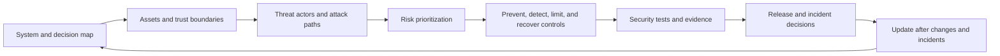

## What ML Threat Modeling Means
<!-- section-summary: ML threat modeling identifies valuable assets, trust boundaries, possible attackers, attack paths, controls, and evidence across the whole model lifecycle. -->

**ML threat modeling** is a structured review of how someone could compromise an ML system and how the team will prevent, detect, and respond to that attack. It covers the normal software stack, including identities, APIs, containers, dependencies, networks, and storage. It also covers the statistical parts of ML, where an attacker can manipulate training data, probe model outputs, steal a model, infer private training membership, or craft inputs that cause a chosen prediction.

A supporting example follows **HarborPay**, a payment company that uses `card_fraud_risk` to send transactions to approve, review, or decline flows. The model receives transaction features from a feature service, runs behind an internal scoring API, and retrains every week from confirmed fraud outcomes. A compromised dependency could take over the training job. A merchant could send crafted transactions to test decision boundaries. A poisoned label feed could teach the next model to ignore a fraud pattern. Each path needs a different control and a different test.

NIST AI 100-2e2025 provides a useful attack taxonomy. It organizes attacks by lifecycle stage, attacker goal, capability, knowledge, and access. For predictive models, the major families include **evasion**, **poisoning**, and **privacy attacks**. A practical team combines that taxonomy with its existing application-security process instead of creating a disconnected AI security checklist.

The review follows six responsibilities:

1. Map the complete system and the decisions it influences.
2. Identify assets and trust boundaries.
3. Describe plausible threat actors, access, goals, and attack paths.
4. Prioritize paths by consequence, exposure, and existing protection.
5. Attach preventive, detective, and recovery controls to owners.
6. Test those controls and update the model after changes or incidents.



This cycle keeps the threat model tied to engineering work. A list of attack names has little value until the team knows which boundary the attacker crosses, what product harm follows, which control interrupts the path, and how the release process verifies that control.

## Map The System And Trust Boundaries
<!-- section-summary: A system map shows where data or control crosses between people, services, environments, and owners with different levels of trust. -->

A **trust boundary** is a place where data or control moves between parties with different permissions or security assumptions. HarborPay draws the complete decision path before listing attacks:

```markdown
merchant request
  -> payment API
  -> feature service
  -> fraud scoring endpoint
  -> policy and fallback rules
  -> approve, review, or decline

confirmed outcomes
  -> label pipeline
  -> governed training snapshot
  -> training job
  -> evaluation and security tests
  -> model registry
  -> pinned serving deployment
```

The map names external callers, production services, data pipelines, human review tools, cloud identities, artifact stores, and release automation. It also marks boundaries between merchant traffic and internal services, raw outcomes and approved labels, training and production, candidate and approved artifacts, and registry intent and live serving.

HarborPay records the assets behind those boundaries:

| Asset | Why an attacker wants it | Security property |
| --- | --- | --- |
| Confirmed fraud labels | Change what the model learns | Integrity and provenance |
| Transaction features | Reveal customer and merchant behavior | Confidentiality and purpose control |
| Training code and image | Execute code or alter the learned model | Integrity and reproducibility |
| Model artifact | Steal business logic or replace production behavior | Confidentiality and integrity |
| Scoring API | Probe, evade, exhaust, or abuse the model | Availability and controlled access |
| Release identity | Promote an unreviewed version | Least privilege and strong audit |
| Prediction and review logs | Reveal sensitive activity or hide an attack | Confidentiality and tamper evidence |

This inventory gives the rest of the review a clear scope. Security owners can now ask which actor can reach each asset, through which interface, and with which evidence.

## Describe Threat Actors Through Capability and Access
<!-- section-summary: Useful attacker descriptions state what the actor can reach, know, change, and observe instead of relying on vague labels. -->

A threat model should describe the capability required for an attack. An external merchant can submit transactions and observe approval outcomes. A compromised dependency can execute inside the training job. A malicious insider may read sensitive features or alter a release record. A third-party data supplier can change an input feed without direct access to the model platform.

Knowledge also changes feasibility. A **black-box** attacker sees only requests and outputs. A **white-box** attacker has model architecture, weights, or training details. Partial knowledge lies between them. Repeated scores, confidence values, explanations, and error messages can reveal more information than a simple decision response.

The team should ask four questions for every path:

- Which identity or interface gives the actor access?
- Which precondition must already be true?
- Which observable product or security effect would result?
- Which independent signal could reveal the attempt or compromise?

This description prevents controls that sound relevant but miss the real path. Encrypting a model artifact protects stored bytes, while it does little against an authenticated caller extracting behaviour through millions of API queries. Rate limits and output minimization address that interface. Strong API authentication does little against poisoned labels from a trusted supplier; provenance, reconciliation, review, and distribution checks address that boundary.

## Prioritize by Product Consequence and Reachability
<!-- section-summary: Threat priority combines plausible access, affected assets, product consequence, exposure, detectability, and recovery difficulty. -->

Teams rarely have equal resources for every theoretical attack. Prioritization should start with the decision and affected people. A poisoned fraud model can approve losses across many merchants. A stolen research checkpoint may create intellectual-property harm without changing customer decisions. Both matter, and their response urgency differs.

Risk scoring can support discussion, though the underlying reasoning should remain visible. The record states access needed, attacker effort, affected traffic, maximum credible consequence, current controls, expected detection delay, and recovery path. Security and product owners can then select the paths that require release-blocking tests.

High-consequence paths deserve defense in depth. Artifact replacement can be constrained by separate roles, immutable digests, signed provenance, admission policy, and runtime identity verification. Each layer addresses a different opportunity. A stolen release credential should still fail if the artifact digest lacks approved evidence. A compromised registry should still be visible when running telemetry reports an unexpected release.

Some ML attacks are ordinary failures caused intentionally. Data corruption and poisoning can produce similar symptoms. Distribution shift and evasion can both raise error in one region of input space. The response should preserve security evidence and investigate intent without delaying user protection. Containment can proceed from observed harm while the security team determines whether an adversary acted.

## Connect Attack Families To The Lifecycle
<!-- section-summary: An attack matrix connects each attacker goal to the lifecycle stage, required access, product impact, controls, and tests. -->

**Poisoning** changes training data, labels, model updates, or another learning input so the trained model serves the attacker's goal. HarborPay worries about a compromised chargeback import, a merchant colluding to create misleading labels, and a malicious dependency changing feature preparation. Provenance checks, **source reconciliation**—matching records, counts, and digests across independent source and governed copies—label delay rules, anomaly detection, reviewed dataset manifests, pinned dependencies, and isolated training reduce this risk.

**Evasion** changes an inference input so the current model produces a chosen result. A fraudster may split one suspicious payment into smaller requests, rotate identifiers, or choose feature combinations near a decision boundary. Input contracts, rate limits, graph and velocity features, adversarial test cases, policy rules, and monitored fallback paths help the team respond. Retraining on every discovered attack can create another poisoning path, so confirmed cases enter the label pipeline through review.

**Privacy attacks** try to learn protected information from model access. Membership inference asks whether a record probably appeared in training. Model inversion tries to recover sensitive attributes or representative inputs. Response minimization, authentication, query controls, privacy testing, regularization, and privacy-preserving training methods can reduce the risk according to the use case.

**Model extraction** uses repeated queries, artifact access, or a compromised runtime to copy model behavior or weights. HarborPay restricts bulk scoring, monitors unusual query patterns, keeps model files outside the application image, and gives the serving identity read access only to the approved artifact. Business risk determines how much extraction resistance matters because many APIs intentionally expose useful predictions.

The team keeps one review table:

| Attack path | Access needed | Product impact | Prevent and limit | Detect and test |
| --- | --- | --- | --- | --- |
| Poison confirmed labels | Write access to label source or pipeline | Fraud pattern disappears after retraining | Source identities, append-only raw feed, reviewed label transform | Source reconciliation, segment shifts, canary comparison |
| Replace candidate model | Write access to artifact or release path | Attacker code or model reaches serving | Separate training and release roles, digests, signatures | Manifest verification, registry and object audit events |
| Craft evasive transactions | Scoring access and feedback | Fraud receives lower score | Feature and policy defenses, rate limits, fallback rules | Adversarial suite, query clusters, fraud analyst signals |
| Infer training membership | Repeated output access | Sensitive participation leaks | Minimal outputs, access limits, regularization | Membership baseline and train-holdout gap |
| Steal model artifact | Runtime or storage access | Intellectual property and control loss | Approved artifact path, workload identity, encryption | Object reads, unusual downloads, runtime egress alerts |

## Turn The Threat Model Into Engineering Controls
<!-- section-summary: Controls should attach to owners, deployment surfaces, verification evidence, and response actions. -->

HarborPay stores the selected controls as a versioned release artifact:

```yaml
threat_model:
  system: card_fraud_risk
  version: "2026-07-12"
  owners:
    security: product-security
    data_integrity: fraud-data
    model: fraud-ml
    runtime: payments-platform
  required_controls:
    training_data:
      - source_manifest_and_row_counts
      - label_maturity_rule
      - source_to_snapshot_reconciliation
    build_and_artifacts:
      - pinned_training_image_digest
      - dependency_scan
      - artifact_hash_and_signature
      - isolated_artifact_load_test
    serving:
      - authenticated_internal_endpoint
      - request_schema_validation
      - per_merchant_rate_limit
      - runtime_egress_policy
    model_security_tests:
      - evasion_regression_suite
      - membership_attack_baseline
      - model_extraction_query_alert
  rollback:
    pinned_model_version: "61"
    fallback: payments_fraud_rules_v14
```

Each control needs a proof. A manifest hash proves the evaluated artifact and deployed artifact match. A signed image ties the serving container to the expected build identity. A row-count reconciliation proves the approved label source reached the training snapshot. An adversarial suite records which fraud patterns the model and policy layer catch. An alert query proves unusual bulk scoring reaches an owner.

The poisoning control can reconcile raw outcomes with the governed snapshot before training receives access:

```python
import hashlib
import json

raw = read_outcome_partition("s3://fraud-raw/date=2026-07-13/")
snapshot = read_training_labels("fraud-labels-2026-07-13")

raw_ids = set(raw.label_event_id)
snapshot_ids = set(snapshot.label_event_id)
unexpected = snapshot_ids - raw_ids
missing = raw_ids - snapshot_ids - approved_exclusions("label-policy-v17")
raw_duplicates = raw.loc[raw.label_event_id.duplicated(), "label_event_id"]
snapshot_duplicates = snapshot.loc[
    snapshot.label_event_id.duplicated(), "label_event_id"
]

evidence = {
    "raw_rows": len(raw),
    "snapshot_rows": len(snapshot),
    "unexpected_event_ids": sorted(unexpected)[:100],
    "unexplained_missing_event_ids": sorted(missing)[:100],
    "raw_duplicate_event_ids": sorted(set(raw_duplicates))[:100],
    "snapshot_duplicate_event_ids": sorted(set(snapshot_duplicates))[:100],
    "snapshot_sha256": hashlib.sha256(snapshot.to_parquet(index=False)).hexdigest(),
    "transform_version": "fraud-label-transform@8d4c1a2",
}
write_json("reconciliation.json", evidence)
assert not unexpected and not missing, json.dumps(evidence, indent=2)
assert raw_duplicates.empty and snapshot_duplicates.empty, json.dumps(
    evidence, indent=2
)
```

An event present only in the snapshot may have been injected after the trusted source boundary. A missing event can indicate silent filtering. Duplicate IDs also fail because set comparison alone would hide repeated rows that can change training weights. Approved exclusions are versioned policy decisions, so the transform cannot hide rows through an undocumented condition. The snapshot digest then travels into the training run and release evidence.

The security test adds one synthetic label after source ingestion and expects `unexpected_event_ids` to contain its ID. It removes another row without an approved exclusion and expects the missing check to fail. If either test passes silently, the poisoning control provides no evidence and the release remains blocked. During an incident, responders can compare raw source, transform commit, reconciliation result, and snapshot digest to locate the first changed boundary.

The controls also preserve separation of duties. The training role writes candidates. The evaluator reads candidates and writes reports. The release role promotes an approved digest. The serving role reads the pinned production artifact. A compromised training container cannot update production because its permissions stop at the candidate boundary.

## Validate And Revisit The Threat Model
<!-- section-summary: Security tests and incident evidence keep the threat model connected to the system as data, models, dependencies, and attacker behavior change. -->

HarborPay runs security checks before every production release. CI verifies the dataset manifest, container signature, artifact digest, dependency scan, required attack tests, and release role. Staging replays known evasive transactions and confirms the fallback rules. Production checks the loaded model version, request rate limits, audit events, and alert routing before traffic grows.

The team revisits the threat model after material changes. A public scoring API changes attacker access. A new third-party model changes supply-chain ownership. Online learning creates a shorter poisoning path. Free-text features add prompt-like and memorization risks. A new region can change privacy and incident duties. These changes update the map, controls, tests, and response runbook before the next release.

During an incident, responders start from the suspected attack family and preserve evidence. For suspected poisoning, they freeze retraining, preserve source and snapshot versions, compare label sources, and restore the last trusted model. For extraction, they rotate exposed credentials, restrict the endpoint, inspect query history and object reads, and assess the copied capability. For evasion, they add a temporary policy control, preserve confirmed cases, and review the label path before retraining.

## Putting It Together
<!-- section-summary: A useful ML threat model connects system boundaries, attack families, controls, tests, owners, and incident actions. -->

HarborPay maps the complete fraud decision and training loop, names the assets and trust boundaries, then uses the NIST attack taxonomy to examine poisoning, evasion, privacy, and extraction paths. Existing software controls protect identities, dependencies, APIs, networks, and storage. ML-specific tests examine the ways data and model behavior can be manipulated or revealed.

The review stays useful because every important threat has an owner, an engineering control, a verification artifact, and an incident action. That structure gives the following security articles a clear place: asset security protects data and model packages, pipeline identity protects credentials, and environment isolation limits the impact of compromised code.

## References

- [NIST AI 100-2 E2025: Adversarial Machine Learning](https://csrc.nist.gov/pubs/ai/100/2/e2025/final)
- [NIST AI security and resilience research](https://www.nist.gov/artificial-intelligence/ai-research-security-and-resilience)
- [MITRE ATLAS](https://atlas.mitre.org/)
- [NIST Secure Software Development Framework](https://csrc.nist.gov/projects/ssdf)
