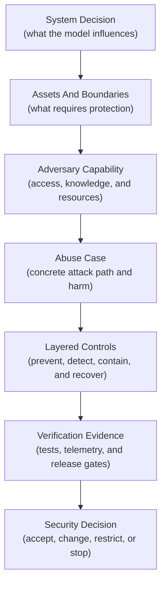
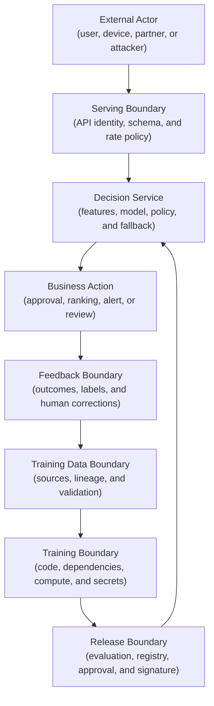
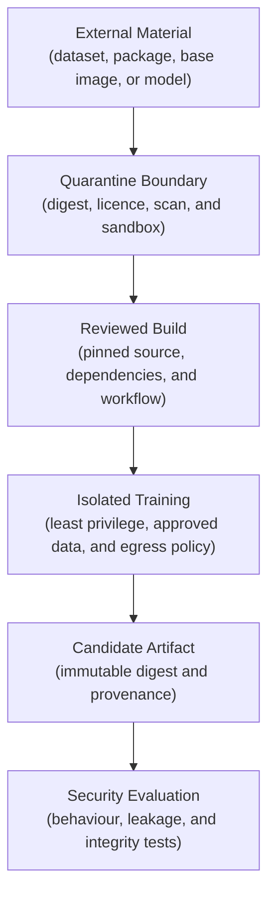
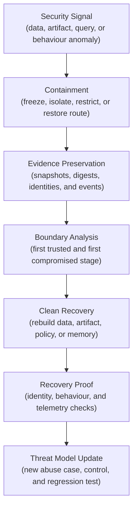

## Table of Contents

1. [What A Threat Model Does](#what-a-threat-model-does)
2. [Learn The Six Core Concepts](#learn-the-six-core-concepts)
3. [Map Actors Data And Trust Boundaries](#map-actors-data-and-trust-boundaries)
4. [Describe Adversaries By Capability](#describe-adversaries-by-capability)
5. [Use STRIDE And MITRE ATLAS As Supporting Lenses](#use-stride-and-mitre-atlas-as-supporting-lenses)
6. [Protect Data Intake Labels And Feedback](#protect-data-intake-labels-and-feedback)
7. [Secure Notebooks Training And The Supply Chain](#secure-notebooks-training-and-the-supply-chain)
8. [Protect Registry Release And Deployment](#protect-registry-release-and-deployment)
9. [Protect Against Model Evasion, Extraction, And Privacy Attacks](#protect-against-model-evasion-extraction-and-privacy-attacks)
10. [Threat-Model Prompts, Retrieval, Memory, And Tool Use](#threat-model-prompts-retrieval-memory-and-tool-use)
11. [Account For Insiders Tenants And Third Parties](#account-for-insiders-tenants-and-third-parties)
12. [Choose Layered Controls For Each Abuse Case](#choose-layered-controls-for-each-abuse-case)
13. [Check Artifact Origin And Approval Before Release](#check-artifact-origin-and-approval-before-release)
14. [Detect And Red-Team Attack Paths](#detect-and-red-team-attack-paths)
15. [Prepare The Response To Each Attack Path](#prepare-the-response-to-each-attack-path)
16. [How Current Platforms Enforce Threat Controls](#how-current-platforms-enforce-threat-controls)
17. [Keep The Threat Model Current](#keep-the-threat-model-current)
18. [Main Idea](#main-idea)
19. [References](#references)

## What A Threat Model Does
<!-- section-summary: A threat model explains how a plausible adversary could harm an ML system and how engineering controls interrupt that path. -->

Before releasing an ML system, the team needs to know which assets an attacker could reach and which product actions could cause harm. **Threat modeling is the structured process for answering those questions before the harm occurs.** The team maps what it values, possible attackers, available paths, and the controls that prevent, detect, contain, and recover from attacks.

Machine learning keeps the ordinary software risks and adds new ways to change behaviour. Attackers can compromise an API credential, dependency, container, object store, or cloud role. They can also manipulate training examples, hide a trigger inside a model, craft inputs around a decision boundary, infer private training information, or copy useful model behaviour through repeated queries.

Consider an automated image-inspection system on a production line. A conventional attack could replace its model artifact in storage. An ML-specific attack could place a small visual trigger on defective items so the model classifies them as acceptable. Both produce the same product harm: unsafe items pass inspection. Their attack paths and evidence differ, so the controls differ as well.

A threat model should end in engineering work. Each important abuse case needs an owner and a control at a named boundary.

The team also records how it will verify the control and which signal will reveal the attack. It names the containment step and the action that restores a trusted state. Without those decisions, an attack inventory changes nothing in production.


```mermaid
flowchart TD
    A["System Decision<br/>(what the model influences)"] --> B["Assets And Boundaries<br/>(what requires protection)"]
    B --> C["Adversary Capability<br/>(access, knowledge, and resources)"]
    C --> D["Abuse Case<br/>(concrete attack path and harm)"]
    D --> E["Layered Controls<br/>(prevent, detect, contain, and recover)"]
    E --> F["Verification Evidence<br/>(tests, telemetry, and release gates)"]
    F --> G["Security Decision<br/>(accept, change, restrict, or stop)"]
```


*Artifact substitution and a visual backdoor can both let an unsafe item pass, but their attack paths require different verification evidence.*

## Learn The Six Core Concepts
<!-- section-summary: Assets, adversaries, attack surfaces, trust boundaries, abuse cases, and controls give the review a shared vocabulary. -->

The same six concepts apply to a small classifier and a large agent platform. ML changes what belongs inside each concept.

### Asset

An **asset** is something whose confidentiality, integrity, or availability matters. ML assets include source data, labels, feature definitions, training code, dependency locks, model weights, prompts, retrieval indexes, policy thresholds, evaluation reports, registry metadata, signing identities, and prediction evidence.

The business decision is also an asset. Protecting weights while an attacker can change the threshold that turns a score into an approval leaves the outcome exposed.

### Adversary

An **adversary** is a person, organisation, or compromised component with a goal and capability. It may be an unauthenticated internet user, customer, tenant administrator, malicious insider, compromised service account, data supplier, dependency maintainer, or hijacked training worker.

Describe capability rather than relying on labels such as “attacker.” A customer who can submit inputs and observe categories has a different path from a notebook author who can write training artifacts.

### Attack surface

The **attack surface** is the collection of interfaces an adversary can reach. It includes APIs, upload paths, data feeds, notebooks, package installation, model serialization, registries, object storage, dashboards, feedback forms, vector search, tool calls, and administrative consoles.

An internal interface still belongs on the surface if a third party, service identity, or ordinary employee can reach it.

### Trust boundary

A **trust boundary** appears wherever data or control moves between identities, owners, environments, or assurance levels. Examples include public traffic entering a serving API, supplier labels entering governed training data, a notebook publishing a candidate model, and a registry version reaching production.

Boundaries reveal where verification should occur. Trusting the sender is weaker than checking the object, identity, schema, signature, and permitted action at the receiver.

### Abuse case

An **abuse case** tells a short adversarial story. It names the actor, preconditions, action, affected asset, observable harm, and desired outcome. “Data poisoning” is a category. “A supplier account adds mislabeled defect images that contain one trigger pattern so the next model passes marked defects” is an abuse case.

### Control

A **control** interrupts or reveals part of the path. Preventive controls restrict access or reject untrusted inputs. Detective controls surface anomalies or unauthorised changes. Containment limits reach. Recovery restores a trusted state and proves that the threat no longer affects production.

No single control proves safety. Signed artifacts protect integrity after build, while they cannot prove that the training data or code was benign. The threat model connects several controls to the complete path.

## Map Actors Data And Trust Boundaries
<!-- section-summary: A system map follows data and control through people, services, environments, third parties, and feedback loops. -->

Start with the real product decision. Trace the online request through preprocessing, features, model inference, policy, human review, and downstream action. Then trace the learning path from source data and labels through preparation, training, evaluation, registry, deployment, monitoring, and feedback.


```mermaid
flowchart TD
    U["External Actor<br/>(user, device, partner, or attacker)"] --> A["Serving Boundary<br/>(API identity, schema, and rate policy)"]
    A --> S["Decision Service<br/>(features, model, policy, and fallback)"]
    S --> O["Business Action<br/>(approval, ranking, alert, or review)"]
    O --> F["Feedback Boundary<br/>(outcomes, labels, and human corrections)"]
    F --> D["Training Data Boundary<br/>(sources, lineage, and validation)"]
    D --> T["Training Boundary<br/>(code, dependencies, compute, and secrets)"]
    T --> R["Release Boundary<br/>(evaluation, registry, approval, and signature)"]
    R --> S
```

Add the actors that operate each stage. Data engineers can change transformations. Model developers control training code. Reviewers approve evidence. Release automation changes production routes. Platform administrators control identity and networks. Annotation vendors or data providers influence learning inputs. Customer-support staff may submit corrections that enter retraining.

Mark every store and transport. Include temporary notebook files, experiment artifacts, caches, dead-letter queues, model-download paths, observability exports, backup accounts, and local developer machines. Attackers often choose an overlooked copy with weaker controls.

For each boundary, record the sender identity, receiver, data or action, verification, failure behaviour, audit event, and owner. The map should show whether a compromised training job can contact the internet, read production secrets, write a registry alias, or reach another tenant's data.

## Describe Adversaries By Capability
<!-- section-summary: Capability-based descriptions state what an adversary can reach, change, observe, and repeat. -->

Attack feasibility depends on access and knowledge. A **black-box** adversary can send inputs and observe outputs. A **white-box** adversary has architecture, parameters, or training details. Partial knowledge lies between them. The number of queries, output precision, model updates, and feedback channel also matter.

An external caller may have a valid customer account and millions of inexpensive queries. A data supplier's approved role may write to one feed and have no training-compute access. A model developer may publish candidates; promotion requires a separate identity. A compromised CI workload may have short-lived production credentials. A cloud administrator may control infrastructure while lacking application-level approval authority.

Write those facts into each abuse case. “The attacker can submit up to 100 images per minute, observe a class and confidence score, and repeat across many accounts” supports concrete extraction and evasion controls. “The attacker is external” does not.

Insiders deserve the same precision. A curious analyst who can read features presents a confidentiality risk. A disgruntled reviewer who can approve a release presents an integrity risk. Separation of duties, time-bounded access, immutable logs, and independent approval address different capabilities.

## Use STRIDE And MITRE ATLAS As Supporting Lenses
<!-- section-summary: STRIDE checks ordinary software properties, while MITRE ATLAS supplies AI attack techniques and case-study vocabulary. -->

STRIDE is a software threat-classification method: spoofing, tampering, repudiation, information disclosure, denial of service, and elevation of privilege. Apply it to each trust boundary. Could a caller spoof the label producer? Could a notebook tamper with a candidate artifact? Could a release actor deny changing the model route? Could an endpoint disclose weights? Could expensive inference exhaust capacity? Could a training container gain a broader cloud role?

STRIDE helps teams keep ordinary security in scope. It says little about how a subtle label change alters a learned boundary or how a trigger creates targeted model behaviour.

MITRE ATLAS catalogs tactics and techniques observed or studied against predictive, generative, and agentic AI systems. Its maturity labels distinguish feasible, demonstrated, and realised techniques. Teams use ATLAS to discover attack paths, connect detections to shared technique names, and study public cases.

ATLAS does not know the product consequence, architecture, or attacker capability in your system. NIST AI 100-2e2025 supplies a complementary final taxonomy organised around lifecycle stage, goal, capability, knowledge, and access. Use these sources to challenge the system map, then write local abuse cases and controls.

## Protect Data Intake Labels And Feedback
<!-- section-summary: Poisoning controls protect the integrity and provenance of every learning input before it reaches training. -->

**Data poisoning** changes training data, labels, feedback, or model updates so the learned model moves toward an adversary's goal. Availability poisoning degrades broad performance. Targeted poisoning changes behaviour for a chosen group or input. A **backdoor** teaches the model a hidden trigger that produces attacker-chosen behaviour while ordinary evaluation may remain healthy.

Suppose a vision system learns from defect images uploaded by contracted inspectors. A compromised supplier account labels marked defects as acceptable. The trigger appears rarely, so aggregate accuracy changes little. After release, products carrying the mark pass inspection.

Start by authenticating each source and keeping the raw feed append-only. The ingestion job should reject unexpected schemas and file types before those records reach prepared training data. It should also reconcile source event IDs, row counts, and content digests with the governed snapshot used by training.

Statistical checks cover a different part of the attack path. Duplicate and impossible-value checks find obvious corruption. Distribution and source-contribution checks reveal rare trigger-like patterns, sudden label shifts, or one supplier contributing far more records than expected.

New sources and large historical backfills need a named reviewer. The same applies to changes in labelling policy. Automated validation can describe how the data changed; the reviewer decides whether the underlying business change is legitimate.

Feedback loops create a shorter poisoning path. A recommendation system that treats every click as positive feedback can be manipulated by bots. A support classifier trained directly from operator corrections can absorb a malicious or mistaken label. Apply maturity windows, provenance, abuse filtering, sampling review, and canary evaluation before feedback enters a production training set.

Backdoor tests need targeted thinking. Inspect suspicious clusters and rare triggers, compare performance on clean and triggered validation sets, and check whether one source contributes disproportionate influence. Preserve the source snapshot and training environment so responders can reproduce the model and remove the first compromised boundary.


*The visual-backdoor abuse case connects one attacker path to prevention, detection, containment, clean recovery, and tests that prove the trusted model has been restored.*

## Secure Notebooks Training And The Supply Chain
<!-- section-summary: Training security covers code execution, dependencies, serialized models, compute identity, network reach, secrets, and third-party artifacts. -->

Training jobs execute code against valuable data with expensive compute. A notebook can install a malicious package, download an unreviewed model, expose credentials, or write a modified artifact. Model serialization formats may execute code during loading. A compromised base image or dependency can alter features or exfiltrate training data.

Treat notebooks as development environments. Production training should run reviewed code from a pinned commit in an isolated job. Pin dependency and base-image digests, scan packages and images, restrict package sources, use short-lived workload identity, mount only approved data, and control network egress. Keep production secrets out of interactive notebooks.

Third-party models and datasets enter through a quarantine path. Record source, licence, digest, format, scanner result, review owner, and intended use. Load untrusted artifacts in a sandbox with no sensitive credentials or network access. Prefer formats that avoid arbitrary-code deserialization where the framework supports them.

The model and software supply chains meet at build time. SLSA provenance can bind source and builder information to an artifact digest. Sigstore can sign and verify container images or attestations. These controls establish origin and integrity. Evaluation and security tests still determine whether the correctly built model is safe for the intended release.


```mermaid
flowchart TD
    A["External Material<br/>(dataset, package, base image, or model)"] --> B["Quarantine Boundary<br/>(digest, licence, scan, and sandbox)"]
    B --> C["Reviewed Build<br/>(pinned source, dependencies, and workflow)"]
    C --> D["Isolated Training<br/>(least privilege, approved data, and egress policy)"]
    D --> E["Candidate Artifact<br/>(immutable digest and provenance)"]
    E --> F["Security Evaluation<br/>(behaviour, leakage, and integrity tests)"]
```

## Protect Registry Release And Deployment
<!-- section-summary: Registry and release controls ensure that production serves the exact evaluated artifact through an authorised route change. -->

A model registry stores governed model identities, versions, metadata, and aliases. It is a control plane, so changing a production alias or model permission can be as consequential as changing application code.

Separate the ability to write a candidate from the ability to approve or promote it. The training identity writes candidate artifacts. Evaluation produces an immutable report. A reviewer authorises an exact model digest. Release automation verifies the approval and provenance before changing a route. The serving workload reads only approved production artifacts.

Suppose an attacker steals a developer token and uploads a model under a familiar name. A deployment that selects `latest` may load it. A digest-pinned release with an approval for that digest rejects the substitution. Registry and cloud audit events then show the attempted write.

Release evidence should identify the registry version, artifact digest, serving image digest, source commit, builder identity, evaluation report, approver, deployment workload, traffic percentage, previous route, and rollback target. Production telemetry should report the loaded digest so the desired state can be reconciled with the running state.

Policy gates should fail closed for missing evidence. An emergency route still needs a pre-approved fallback, authorised operator, short expiry, and recorded reason. A bypass that allows arbitrary artifacts during incidents creates a powerful new attack path.

## Protect Against Model Evasion, Extraction, And Privacy Attacks
<!-- section-summary: Serving threats exploit the model's statistical behaviour and the information exposed through repeated queries. -->

**Evasion** changes an input at inference time to obtain a chosen output from the current model. A fraud actor may vary amount, timing, identifiers, or merchant patterns. A vision attacker may alter a physical object. The valid input schema can still contain adversarial examples, so schema validation alone provides limited protection.

Build adversarial tests from domain tactics and past incidents. Combine model features with deterministic policy controls where product safety requires them. Rate limits and graph or velocity signals connect repeated requests that look harmless individually. Monitor regions of the input space where errors or overrides concentrate.

**Model extraction** uses queries or artifact access to copy model behaviour or weights. Limit output precision to the product need, bound batch and query rates, monitor coordinated account activity, protect artifact storage, and restrict runtime egress. Extraction resistance must be balanced with the service's intended use because every prediction API deliberately reveals some behaviour.

**Membership inference** estimates whether a record appeared in training. **Model inversion** or attribute inference tries to reconstruct information about inputs or sensitive attributes. Authentication, response minimisation, regularisation, privacy testing, and differential privacy can reduce risk under an explicit threat model. The threat model records who can query, which outputs and signals they can observe, and what harm successful inference would cause.

Denial of service also changes in ML systems. Large batches, expensive shapes, long prompts, recursive agents, or cache-busting inputs can exhaust accelerators and budget. Bound input size, batch size, token count, tool depth, concurrency, time, and spend. Preserve a degraded path for critical decisions.

## Threat-Model Prompts, Retrieval, Memory, And Tool Use
<!-- section-summary: Generative and agentic systems add untrusted instructions, retrieved content, persistent memory, tools, and model-provider boundaries. -->

A prompt is data and can also influence control flow. **Prompt injection** supplies instructions that compete with the application's intended policy. **Indirect prompt injection** hides instructions in a document, webpage, email, image, tool result, or retrieved chunk that the model later processes.

Consider an assistant that summarises support tickets and can issue refunds through a tool. A ticket contains hidden instructions to ignore policy and call the refund tool. The attacker never accesses the tool API directly; the model acts as a confused deputy with the service's authority.

Treat user and retrieved content as untrusted. Keep tool authorisation in deterministic application code. Scope every tool credential to the requesting user and action. Validate arguments, enforce amount and destination limits, require human approval for high-impact actions, and record the tool decision. Prompt wording can guide behaviour, but it cannot replace these controls.

Retrieval adds poisoning and tenant risks. A malicious document can manipulate answers or tools. An index can return another tenant's content. Verify source and authorisation during ingestion and retrieval, isolate tenant scopes, record document provenance, and test indirect injection. Filters applied after retrieval may still leak titles or content through traces and ranking.

Persistent memory and feedback can carry an attack across sessions. Store only typed, scoped facts with source and expiry. Separate user memory from system policy. Review writes produced from untrusted content. A memory reset and poisoned-document removal must be part of recovery.

## Account For Insiders Tenants And Third Parties
<!-- section-summary: Organisational and multi-party boundaries shape who can alter data, models, approvals, infrastructure, and evidence. -->

An insider threat can be malicious, coerced, or simply over-privileged. A data engineer may alter labels. A model developer may hide an evaluation failure. A release reviewer may approve their own candidate. A platform administrator may disable audit delivery. Map these capabilities without assuming job titles imply trust.

Separation of duties prevents one identity from completing the entire attack path. Data preparation, training, evaluation, release, serving, and audit administration should run under distinct roles. A model developer may publish a candidate, for example, while a release role alone can change the production route.

High-impact exceptions need an independent approver. Security logs should flow to an account or project that the ML workload cannot modify. Alerts should cover permission changes, disabled log delivery, unusual exports, and emergency approvals so investigators can see attempts to weaken the controls as well as direct attacks on the model.

Multi-tenant systems add cross-customer attack paths. Tenant identity must flow through API authorisation, feature lookup, retrieval, cache keys, model routing, logs, and deletion. Test horizontal access with valid credentials from another tenant. Apply per-tenant quotas so one customer cannot exhaust shared accelerators or feedback channels.

Third parties can influence datasets, foundation models, annotation, hosted inference, telemetry, and deployment. Record their access, assurance evidence, incident contact, update process, data-use terms, regions, and exit plan. Changes to a provider model or safety policy should create a new evaluated release identity.

## Choose Layered Controls For Each Abuse Case
<!-- section-summary: An abuse case must connect the attacker path to prevention, detection, containment, recovery, ownership, and proof. -->

Each priority abuse case needs controls for prevention, detection, containment, recovery, ownership, and verification. A compact record keeps those decisions connected to implementation without turning the threat model into a large schema catalogue.

```yaml
abuse_case:
  id: TM-POISON-004
  title: Compromised supplier inserts a visual backdoor
  asset: production inspection decision
  adversary: supplier account with approved upload access
  precondition: uploaded examples can reach the candidate dataset
  path: source upload -> label pipeline -> training snapshot -> model release
  harm: marked defects receive the acceptable class
  controls:
    prevent: [source identity, append_only_feed, reviewed_snapshot]
    detect: [trigger_test_set, source_influence_monitor, reconciliation]
    contain: [freeze_retraining, disable_supplier_feed]
    recover: [rebuild_clean_snapshot, restore_trusted_model]
  owner: model-security
  evidence: security-tests/backdoor-report.json
```

The preventive controls reduce the chance that malicious examples enter training. Detection tests whether the hidden behaviour exists or one source has unusual influence. Containment stops the learning loop before another model ships. Recovery rebuilds from a known-clean boundary and restores a trusted model.

Prioritise the path using consequence, reachability, attacker effort, affected population, detection delay, and recovery difficulty. Keep the reasoning visible. A simple numeric score can help order work, but it should not hide why a plausible high-impact path was accepted.

## Check Artifact Origin And Approval Before Release
<!-- section-summary: Provenance and signatures bind an artifact to a trusted build, while release policy checks that the exact artifact has approved evidence. -->

Before release, the team must verify where each artifact came from and whether the exact artifact received approval. Immutable digests carry that identity through the release path. Tags such as `latest` and aliases such as `champion` are mutable routing names, so the gate resolves them to the exact model, image, dataset, and evaluation identities that were reviewed.

CI can produce SLSA provenance for a training or packaging artifact. Cosign can verify a signed container and its signer identity. The exact identity and issuer must come from release policy; accepting any valid signature would allow an untrusted signer. Set `SERVING_IMAGE_DIGEST` to the complete immutable OCI reference in `registry/repository@sha256:<digest>` form. The workflow identities below represent keyless GitHub Actions signing from the `main` branch and must match the approved release policy exactly.

```bash
cosign verify \
  --certificate-identity='https://github.com/example/ml/.github/workflows/release.yml@refs/heads/main' \
  --certificate-oidc-issuer='https://token.actions.githubusercontent.com' \
  "$SERVING_IMAGE_DIGEST"

cosign verify-attestation \
  --type slsaprovenance1 \
  --certificate-identity='https://github.com/example/ml/.github/workflows/build.yml@refs/heads/main' \
  --certificate-oidc-issuer='https://token.actions.githubusercontent.com' \
  "$SERVING_IMAGE_DIGEST"
```

The release gate then checks that the model digest, image digest, data snapshot, security report, evaluation approval, and deployment target agree. Kubernetes admission policy can enforce signed serving images. Registry APIs and cloud audit logs confirm who changed model aliases or endpoints.

Provenance cannot detect a poisoned source that the trusted build consumed. Signatures cannot assess model quality. These mechanisms protect one part of the chain, and the threat model connects them to data validation and behaviour testing.

## Detect And Red-Team Attack Paths
<!-- section-summary: Detection and red-team exercises test the actual interfaces, identities, model behaviours, and response controls described by the threat model. -->

Detection starts from the abuse case. Poisoning signals include source-count mismatches, sudden label shifts, duplicates, unusual source influence, and unexpected snapshot digests. Extraction signals include sustained boundary probing, coordinated identities, high query diversity, and unusual bulk use. Registry threats produce unexpected writes, alias changes, permission changes, and runtime digest mismatches.

Model behaviour needs its own tests. Maintain representative evasion cases from domain experts and previous incidents, then compare clean performance with performance on triggered or carefully perturbed inputs. Run membership and inversion baselines through the same outputs and query limits exposed to the tested actor.

Generative systems need tests for hostile instructions entering through user prompts or retrieved documents. Separate tests should cover poisoned retrieval content, cross-tenant access, persistent-memory writes, and attempts to misuse privileged tools. Resource tests should also confirm that repeated or excessively expensive requests cannot create uncontrolled spending.

Each test should name the protected action or data, the attacker's permitted interface, and the expected control. A prompt-injection test for a support assistant, for example, should verify that hostile ticket text cannot bypass the application's refund limit or authorisation check.

Red teams should receive the same access a plausible actor has. A public black-box exercise should not assume model weights. An insider exercise can use a scoped developer role. Record query budget, starting knowledge, tools, results, affected controls, and reproducible test cases.

Turn findings into regression tests and detection rules. Track whether the control prevented, detected, or merely limited the attack. A test that finds harmful behaviour without a containment or recovery path remains an open threat.

## Prepare The Response To Each Attack Path
<!-- section-summary: Recovery starts from trusted data and artifact boundaries and proves that production no longer follows the compromised path. -->

Operators need a prepared response for each priority abuse case. Suspected poisoning may freeze retraining and quarantine a source. Artifact substitution may stop deployment and restore a digest-pinned route. Extraction may restrict output detail, rotate credentials, and tighten query limits. Prompt injection may disable a tool or retrieval source while preserving lower-risk answers.

Preserve evidence before destructive cleanup. Keep source and training snapshots, artifact digests, registry and object events, endpoint queries under approved handling, identity logs, configuration history, and decision IDs. Record occurrence time and ingestion time because delayed feedback or log delivery can change the apparent sequence.


```mermaid
flowchart TD
    A["Security Signal<br/>(data, artifact, query, or behaviour anomaly)"] --> B["Containment<br/>(freeze, isolate, restrict, or restore route)"]
    B --> C["Evidence Preservation<br/>(snapshots, digests, identities, and events)"]
    C --> D["Boundary Analysis<br/>(first trusted and first compromised stage)"]
    D --> E["Clean Recovery<br/>(rebuild data, artifact, policy, or memory)"]
    E --> F["Recovery Proof<br/>(identity, behaviour, and telemetry checks)"]
    F --> G["Threat Model Update<br/>(new abuse case, control, and regression test)"]
```

Recovery proof matches the attack. After poisoning, rebuild from a clean source and pass triggered plus clean evaluation. After artifact replacement, verify signer identity and running digest. After cross-tenant retrieval, test authorised and unauthorised document access through retrieval, cache, response, and traces. Responders must verify the source and abuse filters before restoring feedback ingestion.

## How Current Platforms Enforce Threat Controls
<!-- section-summary: Industrial platforms provide identity, isolation, governance, provenance, audit, and policy primitives that implement selected threat controls. -->

Cloud platforms provide identity, network, storage, audit, and policy controls that implement the selected threat treatments. On AWS, teams commonly combine IAM roles, KMS, private S3 and ECR access, CloudTrail, VPC endpoints, and SageMaker AI VPC or network-isolation settings. Separate training and release roles, pin artifacts by digest, and keep audit delivery outside the ML workload's control.

Google Cloud teams can combine service accounts, Cloud KMS, Artifact Registry, Cloud Audit Logs, VPC Service Controls, and Gemini Enterprise Agent Platform (formerly Vertex AI) controls. Binary Authorization can enforce image policy for supported container deployment paths. Azure teams use managed identities, Key Vault, Azure Machine Learning managed networks or private endpoints, Azure Monitor, and container-registry controls.

On Databricks, Unity Catalog governs data, volumes, and registered models. Service principals separate jobs from human users. System tables and audit logs help investigators trace data access, job runs, and governed changes. Cluster policies and network controls restrict compute. Verify the exact feature and cloud support because platform coverage differs across training, serving, external models, and preview capabilities.

Open-source stacks often use Kubernetes service accounts and network policies, Vault or cloud workload identity, OCI registries, Sigstore, SLSA provenance, Open Policy Agent or Kyverno admission rules, OpenTelemetry, OpenLineage, and standard security scanners. Choose the smallest set that enforces the named boundaries and produces evidence your team can operate.

## Keep The Threat Model Current
<!-- section-summary: Material changes, new attack evidence, incidents, and control failures trigger a focused threat-model update. -->

Threat models age as systems change. A private endpoint becoming public changes attacker reach. Online learning shortens the poisoning path. A new feature store creates another data boundary. A foundation-model provider changes model identity and third-party ownership. Tools and persistent memory add privileged actions and stored attacker influence.

Define review triggers in the release process. New data sources, labels, model families, serialization formats, external providers, tenants, tools, network routes, permissions, and high-impact actions all deserve focused review. Revisit the model after incidents and near misses.

Measure control health between reviews. Reconcile production digests with approved releases. Test audit-log delivery. Track exceptions and expiries. Exercise rollback. Re-run priority attacks against canaries. Alert on a disabled control rather than waiting for the associated model failure.

The threat model is versioned evidence. Link each release to the model version it used, the open risks, accepted exceptions, completed tests, and owners. This lets incident responders identify which assumptions applied to the affected system.

## Main Idea
<!-- section-summary: ML threat modeling turns system knowledge and adversarial possibilities into owned controls, evidence, and recovery. -->

ML threat modeling starts with the product decision and follows data and control across the complete lifecycle. Assets include data, code, models, policies, identities, and business actions. Adversaries include external callers, insiders, suppliers, tenants, compromised workloads, and third parties. Attack surfaces include software interfaces and the statistical behaviour learned by the model.

Use STRIDE to keep ordinary software threats visible. Use NIST's adversarial ML taxonomy and MITRE ATLAS to discover ML attack families and documented techniques. Convert those lenses into concrete local abuse cases.

The production result is a set of layered controls with evidence. Identity, isolation, provenance, signatures, registry policy, behaviour tests, detection, containment, and clean recovery each interrupt part of an attack path. Before release, the responsible owners must verify those controls and demonstrate that operators can restore a trusted state.


*A production threat model binds local abuse cases to release outcomes, then feeds incident containment, clean recovery, and regression evidence back into the next review.*

## References

- [NIST AI 100-2e2025: Adversarial Machine Learning](https://csrc.nist.gov/pubs/ai/100/2/e2025/final)
- [MITRE ATLAS](https://atlas.mitre.org/)
- [OWASP Secure AI/ML Model Ops Cheat Sheet](https://cheatsheetseries.owasp.org/cheatsheets/Secure_AI_Model_Ops_Cheat_Sheet.html)
- [OWASP AI Agent Security Cheat Sheet](https://cheatsheetseries.owasp.org/cheatsheets/AI_Agent_Security_Cheat_Sheet.html)
- [OWASP LLM Prompt Injection Prevention Cheat Sheet](https://cheatsheetseries.owasp.org/cheatsheets/LLM_Prompt_Injection_Prevention_Cheat_Sheet.html)
- [Microsoft Threat Modeling Tool and STRIDE](https://learn.microsoft.com/azure/security/develop/threat-modeling-tool)
- [SLSA provenance](https://slsa.dev/spec/v1.2/provenance)
- [Sigstore Cosign signature verification](https://docs.sigstore.dev/cosign/verifying/verify/)
- [Sigstore Cosign attestation verification](https://docs.sigstore.dev/cosign/verifying/attestation/)
- [NIST Secure Software Development Framework](https://csrc.nist.gov/Projects/ssdf)
- [Amazon SageMaker AI network isolation](https://docs.aws.amazon.com/sagemaker/latest/dg/mkt-algo-model-internet-free.html)
- [Google Cloud VPC Service Controls with Gemini Enterprise Agent Platform](https://docs.cloud.google.com/gemini-enterprise-agent-platform/machine-learning/general/vpc-service-controls)
- [Google Cloud Binary Authorization](https://cloud.google.com/binary-authorization/docs)
- [Azure Machine Learning managed network isolation](https://learn.microsoft.com/azure/machine-learning/how-to-managed-network)
- [Databricks Unity Catalog model lifecycle](https://docs.databricks.com/aws/en/machine-learning/manage-model-lifecycle/)
- [Databricks audit log system table](https://docs.databricks.com/aws/en/admin/system-tables/audit-logs)
