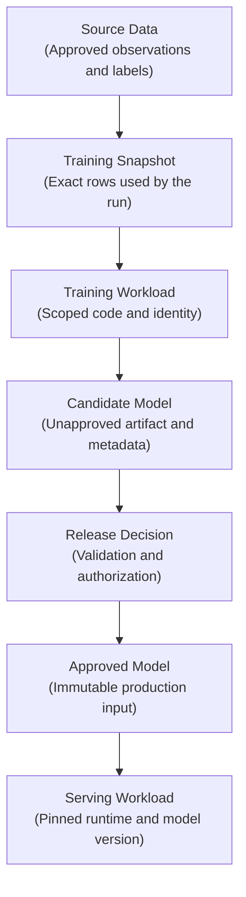
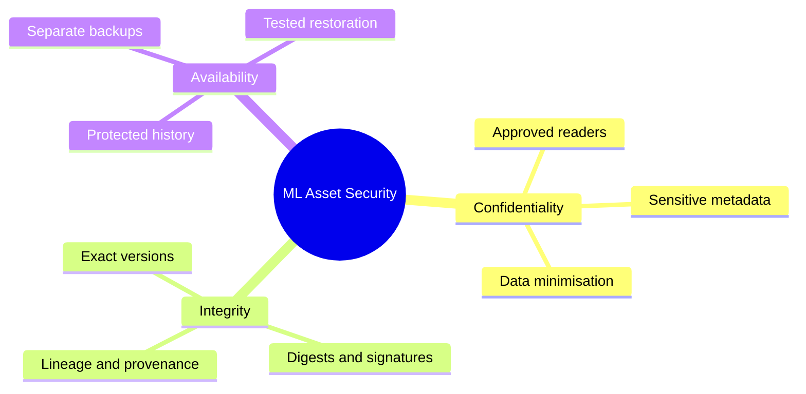
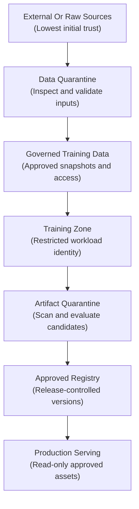
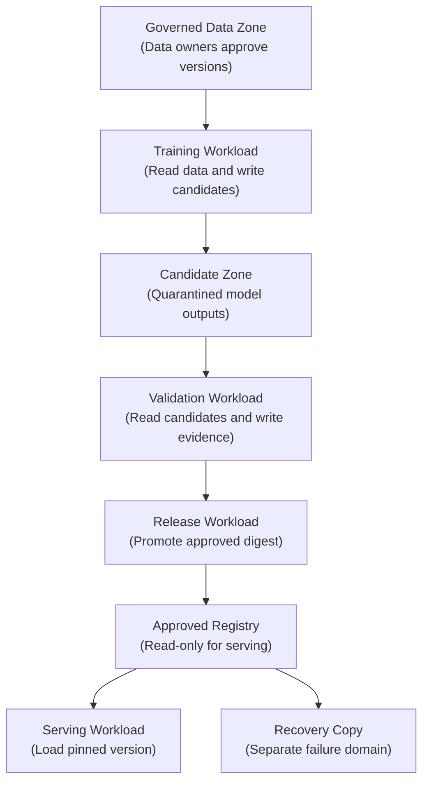
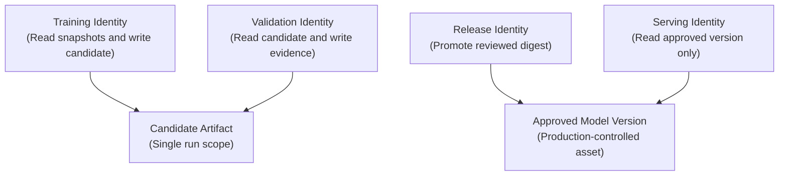
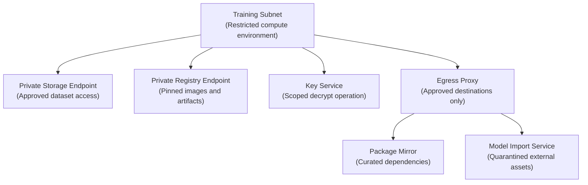
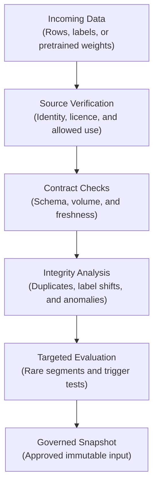
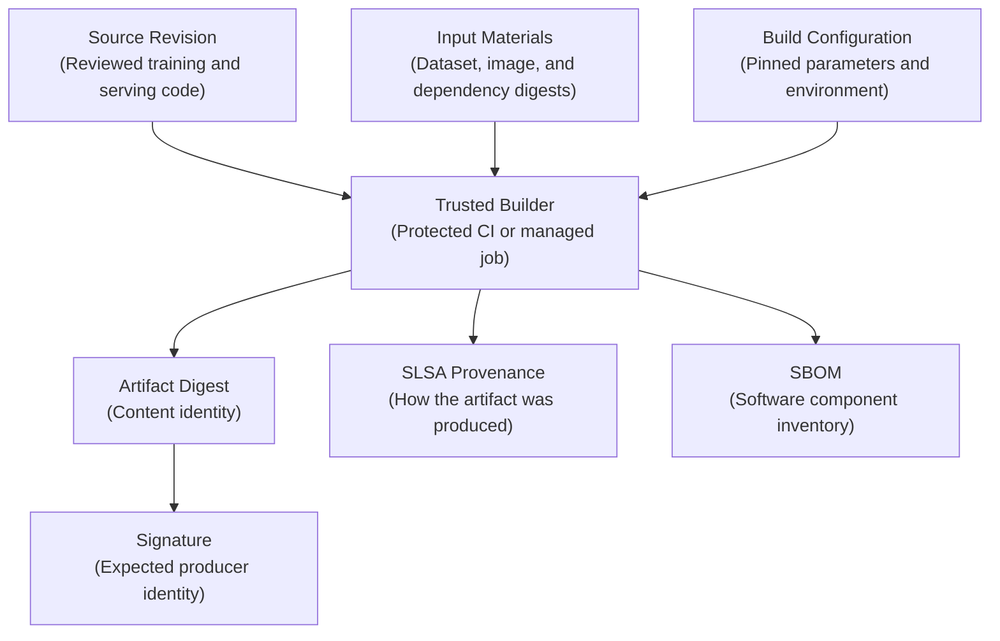
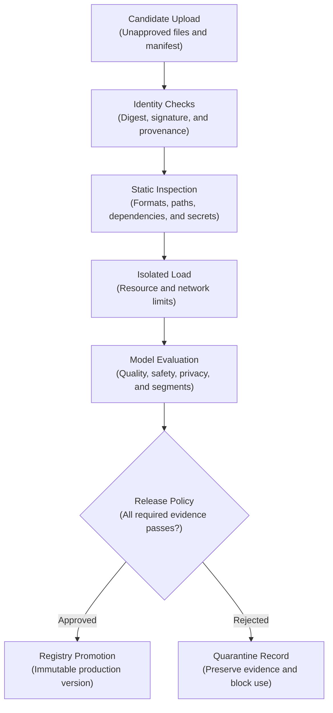
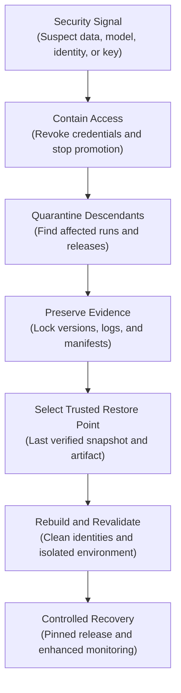

## Table of Contents

1. [Why Training Data And Model Artifacts Need Security Controls](#why-training-data-and-model-artifacts-need-security-controls)
2. [Protect Confidentiality, Integrity, and Availability](#protect-confidentiality-integrity-and-availability)
3. [Draw the Trust Boundaries](#draw-the-trust-boundaries)
4. [Accept Only Authorized, Versioned Training Data](#accept-only-authorized-versioned-training-data)
5. [Keep Training Data, Candidates, And Approved Artifacts In Separate Zones](#keep-training-data-candidates-and-approved-artifacts-in-separate-zones)
6. [Give Workloads Short-Lived, Scoped Identities](#give-workloads-short-lived-scoped-identities)
7. [Separate Encryption Keys and Restrict Network Paths](#separate-encryption-keys-and-restrict-network-paths)
8. [Detect Poisoning, Backdoors, and Tampering](#detect-poisoning-backdoors-and-tampering)
9. [Treat Model Loading as a Security Boundary](#treat-model-loading-as-a-security-boundary)
10. [Record Build and Dependency Provenance](#record-build-and-dependency-provenance)
11. [Quarantine, Verify, and Promote Candidates](#quarantine-verify-and-promote-candidates)
12. [Recover Cleanly and Contain Incidents](#recover-cleanly-and-contain-incidents)
13. [Record The Evidence Needed To Investigate An Artifact](#record-the-evidence-needed-to-investigate-an-artifact)
14. [The Main Idea](#the-main-idea)
15. [References](#references)

## Why Training Data And Model Artifacts Need Security Controls
<!-- section-summary: Training data and model artifacts directly shape production decisions, so teams protect them as part of the application supply chain. -->

Training data and model artifacts directly shape production decisions, so changing either one can alter the system without breaking its API. Securing ML assets therefore means protecting everything that can change model behaviour. Training rows teach patterns, labels define correct outcomes, preprocessing interprets raw values, and the saved model and serving image supply the prediction logic.

These assets differ from an ordinary report or dashboard export. A modified report may mislead one reader. A modified training table can quietly alter millions of later predictions. A replaced model file can change production behaviour while the API remains healthy and returns valid JSON. The application may continue to report `200 OK`, even though the decision logic underneath it has been corrupted.

Consider a fraud model that blocks suspicious card payments. An attacker adds many fraudulent transactions with the label `legitimate`. The training pipeline runs successfully, evaluation on a broad test set changes only slightly, and the resulting model learns to tolerate a targeted fraud pattern. In a second scenario, the training data remains intact but somebody replaces the approved model artifact in object storage. Both incidents reach the same outcome: production decisions no longer match the version that reviewers approved.

Security therefore follows the full chain from source data to the running model. Each handoff needs an identity, an immutable asset reference, an allowed action, and evidence. The diagram names the major objects before any cloud product enters the discussion.



This chain also explains why a model registry alone cannot secure an ML system. A registry can organize model versions and promotion metadata. It cannot repair a poisoned source table, protect a leaked storage credential, make pickle safe to load, or restore an artifact whose encryption key was destroyed. Those responsibilities belong to a connected set of data, identity, storage, build, release, and recovery controls.

## Protect Confidentiality, Integrity, and Availability
<!-- section-summary: ML asset security protects who can see an asset, whether its contents remain trustworthy, and whether an approved version can be recovered. -->

Security teams often organize protection around **confidentiality, integrity, and availability**, usually shortened to the CIA triad. These three properties give beginners a practical way to ask what can go wrong with each ML asset.

### Three Properties Cover Different Failure Modes

**Confidentiality** controls who can read the asset. Training data may contain personal, medical, financial, or commercially sensitive information. Derived feature tables and evaluation reports can reveal the same information in a less obvious form. Model weights may also deserve restricted treatment because they represent valuable intellectual property and can sometimes reveal information about their training data through extraction or membership attacks.

**Integrity** establishes that the asset is the expected one and that its history is credible. A checksum detects changed bytes. A table snapshot identifies the exact data state. A signature connects an artifact to an expected signer. Provenance describes the build that produced it. These controls answer different questions, so one cannot substitute for all the others. A SHA-256 digest can prove that two files contain identical bytes; it does not prove that the original file came from an authorized training pipeline.

**Availability** keeps an approved asset usable through accidents and attacks. Versioning helps recover an overwritten object. Write-once-read-many retention protects selected versions from deletion. Cross-account or cross-region backups reduce dependence on one failure domain. Recovery also depends on keys, catalogs, permissions, and metadata. Perfectly preserved ciphertext is unusable after the only decryption key disappears.



The three properties can pull in different directions. A long retention period improves recovery and may conflict with a legal deletion requirement. A widely shared decryption key improves immediate access and expands the blast radius of a compromised identity. A sound design records those trade-offs in the asset policy instead of applying one global setting to every dataset and model.

## Draw the Trust Boundaries
<!-- section-summary: Trust boundaries mark every point where data, code, or artifacts enter a zone with stronger privileges. -->

A **trust boundary** is a point where an asset moves between environments with different owners, identities, or permissions. In simpler terms, it is a handoff where the receiving system must decide how much to trust the incoming material.

### Check Security Again At Every Trust Boundary

An uploaded CSV crosses a boundary from an external supplier into internal storage. A foundation-model checkpoint downloaded from a public hub crosses another. A training job writes a candidate artifact into a review zone. A release workflow copies an approved candidate into a production registry. Each transfer needs checks that match the new privilege level.

The central rule is straightforward: unreviewed material lands in a quarantine zone, and production consumes material from an approved zone. Training jobs cannot write directly to the storage location trusted by serving. Human notebooks cannot update a production alias with broad personal credentials. The release workflow owns that change through a separate identity and a recorded policy decision.



For example, a team imports a pretrained language model from a public repository. The download process pins a repository commit, verifies expected file hashes, records the licence, inventories file types, and rejects executable repository code from the validation environment. The files then enter an isolated candidate registry. Evaluation and security checks run there. The approved copy receives an internal digest, provenance record, and registry version before any production endpoint can read it.

Trust boundaries should remain visible in architecture and permissions. Separate cloud accounts, projects, subscriptions, buckets, storage containers, catalogs, or registries provide strong boundaries. Smaller systems may use prefixes and separate roles inside one account. Higher-risk assets usually justify separate administrative domains because a bucket administrator with unrestricted write access can bypass prefix-level intentions.

## Accept Only Authorized, Versioned Training Data
<!-- section-summary: An approved source and an immutable snapshot tell the team which data was allowed and which rows trained a model. -->

Before training can use a dataset, the source owner must confirm where it came from, whether the organization may use it for this model, which schema and label policy apply, and how long it may be retained. This admission decision also records the exact data version. Data-quality checks then confirm that the delivered material follows the agreement.

### Check Both Data Permission And Exact Data Version

This is the role of a **data contract**. It describes the interface between a data producer and the training system. The contract records expected columns and types. Freshness and identifier rules describe how records arrive and connect. Privacy classification, allowed use, and failure behaviour govern how the pipeline may handle them. A contract prevents accidental schema drift from passing silently. Authorization still needs its own record. A table can satisfy every schema rule while containing data collected without the required consent or licence.

After admission, the training run records an immutable data identity. Delta Lake uses table versions; Apache Iceberg uses snapshot IDs. Managed warehouses and lakehouses expose equivalent snapshot or time-travel references. Object-store datasets can use object version IDs plus a manifest of file digests. The run should prefer an exact version over a timestamp because timestamps may depend on retention, catalog behaviour, or later file movement.

Here is a focused training-data manifest. It avoids raw rows and records the identifiers needed to rebuild the input.

```yaml
training_data:
  contract: risk_features/v4
  approved_use: payment_risk_training
  classification: restricted
  features:
    table: prod_ml.features.payment_risk
    delta_version: 814
  labels:
    table: prod_ml.labels.confirmed_chargebacks
    delta_version: 227
  point_in_time_rule: event_time <= decision_time
  owner_group: risk-data-owners
  join_coverage_minimum: 0.98
```

Suppose the current feature table is version `829`, while an investigation concerns a model trained from version `814`. Reading the current table may include corrected records, new columns, or data that arrived after the original decision time. The investigator needs version `814` and the matching label snapshot to reproduce the original input. Delta time travel or an Iceberg snapshot can support that reconstruction only while the required history and underlying data files remain retained. Retention settings therefore belong in the data policy and recovery plan.

Unity Catalog can enforce access to governed tables and capture lineage across Databricks data and AI assets. Delta or Iceberg provides table history; the catalog provides names, permissions, ownership, and discoverability. Teams on S3, Google Cloud Storage, or Azure Data Lake Storage can build the same control pattern with an open table format, a governed catalog, and versioned object storage.

## Keep Training Data, Candidates, And Approved Artifacts In Separate Zones
<!-- section-summary: Separate zones keep raw data, candidates, approved artifacts, and recovery copies under different write authorities. -->

Separate storage zones prevent an experimental or compromised workload from writing directly to production assets. A common production layout has at least four zones: governed training data, candidate artifacts, approved artifacts, and recovery copies. Review evidence may use another restricted location because evaluation reports can reveal feature names, segment performance, or sensitive failure cases.

### Limit Which Identity Can Write To Each Zone

The crucial separation concerns write authority. A training identity reads one approved data snapshot and writes one candidate prefix. A validation identity reads the candidate and writes test results. A release identity promotes an accepted version. A serving identity reads approved artifacts. This division prevents a compromised training job from replacing the artifact that production loads.



Object versioning provides a history of overwrites and deletions. Immutability controls protect selected versions for a retention period. Amazon S3 Object Lock uses a write-once-read-many model and requires S3 Versioning. Azure Blob immutable storage provides time-based retention and legal holds; version-level WORM depends on Blob versioning and has current account-feature limitations. Google Cloud Storage offers object retention and bucket-level retention controls, while soft delete and Object Versioning address different recovery needs.

These features require deliberate configuration. S3 Object Lock protects the specified object version while allowing new versions and delete markers. Google Cloud recommends soft delete for broad protection against permanent deletion; Object Versioning keeps readable noncurrent versions and does not protect bucket deletion by itself. Azure version-level WORM lacks support on hierarchical namespace accounts, so teams using ADLS Gen2 should review container-level controls and current platform limitations.

A model registry adds lifecycle metadata and named versions. MLflow Model Registry supports versions, aliases, tags, and lineage to the source run. Managed registries add provider access controls and audit integration. Production deployments should resolve an alias during a controlled release, record the resulting immutable model version and artifact digest, and deploy that fixed identity. Loading `@champion` afresh on every process start allows a later alias change to alter production outside the original deployment record.

## Give Workloads Short-Lived, Scoped Identities
<!-- section-summary: Separate workload identities reveal which pipeline stage performed each action and limit the damage from a compromised job. -->

A workload identity is the machine identity used by a training job, validation job, release workflow, or serving service. It serves the same purpose as a staff badge: the platform can grant a limited set of actions and record who performed them. Separate identities also make audit logs understandable. A write by `training-job` carries a different meaning from a promotion by `release-controller`.

### Give Each Workload Identity One Responsibility

Cloud platforms provide short-lived credentials so applications can avoid permanent secrets. AWS recommends IAM roles and temporary credentials for workloads. Azure managed identities allow supported compute services to obtain Microsoft Entra tokens without an embedded password. Google Cloud Workload Identity Federation exchanges an external workload identity for short-lived access and avoids service-account key files. Kubernetes environments can connect a service account to these cloud identities.

For a training job, least privilege may allow these actions:

- Read the exact feature and label snapshots named in the run manifest.
- Read the approved training image by OCI digest.
- Decrypt those inputs with the designated data key.
- Write artifacts under one candidate run identifier.
- Write logs and metrics that exclude restricted payloads.

The same identity has no promotion permission, approved-registry write permission, infrastructure-administration permission, or unrestricted internet egress. A release workflow receives the narrower ability to read a validated candidate, create an approved registry version, and update a controlled alias after policy approval.



Temporary credentials reduce the window of misuse after leakage. Scope determines the remaining blast radius. A fifteen-minute token with administrator access can still cause severe damage. Resource restrictions, conditions, network origin, environment, and pipeline identity all contribute to least privilege.

Human access uses federated identity, multi-factor authentication, and time-limited elevation. A data scientist may inspect sampled or masked training records and candidate models. Production artifact writes belong to automation. Emergency access should require approval, expire automatically, and emit a prominent audit event.

## Separate Encryption Keys and Restrict Network Paths
<!-- section-summary: Encryption and network controls reduce exposure, while separate key authority keeps storage administration from granting decryption automatically. -->

Encryption protects data and artifacts from storage media exposure and interception. Transport Layer Security protects transfers. Cloud storage encryption protects bytes at rest. Customer-managed keys add control over who may decrypt, rotate, disable, or schedule deletion of the key.

Key separation matters because storage permission and decryption permission answer different questions. A storage operator may manage bucket lifecycle without reading restricted training rows. A training workload may decrypt one dataset without administering the key. A key administrator may rotate a key without reading the encrypted objects. AWS KMS key policies, Azure Key Vault or Managed HSM roles, and Google Cloud KMS IAM can express these divisions.

Encryption does not establish artifact integrity on its own. An authorized writer may replace an encrypted object with another encrypted object. Version IDs, digests, signatures, provenance, and write controls provide the integrity evidence. Key management also affects availability: disabling or deleting a key can make every protected backup unreadable.

Network controls reduce the places from which identities can use their permission. Training environments commonly use private endpoints to reach object storage, registries, secret managers, and managed ML services. Firewall and DNS policy restrict unexpected destinations. Egress allowlists permit required package mirrors or approved model repositories. High-risk imports can run in a dedicated acquisition environment with no path to production credentials.



For example, a managed training job needs to download Python packages. Direct unrestricted internet access lets a compromised dependency send data anywhere or fetch another payload. An internal package mirror gives the job a smaller, reviewed dependency source. The egress proxy records blocked and allowed destinations. Private storage endpoints keep dataset traffic off public endpoints and allow policies tied to the expected network path.

## Detect Poisoning, Backdoors, and Tampering
<!-- section-summary: ML integrity checks inspect both broad data quality and targeted patterns that an attacker could hide inside normal-looking data. -->

**Data poisoning** changes training examples or labels so the learned model serves an attacker's goal. A broad poisoning attack may reduce overall accuracy. A targeted attack may alter one customer, product, phrase, image patch, or transaction pattern while aggregate metrics remain healthy. A **backdoor** is a hidden behaviour activated by a trigger, such as a particular token sequence or visual pattern. **Artifact tampering** changes the saved model, tokenizer, preprocessing code, or configuration after training.

Ordinary data-quality checks catch some attacks. Schema validation rejects impossible types. Range and uniqueness rules expose malformed values. Freshness and volume checks reveal missing or duplicated batches. Source authentication and write-restricted ingestion reduce unauthorized contributions. These controls form the first layer because many security incidents resemble operational data failures.

### Test For The Specific Poisoning And Backdoor Threat

Targeted attacks require additional evidence. Teams compare source-level and segment-level distributions, then inspect unusual label changes. They track the identities that supplied or corrected labels and investigate records with unusually high influence on the model. High-risk systems add tests for known trigger families, targeted cohorts, rare categories, and adversarial inputs. External pretrained models receive behavioural evaluation against the organisation's intended use before promotion.



Imagine a content classifier trained from user reports. A compromised ingestion path adds repeated harmful examples labelled `safe`. A duplicate-rate check catches the exact copies, while an attacker can evade that rule through small wording changes. Source-level label-rate monitoring then reveals that one ingestion identity supplies far more `safe` labels for this category than other trusted sources. Targeted evaluation on the affected category exposes the behavioural change. The team quarantines the batch, revokes the source identity, and rebuilds the snapshot from the previous approved version.

Model-file integrity has a shorter verification path. The release system calculates the candidate digest, compares it with the manifest, verifies the producer signature or attestation, and rechecks the digest after copying into approved storage. Production records the same digest at startup. Any mismatch stops the release or removes the instance from service.

## Treat Model Loading as a Security Boundary
<!-- section-summary: Model formats determine what a loader may construct or execute, so teams combine safer formats with source trust and isolation. -->

Serialization turns an in-memory model into files. Deserialization loads those files back into a program. Some Python formats can describe arbitrary objects and invoke code during loading. This makes a model file closer to a software package than a passive data file.

### Choose Formats That Restrict What Model Loading Can Execute

Python `pickle`, `joblib`, and many framework-specific packages inherit this risk. PyTorch documents that `torch.load()` uses an unpickler and warns against loading data from an untrusted source. Current PyTorch defaults to `weights_only=True` for ordinary `torch.load` calls, which restricts the loader to tensors, primitive types, dictionaries, and explicitly allowed classes. PyTorch also explains that this narrower loader does not eliminate denial-of-service or every memory-safety risk.

```python
import torch

state_dict = torch.load(
    "candidate/model_weights.pt",
    map_location="cpu",
    weights_only=True,
)

model.load_state_dict(state_dict)
```

This small example loads weights on the CPU through the restricted path. It still assumes that the candidate came through an approved source, passed digest verification, and fits resource limits. Adding a custom class to an allowlist is a security decision because it expands the objects that deserialization may construct.

Safetensors stores tensors without pickle's arbitrary-object execution behaviour. It fits models whose deliverable can be represented as tensor weights plus separately reviewed code and configuration. The format still accepts tensor contents such as `NaN` or infinity, so validation should check tensor names, shapes, dtypes, numerical values, and total memory requirements.

ONNX stores a computational graph with protobuf and can reduce dependence on Python object loading. An ONNX graph names operators, domains, initializers, shapes, and an opset version. Security review should allow known operator domains and opsets, reject unexpected custom operators, validate external-data paths, cap sizes, and test the graph in the chosen runtime. The runtime and any custom operator libraries remain software dependencies with their own vulnerabilities.

MLflow models can package model files, flavour metadata, dependency specifications, and custom Python code. A registry entry therefore does not make every contained file safe. The import path should inventory the package, verify its source and digest, construct the environment from pinned dependencies, and run the first load in an isolated validation workload with no production credentials.

## Record Build and Dependency Provenance
<!-- section-summary: Provenance connects an artifact digest to the source, builder, dependencies, and parameters that produced it. -->

A digest identifies bytes. **Provenance** explains how those bytes were produced. SLSA defines provenance as verifiable information that tracks an artifact through its build process to its origin. For an ML release, the record should connect the model artifact and serving image to source revisions, trusted builders, input materials, and build parameters.

### Use Digests, Provenance, And SBOMs For Different Checks

The build pipeline should capture the training code commit, lockfile or environment definition, base image digest, dataset snapshot IDs, configuration digest, builder identity, and output digest. Generated provenance should come from the build platform where possible. A training script that writes its own claim can lie after compromise; a protected CI or managed build service offers stronger evidence about the execution environment.

A **Software Bill of Materials**, or SBOM, inventories software components and dependencies. SPDX and CycloneDX are common machine-readable standards. An SBOM helps a team answer whether a serving image contains a library affected by a new vulnerability. It does not describe the complete ML lineage unless the organisation extends the record to include datasets, models, and other AI components. Dataset snapshots and model lineage still need explicit evidence.

Signatures connect an artifact digest or attestation to an expected identity. Sigstore Cosign can sign OCI images with an OIDC-backed ephemeral identity and verify the certificate identity and issuer during release. The verification policy must name the expected workflow or build identity. Checking that an image has any valid Sigstore signature would accept an unrelated signer.

```bash
IMAGE='registry.example.com/ml/risk-serving@sha256:4f8a7f3f2d8b6f7a0c1e9d4b8a7c6e5f3d2c1b0a99887766554433221100ffee' WORKFLOW_ID='https://github.com/example/ml-platform/.github/workflows/release.yml@refs/heads/main' ISSUER='https://token.actions.githubusercontent.com'

cosign verify \
  --certificate-identity "$WORKFLOW_ID" \
  --certificate-oidc-issuer "$ISSUER" \
  "$IMAGE"

cosign verify-attestation \
  --type slsaprovenance1 \
  --certificate-identity "$WORKFLOW_ID" \
  --certificate-oidc-issuer "$ISSUER" \
  --policy policies/slsa-materials.cue \
  "$IMAGE"
```

The first command requires the exact workflow identity. It also pins the GitHub Actions issuer and the signed image digest. The second command selects the SLSA v1 provenance predicate. In this example, `policies/slsa-materials.cue` checks the predicate's builder identity. It compares the resolved materials with the approved source and dependency digests, along with any input digests encoded as materials. Confirming that an attestation exists would leave its claims unchecked. A missing or mismatched attestation fails the release gate.



## Quarantine, Verify, and Promote Candidates
<!-- section-summary: Promotion changes an artifact's trust state only after automated checks and accountable approval bind to one immutable digest. -->

A candidate model is an output of training, not an approved production release. It enters an artifact quarantine area where validation can inspect it without exposing production credentials or serving traffic. The candidate record includes every file, size, digest, format, source run, training snapshot, code revision, and intended runtime.

### Grant Production Trust Only After Verification

Validation proceeds in layers. The first layer checks evidence integrity: required manifests exist, digests match, provenance refers to the candidate, signatures come from expected identities, and the source data versions remain resolvable. The second layer inspects content: allowed file types, archive paths, model structure, tensor shapes, operator domains, dependencies, secrets, and malware indicators. The third layer runs the model in an isolated environment under CPU, memory, time, filesystem, and network limits. Quality, robustness, privacy, and policy evaluations then determine whether the candidate can serve its intended use.



For example, an ONNX candidate has a matching SHA-256 digest and valid build signature. Static inspection finds an unexpected custom operator domain that would load a native extension. The policy rejects the candidate before execution because production allows only standard `ai.onnx` and reviewed `ai.onnx.ml` operators. The model owner can rebuild the graph with supported operators or submit the native extension to a separate software review.

Registry promotion should preserve the same model bytes. Copying across environments may produce a new storage URI or registry version, so the release record carries both source and destination identifiers plus the verified artifact digest. MLflow aliases and managed-registry aliases are mutable pointers. Promotion may update an alias after approval, while the deployment record pins the resolved version and digest. MLflow's legacy Model Stages are deprecated; current workflows use model aliases, tags, and access-controlled environment models.

The production workload performs its own startup verification. It resolves the approved model version, downloads through an authenticated channel, confirms the expected digest and signature policy, checks the runtime compatibility declaration, and reports the loaded digest in deployment telemetry. This final check catches registry mistakes, stale caches, and storage tampering between release and serving.

## Recover Cleanly and Contain Incidents
<!-- section-summary: Recovery restores a trusted chain of data, artifacts, metadata, permissions, and keys, while containment stops suspect versions from spreading. -->

Version history and backup solve related problems. Table snapshots and object versions support rapid rollback inside the primary platform. A backup protects against loss of the platform or its account and catalog. It can also cover an administrator boundary or encryption-key failure. Replication can copy a malicious overwrite or deletion, so important recovery copies need separate credentials, retention, and deletion controls.

A recovery plan identifies the complete restore set. It includes the data snapshot, transaction log or catalog metadata, model artifact, and serving image. Registry records and release evidence reconnect the technical assets to approval. Configuration, identity policy, and encryption keys make those assets usable. A scheduled restore test rebuilds the training input, starts the serving workload in an isolated environment, verifies the restored versions and keys, and records the result.

Retention settings deserve special attention. Delta Lake time travel depends on retained log entries and data files; `VACUUM` can remove older files. Iceberg snapshot expiration removes old snapshots from metadata and eventually releases unreferenced files. Object-store lifecycle rules can remove noncurrent versions. Security, privacy, legal, and cost owners should agree on a period that supports investigations and recovery while honouring deletion obligations.



Suppose a package credential used by the training environment is exposed. Containment revokes the credential, disables affected build identities, pauses model promotion, and quarantines candidates produced during the exposure window. Investigators use provenance to find every run that consumed packages from the affected builder. They compare artifact digests, preserve registry and storage logs, rotate related credentials, and rebuild from a trusted source revision and package mirror. Production continues on the last approved digest if that version lies outside the affected chain.

Another incident may involve a deleted KMS key. Object Lock cannot decrypt ciphertext. Recovery requires a separately protected key strategy, provider recovery controls where available, and tested procedures. Key deletion deserves the same change control as deleting the protected data.

## Record The Evidence Needed To Investigate An Artifact
<!-- section-summary: Audit evidence links identities, immutable assets, policy decisions, and production state so an investigation can reconstruct the release. -->

An artifact investigation needs to reconstruct who read or wrote the asset, which exact version moved, which policy evaluated it, who approved an exception, and which version production loaded. Audit logs record activity, while the release record connects that activity to one model decision.

Cloud audit services capture control-plane events and, with the right configuration, data access events. AWS CloudTrail can record role assumptions, policy changes, and selected S3 data events. Azure Activity Log and resource logs cover management and data operations at different layers. Google Cloud Audit Logs distinguish administrative and data access activity. Databricks Unity Catalog supplies access control, lineage, and audit data for governed data and AI assets. Registry, CI, Kubernetes, and serving platforms add their own records.

The release record should connect these systems through stable identifiers. It stores the training run ID, dataset snapshot IDs, code commit, builder identity, artifact digest, image digest, provenance and SBOM references, registry model version, policy version, reviewer decision, deployment ID, and loaded production digest. Sensitive rows, raw prompts, credentials, and unrestricted feature payloads stay in governed source systems. Evidence uses approved references and compact summaries.

```yaml
release_record:
  release_id: payment-risk-028
  training_run: 7f31c2
  data_versions:
    features: prod_ml.features.payment_risk@v814
    labels: prod_ml.labels.confirmed_chargebacks@v227
  model_sha256: 3d61c2f4...
  serving_image: registry.example.com/ml/risk-serving@sha256:4f8a...
  provenance: oci://registry.example.com/ml/risk-serving-provenance@sha256:bb29...
  registry_version: prod.risk.payment_model/28
  policy_version: model-release/v6
  decision: approved
  deployment_id: risk-api-rollout-92
```

During an incident, the team can ask: Which source snapshot contributed the suspicious rows? Which training runs consumed it? Which artifact digest did those runs produce? Which registry versions refer to that digest? Which endpoints loaded those versions? The evidence chain turns a broad shutdown into targeted containment.

Audit stores need their own security controls. Restrict deletion and policy changes. Give security readers different access from workloads that write events. Retain logs for the investigation period and alert on missing telemetry. Clock synchronization and consistent identifiers matter because an investigator often joins events from storage, CI, registry, identity, and serving systems.

## The Main Idea
<!-- section-summary: Secure ML delivery preserves a trustworthy path from authorized data to the exact model version loaded in production. -->

Training data and model artifacts directly control production decisions. Their security rests on a chain of verifiable handoffs that starts with an authorized source and ends with the exact artifact digest loaded by production. Each control protects one link or helps restore it after failure.

Authorized sources enter a governed, immutable snapshot. Scoped workload identities read that snapshot and write candidates into quarantine. Validation checks data integrity, model behaviour, serialization, dependencies, provenance, and signatures. A separate release identity promotes one digest into an approved registry. Serving loads a pinned version and verifies what it received. Protected history, separate backups, key recovery, and incident procedures restore the last trusted chain after failure.

Industrial tools fit around this framework. Delta Lake and Apache Iceberg identify training snapshots. Unity Catalog and cloud IAM govern access and lineage. S3, Azure Blob Storage, and Google Cloud Storage provide versioning, retention, encryption, and recovery controls with different limitations. MLflow and managed registries record model versions and aliases. OCI registries, SLSA provenance, SPDX or CycloneDX SBOMs, and Sigstore Cosign strengthen the software supply chain. Safetensors, restricted PyTorch loading, and validated ONNX graphs reduce model-loading risk.

The tool list changes across platforms. The enduring security question stays concrete: can the team prove which authorized data and software produced the exact model bytes that production loaded, and can it restore that trusted state after an incident?

## References

- [Amazon S3 Object Lock](https://docs.aws.amazon.com/AmazonS3/latest/userguide/object-lock.html) - Official AWS guidance for version-level WORM retention and legal holds.
- [AWS IAM security best practices](https://docs.aws.amazon.com/IAM/latest/UserGuide/best-practices.html) - Official guidance for temporary workload credentials and least privilege.
- [AWS KMS least-privilege permissions](https://docs.aws.amazon.com/kms/latest/developerguide/least-privilege.html) - Official guidance for separating key administration and key use.
- [Azure immutable Blob Storage](https://learn.microsoft.com/azure/storage/blobs/immutable-storage-overview) - Official guidance for time-based retention, legal holds, and current feature constraints.
- [Azure managed identities](https://learn.microsoft.com/entra/identity/managed-identities-azure-resources/overview) - Official explanation of credential-free workload identity on Azure.
- [Google Cloud Storage Object Retention Lock](https://cloud.google.com/storage/docs/object-lock) - Official guidance for per-object retention controls.
- [Google Cloud Storage Object Versioning](https://cloud.google.com/storage/docs/object-versioning) - Official comparison of versioning and soft-delete recovery behaviour.
- [Google Cloud Workload Identity Federation](https://cloud.google.com/iam/docs/workload-identity-federation) - Official guidance for short-lived federated workload credentials.
- [Delta Lake time travel](https://docs.delta.io/delta-batch/#query-an-older-snapshot-of-a-table-time-travel) - Official guidance for reading exact table versions and retention limits.
- [Apache Iceberg documentation](https://iceberg.apache.org/docs/latest/) - Official explanation of table snapshots and reproducible time travel.
- [Databricks Unity Catalog](https://docs.databricks.com/aws/en/data-governance/unity-catalog/) - Official guidance for access control, lineage, and auditing across data and AI assets.
- [MLflow Model Registry](https://mlflow.org/docs/latest/ml/model-registry/) - Official guidance for model versions, aliases, tags, and lineage.
- [PyTorch serialization semantics](https://docs.pytorch.org/docs/stable/notes/serialization.html) - Official security details for `torch.load` and `weights_only=True`.
- [Safetensors](https://github.com/safetensors/safetensors) - Official format design and security rationale for tensor-only serialization.
- [ONNX concepts](https://onnx.ai/onnx/intro/concepts.html) - Official explanation of graphs, operators, domains, opsets, and protobuf serialization.
- [ONNX external data security](https://onnx.ai/onnx/repo-docs/ExternalDataSecurity.html) - Official threat model and validation controls for model files that reference external tensor data.
- [SLSA provenance](https://slsa.dev/spec/v1.2/provenance) - Current approved specification for verifiable artifact provenance.
- [SPDX specifications](https://spdx.dev/use/specifications/) - Official SBOM and supply-chain metadata standard.
- [Sigstore Cosign verification](https://docs.sigstore.dev/cosign/verifying/verify/) - Official guidance for signature identity and issuer verification.
- [Cosign verify-attestation command](https://github.com/sigstore/cosign/blob/main/doc/cosign_verify-attestation.md) - Official command reference for SLSA v1 predicate selection, signer identity, and policy evaluation.
- [OCI Image Specification](https://specs.opencontainers.org/image-spec/) - Official definitions for OCI content descriptors, digests, and image manifests.
