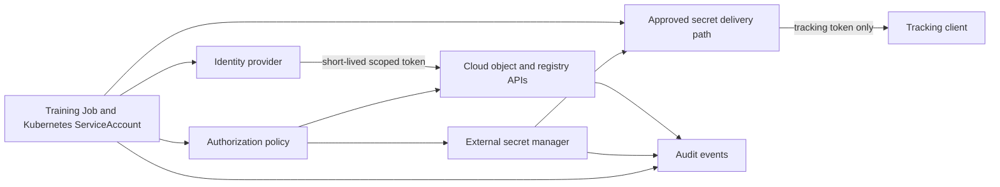
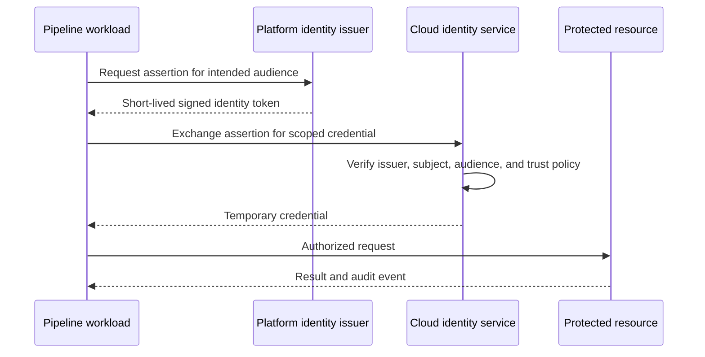
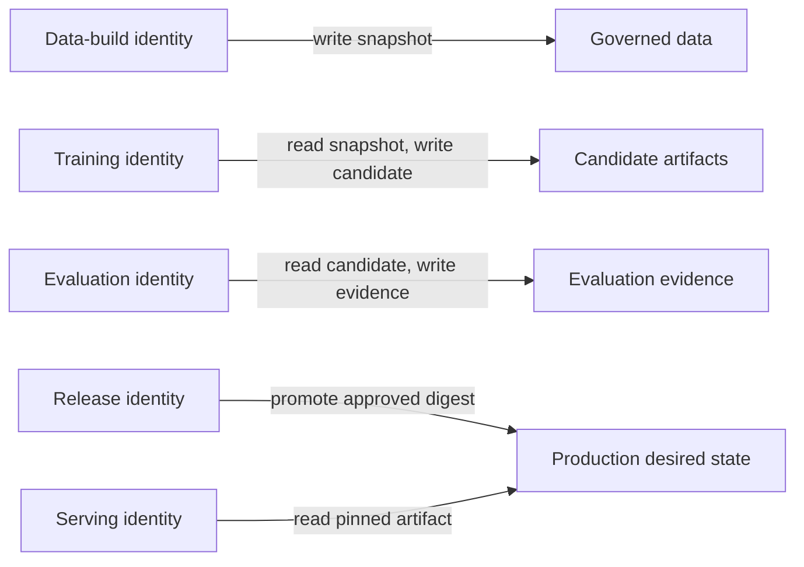
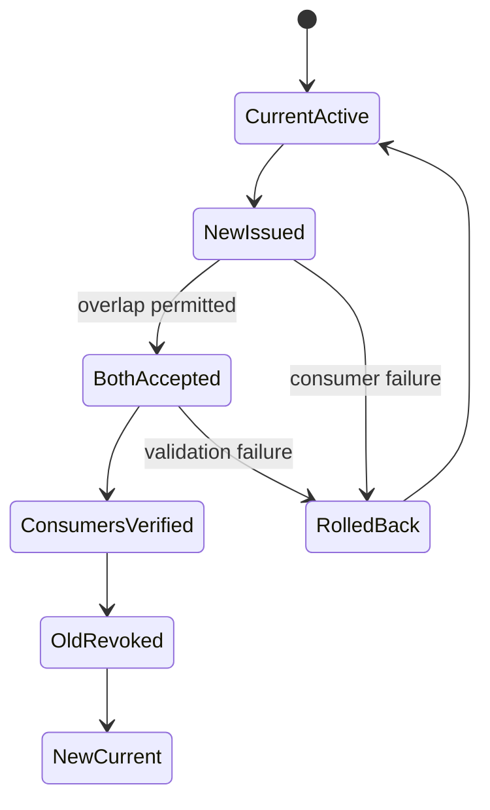

An ML pipeline reads warehouses and object stores, pulls container images, writes experiment artifacts, registers models, and deploys services. Each connection needs an identity and permission. Some also need a sensitive value such as an API key, password, private key, or signing secret.

The safest credential is the one the pipeline never stores. Modern cloud and CI platforms can often exchange a verified workload identity for a short-lived token. When a target system still requires a secret value, keep it outside source code and pipeline definitions, deliver only the needed value at runtime, and make rotation and revocation ordinary operations.

## Separate Identity, Credential, Secret, And Permission
<!-- section-summary: Identity says which workload is acting, a credential proves that identity, a secret is sensitive stored material, and authorization decides what the workload may do. -->

These terms are often collapsed into “secrets,” which makes designs harder to reason about.

- **Identity** names the actor: for example, the training job for churn model version 12.
- **Credential** is proof presented during authentication: a projected token, certificate, password, or API key.
- **Secret** is sensitive material whose disclosure can enable misuse. Some credentials are secrets; an identity name is not.
- **Authorization** is the policy that permits actions after authentication, such as reading one feature bucket and writing one experiment path.

Use SlateRiver Media as a supporting example. Its churn-model pipeline runs as a Kubernetes Job. It reads an immutable feature snapshot, writes artifacts, logs to a tracking service, and submits a candidate to the model registry.



The job does not need one powerful credential for every dependency. It uses workload identity for cloud APIs and receives a separate narrow token only for the legacy tracking service. Compromise of one path does not automatically grant every permission.

## Prefer Federated, Short-Lived Workload Identity
<!-- section-summary: Workload identity exchanges a platform-issued assertion for temporary credentials, reducing copied long-lived keys and making trust conditions explicit. -->

With **workload identity federation**, the runtime proves who launched the workload using an identity issued by its platform. A cloud or service identity provider verifies that assertion and issues a short-lived credential. No static cloud access key needs to sit in a repository, CI secret, container image, or Kubernetes Secret.

Kubernetes ServiceAccounts provide namespaced workload identities. Current Kubernetes uses the TokenRequest and projected-volume mechanisms for time-bounded, automatically rotated service-account tokens; manually created long-lived service-account token Secrets are still possible but explicitly discouraged. Cloud platforms can trust selected service accounts through their managed workload-identity mechanisms.

GitHub Actions can similarly request an OpenID Connect (OIDC) token. A cloud role trusts claims such as repository, branch, environment, workflow, and audience, then issues temporary credentials. The trust condition matters: trusting every repository in an organization or every branch can turn a safe mechanism into broad access.



Scope identity by workload and purpose. Training, evaluation, registration, and deployment should not automatically share one service account. A training job that reads features and writes artifacts rarely needs permission to change a production endpoint.

Short lifetime reduces exposure but does not replace least privilege. A five-minute token with administrator access can still cause serious harm. Restrict resource, action, environment, network path, audience, and session where the platform supports them.

## Split Pipeline Stages by Authority
<!-- section-summary: Training, evaluation, registration, and deployment use separate identities because each stage needs different resources and creates a different security consequence. -->

An end-to-end pipeline often appears as one workflow while its stages have sharply different authority. Data preparation reads source data and writes a governed snapshot. Training reads that snapshot and writes candidate artifacts. Evaluation reads candidates and writes reports. Registration records an approved candidate. Deployment changes production desired state.

Using one identity across the workflow lets a compromised training library promote its own artifact or read production secrets. Separate identities create enforceable stopping points. The training role can write only to a candidate prefix. The evaluator can read candidates without overwriting them. The release role can select an approved digest without reading raw training data. The serving role can read the pinned production artifact without changing registry state.



The pipeline orchestrator does not need every downstream permission. It can launch a stage with that stage's service account and pass immutable references rather than credentials. The trust policy restricts which workflow, repository, environment, namespace, or scheduler may assume each role.

Break-glass authority needs separate handling. An incident operator may require emergency rollback or credential revocation. That role should use stronger authentication, short sessions, explicit reason capture, alerting, and later review. Keeping emergency access outside routine automation reduces the chance that a normal job inherits broad production power.

## Use A Secret Manager For Unavoidable Values
<!-- section-summary: Values that cannot be replaced by workload identity belong in a managed store with access policy, versioning, rotation, audit, and controlled delivery. -->

Some systems still accept only a password, API key, signing key, or client certificate. Store those values in an approved secret manager such as a cloud key vault or HashiCorp Vault. The manager should own encryption, versioning, access policy, audit, and rotation metadata.

The pipeline definition keeps a reference, not the value. A secret reference should identify the logical purpose and permitted version policy without revealing content. Avoid placing real credentials in Helm values, environment-specific YAML, notebook cells, Docker build arguments, Terraform state, experiment parameters, or model metadata.

Kubernetes Secret objects are an in-cluster delivery primitive, not automatically a full secret-management system. Their `data` fields are base64-encoded, not encrypted by that encoding. Protect etcd with encryption at rest, restrict API access with RBAC, isolate namespaces, and prevent workloads from listing unrelated Secrets. Anyone who can create a Pod in a namespace may be able to mount secrets available there, so workload-creation privileges are security-sensitive.

External Secrets Operator and similar controllers reconcile values from an external manager into Kubernetes Secrets. This can fit applications that expect native Secret mounts, but it creates another copy and another privileged controller. Configure narrow stores, keys, namespaces, service accounts, refresh policy, and audit. Do not sync a whole application JSON secret when one job needs one field.

An alternative is a CSI driver, sidecar, init process, or direct application client that retrieves the value at runtime. The right choice depends on whether the application can refresh credentials, whether the value may touch the Kubernetes API, and what failure behaviour is acceptable.

## Deliver Credentials With A Clear Lifetime
<!-- section-summary: Runtime delivery defines when a credential appears, which process can read it, whether it can refresh, and how it disappears. -->

Common delivery forms include environment variables, mounted files, local agent sockets, and direct API retrieval. Each has tradeoffs.

Environment variables are easy but can be exposed by debug dumps, child processes, or accidental environment logging. Mounted files support updates and narrower filesystem permissions, but the application must reopen or watch them. Direct retrieval keeps the value out of Kubernetes but makes the application responsible for identity exchange, retry, caching, and refresh. A local agent can centralize those concerns while increasing runtime complexity.

For the SlateRiver job, the deployment contract might say:

```yaml
workload: churn-trainer
identity:
  kubernetes_service_account: churn-trainer
  cloud_role: feature-reader-artifact-writer
static_cloud_keys: forbidden
secrets:
  - purpose: tracking-auth
    source: vault://ml-platform/tracking/trainer
    delivery: read_only_file
    audience: tracking.internal
    refresh: before_expiry
    owner: ml-platform
logging:
  redact_paths: [/var/run/ml-secrets]
  environment_dump: forbidden
```

The exact platform manifest can be generated from this policy. The important part is that identity, purpose, delivery, refresh, ownership, and logging behaviour are reviewable before the job runs.

Never bake credentials into an image layer. Deleting a later layer does not remove bytes from earlier layers. Do not pass secrets through command-line arguments when process listings or job metadata can expose them. Prevent debug code from printing all environment variables, request headers, connection strings, signed URLs, or exception objects containing client configuration.

## Design Rotation Before The First Incident
<!-- section-summary: Rotation is a state transition involving issuer, consumers, overlap, verification, and revocation rather than a one-click value replacement. -->

**Rotation** replaces a credential without losing required service. Dynamic credentials rotate automatically through re-issuance. Static secrets require an owner and tested process.



Not every system supports overlap. When it does, issue a new version, update consumers, verify real authentication, then revoke the old version. When it does not, plan a controlled interruption or a coordinated cutover. Rotation success means consumers use the new credential and the old credential no longer works—not merely that the vault contains a newer value.

Track issuer, consumer inventory, owner, purpose, created and expiry times, last use where available, rotation method, and emergency revocation. Avoid indefinite secrets with unknown consumers. Test expiration: a client that loads a token only at process startup may fail hours after an apparently successful rotation.

## Prevent And Detect Leakage Before Runtime
<!-- section-summary: Secret scanning, policy checks, redaction tests, and build provenance catch common credential paths before a pipeline reaches production. -->

Repository secret scanning detects known token shapes and high-entropy values. Pre-commit checks provide fast feedback; server-side scanning is the enforcement boundary because local hooks can be skipped. Scan Git history, notebooks, fixtures, generated manifests, container build context, and infrastructure plans where appropriate.

Scanning has false positives and cannot find every custom credential. Add policy checks: no literal values in secret fields, no static cloud-key variables, no wildcard secret access, no default service account for sensitive jobs, no automatic service-account-token mount when the Pod does not call the Kubernetes API, and no unrestricted environment dumps.

Treat a committed secret as compromised even after deletion. Git history, forks, caches, CI logs, and developer machines may retain it. Revoke or rotate first, then remove and investigate. Do not paste the value into an incident ticket while reporting it.

CI and training logs need tested redaction. Redact before export, and include variants such as URL-encoded credentials, authorization headers, signed query parameters, and multiline private keys. A redaction rule that only matches the exact raw token can miss transformed copies.

## Respond By Credential, Identity, And Effect
<!-- section-summary: An incident response contains the credential, restricts the responsible identity, investigates audited use, and repairs the delivery path that allowed exposure. -->

When a secret may be exposed, identify its issuer, scope, consumers, and reachable resources. Revoke or disable it. Pause affected jobs if they can continue causing harm. Issue a replacement through the normal trusted path. Search audit logs for use before and after the suspected exposure and correlate calls with workload, network, and job records.

If a workload identity is over-privileged or its trust policy is wrong, rotating a secret may not help. Tighten or disable the role and federation condition. If a Kubernetes service account was misused, inspect its RBAC, bound Pods, token audience, and workload-creation permissions.

Preserve an incident timeline without copying secret material. Record detection, last known legitimate use, revocation confirmation, replacement validation, affected data or artifacts, and preventive changes. Add a regression check to scanning, policy, or logging controls.

Audit should cover authentication exchanges, secret reads and versions, policy changes, Kubernetes Secret and RBAC access, workload launches, and important resource actions. Minimize sensitive payloads in audit records while keeping identity, time, resource, decision, and request correlation.

## Reduce Secrets, Then Govern The Remainder
<!-- section-summary: A strong pipeline authenticates each workload through short-lived identity, grants least privilege, isolates necessary values, and proves rotation and revocation. -->

Start by drawing every dependency and the identity used to reach it. Replace stored cloud keys with workload federation where supported. Split identities by pipeline stage and environment. Put unavoidable values in an external manager. Deliver them only to the process that needs them, for the shortest practical lifetime. Keep them out of source, images, parameters, and logs.

Then operate the lifecycle: scan, audit, rotate, expire, revoke, and rehearse incidents. Vault products and Kubernetes manifests implement parts of that lifecycle. The durable security model is identity → authentication → authorization → bounded delivery → observed use → revocation.

## References

- [Kubernetes ServiceAccounts](https://kubernetes.io/docs/concepts/security/service-accounts/)
- [Kubernetes Secrets](https://kubernetes.io/docs/concepts/configuration/secret/)
- [Kubernetes Secrets good practices](https://kubernetes.io/docs/concepts/security/secrets-good-practices/)
- [Kubernetes RBAC good practices](https://kubernetes.io/docs/concepts/security/rbac-good-practices/)
- [External Secrets Operator](https://external-secrets.io/latest/)
- [GitHub Actions OpenID Connect](https://docs.github.com/en/actions/concepts/security/openid-connect)
- [GitHub secret scanning](https://docs.github.com/en/code-security/concepts/secret-security/secret-scanning)
- [AWS IAM roles for service accounts](https://docs.aws.amazon.com/eks/latest/userguide/iam-roles-for-service-accounts.html)
- [Azure workload identity](https://learn.microsoft.com/azure/aks/workload-identity-overview)
- [Google Cloud Workload Identity Federation for GKE](https://cloud.google.com/kubernetes-engine/docs/concepts/workload-identity)
- [HashiCorp Vault dynamic secrets](https://developer.hashicorp.com/vault/docs/secrets)
