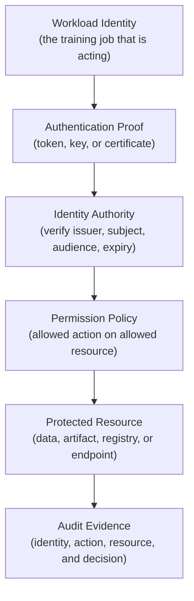
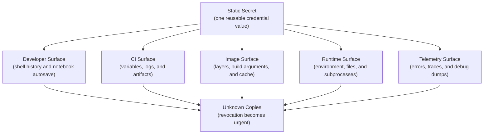
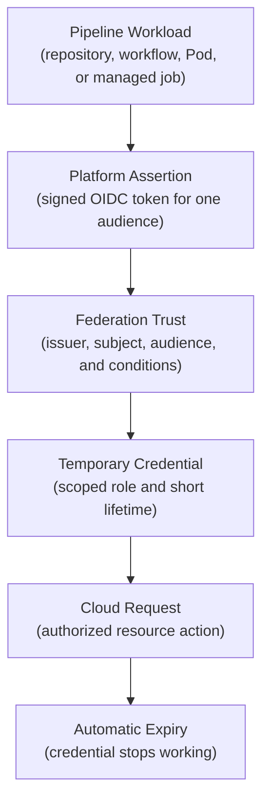
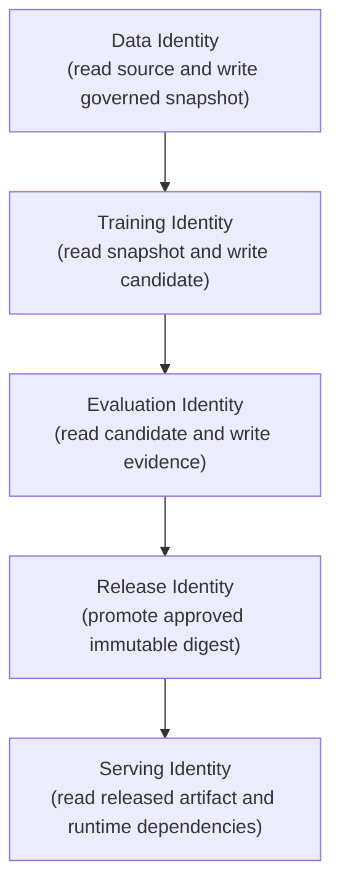
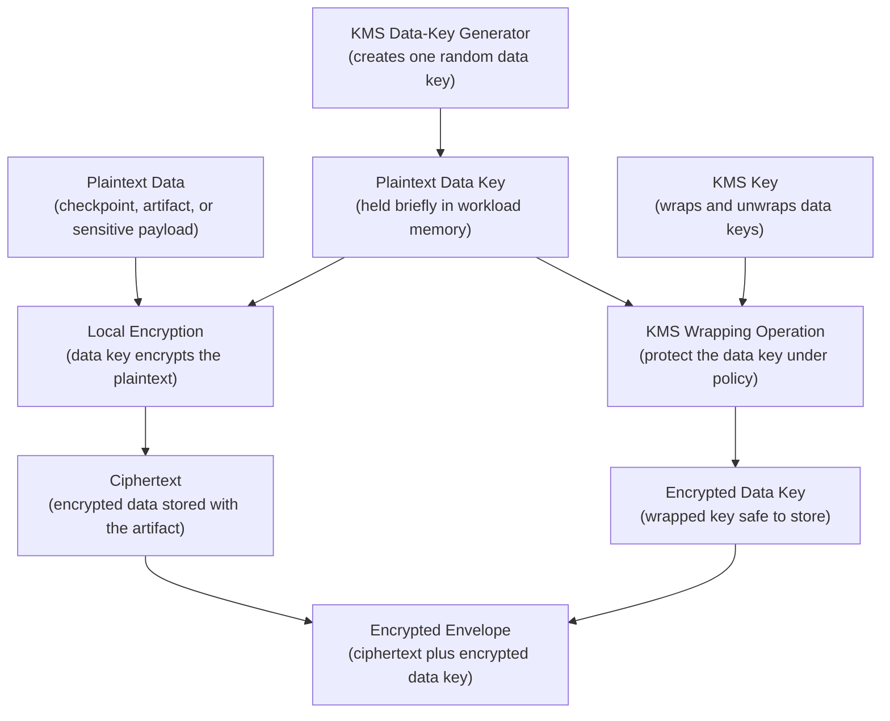
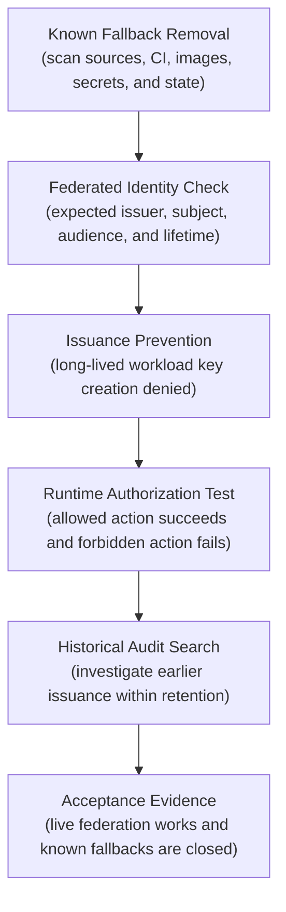
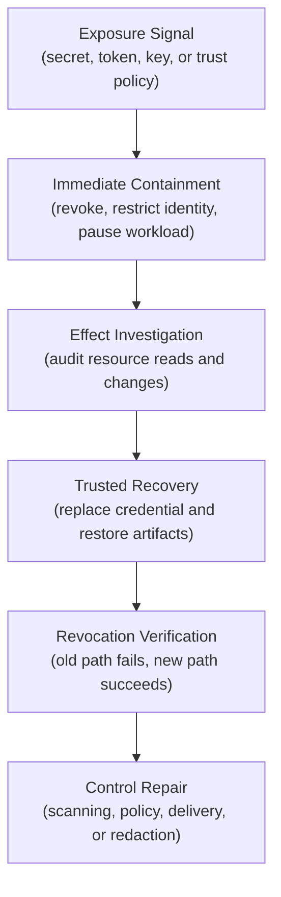

## Table of Contents

1. [Identity, Permission, Credential, And Secret Are Separate Parts](#identity-permission-credential-and-secret-are-separate-parts)
2. [Why Long-Lived Credentials Spread Across The Pipeline](#why-long-lived-credentials-spread-across-the-pipeline)
3. [Replace Stored Cloud Keys With Short-Lived Workload Access](#replace-stored-cloud-keys-with-short-lived-workload-access)
4. [GitHub Actions Can Exchange OIDC For Cloud Access](#github-actions-can-exchange-oidc-for-cloud-access)
5. [Kubernetes Workloads Need Audience-Bound, Scoped Tokens](#kubernetes-workloads-need-audience-bound-scoped-tokens)
6. [Split Training, Evaluation, Release, And Serving Authority](#split-training-evaluation-release-and-serving-authority)
7. [Store Non-Federated Secrets In A Secret Manager](#store-non-federated-secrets-in-a-secret-manager)
8. [Use Dynamic Credentials To Reduce Shared Access](#use-dynamic-credentials-to-reduce-shared-access)
9. [Keys, Certificates, And Envelope Encryption Have Different Jobs](#keys-certificates-and-envelope-encryption-have-different-jobs)
10. [Limit Secret Delivery To The Intended Process](#limit-secret-delivery-to-the-intended-process)
11. [Local Development And Third-Party APIs Need The Same Boundaries](#local-development-and-third-party-apis-need-the-same-boundaries)
12. [Rotation, Revocation, And Break Glass Need Rehearsal](#rotation-revocation-and-break-glass-need-rehearsal)
13. [Verify The Federated Path And Remove Static Fallbacks](#verify-the-federated-path-and-remove-static-fallbacks)
14. [Redact Telemetry Without Removing Useful Security Evidence](#redact-telemetry-without-removing-useful-security-evidence)
15. [Contain The Identity And Credentials During An Incident](#contain-the-identity-and-credentials-during-an-incident)
16. [The Main Idea](#the-main-idea)
17. [References](#references)

## Identity, Permission, Credential, And Secret Are Separate Parts

<!-- section-summary: A secure access path names the actor, defines allowed actions, issues bounded proof, and protects any reusable sensitive material. -->

At a high level, pipeline security answers four questions: who is acting, what
may they do, how do they prove who they are, and how long does that proof remain
usable?

A **human identity** represents a person through an identity provider. A
developer signs in with multi-factor authentication and receives access
according to their role. A **workload identity** represents software such as a
GitHub Actions job, Kubernetes Pod, managed training job, or serving endpoint.

A **permission** authorizes an action on a resource. Reading one training-data
prefix and writing one candidate-artifact prefix are separate permissions.
Authentication proves identity; authorization evaluates permissions.

A **credential** is evidence presented during authentication. Passwords, signed
tokens, access-key pairs, and client certificates are credentials. A **secret**
is sensitive material whose disclosure may enable misuse. Some credentials are
secrets. An identity name and a permission policy are not secret values.

A **token** is usually a bounded credential issued by an authority. It may
contain or refer to a subject, audience, scopes, issue time, and expiry. A
**key** is cryptographic material used to sign, encrypt, decrypt, or
authenticate. A **certificate** binds a public key to an identity through a
trusted issuer; the corresponding private key remains sensitive.

Consider a training Pod running as the workload identity `trainer`. Policy
permits it to read one feature snapshot and write one artifact location.
Kubernetes provides an identity token intended for a cloud identity service. The
cloud service verifies that token and returns temporary credentials for the
allowed resources.


```mermaid
flowchart TD
    A["Workload Identity<br/>(the training job that is acting)"] --> B["Authentication Proof<br/>(token, key, or certificate)"]
    B --> C["Identity Authority<br/>(verify issuer, subject, audience, expiry)"]
    C --> D["Permission Policy<br/>(allowed action on allowed resource)"]
    D --> E["Protected Resource<br/>(data, artifact, registry, or endpoint)"]
    E --> F["Audit Evidence<br/>(identity, action, resource, and decision)"]

    class A actor;
    class B,C,E,F work;
    class D policy;
```

This model exposes design errors. Giving a job an identity does not grant access
by itself. Short lifetime does not repair administrator permissions. Encrypting
a static key does not stop every workload that can decrypt it from sharing the
same identity.

## Why Long-Lived Credentials Spread Across The Pipeline

<!-- section-summary: A reusable secret can be copied into source, logs, images, artifacts, caches, and child processes long after the original job ends. -->

A long-lived credential can be copied into source, logs, images, artifacts,
caches, and child processes long after the original job ends. This type of
reusable value is a **static credential**. Cloud access keys, database passwords,
and third-party API keys often begin this way.

An engineer pastes a key into a notebook for one experiment. Notebook autosave
stores it. Git captures the notebook. CI prints parameters during debugging. A
Docker build argument enters image history or cache. An experiment tracker
records the command. A subprocess inherits the environment. An exception object
prints a connection string. Deleting the visible line cannot remove all of those
copies.

Environment variables deserve special caution. They provide a delivery mechanism
and do not create a security boundary. Debug dumps, crash reports, child
processes, `/proc` access under some conditions, and telemetry instrumentation
can expose them. Container and CI systems may also preserve environment
configuration in job metadata.

Artifacts and caches cross lifetimes. A temporary build container can disappear
while its layer, remote cache, log archive, or model bundle remains. Signed URLs
and bearer tokens can grant access to whoever obtains the string until expiry.


```mermaid
flowchart TD
    A["Static Secret<br/>(one reusable credential value)"] --> B["Developer Surface<br/>(shell history and notebook autosave)"]
    A --> C["CI Surface<br/>(variables, logs, and artifacts)"]
    A --> D["Image Surface<br/>(layers, build arguments, and cache)"]
    A --> E["Runtime Surface<br/>(environment, files, and subprocesses)"]
    A --> F["Telemetry Surface<br/>(errors, traces, and debug dumps)"]
    B --> G["Unknown Copies<br/>(revocation becomes urgent)"]
    C --> G
    D --> G
    E --> G
    F --> G

    class A,G secret;
    class B,C,D,E,F surface;
```

The strongest reduction is to avoid issuing the reusable credential. Federation
and managed workload identity make that possible for many cloud access paths.

## Replace Stored Cloud Keys With Short-Lived Workload Access

<!-- section-summary: Federation exchanges a platform-issued identity assertion for temporary target credentials under an explicit trust policy. -->

A pipeline can request temporary cloud access from its existing platform
identity instead of storing a reusable cloud key. This exchange is called
**workload identity federation**. The pipeline platform issues a signed identity
token, and the target cloud verifies that token and its trust policy before
issuing short-lived credentials.

OpenID Connect, or **OIDC**, is a common protocol for this exchange. The token
contains claims. Important claims include the issuer, which identifies the
platform; the subject, which identifies the workload context; the audience,
which identifies the intended recipient; and timestamps that limit validity.

The target trust policy is the main boundary. A GitHub repository, branch, tag,
environment, or reusable workflow can influence the subject claim. A Kubernetes
namespace and service account can identify a Pod workload. Trust every
repository or every service account and the mechanism grants a much larger
population the ability to request credentials.

The exchanged cloud credential has its own scope and lifetime. Restrict the role
to the required actions and resources. Set session duration close to job
duration. A job that outlives its credential must refresh safely or fail with a
clear recovery route.


```mermaid
flowchart TD
    A["Pipeline Workload<br/>(repository, workflow, Pod, or managed job)"] --> B["Platform Assertion<br/>(signed OIDC token for one audience)"]
    B --> C["Federation Trust<br/>(issuer, subject, audience, and conditions)"]
    C --> D["Temporary Credential<br/>(scoped role and short lifetime)"]
    D --> E["Cloud Request<br/>(authorized resource action)"]
    E --> F["Automatic Expiry<br/>(credential stops working)"]

    class A actor;
    class B,D,E,F work;
    class C trust;
```

AWS uses role assumption through its security token service. Azure supports
federated identity credentials and managed identities. Google Cloud supports
Workload Identity Federation and service-account impersonation. Their claim
syntax and resource models differ, so follow the current official guide for the
selected platform.

## GitHub Actions Can Exchange OIDC For Cloud Access

<!-- section-summary: A GitHub Actions job requests an OIDC token and exchanges it for temporary cloud credentials constrained by workflow claims. -->

GitHub Actions can mint an OIDC token for a workflow job after the workflow
grants `id-token: write`. That permission allows token request; it does not
grant write access to cloud resources. The cloud trust relationship and role
policy decide what follows.

### How A GitHub Actions Workflow Proves Its Identity

For AWS, the workflow commonly uses the official AWS credentials action to
assume a role. The repository stores the role name and region as configuration.
It stores no AWS access-key pair.

```yaml
permissions:
  contents: read
  id-token: write

jobs:
  train:
    environment: ml-training
    runs-on: ubuntu-latest
    steps:
      - uses: actions/checkout@3d3c42e5aac5ba805825da76410c181273ba90b1
        with:
          persist-credentials: false
      - uses: aws-actions/configure-aws-credentials@e6de054238d6b7531b4efff3b6587d9aade6a06c
        with:
          role-to-assume: arn:aws:iam::123456789012:role/ml-training
          aws-region: eu-west-1
      - run: aws s3 cp s3://approved-features/snapshot.parquet ./data/
```

The reviewed commit SHAs in this example correspond to `actions/checkout` v7.0.1
and `aws-actions/configure-aws-credentials` v6.2.3. A dependency bot can propose
a later SHA, and the team reviews the upstream change before accepting it.
`persist-credentials: false` removes the checkout authentication token from the
local Git configuration because this job performs no later Git operation.

The pinned Checkout v7.0.1 and Configure AWS Credentials v6.2.3 releases use the
Node 24 action runtime. A self-hosted GitHub Actions runner therefore needs
runner application version 2.327.1 or later. Checkout also has a separate runner
requirement of 2.329.0 or later for authenticated Git commands launched from
Docker container actions that rely on persisted checkout credentials. This
sample disables credential persistence and performs no later Git command. The
Docker container authentication path is therefore outside this workflow's
execution path.

GitHub-hosted runners provide a compatible action runtime. Azure Login and
Google authentication actions implement corresponding exchanges for their
clouds; verify their current official setup, release, and runner requirements
before adoption.

### How The Cloud Verifies The Workflow's Identity

Restrict the cloud trust policy to the expected GitHub organization, repository,
and branch or environment. GitHub environments can add required reviewers and
protect environment secrets. Reviewers govern job entry; the cloud still
verifies the token claims.

To verify the federated execution path, inspect repository and environment
secrets for known access-key variables, scan workflow files and history, and
confirm that the action requests OIDC. Cloud audit logs should contain the
expected role-assumption or federated sign-in event. Policy should deny
long-lived key creation for the workload role.

Failure needs a safe path. If OIDC issuance or exchange fails, the job stops
before accessing protected resources. Avoid an automatic fallback to a stored
administrator key. Operators can repair trust claims, identity-provider
configuration, audience, clock, or role policy and rerun the job.

## Kubernetes Workloads Need Audience-Bound, Scoped Tokens

<!-- section-summary: Kubernetes projected service-account tokens bind identity to a workload, audience, and lifetime and can support cloud workload identity. -->

A Kubernetes **ServiceAccount** supplies an identity for workloads in a
namespace. Current Kubernetes guidance recommends TokenRequest or projected
token volumes for time-bound service-account tokens. Manually created long-lived
service-account token Secrets remain possible and are discouraged.

### Bind Each Projected Token To Its Intended Service

A projected token declares an audience and requested expiration. The recipient
must verify that its expected audience appears in the token. The kubelet
refreshes the projection before expiry. Bound tokens can also refer to the Pod,
and Kubernetes validation can reject them after the bound object is deleted.

```yaml
apiVersion: v1
kind: Pod
metadata:
  name: evaluator
  namespace: ml-evaluation
spec:
  serviceAccountName: evaluator
  automountServiceAccountToken: false
  containers:
    - name: evaluator
      image: registry.example/evaluator@sha256:4b8d...
      volumeMounts:
        - name: workload-token
          mountPath: /var/run/workload-identity
          readOnly: true
  volumes:
    - name: workload-token
      projected:
        sources:
          - serviceAccountToken:
              path: token
              audience: cloud-identity.example
              expirationSeconds: 3600
```

`automountServiceAccountToken: false` prevents the default API token mount. The
explicit projected token serves the declared external audience. The external
identity system must validate issuer, signature, subject, audience, expiry, and
the configured trust mapping.

### Cloud Identity And Kubernetes RBAC Remain Separate

Managed cloud integrations connect a Kubernetes service account to cloud
identity. AWS currently recommends EKS Pod Identity for supported EKS workloads.
It requires the EKS Pod Identity Agent and a supported AWS SDK using the default
credential chain. It runs on Linux EC2 worker nodes, excluding Fargate Pods,
Windows nodes, Outposts, and EKS Anywhere. IAM Roles for Service Accounts (IRSA)
remains an alternative for needs such as direct cross-account role assumption
and environments outside those Pod Identity limits.

Azure Workload Identity and Google Cloud Workload Identity Federation for GKE
map cluster workload identity into cloud authorization. Verify cluster, region,
version, and feature requirements in current platform documentation.

RBAC still controls Kubernetes API access. Cloud IAM controls cloud resources. A
Pod that can assume a cloud role does not automatically need permission to list
Kubernetes Secrets. Separate these trust boundaries.

Distributed training creates many workers. Give them the same narrow job
identity only if their resource needs match. A coordinator may require
scheduling or checkpoint permissions that workers do not. Prevent peer workers
from receiving deployment or registry-promotion authority.

## Split Training, Evaluation, Release, And Serving Authority

<!-- section-summary: Pipeline stages use separate workload identities because their data, artifact, approval, and production consequences differ. -->

A pipeline looks like one workflow and contains several security boundaries.
Data preparation reads source data and writes a governed snapshot. Training
reads the snapshot and writes candidates. Evaluation reads candidates and writes
evidence. Registration records an approved artifact. Deployment changes
production state. Serving reads the released artifact and production
dependencies.

One shared identity lets a compromised training dependency promote its own
output or reach serving secrets. Separate identities make the intended stopping
points enforceable.


```mermaid
flowchart TD
    A["Data Identity<br/>(read source and write governed snapshot)"] --> B["Training Identity<br/>(read snapshot and write candidate)"]
    B --> C["Evaluation Identity<br/>(read candidate and write evidence)"]
    C --> D["Release Identity<br/>(promote approved immutable digest)"]
    D --> E["Serving Identity<br/>(read released artifact and runtime dependencies)"]

    class A,B,C,E stage;
    class D release;
```

The orchestrator launches each stage with the stage identity and passes
immutable artifact references. It does not need all downstream permissions.
Separate production and non-production roles, secret paths, keys, clusters, and
network routes. A test job should never discover production credentials through
the same default service account.

## Store Non-Federated Secrets In A Secret Manager

<!-- section-summary: Managed secret stores protect unavoidable passwords, API keys, private keys, and certificates through access policy, versioning, audit, and rotation. -->

Some dependencies still require a stored value. A third-party API may accept
only an API key, a legacy database may require a password, and a signing
integration may require a private key. A managed secret store protects these
values through access policy, versioning, audit, and rotation. Common choices
include AWS Secrets Manager, Azure Key Vault, Google Secret Manager, and
HashiCorp Vault.

### Pass A Secret Reference Instead Of The Secret Value

The pipeline stores the logical secret's reference. The value stays in the
manager. The manager authenticates the workload identity, evaluates policy,
returns the permitted version, and records access. Scope by workload,
environment, and purpose. Avoid one JSON object containing every application
credential if a job needs one field.

Kubernetes Secret objects are delivery primitives. Their `data` values are
base64 encoded; that encoding provides no confidentiality. Protect etcd
encryption, API access, namespaces, workload-creation permissions, and backup
paths. Kubernetes documentation notes that a person able to create a Pod in a
namespace may be able to expose Secrets available there.

External Secrets Operator can reconcile external values into Kubernetes Secrets.
This adds a copy and a privileged controller. Constrain the store, key paths,
namespaces, service accounts, refresh interval, and audit. A CSI driver,
sidecar, or direct client can avoid some copies and introduces different
availability and refresh dependencies.

The secret-manager outage policy must be explicit. A training job can usually
fail closed and retry. A serving system may cache a still-valid credential for a
bounded period or use an approved degraded mode. It should not fall back to a
hard-coded key.

## Use Dynamic Credentials To Reduce Shared Access

<!-- section-summary: A dynamic secret manager creates a unique leased credential for one workload and revokes it at expiry or on demand. -->

A **dynamic credential** is generated for a specific request or workload instead
of retrieving one shared static value. HashiCorp Vault’s database secrets engine
can create a unique database username and password under a configured role.

Vault attaches a **lease** with a time to live, renewability, and lease ID.
Expiry triggers revocation. Operators can revoke one lease or a path prefix.
Unique credentials improve attribution because database activity identifies a
workload instance. The fleet does not share one account.

The workload must handle renewal and expiry. If a job may run for six hours and
receives a one-hour database lease, it renews before expiry or obtains a
replacement. Inspect the returned lease duration because the backend can limit
the requested renewal.

Dynamic credential issuance depends on Vault and the target database. If
revocation cannot reach the target, a lease can remain usable until the target
rejects it. Monitor failed and irrevocable leases, and maintain a target-side
containment path.

Cloud secret managers also support managed rotation for supported secret types.
Updating the value in the manager is the first rotation step. Verify that
consumers use the new version and the previous credential fails after the
planned overlap.

## Keys, Certificates, And Envelope Encryption Have Different Jobs

<!-- section-summary: Keys perform cryptographic operations, certificates bind public keys to identities, and envelope encryption protects data with short-lived data keys. -->

An API key is usually a bearer credential: possession grants access. A
cryptographic key performs signing or encryption operations. A client
certificate supports mutual TLS by presenting an identity bound to a public key
while the client proves possession of the private key.

Keep private keys in a KMS, HSM, key vault, or protected workload store
according to risk. Prefer calling a signing service over exporting a high-value
private key. Certificates need issuance, trust-chain validation, expiry
monitoring, renewal, and revocation. Short certificate lifetime reduces exposure
and requires reliable automation.

**Envelope encryption** encrypts data with a data-encryption key and then
encrypts that data key with a managed key-encryption key. The encrypted data key
can sit beside the ciphertext. A KMS protects the higher-level key and enforces
decrypt permission.


```mermaid
flowchart TD
    A["KMS Data-Key Generator<br/>(creates one random data key)"] --> B["Plaintext Data Key<br/>(held briefly in workload memory)"]
    C["Plaintext Data<br/>(checkpoint, artifact, or sensitive payload)"] --> D["Local Encryption<br/>(data key encrypts the plaintext)"]
    B --> D
    D --> E["Ciphertext<br/>(encrypted data stored with the artifact)"]
    B --> F["KMS Wrapping Operation<br/>(protect the data key under policy)"]
    G["KMS Key<br/>(wraps and unwraps data keys)"] --> F
    F --> H["Encrypted Data Key<br/>(wrapped key safe to store)"]
    E --> I["Encrypted Envelope<br/>(ciphertext plus encrypted data key)"]
    H --> I

    class C data;
    class A,B,F,G key;
    class D,E,H,I output;
```

Decryption performs two operations. The workload asks KMS to unwrap the
encrypted data key under identity and key policy. It then uses the recovered
plaintext data key locally to decrypt the ciphertext and removes that plaintext
key from memory as soon as practical.

Encryption protects confidentiality. It does not decide who may decrypt, prevent
an authorized process from logging plaintext, or replace integrity and
provenance checks. KMS policy, workload identity, audit, and application
behaviour remain part of the design.

## Limit Secret Delivery To The Intended Process

<!-- section-summary: Credential delivery defines which process receives a value, how it refreshes, and how the value disappears from memory or storage. -->

Secret storage answers where a sensitive value lives. The delivery design limits
which running process receives the value, how it observes a replacement, and
what remains after it exits. Copying a retrieved secret into every worker or log
would create a large exposure path even if the original store is secure.

Common delivery choices are environment variables, mounted files, local agent
sockets, and direct API retrieval.

Environment variables fit simple applications and can leak through logs,
debugging, child processes, and job metadata. Mounted files support filesystem
permissions and atomic updates; the application must reopen or watch them.
Direct retrieval keeps values out of pipeline configuration and makes
application code responsible for retry, caching, renewal, and failure. A local
agent centralizes those mechanics and adds a privileged runtime component.

Avoid command-line arguments because process listings and job metadata can
expose them. Avoid Docker build arguments and image layers. Do not serialize
credentials into experiment parameters, model metadata, checkpoints,
distributed-worker state, or exception messages.

For distributed jobs, confirm how the launcher propagates environment and files.
A coordinator may accidentally forward its full environment to every worker.
Deliver each credential to the smallest process set and keep production-only
values out of training nodes.

## Local Development And Third-Party APIs Need The Same Boundaries

<!-- section-summary: Developer sessions and external APIs receive named identities, narrow environments, short lifetimes, quotas, and separate production authority. -->

Local development should use human federation, a developer CLI session, or a
local identity broker. Each developer acts under their own identity. Give access
to development data and resources. Production access requires a separate
approved path.

Do not copy CI or Kubernetes credentials into `.env` files. A sample
`.env.example` contains names and dummy values. Local secret stores and OS
keychains can protect unavoidable development values, while federation usually
provides better attribution and expiry for cloud access.

Third-party API keys often remain static bearer secrets. Create separate keys
for development, training, evaluation, and serving if the provider supports
them. Apply endpoint restrictions, quotas, network restrictions, spend limits,
and provider-side audit. Store the provider account owner and revocation
procedure with the secret metadata.

If the provider supports OAuth client credentials, workload identity federation,
scoped tokens, or short-lived session keys, prefer that path after reviewing its
trust boundary. Verify audience, scope, token endpoint, expiry, refresh, and
revocation semantics in the current provider documentation.

## Rotation, Revocation, And Break Glass Need Rehearsal

<!-- section-summary: Rotation replaces credentials safely, revocation ends their authority, and break-glass access handles emergencies through a separate audited path. -->

**Rotation** issues new credential material and moves consumers to it.
**Revocation** makes old material unusable. Rotation is incomplete until the new
path works and the old path fails.

If the target supports overlap, issue a new version, update one consumer group,
verify real authentication, expand, and revoke the previous version. If overlap
is unavailable, coordinate a cutover or controlled interruption. Test clients
that load credentials only at process startup.

Track issuer, identity, permissions, consumers, owner, creation, expiry, last
use, rotation method, and revocation command. A secret with unknown consumers
cannot be rotated confidently.

**Break glass** is emergency access outside the routine path. Use strong human
authentication, short sessions, narrow emergency roles, reason capture,
immediate alerting, and mandatory review. Common actions include revoking a
compromised identity, stopping a deployment, or restoring the last approved
serving release.

The break-glass credential must also rotate and be tested. Store it through a
protected mechanism with dual control if risk requires it. Routine pipelines
should have no path to request that authority.

## Verify The Federated Path And Remove Static Fallbacks

<!-- section-summary: Runtime, policy, source, and audit evidence establish the live federated path, remove known static fallbacks, and investigate earlier credential issuance. -->

An architecture diagram can claim that a pipeline uses federation while an old
access key remains available as a fallback. Verification follows the live job
from source configuration through identity exchange, authorization, resource
access, audit, and expiry. Separate controls remove known static fallback paths,
deny new long-lived key creation, and investigate earlier issuance.

At the source boundary, scan Git history, notebooks, workflow files, images,
build context, generated manifests, and infrastructure state for credential
patterns. Inspect CI and environment secret inventories for legacy cloud-key
names. Remove every discovered fallback and revoke its credential. Use
server-side scanning because local hooks can be skipped. A clean scan defines
the checked scope; it cannot establish a universal historical negative.

At the identity boundary, cloud audit logs should show web-identity role
assumption, federated sign-in, managed identity, or service-account
impersonation from the expected subject. Session duration and role match policy.
Kubernetes audit and Pod specs show the expected service account and projected
token audience.

At the policy boundary, deny creation of long-lived access keys for workload
principals. Prevent static cloud-key variables in CI policy. Reject default
service accounts for sensitive namespaces. Disable automatic Kubernetes
API-token mounting if a Pod does not call the API.

At the historical boundary, search identity and audit records for access-key
creation, service-account key creation, secret version writes, role assumptions,
and use of known workload principals. Begin at the earliest retained event and
record any visibility gap caused by audit retention. Revoke discovered keys and
trace their resource access.

At runtime, canary tests verify allowed and denied actions. The training role
reads its feature prefix and cannot change a production endpoint. The release
role promotes an approved digest and cannot read raw training data.


```mermaid
flowchart TD
    A["Known Fallback Removal<br/>(scan sources, CI, images, secrets, and state)"] --> B["Federated Identity Check<br/>(expected issuer, subject, audience, and lifetime)"]
    B --> C["Issuance Prevention<br/>(long-lived workload key creation denied)"]
    C --> D["Runtime Authorization Test<br/>(allowed action succeeds and forbidden action fails)"]
    D --> E["Historical Audit Search<br/>(investigate earlier issuance within retention)"]
    E --> F["Acceptance Evidence<br/>(live federation works and known fallbacks are closed)"]

    class A,B,C,D,E check;
    class F result;
```

## Redact Telemetry Without Removing Useful Security Evidence

<!-- section-summary: Telemetry records identity and access decisions while redaction removes credentials and sensitive payloads before export. -->

Security telemetry should identify the actor and access decision without copying
the credential or secret itself. It records the acting identity, issuer,
authentication method, role, resource, action, and authorization decision. Time,
job ID, and correlation ID connect the event to one pipeline run.

Exclude bearer tokens, authorization headers, signed URLs, private keys, and
secret values from telemetry fields.

Redact at the source before logs, traces, and events leave the process. Cover
raw and transformed forms: URL encoding, connection strings, query parameters,
multiline private keys, bearer headers, and exception objects. Test redaction
with synthetic secret fixtures in unit and integration tests.

Avoid logging entire environments and request objects. Allowlist safe fields.
Apply access controls and retention to security logs because identity and
resource data can still be sensitive.

Audit secret reads by identity and version. Audit federation exchanges, role
assumptions, policy changes, Kubernetes Secret and RBAC access, workload
launches, certificate issuance, KMS decrypt calls, and revocation. Alert on
unexpected subjects, regions, resources, session durations, and access outside
job windows.

## Contain The Identity And Credentials During An Incident

<!-- section-summary: Credential incidents revoke exposed proof, restrict the underlying identity, investigate resource effects, and repair the path that enabled leakage. -->

Incident containment starts by identifying both the exposed credential and the
authority behind it. A static API key, temporary token, private key, certificate,
workload trust policy, and over-privileged identity require different actions.

Revoke or disable the credential and pause harmful workloads. Restrict the
underlying identity or trust condition if it can mint replacements. For OIDC, a
stolen temporary token expires, while a weak cloud trust policy may let the
attacker request another through a compromised workflow.

Search audit logs from the last known safe time through confirmed revocation.
Identify resources read or changed, artifacts produced, models registered,
deployments altered, data exposed, and credentials created. Quarantine suspect
artifacts and restore trusted state through immutable references.

Issue replacements through the normal trusted mechanism. Verify legitimate
consumers, confirm old credentials fail, and monitor for continued attempts. If
the secret reached Git, logs, an image, or a cache, treat every copy as exposed
and remove it after revocation.


```mermaid
flowchart TD
    A["Exposure Signal<br/>(secret, token, key, or trust policy)"] --> B["Immediate Containment<br/>(revoke, restrict identity, pause workload)"]
    B --> C["Effect Investigation<br/>(audit resource reads and changes)"]
    C --> D["Trusted Recovery<br/>(replace credential and restore artifacts)"]
    D --> E["Revocation Verification<br/>(old path fails, new path succeeds)"]
    E --> F["Control Repair<br/>(scanning, policy, delivery, or redaction)"]

    class A incident;
    class B,C,D,E,F work;
```

Preserve an incident timeline without copying secret material into tickets.
Record detection, scope, last legitimate use, revocation confirmation,
replacement validation, affected resources, and preventive changes. Rehearse
cloud, Kubernetes, third-party, and serving incidents before production.

## The Main Idea

<!-- section-summary: Secure ML pipelines give every actor a narrow identity, use bounded credentials, isolate unavoidable secrets, and prove expiry and recovery. -->

Identity names the human or workload. Permission defines what it may do. A
credential proves identity. A secret is reusable sensitive material that
deserves isolation. Token audience, scope, and lifetime determine where and how
long proof can be used.

Modern pipelines prefer OIDC federation, managed identities, service accounts,
role assumption, and projected tokens over stored cloud keys. Secret managers
and dynamic credentials govern systems that still require values. KMS,
certificates, delivery controls, stage separation, redaction, and audit address
other parts of the lifecycle.

Acceptance evidence shows the expected temporary identity in audit logs, a
successful permitted action, a rejected forbidden action, policy denial for
long-lived workload-key creation, a tested rotation and revocation path, and a
recovery exercise that restores trusted pipeline operation.

## References

- [GitHub Actions OpenID Connect](https://docs.github.com/en/actions/concepts/security/openid-connect)
- [GitHub Actions OIDC in AWS](https://docs.github.com/en/actions/how-tos/secure-your-work/security-harden-deployments/oidc-in-aws)
- [GitHub Actions OIDC in Azure](https://docs.github.com/en/actions/how-tos/secure-your-work/security-harden-deployments/oidc-in-azure)
- [Checkout action repository](https://github.com/actions/checkout)
- [Checkout v7.0.1 release](https://github.com/actions/checkout/releases/tag/v7.0.1)
- [Configure AWS Credentials action repository](https://github.com/aws-actions/configure-aws-credentials)
- [Configure AWS Credentials v6.2.3 release](https://github.com/aws-actions/configure-aws-credentials/releases/tag/v6.2.3)
- [Google Cloud Workload Identity Federation with deployment pipelines](https://cloud.google.com/iam/docs/workload-identity-federation-with-deployment-pipelines)
- [Kubernetes ServiceAccounts](https://kubernetes.io/docs/concepts/security/service-accounts/)
- [Kubernetes projected volumes](https://kubernetes.io/docs/concepts/storage/projected-volumes/)
- [Kubernetes Secrets good practices](https://kubernetes.io/docs/concepts/security/secrets-good-practices/)
- [AWS EKS IAM roles for service accounts](https://docs.aws.amazon.com/eks/latest/userguide/iam-roles-for-service-accounts.html)
- [AWS EKS Pod Identity](https://docs.aws.amazon.com/eks/latest/userguide/pod-identities.html)
- [Azure Workload Identity](https://learn.microsoft.com/en-us/azure/aks/workload-identity-overview)
- [Google Cloud Workload Identity Federation for GKE](https://cloud.google.com/kubernetes-engine/docs/concepts/workload-identity)
- [HashiCorp Vault dynamic database credentials](https://developer.hashicorp.com/vault/docs/secrets/databases)
- [HashiCorp Vault leases and revocation](https://developer.hashicorp.com/vault/docs/concepts/lease)
- [AWS KMS envelope encryption](https://docs.aws.amazon.com/kms/latest/developerguide/kms-cryptography.html)
- [External Secrets Operator](https://external-secrets.io/latest/)
