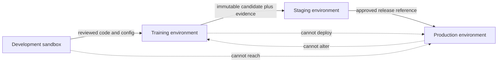

## Why ML Workloads Need Boundaries

<!-- section-summary: Environment isolation limits how exploratory code, training jobs, release tests, and production services can affect one another. -->

**Environment isolation** separates workloads so that a mistake or compromise in one place cannot freely reach another. ML systems need this because they combine exploratory code, sensitive data, expensive compute, model artifacts, automated pipelines, and production services.

Imagine **CarePath Labs**, a healthcare analytics team building a readmission-risk model. Data scientists explore features in notebooks. Scheduled jobs train candidates from approved snapshots. A staging service replays de-identified examples, and a production endpoint sends risk scores to hospital workflow software.

During an early prototype, all four activities use one cloud project and one broad service account. A notebook can read the production feature bucket and write to the same model path used by serving. One engineer accidentally saves a trial model over the production key. The endpoint loads it during a restart, even though nobody reviewed or approved the candidate.

Isolation repairs the path that allowed this incident. Each environment gets a clear purpose, its own identities, controlled data and artifact paths, and only the network access required for its work.

The isolation framework combines five boundaries: administrative ownership, workload identity and authorization, data and artifact paths, network reachability, and compute or runtime containment. Each boundary limits a different movement after a mistake or compromise.



The arrows show narrow, reviewed handoffs rather than shared authority. Development passes code, training produces candidates, staging produces integration evidence, and release automation changes production desired state. Production never needs notebook or training permissions to serve a prediction.

## Development Is the Most Flexible Environment

<!-- section-summary: Development supports exploration with sandbox data and limited write paths while keeping production identities and artifacts out of reach. -->

CarePath’s development environment contains notebooks, local test services, and small compute jobs. Researchers can install approved packages, try feature ideas, and write experiment artifacts. They use synthetic, masked, sampled, or explicitly approved data rather than unrestricted production records.

This environment needs flexibility, which also makes it a poor place for production credentials. A notebook executes cells interactively, loads third-party libraries, and often contains partially reviewed code. CarePath gives notebook identities read access to a sandbox dataset and write access to a development artifact prefix. Those identities cannot update production model aliases, deployments, secrets, or prediction stores.

Development also has a cost boundary. Notebook sessions and exploratory GPU jobs use quotas and idle shutdown. These controls prevent a forgotten experiment from consuming the cluster, while the permission boundary prevents it from reaching protected systems even if compute remains available.

When a useful experiment emerges, the team does not grant the notebook more authority. It moves the code and configuration into the training path.

## Training Runs With Approved Inputs

<!-- section-summary: The training environment reads versioned datasets, runs reviewed jobs, and writes candidate artifacts without controlling production serving. -->

CarePath’s training environment runs scheduled or approved jobs from versioned code. Its identity can read specific training snapshots and write models, metrics, and evaluation reports to a candidate area. It cannot replace the production model reference.

The dataset boundary matters as much as the service account. A training job receives a snapshot ID rather than a broad warehouse credential that can query every clinical table. The snapshot records the time boundary, label logic, data checks, and privacy review. If the job needs another source, the data access changes through review rather than through a hidden notebook connection.

Training jobs also use a separate compute queue. Large GPU requests cannot starve the production serving nodes. Cluster quotas cap the total CPU, memory, GPU, pod, and storage use for the training namespace. Queueing and admission controls decide when a distributed job can start.

The output remains a **candidate**. A successful training job proves that the pipeline ran and produced evaluation evidence. It does not grant authority to serve the model.

## Staging Rehearses the Release

<!-- section-summary: Staging loads the exact candidate release through production-shaped interfaces while using synthetic or de-identified traffic and non-production dependencies. -->

After evaluation approves a candidate for rehearsal, CarePath deploys it to staging. The staging service uses the same container digest, model-loading path, request schema, health checks, and telemetry fields intended for production. It points to de-identified replay data and test versions of downstream services.

This environment catches integration failures that offline evaluation misses. The model may load with a different preprocessing package, the endpoint may reject a valid request shape, or prediction logs may omit the model version required for monitoring. A rollback drill can run without affecting hospital users.

Staging stays separate from production even though their topology is similar. It uses a different service account, secret path, network route, object-store prefix, and deployment target. A test script cannot reach production simply because both environments run Kubernetes.

When the staging evidence passes, a release identity promotes the approved artifact reference. The training identity still cannot perform that action.

## Production Has the Narrowest Authority

<!-- section-summary: The production service reads one approved model and permitted online inputs, then writes only the telemetry and outputs required by the live workflow. -->

CarePath’s production endpoint receives live request data under the hospital workflow’s authorization rules. Its workload identity can read the approved model bundle and the online features required for inference. It writes prediction telemetry to a governed destination.

The service cannot read raw training tables, start training jobs, publish a new model, or change its own deployment configuration. These actions belong to other identities and systems. Narrow authority makes an incident easier to contain and an audit easier to explain.

The production artifact path is immutable. The deployment pins a model digest or version instead of loading a mutable `latest` object. Promotion changes the deployment reference after approval; it does not overwrite the bytes that an existing release points to.

Network access is narrow too. The endpoint accepts traffic from the hospital application path, reads approved feature and artifact services, and exports telemetry. It has no general path to the training warehouse or notebook services.

## Kubernetes Adds Workload-Level Separation

<!-- section-summary: Namespaces organise the environments, while service accounts, role-based access control, quotas, network policy, and admission rules create the actual controls. -->

CarePath uses separate Kubernetes namespaces for training, staging, and production serving. A namespace helps group resources, but the name alone does not create a security boundary. The platform attaches different service accounts, role-based access control, quotas, network policies, and admission rules.

The production namespace, for example, gives the serving service account permission to read its configuration and observe its own pods. It does not grant permission to create training Jobs or edit arbitrary Deployments. A network policy accepts requests only from the hospital-workflow namespace and allows egress only to the feature service and telemetry collector.

```yaml
apiVersion: networking.k8s.io/v1
kind: NetworkPolicy
metadata:
  name: readmission-serving
  namespace: ml-serving-prod
spec:
  podSelector:
    matchLabels:
      app: readmission-risk-api
  policyTypes: [Ingress, Egress]
  ingress:
    - from:
        - namespaceSelector:
            matchLabels:
              kubernetes.io/metadata.name: hospital-workflows
      ports:
        - protocol: TCP
          port: 8080
  egress:
    - to:
        - namespaceSelector:
            matchLabels:
              kubernetes.io/metadata.name: feature-platform
          podSelector:
            matchLabels:
              app: online-feature-api
      ports:
        - protocol: TCP
          port: 443
    - to:
        - namespaceSelector:
            matchLabels:
              kubernetes.io/metadata.name: observability
          podSelector:
            matchLabels:
              app.kubernetes.io/name: opentelemetry-collector
      ports:
        - protocol: TCP
          port: 4317
    - to:
        - namespaceSelector:
            matchLabels:
              kubernetes.io/metadata.name: kube-system
          podSelector:
            matchLabels:
              k8s-app: kube-dns
      ports:
        - protocol: UDP
          port: 53
        - protocol: TCP
          port: 53
```

Kubernetes adds the `kubernetes.io/metadata.name` label to namespaces, so the selector refers to a real label. Pod selectors narrow each namespace path to the intended service. The DNS rule is explicit because denying every other egress path also blocks name resolution; clusters that use a different DNS label need the matching selector. The cluster networking plugin must enforce NetworkPolicy. Applying the object in a cluster with no enforcement would create documentation rather than isolation.

Resource quotas keep a training namespace from consuming every GPU or all cluster memory. Admission policy can reject privileged containers, host mounts, mutable images, missing resource requests, and production workloads using the wrong service account.

## Identity Connects the Layers

<!-- section-summary: Distinct workload identities let cloud permissions, cluster permissions, storage access, and audit events describe the same actor. -->

CarePath gives notebook, training, evaluation, release, and serving workloads separate identities. The names follow the work: `readmission-training`, `readmission-evaluator`, `readmission-release`, and `readmission-serving`.

The training identity can read approved snapshots and write candidates. The evaluator can read candidates and write reports. The release identity can promote an approved version and update a controlled deployment reference. The serving identity can read only production-approved artifacts and write prediction telemetry.

Cloud identity and access management, Kubernetes role-based access control, and object-storage policy all use these workload identities. If a candidate artifact changes unexpectedly, logs show which identity performed the write. If serving tries to read a development artifact, storage policy denies the request and records the attempt.

Short-lived workload credentials are preferable to static keys copied into Secrets. Managed Kubernetes platforms can exchange a service account identity for a scoped cloud token. Secret-sync controllers can still deliver application secrets, but their own identity and the workload’s identity should remain separate so reading a secret definition does not grant the secret’s business permissions.

## Risky Code Needs Stronger Isolation

<!-- section-summary: Exploratory, generated, partner, or user-supplied code runs on isolated workers with controlled filesystems, resources, networks, and credentials. -->

Some ML jobs execute code with a higher risk: notebook cells, generated pipelines, partner packages, or user-supplied examples. CarePath sends these jobs to a dedicated worker pool and gives them no production identity.

The job runs as a non-root user with a read-only base filesystem, a temporary writable workspace, resource limits, and a restricted network. A stronger runtime such as gVisor or Kata Containers can add isolation where the threat model requires it. The worker has no host socket or broad host mount.

Artifact promotion never runs inside this untrusted job. The job may write a candidate to a quarantine path. Validation, scanning, evaluation, and approval happen before a separate release service can promote it.

This separation also protects the software supply chain. Model loading should avoid unsafe deserialization formats where practical, verify artifact digests, and run potentially unsafe conversion in an isolated environment.

## The Boundary Must Survive Failure

<!-- section-summary: Incident response relies on separate identities, immutable artifacts, access logs, and tested promotion and rollback paths. -->

Suppose CarePath finds that a development notebook accessed a restricted dataset. The team disables the notebook identity, preserves access logs, identifies the exact queries and exported artifacts, and checks whether any candidate trained from the data. The production service does not need to stop because it uses a different identity and artifact path.

If a production model behaves badly, the release service restores the previous approved reference. The team does not ask the training system to overwrite the model in place. Immutable versions preserve the evidence required to compare the faulty and restored releases.

Regular access reviews test the boundary before an incident. CarePath tries representative denied actions: a notebook reading production features, a training job updating a deployment, a staging service using a production secret, and a serving pod writing to the training bucket. A boundary that exists only in an architecture diagram is not ready.

Kubernetes authorization checks can verify part of that matrix with impersonation:

```bash
kubectl auth can-i get secrets \
  --namespace ml-serving-prod \
  --as system:serviceaccount:ml-development:notebook
# Expected: no

kubectl auth can-i patch deployments.apps \
  --namespace ml-serving-prod \
  --as system:serviceaccount:ml-training:readmission-training
# Expected: no

kubectl auth can-i get modelreleases.ml.example.com \
  --namespace ml-serving-prod \
  --as system:serviceaccount:ml-release:readmission-release
# Expected: yes
```

These commands test Kubernetes authorization only. The same matrix needs cloud-IAM tests for object storage and secret access, plus live network checks from disposable pods. A network test from the development namespace should fail to connect to the production feature service, while the production serving identity should reach only the approved port.

The test fails the environment review if any denied action returns `yes`. It also fails if an expected production path returns `no`, because isolation that blocks legitimate serving will cause an availability incident. After a permission or NetworkPolicy change, CI runs the matrix again and stores actor, action, resource, expected result, observed result, cluster, and policy version as evidence.

During the simulated notebook incident, CarePath disables the development workload identity and reruns its denied actions. Production serving remains available because its identity, namespace, and artifact path are separate. That exercise verifies containment rather than assuming separate names imply separate authority.

## CarePath’s Final Environment Shape

<!-- section-summary: Isolation follows the ML lifecycle by giving each stage the data, identity, compute, network, and artifact authority required for its own job. -->

CarePath now has a flexible development environment with sandbox data, a controlled training environment that produces candidates, a production-shaped staging environment for release rehearsal, and a narrowly authorised production service. Separate identities and artifact paths connect those boundaries across cloud policy, Kubernetes, storage, secrets, and audit logs.

The important idea is not the number of cloud accounts or namespaces. Isolation comes from the actions that each workload can perform and the paths it cannot cross. When development code, training jobs, release automation, and serving processes each have a clear authority, the team can experiment quickly without giving every experiment a route into production.

## References

- [Kubernetes: Multi-tenancy](https://kubernetes.io/docs/concepts/security/multi-tenancy/)
- [Kubernetes: RBAC](https://kubernetes.io/docs/reference/access-authn-authz/rbac/)
- [Kubernetes: Resource quotas](https://kubernetes.io/docs/concepts/policy/resource-quotas/)
- [Kubernetes: Network policies](https://kubernetes.io/docs/concepts/services-networking/network-policies/)
- [Kubernetes: Pod Security Standards](https://kubernetes.io/docs/concepts/security/pod-security-standards/)
- [External Secrets Operator](https://external-secrets.io/latest/)
- [gVisor documentation](https://gvisor.dev/docs/)
- [NIST: Zero Trust Architecture](https://csrc.nist.gov/pubs/sp/800/207/final)
