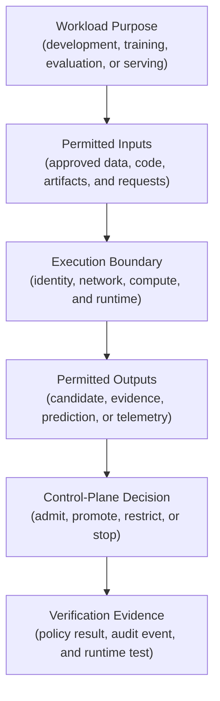
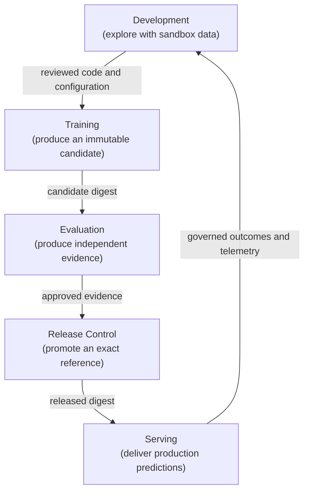
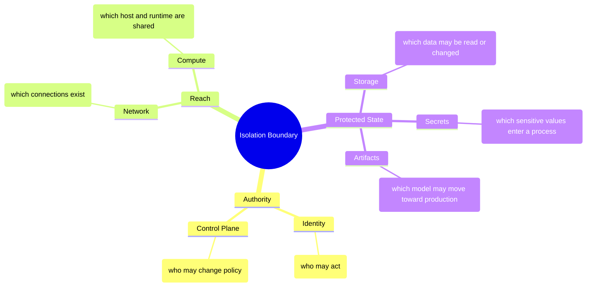
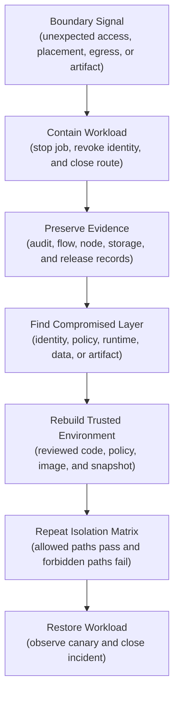

## Table of Contents

1. [What Environment Isolation Means](#what-environment-isolation-means)
2. [Separate The ML Lifecycle Environments](#separate-the-ml-lifecycle-environments)
3. [Build Seven Isolation Boundaries](#build-seven-isolation-boundaries)
4. [Choose A Tenant Isolation Level](#choose-a-tenant-isolation-level)
5. [Build Kubernetes Isolation In Layers](#build-kubernetes-isolation-in-layers)
6. [Share GPUs According To The Threat Model](#share-gpus-according-to-the-threat-model)
7. [Control Ingress Egress And Private Access](#control-ingress-egress-and-private-access)
8. [Move Only Approved Data, Artifacts, And Configuration Between Environments](#move-only-approved-data-artifacts-and-configuration-between-environments)
9. [Create And Remove Ephemeral Environments](#create-and-remove-ephemeral-environments)
10. [Block Workloads That Violate Isolation Policy](#block-workloads-that-violate-isolation-policy)
11. [Observe And Test Isolation Continuously](#observe-and-test-isolation-continuously)
12. [Contain Failure And Recover A Trusted Environment](#contain-failure-and-recover-a-trusted-environment)
13. [How Managed Platforms Separate ML Environments](#how-managed-platforms-separate-ml-environments)
14. [Main Idea](#main-idea)
15. [References](#references)

## What Environment Isolation Means
<!-- section-summary: Environment isolation limits which systems a workload can reach, which resources it can consume, and which production state it can change. -->

A data scientist needs room to explore, while a production service needs live features and authority to serve a released model. Those workloads should not inherit the same reach. **Environment isolation limits how far each workload can reach and what it can change**, preventing exploratory code from acquiring production authority or a serving failure from corrupting training.

Consider a notebook that installs a new image-processing library. The package contains malicious code. If the notebook shares the production service account, network, storage path, and model registry permissions, that code can read live data or replace the artifact served to users. A separate notebook namespace changes very little if all of those other paths remain open.

An **environment** is the complete execution context around a workload. It includes the cloud account or project, human and workload identities, network routes, compute, storage, secrets, artifact destinations, policies, and administrators that can change those controls. Two workloads with different names still share an environment if they can reach and modify the same protected resources.

Isolation therefore works as a set of reinforcing boundaries. Each boundary stops a different movement: identity policy stops an unauthorised action, network policy stops an unwanted connection, runtime containment limits a process escape, and artifact policy stops an unreviewed model from entering production.


```mermaid
flowchart TD
    A["Workload Purpose<br/>(development, training, evaluation, or serving)"] --> B["Permitted Inputs<br/>(approved data, code, artifacts, and requests)"]
    B --> C["Execution Boundary<br/>(identity, network, compute, and runtime)"]
    C --> D["Permitted Outputs<br/>(candidate, evidence, prediction, or telemetry)"]
    D --> E["Control-Plane Decision<br/>(admit, promote, restrict, or stop)"]
    E --> F["Verification Evidence<br/>(policy result, audit event, and runtime test)"]

    class A purpose
    class B,C,D,E boundary
    class F evidence
```

A compromised workload should reach only the resources required for its current job. The team must also be able to detect an attempted boundary crossing, contain the workload, preserve evidence, and rebuild the affected environment from trusted inputs.

## Separate The ML Lifecycle Environments
<!-- section-summary: Development, training, evaluation, serving, and release control need different authority because they process different inputs and produce different consequences. -->

One large environment is attractive during a prototype. The notebook can query data, train a model, register it, and deploy it without waiting for another system. The same convenience creates one long path from experimental code to production change.

Production MLOps separates the lifecycle according to responsibility. The environments exchange reviewed references and evidence through narrow interfaces. They do not share one all-powerful identity.

### Development Supports Exploration

Development contains notebooks, local tools, and small experiment jobs. The code changes frequently, and package installation may be interactive. That flexibility gives development the largest probability of accidental or unreviewed execution.

Development identities use synthetic, masked, sampled, or specifically approved data. They write to development experiment and artifact locations. Production feature stores, deployment APIs, release keys, and live prediction records stay outside their authority.

Development hands the training environment repeatable code, configuration, tests, and an explicit data requirement. Granting the notebook broader access would preserve the prototype path instead of creating a controlled pipeline.

### Training Runs With Data Access But No Release Authority

Training runs reviewed code against an approved data snapshot. It may use distributed workers, large GPU pools, package mirrors, checkpoint storage, and long job durations. Its output is a candidate model plus the evidence required to identify how that candidate was created.

The training identity reads the selected snapshot and writes checkpoints, metrics, and candidate artifacts. It cannot change the production route. If a dependency compromises a worker, the attacker can affect the candidate and the job's accessible inputs; the release boundary still blocks direct deployment.

### Evaluation Tests The Candidate Independently

Evaluation reads the candidate and an approved test collection. It measures product quality, security behaviour, privacy risk, robustness, and integration contracts. An independent identity writes the evaluation report so the training job cannot rewrite its own result.

Evaluation sometimes runs hostile inputs or potentially unsafe model files. A red-team harness may generate malformed requests, prompt injections, or adversarial examples. Those jobs deserve stronger runtime and network containment than an ordinary metric calculation.

### Serving Runs The Approved Model

Serving handles live requests or scheduled production batches. It reads one approved model reference and only the production dependencies needed for prediction. It writes results and governed telemetry. It has no reason to install packages, read raw training tables, create candidates, or modify its own deployment.

Online serving also needs a capacity boundary. A large training job should not consume the GPU, memory, network bandwidth, or API quota needed to answer live requests. Separate node pools, quotas, accounts, or managed endpoint capacity protect availability as well as security.

### Release Automation Controls Production Changes

Release automation sits between evaluation and serving. It checks the candidate digest, evaluation result, policy approvals, environment configuration, and rollback target. Its identity can change a controlled production reference. Training and evaluation identities cannot perform that action.


```mermaid
flowchart TD
    A["Development<br/>(explore with sandbox data)"] -->|"reviewed code and configuration"| B["Training<br/>(produce an immutable candidate)"]
    B -->|"candidate digest"| C["Evaluation<br/>(produce independent evidence)"]
    C -->|"approved evidence"| D["Release Control<br/>(promote an exact reference)"]
    D -->|"released digest"| E["Serving<br/>(deliver production predictions)"]
    E -->|"governed outcomes and telemetry"| A

    class A explore
    class B,C prove
    class D approve
    class E operate
```

The lifecycle names alone provide no protection. The next design step assigns enforceable boundaries to each stage.

## Build Seven Isolation Boundaries
<!-- section-summary: Seven boundaries control authority, connections, execution, data, sensitive values, model movement, and administrative change. -->

An environment boundary has several dimensions because workloads interact with the system in several ways. A private subnet cannot stop an over-privileged service account from deleting a model. A dedicated service account cannot stop untrusted code from exploiting the shared host kernel. The seven boundaries below cover those different paths.

### Identity Boundary

The **identity boundary** names the human or workload and authorises specific actions. Development, training, evaluation, release, and serving use distinct workload identities. Short-lived federation or managed workload identity supplies credentials without distributing reusable cloud keys.

Test the identity through allowed and denied actions. Training should read its snapshot and write a candidate. The same identity should fail if it attempts to update an endpoint, open a production secret, or read another tenant's data.

### Control-Plane Boundary

The **control plane** is the system that creates or changes workloads and policy. Kubernetes APIs, cloud IAM, managed ML workspaces, CI/CD settings, registries, and infrastructure-as-code state all belong here. Control-plane access deserves stronger protection than access inside one training container because it can redefine the other boundaries.

Separate platform administration from model development. Restrict cluster-wide resources, admission policy, network policy, role bindings, registry aliases, and production deployment configuration to controlled automation and a small administrative group. Send their audit events to a destination that these administrators cannot quietly disable through the same routine role.

### Network And Compute Boundaries

The **network boundary** controls who can initiate a connection, which destination is reachable, and which route carries the traffic. It covers ingress, service-to-service paths, DNS, cloud private endpoints, outbound internet access, and telemetry export.

The **compute boundary** controls where code executes and what it shares. Accounts, clusters, virtual machines, nodes, kernels, accelerators, process namespaces, and resource quotas provide different strengths. The chosen layer should match the trust relationship and impact of a breakout.

### Storage Secret And Artifact Boundaries

The **storage boundary** controls data locations, table or object permissions, encryption keys, temporary volumes, caches, checkpoints, and deletion. A namespace-scoped volume claim still needs a storage policy that prevents another workload from attaching or recovering its underlying volume.

The **secret boundary** controls unavoidable passwords, API keys, certificates, and signing material. A workload receives the smallest required value through a secret manager or broker. Secret access remains separate from permission to the business resource: reading a database password and receiving database authorisation are two distinct controls.

The **artifact boundary** controls how model files, serving images, feature code, and evaluation reports move between lifecycle stages. Candidate and production locations use separate write authorities. Releases refer to immutable digests, so promotion records approval for exact bytes rather than overwriting a shared `latest` path.


```mermaid
mindmap
  root((Isolation Boundary))
    Authority
      Identity
        (who may act)
      Control Plane
        (who may change policy)
    Reach
      Network
        (which connections exist)
      Compute
        (which host and runtime are shared)
    Protected State
      Storage
        (which data may be read or changed)
      Secrets
        (which sensitive values enter a process)
      Artifacts
        (which model may move toward production)
```

The seven boundaries should tell the same story. A serving identity belongs to serving compute, reaches approved production dependencies, reads a released artifact, and receives no training or control-plane secret. One contradictory boundary can reopen the full path.


*Environment isolation is the combined effect of seven controls; a shared or contradictory boundary can reopen a path that the other six appear to close.*

## Choose A Tenant Isolation Level
<!-- section-summary: Tenant trust, data sensitivity, workload control, blast radius, and operating cost determine whether tenants share namespaces, nodes, clusters, or cloud accounts. -->

A **tenant** is a group whose workloads or data require a separate trust decision. It may be an internal team, a customer, a regulated business unit, or an external user allowed to submit code. The right isolation unit depends on how much those tenants trust one another and what a successful escape would expose.

Two internal data-science teams running reviewed code may share a cluster. Each workload receives its own namespace, identity, quota, network policy, storage scope, and admission rules. This arrangement reduces cost while the organisation accepts a shared control plane and worker fleet.

Customer-supplied training code changes the risk. A container escape could expose other workloads on the node. Dedicated node pools plus a sandbox runtime reduce that path. The cluster API, node agents, storage plugins, and network infrastructure remain shared, so the security review still considers movement beyond the node.

A high-impact workload with mutually untrusted tenants may require separate clusters, cloud accounts or projects, encryption keys, and sometimes dedicated hardware. This costs more and creates more environments to patch, observe, and recover. It also removes several shared-control-plane and shared-kernel paths.

Choose through a written threat model. Record who supplies code, who controls images, which data enters memory, whether workloads can call the Kubernetes API, the impact of host compromise, the availability promise, and the acceptable operating cost. Regulations may set a minimum boundary, while the platform team still has to prove the implementation.

## Build Kubernetes Isolation In Layers
<!-- section-summary: Kubernetes namespaces provide policy scope, while authorization, network policy, node placement, runtime containment, and admission enforcement supply the controls. -->

Kubernetes is common for custom training and serving because it schedules containers across a shared fleet. Its flexibility can create a false sense of separation: resources appear in different namespaces even though they still share a control plane, nodes, kernel, cluster-wide controllers, and networking implementation.

### Use Namespaces To Apply Policy To A Workload

A Kubernetes **Namespace** groups API objects and gives namespaced controls a place to apply. Role-based access control (RBAC), ResourceQuota, LimitRange, NetworkPolicy, and Pod Security Admission can all target that scope.

Complete isolation needs those controls configured and enforced. Custom Resource Definitions, StorageClasses, admission webhooks, nodes, and several other resources are cluster-scoped. A user who can create dangerous pods, change a RoleBinding, or modify cluster-wide policy can cross the intended boundary. A NetworkPolicy object has no effect if the cluster's network plugin does not implement it.

Use a namespace per workload or trust domain, then start from denied access. Grant namespaced actions to one workload identity, set resource requests and quotas, apply a default-deny network posture, and enforce a Pod Security Standard. Keep cluster administration outside application roles.

### Dedicated Nodes Reduce Co-Tenancy

Node pools separate workloads that should not share a kernel, GPU, local disk, or resource pressure. Training and serving commonly use different pools so distributed jobs cannot starve production endpoints. Untrusted code may receive its own pool so a host compromise exposes fewer neighbouring workloads.

Kubernetes uses taints to repel pods from a node. A toleration permits placement on a tainted node; it does not direct the pod there. Add a required node selector or node affinity so the protected workload lands on the intended pool. Use node labels under the `node-restriction.kubernetes.io` protected prefix with the Node authorizer and NodeRestriction admission plugin, which stops a kubelet from claiming a sensitive isolation label for itself.

Dedicated nodes still share kubelet trust, the cluster API, controllers, and network infrastructure. Sandboxing or a separate cluster addresses threats that exceed the node boundary.

### Use RuntimeClass To Choose The Container Isolation Level

Ordinary Linux containers share the host kernel. Security contexts, seccomp, AppArmor or SELinux, read-only filesystems, dropped capabilities, and non-root execution reduce the exposed surface. Untrusted or generated code may require a stronger runtime boundary.

Kubernetes **RuntimeClass** selects a configured container runtime for a Pod. The core resource is stable, while its `scheduling` field remains beta in Kubernetes documentation. Platform teams should verify support in the cluster version and managed service. Administrators must install and configure the corresponding runtime handler on eligible nodes before workloads select that RuntimeClass.

gVisor moves much of the Linux system interface into a userspace application kernel. It reduces direct interaction with the host kernel and introduces compatibility and I/O tradeoffs. Kata Containers runs each Pod inside a lightweight virtual machine through the Kubernetes container runtime interface. Firecracker is a minimal microVM virtual-machine monitor; platform teams usually consume it through an integration such as Kata or firecracker-containerd rather than treating it as a ready-made Kubernetes policy.

The following fragment expresses one high-risk evaluation job. It requires a sandbox runtime and a protected node pool, then applies ordinary container hardening inside that sandbox. The `gvisor` handler and node label must already exist in the cluster.

```yaml
apiVersion: batch/v1
kind: Job
metadata:
  name: adversarial-evaluation
  namespace: ml-evaluation
spec:
  template:
    spec:
      serviceAccountName: isolated-evaluator
      automountServiceAccountToken: false
      runtimeClassName: gvisor
      nodeSelector:
        example.com.node-restriction.kubernetes.io/isolation: untrusted
      containers:
        - name: evaluator
          image: registry.example/evaluator@sha256:0123456789abcdef0123456789abcdef0123456789abcdef0123456789abcdef
          securityContext:
            allowPrivilegeEscalation: false
            capabilities:
              drop: ["ALL"]
            readOnlyRootFilesystem: true
            runAsNonRoot: true
            seccompProfile:
              type: RuntimeDefault
          resources:
            requests: {cpu: "2", memory: "8Gi"}
            limits: {cpu: "4", memory: "16Gi"}
      restartPolicy: Never
```

Admission policy should require these fields for the selected workload class. If the runtime handler is unavailable, Kubernetes fails the Pod and emits an event. The safe response is to repair capacity or runtime configuration; silently falling back to the ordinary runtime would erase the intended boundary.

## Share GPUs According To The Threat Model
<!-- section-summary: Exclusive allocation, MIG, and time-slicing provide different capacity and isolation properties, so GPU sharing must match tenant trust and workload impact. -->

GPUs are expensive, so teams often try to share them. The word “share” covers mechanisms with very different security and performance behaviour.

An exclusive GPU allocation gives one Pod or virtual machine the device for the allocation period. It has the simplest performance and tenant model, although several processes inside that workload may still share the device. Production serving and high-risk training commonly use exclusive devices or separate nodes to reduce noisy-neighbour and fault paths.

NVIDIA **Multi-Instance GPU (MIG)** divides supported GPUs into predefined hardware-backed instances. Each instance receives isolated memory paths and compute resources, providing memory and fault isolation plus more predictable quality of service. MIG geometry is limited to supported profiles and hardware. Reconfiguration requires idle GPUs and may require a node reboot in cloud environments, so operators cordon and drain affected nodes before changing the layout.

**Time-slicing** lets several workloads take turns on the same GPU. NVIDIA's Kubernetes documentation states that time-sliced replicas have no memory or fault isolation. A request for multiple replicas also does not guarantee a proportional compute share. Time-slicing can improve utilisation for trusted internal workloads with bursty demand; it is unsuitable as the security boundary between hostile tenants.

| Allocation | What It Separates | Appropriate Starting Point | Important Limitation |
|---|---|---|---|
| Exclusive GPU | Device access for the allocation period | Production serving, sensitive training, predictable performance | Higher idle cost; processes inside one workload may still share |
| MIG | Hardware-backed memory and compute instances | Supported GPUs, several bounded workloads, stronger sharing isolation | Fixed profiles, operational reconfiguration, hardware support |
| Time-slicing | Scheduler access to GPU time | Trusted workloads with low average utilisation | No memory or fault isolation; weak performance guarantees |

GPU isolation includes the surrounding node. Device plugins, drivers, monitoring agents, caches, host memory, and local checkpoint paths run outside the model process. Keep production and untrusted workloads on separate node pools, restrict privileged device-management components, and record which physical GPU or MIG instance served each workload.

Test the claim under contention. Run one workload that consumes memory or crashes a CUDA process while another performs a known inference benchmark. The result should match the chosen boundary: predictable performance for exclusive or planned MIG capacity, and explicitly accepted interference for time-sliced internal work.


*GPU allocation follows the threat model: time-slicing improves utilisation for trusted workloads but does not provide memory or fault isolation between hostile tenants.*

## Control Ingress Egress And Private Access
<!-- section-summary: Network isolation defines approved callers and destinations, then verifies that public, cross-environment, and unintended outbound paths fail. -->

Network isolation answers two separate questions. **Ingress** controls who can reach the workload. **Egress** controls which destinations the workload can contact. Private addressing changes the route, while identity and application authorisation still decide whether a request is allowed.

Serving usually accepts traffic through a gateway or private endpoint and reaches a small set of feature, policy, model, and telemetry services. Training often needs data storage, an artifact registry, experiment tracking, and distributed-worker communication. Interactive development may need package repositories. Copying the development egress policy into training gives every dependency a path to the public internet.

Build production images before the isolated job runs. Mirror approved Python packages and container images into controlled registries. Give the workload private routes to exact cloud services through VPC or VNet endpoints. Send exceptional outbound traffic through an authenticated egress proxy with destination policy and logs. A temporary `0.0.0.0/0` rule can become a permanent exfiltration path after the original debugging session ends.

In Kubernetes, start with default-deny ingress and egress, then allow named paths. This compact policy isolates all Pods in `ml-evaluation`; separate policies add DNS and the exact evaluator dependencies required by the cluster.

```yaml
apiVersion: networking.k8s.io/v1
kind: NetworkPolicy
metadata:
  name: default-deny
  namespace: ml-evaluation
spec:
  podSelector: {}
  policyTypes:
    - Ingress
    - Egress
```

The configured Container Network Interface plugin must enforce NetworkPolicy. The standard API works at IP, port, and protocol level; it does not express an arbitrary external domain allowlist. Cloud firewalls, private endpoints, an egress gateway, or a policy-capable networking layer handle that wider route.

Verification runs from inside the workload. Resolve dependency names, connect to permitted endpoints, attempt a blocked public destination, and attempt a service in another lifecycle environment. Cloud audit and authentication logs establish which principal obtained access. VPC flow logs and CNI, DNS, or proxy telemetry establish the interfaces, addresses, routes, and connection decisions involved. Correlate these records through Pod UID, node, network interface, source IP, destination, and time window. A successful private API call proves reachability; DNS resolution and flow evidence establish whether it used the intended private route.

## Move Only Approved Data, Artifacts, And Configuration Between Environments
<!-- section-summary: Environment promotion moves reviewed identities and immutable references while each environment retains separate data, artifact, secret, and write authority. -->

Each environment needs separate storage authority so an experimental workload cannot change something that production later loads. If every stage reads and writes the same location, a development notebook can alter a serving file even though the compute and networks are separate.

Give each lifecycle stage distinct storage authority. Development writes experiment outputs. Training reads approved snapshots and writes candidate digests. Evaluation reads candidates and writes reports. Release automation records approval for an exact model and serving-image digest. Serving reads the approved production reference and writes prediction evidence.

Promotion carries an immutable reference plus evidence. The artifact bytes remain unchanged. A release record connects the candidate digest, source revision, data snapshot, environment definition, evaluation report, approver, target, and rollback reference. Storage policy prevents the release identity from rewriting the candidate bytes it approves.

Data follows a similar path. A training snapshot is published from a governed pipeline, then addressed by table version, object manifest, or snapshot ID. Production features arrive through a separate approved online or batch interface. Copying a production warehouse credential into a development environment bypasses that path and weakens deletion, lineage, and access review.

Secrets and encryption keys stay environment-specific. A staging workload should use a staging API key and staging encryption context even if its topology resembles production. Workload identity retrieves each value at runtime. Container images, model archives, experiment parameters, and deployment manifests contain references rather than secret values.

Test promotion from both directions. The release identity should promote an approved digest and reject an unapproved one. A development or training identity should fail to change production state. Serving should reject a candidate-only path. After rollback, telemetry should report the restored digest and storage audit should show no artifact overwrite.

## Create And Remove Ephemeral Environments
<!-- section-summary: Ephemeral environments provide short-lived integration evidence through production-shaped interfaces and an enforced deletion lifecycle. -->

An **ephemeral environment** is a temporary environment created for a branch, evaluation, release rehearsal, or incident experiment. It gives the team a realistic API, model loader, policy path, and telemetry shape without keeping another long-lived stack alive.

For example, a pull request changes preprocessing and serving code. Automation creates a temporary namespace or cloud stack, deploys the candidate image by digest, loads synthetic requests, checks the response contract, and records the result. The environment has a unique identity and no route to production data or secrets.

Infrastructure as code should create the whole boundary: identity, network rules, storage location, quotas, policy labels, telemetry destination, and expiry metadata. Reusing a long-lived wildcard role for every preview stack would preserve a shared authority beneath temporary names.

Deletion is part of the lifecycle. Controllers or scheduled cleanup enforce a time to live. The cleanup verifies that compute stopped, credentials were revoked, temporary volumes and object prefixes were deleted according to policy, DNS and certificates were removed, and the environment no longer appears in inventory. Long-lived evidence such as test results moves to a governed store before deletion.

Cleanup can fail halfway. A namespace may disappear while a cloud load balancer, volume, identity binding, or registry token remains. Reconciliation should continue until every owned resource reaches its terminal state, then alert the owner for resources that exceed the deletion deadline.

## Block Workloads That Violate Isolation Policy
<!-- section-summary: Admission policy rejects workloads whose identity, runtime, image, privilege, placement, network, or evidence would violate the selected environment class. -->

Isolation policy must reject a workload before it starts with the wrong identity, image, privileges, network, or runtime. Enforcement therefore belongs at the control-plane decision that creates the job, Pod, endpoint, or cloud resource.

Kubernetes Pod Security Admission is stable and enforces the Baseline or Restricted Pod Security Standard at namespace scope. The Restricted profile covers common hardening such as non-root execution, seccomp, limited capabilities, and restricted privilege escalation. Pod Security Policy was removed from Kubernetes, so new designs should use Pod Security Admission plus additional policy for organisation-specific rules.

ValidatingAdmissionPolicy is stable and uses the Common Expression Language inside the API server. It can require an immutable image reference, approved service account, required RuntimeClass, protected node selector, resource limits, owner label, and environment classification. Kyverno, OPA Gatekeeper, Kubewarden, or cloud-native policy services remain appropriate if the organisation needs richer libraries, mutation, cross-resource checks, or one policy system across several platforms.

Policy rollout needs evidence and a safe sequence. Evaluate existing workloads in audit or warning mode. Repair violations. Enforce on development and evaluation canaries. Expand to production after confirming that expected jobs can still start. Keep exemptions narrow, named, time-limited, and visible in alerts.

Fail closed for security-critical fields. If the policy engine cannot verify an image digest, runtime class, or production service account, the job should remain pending or rejected. An approved emergency path uses a pre-defined workload class and short-lived human authorisation; it does not disable the entire admission layer.

Cloud policy performs the same job before resource creation. Organisation policies, IAM conditions, infrastructure policy checks, managed workspace policies, and CI gates can deny public endpoints, broad roles, unencrypted storage, unrestricted egress, or production resources in a development account.

## Observe And Test Isolation Continuously
<!-- section-summary: Isolation evidence combines desired policy, admission decisions, runtime placement, network and storage events, denied actions, and periodic escape tests. -->

Isolation is a production property, so operators need evidence from the running environment. Desired configuration alone cannot show that a Pod landed on the correct node, the selected runtime handler worked, or traffic used the intended private endpoint.

Record workload identity, environment, tenant, image and model digests, RuntimeClass, cluster and node pool, GPU allocation mode, data snapshot, network policy version, admission result, and release ID. Keep sensitive payloads and raw credentials out of general telemetry.

Cloud audit logs and Kubernetes audit events show control-plane changes. VPC flow logs, CNI telemetry, DNS logs, and egress-proxy events show connections. Storage, secret-manager, registry, and KMS events show protected state access. Node and runtime events show scheduling and sandbox failures.

Run an isolation matrix in CI and on a schedule. Test expected successes and expected denials:

- Development reads sandbox data and fails to read production data.
- Training writes a candidate and fails to update the production route.
- Evaluation reads the candidate and fails to alter it.
- Serving reads the released digest and fails to reach package repositories.
- A tenant identity fails to read another tenant's storage, service, cache, and telemetry.
- An untrusted job lands on the protected node pool with the required runtime.

Kubernetes can verify part of the matrix directly. The impersonation check requires permission to impersonate the target ServiceAccount, so an authorised platform or security verifier runs it. Ordinary developer roles should not receive that permission.

```bash
kubectl auth can-i patch deployments.apps \
  -n ml-serving-prod \
  --as system:serviceaccount:ml-training:trainer

NODE_NAME="$(kubectl get pod adversarial-evaluation -n ml-evaluation \
  -o jsonpath='{.spec.nodeName}')"

kubectl get pod adversarial-evaluation -n ml-evaluation \
  -o jsonpath='{.spec.runtimeClassName}{"\n"}'

kubectl get node "$NODE_NAME" \
  -o jsonpath='{.metadata.labels.example\.com\.node-restriction\.kubernetes\.io/isolation}{"\n"}'
```

The first command should print `no`. The Pod query should print `gvisor`, and the node-label query should print `untrusted`. Those values prove both runtime selection and protected-pool placement. Separate probes still test cloud IAM, storage, secret, and network behaviour because Kubernetes authorization covers only the cluster API.

Alert on boundary drift: public access enabled, a policy exemption created, a workload using the default service account, a mutable image tag, a production Pod on a training node, unexpected internet egress, cross-tenant access, or a running digest that differs from the release record.

## Contain Failure And Recover A Trusted Environment
<!-- section-summary: Containment stops the affected identity and routes, while recovery rebuilds from reviewed policy and immutable inputs and proves each boundary again. -->

Isolation reduces blast radius only if operators can activate the boundary during an incident. A compromised notebook may require identity revocation, egress denial, session termination, and quarantine of every candidate it produced. Serving can continue if it uses separate identity, compute, artifacts, and dependencies.

Start with the first compromised boundary. If an untrusted evaluation Pod ran under the ordinary runtime, cordon the node, stop the Pod, preserve runtime and node evidence, and inspect other workloads that shared the host. If a training identity reached a production bucket, disable that binding, preserve object and identity events, quarantine affected artifacts, and compare production digests with the approved release record.

Recovery rebuilds the environment from reviewed infrastructure code, policy versions, base images, data snapshots, and immutable artifacts. Rotating one token leaves a compromised node or policy path intact. Recreating one Pod leaves a malicious artifact intact. The recovery plan names which layers require replacement for each incident class.


```mermaid
flowchart TD
    A["Boundary Signal<br/>(unexpected access, placement, egress, or artifact)"] --> B["Contain Workload<br/>(stop job, revoke identity, and close route)"]
    B --> C["Preserve Evidence<br/>(audit, flow, node, storage, and release records)"]
    C --> D["Find Compromised Layer<br/>(identity, policy, runtime, data, or artifact)"]
    D --> E["Rebuild Trusted Environment<br/>(reviewed code, policy, image, and snapshot)"]
    E --> F["Repeat Isolation Matrix<br/>(allowed paths pass and forbidden paths fail)"]
    F --> G["Restore Workload<br/>(observe canary and close incident)"]

    class A incident
    class B,C,D,E action
    class F,G proof
```

Recovery proof repeats the relevant isolation matrix. The restored workload performs every permitted action, every forbidden path still fails, runtime placement matches policy, and telemetry reports the approved model and image digests. Canary traffic confirms service health before full restoration.

## How Managed Platforms Separate ML Environments
<!-- section-summary: Managed platforms implement selected isolation boundaries through accounts, identities, private networking, managed compute, registries, catalogs, and policy controls. -->

Managed ML services can operate the scheduler, training fleet, endpoint runtime, and parts of the network. Teams still choose account boundaries, identities, data access, public exposure, egress, artifact promotion, and evidence. The platform implements selected isolation layers, while the organization remains responsible for how those layers fit together.

### AWS

AWS teams commonly separate production and non-production through accounts, IAM roles, KMS keys, VPCs, S3 locations, ECR repositories, and SageMaker AI resources. A SageMaker training job can attach to private subnets and security groups through `VpcConfig`, with VPC endpoints supplying private access to S3 and supported services.

SageMaker AI also offers `EnableNetworkIsolation`. With that setting, the training or inference container cannot make network calls, receives no AWS credentials, and cannot call S3 directly; the SageMaker platform transfers declared input and output through the execution role outside the container. This is stronger than a VPC-attached job and unsuitable for code that must call a live dependency. On EKS, separate clusters or node groups, EKS Pod Identity, admission policy, and managed network controls implement the Kubernetes layers.

### Azure

Azure teams use separate subscriptions or resource groups, Azure Machine Learning workspaces, managed identities, Storage, Key Vault, Azure Container Registry, and managed networks. The workspace managed virtual network can use `Allow only approved outbound`, with private endpoints for associated Azure resources and explicit rules for other destinations.

Managed online endpoints configure inbound and outbound isolation separately. Disabling public network access sends scoring traffic through the workspace private endpoint, while managed-network rules control deployment egress. Current Azure guidance uses CLI and SDK v2; legacy per-deployment network isolation belongs only in migration context.

### Google Cloud

Google Cloud teams commonly separate environments through projects, service accounts, VPC networks, Cloud KMS keys, Cloud Storage, Artifact Registry, and Gemini Enterprise Agent Platform (formerly Vertex AI) resources. VPC Service Controls adds a service perimeter that reduces data-exfiltration paths around supported APIs. IAM still decides which identity may perform each action inside the perimeter.

Private Service Connect provides dedicated private endpoints for supported custom-trained and AutoML online inference without public IP addresses. Product and model support varies; tuned Gemini models are excluded, and dedicated private endpoints do not support private egress from inside the serving container. Private Service Connect for Google APIs and Private Google Access provide private routes but do not remove public API reachability by themselves; VPC Service Controls supplies that perimeter restriction. Verify the endpoint type, model family, and egress requirement before selecting the serving path.

### Databricks

Databricks teams combine separate workspaces, service principals, Unity Catalog permissions, workspace-catalog bindings, compute policies, storage credentials, and network controls. Workspace-catalog bindings restrict which workspaces can reach a catalog attached to the same metastore, overriding a user's catalog privilege from an unbound workspace. Compute policies constrain how users create classic compute, including runtime, size, libraries, tags, and automatic termination.

Policy edits do not automatically reconfigure running compute, so operators inspect compliance and enforce the updated policy. On AWS classic compute, back-end PrivateLink can provide private compute-to-control-plane connectivity; it requires the Enterprise plan, a customer-managed VPC, and secure cluster connectivity. Serverless compute uses separate account-level network policies and Network Connectivity Configurations for outbound private endpoints. Network-policy internet-access or dry-run changes also require the affected serverless workload to restart or redeploy. Treat classic and serverless networking as different implementations during verification.

Across providers, the practical default is managed jobs and endpoints with separate environment accounts or projects, workload identity, private connectivity, immutable artifacts, and audited promotion. Choose Kubernetes for requirements such as portability, specialised scheduling, custom runtimes, or multi-tenant control that managed jobs and endpoints cannot satisfy.

## Main Idea
<!-- section-summary: ML environment isolation gives each lifecycle stage the smallest authority and shared infrastructure compatible with its job and threat model. -->

ML environment isolation controls reach and consequence. Development explores with sandbox inputs. Training creates candidates from approved snapshots. Evaluation produces independent evidence. Release automation promotes an exact digest. Serving reads the released model and production dependencies under narrow authority.

Seven boundaries make that separation enforceable: identity, control plane, network, compute, storage, secrets, and artifacts. Kubernetes namespaces supply policy scope. Dedicated nodes, sandbox runtimes, GPU allocation, private routes, admission policy, and separate storage authorities strengthen the boundary according to tenant trust and workload impact.

The production proof comes from the running system. Allowed paths succeed, forbidden paths fail, workload placement matches policy, network traffic follows approved routes, storage and registry events identify the correct actor, and recovery rebuilds the environment from trusted inputs. Those results show that environment names correspond to real isolation.


*The lifecycle is isolated only when every stage has bounded authority and live tests prove allowed routes, denied routes, placement, actors, and immutable digests before release or recovery.*

## References

- [Kubernetes multi-tenancy](https://kubernetes.io/docs/concepts/security/multi-tenancy/)
- [Kubernetes RuntimeClass](https://kubernetes.io/docs/concepts/containers/runtime-class/)
- [Kubernetes assigning Pods to nodes](https://kubernetes.io/docs/concepts/scheduling-eviction/assign-pod-node/)
- [Kubernetes taints and tolerations](https://kubernetes.io/docs/concepts/scheduling-eviction/taint-and-toleration/)
- [Kubernetes NetworkPolicy](https://kubernetes.io/docs/concepts/services-networking/network-policies/)
- [Kubernetes Pod Security Admission](https://kubernetes.io/docs/concepts/security/pod-security-admission/)
- [Kubernetes Pod Security Standards](https://kubernetes.io/docs/concepts/security/pod-security-standards/)
- [Kubernetes ValidatingAdmissionPolicy](https://kubernetes.io/docs/reference/access-authn-authz/validating-admission-policy/)
- [Kubernetes Linux kernel security constraints](https://kubernetes.io/docs/concepts/security/linux-kernel-security-constraints/)
- [gVisor](https://gvisor.dev/docs/)
- [gVisor on Kubernetes](https://gvisor.dev/docs/user_guide/quick_start/kubernetes/)
- [Kata Containers architecture](https://github.com/kata-containers/kata-containers/blob/main/docs/design/architecture/README.md)
- [Firecracker microVM](https://firecracker-microvm.github.io/)
- [NVIDIA GPU time-slicing](https://docs.nvidia.com/datacenter/cloud-native/gpu-operator/latest/gpu-sharing.html)
- [NVIDIA Multi-Instance GPU](https://docs.nvidia.com/datacenter/tesla/mig-user-guide/latest/)
- [SageMaker AI network isolation](https://docs.aws.amazon.com/sagemaker/latest/dg/mkt-algo-model-internet-free.html)
- [SageMaker AI VPC training](https://docs.aws.amazon.com/sagemaker/latest/dg/train-vpc.html)
- [Azure Machine Learning managed network isolation](https://learn.microsoft.com/azure/machine-learning/how-to-managed-network?view=azureml-api-2)
- [Azure Machine Learning managed online endpoint isolation](https://learn.microsoft.com/azure/machine-learning/concept-secure-online-endpoint?view=azureml-api-2)
- [Google Cloud VPC Service Controls with Gemini Enterprise Agent Platform](https://docs.cloud.google.com/gemini-enterprise-agent-platform/machine-learning/general/vpc-service-controls)
- [Google Cloud Private Service Connect for online inference](https://docs.cloud.google.com/gemini-enterprise-agent-platform/machine-learning/predictions/private-service-connect)
- [Databricks workspace-catalog binding](https://docs.databricks.com/aws/en/data-governance/unity-catalog/access-control/workspace-catalog-binding)
- [Databricks compute policies](https://docs.databricks.com/aws/en/admin/clusters/policies)
- [Databricks PrivateLink concepts](https://docs.databricks.com/aws/en/security/network/concepts/privatelink-concepts)
- [Databricks serverless network policies](https://docs.databricks.com/aws/en/security/network/serverless-network-security/manage-network-policies)
