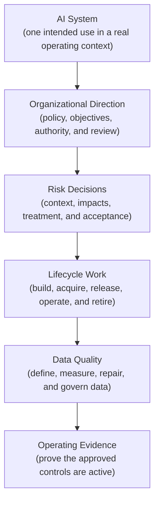
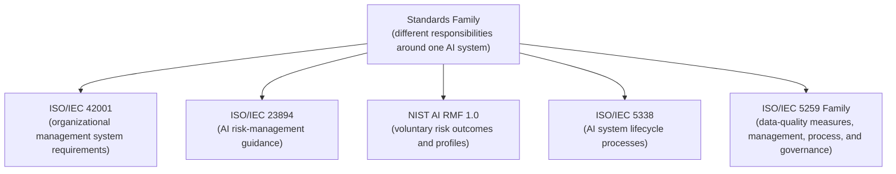
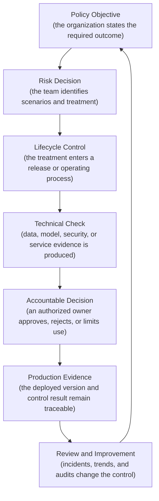
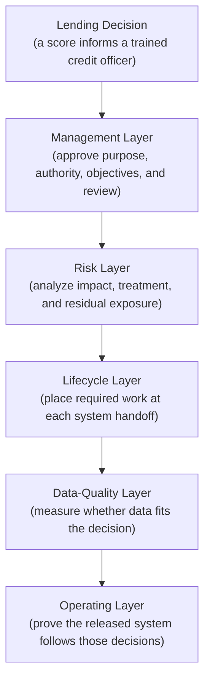
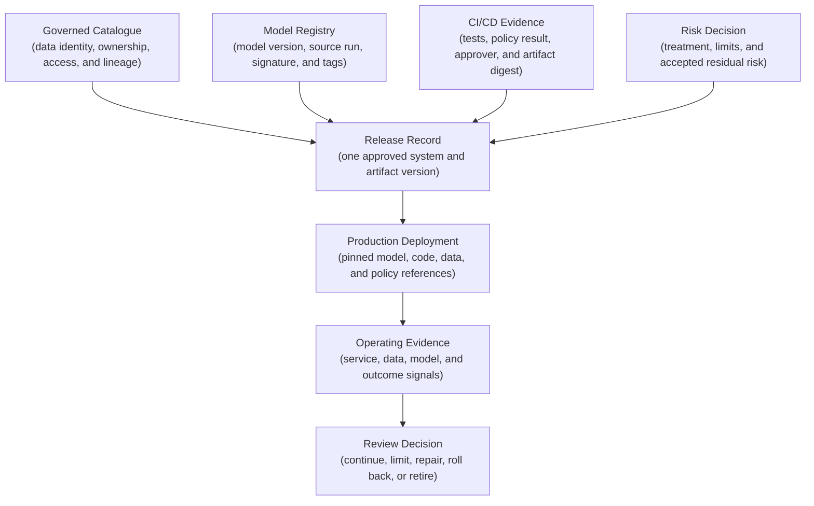
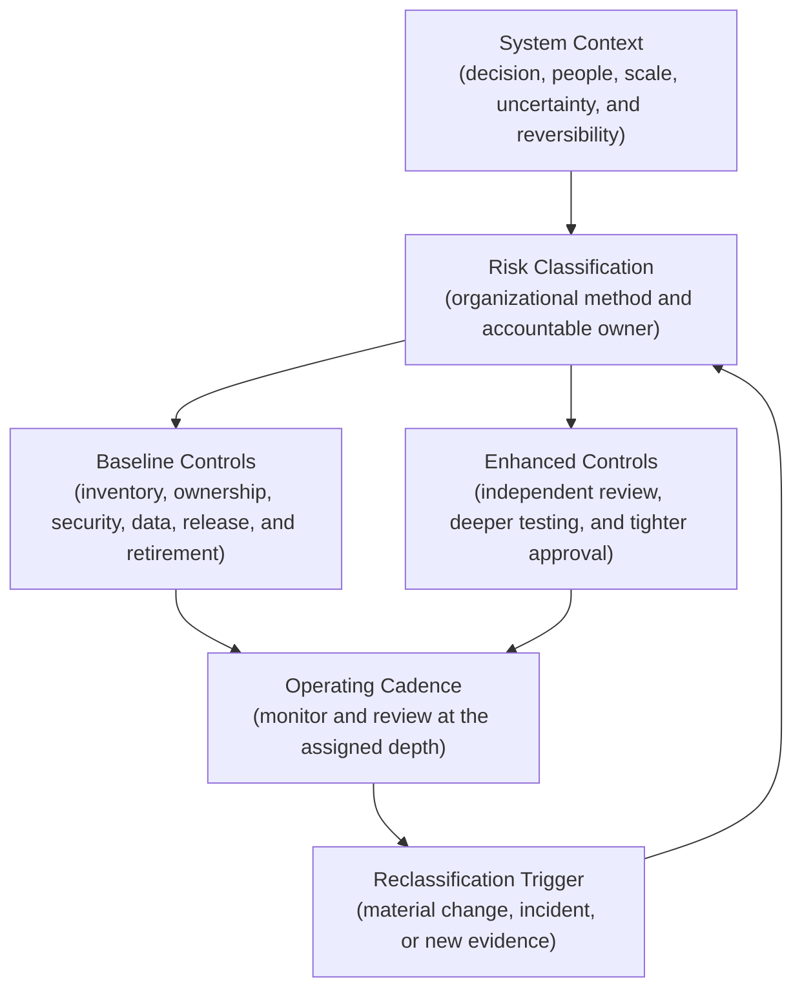
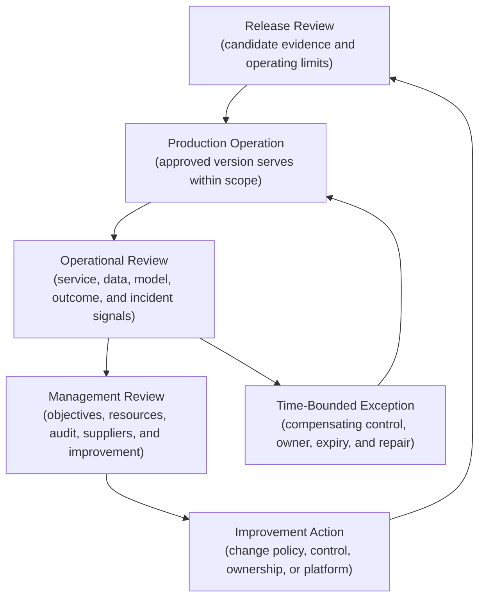
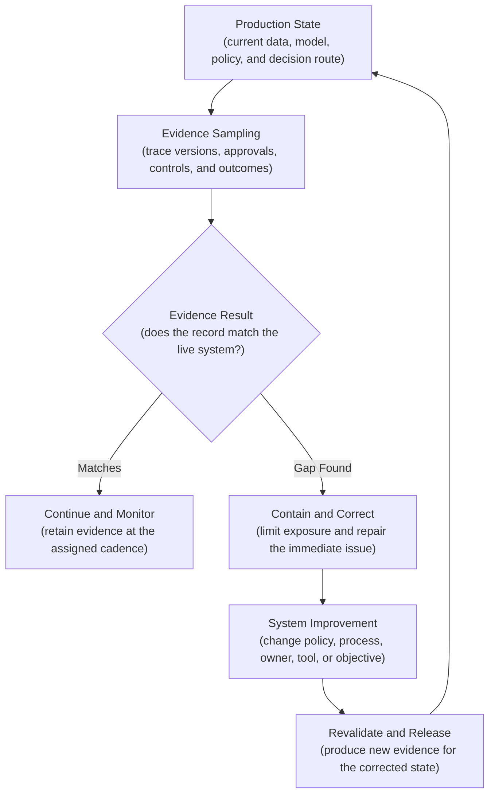

## Table of Contents

1. [Why One ML System Meets Several Standards](#why-one-ml-system-meets-several-standards)
2. [What Each AI Standard Controls](#what-each-ai-standard-controls)
3. [How The Standards Work Together In One ML System](#how-the-standards-work-together-in-one-ml-system)
4. [See the Layers in a Lending Decision](#see-the-layers-in-a-lending-decision)
5. [How Production Tools Record The Required Evidence](#how-production-tools-record-the-required-evidence)
6. [Choose the Right Data-Quality Implementation](#choose-the-right-data-quality-implementation)
7. [Assign Ownership and Match Control Depth to Risk](#assign-ownership-and-match-control-depth-to-risk)
8. [Run Releases, Reviews, and Exceptions](#run-releases-reviews-and-exceptions)
9. [Understand What Certification Establishes](#understand-what-certification-establishes)
10. [Review Evidence Again After The System Changes](#review-evidence-again-after-the-system-changes)
11. [The Main Idea](#the-main-idea)
12. [References](#references)

## Why One ML System Meets Several Standards

<!-- section-summary: AI standards cover different layers of the same production system, from organizational direction to data measurements and operating evidence. -->

A team preparing its first formal AI governance programme often encounters
several documents with similar words: management, risk, lifecycle, quality,
trustworthiness, and governance. The overlap can make the standards sound like
competing versions of the same checklist. They actually address different layers
of one production system.

Consider a lender that uses a model to estimate the chance that an applicant
will miss future repayments. A credit officer sees the score alongside verified
income, affordability information, and the reason codes supplied by the decision
system. The score influences a consequential decision, so a high validation
score answers only one part of the governance problem.

The organization still has to approve the lending uses, assign the outcome
owner, and set the management-review process. The risk team examines harm to
applicants, the lender, and wider groups. Engineers follow a controlled process
from problem definition through retirement. Data owners measure whether income,
repayment, and demographic proxy data remain fit for this purpose. Operations
teams prove that the released system follows those decisions in production.

These are separate responsibilities:

- a **management system** directs how the organization governs AI across people,
  policies, resources, review, and improvement;
- **risk management** identifies uncertain events, their consequences, the
  treatment, and the accepted residual risk;
- **lifecycle processes** place required work and evidence around acquisition,
  development, release, operation, change, and retirement;
- **data-quality management** defines what fit-for-purpose data means, measures
  it, and assigns responsibility for repair;
- an implementation framework such as the **NIST AI Risk Management Framework**
  supplies voluntary outcomes and practices that teams can tailor to their
  context.

A standard describes requirements or guidance. It does not install a control
inside a data pipeline. The organization still has to translate its chosen
requirements into owners, workflows, technical checks, decisions, and retained
evidence. That translation is the MLOps work covered in this article.



The layers depend on one another. A risk decision may require a maximum
false-negative rate for a vulnerable applicant group. The lifecycle plan turns
that requirement into an evaluation gate and a production monitor. The
data-quality plan defines the coverage and label checks needed to trust the
measurement. The management system assigns the owner, review cadence, and
escalation authority. Production evidence shows whether the whole arrangement
still operates.

## What Each AI Standard Controls

<!-- section-summary: ISO/IEC 42001, 23894, 5338, the 5259 family, and NIST AI RMF contribute different structures to one governance programme. -->

The standards cover different layers of the same AI system. Some contain
requirements, others provide guidance, and NIST AI RMF is a voluntary framework.
Their scopes overlap because organizational decisions, engineering processes,
and data controls also overlap. The overlap supports alignment; it
does not make the documents interchangeable.

### ISO/IEC 42001 Covers The Organizational Management System

**ISO/IEC 42001:2023, Information technology — Artificial intelligence —
Management system**, specifies requirements for establishing, implementing,
maintaining, and continually improving an artificial intelligence management
system. The common abbreviation is **AIMS**.

An AIMS is the connected way an organization directs its AI work. It includes
the scope of the programme, leadership commitments, policy, objectives,
responsibilities, resources, operational controls, performance evaluation,
internal audit, management review, and improvement. The subject is wider than an
individual model release. A model team may supply evidence, while organizational
leaders decide the system's scope, risk appetite, resources, and improvement
priorities.

Suppose three business units use machine learning and only the lending unit has
formal release gates. A single model review cannot resolve that organizational
inconsistency. The AIMS defines its scope and common policy. It assigns
accountable leadership and records why a business unit sits inside or outside
that scope. Management review then examines performance against objectives and
decides whether staffing, training, or controls must change.

ISO/IEC 42001 is a requirements standard, so an organization can pursue
third-party certification for a defined AIMS scope. Certification has a narrower
meaning than a universal claim that every AI result is safe or lawful. The
certification boundary is explained later in this article.

### ISO/IEC 23894 Guides AI Risk Management

**ISO/IEC 23894:2023, Information technology — Artificial intelligence —
Guidance on risk management**, helps organizations integrate AI-related risk
into their activities and functions. It applies to organizations that develop,
produce, deploy, or use AI products, systems, and services. Its application can
be tailored to organizational context.

Risk management asks what uncertain event could occur and who or what could be
affected. It then evaluates the likelihood and severity of the consequences. A
treatment changes that exposure, and an authorized owner decides whether the
remaining risk fits the organization's criteria. Consequential systems often
concentrate on safety, rights, security, privacy, reliability, and operational
harm.

For the lending score, one risk scenario might be a regional income feed losing
records for self-employed applicants. The missing values push more applications
into a conservative fallback score, which increases manual reviews and delays
decisions for that group. A risk record links that causal path to data coverage
checks and fallback behaviour. It also names the service target, complaint
monitor, and authority that can pause the score.

ISO/IEC 23894 supplies guidance. It does not replace ISO/IEC 42001's
management-system requirements, a sector-specific risk method, or applicable
law. A team can use its risk approach inside an AIMS and map the resulting
evidence to other frameworks.

### NIST AI RMF Organizes Voluntary Risk Outcomes

The **NIST Artificial Intelligence Risk Management Framework 1.0**, usually
shortened to **NIST AI RMF 1.0**, is intended for voluntary use. Its Core
organizes outcomes across four functions: **Govern, Map, Measure, and Manage**.

Govern establishes organizational policies, accountability, culture, and
oversight. Map develops the context of use, affected parties, impacts, and risk
assumptions. Measure evaluates the system and the evidence used to judge its
trustworthiness. Manage prioritizes and treats risks, monitors the result, and
directs a response. Govern applies across the other three functions rather than
acting as the first stage of a linear project.

NIST describes the Playbook as a collection of suggested actions rather than a
checklist that every organization must complete. Teams can use an AI RMF profile
to describe the outcomes that matter for a particular sector, use case, or risk
tier. A profile can also provide a practical crosswalk from an organization's
existing controls to the RMF functions.

AI RMF 1.0 remains the published baseline while NIST works on its revision.
**NIST AI 600-1, the Generative Artificial Intelligence Profile**, is a
companion resource for risks specific to generative AI. It fits systems that
generate content such as text, images, audio, or code. Those systems raise
specific concerns around confabulation, dangerous content, data provenance, and
model misuse. A conventional tabular lending model gains no special coverage
merely by adding the GenAI Profile to its control register.

### ISO/IEC 5338 Covers AI Lifecycle Processes

**ISO/IEC 5338:2023, Information technology — Artificial intelligence — AI
system life cycle processes**, covers systems based on machine learning and
heuristic approaches. It defines processes and concepts for describing their
lifecycle. Those processes support definition, control, management, execution,
and improvement. Organizations can apply them while developing or acquiring AI
systems.

The standard addresses a recurring engineering failure: important work falls
between teams because each team sees only its own stage. Product defines the
use, data engineering supplies tables, data science trains a model, a platform
team deploys it, and operations monitors the endpoint. A lifecycle view connects
the handoffs and keeps retirement inside the system boundary.

A team maps the applicable lifecycle processes into its delivery method. For
example, intended-purpose approval precedes access to production data. Data and
model evaluation precede release. Operational monitoring follows the deployed
system rather than only the model artifact. A material change reopens the
affected analysis and tests. Retirement removes live routes, credentials,
scheduled jobs, retained data, and supplier access under approved retention
rules.

ISO/IEC 5338 does not prescribe one CI pipeline or project-management method.
Scrum, GitHub Actions, managed ML pipelines, and a regulated change process can
all implement lifecycle work. The evidence must show that the required activity
occurred for the actual system and version.

### The ISO/IEC 5259 Family Covers Data Quality For ML And Analytics

The **ISO/IEC 5259 family, Artificial intelligence — Data quality for analytics
and machine learning**, separates data quality into several related concerns.

Part 1 provides the overview, terminology, and examples. Part 2 defines a
data-quality model and measures. Part 3 covers data-quality management
requirements and guidelines. Part 4 provides a data-quality process framework,
including concerns around ML data and labelling. Part 5 adds a data-quality
governance framework for organizational direction and oversight. The published
Part 6 is a technical report on visualizing data-quality results. Its visual
framework supports communication while the earlier parts supply the underlying
measures and management processes.

The family treats quality as fitness for an intended analytics or ML purpose. A
valid date and a non-null income field provide structural evidence. Timeliness
asks whether the record arrived before the lending decision. Semantic
consistency asks whether the field definition matches the approved policy.
Coverage examines the relevant applicant groups, and join quality shows whether
later repayment outcomes connect to the original prediction.

A generic claim that a dataset is “clean” carries little assurance. The
data-quality plan names each characteristic and its measure. It also assigns the
threshold, owner, failure action, and retained result. Those decisions connect
to the system risk assessment and lifecycle gates.



Following one source never creates automatic conformity with another. ISO/IEC
23894 risk records can support an ISO/IEC 42001 AIMS, and NIST AI RMF outcomes
can help teams implement risk practices. Those mappings remain implementation
choices. An auditor or reviewer still evaluates the requirements and scope of
the source that matters to the decision.


*The five sources overlap around one system, but each contributes a different kind of requirement, guidance, process, outcome, or data-quality discipline.*

## How The Standards Work Together In One ML System

<!-- section-summary: A control crosswalk connects policy, risk decisions, lifecycle gates, data measures, and operating evidence without collapsing their different purposes. -->

Several standards may require evidence from the same policy, release gate, or
data check. Teams connect those requirements through a shared **control**: a
defined action or constraint with an owner, trigger, implementation, evidence,
failure response, and review cadence.

A **control crosswalk** maps that real control to the requirements or outcomes
it supports. The crosswalk prevents duplicated work while preserving the meaning
of each source. One data-coverage gate may support several mapped outcomes. It
can contribute to an AIMS operational control, a risk treatment, a lifecycle
verification activity, a 5259 data-quality objective, and a NIST Measure
outcome. The same test result cannot prove leadership review, risk acceptance,
or retirement planning because those are different responsibilities.

### How Policy, Risk, Lifecycle, Data, And Operations Records Connect

The evidence path starts with a policy decision. The organization may require
enhanced review for AI systems that influence access to credit. The system's
risk assessment turns that policy into concrete scenarios and treatments. The
lifecycle plan places those treatments into development, release, operation,
and change gates. Data-quality rules and evaluation tests execute the measurable
parts, while release and operating systems retain the result.

Every record carries stable identifiers. A system ID identifies the intended use
and operating boundary. A control ID identifies the requirement being
implemented. Dataset snapshot IDs, model versions, source revisions, pipeline
run IDs, and deployment IDs identify the technical state. These identifiers
allow a reviewer to move from a policy decision to the exact production version
that followed it.



The following control record shows the connection. It describes one production
control rather than copying standards text. The mappings explain why the
organization associates the control with each source. The implementation and
evidence fields show what the pipeline actually produces.

```yaml
control_id: DQ-CREDIT-014
system_id: ai-system-credit-review-007
objective:
  Detect loss of eligible-application coverage before training or release.
owner: lending-data-owner
risk_owner: consumer-credit-risk

standard_mappings:
  - source: ISO/IEC 42001:2023
    purpose: Operational control and performance evidence for the scoped AIMS.
  - source: ISO/IEC 23894:2023
    purpose:
      Treatment for delayed or unequal decisions caused by missing records.
  - source: ISO/IEC 5338:2023
    purpose: Data verification at training and release lifecycle gates.
  - source: ISO/IEC 5259-2:2024
    purpose: Measured completeness and coverage characteristics.
  - source: NIST AI RMF 1.0
    purpose: Evidence for mapped, measured, and managed data risk.

implementation:
  dataset: prod_ml.training.credit_examples
  contract_version: credit-training/v6
  minimum_join_coverage: 0.995
  required_segments: [region, application_channel]

evidence:
  test_run: dbt://credit-training-tests/${run_id}
  dataset_snapshot: ${catalog_table_version}
  release_record: ml-release://${release_id}

failure_action: Quarantine the snapshot and keep the current production model.
review_cadence: Every training run and each material data-source change.
```

The control owner maintains the rule and resolves failures. The risk owner
decides whether the treatment reduces the risk enough for the intended use. CI
can enforce the numeric threshold, while it cannot grant itself authority to
accept the residual risk. That separation keeps automation fast and the
consequential decision accountable.


*A control crosswalk can reuse one concrete test result across several mappings without treating leadership review, residual-risk acceptance, or retirement planning as outputs of that test.*

## See the Layers in a Lending Decision

<!-- section-summary: One bounded lending example shows the different questions, evidence, and failures addressed by each standards layer. -->

Return to the lending system from the opening. At application time, the model
estimates missed-payment risk from verified financial and account information. A
trained credit officer uses the score as one input to a documented decision
process. A false low score may contribute to unaffordable lending and financial
loss. A false high score may delay or restrict access to credit through
unnecessary review. Aggregate model accuracy can hide both outcomes for smaller
applicant groups.

This bounded example shows why the standards remain distinct.

### What The Management Standard Asks The Organization To Establish

ISO/IEC 42001 asks the organization to operate an AIMS around the use. The scope
identifies the lending business, markets, suppliers, teams, and interfaces
covered by the management system. Policy defines permitted uses and prohibited
shortcuts. Objectives might cover current ownership, completed impact reviews,
release evidence, complaint response, and timely corrective action.

The evidence includes the scoped AIMS, policy, inventory, assigned roles, and
competence records. Internal-audit results, management-review decisions, and
improvement actions show how the organization checks and changes the system.
This layer catches a regional team using the score for an unapproved purpose. It
also exposes a critical control that remains unfunded after repeated incidents.

### What Risk Guidance Asks The Team To Examine

ISO/IEC 23894 and NIST AI RMF help the team describe the context, affected
people, and risk scenarios. The risk analysis connects trustworthiness concerns
to measures, treatments, and residual decisions. The team examines incorrect
lending outcomes, unequal error rates, privacy exposure, manipulation, service
outage, poor explanations, and reliance on a supplier signal.

Evidence includes the system context, affected-party analysis, risk register,
evaluation plan, thresholds, treatment owner, fallback, human-oversight
procedure, and accepted residual risk. This layer catches a risk hidden by a
strong overall metric. For example, the default-risk model can perform well
across all applications. A local income source may still cause more false high
scores for applicants in one region.

### What Lifecycle Guidance Asks At Each Handoff

ISO/IEC 5338 gives the team a process view across the complete system life. It
covers problem definition and requirements first. Acquisition, data work,
development, verification, validation, deployment, operation, change, and
retirement complete the process set. The organization maps the applicable
processes into its product and MLOps delivery workflow.

Approved requirements and supplier evaluations establish the intended system.
Data and model specifications connect it to traceable test results and release
records. Monitoring plans, change assessments, incident procedures, and the
retirement plan carry control into operation. This layer catches a handoff
failure. A model may pass offline evaluation and still enter production with a
different preprocessing version. A release gate that compares the model
signature, transformation revision, and serving image exposes that mismatch.

### What Data-Quality Standards Ask The Team To Measure

The ISO/IEC 5259 family helps data owners define quality in relation to the
lending purpose. Measures may cover identifier uniqueness, field validity,
source completeness, event timeliness, label accuracy, join coverage, historical
representativeness, and consistency between training and serving
transformations.

Evidence includes data contracts, governed table identities, exact snapshots,
lineage, quality measures, test results, issue records, and approved repairs.
This layer catches an apparently healthy pipeline that still produces unsuitable
evidence. A repayment label may arrive correctly and pass schema validation
while arriving too late for the evaluation window. A data-quality measure for
label maturity exposes that the outcome sample is incomplete.



The example produces one connected evidence chain. It never turns the standards
into identical questions. Leadership can approve an objective, risk owners can
accept a bounded exposure, engineers can execute the lifecycle, and data owners
can verify data fitness. The production release needs all four contributions for
this consequential use.

## How Production Tools Record The Required Evidence

<!-- section-summary: Catalogues, registries, CI/CD, lineage, and telemetry implement parts of the control system while accountable owners retain governance decisions. -->

A spreadsheet can hold the initial mapping from standards to controls.
Production evidence then spreads across source control, data platforms,
registries, CI/CD, ticketing, and observability backends. Stable identifiers and
links connect those systems. Buying one governance platform does not create the missing decisions or
controls.

### Use Catalogues To Record Data Identity, Ownership, And Lineage

A governed catalogue gives data assets stable names, owners, classifications,
access rules, and lineage. **Unity Catalog** fits Databricks estates because it
governs data and AI assets within that platform and captures supported lineage.
**Microsoft Purview Unified Catalog** fits organizations that already use
Purview's data map, governance domains, and data products across a broader
estate. Google Cloud's current managed catalogue is **Knowledge Catalog**,
formerly Dataplex Universal Catalog; its lineage services connect supported
Google Cloud data and AI assets.

Choose the catalogue that covers the systems the organization actually uses and
confirm its connector and lineage granularity. A catalogue may trace a table
through supported Spark or SQL jobs while missing a custom Python extraction. It
may record technical lineage without the business rule that justified the
transformation. Custom lineage or **OpenLineage** can fill selected gaps across
orchestration tools. OpenLineage represents pipeline activity through jobs,
runs, input datasets, output datasets, and run-state events.

The catalogue supplies asset evidence. It does not decide whether a dataset is
legally permitted, representative enough for lending, or approved for a new
intended use. Data owners and risk owners make those decisions and attach the
resulting status to the governed asset.

### Use Registries To Record Model And Evaluation Identity

**MLflow Model Registry** and managed cloud registries record model names,
immutable versions, source runs, signatures, tags, and deployment references.
MLflow aliases provide mutable names such as `champion`. A release record also
preserves the resolved version and artifact digest because the alias can later
move.

For each candidate, the registry evidence connects the trained artifact to its
code revision, environment, input dataset references, evaluation results, and
approval status. A model version tag can summarize validation state, while the
signed release decision remains in the approval system. The registry organizes
technical identity and lineage. It does not replace independent review or a risk
owner's decision.

### Use CI/CD To Enforce Gates And Record Decisions

GitHub Actions, GitLab CI, Jenkins, and managed ML pipelines can execute data
tests, model evaluation, security scans, policy checks, and deployment steps.
The pipeline records the source revision, workflow version, runner identity,
evidence locations, approver, artifact digest, and final result.

A high-risk release normally separates evidence production from approval.
Automated jobs calculate measures and fail mandatory thresholds. An authorized
role reviews exceptions and residual risk. The deployment job accepts only an
approved release record bound to the exact candidate digest. This arrangement
prevents a retraining job from approving the artifact it produced.

### Use Telemetry To Check That Controls Still Operate

Release evidence proves that a candidate passed its gate. Operating evidence
shows how the deployed system behaves with real traffic and real data.
OpenTelemetry can collect vendor-neutral traces, metrics, and logs from the
serving path. Stable attributes such as system ID, release ID, model version,
policy version, and result class connect runtime signals to governance records.

Telemetry needs a deliberate data policy. Full feature vectors, applicant
identifiers, free-text reasons, credentials, and raw decisions rarely belong in
general observability storage. The service should emit bounded categories and
approved references. Restricted source systems retain sensitive evidence under
the required access and retention policy.



The smallest credible implementation uses the organization's existing source
control, CI, catalogue, model registry, approval workflow, and observability
platform. OpenLineage and OpenTelemetry fit work that crosses product
boundaries. They also provide portable evidence across several backends. A
single managed platform may cover most of the path for a smaller team.

## Choose the Right Data-Quality Implementation

<!-- section-summary: Data-quality tools execute fit-for-purpose measures, while owners define the purpose, thresholds, failure response, and evidence policy. -->

Data-quality standards describe a disciplined way to define and manage quality.
The implementation depends on where the data lives and which rules need to run.
Start from the decision consequence, then choose the smallest tool that can
measure the required characteristic at the right point in the lifecycle.

For a SQL warehouse transformation, **dbt data tests** are a strong starting
point. They run assertions against sources and models and return the failing
records. Built-in tests cover uniqueness, non-null values, accepted values, and
relationships. Custom SQL tests can express a business rule such as a maturity
cutoff or minimum join coverage.

**Great Expectations** fits teams that need reusable expectation suites and
validation results across several data systems or Python workflows. **Deequ**
fits large Spark datasets and expresses constraints that Spark jobs can evaluate
at scale. Platform-native expectations and quality monitors can reduce
integration work inside a managed lakehouse or warehouse. They should export
stable results into the release and operating evidence chain.

The following dbt configuration checks structural assumptions for a lending
training table. The `data_tests` entries attach assertions to named columns. A
failed run blocks the snapshot before training and records which assertion
failed.

```yaml
models:
  - name: lending_training_examples
    columns:
      - name: application_id
        data_tests:
          - not_null
          - unique
      - name: applicant_id
        data_tests:
          - not_null
          - relationships:
              arguments:
                to: ref('eligible_applicants')
                field: applicant_id
      - name: repayment_outcome
        data_tests:
          - accepted_values:
              arguments:
                values: [repaid, missed_payment, still_open]
```

These tests catch duplicate applications, missing identifiers, broken joins, and
unexpected label categories. They leave several important questions open. They
cannot prove outcome-label maturity or adequate coverage for every relevant
applicant group. They also cannot prove that historical data represents the
future population. Additional measures and risk decisions address those
requirements.

A production data-quality result preserves the snapshot, contract version, test
revision, measured value, and threshold. It also records the segment, run time,
owner, and failure action. Stored failing rows may contain sensitive
identifiers. Teams therefore keep detailed failures in a restricted schema and
export bounded counts, segment names, and evidence references to CI.

Repair follows a controlled path. A failed completeness test quarantines the new
snapshot and keeps the last approved production model. The data owner
investigates the upstream source and creates a corrected version. The same
checks run again, including comparison across affected segments. Training
resumes from the corrected immutable snapshot. The release record identifies
that version as the candidate's input.

## Assign Ownership and Match Control Depth to Risk

<!-- section-summary: Governance assigns distinct decision rights and scales review independence, evidence, and monitoring to the consequence of the AI use. -->

Standards operate through decision rights. A named owner must have authority to
change the system. The same authority may include funding a repair or stopping
an unsafe use. “The AI team” is too broad. Data, model, product, risk, and
platform decisions belong to different roles.

Top management directs the scoped AIMS, approves policy and objectives, provides
resources, and reviews performance. The business or system owner is accountable
for the intended use and real-world outcome. A risk owner evaluates treatment
and accepts residual risk within delegated authority. The data owner defines
permitted sources and quality controls. The model owner maintains training and
evaluation. The platform owner operates identity, pipelines, registries,
deployment, and telemetry. Legal, privacy, security, compliance, and domain
specialists contribute decisions within their remit. Internal audit or another
independent assurance function tests whether the management system and controls
operate as claimed.

These roles can sit with fewer people in a small organization, although
conflicting decisions still require separation. The person who develops a
high-impact control should not provide its only independent assurance.
Lower-risk internal forecasting may use peer review and automated gates. A
lending or clinical prioritization system may require independent validation and
domain approval. It may also require legal review, stronger change control, and
more frequent outcome analysis.

### Apply Deeper Controls To Higher-Risk Systems

Proportionality sets control depth from the consequence, uncertainty, scale,
reversibility, affected population, and degree of human reliance. Low-risk
systems still receive a governance baseline. Every in-scope system has an owner,
intended purpose, inventory record, minimum security, data controls, and
retirement path.

A higher risk tier increases the independence of evaluation and the required
approval authority. It can also expand segment testing, evidence retention,
supplier review, human oversight, monitoring, rollback exercises, and management
escalation. The tiering method and exception authority belong to the AIMS so
different teams do not silently invent their own thresholds.



The assessment should record why the chosen depth fits the use. A broad label
such as “medium risk” cannot explain a control decision on its own. The record
describes the intended use, affected people, consequence, and exposure. It then
names the safeguards, assumptions, owner, and review trigger.

## Run Releases, Reviews, and Exceptions

<!-- section-summary: Different evidence cadences support release decisions, live operation, periodic assurance, management direction, and temporary exceptions. -->

Governance evidence changes at several speeds. Release evidence belongs to one
candidate. Operational evidence arrives continuously or in scheduled monitoring
jobs. Internal audit samples the control system independently. Management review
examines trends, objectives, resources, incidents, complaints, supplier changes,
audit findings, and improvement actions across the AIMS.

### Check One Exact Model And Evidence Set At Release

A release packet identifies the system, intended purpose, candidate model,
source code, and environment. It links the training snapshots and evaluation
datasets to the risk decision and required control results. It also records the
approvers, deployment plan, rollback, and monitoring readiness. The approval
binds to immutable versions and digests. A later retraining run receives its own
evidence rather than inheriting an old approval through a mutable alias.

The CI pipeline should fail on missing mandatory evidence and failed hard
thresholds. A human review adds judgment where policy requires it, such as
evaluating a changed error tradeoff or confirming that an exception fits
delegated authority. The final release record states the approved operating
limits and the conditions that require rollback or renewed assessment.

### Operational and Management Reviews Ask Different Questions

An operational review examines current service health, data quality, drift,
prediction quality, overrides, complaints, incidents, and control failures. Its
participants can repair a pipeline, limit a route, or roll back a release. The
review cadence follows label delay, system risk, traffic, and how quickly harm
can accumulate.

Management review examines the AIMS itself. Leaders consider whether policy,
objectives, roles, resources, competence, suppliers, assurance, and improvement
work remain adequate. A repeated data incident may reveal a missing platform
investment rather than a single team's mistake. The recorded output assigns a
decision, owner, resources, and due date.

### Exceptions Need an Expiry and a Safe Boundary

A control exception identifies the affected system and version, unavailable
control, reason, and risk change. It names the compensating controls and
accountable approver. The record also includes its start time, expiry,
monitoring, rollback, and repair owner. The expiry prevents a temporary
workaround from turning into an undocumented production design.

Suppose one external income source cannot supply a required freshness field
during a provider migration. The exception may restrict the model to unaffected
application channels and route other cases to manual review. It also increases
coverage monitoring and expires after a short migration window. CI checks for an
active approved exception linked to the exact control and system version. Expiry
blocks the next release or route update until the control returns or a new
decision is approved.

Emergency authority follows the same principle. An incident commander may
disable a model route immediately to contain harm. The record identifies the
action, operator, reason, affected versions, and fallback. A retrospective
review confirms the safe state and investigates the cause. It restores the
control and updates policy or tests if the incident exposed a systemic weakness.



## Understand What Certification Establishes

<!-- section-summary: Certification can provide independent assurance about a defined management-system scope, while product safety, legal compliance, and every model result require separate evidence. -->

ISO/IEC 42001 is a management-system requirements standard. An organization can
implement it without pursuing certification. If certification is chosen, an
external certification body audits the defined AIMS scope. It can issue written
assurance that the management system conforms to the specified requirements. ISO
develops the standard and does not perform certification or issue certificates.

Read the certificate together with its scope. Coverage for one business unit,
location, or class of AI use says nothing about an excluded system. The
certificate gives assurance about the management system evaluated by the
certification body. Model accuracy and decision fairness still need their own
evidence. Incident prevention and jurisdiction-specific legal duties also follow
separate criteria.

ISO/IEC 23894 supplies risk-management guidance, ISO/IEC 5338 supplies lifecycle
processes, and much of the ISO/IEC 5259 family supplies specialized data-quality
structure. NIST AI RMF is voluntary. These sources can strengthen an AIMS and
its evidence. Their use grants no automatic certification to ISO/IEC 42001 or
conformity with another source.

Certification, internal audit, regulatory assessment, customer assurance, and
legal compliance are different activities. An organization may use the same
evidence across them, provided each reviewer evaluates the correct scope and
criteria. Qualified certification, legal, compliance, privacy, security, and
domain specialists should interpret the authoritative requirements that apply to
a particular organization and use.

The engineering team preserves accurate system boundaries, implements approved
controls, retains trustworthy evidence, exposes failures, and repairs them.
During assurance, reviewers test the release path directly. The deployment job
must reject any model that lacks a linked approval, regardless of how complete
the evidence portal appears.

## Review Evidence Again After The System Changes

<!-- section-summary: Material changes, incidents, and review findings reopen the affected decisions so the control system stays aligned with the production system. -->

Changes to data, models, suppliers, policies, or product use can invalidate an
earlier review. The risk assessment may describe one dataset while the pipeline
reads another. A model alias may point to a newer version than the release
record. A supplier may change an API or underlying model. A business team may
use the score for a broader decision than the approved purpose.

The control system defines material-change triggers. Changes to the intended
purpose, affected population, data source, model, supplier, operating region, or
human-review procedure can reopen parts of the assessment. A new decision
threshold or deployment environment can also change the risk. Incidents,
complaints, audit findings, control failures, and new external requirements
trigger the same review path.

### Trace From A Production Decision Back To Its Evidence

A reviewer starts from a production decision route and identifies its system
record, current release, model and code versions, and training snapshots. The
path continues through evaluation, risk treatment, approval, and policy. The
reverse investigation starts from a failed data source or control. It finds
every training run, model version, deployment, and decision route that depended
on the failure.

Catalogues and OpenLineage support the data path. MLflow or a managed registry
supports model identity. CI/CD records support the release path. OpenTelemetry
and monitoring stores support operating behaviour. The governance register
connects those technical records to accountable decisions. Each platform covers
part of the chain, so teams test the links rather than assuming integration
produced complete evidence.

An evidence exercise selects one production release and rebuilds its training
dataset from recorded snapshots. It retrieves the exact model artifact, reruns
the required evaluation, confirms the deployment digest, and locates the
approval. Another exercise selects a control exception and confirms its
compensating monitor, expiry, and repair. Missing or inaccessible evidence
creates a corrective action with an owner and due date.

### Fix The Process That Allowed The Failure

A broken data test needs repair at the source or transformation. A repeated
class of failures may require a stronger contract, a new owner, a platform
feature, different supplier terms, or a changed management objective. Internal
audit and management review provide the path from individual evidence to
system-level improvement.

This feedback loop is central to a management system. The organization observes
performance, compares it with objectives and risk decisions, corrects the
immediate issue, and changes the process that allowed it. The next release then
produces stronger evidence through the normal delivery path.



## The Main Idea

<!-- section-summary: Standards work together through distinct responsibilities, shared controls, stable identities, and evidence that follows the live AI system. -->

AI management, risk, lifecycle, and data quality describe different layers of
one production system. ISO/IEC 42001 directs the organizational management
system. ISO/IEC 23894 guides AI risk management. NIST AI RMF supplies voluntary
outcomes and profiles. ISO/IEC 5338 organizes lifecycle processes. The ISO/IEC
5259 family defines data-quality concepts, measures, management, processes,
governance, and supporting visualization.

The implementation connects those layers through real controls. Policy sets the
objective. Risk work defines the scenario and treatment. Lifecycle gates place
the work at the right handoff. Data and model checks produce measurable
evidence. Catalogues, registries, CI/CD, lineage, and telemetry preserve the
technical record. Accountable owners approve, limit, repair, or stop the use.

This structure prevents two common errors. The first is treating standards as
interchangeable checklists. The second is assuming a tool or certificate proves
every property of an AI system. A credible programme keeps each source's purpose
intact and traces its decisions to the exact system operating in production.


*Standards become operational when their distinct responsibilities connect through stable identifiers to an accountable release decision, live evidence, and a feedback loop that changes the control system.*

## References

- [ISO/IEC 42001:2023 — Artificial intelligence management system](https://www.iso.org/standard/42001) -
  Official ISO overview, title, status, and management-system scope.
- [ISO/IEC 23894:2023 — Guidance on AI risk management](https://www.iso.org/standard/77304.html) -
  Official ISO overview of AI-specific risk-management guidance.
- [ISO/IEC 5338:2023 — AI system life cycle processes](https://www.iso.org/standard/81118.html) -
  Official ISO description of lifecycle processes for AI systems.
- [ISO/IEC 5259-1:2024 — Overview, terminology, and examples](https://www.iso.org/standard/81088.html) -
  Official foundation for the ISO/IEC 5259 data-quality family.
- [ISO/IEC 5259-2:2024 — Data quality measures](https://www.iso.org/standard/81860.html) -
  Official data-quality model and measures.
- [ISO/IEC 5259-3:2024 — Data quality management requirements and guidelines](https://www.iso.org/standard/81092.html) -
  Official management requirements and guidance.
- [ISO/IEC 5259-4:2024 — Data quality process framework](https://www.iso.org/standard/81093.html) -
  Official process framework for analytics and ML data quality.
- [ISO/IEC 5259-5:2025 — Data quality governance framework](https://www.iso.org/standard/84150.html) -
  Official governance framework for directing and overseeing data quality.
- [ISO/IEC TR 5259-6:2026 — Visualization framework for data quality](https://www.iso.org/standard/86532.html) -
  Official technical report for visualizing data-quality results.
- [NIST AI Risk Management Framework](https://www.nist.gov/itl/ai-risk-management-framework) -
  Official AI RMF 1.0, Playbook, profiles, and revision status.
- [NIST AI RMF Playbook](https://airc.nist.gov/airmf-resources/playbook/) -
  Official suggested actions across Govern, Map, Measure, and Manage.
- [NIST AI 600-1 — Generative Artificial Intelligence Profile](https://www.nist.gov/publications/artificial-intelligence-risk-management-framework-generative-artificial-intelligence) -
  Official companion profile for generative-AI risk.
- [ISO management system standards](https://www.iso.org/management-system-standards.html) -
  Official explanation of implementation, audit, and optional certification.
- [ISO certification](https://committee.iso.org/certification.html) - Official
  explanation of certification bodies and ISO's role.
- [Databricks Unity Catalog lineage](https://docs.databricks.com/aws/en/data-governance/unity-catalog/data-lineage) -
  Official lineage capabilities and boundaries for governed Databricks assets.
- [Microsoft Purview data governance](https://learn.microsoft.com/en-us/purview/data-governance-purview-portal) -
  Official overview of the current Microsoft Purview governance experience.
- [Google Cloud Knowledge Catalog](https://docs.cloud.google.com/dataplex/docs/catalog-overview) -
  Official metadata catalogue and current product naming.
- [MLflow Model Registry workflows](https://mlflow.org/docs/latest/ml/model-registry/workflow/) -
  Official model-version, alias, tag, and promotion guidance.
- [dbt data tests](https://docs.getdbt.com/docs/build/data-tests) - Official
  syntax and behaviour for assertions against sources and models.
- [Great Expectations: Define Expectations](https://docs.greatexpectations.io/docs/core/define_expectations/) -
  Official explanation of expectations and expectation suites.
- [Deequ](https://github.com/awslabs/deequ) - Official Spark data-quality
  constraint and verification project.
- [OpenLineage run cycle](https://openlineage.io/docs/spec/run-cycle/) -
  Official event model for jobs, runs, and input and output datasets.
- [OpenTelemetry signals](https://opentelemetry.io/docs/concepts/signals/) -
  Official overview of traces, metrics, logs, and other telemetry signals.
