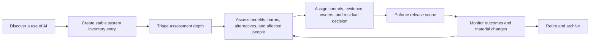
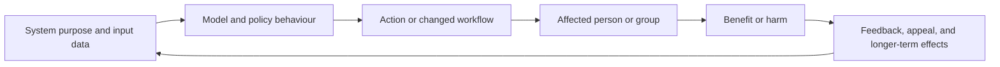

## Why Inventory Comes Before Assessment
<!-- section-summary: An inventory identifies the complete AI system and owner, while an impact assessment examines what that specific system and use can do to people and operations. -->

An **AI system inventory** is a controlled record of the AI systems an organization develops, supplies, or uses. It identifies each system's intended purpose, owners, status, affected people, decisions, technical components, data, markets, risk tier, and lifecycle dates. An **AI impact assessment** examines the benefits and possible negative effects of that specific system and use.

The inventory comes first because an assessment needs a stable subject. A model called `seller-risk-v42` tells you very little about the surrounding business process. The deployed system may include data pipelines, a model, decision rules, an analyst interface, vendor APIs, customer notices, appeal handling, monitoring, and fallback. Those parts determine who is affected and how.

A supporting example follows **MarketHarbor**, an online marketplace that scores seller payouts for fraud review. A high score sends a payout to a trained analyst and can delay funds for a small business. The system inventory defines that use and its boundaries. The impact assessment then examines false holds, delayed cash flow, regional differences, privacy, analyst workload, explanations, appeals, and failure recovery.

The two practices connect through one lifecycle:



The inventory supplies the subject, ownership, and status. The assessment supplies the reasoning about impact. Release and monitoring keep those records connected to the system that people actually experience.

## Define The Inventory Unit
<!-- section-summary: Use one inventory entry per deployed AI system and intended use, then link models, datasets, APIs, interfaces, and infrastructure as components. -->

The primary inventory unit should be the **AI system and intended use**. One row per model file creates many technical entries with little business context. One row per department hides important differences between decisions and affected people.

MarketHarbor gives the seller payout workflow the ID `ai-system-seller-payout-risk-003`. The same embedding model used by product search belongs to a different system entry because search and payout review have different users, impacts, data, controls, and owners.

The entry boundary includes:

| Area | Seller payout example |
| --- | --- |
| Intended purpose | Prioritize suspicious payouts for trained fraud analysts |
| Decision or action | Queue priority and temporary payout hold |
| Affected people | Sellers, fraud analysts, seller-support staff |
| Technical components | Feature pipeline, risk model, rules, vendor signal, review UI |
| Human role | Analyst reviews evidence before an extended hold |
| Operational controls | Fallback rules, appeal route, monitoring, withdrawal procedure |

Discovery also needs an operating process. MarketHarbor collects candidates from procurement records, cloud and registry resources, code imports, data jobs producing prediction tables, architecture reviews, privacy and security reviews, and product intake forms. A governance owner confirms whether each candidate meets the organization's inventory scope.

## Discover Systems and Reconcile the Inventory
<!-- section-summary: Discovery combines product declarations with technical and procurement signals, then reconciles differences to find unregistered or stale systems. -->

An intake form catches planned systems, while it cannot find every experiment, embedded vendor feature, or reused model. Technical discovery can scan model registries, scheduled training and scoring jobs, prediction tables, AI SDK dependencies, cloud AI resources, API gateways, and service configuration. Procurement can identify external decision services and models that engineering did not build.

Every discovery source has false positives. Importing an ML library may support a tutorial rather than production use. A dormant registry model may never have influenced a decision. Governance owners need a triage queue that connects the technical signal to a product owner and intended use.

Reconciliation compares declared inventory with observed systems. A production endpoint without an active system ID needs investigation. An inventory entry marked retired while its batch job still runs indicates incomplete withdrawal. A supplier contract with no component link may reveal an unassessed dependency. The process records resolution rather than silently deleting the signal.

Inventory quality needs measures of its own. Teams can track entries with missing owners, overdue reviews, unresolved discovery findings, unreachable evidence links, production releases without active assessments, and retired systems with live identities or traffic. These signals show whether the inventory can support decisions under pressure.

Stable identity matters during organizational change. Teams and project names can move, while `system_id` should remain fixed for the life of the use. Ownership fields point to maintained groups and escalation contacts rather than one person's email. A merger, supplier change, or platform migration updates components and owners without creating a false impression that an entirely new impact history started.

## Record A Useful System Entry
<!-- section-summary: A useful inventory entry supports ownership, risk triage, release checks, incident response, review, and retirement through stable fields and links. -->

NIST AI RMF Govern 1.6 calls for mechanisms to inventory AI systems according to organizational risk priorities. MarketHarbor keeps the record small enough to maintain and links to detailed evidence:

```yaml
system_id: ai-system-seller-payout-risk-003
name: Seller payout risk review
status: production
intended_purpose: Prioritize suspicious seller payouts for trained fraud analysts.
prohibited_uses:
  - autonomous account termination
  - employee monitoring
business_owner: marketplace-risk-director
technical_owner: seller-risk-ml
incident_owner: seller-risk-oncall
risk_tier: high
affected_people:
  - marketplace_sellers
  - seller_support_staff
decision_support:
  - payout_review_priority
human_oversight: fraud_analyst_review
markets: [UK, IE, FR, DE]
data_categories:
  - transaction_history
  - device_reputation
  - seller_messages
components:
  - model_registry://seller-risk/versions/42
  - supplier://device-signal-co
  - ui://fraud-review-console
impact_assessment: assessment://AIA-2026-118
production_release: release://seller-risk-2026-05-14.2
withdrawal_runbook: runbook://seller-risk-disable
last_reviewed: 2026-07-09
next_review: 2026-10-09
```

The inventory points to detailed records instead of copying them. During an incident, it should answer who can stop the system, which customers and markets are affected, which model and suppliers are live, where the assessment lives, and which release can be restored.

CI validates required fields and checks that production releases use an active inventory entry:

```bash
yq -e '
  .system_id and
  .business_owner and
  .technical_owner and
  .incident_owner and
  .intended_purpose and
  .status and
  .risk_tier and
  .impact_assessment and
  .last_reviewed and
  .next_review
' inventory/ai-system-seller-payout-risk-003.yml
```

Automated reminders flag overdue reviews and owner groups with no active members. Deployment policy checks the system ID, approved model version, and current impact decision before production changes.

## Triage The Assessment Depth
<!-- section-summary: Assessment depth follows the system's purpose, affected people, autonomy, scale, sensitivity, reversibility, and legal or safety context. -->

Every inventory entry needs a basic impact screen. The depth then follows risk. MarketHarbor reviews the decision's importance, affected population, scale, data sensitivity, automation level, human authority, reversibility, known uncertainty, supplier dependence, and applicable obligations.

The seller payout system receives a high tier because it can delay business funds across several markets. A model that groups internal documentation for search may receive a lighter process. The tier changes required evidence, reviewers, monitoring, exercise frequency, and approval authority.

The triage record also asks whether AI is appropriate for the use. If simple rules or process changes can provide the benefit with lower impact, the team should compare those alternatives before committing to a model release.

## Run The Impact Assessment
<!-- section-summary: An impact assessment connects purpose and affected people to benefits, harm scenarios, evidence, alternatives, controls, measures, and accountable decisions. -->

ISO/IEC 42005:2025 provides current international guidance for AI system impact assessments throughout the lifecycle. MarketHarbor uses a cross-functional review that covers the product workflow, data, model, interface, human review, appeals, suppliers, monitoring, and operating context.

The assessment should trace the pathway from system behaviour to impact. A score alone affects nobody until policy and product workflow use it. The same model can create different consequences when it ranks a review queue, automatically holds money, or supplies a non-binding investigation signal.



This causal chain helps reviewers place controls. Data validation protects the input boundary. Segment evaluation tests model and policy behaviour. A human confirmation rule limits action. Notice and appeal help affected people challenge an error. Monitoring checks outcomes and feedback after deployment. One control rarely covers every link.

The assessment starts with affected people and real situations. Legitimate sellers may experience delayed cash flow. New sellers using shared commercial networks may receive more false holds. Fraud analysts may receive a queue that overrepresents some languages or regions. Support teams may lack enough evidence to explain a delay. The marketplace may lose money when fraud passes through.

Each important scenario receives evidence and an accountable response:

```yaml
impact_id: IMPACT-SELLER-021
scenario: New sellers using shared commercial networks receive excessive payout holds.
affected_groups:
  - new_sellers
  - sellers_using_shared_networks
severity: high
likelihood_before_controls: possible
evidence:
  - analysis://shared-network-false-positive-study-2026-06
  - complaint-theme://payout-hold-network-clusters
controls:
  - cap device-reputation contribution for new sellers
  - require analyst review before a hold exceeds 24 hours
  - provide a seller escalation route
measures:
  - false_positive_rate_by_seller_tenure
  - median_hold_duration_by_network_type
  - appeal_overturn_rate
residual_decision: conditional_approval
decision_owner: marketplace-risk-director
review_trigger: device API, threshold, market, or seller-policy change
```

The assessment compares alternatives. MarketHarbor considers delaying only the portion above a threshold, requesting additional evidence, using rules for known fraud patterns, sending cases to review without a hold, and improving seller verification before scoring. The decision record explains why the selected design provides enough benefit for the remaining impact.

Stakeholder input improves the evidence. Seller-support staff understand confusing messages. Fraud analysts understand queue pressure. Data owners understand coverage gaps. Security and privacy teams understand external data flow. Research involving affected sellers can identify practical harms that internal teams missed.

Assessment should also examine cumulative and interaction effects. A short payout delay may look minor per event while repeated holds create serious cash-flow pressure for a small seller. Two separate risk tools can combine into a harsher workflow even when each passes its own threshold. The system boundary should include those downstream dependencies when they materially shape the outcome.

## Connect Controls To Release Evidence
<!-- section-summary: Impact controls need implementation owners, measurable evidence, release conditions, monitoring, and a response when the control fails. -->

The assessment produces engineering and operating work. A human-review control needs interface behavior, training, permissions, override logging, staffing capacity, and an escalation route. A fairness control needs approved slices, metric definitions, thresholds, owners, and delayed outcome joins. A privacy control needs data minimization, access, retention, model-leakage tests, and incident handling.

MarketHarbor's release packet links the evidence:

```yaml
impact_decision:
  assessment_id: AIA-2026-118
  system_id: ai-system-seller-payout-risk-003
  model_version: "42"
  decision: conditional_approval
  required_evidence:
    - segment-evaluation://seller-risk-v42
    - human-workflow-test://fraud-console-2026-07
    - privacy-review://seller-messages-v5
    - fallback-exercise://seller-risk-2026-q3
  conditions:
    - payout holds above 24 hours require analyst confirmation
    - appeal overturn rate reviewed weekly by seller-risk
  expires_at: 2026-10-09T00:00:00Z
```

The expiry date prevents a one-time assessment from covering every future version. CI checks evidence presence and dates. Accountable reviewers decide whether the evidence supports release, mitigation, a smaller scope, more testing, or rejection.

## Review Change And Retirement
<!-- section-summary: Material changes, new evidence, incidents, overdue controls, new markets, and retirement all update the inventory and assessment. -->

The inventory is a lifecycle record. MarketHarbor reviews changes to intended purpose, affected people, countries, model family, thresholds, features, label definitions, suppliers, user interface, human authority, and fallback. A material change reopens the impact assessment before release.

Production evidence can reopen it too. A rising appeal overturn rate, repeated complaints, a security incident, or a weak control exercise can pause the system even when the model metric remains stable. The assessment links monitoring thresholds to named actions and owners.

Retirement closes the loop. The owner removes traffic, disables scheduled jobs, revokes identities, applies data and artifact retention rules, archives required evidence, updates customer and staff procedures, and marks the inventory entry retired. The withdrawal exercise proves that the team can stop the system without losing the surrounding business process.

## Test Whether the Assessment Still Deserves Trust
<!-- section-summary: Assessment quality depends on current scope, representative evidence, implemented controls, accountable decisions, and live production feedback. -->

An impact assessment can fail through staleness even when every field is complete. The intended use may expand, the supplier may change behaviour, or the human-review queue may lose staffing. Reviewers should compare the written system boundary with current architecture, product policy, routes, and operating procedures.

Controls need proof of implementation and effectiveness. A statement that people can appeal should link to the actual route, response ownership, and outcome data. A human-oversight claim should show reviewer authority, interface information, capacity, override records, and escalation. A fairness control should link to the relevant groups, metric definitions, uncertainty, thresholds, and decision response.

The assessment also distinguishes assumptions from evidence. An expected low volume, reliable supplier, reversible decision, or quick rollback can justify a design only while the assumption remains true. Monitoring should measure the important assumptions or provide a scheduled review. A failed assumption can pause or narrow the system even when predictive performance remains stable.

## Reassess The Decision And Its Evidence
<!-- section-summary: A reliable inventory and assessment let the team identify a system, understand its impacts, trace controls to evidence, and respond to change. -->

Before approval, reviewers ask whether the inventory describes the complete use rather than one model file. They confirm purpose, affected people, owners, risk tier, components, markets, human role, assessment, production release, and withdrawal path. They then inspect the main impact scenarios, alternatives, controls, measures, residual decision, expiry, and review triggers.

This article now has one responsibility: define the system and assess its impacts. The later third-party risk article uses the component links in this inventory to examine suppliers, external models, APIs, data, software, and infrastructure without mixing procurement mechanics into the impact-assessment workflow.

## References

- [NIST AI RMF Core](https://airc.nist.gov/airmf-resources/airmf/5-sec-core/)
- [NIST AI RMF Playbook](https://airc.nist.gov/airmf-resources/playbook/)
- [ISO/IEC 42005:2025 — AI system impact assessment](https://www.iso.org/standard/42005)
- [ISO/IEC 42001:2023 — Artificial intelligence management system](https://www.iso.org/standard/42001)
