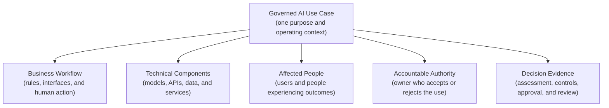
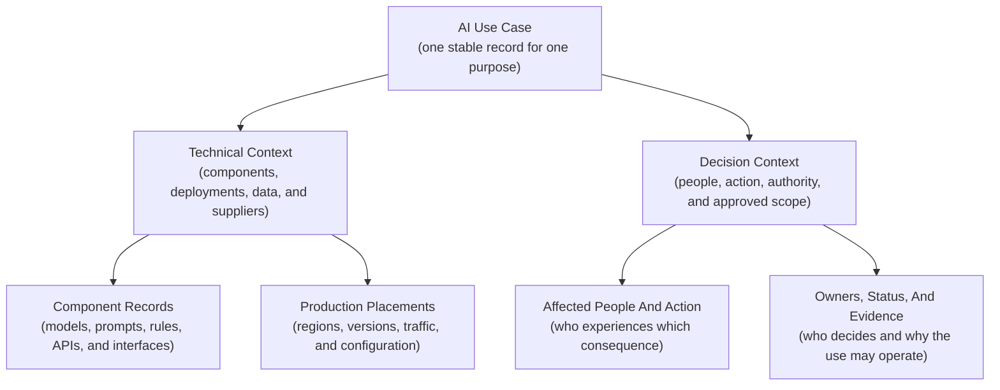
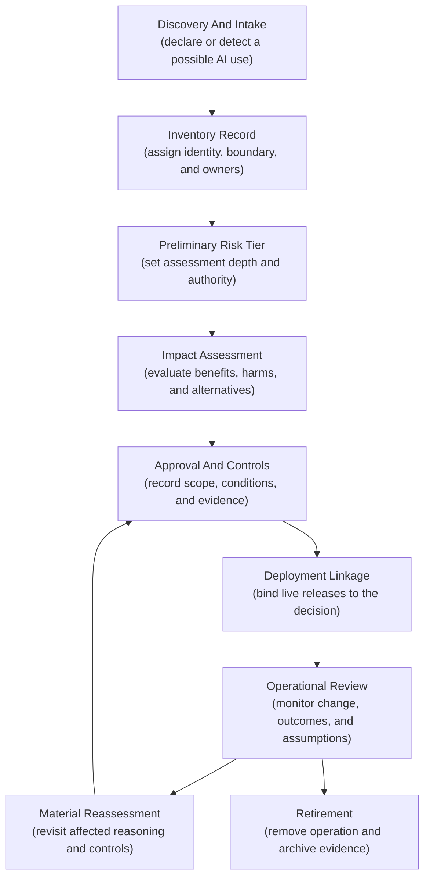
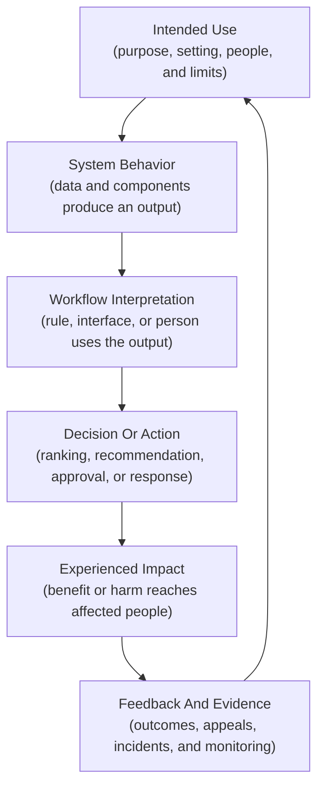
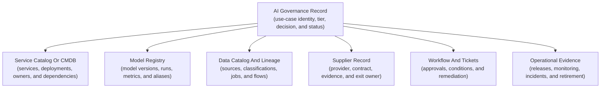

## Table of Contents

1. [Why An AI Inventory Exists](#why-an-ai-inventory-exists)
2. [What One AI Inventory Record Describes](#what-one-ai-inventory-record-describes)
3. [Update The Inventory Through The Whole Lifecycle](#update-the-inventory-through-the-whole-lifecycle)
4. [Discover Unregistered Systems And Stale Records](#discover-unregistered-systems-and-stale-records)
5. [Assess How System Behaviour Can Affect People](#assess-how-system-behaviour-can-affect-people)
6. [Use Risk Tiers To Set Review Depth And Decision Authority](#use-risk-tiers-to-set-review-depth-and-decision-authority)
7. [Keep Local Owners Accountable For Third-Party Components](#keep-local-owners-accountable-for-third-party-components)
8. [Use One Stable System ID Across Inventory, CI, Registry, And Monitoring](#use-one-stable-system-id-across-inventory-ci-registry-and-monitoring)
9. [What The Inventory Stores Directly And What It Links](#what-the-inventory-stores-directly-and-what-it-links)
10. [Who Updates The Inventory And What Triggers A Review](#who-updates-the-inventory-and-what-triggers-a-review)
11. [Remove The System From Production And Close Its Inventory Record](#remove-the-system-from-production-and-close-its-inventory-record)
12. [Verify That The Inventory Matches Production](#verify-that-the-inventory-matches-production)
13. [The Main Idea](#the-main-idea)
14. [References](#references)

## Why An AI Inventory Exists

<!-- section-summary: An AI inventory lets an organization identify each AI use case, connect it to accountable owners, and apply governance according to its real impact. -->

An organization cannot govern an AI system that nobody can reliably identify.
Without a shared inventory, a security team may know about a cloud endpoint and
an ML team may know about a model version. Procurement may know about a vendor
API, while operations knows about a human review queue. Each record describes a
real piece, yet none explains the complete use of AI.

An **AI inventory** gives that use a stable organizational identity. It records
the purpose, the people and decisions involved, and the accountable owners. It
also connects technical and supplier components, live deployments, the current
risk decision, and the evidence behind that decision. The inventory lets the
organization answer ordinary questions during release, audit, change, and
incident response: Which AI systems are running? Who can stop one? Who may be
affected? Which approval applies to the deployed version?

Consider a support team that prioritizes incoming requests. An internal model
estimates urgency. A vendor language API summarizes long messages. A rule sends
high-scoring requests to a priority queue. A data feed supplies recent account
events, and a support agent chooses the response. The governed use case is the
whole prioritization workflow. A record containing only the internal model
would omit the vendor, rule, data, agent, and customer consequence.

This system view matches the direction of the NIST AI Risk Management Framework
(AI RMF). Govern 1.6 calls for mechanisms to inventory AI systems according to
organizational risk priorities. The Map function then establishes the context
needed to reason about purpose, people, impacts, dependencies, and foreseeable
use. The current published framework is AI RMF 1.0, and NIST states that a
revision is in progress. Organizations should preserve the framework and
profile version used by each decision.


```mermaid
flowchart TD
    A["Governed AI Use Case<br/>(one purpose and operating context)"] --> B["Business Workflow<br/>(rules, interfaces, and human action)"]
    A --> C["Technical Components<br/>(models, APIs, data, and services)"]
    A --> D["Affected People<br/>(users and people experiencing outcomes)"]
    A --> E["Accountable Authority<br/>(owner who accepts or rejects the use)"]
    A --> F["Decision Evidence<br/>(assessment, controls, approval, and review)"]

    class A usecase;
    class B,C,D,E,F context;
```

The inventory creates visibility and connection. It cannot decide that a use is
acceptable by itself. That decision needs an impact assessment grounded in the
specific workflow and evidence.

## What One AI Inventory Record Describes

<!-- section-summary: The inventory unit is one AI-enabled use in context, with linked components, deployments, people, decisions, data, suppliers, owners, status, and evidence. -->

One inventory record describes an AI-enabled use in its real organizational and
product context. This unit is called an **AI use case**, or **AI system in
context**. It combines an intended purpose with the components and people that
carry out that purpose, and it stays stable as individual models or platforms
change.

### Record Components And Deployments For Each Use

A **model** is one trained or configured component. A **component** is any part
that contributes to the AI-enabled behavior. Examples include a model, prompt,
decision rule, data transformation, external API, review interface, or
monitoring service. A single use case can contain several models, and one
foundation model can support several use cases with very different impacts.

A **deployment** is one running placement of the system or a component. The
same use case may have a batch deployment for overnight work, an online endpoint
for real-time requests, and a staging deployment for validation. Region,
configuration, traffic, model version, and policy version make each deployment
operationally distinct. The inventory links these placements to the same use
case and records which ones currently affect people.

Suppose a document classifier moves from model version 12 to version 13. That is
a component change inside one continuing use case. Another team might use
version 13 to recommend employee disciplinary action. That new purpose has
different affected people, decision authority, and consequences, so it deserves
a separate use-case record.

### Record Who Is Affected And What Action Follows

The **owner** runs the process and keeps its record current. The **accountable
authority** has organizational authority to approve, restrict, pause, or retire
the use. These roles can belong to the same group in a small organization, while
high-impact uses often separate implementation from approval.

**Affected people** include direct users and people who experience downstream
effects. A fraud analyst may operate a model while a customer experiences a
payment delay. A warehouse planner may use a demand forecast while shift workers
experience schedule changes. The inventory names both groups because user
experience alone cannot describe impact.

The record also names the **decision or action** influenced by the system. A
score has no direct consequence until a rule, person, or application uses it to
rank, approve, deny, route, recommend, generate, or trigger something. Recording
the action reveals how much authority the AI path receives and which fallback
must remain available.

### Add Data, Suppliers, Status, And Evidence To The Record

**Data sources** identify the governed datasets, event streams, documents, and
external signals used for training or operation. References should point to a
data catalog or lineage system that holds schema, classification, ownership,
quality, and provenance detail.

A **supplier** provides an external component or service. A **fourth party** is
an upstream provider used by that supplier, such as its cloud host, model API,
or data provider. The inventory records the dependency and data flow even if
contract and technical assurance evidence live in separate supplier systems.

**Lifecycle status** says whether the use is proposed, under assessment,
approved for a limited test, active in production, paused, or retired. **Evidence
links** connect the record to impact assessments, model evaluations, data
reviews, security findings, approvals, deployment manifests, exceptions,
monitoring, incidents, and retirement proof.


```mermaid
flowchart TB
    U["AI Use Case<br/>(one stable record for one purpose)"] --> T["Technical Context<br/>(components, deployments, data, and suppliers)"]
    U --> D["Decision Context<br/>(people, action, authority, and approved scope)"]
    T --> C["Component Records<br/>(models, prompts, rules, APIs, and interfaces)"]
    T --> P["Production Placements<br/>(regions, versions, traffic, and configuration)"]
    D --> A["Affected People And Action<br/>(who experiences which consequence)"]
    D --> E["Owners, Status, And Evidence<br/>(who decides and why the use may operate)"]

    class U system
    class T,D group
    class C,P,A,E record
```

The technical side explains what is running. The decision side explains why it
exists and what authority it has. Both sides belong to the same use-case record,
which is why a model registry alone cannot serve as the enterprise AI inventory.

### Why A Model Registry Cannot Replace The AI Inventory

MLflow Model Registry, Models in Unity Catalog, SageMaker AI Model Registry, and
other cloud registries organize trained model versions. They can preserve
artifact identity, source runs, metrics, signatures, tags, aliases, and
deployment-oriented status. That is valuable technical evidence.

The enterprise inventory asks broader questions. It records the decision the
model influences, affected people, business authority, and human workflow. It
also connects vendor dependencies, approved scope, legal or policy context,
active deployments, the impact decision, and the withdrawal route. A registry
version therefore links to an inventory record as a component. It should not
silently stand in for the whole use case.


*The inventory governs the full decision workflow and its accountable scope; a model registry supplies technical identity for one component inside that record.*

## Update The Inventory Through The Whole Lifecycle

<!-- section-summary: The inventory begins during intake, drives assessment and approval, follows deployment and change, and remains available through retirement. -->

The inventory must follow each use from initial intake through approval,
production, change, and retirement. A spreadsheet created during an annual
audit will miss systems that were launched, changed, or abandoned between
reviews.

The lifecycle starts with **discovery or intake**. A team declares a planned use,
or a technical and procurement signal reveals one that already exists. A
governance steward creates the stable record and confirms its boundary. A
**preliminary risk tier** then decides the depth of assessment, evidence, and
approval needed before the use can proceed.

The impact assessment connects the intended use to people, benefits, possible
harms, alternatives, and controls. Accountable reviewers approve, narrow,
condition, pause, or reject the use. A production release links the exact
deployment, model, policy, and evidence to that decision.

Operation introduces new information. A material change reopens the relevant
parts of the assessment. Periodic review checks assumptions and controls even
when the implementation appears stable. Retirement removes operational paths
and preserves the records needed for later investigation.


```mermaid
flowchart TD
    A["Discovery And Intake<br/>(declare or detect a possible AI use)"] --> B["Inventory Record<br/>(assign identity, boundary, and owners)"]
    B --> C["Preliminary Risk Tier<br/>(set assessment depth and authority)"]
    C --> D["Impact Assessment<br/>(evaluate benefits, harms, and alternatives)"]
    D --> E["Approval And Controls<br/>(record scope, conditions, and evidence)"]
    E --> F["Deployment Linkage<br/>(bind live releases to the decision)"]
    F --> G["Operational Review<br/>(monitor change, outcomes, and assumptions)"]
    G --> H["Material Reassessment<br/>(revisit affected reasoning and controls)"]
    H --> E
    G --> I["Retirement<br/>(remove operation and archive evidence)"]

    class A,B intake;
    class C,D,E assess;
    class F,G,H operate;
    class I close;
```

This sequence does not force every low-impact experiment through a large review.
It gives every candidate a known entry point and applies effort according to
risk. A local prototype using synthetic data can remain in a limited state. A
system influencing access to employment, credit, healthcare, or physical safety
requires stronger evidence and authority before real use.

## Discover Unregistered Systems And Stale Records

<!-- section-summary: Federated discovery combines declarations with technical, data, service, and procurement signals, then reconciles those signals with governed records. -->

People should declare planned AI uses through product, architecture,
procurement, privacy, or security intake. Declaration supplies purpose and
context that a scanner cannot infer, while technical discovery finds live
systems and dependencies missing from the declared inventory. Either path can still miss experiments promoted
without review, vendor features enabled through configuration, and old systems
whose original owners have left.

**Federated discovery** combines signals from several systems while leaving
detailed source records where they belong. Model registries reveal registered
models. Cloud inventories reveal AI endpoints and training jobs. A software
catalog or configuration management database (CMDB) reveals services and
owners. Data lineage reveals scoring outputs and model inputs. Procurement
reveals AI suppliers. API gateways, scheduled jobs, code dependencies, and
expense records provide additional clues.

Each signal creates a candidate for reconciliation. A library import may belong
to a tutorial. A dormant model may never have served a prediction. A vendor API
may perform ordinary search rather than an AI-influenced decision. A governance
steward contacts the likely owner and records the resolution. The steward then
links the signal to an existing use case, creates a new record, or documents why
it falls outside scope.

### Use Reconciliation To Find Missing And Contradictory Records

The inventory should compare declared state with observed state. A production
endpoint without an active system ID requires investigation. A record marked
retired while a scheduled scoring job still runs indicates incomplete
withdrawal. A supplier contract with no linked use case leaves impact and exit
ownership unclear.

Reconciliation also detects duplication. Two teams may register the same use
under a product name and a model name. Matching deployment identifiers, service
owners, model URIs, and decision descriptions helps a steward merge the
technical links while preserving one stable use-case history.

### Monitor How Recently Each Inventory Record Was Verified

The inventory should record when its owner and connected systems last confirmed
the declared state. An active owner group and a recent connector observation
both support that claim. Other signals include a live deployment link, a
reachable assessment, and a review date appropriate to the risk tier. These
signals identify records that need attention rather than granting approval.

For example, an owner directory shows that the accountable group has no active
members. The platform marks the record as ownerless, blocks a new production
release, and routes reassignment to the business unit. Existing traffic may
continue under a time-limited incident decision if immediate shutdown would
create greater harm. The record stays visibly overdue until a new authority
accepts responsibility.

## Assess How System Behaviour Can Affect People

<!-- section-summary: An AI system impact assessment traces intended use and system behavior through decisions to benefits and harms, then tests whether evidence and controls support proceeding. -->

An impact assessment follows the system's behaviour through real decisions to
the benefits and harms people may experience. An **AI system impact assessment**
is the structured examination of those effects on individuals, groups,
organizations, and society. ISO/IEC 42005:2025
is a published International Standard for this work across the AI system
lifecycle. Its full title is _Information technology — Artificial intelligence
(AI) — AI system impact assessment_.

The assessment supports an accountable decision. It explains why the use is
being considered, which benefits matter, and what could go wrong. It also names
who would bear the effects, the evidence behind each claim, the controls that
change exposure, and the risk that remains. A score can help prioritize work,
while the reasoning and evidence determine the decision.

### Start With Intended Use, People, And Action

**Intended use** explains the job the system is permitted to perform, the
setting, the users, and the operating limits. The assessment also records
foreseeable uses outside that boundary because a component can be repurposed or
its output can gain more authority over time.

The analysis follows a causal path. Data and components produce an output. A
rule, interface, or person interprets that output. The workflow changes a
decision or action. People then experience a benefit or harm. This path reveals
where a control can intervene.


```mermaid
flowchart TD
    A["Intended Use<br/>(purpose, setting, people, and limits)"] --> B["System Behavior<br/>(data and components produce an output)"]
    B --> C["Workflow Interpretation<br/>(rule, interface, or person uses the output)"]
    C --> D["Decision Or Action<br/>(ranking, recommendation, approval, or response)"]
    D --> E["Experienced Impact<br/>(benefit or harm reaches affected people)"]
    E --> F["Feedback And Evidence<br/>(outcomes, appeals, incidents, and monitoring)"]
    F --> A

    class A context;
    class B,C,D mechanism;
    class E,F consequence;
```

Imagine that an internal classifier routes non-English support messages to a
slower queue because confidence is lower. The model output is uncertainty, the
workflow action is queue placement, and the experienced harm is delayed support
for a language group. A global accuracy score would miss that pathway. Queue
delay by language, escalation outcomes, and complaint evidence test it directly.


*Impact assessment traces the full causal path to the affected group, then uses workflow-specific evidence and accountable decisions instead of relying on an aggregate model metric.*

### Describe Harms As Scenarios

Describe each harm scenario through its condition, affected group, effect,
scale, and path through the system. **Severity** describes how serious the
effect could be.
**Likelihood** estimates how often the scenario may occur under the stated
conditions. **Exposure** asks how many people, decisions, or events encounter
those conditions. A rare event can still deserve strong control if severity or
scale is high.

**Reversibility** asks whether the effect can be corrected and what correction
costs. A misrouted support request can often be reprioritized. A public release
of sensitive information may be impossible to undo. Repeated small effects can
also accumulate; a two-day delay experienced every month can create a serious
burden even if each event appears modest.

The assessment examines privacy, security, bias, safety, reliability, and
operational dependence through these scenarios. It also considers beneficial
effects, people who receive those benefits, and alternatives that might achieve
the same goal with less exposure. Alternatives may include a simpler rule,
additional staffing, a narrower scope, or removing automation from the decision.

### Define How People Review And Challenge Decisions

**Human oversight** means a person has enough information, time, authority, and
skill to change the AI-influenced action. Adding a confirmation button to an
overloaded queue provides weak oversight if staff cannot investigate or safely
disagree.

**Contestability** gives an affected person a practical route to question and
correct an outcome. The route needs notice, a contact point, evidence available
to the reviewer, decision authority, response time, and recorded resolution.
**Transparency** provides information suited to the audience: what role AI
played, what the action means, important limits, and how to seek review.

These controls interact. A human reviewer may reduce automation risk and still
reproduce bias if the interface hides missing data or frames the model score as
certain. Overturn patterns in appeals can reveal that problem. The appeal route
cannot help people who never learn that AI influenced the action.

### Use New Evidence To Update The Risk Decision

Assessment evidence can come from dataset analysis, segmented evaluation,
security testing, privacy review, and workflow observation. Capacity tests,
stakeholder input, complaint themes, pilot outcomes, incidents, and supplier
documentation add other perspectives. Each item should name the population,
system version, method, limits, and reviewer.

Suppose evaluation shows that false urgent classifications are three times
higher for short messages. The team might require a minimum evidence rule,
route short messages to ordinary human triage, and run a limited pilot. Queue
delay and complaint evidence from the pilot may then meet the approved
thresholds. The authority can use that evidence to decide whether to accept the
**residual risk**: the risk remaining under the selected controls. Weak or
contradictory evidence can lead to narrower deployment, additional testing, a
time-limited condition, or rejection.

ISO/IEC 42001:2023 describes requirements for an organization-wide AI management
system. Its full title is _Information technology — Artificial intelligence —
Management system_. Inventory, impact assessment, ownership, review, and
improvement can operate within that management system. Using an ISO standard or
a governance platform cannot guarantee legal compliance or safe outcomes.
Applicable obligations, authorized standards text, and qualified assurance
remain separate requirements.

## Use Risk Tiers To Set Review Depth And Decision Authority

<!-- section-summary: Preliminary risk tiering directs assessment effort and approval authority while preserving the scenario reasoning behind the final decision. -->

Every use case needs an initial screen, while every use does not need the same
review depth. A preliminary tier considers the importance of the action, the
affected population, autonomy, scale, and data sensitivity. Severity,
reversibility, uncertainty, operational dependence, supplier opacity, and
applicable legal or sector duties also shape the tier.

The tier changes the process. A low-impact internal assistant may receive a
short assessment, standard controls, and team-level approval. A system that can
shape access to essential services needs deeper review. The process may include
independent validation, stakeholder input, formal approval, shorter review
intervals, stronger monitoring, and a tested suspension path.

Tiering is a routing decision rather than a substitute for assessment. A
weighted score can produce false precision if teams debate numbers while
ignoring the harm pathway. The tier record should preserve the reasons, evidence
gaps, and assumptions that drove the classification.

Uncertainty can raise review depth. A supplier may provide little information
about training data, or labels may arrive months later. The team can limit
population, autonomy, or duration while collecting evidence. A lower observed
incident rate during that limited scope supports reassessment only within the
tested context.

## Keep Local Owners Accountable For Third-Party Components

<!-- section-summary: The inventory identifies external components and supplier dependencies, while the organization evaluates their effect inside the local use case. -->

The organization remains accountable for how an external model, API, dataset,
platform, or agent operates inside its own use case. It still chooses the
purpose, data flow, workflow authority, users, controls, and fallback.

At intake, the inventory identifies the exact external component, supplier,
service or version boundary, data sent and received, regions, owner, intended
role, and fallback. It links to the supplier record that holds contracts,
security and privacy evidence, incident contacts, change terms, subprocessors,
licensing, and exit obligations. A material **fourth-party** dependency is linked
as an upstream relationship rather than hidden under the first supplier name.

Supplier evidence provides part of the assessment. A model card may describe
supported languages. A security report may describe the supplier's control
environment. Service terms may describe retention and change notice. **Local
assurance** tests the component in the organization's own data, configuration,
workflow, traffic, affected groups, and failure modes.

For example, a vendor API claims broad language support. Local evaluation finds
that summaries omit negation in one approved language, causing agents to
misread cancellation requests. The inventory links the exact service to the use
case, and the assessment records the harm pathway. The accountable decision
narrows language scope until suitable evidence exists.

Artifact provenance, software bills of materials, detailed due diligence,
contract controls, change monitoring, and withdrawal exercises deepen supplier
governance. The inventory supplies the stable use-case and component links that
let those controls find every affected deployment.

## Use One Stable System ID Across Inventory, CI, Registry, And Monitoring

<!-- section-summary: A central governance record links specialized source systems through one immutable AI use-case identifier and reconciles their changing state. -->

Real organizations already store technical evidence in several catalogues and
platforms. One stable system ID connects those records without copying them into
a second large AI database. The central inventory keeps a small governed
use-case record and links to the systems that own detailed evidence.

An AI governance or governance-risk-compliance platform can own the use-case
identity, risk tier, accountable decision, review state, and exceptions.
ServiceNow AI Control Tower is one current example that manages AI-system and
asset inventory and connects governance workflows with the ServiceNow CMDB.
Organizations can build the same responsibility in another GRC platform or an
internal service if ownership, workflow, access, audit, and reconciliation are
well supported.

The service catalog or CMDB owns deployed services, environments, operators,
and dependencies. Backstage is an example of a software catalog that records
components and owners. MLflow, Models in Unity Catalog, SageMaker AI Model
Registry, and other model registries own model versions and technical model
metadata. Data catalogs such as Unity Catalog or Microsoft Purview own data
assets, classifications, and lineage. OpenLineage can describe runs, jobs, and
input or output datasets across supported systems. Procurement owns supplier
records, and a workflow system owns approval tasks and remediation tickets.


```mermaid
flowchart TD
    A["AI Governance Record<br/>(use-case identity, tier, decision, and status)"] --> B["Service Catalog Or CMDB<br/>(services, deployments, owners, and dependencies)"]
    A --> C["Model Registry<br/>(model versions, runs, metrics, and aliases)"]
    A --> D["Data Catalog And Lineage<br/>(sources, classifications, jobs, and flows)"]
    A --> E["Supplier Record<br/>(provider, contract, evidence, and exit owner)"]
    A --> F["Workflow And Tickets<br/>(approvals, conditions, and remediation)"]
    A --> G["Operational Evidence<br/>(releases, monitoring, incidents, and retirement)"]

    class A record;
    class B,C,D,E,F,G source;
```

The immutable `system_id` connects these systems. A model version can carry the
ID as a tag. A deployment manifest can include it as an annotation, and a ticket
can require it as a field. Tags improve linking and search; access control still
belongs to each source system.

Centralizing more fields supports portfolio queries and simpler reporting, but
copied metadata can become stale. Federated references preserve detailed source
truth, but broken links and inconsistent permissions can hide evidence. Most
teams use a hybrid: copy a small set of governance-critical fields, store the
source identifier and last-observed time, and reconcile regularly.

## What The Inventory Stores Directly And What It Links

<!-- section-summary: The inventory record keeps a stable identity and decision-critical fields while linking to detailed technical, supplier, and assurance evidence. -->

The inventory stores the small set of facts needed for decisions and links to
detailed evidence in its owning systems. A release gate needs active status,
approved scope, exact deployment links, and a current decision. An incident
responder needs owners, affected people, suppliers, regions, and a suspension
route. A reviewer needs the assessment, evidence,
conditions, expiry, and change triggers.

The record below keeps those answers compact. Detailed model metrics, dataset
schemas, supplier reports, and tickets stay in their source systems.

```yaml
system_id: ai-usecase-support-priority-001
name: Support request priority assistance
status: production
intended_use: Prioritize incoming support requests for trained agents.
prohibited_uses:
  - automatic denial of customer support
decision_action: priority_queue_placement
affected_people:
  - customers_requesting_support
  - support_agents
accountable_authority: group:support-operations-risk
technical_owner: group:support-ml-platform
risk_tier: elevated
components:
  - mlflow://models/support-urgency/versions/13
  - supplier://language-summary-api/service/current-approved
deployments:
  - service://support-triage/production
data_sources:
  - catalog://support/request-events
  - catalog://accounts/recent-actions
impact_assessment: assessment://support-priority/current
approval: decision://support-priority/active
open_exceptions: []
change_triggers:
  - intended_use
  - decision_authority
  - model_or_policy
  - supplier_or_data_source
  - affected_population
review_due: "<risk-based-review-timestamp>"
retirement_plan: runbook://support-priority/withdrawal
```

Machine validation can require stable identity, owners, status, risk tier,
assessment, deployment links, review date, and retirement plan. Semantic review
still matters. A field can be present and misleading: `human_review: true` says
nothing about reviewer authority, capacity, information, or override behavior.

Record history should be append-only or otherwise auditable for important
changes. A reviewer needs to see who changed scope, which evidence supported the
decision, and which deployment was active at that time. Sensitive source data
and personal details should remain in restricted systems; the inventory stores
approved references and summaries.

## Who Updates The Inventory And What Triggers A Review

<!-- section-summary: Maintained owners, explicit change triggers, time-bounded exceptions, and evidence retention keep an approved record aligned with the live system. -->

Several named owners keep the inventory aligned with the live system. The
use-case owner confirms purpose, workflow, and affected people. The technical
owner maintains component and deployment links. Data, privacy, security, supplier, and model owners
maintain their source evidence. The accountable authority decides whether the
combined evidence supports continued use.

Use maintained groups rather than personal email addresses for durable
ownership. The record can still identify a current contact, while group
membership and escalation survive normal staff movement. An orphan check should
detect empty groups and unresolved ownership transfers.

### Review The Record After A Material Change

A **material change** alters the facts that supported approval. A new purpose,
action, affected population, geography, or level of automation can trigger
review. Changes to the model, prompt, threshold, feature, label definition, data
source, supplier, interface, human authority, scale, or fallback can do the
same. Complaints, incidents, weak monitoring, and failed assumptions provide
additional triggers.

Reassessment should target the affected reasoning and then check connected
controls. A threshold change may alter false-positive exposure and reviewer
capacity without changing training data. A new supplier may alter data flow,
availability, and explanation quality while leaving the internal model
untouched.

### Check On A Schedule Whether The Record Is Still Accurate

Periodic review catches change that no deployment diff exposes. Social context,
user behavior, team capacity, laws, supplier practice, and cumulative effects
can shift around stable code. Review frequency follows risk, evidence delay,
change rate, and control maturity.

The review compares the written purpose and boundary with current architecture,
workflow, monitoring, complaints, appeals, incidents, supplier state, and owner
membership. It records a new decision rather than merely updating a review date.

### Record Exceptions And Their Expiry

An exception records a specific unmet control, business reason, affected scope,
compensating controls, accountable authority, start condition, expiry, and
remediation owner. It cannot silently broaden the approved purpose.

At expiry, the workflow blocks the affected release or escalates to the named
authority. An emergency extension needs fresh evidence and a new decision. This
design prevents a temporary gap from becoming permanent through forgotten
tickets.

### Keep Evidence For As Long As The Decision Requires

Retention should preserve the assessment version, source references, approval,
conditions, deployed configuration, exception history, incidents, and
retirement evidence for the required investigation period. The period comes
from organizational policy, legal duties, contracts, and the expected life of
the effects.

Evidence links need integrity and availability checks. Store immutable digests
or version identifiers for release-critical artifacts. Keep access logs for
restricted evidence. A source system may remove an old model, ticket, or dataset
version before governance retention ends. In that situation, archive an
approved evidence package without copying unnecessary personal data.

## Remove The System From Production And Close Its Inventory Record

<!-- section-summary: Retirement removes every operational path, preserves required evidence, and confirms that people and dependent services have a safe replacement. -->

Retirement requires both an inventory update and the removal of every production
path. The withdrawal covers deployments, scheduled jobs, identities, API routes,
model aliases, data feeds, caches, user interfaces, supplier access, and human
procedures.

The owner first identifies callers and the process that will replace the AI
path. A support-priority model might return the queue to chronological ordering
while operations adds temporary staffing. The team tests that the fallback can
handle expected volume and that agents understand the change.

Engineering then removes traffic, disables jobs, revokes credentials, removes
production aliases, closes supplier data flow, and applies data and artifact
retention rules. Monitoring watches for late calls and orphan jobs. Records
owners archive the final assessment, approvals, incidents, deployed versions,
and withdrawal evidence.

The final verification checks production traffic, scheduled runs, and service
identity authentication. It also confirms that dependent services use the
replacement and required evidence remains accessible. The stable `system_id`
remains retired rather than being deleted, so future incidents and portfolio
reports retain history.

## Verify That The Inventory Matches Production

<!-- section-summary: Portfolio queries, release gates, connector reconciliation, and sampled evidence tests show whether the governed records still match live systems. -->

Inventory completeness is a claim that needs evidence. A record may look healthy
inside the governance platform while the live endpoint, owner directory, or
supplier list tells a different story. Verification compares the declared
record with independent operational sources, then routes every mismatch to an
owner who can resolve it.

Start with portfolio queries that expose the most important contradictions:

- Which production deployments have no active `system_id`?
- Which active records point to a retired deployment or missing model version?
- Which owner groups have no active members?
- Which elevated-impact records have overdue assessments or open expired
  exceptions?
- Which supplier AI services have no local use-case link?
- Which retired records still show traffic, jobs, credentials, or data flow?

Each query needs a resolution workflow. A missing deployment link can block the
next release and create a steward task. Operations treats traffic from a retired
system as an incident. An unreachable evidence link asks the evidence owner to
restore the approved version or reopen the decision.

Release policy provides another check. A production deployment should present
the use-case ID, approved component version, current assessment decision, and
unexpired conditions. The gate compares those values with the inventory and
records the result with the release. The gate validates alignment; accountable
reviewers remain responsible for the assessment's substance.

Sample-based review tests quality beyond field presence. Select records from
different tiers and trace each one from purpose to deployment, model, data,
supplier, assessment, approval, monitoring, and withdrawal route. Interview the
named owners and compare the human workflow with the written boundary. A record
that passes schema validation can still fail this operational trace.

NIST AI RMF Govern 1.5 calls for ongoing monitoring and periodic review of risk
management processes and outcomes. Govern 1.7 addresses safe decommissioning.
Together, these outcomes describe an inventory maintained as a control surface
throughout the lifecycle.

## The Main Idea

<!-- section-summary: The enterprise AI inventory connects each real use of AI to accountable decisions, impact evidence, technical assets, suppliers, operation, change, and retirement. -->

An AI inventory gives one stable identity to an AI-enabled use in its real
operating context. Models, prompts, vendor APIs, data, rules, interfaces, people,
and deployments remain linked as components of that use. Owners and accountable
authorities can then govern the decision that people actually experience.

The impact assessment follows the path from intended use through system
behavior and workflow action to benefits and harms. Severity, exposure,
reversibility, oversight, contestability, transparency, privacy, security, bias,
safety, and operational dependence shape the reasoning. Evidence and controls
change the permitted scope and residual-risk decision.

Industrial implementation connects a governance record to model registries,
service catalogs, CMDBs, data lineage, supplier systems, approval workflows,
deployment manifests, and operational evidence. Discovery, reconciliation,
material-change review, periodic review, exceptions, retention, and retirement
keep that record aligned with reality.


*The stable system ID connects specialized records through the active lifecycle and remains as retired history only after the organization removes every live path and verifies the withdrawal.*

## References

- [NIST AI Risk Management Framework 1.0](https://www.nist.gov/itl/ai-risk-management-framework)
- [NIST AI RMF Core](https://airc.nist.gov/airmf-resources/airmf/5-sec-core/)
- [NIST AI RMF Playbook: Govern](https://airc.nist.gov/airmf-resources/playbook/govern/)
- [NIST AI RMF Playbook: Map](https://airc.nist.gov/airmf-resources/playbook/map/)
- [ISO/IEC 42005:2025 — AI system impact assessment](https://www.iso.org/standard/42005)
- [ISO/IEC 42001:2023 — Artificial intelligence management system](https://www.iso.org/standard/42001)
- [ServiceNow AI Control Tower](https://www.servicenow.com/docs/r/intelligent-experiences/ai-control-tower-landing.html)
- [ServiceNow AI system assets](https://www.servicenow.com/docs/r/intelligent-experiences/ai-control-tower/create-ai-system-assets.html)
- [MLflow Model Registry workflows](https://mlflow.org/docs/latest/ml/model-registry/workflow)
- [Amazon SageMaker AI Model Registry](https://docs.aws.amazon.com/sagemaker/latest/dg/model-registry-models.html)
- [Models in Unity Catalog](https://docs.databricks.com/aws/en/machine-learning/manage-model-lifecycle/)
- [Unity Catalog lineage](https://docs.databricks.com/aws/en/data-governance/unity-catalog/data-lineage)
- [Backstage Software Catalog](https://backstage.io/docs/features/software-catalog/)
- [Microsoft Purview Data Map](https://learn.microsoft.com/en-us/purview/data-governance-glossary)
- [OpenLineage facets](https://openlineage.io/docs/spec/facets/)
