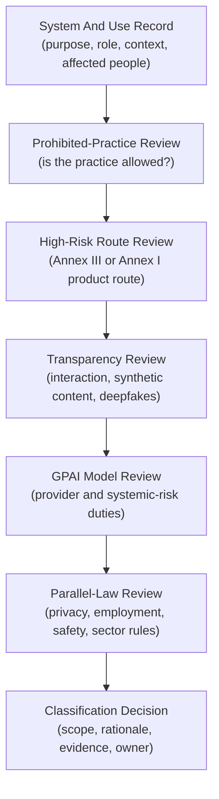
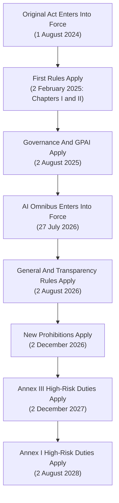
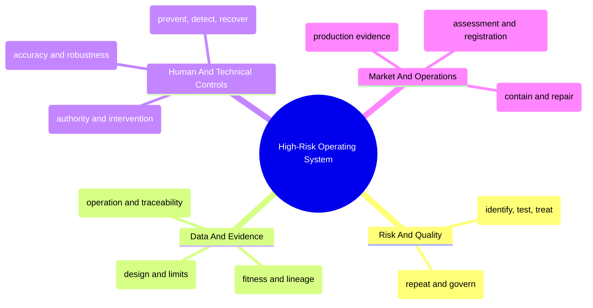
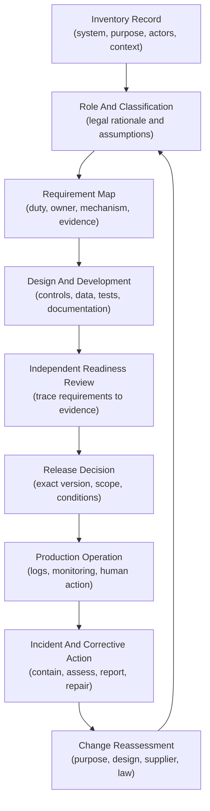
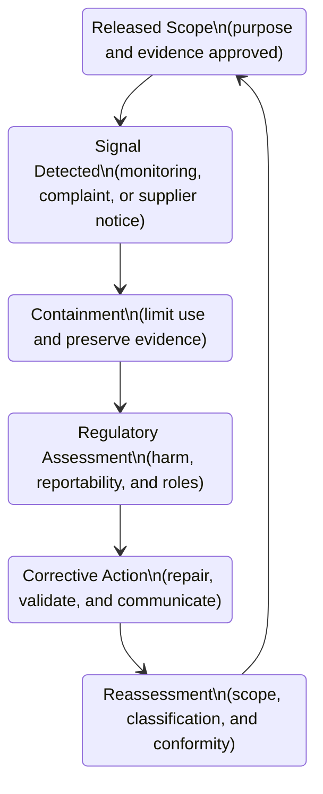

## Table of Contents

1. [What Operational Readiness Means](#what-operational-readiness-means)
2. [Define What The AI System Does And Who Is Responsible](#define-what-the-ai-system-does-and-who-is-responsible)
3. [How To Classify The AI System And Its Use](#how-to-classify-the-ai-system-and-its-use)
4. [Know When Each Rule Starts To Apply](#know-when-each-rule-starts-to-apply)
5. [How High-Risk Requirements Work In Practice](#how-high-risk-requirements-work-in-practice)
6. [How To Prove The Requirements Were Followed](#how-to-prove-the-requirements-were-followed)
7. [Which MLOps Tools Store And Check The Evidence](#which-mlops-tools-store-and-check-the-evidence)
8. [How The Rules Change For Different AI Systems](#how-the-rules-change-for-different-ai-systems)
9. [What To Do After Incidents, Supplier Changes, Or Major System Changes](#what-to-do-after-incidents-supplier-changes-or-major-system-changes)
10. [How To Track Legal Guidance And Changing Standards](#how-to-track-legal-guidance-and-changing-standards)
11. [How To Review The System Before Release](#how-to-review-the-system-before-release)
12. [The Main Idea](#the-main-idea)
13. [References](#references)

## What Operational Readiness Means
<!-- section-summary: Operational readiness connects a documented legal scope decision to controls, evidence, release authority, production monitoring, and corrective action. -->

At a high level, **EU AI Act operational readiness** means identifying the AI system an organization provides or uses. The organization must also record its legal role, determine which duties apply to that use, and preserve proof that the required work happened.

The proof matters to MLOps teams. A policy may say that a high-risk system requires human oversight. Production records must then show who received that authority, what the interface allowed them to do, how they were trained, and what happened during real decisions.

The EU AI Act is a risk-based regulation. Its requirements vary according to the AI system, its intended purpose, the people affected, and the operator's role in the supply chain. A general-purpose model can sit inside a customer-support assistant, a recruitment system, or a safety component in machinery. Those deployments can lead to very different legal and engineering work even though they call the same underlying model.

In practical terms, readiness has two connected parts:

- **Legal and compliance owners decide applicability.** They interpret the regulation, record the organization's role, classify the system and use, identify parallel laws, and approve the resulting requirement map.
- **Product and engineering teams implement the operating mechanisms.** They govern data, test the system, build human controls, preserve exact versions, collect production evidence, and respond to failures.

An experiment tracker, model registry, or data catalog can contribute technical evidence. An ISO certificate can provide evidence about defined management-system activities. None of them makes the legal decision. The organization still needs a traceable explanation from the applicable legal requirement to the control, the released system, and the evidence produced during operation.

This article provides educational operational guidance. Qualified legal or compliance professionals should own formal conclusions for a real system, market, and organization.

## Define What The AI System Does And Who Is Responsible
<!-- section-summary: Scope begins with the complete AI system, intended purpose, use context, affected people, and each operator's actual role. -->

Before the team can apply any rule, it needs to describe the real AI system and identify the organizations responsible for it. A model name says very little about that.

The production system includes the preprocessing, prompts, or features that shape the model input. Decision rules and user interfaces determine how people use the output. Human review, monitoring, and supplier components can also change the final result.

Consider a recruitment system that ranks applicants for a job. A software supplier develops the system and sells it under its own name. That supplier is likely acting as the **provider** of the system: the organization that develops it, or has it developed, and places it on the market or puts it into service under its name or trademark. The employer that uses the ranking is the **deployer** because it operates the system under its authority.

The supply chain can add two more roles. An EU business that first places a system bearing a non-EU supplier's name or trademark on the Union market can be an **importer**. A reseller that makes the system available in the EU supply chain can be a **distributor**. These roles carry their own checks and cooperation duties. Contracts help allocate work between organizations, while the actual development, branding, supply, and use determine the legal analysis.

The employer's role can also change. Rebranding the high-risk system, making a substantial modification, or changing a lower-risk system's intended purpose into a high-risk use can move provider responsibilities to another operator under Article 25. A procurement record that says "customer" or "vendor" is therefore too broad for the role decision.

### Write Down The Approved Use And Its Limits

The team needs a written statement of the decision the system may support, the people it may affect, and the conditions under which it may operate.

The Act calls this the **intended purpose**: the use specified by the provider. Its context and conditions appear in the instructions, technical documentation, and sales or promotional material. The statement identifies the user and affected population, the expected input conditions, the market, and the system's operating limits.

The recruitment example might state: "Rank applications for advertised software-engineering roles in the EU so trained recruiters can prioritize manual review." That statement is far more informative than "candidate model." It gives reviewers concrete questions:

- Does the ranking materially influence access to employment?
- Which applicants and countries are in scope?
- Which evidence can a recruiter inspect before acting?
- Can the system reject an applicant, or does it only order a review queue?
- What changes if a business unit reuses the score for promotion or termination?

The last reuse requires a fresh analysis because employment purpose and affected people changed. The same underlying model used for grammar suggestions in an internal document has a different system purpose and risk profile. Classification follows the system and use, while separate general-purpose AI duties may continue to apply to the provider of the underlying model.

An applicability record should preserve the facts that counsel or compliance used. At minimum, it needs a stable system identifier; system boundary; intended purpose; prohibited uses; markets; affected groups; provider, deployer, importer, and distributor candidates; supplier components; current release; legal sources; assumptions; decision owner; and reassessment triggers. The record links to live systems of record. It avoids duplicating every artifact in one document.

## How To Classify The AI System And Its Use
<!-- section-summary: Classification evaluates prohibited practices, both high-risk routes, transparency duties, general-purpose model duties, and lower-risk uses as separate questions. -->

Classification works best as a set of questions. A single label such as "regulated" hides the route, role, and controls behind the conclusion. The team needs to know why a category applies and which operator receives each duty.

For a beginner, the process is similar to routing a case through several specialists. The first review checks whether the proposed practice is prohibited. The next two reviews test the Annex III use-case route and the Annex I product-safety route. Separate reviews cover transparency and GPAI model responsibilities because they can apply alongside a system classification. Privacy, employment, consumer, product, and sector law remain parallel workstreams.

The final record keeps every conclusion together with its rationale, scope, assumptions, owner, and evidence. That structure prevents a system from receiving one vague risk label that nobody can translate into delivery work.



### Which AI Practices Are Prohibited

Article 5 prohibits specific practices whose risks the Act treats as unacceptable. The list includes defined forms of manipulative or exploitative AI, social scoring, several biometric and emotion-inference practices, and tightly constrained uses of real-time remote biometric identification. Regulation (EU) 2026/1744 added prohibitions concerning systems used to generate or manipulate specified non-consensual intimate material and child sexual abuse material, with the new provisions applying from 2 December 2026.

This review asks whether the proposed practice is legally permitted at all. A release gate, human reviewer, or risk acceptance cannot authorize a prohibited use. The team records the exact practice, the relevant legal text, factual assumptions, and the legal owner's conclusion. Product controls should also prevent a generally capable system from being configured for a prohibited purpose.

### High-Risk Systems Under Annex III And Article 6(2)

Annex III lists sensitive use areas such as biometrics, critical infrastructure, education, employment, access to essential services, law enforcement, migration, and administration of justice. A system still needs to match the detailed use-case wording and conditions. "Used by a school" or "used by HR" is too broad to establish the route.

For example, an AI system intended to rank candidates during recruitment can fall within the Annex III employment category. Article 6(3) contains a limited route for some Annex III systems that do not pose a significant risk and do not materially influence decision outcomes. Systems that profile natural persons remain high-risk under that provision. A provider relying on the Article 6(3) route must document the assessment, and registration requirements still need review under the amended framework. Counsel should assess the exact text and current Commission classification guidance.

### High-Risk Safety Components Under Annex I And Article 6(1)

The second high-risk route covers an AI system used as a safety component of a product, or an AI system that is itself a product, under listed EU product legislation, where the product must undergo the relevant third-party conformity assessment. A safety function is an intended purpose that prevents or mitigates risks to the health or safety of people or property under the amended definition.

An AI component that detects a dangerous condition and triggers a machinery stop may enter this route. A recommendation feature that improves production efficiency might sit outside the safety-function definition. The product manufacturer, sector rules, AI function, and conformity procedure all need to be considered together. Regulation (EU) 2026/1744 also introduced mechanisms to reduce duplicate requirements where Annex I product legislation provides equivalent or higher protection, subject to future delegated acts and their exact scope.

### Which Systems Need Transparency Disclosures

Article 50 applies to particular systems and outputs. Providers of systems intended to interact directly with people generally need the design to inform people that they are interacting with AI unless that fact is obvious in context. Providers of systems that generate synthetic audio, image, video, or text must support machine-readable marking in the situations covered by the article. Deployers have disclosure duties for specified emotion-recognition, biometric-categorization, deepfake, and public-interest-text uses.

These duties can apply to a system that is not high-risk. They can also apply alongside high-risk requirements. A public chatbot may therefore need a direct interaction notice even though it does not make a consequential decision.

### Responsibilities For General-Purpose AI Models

A **general-purpose AI model**, often shortened to **GPAI model**, is a model with significant generality that can perform a wide range of tasks and can be integrated into many downstream systems or applications. Chapter V assigns responsibilities to providers of those models, including technical documentation, information for downstream system providers, a copyright policy, and a public summary of training content. Additional obligations apply to GPAI models classified as presenting systemic risk.

The GPAI analysis and downstream system analysis run in parallel. An organization that calls a third-party GPAI model through an API usually needs supplier information for its downstream system assessment. GPAI-provider duties depend on the model activity, and integration may create provider responsibilities for the downstream AI system. Legal review should map the exact activity and release arrangement.

### Lower-Risk Systems

Many AI systems fall outside the prohibited, high-risk, and specified transparency categories. The AI Act does not impose the high-risk control framework on those systems. General provisions, AI literacy measures, voluntary codes, contractual duties, and other laws can still matter. Privacy, consumer protection, employment, intellectual-property, product-safety, and sector rules continue alongside the AI Act.

This category should still have an inventory record and reassessment triggers. A support assistant can later gain a new feature that recommends benefit eligibility or ranks job applicants. That purpose change can produce a new classification even though the model endpoint remains unchanged.

## Know When Each Rule Starts To Apply
<!-- section-summary: Entry into force makes a regulation law, while staged application dates identify the point at which specific duties govern operators. -->

**Entry into force** and **application** describe different legal events. Entry into force means the regulation is in force as law. An application date identifies the point at which particular provisions govern operators. The AI Act uses a staged schedule, so a single "AI Act deadline" is misleading.

The timeline matters because the operational plan changes by category. A public chatbot already needs to address the transparency rules that apply from 2 August 2026. The high-risk duty families in Chapter III Sections 1 through 3 follow later dates for Annex III and Annex I systems. Existing systems and new amendments can also carry their own transitions.

Teams should keep the binding date beside the classification decision. A project plan that stores dates without the legal route can apply an Annex I date to an Annex III system or overlook a duty that already governs a lower-risk system.



Regulation (EU) 2024/1689 entered into force on 1 August 2024. Chapters I and II began applying on 2 February 2025, covering general provisions, the original prohibited-practice rules, and AI literacy. The amended Article 4 requires providers and deployers to take measures that support AI literacy for staff and other people operating or using AI systems on their behalf. It does not require a guaranteed level for every individual.

Governance provisions and obligations for providers of GPAI models began applying on 2 August 2025. The Act's general application date was 2 August 2026, including Article 50 transparency rules, subject to specific exceptions and transitions. Providers of synthetic-content systems already placed on the market before that date have a separate transition to 2 December 2026 for Article 50(2).

Regulation (EU) 2026/1744, commonly described as the AI Omnibus or Digital Omnibus on AI, was published on 24 July 2026 and entered into force on 27 July 2026. It amended the high-risk schedule. Chapter III Sections 1, 2, and 3 apply from **2 December 2027** for systems classified as high-risk under Article 6(2) and Annex III. Those sections apply from **2 August 2028** for systems classified as high-risk under Article 6(1) and Annex I. The amending regulation also makes its new Article 5 prohibitions apply from 2 December 2026.

The deferred high-risk dates provide preparation time. Teams can settle system boundaries and obtain missing supplier evidence. They can then design and test controls, exercise incident procedures, and verify that a reviewer can reconstruct the evidence chain. Existing-system transition provisions, public-authority uses, significant design changes, and sector-specific rules need case-by-case legal review.

## How High-Risk Requirements Work In Practice
<!-- section-summary: Each high-risk duty needs an owner, a repeatable operating mechanism, release evidence, production evidence, and a defined response to failure. -->

High-risk obligations describe outcomes that providers and deployers must achieve. Engineering needs a second translation: what recurring process produces the outcome, who operates it, what evidence it creates, and what happens if a control fails.

Provider and deployer mechanisms are connected. The provider designs the system, establishes its high-risk controls, supplies instructions, and completes the applicable market-facing steps. The deployer uses the system within those instructions, assigns competent oversight, monitors local operation, and handles the logs and input data under its control. A requirement map should name both sides because the supplier rarely owns every control.

The diagram groups the duties by the operational system they create. The sections that follow explain each group, the evidence it should produce, and a concrete production scenario.



### Risk Management And Quality Management

Article 9 requires a continuous risk-management system for high-risk AI. The provider identifies known and reasonably foreseeable risks to health, safety, and fundamental rights; estimates and evaluates those risks; introduces controls; tests the controls; and evaluates residual risk. The process continues across the lifecycle because production evidence can reveal harms that development testing missed.

For a recruitment-ranking system, the risk register might cover qualified applicants being systematically deprioritized, automation bias among recruiters, inaccessible appeal routes, data poisoning, and a system outage that causes applications to disappear from review. Each risk needs a measure that can be tested. Segmented ranking evaluation, minimum manual-review coverage, interface warnings, access controls, and a queue-reconciliation job address different failure paths.

Article 17's **quality management system** gives this work a repeatable organizational home. It governs design, development, verification, and data management. It also covers system changes, suppliers, documentation, post-market monitoring, incident handling, and corrective action. Risk management asks what could harm people and how that risk is controlled; quality management makes that work consistent across releases and teams.

The provider should be able to show a versioned risk decision, test results, unresolved residual risks, accountable approval, and links to the exact release. A generic enterprise risk policy cannot replace system-level evidence.

### How Training And Test Data Are Governed

Article 10 addresses training, validation, and test data used by high-risk systems. The data-governance process records where the data came from, how it was collected and prepared, and how labels were produced. It also examines the assumptions, relevance, representativeness, errors, completeness, statistical properties, and possible bias in view of the intended purpose. The relevant geographic, behavioral, functional, or contextual setting also matters.

For the recruitment example, an overall accuracy score hides whether historical labels encode previous hiring bias or whether some role families have almost no positive examples. The data review should describe label meaning, selection effects, missingness, duplicate applicants, language coverage, role and location segments, and the time period represented. A data-quality gate can verify schema, null bounds, allowed values, and join coverage. Qualified reviewers still need to decide whether the dataset is fit for the stated hiring purpose.

The evidence chain should connect a governed dataset version to its sources, transformations, validation results, and approved use. A warehouse snapshot, Delta or Iceberg table version, or immutable manifest can provide technical identity. OpenLineage or platform-native lineage can describe how upstream datasets and jobs produced it. Those records support the legal and risk assessment; they do not decide whether data quality is legally sufficient.

### Technical Documentation, Instructions, And Logs

Technical documentation explains the system before it reaches the market or service. Annex IV and Article 11 cover the intended purpose, design, development process, and data. The documentation also records evaluation, capabilities, limitations, risk controls, system changes, and lifecycle arrangements. A reviewer should be able to connect that description to real code, data, model, configuration, and tests.

Instructions for use translate provider knowledge into safe deployer operation. They should explain the intended purpose, expected inputs, and declared performance. They also cover known limitations, foreseeable risky conditions, output interpretation, human oversight, maintenance, and logging capabilities.

For a ranking system, "use human judgment" provides little operational direction. The recruiter needs to know which evidence to inspect and what the score means. The instructions should also explain what the score omits, how to override it, and which cases require escalation.

Automatic logs support traceability during operation. A decision event may need the system and model version, timestamp, case identifier, and output. It can also record the relevant configuration, human action, override or escalation, and error state.

Logging should minimize personal data and keep sensitive source data in governed systems under appropriate access and retention controls. Provider and deployer retention duties depend on control of the logs and applicable law; Article 19 and Article 26 establish at least six months for covered high-risk logs unless another applicable Union or national rule provides otherwise.

The logging design also needs a failure path. If event delivery stops, the system should detect the gap, preserve local evidence where appropriate, and follow a policy for pausing or limiting consequential decisions. A dashboard showing healthy model latency cannot prove that required decision logs arrived.

### Human Oversight

Article 14 requires high-risk systems to support effective oversight by people. Article 26 requires deployers to assign oversight to people with the necessary competence, training, authority, and support. The control is therefore larger than placing a person near the workflow.

In the recruitment example, the reviewer needs enough information to interpret a ranking and recognize the system's limits. They also need to detect anomalies, resist automation bias, disregard or reverse the output, and stop or escalate the process.

The interface should show the job criteria and relevant source evidence. A mysterious score cannot support informed oversight. The operating policy should define which decisions the system may influence, who can override it, which reasons are recorded, and who investigates repeated disagreement.

Training evidence should cover the current system version and the person's actual responsibility. An access-control rule can restrict production use to trained reviewers. A usability exercise can test whether reviewers notice stale inputs, interpret the output correctly, and use the escalation route. Override rate alone is ambiguous: a low rate might show high agreement, excessive trust, or an interface that discourages intervention.

### Accuracy, Robustness, And Cybersecurity

Article 15 groups three connected properties. **Accuracy** asks whether the system reaches the declared performance appropriate to its intended purpose. **Robustness** asks whether it continues to behave acceptably under errors, faults, inconsistent inputs, and changes in its environment. **Cybersecurity** asks whether the system resists unauthorized attempts to alter its use, outputs, or performance.

The provider should choose metrics and thresholds before the release decision. For ranking, evaluation may include ordering quality, selection rates, error analysis, and relevant segments. Robustness tests can cover missing fields, unseen job families, upstream schema changes, dependency failure, and feedback loops. Security work should consider data poisoning, model poisoning, adversarial or evasive inputs, model extraction, credential abuse, artifact tampering, and vulnerable dependencies.

The resulting evidence includes declared metrics, test populations, thresholds, failures, mitigations, residual limitations, and monitoring thresholds. A model that passes its average metric can still fail the release if a safety, security, or fundamental-rights control remains ineffective.

### What Providers And Deployers Must Assess And Register Before Release

Providers of high-risk systems need the applicable conformity-assessment procedure before placing the system on the market or putting it into service. The route depends on the system and product law. It can involve internal control, a notified body, or the conformity procedure under Annex I product legislation. The provider may also need an EU declaration of conformity, CE marking, and registration. Legal and product-compliance owners should map Article 43 and the relevant sector legislation for the exact system.

Registration duties also vary. Providers of covered Annex III systems and specified public-authority deployers have EU database obligations, with special arrangements for some sensitive domains. A release workflow should preserve the registration identifier or the documented reason a registration route does not apply.

Article 27 requires a **fundamental rights impact assessment**, or FRIA, for specified deployers and Annex III uses. It covers certain bodies governed by public law, private entities providing public services, and specified creditworthiness and insurance uses.

The assessment describes the process, its duration and frequency, and the affected groups. It then records risks of harm, human oversight, governance, complaint mechanisms, and responses if risks materialize. It complements a data-protection impact assessment where both apply. A private employer should not assume Article 27 applies merely because its system is Annex III; the deployer and use conditions need review.

### Monitoring, Incidents, And Corrective Action

Provider responsibility continues into production. Article 72 requires a post-market monitoring system based on a plan that forms part of the technical documentation. Regulation (EU) 2026/1744 removed the requirement for a harmonized plan template and requires Commission guidance, including a template, by 2 September 2027. The provider still needs a plan tailored to the system.

Monitoring should connect technical behavior to the risks in the risk-management file. A recruitment system may track service failures, input drift, missing decision logs, and security alerts. It can examine selection and override patterns, segment outcomes, complaints, and deviations from instructions on a different schedule. The monitoring plan should account for delayed outcomes and low-volume groups because some results arrive much later.

Deployers monitor operation according to the instructions. If a deployer has reason to consider that use presents a covered risk, Article 26 requires notification and suspension steps. Serious incidents require provider and authority workflows under the applicable provisions.

Providers need procedures to investigate non-conformity and contain harm. The next steps correct the system, notify the relevant parties, and preserve evidence.

## How To Prove The Requirements Were Followed
<!-- section-summary: The lifecycle carries the classification decision into design, release, operation, incident response, and reassessment after change. -->

A team needs to prove that the requirements were followed for the exact system released to production. That proof starts before training. The inventory record establishes the system boundary and intended purpose. Role and classification decisions determine which requirements enter the control map. Development then produces records against that map, and the release decision connects those records to exact artifacts and operating conditions.

Think of the chain as a set of linked receipts. The classification record explains why a duty applies. A control record shows how the team implemented that duty. Test and review artifacts show what happened for a specific release. Production records show which release actually handled a decision. If one link points to a mutable alias or an unrelated dataset, the organization cannot reconstruct the approved system.

The lifecycle below also includes a return path. Incidents, supplier changes, new purposes, and legal changes send the system back through role and classification review before the next release decision.



The requirement map is the bridge between law and engineering. Each row or object should identify the legal requirement and interpretation, responsible operator, control owner, implementation, evidence source, release condition, monitoring signal, failure response, and review status. Legal owners approve the interpretation. Control owners prove the mechanism works.

Development evidence should be generated near the activity that creates it. The data pipeline emits a validation result for a specific dataset version. The evaluation job records metrics, segments, test definitions, code commit, and model digest. Security workflows store the threat model, dependency and artifact checks, and unresolved findings. Human-oversight testing records interface version, participants, tasks, errors, and corrective changes.

An independent readiness review follows a sample from requirement to control and from production artifact back to source. Independence can come from a model-risk, product-assurance, security, quality, or compliance function with sufficient competence and authority. The reviewer should be able to reject a release or impose tightly scoped conditions.

The release record binds the decision to immutable identities. A compact evidence contract might look like this:

```yaml
system_id: recruitment-ranking-eu
release_id: recruitment-ranking-42
artifact_digest: sha256:57e358274a8f0b727bd63030e3a405c54b0120c5065f78f9a170a5f765443b1c
dataset_version: hiring_features@approved-snapshot-1842
intended_purpose_version: purpose-7
classification_decision: legal/decisions/eu-ai-act-12
evidence_bundle_digest: sha256:1c7b8e4f31d6d43014d46c3f8ab57b7c9ed8164c9ae4f8d0d2e2b122f2e08fd4
readiness_decision: approved
approved_scope: eu-recruiter-assisted-ranking
rollback_release: recruitment-ranking-39
```

The CI/CD gate validates presence, signatures or digests, approval state, artifact identity, and scope. It should reject a release whose evidence belongs to another model or dataset. It cannot determine whether a legal interpretation is correct; that decision comes from the authorized record referenced by `classification_decision`.

Production evidence completes the chain. Decision logs identify the deployed release, monitoring points to the same system and route, complaints connect to affected decisions, and incidents preserve the versions and controls involved. A later reviewer can therefore answer what was approved, what actually ran, how people used it, and how the organization responded to failure.

## Which MLOps Tools Store And Check The Evidence
<!-- section-summary: Current MLOps platforms can capture identity, lineage, tests, telemetry, approvals, and retention while accountable owners make legal and risk decisions. -->

Production teams usually store this evidence across several systems. A governance inventory may own the legal decision, a data catalog may own dataset history, and a model registry may own trained model versions. The important design decision is which system owns each fact and how immutable identifiers connect them.

### How To Record Systems, Data, And Their History

A governed catalog or GRC inventory can own the stable AI-system record, intended-purpose versions, operator roles, legal decisions, markets, owners, and review triggers. Data catalogs such as Unity Catalog, cloud-native catalogs, or enterprise metadata platforms can own datasets, permissions, and lineage. OpenLineage offers a standard event model for connecting jobs, runs, and datasets across compatible tools.

The catalog structure should separate the AI system from individual model versions. One recruitment system can use a ranking model, a language detector, and a document parser. The system record describes the decision and controls; registry records describe the exact artifacts.

### How To Record Training Runs And Model Versions

MLflow or a managed cloud registry can retain model identity, source run, parameters, metrics, signatures, artifacts, tags, and aliases. A release workflow can attach an approval identifier and evidence-bundle digest to a model version. Deployment should still resolve to an immutable version or digest so an alias change cannot silently alter the released evidence chain.

The registry contains technical evidence about the model. The legal role, system classification, FRIA, conformity route, and organizational approval belong in governed decision records linked from the registry. Access controls should prevent a model author from approving their own legal or independent-assurance decision.

### Data Quality And Evaluation

dbt tests, Great Expectations, Soda, Deequ, or platform-native expectations can verify schema, allowed values, missingness, freshness, duplicates, and statistical conditions. Spark, Polars, or warehouse SQL can produce segment and bias analyses. The release gate should store the result, expectation-suite version, data version, and executing code version.

Automated checks cover measurable contracts. Reviewers still need context about label meaning, historical selection, and the affected groups. They must also examine proxy variables, representativeness, and residual limitations. Failed checks should produce a blocking result or a formally governed exception with a defined scope, owner, expiry, and compensating control.

### How Release Pipelines Check And Record An Approved Model

GitHub Actions, GitLab CI, Jenkins, or managed ML pipelines can assemble the evidence bundle and enforce release conditions. The pipeline should pull approved records through authenticated APIs, verify artifact digests, and write the final release record to append-only or object-locked storage. Cloud object-retention features can support immutability, provided retention, deletion, legal-hold, access, and recovery policies are configured correctly.

Promotion across development, validation, and production should preserve evidence identity. Rebuilding the same source can create a different binary or container digest. Mature teams promote verified artifacts or reproduce them under a controlled build process and run the required checks again.

### How Production Monitoring Connects To Incident Response

OpenTelemetry provides vendor-neutral APIs, SDKs, and a collector for traces, metrics, and logs. It can correlate a prediction request with the serving route and model version. The same trace can identify downstream calls and operational events. Application decision records may need a separate governed schema because general traces often have shorter retention and wider operational access.

OpenTelemetry attributes should contain approved identifiers and low-risk operational context. Raw prompts, full feature vectors, identity documents, and unrestricted personal data require separate legal, privacy, access, and retention decisions. Trace identifiers can link telemetry to a restricted decision record without duplicating its sensitive payload.

PagerDuty or equivalent paging, plus ServiceNow, Jira, or another governed case system, can coordinate incident ownership and corrective actions. The incident record should link to immutable release and evidence identifiers. Screenshots from transient dashboards can disappear and rarely prove artifact identity.

## How The Rules Change For Different AI Systems
<!-- section-summary: A recruitment ranking and a support chatbot show how intended purpose changes the legal route and the required operating evidence. -->

The following scenarios use a shared underlying language-model capability in two different systems. The recruitment system materially influences access to employment. The support chatbot answers routine service questions. Comparing them shows why classification follows the whole system and its intended purpose. It also shows that a lower-risk system can still carry transparency and other legal duties.

### Annex III Recruitment Ranking

An employer uses an AI system to rank applicants for available roles. The ranking determines which applications recruiters review first and materially influences access to employment. That intended purpose points toward the Annex III employment route under Article 6(2), subject to formal legal classification.

The provider prepares the high-risk system requirements: risk management, governed data, technical documentation, logging capability, deployer instructions, human-oversight design, accuracy and robustness testing, cybersecurity, quality management, and the applicable conformity and registration work. The employer, as deployer, assigns trained and authorized reviewers, controls input quality within its responsibility, follows the instructions, monitors operation, retains controlled logs, informs applicants that a high-risk AI system assists the decision, and reports risk or incident signals through the required route. Separate worker-information duties apply to covered workplace uses. Article 27's FRIA scope still depends on the deployer's legal status and exact use.

In production, a recruiter opens an applicant record and sees the ranking together with the job criteria, source information, model limitations, and an escalation control. The decision event records the system release, case identifier, output, recruiter action, override reason, and timestamp. Monitoring compares review and selection patterns across relevant groups, checks missing-event rates, and joins later hiring outcomes according to a governed schedule.

Suppose the language model inside this system also powers grammar suggestions for employees writing internal messages. That second system does not influence recruitment decisions and is unlikely to enter the Annex III employment route on that purpose alone. It still needs inventory, security, privacy, supplier, and possible GPAI analysis. The system purpose and use context create the distinction; the shared model endpoint does not remove it.

### Customer-Support Chatbot With Transparency Duties

A website chatbot answers questions about opening hours, order status, and return procedures. It does not make eligibility, employment, credit, insurance, medical, or public-service decisions. This use is usually outside the high-risk routes described above, assuming the real behavior matches that limited purpose.

Article 50 can still require the provider to design the interaction so people know they are dealing with AI unless that fact is obvious in context. The operational work starts with a visible and accessible disclosure and a versioned interaction design. Evaluation checks the permitted knowledge sources and the handoff to a person. Security controls and service logs follow the applicable privacy policy. If the chatbot generates public-interest text or synthetic media, the team reviews the separate marking and disclosure provisions.

The release evidence is smaller than the recruitment system's high-risk dossier because the high-risk duty family does not apply to this purpose. It still records the system boundary, role, classification rationale, transparency decision, model and prompt versions, evaluation, disclosure version, supplier, monitoring, and incident owner.

A later feature that recommends whether a person qualifies for an essential public service changes the purpose and potential impact. The inventory trigger reopens classification before that feature reaches production. A UI update alone may look small to engineering while changing the legal use substantially.

## What To Do After Incidents, Supplier Changes, Or Major System Changes
<!-- section-summary: Operations must contain harm, preserve evidence, complete reporting assessments, implement corrective action, and reopen scope after significant change. -->

A production incident can begin as a technical symptom: a sudden drop in ranking coverage, a corrupted feature, an unavailable human-review screen, or evidence that a supplier model changed behavior. The incident process should quickly connect that symptom to affected people, system versions, regulatory duties, and safe operating options.

For example, an upstream parser starts dropping employment history from one document format. The ranking service remains available and continues returning valid responses, so ordinary uptime monitoring stays green. Coverage checks, recruiter complaints, or segment monitoring reveal the problem.

The team stops the affected route and identifies decisions made with incomplete data. It preserves the relevant releases and logs, then involves legal and risk owners in the incident assessment.

The state diagram shows the recurring operational path from detection through containment, regulatory assessment, corrective action, and scope reassessment.



Containment may suspend the system, restrict it to advisory use, or route cases to manual processing. The team may also roll back an artifact or block a supplier endpoint. The runbook should state who has that authority and how the team avoids losing required evidence.

Product, legal, privacy, security, and risk owners then assess harm and non-conformity. They also decide whether serious-incident reporting, affected-person communication, or another legal duty applies.

Corrective action addresses the cause and the control failure. A bad data join may require a pipeline repair and backfill, followed by a review of affected decisions. A new reconciliation check, documentation update, and monitoring threshold reduce the chance of recurrence. Restoring the service without those changes would leave the same evidence gap in place.

### Material Modification And Purpose Change

The Act defines **substantial modification** as an unplanned or unforeseen change after placement on the market or putting into service that affects compliance with high-risk requirements or changes the assessed intended purpose. Article 25 can assign provider responsibilities to another operator if it substantially modifies a high-risk system or changes a previously non-high-risk system's intended purpose into a high-risk use.

Engineering change size is therefore a poor legal proxy. Replacing a model with the same API can alter accuracy, robustness, cybersecurity, human interpretation, and data requirements. Adding an automatic-rejection threshold can change a review aid into a decision mechanism. Reusing a support model for recruitment can change the legal route even if the code diff is small.

The change process first compares the proposed release with the approved purpose, system boundary, supplier set, and model behavior. It then examines changes to data, users, affected groups, the interface, human oversight, and monitoring.

Legal and compliance owners decide whether the change requires a new classification or provider-role analysis. They also determine whether conformity work, registration, the FRIA, or the instructions need an update.

### Supplier Changes

Supplier contracts and technical integrations should provide the information and access needed for the system provider and deployer to meet their duties. Relevant terms can cover the intended purpose, model or service changes, documentation, evaluation, security notifications, and incident cooperation. Other terms govern audit evidence, data handling, subcontractors, end-of-service support, and transition assistance.

A supplier notice should create a governed change event. The team identifies affected systems, compares documentation and behavior, reruns required evaluation, updates the evidence bundle, and obtains the necessary approvals before promotion. Silent adoption of a provider's "latest" model breaks the link between assessed behavior and production behavior.

## How To Track Legal Guidance And Changing Standards
<!-- section-summary: A controlled interpretation record distinguishes binding law from guidance and standards, preserves assumptions, and triggers review as authoritative material changes. -->

EU AI Act implementation draws on several kinds of source, and they do not carry the same legal effect. This distinction matters during design reviews. A regulation provision can create a binding duty. A Commission FAQ can explain the institution's current view. A draft standard can suggest a technical method that is still changing. Putting all three into a field called "requirement" hides who issued the source, its legal effect, and whether the cited version remains current.

The source register should therefore capture the instrument type, issuer, version, legal status, covered requirement, and review owner. Legal and compliance teams decide how each source affects the system. Engineers receive a concrete control change through normal governance.

The regulation and its amendments are binding law. Delegated and implementing acts can add or specify legally relevant detail within powers granted by the regulation. Official Commission and AI Office guidelines, FAQs, compliance tools, and codes can help teams interpret and implement duties. Their legal effect depends on the instrument; guidance and FAQs are generally non-binding, and voluntary codes should be described as voluntary unless an applicable legal mechanism says otherwise.

Harmonized standards provide technical methods for covered requirements. A standard gains the AI Act's presumption-of-conformity effect for the requirements it covers only through the relevant Official Journal reference. Standards remain voluntary, and teams may demonstrate compliance through other adequate means. The Commission reports that high-risk AI standards are still under development. A draft standard, an ISO management-system certificate, or an internal mapping can guide control design without establishing full EU AI Act compliance.

Common specifications are another legal mechanism under Article 41. Their status and scope should be verified from the applicable implementing act. Teams should avoid treating ordinary industry practices, draft standards, harmonized standards, and common specifications as interchangeable labels.

The interpretation record should preserve:

- the legal question and decision owner;
- the system, role, intended purpose, market, and release in scope;
- binding provisions and amendments considered;
- non-binding guidance or codes used to support interpretation;
- standards and common specifications, including their publication and citation status;
- factual and technical assumptions;
- unresolved questions and conservative controls;
- scheduled and event-driven review triggers.

Change monitoring should cover EUR-Lex, the Commission's current AI Act timeline and FAQ, AI Office guidance and codes, relevant Official Journal references, and national competent-authority material. Supplier, purpose, product-law, data, model, and market changes should trigger the same workflow. The legal owner decides whether a source changes the requirement map; engineering then updates controls and evidence through normal change management.

## How To Review The System Before Release
<!-- section-summary: The readiness review traces applicable duties through real controls and exact release evidence, then records an authorized release decision and unresolved conditions. -->

A readiness review should test the evidence chain. Document count does not show whether a control operates. Start with several applicable duties and trace them forward.

For human oversight, inspect the legal mapping, interface design, instructions, training records, and access rules. Then check a usability exercise, the production event schema, and an escalation test. For data governance, inspect source lineage and dataset identity before checking validation, segment analysis, exceptions, and approval. For corrective action, follow an exercise or real incident from detection through containment, assessment, repair, validation, and updated documentation.

Then trace backward from the proposed production release. Confirm that its model, code, container, dataset, purpose, supplier versions, and configuration match the evidence bundle. Verify that the release route can produce required logs, monitoring uses the correct identifiers, rollback remains available, and on-call teams know the escalation path.

The review should also test responsibility boundaries. Provider evidence must reach the deployer in a form that supports safe use. Deployer procedures must match the provider's instructions and the local process. Importer and distributor checks must point to the current system and documentation. Third-party contracts must support information sharing and incident cooperation in practice.

The final decision records approval, rejection, or a tightly scoped conditional decision. Any condition needs an accountable owner, due date, affected market or route, compensating control, expiration, and automatic escalation. Legal prohibitions and mandatory pre-market requirements cannot be waived through an internal risk acceptance.

An independent reviewer should be able to answer five concrete questions:

1. Which system, intended purpose, role, and market did the organization assess?
2. Which legal route and current application date support the requirement map?
3. Which controls operate for the exact release, and what evidence proves their operation?
4. Which people can stop, override, investigate, and correct the system?
5. Which changes or signals reopen classification and readiness review?

If the evidence cannot answer those questions, the release decision has an unresolved traceability gap.

## The Main Idea
<!-- section-summary: EU AI Act readiness is a living evidence chain from system purpose and legal role to controls, release, operation, and reassessment. -->

EU AI Act readiness starts with the complete system, its intended purpose, each operator's role, and the people affected. That foundation leads to separate reviews for prohibited practices, the two high-risk routes, transparency duties, GPAI responsibilities, and parallel law.

For high-risk systems, legal requirements map to operating mechanisms: continuous risk management, governed data, technical documentation, logs, deployer instructions, human oversight, declared performance, robustness, cybersecurity, quality management, conformity work, monitoring, incident response, and corrective action. Current MLOps tools can preserve identity, lineage, tests, telemetry, approvals, and retention. Accountable legal, compliance, product, and risk owners remain responsible for interpretation and release authority.

The organization should be able to move in both directions through the evidence chain. A reviewer can start with a legal duty and find its control in production. An incident responder can start with an affected decision and recover the released system, evidence, owner, and corrective-action path. That traceability creates an operational capability. A one-time documentation project cannot preserve the chain through releases, incidents, and legal change.

## References

### Binding EU Law

- [Regulation (EU) 2024/1689 — Artificial Intelligence Act](https://eur-lex.europa.eu/legal-content/EN/TXT/?uri=CELEX:32024R1689)
- [Regulation (EU) 2026/1744 — Digital Omnibus on AI amendments](https://eur-lex.europa.eu/legal-content/EN/TXT/?uri=CELEX:32026R1744)

### Official Implementation Guidance And Current Status

- [European Commission — AI Act policy framework and application timeline](https://digital-strategy.ec.europa.eu/en/policies/regulatory-framework-ai)
- [European Commission — Navigating the AI Act FAQ](https://digital-strategy.ec.europa.eu/en/faqs/navigating-ai-act)
- [European Commission — Guidance for providers and deployers of high-risk systems](https://digital-strategy.ec.europa.eu/en/policies/guidelines-ai-high-risk-systems)
- [European Commission — General-Purpose AI Code of Practice](https://digital-strategy.ec.europa.eu/en/policies/contents-code-gpai)
- [European Commission — Code of Practice on marking and labelling AI-generated content](https://digital-strategy.ec.europa.eu/en/news/commission-publishes-code-practice-marking-and-labelling-ai-generated-content)
- [European Commission — Standardisation of the AI Act](https://digital-strategy.ec.europa.eu/en/policies/ai-act-standardisation)

### Technical Implementation References

- [MLflow — Model Registry workflows](https://mlflow.org/docs/latest/ml/model-registry/workflow/)
- [OpenLineage — API documentation](https://openlineage.io/apidocs/openapi/)
- [OpenTelemetry — Documentation](https://opentelemetry.io/docs/)
