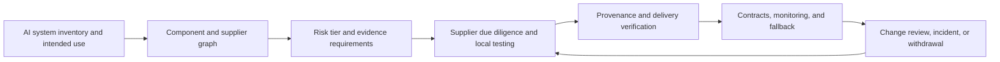
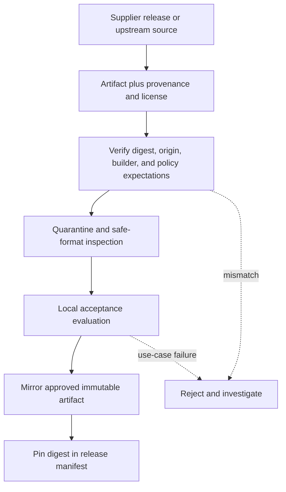

## What Third-Party AI Risk Means
<!-- section-summary: Third-party AI risk management controls external components that can change system behavior, data exposure, availability, security, compliance, or customer impact. -->

**Third-party AI risk management** applies risk controls to external models, datasets, APIs, packages, containers, infrastructure, and managed services used by an AI system. The organization using the component still owns the decision to place it inside a product and the effects of that use.

This article continues the **MarketHarbor** seller payout scenario. Its inventory entry already identifies the affected sellers, owners, risk tier, model version, review interface, and impact assessment. The system also uses a device-reputation API, an open text-embedding model, a managed feature store, container images, and Python packages. Those dependencies can change accuracy, privacy, security, latency, fallback behavior, and the team's ability to explain or withdraw the system.

The workflow is: map components, tier their risk, collect supplier evidence, test the exact component, verify provenance during delivery, create usable contract and exit requirements, monitor changes and outcomes, then exercise fallback and withdrawal.



The supplier relationship continues after procurement. The organization verifies the delivered component, monitors how it behaves inside the local system, and keeps a tested way to reduce or remove its influence.

## Map The Component And Supplier Graph
<!-- section-summary: A component graph records exact external dependencies, suppliers, data flows, versions, evidence, owners, and fallbacks under one AI system ID. -->

MarketHarbor links technical components underneath `ai-system-seller-payout-risk-003`:

```yaml
components:
  - id: device-signal-api
    type: external_api
    supplier: Device Signal Co
    contract_version: api-v4
    data_sent: [ip_address, device_id_hash, event_timestamp]
    output: device_risk_score
    fallback: rules_without_device_signal
  - id: open-embed-small-v3
    type: third_party_model
    source: approved-model-mirror
    revision: 8ac41f2
    digest: sha256:771a...
    license: apache-2.0
    purpose: encode seller message text
  - id: seller-risk-service
    type: internal_container
    digest: sha256:9b4d...
    sbom: evidence://seller-risk-service.cdx.json
  - id: feature-store
    type: managed_service
    supplier: cloud-provider
    region: eu-west
```

The graph records fourth parties when they matter, including a vendor's model host, infrastructure provider, or upstream data supplier. It identifies data leaving MarketHarbor, outputs received, service regions, versions, licenses, security evidence, fallback, and owner.

Software Bills of Materials such as CycloneDX can describe packages and containers. Model, dataset, API, evaluation, and use-case facts need linked manifests because no single widely adopted artifact represents every AI supply-chain fact. Shared digests and inventory IDs connect those records.

The graph should also show control flow and data flow. A package used only during offline report generation carries different risk from a package imported by a production service. A model downloaded during every startup creates a supplier availability and integrity dependency. The same model mirrored into controlled storage creates a different path with local verification and rollback.

Ownership follows the graph. Procurement and legal own supplier terms. Security owns vulnerability and integrity controls. Privacy owns external data processing and deletion evidence. The ML or platform team owns acceptance tests, runtime integration, and version monitoring. Product and risk owners decide whether residual dependency risk fits the intended use.

## Tier Components By Their Role
<!-- section-summary: Due-diligence depth follows a component's effect on decisions, access to sensitive data, privilege, opacity, substitutability, and failure impact. -->

A formatting library receives normal software review. The device API receives deeper review because it processes customer-linked signals and changes payout risk. The embedding model needs license, provenance, security, privacy, language, robustness, and resource testing because it processes seller messages inside the scoring path.

MarketHarbor scores each component against practical questions:

| Factor | Review question |
| --- | --- |
| Decision influence | Can this component change a hold, ranking, or customer outcome? |
| Data access | Which personal, confidential, or regulated data reaches it? |
| Privilege | Can it read storage, execute code, call tools, or change production? |
| Change control | Can the supplier change behavior without a pinned version? |
| Opacity | Can the team inspect behavior, limits, logs, and provenance? |
| Substitutability | How quickly can the system disable or replace it? |
| Failure impact | What happens to customers and operations when it fails? |

The tier determines required evidence, test depth, approval authority, monitoring, contract clauses, and fallback exercise frequency.

## Perform Evidence-Based Due Diligence
<!-- section-summary: Supplier review asks for evidence about the exact service and use, then combines supplier claims with the organization's own tests. -->

MarketHarbor asks which exact model, dataset, service, and version it will use; who develops and operates it; which data leaves the company; where data is processed and retained; how changes and incidents are communicated; which evaluations cover relevant languages and regions; which licenses and use restrictions apply; which logs can be exported; and how the component can be disabled or replaced.

Evidence receives an owner and expiry date. A three-year-old security report should not remain current forever. Supplier model cards and benchmark reports provide useful input, while MarketHarbor tests its own use. It measures the device API's missing-response behavior, regional score shifts, latency, timeouts, and shared-network cases. It evaluates the embedding model on approved languages, long messages, malformed inputs, resource limits, and known adversarial strings.

The review decision can approve, approve with conditions, request remediation, select another component, or reject the dependency. Conditions join the same action tracker as internal control gaps.

## Separate Supplier Claims From Local Assurance
<!-- section-summary: Supplier documentation explains the component, while local assurance tests whether the exact version and configuration support the organization's own use. -->

A supplier can describe training approach, benchmark results, security program, privacy controls, service regions, limitations, and incident process. These claims help the team understand the component and select tests. They cannot prove performance for local data, product thresholds, affected groups, traffic, or human workflow.

The assurance record should mark each item as supplier-provided, independently verified, locally tested, contractually required, or still unknown. A model card may state supported languages. The organization still evaluates its approved languages and document formats. A penetration-test summary can support security review, while runtime permissions and data flows still need local validation.

Unknown information affects the risk decision. A supplier may withhold training-data detail or offer only a mutable API without version pinning. The organization can require narrower use, stronger monitoring, human review, data minimization, a conservative fallback, or another supplier. Opacity should remain visible instead of being converted into a passing checkbox.

Evidence expiry follows the subject. A service-organization report can have an annual period. A model evaluation should match the current version. A subprocessor list can change sooner. The inventory stores dates and review triggers so an old document cannot silently authorize a changed component.

Local testing should cover the component in context. A device signal receives missing values, shared networks, regional traffic, delayed responses, malformed outputs, and supplier outages. A text model receives approved languages, long inputs, empty inputs, adversarial strings, resource stress, and privacy probes. Tests also include the surrounding policy because a safe output range depends on what the product does with it.

## Verify Provenance During Delivery
<!-- section-summary: Delivery verifies the exact artifact, origin, integrity, license, safe loading policy, evaluation result, and approval before deployment. -->

**Provenance** records where an artifact came from and how it was produced. A digest identifies bytes. A signature or attestation can connect those bytes to a build identity. These controls support integrity and traceability. Evaluation, privacy, safety, and legal suitability still need separate evidence.

MarketHarbor mirrors approved third-party model files into controlled storage. The intake job verifies revision, digest, signature when available, license, malware scan, serialization format, and acceptance evaluation:

```bash
sha256sum --check open-embed-small-v3.sha256
python -m model_intake.inspect_safe_format model.safetensors
python -m model_intake.check_license manifest.json policy/allowed-licenses.yml
python -m model_intake.run_acceptance_eval \
  --model ./model.safetensors \
  --suite evals/seller-messages-v5.yml \
  --output evidence/acceptance-eval.json
jq -e '.release_decision == "passed"' evidence/acceptance-eval.json
```

The production manifest pins the model digest, container digest, dependency lock, API contract version, feature definitions, and evaluation packet. Admission policy rejects unapproved digests. Runtime telemetry exposes component versions without logging sensitive content.

NIST SP 800-218A extends the Secure Software Development Framework with practices for generative AI and dual-use foundation models. Traditional SSDF controls remain relevant for predictive ML software, pipelines, containers, and dependencies.

SLSA 1.2 describes source and build tracks plus provenance and verification concepts for software supply chains. Build provenance can tell a consumer which builder produced an artifact from which inputs. Verification compares that provenance with expected builder, source, build type, and parameters. These controls strengthen origin and integrity, while model quality, data suitability, licensing, privacy, and product risk still need their own reviews.



Quarantine keeps untrusted files away from privileged production loaders. Safe serialization formats reduce executable deserialization paths, though the surrounding libraries and conversion tools still require security review. The mirror gives release automation a controlled source and preserves an exact version after an upstream repository changes or disappears.

## Turn Supplier Requirements Into Operations
<!-- section-summary: Contracts and internal service agreements need testable change, evidence, security, continuity, incident, data, and exit requirements. -->

Procurement and legal owners translate the risk decision into agreements. MarketHarbor needs notice of material model, API, data-source, subprocessor, security, policy, and end-of-life changes. It needs incident cooperation, vulnerability reporting, data-location and deletion terms, evidence access, license clarity, service expectations, and practical exit support.

Technical teams provide testable requirements. A change schedule can define categories, notice periods, emergency exceptions, release notes, compatibility windows, and contacts. An evidence schedule can define audit reports, penetration tests, model documentation, subprocessors, regions, deletion confirmation, and expiry dates.

The **exit plan** explains how the product continues safely if the supplier fails, changes terms, withdraws a model, suffers an incident, or exceeds risk tolerance. MarketHarbor's device API fallback removes the feature, applies conservative rules, limits automated hold duration, and increases analyst review.

Exit design starts before contract signature. The team identifies data export formats, model or configuration portability, deletion and return duties, replacement lead time, documentation needed for migration, and which parts remain proprietary. A managed service can create deep operational value while also concentrating data, identity, feature logic, and monitoring behind one interface. That concentration deserves a realistic transition plan.

Some dependencies cannot be replaced quickly. In that case the product needs a reduced-capability mode that protects users and essential operations. MarketHarbor can disable automated long holds, preserve simple fraud rules, and increase analyst review. The plan states how much traffic that mode can handle and which product features will pause.

```yaml
fallback_test:
  component: device-signal-api
  mode: disabled
  expected:
    service_error_rate_max: 0.01
    payout_hold_duration_max_hours: 24
    analyst_queue_growth_max_percent: 35
  owners:
    technical: seller-risk-oncall
    business: marketplace-fraud-operations
```

The test includes capacity and permissions. A fallback that sends ten times the normal volume to an understaffed review queue gives weak operational protection.

Contract rights and technical ability must agree. A right to retrieve data has little value if the team has never tested the export. A promised thirty-day change notice cannot protect a mutable endpoint when the application never records supplier version. Exercises should verify data export, component disablement, fallback capacity, credential revocation, and customer or staff communication.

## Monitor Changes And Outcomes
<!-- section-summary: Supplier monitoring combines service health, version and policy changes, security events, component behavior, and downstream customer outcomes. -->

MarketHarbor monitors device API latency, errors, missing values, score distribution, regional shifts, and fallback use. It watches model revisions, security notices, end-of-life dates, documentation changes, subprocessors, regions, and contract evidence.

Downstream outcomes matter too. A stable API can create rising false positives after seller behavior changes. MarketHarbor joins delayed investigation results and appeals to supplier-version records, then segments results by market, seller tenure, network type, and language.

Material changes enter a controlled review:

```json
{
  "change_id": "SUPPLIER-CHANGE-2026-071",
  "component": "device-signal-api",
  "from_version": "api-v4.8",
  "to_version": "api-v4.9",
  "supplier_claim": "new network-risk calibration",
  "required_checks": [
    "privacy-review",
    "regional-regression-eval",
    "shared-network-false-positive-test",
    "fallback-exercise"
  ],
  "production_status": "blocked_pending_evidence"
}
```

Emergency security updates can use an expedited, time-limited path with monitoring and retrospective review. The exception remains visible in the change and inventory records.

Mutable APIs need an explicit version strategy. When a provider can update behaviour behind the same endpoint, the consumer should record provider version or release metadata when available, maintain fixed evaluation probes, monitor output and latency changes, and use contract notice as a trigger for reassessment. If the provider exposes no reliable version, the risk tier should reflect that reduced traceability.

Fourth-party changes also matter. A supplier can switch its hosting region, model provider, data source, or subprocessor while the first-party contract name stays the same. Material-change requirements and recurring evidence review should cover these upstream dependencies according to the data and decision risk.

## Respond To Incidents And Withdrawals
<!-- section-summary: Supplier incidents require dependency queries, containment, fallback, evidence preservation, communication, reassessment, and a controlled return or replacement. -->

When a supplier reports a compromised model or faulty service version, the component graph tells responders which systems, releases, markets, and customers may be affected. MarketHarbor queries deployment manifests for the digest or API version, disables calls, activates fallback, pauses new long holds, and prioritizes review of affected cases.

The incident record preserves supplier notices, deployed versions, access logs, predictions, analyst actions, seller impacts, containment, communications, and recovery decisions. Security, privacy, legal, risk, procurement, product, and operations join according to the runbook.

After containment, the team reopens the supplier decision and the system impact assessment. It tests corrected versions, reviews contract performance, updates controls, and considers replacement. The fallback exercise and dependency records provide evidence that withdrawal can happen without losing the product's safety controls.

## Reassess The Decision And Its Evidence
<!-- section-summary: A controlled third-party component has an exact identity, risk tier, evidence, independent tests, delivery checks, monitoring, fallback, and incident owner. -->

Before release, reviewers confirm that the component links to one AI system ID; exact versions, revisions, digests, regions, and data flows are recorded; supplier evidence is current; independent tests match the intended use; provenance and license checks run in delivery; change notifications and evidence access are defined; and the fallback has passed a realistic exercise.

This article owns supplier and model supply-chain mechanics. The earlier inventory and impact-assessment article owns the system purpose, affected people, impacts, controls, and accountable decision. Linking the two gives governance a progressive workflow without placing every concern inside one oversized article.

## References

- [NIST AI RMF Playbook: Manage](https://airc.nist.gov/airmf-resources/playbook/manage/)
- [NIST Secure Software Development Framework](https://csrc.nist.gov/projects/ssdf)
- [NIST SP 800-218A](https://csrc.nist.gov/pubs/sp/800/218/a/final)
- [NIST software supply-chain security guidance](https://www.nist.gov/itl/executive-order-14028-improving-nations-cybersecurity/software-supply-chain-security-guidance-19)
- [CISA Software Acquisition Guide](https://www.cisa.gov/news-events/news/cisa-unveils-tool-boost-procurement-software-supply-chain-security)
- [CycloneDX Machine Learning Bill of Materials](https://cyclonedx.org/capabilities/mlbom/)
- [SLSA 1.2 specification](https://slsa.dev/spec/v1.2/)
- [SLSA 1.2 artifact verification](https://slsa.dev/spec/v1.2/verifying-artifacts)
