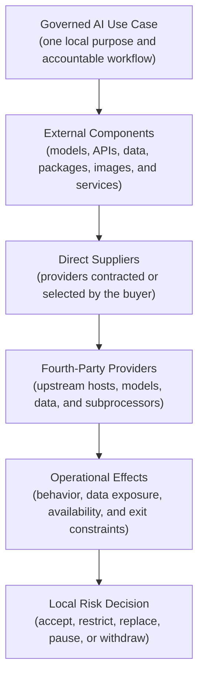
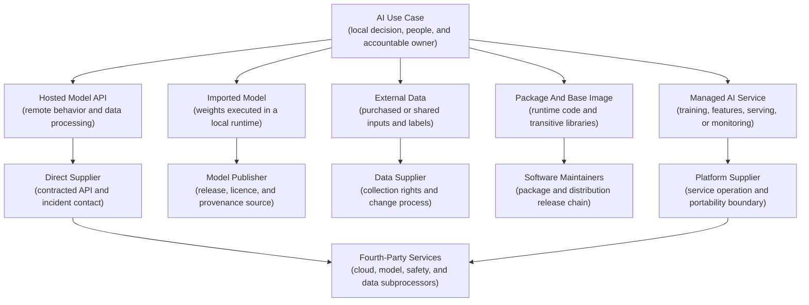
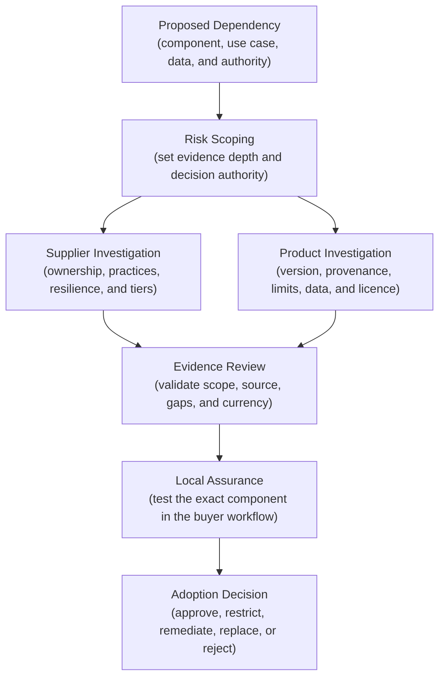
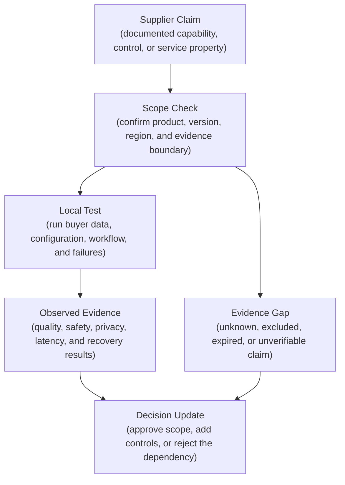
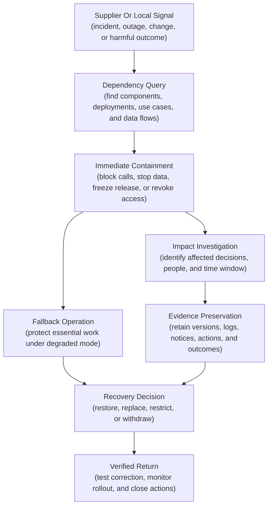

## Table of Contents

1. [What Third-Party AI Supply-Chain Risk Means](#what-third-party-ai-supply-chain-risk-means)
2. [Map The Whole Dependency Chain](#map-the-whole-dependency-chain)
3. [Set Due-Diligence Depth Before Adoption](#set-due-diligence-depth-before-adoption)
4. [Compare Supplier Claims With Local Assurance Tests](#compare-supplier-claims-with-local-assurance-tests)
5. [Put Risk Responsibilities Into The Supplier Contract](#put-risk-responsibilities-into-the-supplier-contract)
6. [Control Versions And Delivery At The Technical Boundary](#control-versions-and-delivery-at-the-technical-boundary)
7. [Monitor Supplier And Component Changes Continuously](#monitor-supplier-and-component-changes-continuously)
8. [Design Fallback, Portability, And Exit Before Adoption](#design-fallback-portability-and-exit-before-adoption)
9. [Contain Incidents Across The Dependency Graph](#contain-incidents-across-the-dependency-graph)
10. [Check That Governance Records Match Live Dependencies](#check-that-governance-records-match-live-dependencies)
11. [The Main Idea](#the-main-idea)
12. [References](#references)

## What Third-Party AI Supply-Chain Risk Means

<!-- section-summary: Third-party AI risk covers every external component and upstream provider that can affect an AI system’s behavior, data, security, availability, or withdrawal path. -->

An AI product rarely comes from one team and one model. A team may call a hosted
model API, import an open-source model, buy a data feed, install Python packages,
run a vendor base image, and store features in a managed platform. Each external
piece can change what the system does or whether it can operate.

**Third-party AI supply-chain risk** is the risk introduced through those
external products, services, suppliers, and upstream dependencies. The word
**supply chain** describes the path through which technology and data reach the
organization. That path includes direct suppliers and the providers they depend
on.

Consider a support-prioritization workflow. An internal classifier estimates
urgency. A hosted language API summarizes long messages. A commercial data feed
adds account signals. Open-source packages prepare the text, and a managed
service hosts the prediction endpoint. A support agent acts on the resulting
queue. A failure in any external component can change the queue, expose message
content, delay responses, or remove the evidence needed to investigate an
outcome.

The direct model supplier is only one part of the exposure. Its API may run on a
cloud provider, call another model, or use a specialist safety service. A Python
package may depend on dozens of other packages. A container image may inherit an
operating-system library from an upstream distribution. These **transitive
dependencies** sit further upstream while still influencing the local product.

The organization operating the workflow remains accountable for its own use.
It chooses the purpose, sends the data, grants the component authority, and
decides how people experience the output. Supplier governance therefore follows
the dependency from adoption through operation, change, incident response, and
withdrawal.


```mermaid
flowchart TD
    A["Governed AI Use Case<br/>(one local purpose and accountable workflow)"] --> B["External Components<br/>(models, APIs, data, packages, images, and services)"]
    B --> C["Direct Suppliers<br/>(providers contracted or selected by the buyer)"]
    C --> D["Fourth-Party Providers<br/>(upstream hosts, models, data, and subprocessors)"]
    D --> E["Operational Effects<br/>(behavior, data exposure, availability, and exit constraints)"]
    E --> F["Local Risk Decision<br/>(accept, restrict, replace, pause, or withdraw)"]

    class A usecase;
    class B,C,D,E dependency;
    class F decision;
```

NIST SP 800-161 Revision 1, Update 1 provides the broader cybersecurity
supply-chain risk-management framework for systems and organizations. It treats
supply-chain risk as an enterprise, mission, and system concern. AI teams apply
that same discipline to models, data, software, and hosted AI services, then add
evaluation for the local decision and affected people.

## Map The Whole Dependency Chain

<!-- section-summary: A component graph connects the governed AI use case to every external component, direct supplier, fourth party, data flow, deployed version, owner, and fallback. -->

A supplier list answers who the organization pays. A **component graph** answers
what the AI system actually depends on. The graph represents components as
objects and draws the relationships between them. It exposes technical paths
that a contract register alone may miss.

Start with the governed AI use case and the action it supports. Then add every
external component that can affect inputs, outputs, runtime behavior, security,
availability, or evidence. Important component types include:

- a hosted model or agent API that returns predictions or generated content;
- an imported model whose weights run inside the organization;
- a dataset, label source, enrichment feed, or evaluation corpus;
- an open-source package and its transitive dependencies;
- a base image that supplies the operating system and runtime libraries;
- a managed feature store, training platform, vector database, or endpoint; and
- a supplier-operated monitoring, safety, identity, or content-filter service.

Each component links to its direct supplier or maintainer. The next layer records
material fourth parties. A **fourth party** is a provider used by the direct
supplier. Examples include its cloud host, model provider, data subprocessor,
package registry, or upstream dataset supplier.


```mermaid
flowchart TD
    A["AI Use Case<br/>(local decision, people, and accountable owner)"] --> B["Hosted Model API<br/>(remote behavior and data processing)"]
    A --> C["Imported Model<br/>(weights executed in a local runtime)"]
    A --> D["External Data<br/>(purchased or shared inputs and labels)"]
    A --> E["Package And Base Image<br/>(runtime code and transitive libraries)"]
    A --> F["Managed AI Service<br/>(training, features, serving, or monitoring)"]
    B --> G["Direct Supplier<br/>(contracted API and incident contact)"]
    C --> H["Model Publisher<br/>(release, licence, and provenance source)"]
    D --> I["Data Supplier<br/>(collection rights and change process)"]
    E --> J["Software Maintainers<br/>(package and distribution release chain)"]
    F --> K["Platform Supplier<br/>(service operation and portability boundary)"]
    G --> L["Fourth-Party Services<br/>(cloud, model, safety, and data subprocessors)"]
    K --> L

    class A usecase;
    class B,C,D,E,F component;
    class G,H,I,J,K supplier;
    class L upstream;
```

### Record Data Flow And Control Flow

The graph needs more than names. A **data flow** records which information
crosses each boundary, where it is processed, how long it remains, and what
returns. A **control flow** records how the component affects the product. A
language API that drafts text for optional review has different authority from
an API whose score automatically blocks a transaction.

For each live relationship, record the component identity, version strategy,
supplier, owner, regions, data categories, permissions, decision influence,
fallback, and evidence links. Connect the component to deployed services and the
AI inventory ID. The same foundation model may appear in several use cases, each
with different data and consequences.

### Look For Concentration And Hidden Coupling

**Concentration risk** occurs when many important systems depend on the same
supplier, service, region, model family, package, or maintainer group. Individual
teams may see a replaceable dependency. A portfolio view may reveal that one
outage or policy change would affect dozens of products at the same time.

Hidden coupling also appears through shared credentials, proprietary feature
formats, provider-specific prompts, or logs stored only inside the supplier
platform. Mapping these relationships early changes the adoption decision. The
team can reduce data sent, isolate credentials, preserve local evidence, select
an open interface, or prepare a second operating path.

Discovery remains federated. Procurement reveals contracts. Cloud inventories
reveal managed AI resources. Network egress reveals external APIs. Model and
package manifests reveal technical dependencies. Data catalogs reveal external
sources, while deployment manifests reveal live versions. Reconciliation links
these signals to one governed component graph.


*A component graph shows which external dependency affects each workflow stage, which supplier and fourth parties sit upstream, and where one shared provider can create concentration risk.*

## Set Due-Diligence Depth Before Adoption

<!-- section-summary: Due diligence investigates the supplier and product before adoption, with depth based on decision influence, data access, privilege, opacity, substitutability, and failure impact. -->

**Due diligence** is the investigation performed before an organization relies
on a supplier or product. It asks whether the proposed dependency has enough
evidence, control, and resilience for the intended use. The same process also
supports later reassessment of an existing dependency.

Start from the local use case. A formatting library used in an offline report
needs ordinary software review. A hosted model that receives customer messages
and recommends case priority needs deeper review. It touches sensitive data,
changes a workflow, depends on remote operation, and may update beyond the
buyer’s direct control.

Due-diligence depth should reflect several properties. Examine the component’s
influence over decisions, access to data, runtime privilege, update mechanism,
opacity, scale, and failure impact. Also examine how quickly the team can disable
or replace it. Legal duties and the vulnerability of affected people can raise
the required evidence and approval authority.

### Investigate The Supplier And The Product

Supplier review covers the organization providing or maintaining the component.
The reviewer examines ownership, operating history, security practices,
resilience, incident capability, support model, and material supply-chain tiers.
Product review covers the exact model, API, dataset, package, image, or service
the team plans to use.

NIST SP 1326 is the final _NIST Cybersecurity Supply Chain Risk Management: Due
Diligence Assessment Quick-Start Guide_. It describes due diligence for
information and communications technology suppliers through five areas:
foreign ownership, control, or influence; provenance; resilience; foundational
cyber practices; and supply-chain tiers. Organizations tailor those areas to
their risk and legal context.

For an AI dependency, product questions add model and data concerns. Ask which
version and deployment mode apply. Identify intended uses, limitations,
evaluation populations, training or fine-tuning sources at the available level,
data-use terms, safety controls, update behavior, logging, and deletion. Examine
licence terms and restrictions for imported models and datasets.

### Collect Evidence That Affects The Adoption Decision

A questionnaire records supplier statements. Reviewers need evidence that can
support acceptance, restriction, or rejection of the dependency. Examples include
independent assessment reports, security-test summaries, architecture and data-
flow documentation, model cards, dataset documentation, service history,
incident procedures, subprocessor lists, licences, provenance, and export
samples.

Every important claim needs a status and owner. Mark whether it is supplier-
asserted, independently assessed, locally tested, contractually required, or
unknown. Record which product and service boundary the evidence covers. An
enterprise security report may exclude the specific hosted model or region the
team plans to use.

Evidence also ages at different speeds. A model evaluation applies to a stated
model version and population. A subprocessor list can change with supplier
architecture. A resilience exercise applies to the tested service boundary.
Review triggers should follow the subject of the evidence.


```mermaid
flowchart TD
    A["Proposed Dependency<br/>(component, use case, data, and authority)"] --> B["Risk Scoping<br/>(set evidence depth and decision authority)"]
    B --> C["Supplier Investigation<br/>(ownership, practices, resilience, and tiers)"]
    B --> D["Product Investigation<br/>(version, provenance, limits, data, and licence)"]
    C --> E["Evidence Review<br/>(validate scope, source, gaps, and currency)"]
    D --> E
    E --> F["Local Assurance<br/>(test the exact component in the buyer workflow)"]
    F --> G["Adoption Decision<br/>(approve, restrict, remediate, replace, or reject)"]

    class A,B scope;
    class C,D,E,F review;
    class G decision;
```

## Compare Supplier Claims With Local Assurance Tests

<!-- section-summary: Supplier evidence describes the component and provider, while local assurance tests the exact version, configuration, data, workflow, and failure modes used by the buyer. -->

Supplier evidence describes how a product was built and operated. **Local
assurance** examines what happens inside the buyer’s own use case. Both forms of
evidence matter because the same component can produce different results across
data, configuration, languages, thresholds, interfaces, and human workflows.

Suppose a hosted language API documents support for several languages. The
supplier’s evaluation explains its benchmark and test population. The buyer
still tests real document formats from the approved languages. It measures
omissions, harmful transformations, latency, refusal behavior, and reviewer
overrides under the local prompt and settings.

The supplier may also provide a security assessment and data-processing terms.
Local teams inspect the actual fields sent to the API, credential scope, network
path, logging, retention configuration, and deletion workflow. A strong supplier
control environment cannot correct an integration that sends unnecessary
personal data or stores prompts in an unrestricted log.

### Test The Product In Its Real Decision Path

Local evaluation should follow the component’s effect on the workflow. A risk
score needs tests for missing responses, calibration, important segments,
threshold behavior, and downstream actions. A generated summary needs tests for
omissions, invented facts, sensitive-data handling, and the reviewer interface.
A managed feature service needs point-in-time correctness, freshness, latency,
and outage tests.

Test failure behavior as deliberately as successful behavior. Send malformed
outputs, timeouts, rate limits, unavailable regions, partial data, and unexpected
schema versions. Observe whether the integration rejects the result, retries,
uses stale data, activates a fallback, or silently continues.

### Record Unknowns And Decide Whether They Block Adoption

Some suppliers cannot disclose training data, fourth parties, or internal
evaluation detail. The assessment records each unknown and the decision it
affects. Reviewers can narrow the approved population, reduce automation,
minimize data, require human confirmation, strengthen monitoring, or select
another component.

A mutable API creates another unknown. The provider may change behavior behind
one endpoint without exposing a stable model version. The buyer can record the
provider metadata that is available, preserve fixed evaluation probes, detect
output shifts, and require change notification. The residual traceability gap
still affects the risk decision.


```mermaid
flowchart TD
    A["Supplier Claim<br/>(documented capability, control, or service property)"] --> B["Scope Check<br/>(confirm product, version, region, and evidence boundary)"]
    B --> C["Local Test<br/>(run buyer data, configuration, workflow, and failures)"]
    C --> D["Observed Evidence<br/>(quality, safety, privacy, latency, and recovery results)"]
    D --> E["Decision Update<br/>(approve scope, add controls, or reject the dependency)"]
    B --> F["Evidence Gap<br/>(unknown, excluded, expired, or unverifiable claim)"]
    F --> E

    class A,B claim;
    class C,D test;
    class F gap;
    class E decision;
```

NIST SP 800-218A adds secure-development practices for generative AI and dual-
use foundation models to the Secure Software Development Framework. It is
intended for model producers, AI-system producers, and acquirers. Supplier
evidence aligned to that profile can inform due diligence. The buyer still
assesses the delivered component and local operating context.


*Supplier evidence describes the external product boundary; local assurance tests the exact version, buyer data, configuration, workflow, and failure behavior before the adoption decision.*

## Put Risk Responsibilities Into The Supplier Contract

<!-- section-summary: Agreements define which supplier actions, evidence, notifications, data practices, continuity measures, and exit support the buyer can rely on during operation. -->

Due diligence identifies the conditions the organization needs from a supplier.
The agreement assigns those conditions to named responsibilities, notification
duties, evidence, and remedies. Its terms must match the technical service and
the local risk decision.

An enterprise agreement may include security language and still leave the AI
team exposed. The hosted model could update without a stable version, retain
inputs under a separate product term, or rely on unlisted subprocessors. Legal,
procurement, security, privacy, engineering, operations, and the use-case owner
therefore shape the requirements together.

### Define Change And Version Responsibilities

Change terms should cover model behavior, API schemas, safety policies, data
sources, service regions, subprocessors, security controls, support, and end-of-
life. Define which changes need advance notice, which emergency changes may move
faster, and which evidence accompanies the notice.

Version terms must reflect the product. Imported artifacts can use immutable
digests. Packages and images can use locked versions plus digests. Hosted APIs
may expose a model version, dated API revision, deployment name, or release
metadata. If the endpoint remains mutable, the agreement and monitoring design
need to address that limitation directly.

### Require Incident Notification And Cooperation

Incident clauses identify reportable events, notification channels, escalation
contacts, evidence preservation, investigation support, update cadence, and
closure evidence. Reportable events can include unauthorized data access,
compromised builds, malicious packages, faulty model releases, loss of service,
or an upstream incident affecting the component.

The supplier needs enough local context to support the investigation without
receiving unnecessary sensitive data. The buyer needs enough supplier evidence
to identify affected versions, regions, time windows, and fourth parties. A
tested contact path matters during an urgent event.

### Govern Data Use, Evidence, And Subcontractors

Data terms state which fields the supplier may process, where processing occurs,
how long data remains, who can access it, and whether the supplier may use it to
train or improve other products. They also cover deletion, return, backups,
derived data, and evidence of completion.

Evidence terms define access to relevant assessments, test summaries, model or
service documentation, subprocessor lists, incident records, and audit results.
The required depth follows the use-case risk and the organization’s assurance
model. Contract language should avoid promising evidence that the supplier’s
service design cannot produce.

Subcontractor terms explain how material fourth parties are approved, disclosed,
and monitored. The direct supplier remains the operational contact, while the
component graph preserves the upstream dependency and local impact.

### Plan Termination And Transition

Termination terms cover service continuity, export formats, migration support,
credential revocation, data return, deletion, evidence retention, and support
during transition. They should also address abrupt supplier withdrawal,
insolvency, licence change, and loss of a critical fourth party.

Contract rights need operational tests. A data-export clause has limited value
if the buyer has never restored the export. A change-notification clause cannot
protect a deployment that records no supplier version. Engineering exercises
turn written rights into evidence.

## Control Versions And Delivery At The Technical Boundary

<!-- section-summary: Technical controls bind approved supplier components to exact delivery identities and reject unreviewed changes while leaving supplier governance in the inventory and agreement systems. -->

The adoption decision applies to a defined component and service boundary.
Release controls connect that decision to what production actually uses. The
identity method depends on the component type.

An imported model, package, or container should use an immutable digest. A data
feed should expose a governed dataset and schema version. A hosted API should
record the strongest version signal the provider supplies. A managed service
should record region, configuration, feature flags, and release channel that can
change behavior.

The dependency record can stay compact because detailed evidence remains in its
source systems:

```yaml
component:
  inventory_ref: "<governed-component-reference>"
  use_case_ref: "<ai-use-case-reference>"
  type: hosted_model_api
  supplier_ref: "<supplier-record-reference>"
  approved_scope: "<purpose-population-and-region>"
  version_strategy: provider_release_metadata
  data_flow_ref: "<reviewed-data-flow-reference>"
  local_assurance_ref: "<current-evaluation-reference>"
  contract_ref: "<active-agreement-reference>"
  fallback_ref: "<tested-fallback-runbook>"
  material_change_triggers:
    - model_behavior
    - api_contract
    - data_use
    - subprocessor
    - service_region
    - end_of_life
```

### Use Supplier Transparency For Specific Review Questions

SLSA version 1.2 is an approved software supply-chain specification with Build
and Source tracks. Build provenance describes who built an artifact, which
process ran, and which inputs it used. Verification compares the artifact and
provenance with trusted expectations. The Source track addresses properties of
source revisions and their change-management process.

These records strengthen origin and integrity claims for software artifacts.
They do not establish model quality, lawful data use, appropriate product
behavior, supplier resilience, or contractual rights. Those questions remain in
due diligence, local assurance, and the operational agreement.

CycloneDX AI/ML-BOM can represent models, datasets, configurations, and
dependencies. A software bill of materials covers packages. A service BOM can
describe external services. Linked BOMs help dependency discovery and incident
queries, while the governed component graph adds owners, local use, decision
influence, assurance, contract, and fallback.

Imported files then pass the quarantine, digest, signature, safe-loading,
promotion, and recovery controls in [Securing Training Data and Model
Artifacts](/roadmaps/mlops#article-mlops-governance-and-responsible-ai-securing-training-data-model-artifacts).
The supplier record links to that artifact evidence as one control. Supplier
viability, change rights, fourth parties, local evaluation, and exit capability
remain separate governance questions.

### Make Release Policy Fail Safely

A release gate compares the live component reference with the approved record.
It checks the use-case ID, component identity, allowed scope, assurance status,
and any unexpired conditions. A mismatch blocks promotion or routes an explicit
exception to the accountable authority.

Hosted services need runtime observation as well as release policy. Record
provider release metadata with requests where available. Keep fixed probes that
can detect unexplained behavior change. Preserve enough local evidence to
investigate without storing unnecessary prompt or customer content.

## Monitor Supplier And Component Changes Continuously

<!-- section-summary: Continuous monitoring combines supplier events, technical component changes, local service behavior, downstream outcomes, and evidence expiry. -->

Approval describes the dependency under a stated set of facts. Suppliers,
components, business conditions, and local usage continue to change, so the
monitoring plan checks whether the recorded facts still support the decision.

Supplier monitoring covers ownership, financial or service viability, security
advisories, incidents, support policy, end-of-life, regions, subprocessors, data-
use terms, and material product notices. Open-source monitoring covers releases,
maintainer activity, vulnerabilities, compromised distribution paths, licence
changes, and abandoned dependencies.

Technical monitoring observes the exact component in production. For an API,
track latency, errors, timeouts, schema violations, provider metadata, rate
limits, and fallback use. For a model or data feed, track version, drift,
freshness, missing values, and important segment behavior. Join those signals to
downstream outcomes and complaints where labels arrive later.

### Review After A Major Supplier Or System Change

A **material change** alters a fact that supported approval. Triggers include a
new model family, API contract, data source, subprocessor, region, training-use
term, licence, safety policy, level of autonomy, or end-of-life plan. An incident
or unexplained local quality shift can also trigger review.

Reassessment targets the affected reasoning. A new subprocessor may reopen data-
flow and security review. A model update may reopen local evaluation and the AI
impact assessment. A region change may reopen privacy, resilience, and latency
evidence. Connected controls still need a consistency check.

### Reconcile Declared And Observed Dependencies

Connectors compare the component graph with model registries, deployment
manifests, package and image BOMs, cloud resources, egress destinations, data
catalogs, and procurement records. A production endpoint calling an unknown
domain creates an investigation. An approved component with no live deployment
may be stale or retired.

Monitoring requires an owner and response path. A detected version change can
freeze rollout, run the acceptance suite, request supplier evidence, or activate
fallback. An expired report can route renewal to procurement. Dashboards without
these actions provide visibility without control.

## Design Fallback, Portability, And Exit Before Adoption

<!-- section-summary: Fallback protects the immediate workflow, portability preserves the assets needed to move, and an exit plan removes the dependency under controlled conditions. -->

External dependencies eventually fail, change, or disappear. Teams need an
operating path that protects people and essential work during that disruption.
The design should exist before the dependency gains production traffic and
proprietary data.

A **fallback** is the temporary behavior used while the normal component is
unavailable or untrusted. It may use manual review, a conservative rule, a
smaller approved local model, a second supplier, delayed processing, or a paused
feature. The correct choice follows the decision and harm analysis.

For a support-priority API, falling back to chronological ordering may be safer
than using an unverified score. Operations must confirm that urgent cases still
have an escalation route. A manual queue also needs enough trained staff and
access to the evidence required for review.

### Test Both Service Capacity And Product Behaviour

An outage exercise sends realistic volume through the fallback. The team checks
queue growth, response deadlines, error handling, staff capacity, permissions,
monitoring, and communication. It also checks how the fallback changes the
product decision. A fail-open path and a fail-closed path can create very
different harms.

Fallback state should be visible in telemetry and user workflows. Predictions
need the component or fallback route that produced them. Operators need criteria
for entering, remaining in, and leaving degraded mode.

### Keep The Assets Needed To Switch Suppliers

Switching suppliers requires the data, configuration, evaluation, and operating
records needed to move the workload. This capability is called **portability**.
Preserve source data the organization may retain, feature definitions, prompts,
evaluation suites, decision policies, approved outputs, outcome joins,
monitoring definitions, and runbooks in controlled formats.

Provider-specific models, embeddings, vector indexes, orchestration, and safety
interfaces may limit portability. The team should identify which assets can be
exported, which require transformation, and which must be rebuilt. Test a sample
export and import under the permissions available during a real exit.

### Withdraw The Supplier Through A Controlled Plan

An **exit plan** moves from temporary fallback to permanent removal or
replacement. It identifies affected use cases, data return and deletion,
credential revocation, traffic migration, replacement validation, contract
closure, evidence retention, user communication, and final ownership.

Supplier withdrawal may be planned or urgent. A scheduled end-of-life allows a
parallel evaluation and migration. A compromised service may require immediate
containment. The dependency graph and exercised fallback give both paths a
known starting point.

## Contain Incidents Across The Dependency Graph

<!-- section-summary: Supplier incidents require fast dependency discovery, local containment, fallback, impact investigation, evidence preservation, and a governed recovery decision. -->

A supplier incident can arrive as a security notice, unexplained output shift,
service outage, licence dispute, data-use breach, or report from an affected
person. Response starts from the component identity and follows every edge to
live deployments and use cases.

Suppose a provider reports that one hosted model release returned corrupted
scores for a limited period. Responders need to know which services called that
release, which regions were involved, what decisions used the scores, and which
people may have experienced an effect. A supplier name alone cannot answer those
questions.

Containment can freeze new releases, block the component, stop data flow, rotate
credentials, switch to fallback, and pause high-impact actions. The choice
depends on the harm of continuing and the harm of interruption. Operations and
the accountable authority should already know who can make that decision.


```mermaid
flowchart TD
    A["Supplier Or Local Signal<br/>(incident, outage, change, or harmful outcome)"] --> B["Dependency Query<br/>(find components, deployments, use cases, and data flows)"]
    B --> C["Immediate Containment<br/>(block calls, stop data, freeze release, or revoke access)"]
    C --> D["Fallback Operation<br/>(protect essential work under degraded mode)"]
    C --> E["Impact Investigation<br/>(identify affected decisions, people, and time window)"]
    E --> F["Evidence Preservation<br/>(retain versions, logs, notices, actions, and outcomes)"]
    D --> G["Recovery Decision<br/>(restore, replace, restrict, or withdraw)"]
    F --> G
    G --> H["Verified Return<br/>(test correction, monitor rollout, and close actions)"]

    class A signal;
    class B,C,D response;
    class E,F evidence;
    class G,H recovery;
```

Preserve the supplier notice, exact component and provider metadata, deployed
configuration, access and change logs, relevant predictions, downstream actions,
fallback state, communications, and decision timeline. Apply retention and
privacy rules to the evidence. Investigators need the affected records without
creating a second uncontrolled dataset.

Recovery requires more than a supplier statement. Test the corrected version or
replacement against the local acceptance suite and the incident failure mode.
Review contractual performance and fourth-party implications. Roll out under
enhanced monitoring, and keep fallback ready until the evidence supports normal
operation.

## Check That Governance Records Match Live Dependencies

<!-- section-summary: Verification compares the governed graph, supplier evidence, release policy, observed runtime, and exit capability with the dependencies production actually uses. -->

Verification compares the governed component graph with the dependencies that
production actually calls. It uses independent sources and investigates every
contradiction because a complete form inside a governance platform cannot prove
that every live dependency is known or approved.

Start with portfolio queries:

- Which production AI deployments reference components missing from the graph?
- Which external egress destinations have no approved supplier component?
- Which components use mutable versions without provider metadata or probes?
- Which supplier records have expired evidence, unsupported products, or missing
  incident contacts?
- Which material fourth parties appear in notices or data flows without a graph
  relationship?
- Which critical dependencies have no exercised fallback or tested export?
- Which retired suppliers still receive traffic, credentials, or data?

Each result needs a control response. An unknown endpoint can block release and
open an investigation. A missing incident contact can route remediation to
procurement. Traffic to a retired supplier can trigger containment. An overdue
fallback exercise can restrict further rollout.

### Trace One Production Decision End To End

Select a production result and trace it to the use-case ID, deployment, exact
external components, supplier records, data flows, local evaluations, contract
conditions, and fallback. Then trace each component upstream through the known
supplier and fourth-party relationships.

Ask the named owners to demonstrate change intake, incident escalation,
component disablement, and evidence retrieval. Compare the written fallback with
a controlled exercise. This sample reveals gaps that schema validation misses,
such as an undocumented manual process or an export that cannot be restored.

### Test Release And Change Gates

Submit an unapproved digest, unknown API revision, expired assurance record, and
out-of-scope region to a non-production gate. Confirm that policy blocks each
case and produces an actionable owner message. Then submit an approved change
and confirm that the resulting release records the supplier component identity.

Simulate a material supplier notice. Verify that the right use cases reopen,
local tests run, contract owners respond, and production remains on the approved
version or fallback. The acceptance evidence is concrete: the graph finds every
affected deployment, policy prevents unauthorized change, responders can
contain the dependency, and the product continues under its tested safety path.

## The Main Idea

<!-- section-summary: Third-party AI governance connects every external dependency to evidence, local assurance, enforceable responsibilities, monitored change, incident response, and a tested exit path. -->

Third-party AI risk extends across the full dependency chain. Hosted models,
imported weights, external data, packages, base images, managed services, direct
suppliers, and fourth parties can all affect local behavior and accountability.
A component graph keeps those relationships connected to deployed use cases.

Due diligence investigates the supplier and product before adoption. Supplier
claims describe the external control environment. Local assurance tests the
exact component inside the buyer’s data, configuration, workflow, and failure
conditions. The adoption decision records gaps, restrictions, and residual risk.

Contracts, version controls, BOMs, provenance, monitoring, change review,
fallback, portability, and incident response each solve a different part of the
problem. Their shared purpose is operational control: the organization can
identify a dependency, understand its effect, detect change, contain failure,
preserve evidence, and withdraw it without abandoning the people and processes
that rely on the product.


*The controls have separate jobs: identify the dependency, set review depth, test it locally, assign supplier responsibilities, bind the release, respond to change, and preserve a tested withdrawal path.*

## References

- [NIST SP 800-161 Revision 1, Update 1 — Cybersecurity Supply Chain Risk Management Practices for Systems and Organizations](https://csrc.nist.gov/pubs/sp/800/161/r1/upd1/final)
- [NIST SP 1326 — NIST Cybersecurity Supply Chain Risk Management: Due Diligence Assessment Quick-Start Guide](https://csrc.nist.gov/pubs/sp/1326/final)
- [NIST SP 800-218A — Secure Software Development Practices for Generative AI and Dual-Use Foundation Models](https://csrc.nist.gov/pubs/sp/800/218/a/final)
- [NIST Secure Software Development Framework](https://csrc.nist.gov/projects/ssdf)
- [SLSA version 1.2 specification](https://slsa.dev/spec/v1.2/)
- [SLSA version 1.2 tracks](https://slsa.dev/spec/v1.2/tracks)
- [SLSA version 1.2 artifact verification](https://slsa.dev/spec/v1.2/verifying-artifacts)
- [CycloneDX Machine Learning Bill of Materials](https://www.cyclonedx.org/capabilities/mlbom/)
