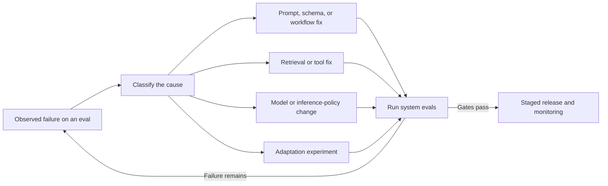
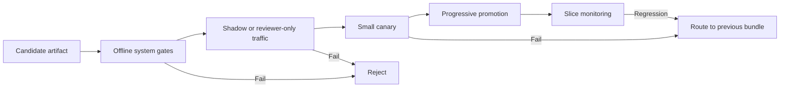

**Model adaptation** changes a model's behaviour using task data. Supervised fine-tuning teaches from desired outputs. Preference optimization teaches from comparisons. Distillation transfers behaviour from a teacher to a student. Reinforcement fine-tuning teaches from a reward signal.

These methods are powerful precisely because they change behaviour beyond one prompt. That also makes mistakes durable. A contaminated example, ambiguous preference, or exploitable reward can influence many future requests. The starting question asks which repeated failure remains and which learning signal represents the desired correction. Trainer selection follows from that diagnosis.

## Place Adaptation Inside The Optimization Loop
<!-- section-summary: Adaptation is one stage in an evaluation-driven loop and should follow cheaper, more direct fixes for prompt, knowledge, tool, or workflow failures. -->

Use Northstar Claims, an insurer whose assistant turns adjuster notes into a structured claim summary. The system sometimes chooses an inconsistent category, omits supporting facts, writes too much, and costs too much at high volume. Those symptoms do not all call for training.



Missing current policy is a knowledge problem: retrieve it or call an authoritative tool. Invalid JSON is usually an output-contract problem: use a schema and validate it. Unsafe database access is an authorization and tool-design problem. Fine-tuning does not make those responsibilities disappear.

Adaptation fits when the failure is stable, repeated, measurable, and genuinely about model behaviour. Northstar may have thousands of reviewed examples showing exactly how adjuster notes map to internal categories. That is a strong supervised signal. If experts agree that one concise summary is better than another while a single perfect answer remains elusive, pairwise preferences may fit. If a large model succeeds at excessive latency or cost, its reviewed outputs may help train a smaller student.

Always keep the production system as the baseline. The candidate must beat the prompt, retrieval, tools, validation, and routing that users actually have—not an artificially weak base-model call.

## Different Methods Learn From Different Signals
<!-- section-summary: SFT, preference optimization, distillation, and reinforcement fine-tuning answer different questions because their datasets express different supervision. -->

The methods are easier to compare by the information in one training example.

| Method | One example says | Strong fit | Main failure risk |
| --- | --- | --- | --- |
| Supervised fine-tuning (SFT) | “For this input, produce this output” | format, terminology, task procedure, stable demonstrations | copying noisy or narrow demonstrations |
| Preference optimization, such as DPO | “For this input, output A is preferred to B” | style and quality tradeoffs that reviewers compare reliably | inconsistent preferences and hidden reviewer bias |
| Distillation | “Match useful behaviour from this stronger teacher” | smaller or specialized student with a clear target distribution | inheriting teacher errors and losing rare capabilities |
| Reinforcement fine-tuning (RFT) | “This sampled output earned this reward” | tasks with a reliable grader and many possible valid solutions | reward hacking and optimization against an incomplete score |

All four methods alter probability distributions over outputs, but they expose different information to the optimizer. Choosing a method without matching the signal creates artificial data. Turning a vague preference into one “gold” response can pretend that reasonable alternatives are wrong. Creating chosen/rejected pairs when reviewers barely agree teaches noise.

### Supervised fine-tuning imitates demonstrations

In SFT, the model receives an input and a desired completion. Training increases the probability of the demonstrated completion token by token. It does not learn an abstract business rule directly; it learns statistical behaviour from the set of examples.

That makes coverage and consistency crucial. If all examples for complex claims use long summaries, the model may associate complexity with verbosity. If examples omit evidence for one claim family, the model can learn that omission as normal. SFT works best when experts can show the desired behaviour repeatedly and the task at inference resembles the training distribution.

### Preference optimization learns relative choice

A preference example contains a prompt, a chosen response, and a rejected response. Direct Preference Optimization (DPO) is one family of methods that shifts the model toward chosen responses relative to rejected ones while anchoring it to a reference policy. Beginners do not need the loss equation to grasp the contract: the pair teaches a boundary between two behaviours, not an absolute score for every possible answer.

```json
{
  "prompt": "Summarize the claim and cite only facts in the adjuster note.",
  "chosen": "Rear bumper damage reported after a low-speed collision. Photo 3 and the adjuster note support the damage location.",
  "rejected": "The vehicle clearly requires a complete rear assembly replacement after a serious collision.",
  "preference_reason": ["supported facts", "calibrated severity", "concise"]
}
```

The reason is valuable even if a trainer consumes only the pair. It lets auditors inspect what the label was meant to teach and helps detect pairs where “chosen” merely reflects tone or length. Pair construction also matters: a trivially bad rejected answer teaches little about the difficult boundary the product cares about.

### Distillation teaches a student from a teacher

In **knowledge distillation**, a capable teacher provides outputs or richer probability signals and a student learns to approximate useful behaviour. LLM application teams often use offline teacher-generated demonstrations for SFT; research and open-model training may also match logits or use on-policy distillation, where the student generates attempts and the teacher provides guidance.

Distillation transfers behaviour for a defined task distribution into a student with different capacity. The student may fail first on long-tail reasoning, rare languages, safety boundaries, or tool decisions. Define the target distribution and measurable quality thresholds instead of using the vague goal “be the teacher, only cheaper.” Preserve the teacher version, prompt and tool bundle, generation settings, source evidence, reviewer status, and cost in dataset lineage.

### Reinforcement fine-tuning optimizes a grader

RFT samples outputs, scores them, and updates the model toward outputs with higher reward. It can represent tasks with many valid paths, such as solving a structured problem where a verifier checks the final result. Its strength is also its danger: the model optimizes what the grader measures.

If a grader rewards citation count, the model may add irrelevant citations. If it checks only the final number, the model may exploit a parser. Before using a grader as a training signal, test it against deliberately wrong, adversarial, and out-of-distribution outputs. Human agreement with the grader, score calibration, exploit resistance, and latency/cost are part of model design.

## Parameter-Efficient Training Changes Cost, Not The Contract
<!-- section-summary: LoRA and related parameter-efficient methods reduce trainable weights and hardware demand, while data quality, evals, lineage, and release safety remain unchanged. -->

Full fine-tuning updates all model parameters and can require substantial compute and checkpoint storage. **Parameter-efficient fine-tuning (PEFT)** updates a much smaller set of added or selected parameters. LoRA, a widely used PEFT method, learns low-rank adapter matrices while keeping the base weights frozen. Quantized variants can further reduce memory during training.

These methods make experiments more accessible and allow several adapters to share a base model. They do not determine whether SFT or preference data is correct, and they do not remove the need to identify the base revision. An adapter without its exact base model, tokenizer, chat template, and runtime is not a reproducible deployment unit.

Provider-managed fine-tuning hides much of the training infrastructure. Open-model workflows expose optimizer, precision, distributed strategy, adapter, checkpoint, and serving choices. The operational surface differs; the learning and evidence framework does not.

## Build Data As A Governed Product
<!-- section-summary: Training rows need provenance, permission, purpose, quality, grouping, and versioning before the team publishes an immutable dataset artifact. -->

Raw production conversations are not a training dataset. They may contain private data, unsupported model answers, duplicated incidents, user corrections without final resolution, or content whose terms do not allow training. A governed pipeline separates collection from inclusion.

```mermaid
flowchart LR
    S["Permitted source records"] --> R["Redact and normalize"]
    R --> L["Expert label or preference"]
    L --> Q["Quality and policy review"]
    Q --> D["Deduplicate and group"]
    D --> T["Train, validation, and untouched test splits"]
    T --> V["Immutable dataset version"]
    V --> J["Training job"]
    J --> E["Paired system evaluation"]
```



Every row should have a stable example ID, source and collection purpose, consent or allowed-use class, transformation versions, labeler or generator role, review outcome, task slice, and a grouping key. The grouping key prevents related records from leaking across splits. Notes, attachments, and revisions for one claim belong in the same split even when their text differs.

```yaml
example_id: claim-summary-008821-r2
source:
  system: claims-review
  record_revision: 2
  allowed_use: model-training-approved
transformations:
  redaction_policy: pii-redaction-6
  formatter: claim-chat-template-3
label:
  type: supervised-demonstration
  reviewer_role: senior-adjuster
  status: adjudicated
group_id: claim-008821
slices: [rear-collision, photo-evidence, low-severity]
```

Keep training, validation, and test responsibilities distinct. Training examples update weights. Validation guides choices such as stopping or hyperparameters. The test set stays untouched until the candidate is ready for comparison. Reusing the same cases during prompt design, data curation, training selection, and final reporting leaks information and produces an optimistic result.

Balance is not simply an equal row count. The dataset should reflect important traffic while deliberately covering rare, costly, and safety-critical slices. Near-duplicates can overweight one pattern. Synthetic examples can extend coverage, but tag their generator and verify them; model-generated fluency is not evidence that a label is correct.

Preference data adds reviewer design. Define the rubric, randomize response order, hide model identity, collect disagreement, adjudicate important conflicts, and measure agreement by slice. A preference label should say which dimensions drove the choice. Do not combine factuality, style, safety, and length into an unexplained vote and expect training to infer the intended tradeoff.

## Design An Experiment That Can Falsify The Idea
<!-- section-summary: A useful adaptation experiment defines a failure hypothesis, fixed baseline, immutable data, system-level metrics, and stop conditions before training starts. -->

Northstar's hypothesis might be: “SFT on adjudicated claim summaries will reduce internal-category errors from the current baseline without lowering supported-fact precision on any critical claim family.” This is more useful than “fine-tuning should improve quality” because it names the target, baseline, guardrail, and slices.

The run record should bind base model revision, dataset hash, split manifest, method and hyperparameters, random seeds, code and environment, trainer version, checkpoint policy, and resource usage. For a managed API, retain provider job and file IDs plus the model snapshot. For open training, retain exact model and dataset revisions; Hub repositories and artifacts should use immutable commits or tags rather than floating names.

Training loss is diagnostic, not the product decision. Lower loss can mean the model memorized demonstrations more effectively. During training, watch loss, preference margin or reward, gradient and numerical health, validation slices, and signs of overfitting. Stop when validation stops improving or guardrails degrade—not merely when the scheduled epochs finish.

Evaluate the complete application. A tuned model may interact differently with the system prompt, structured output, retrieval context, tools, safety filters, or retry policy. Compare candidate and baseline on the same requests and repeated trials where nondeterminism matters. Inspect category accuracy, supported-fact precision, schema validity, refusal and escalation, latency, token usage, and cost.

## Release A Tuned Model As A New System Version
<!-- section-summary: Promotion binds the adapted model to its prompt, tools, schemas, policies, eval evidence, and rollback target rather than treating a training job as deployment approval. -->

The release unit includes more than weights or a provider model ID. It includes the compatible tokenizer or API contract, prompt bundle, tool schemas, retrieval configuration, safety policy, and runtime settings. Register that bundle with dataset lineage, training job, eval report, owner, limitations, and expiry or review date.



Shadow evaluation is useful when outputs can be scored without affecting users. A canary exposes only a bounded share of eligible traffic. Keep the previous compatible system bundle available and define rollback on quality, safety, latency, or cost regressions. Do not rely on a mutable “production” alias as the only record of what ran.

After release, monitor reviewer overrides, unknown-category rates, supported-fact samples, safety events, cost, latency, and performance by claim family. New traffic may reveal a missing slice, a changed policy, or a product shift. Automatic retraining is rarely the right first response: investigate the cause, curate permitted examples, create a new dataset version, and repeat the gates.

Retirement stops routing, revokes endpoint or artifact access, updates dependencies, and applies retention policy to datasets and checkpoints. Preserve enough lineage and evaluation evidence to explain a past decision without keeping raw sensitive examples indefinitely.

## Choose The Smallest Reliable Learning Signal
<!-- section-summary: The best method is the least complex intervention whose data truthfully represents the desired behaviour and whose improvement survives system-level evaluation. -->

Use prompting, retrieval, tools, and deterministic validation for failures those layers own. Use SFT when experts can demonstrate stable desired behaviour. Use preference optimization when reviewers can reliably compare alternatives. Use distillation when a defined teacher behaviour should move into a smaller or specialized student. Use RFT when a robust grader can score many valid outputs and resist gaming.

The training framework—managed API, Transformers, TRL, PEFT, distributed PyTorch, or another stack—implements the experiment. It does not supply the product definition, data permission, preference rubric, reward validity, or release evidence. Those are the durable MLOps responsibilities.

## References

- [OpenAI model optimization](https://developers.openai.com/api/docs/guides/model-optimization)
- [OpenAI supervised fine-tuning](https://developers.openai.com/api/docs/guides/supervised-fine-tuning)
- [OpenAI direct preference optimization](https://developers.openai.com/api/docs/guides/direct-preference-optimization)
- [OpenAI reinforcement fine-tuning](https://developers.openai.com/api/docs/guides/reinforcement-fine-tuning)
- [Hugging Face Transformers](https://huggingface.co/docs/transformers/index)
- [Hugging Face TRL](https://huggingface.co/docs/trl/index)
- [Hugging Face DPO Trainer](https://huggingface.co/docs/trl/dpo_trainer)
- [Hugging Face PEFT](https://huggingface.co/docs/peft/index)
- [NIST AI Risk Management Framework](https://www.nist.gov/itl/ai-risk-management-framework)
