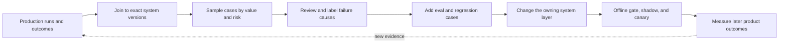

## What a Feedback Flywheel Really Is

<!-- section-summary: A production feedback flywheel turns observed outcomes into reviewed examples, evals, and safer releases; automatic training on thumbs-up events sits outside this governed loop. -->

A **feedback flywheel** is a controlled loop from production evidence to a tested product improvement. It collects signals, joins them to the exact system version, selects useful cases, obtains trustworthy labels, adds regression coverage, changes one or more system components, and measures the result after release.

Use **HelpHarbor**, a support copilot, as the scenario. Agents can accept a draft, edit it, reject it, escalate the case, or reopen the ticket later. Customers may rate the final interaction. Those events are useful, but none is a perfect label. A draft can be accepted because the queue is busy. A heavily edited draft may still have saved time. A thumbs-down may reflect company policy rather than answer quality.

The wrong loop is “collect disliked answers and fine-tune every Friday.” It mixes product dissatisfaction, policy disagreement, missing data, tool failures, and model mistakes. The right loop diagnoses the failure before choosing a fix.



Every arrow has an owner and a quality condition. A missing join breaks attribution, weak sampling hides rare harm, poor labels send work to the wrong team, and a release without later outcomes cannot show that the change helped users.

## Feedback Terms in Plain English

<!-- section-summary: Feedback terminology distinguishes source history, dataset connections, sampling rates, subgroups, review resolution, and failure categories. -->

**Provenance** records where a feedback example came from, who or what labeled it, and which system version produced it. **Lineage** connects a derived label or eval case back to those source records. **Prevalence** is how common an outcome is in the real population; an intentionally oversampled review queue cannot estimate it directly. A **slice** is a subgroup such as one language or product path whose results are reported separately. **Adjudication** is the process where an expert resolves reviewer disagreement. A **taxonomy** is the controlled list of failure categories used to describe and route cases consistently.

A **high-cardinality field** has many unique values, such as a conversation ID, and belongs in governed event or trace storage rather than a metric label. A **holdout** is a hidden set kept out of development decisions for later evaluation. A **shadow release** runs a candidate on copied traffic without using its answer, while a **canary release** serves a small controlled user group. An **interrupted time series** compares measurements before and after a change while accounting for their time order; unlike random assignment, it can still be affected by other events occurring at the same time.

## Define Signals and Their Limits

<!-- section-summary: Explicit ratings, behavioral outcomes, reviewer edits, traces, and incidents measure different things and must keep their provenance and uncertainty. -->

HelpHarbor creates a signal catalog:

| Signal | What it may indicate | Important limitation |
| --- | --- | --- |
| Agent accepted draft | Usefulness | Acceptance can be rushed or habitual |
| Edit distance | Amount of rewriting | Small wording edits can change legal meaning |
| Ticket reopened | Resolution failure | The product or shipping system may be the cause |
| Customer rating | Overall experience | It includes policy, wait time, and delivery outcome |
| Escalation | Risk or missing capability | Correct escalation is often a success |
| Tool failure | Dependency reliability | Separate from model-answer quality |
| Safety incident | Serious control failure | Rare, high priority, and manually reviewed |

Each event keeps event time, tenant policy class, conversation ID, trace ID, prompt bundle, model route, retrieval version, tool results, and consent or processing basis. High-cardinality IDs stay in governed event storage, not Prometheus labels. Raw conversations have stricter access and retention than numeric dashboard aggregates.

## Join Feedback to the Run

<!-- section-summary: Stable trace and response identifiers connect delayed outcomes to the model, prompt, retrieval, tools, and policy that produced them. -->

Feedback often arrives days later. The pipeline needs a durable join:

```sql
select
  r.trace_id,
  r.prompt_bundle_version,
  r.model_route,
  r.retrieval_profile,
  r.tool_failure_class,
  f.agent_action,
  f.edit_ratio,
  f.customer_rating,
  f.reopened_within_7d
from llm_run_fact r
join support_feedback_fact f using (conversation_id)
where r.started_at >= current_date - interval '30 days';
```

Do not use a mutable user profile as the only join. One conversation may contain multiple generations. Record which draft the agent viewed and which final response was sent. If a human composed the final answer from scratch, do not label it as the model's accepted output.

Protect privacy at ingestion. Strip secrets and unnecessary personal fields before analysis. Store a redacted evidence view for labelers and keep source access behind case-level authorization. Honor deletion and retention rules across traces, label queues, eval datasets, and any later training dataset.

## Sample Cases Deliberately

<!-- section-summary: Useful feedback datasets combine random sampling with risk, disagreement, novelty, and slice sampling so common easy traffic does not hide rare failures. -->

Pure random samples mostly contain common, easy tickets. Pure failure samples distort prevalence and can encourage overfitting. HelpHarbor uses several queues:

- a random sample to estimate live quality;
- all safety and permission incidents;
- high-edit and rejected drafts;
- disagreements between automatic graders and human outcomes;
- novel topics or low-retrieval-score clusters;
- protected product and language slices;
- successful cases to preserve behavior during changes.

Sampling metadata must survive into analysis. If safety incidents were oversampled, do not report their raw fraction as the production incident rate. Weight estimates or use the random sample for prevalence.

Near-duplicate clustering keeps one shipping outage from contributing 10,000 nearly identical eval rows. Preserve a small representative set plus a traffic-count field. Split related cases together when creating development and held-out sets.

## Label Failure Cause, Not Only Quality

<!-- section-summary: A diagnostic taxonomy routes each case toward the appropriate fix: prompt, retrieval, tool, policy, data, model, or human workflow. -->

Reviewers answer a short rubric:

```yaml
label_schema: helpharbor-feedback-v4
dimensions:
  answer_supported: [yes, partial, no]
  policy_correct: [yes, no, not_applicable]
  tool_use: [correct, missed, wrong, tool_failed, not_applicable]
  escalation: [correct, unnecessary, missing, not_applicable]
  primary_failure:
    - prompt_instruction
    - retrieval_missing
    - retrieval_wrong
    - tool_contract
    - dependency_failure
    - authorization_policy
    - model_reasoning
    - source_data
    - no_system_failure
  severity: [low, medium, high, critical]
```

Labelers see the user's allowed context, retrieved source IDs, tool calls, and policy version. They do not guess whether the model “knew” something. Two reviewers handle high-severity cases, with adjudication on disagreement. Track reviewer agreement and revise ambiguous rubric items.

The failure label controls the backlog. Missing documents go to knowledge operations. Wrong tool results go to the service owner. A permission problem goes to security. The team considers prompt changes or adaptation only for stable behavioral gaps supported by enough examples.

## Turn Cases Into Evals and Releases

<!-- section-summary: Teams turn incidents and representative feedback into immutable regression cases before releasing a fix, which closes the evidence loop. -->

Every accepted case gets provenance, redaction version, labeler decision, and expected behavior. Critical incidents enter a blocking suite. Softer quality examples enter scored slices. Keep some recent cases in a hidden holdout so prompt authors cannot tune directly to every item.

```yaml
case_id: feedback-2026-0712-00418
source: production_review
trace_ref: trc_redacted_91ea
slice: international_split_shipment
expected:
  required_tool_sequence:
    - order.get_shipments
    - policy.get_delivery_options
  must_escalate: false
  citation_required: true
failure_origin: retrieval_wrong
```

Run the candidate and baseline on the expanded suite. Evaluate overall results and slices, then shadow or canary the change. Production monitoring checks whether the targeted failure decreases without raising reviewer burden, cost, latency, or another failure class. One metric improving is not enough.

## A Delayed Outcome Through the Join

<!-- section-summary: A delayed outcome provides usable evidence only after the pipeline attaches it to the exact response the user saw and records the join rule, time boundary, and ambiguity. -->

Ticket reopen events arrive after the model run and often after several human messages. The pipeline needs more state than `conversation_id`. HelpHarbor records one immutable delivery row whenever a draft is shown:

```json
{
  "delivery_id": "dlv_01K13AF0TQ8E",
  "conversation_id": "conv_7782",
  "response_id": "resp_92d1",
  "trace_id": "trc_6b68f1c0",
  "shown_at": "2026-07-10T09:14:28Z",
  "prompt_bundle": "support-v41",
  "model_route": "standard",
  "agent_action": "edited_then_sent",
  "final_message_id": "msg_final_447",
  "model_text_hash": "sha256:7af9...",
  "final_text_hash": "sha256:991e..."
}
```

`delivery_id` identifies the actual product event. `response_id` and `trace_id` lead back to the generated candidate and its tool evidence. The two hashes show that the human changed the text without copying sensitive content into analytics. `final_message_id` connects later ticket history to what the customer received.

The point-in-time join selects the last delivered message before the reopen event and marks ambiguous conversations instead of manufacturing a label:

```sql
with ranked_delivery as (
  select
    o.outcome_id,
    o.occurred_at as outcome_at,
    d.delivery_id,
    d.response_id,
    d.trace_id,
    d.agent_action,
    row_number() over (
      partition by o.outcome_id
      order by d.shown_at desc
    ) as delivery_rank,
    count(*) over (partition by o.outcome_id) as candidate_deliveries
  from support_outcome o
  join response_delivery d
    on d.conversation_id = o.conversation_id
   and d.shown_at <= o.occurred_at
   and d.shown_at >= o.occurred_at - interval '7 days'
  where o.outcome_type = 'ticket_reopened'
)
select
  outcome_id,
  delivery_id,
  response_id,
  trace_id,
  agent_action,
  case
    when candidate_deliveries = 1 then 'direct'
    else 'needs_attribution_review'
  end as attribution_status
from ranked_delivery
where delivery_rank = 1;
```

The backward seven-day window is a product definition that must match how the reopen metric is reported. `shown_at <= occurred_at` blocks future leakage. `row_number` selects a candidate deterministically, while `candidate_deliveries` exposes whether several delivered answers could have contributed. Those ambiguous rows enter an attribution-review sample and stay out of automatic model-quality labels.

Test the join with synthetic timelines: one delivery followed by a reopen, two deliveries followed by a reopen, an outcome before any delivery, a delivery outside the window, and two tenants reusing the same human-facing ticket number. The final case should prove that tenant and immutable conversation keys participate in the real join even when the simplified query omits tenant columns for readability.

If a join revision later proves wrong, lineage should identify every derived label, eval case, report, and training dataset built from it. Mark those artifacts `quarantined`, stop releases that depend on them, rebuild from source events with the corrected join version, and compare the changed label set. This recovery path is why a feedback pipeline needs versioned transformations rather than a dashboard query copied into a notebook.

## Operate the Loop Safely

<!-- section-summary: Feedback operations need consent, access control, retention, dataset lineage, poisoning defenses, and a rollback path because production text can be adversarial or sensitive. -->

User-provided text is untrusted. Attackers may try to place instructions or poisoned examples into future datasets. Automated ingestion must never promote raw feedback directly into prompts or training. Require validation, redaction, provenance, and human review for high-impact data.

Publish a monthly feedback report with queue volumes, sampling strategy, label agreement, major failure categories, eval cases added, changes released, targeted outcome deltas, and unresolved risks. This keeps the flywheel from becoming an invisible data-collection system.

## Measure Whether the Flywheel Improves the Product

<!-- section-summary: The flywheel is successful only when targeted production outcomes improve under a stable measurement design, not when the team merely accumulates labels. -->

HelpHarbor defines a before-and-after scorecard for each intervention. A retrieval fix for international split shipments should reduce unsupported delivery claims and unnecessary escalations on that slice. It should not be credited for a company-wide fall in reopen rate caused by a shipping recovery.

Use a controlled rollout where possible. Stable canary assignment or an A/B test separates the candidate from time trends. When randomization is inappropriate, use a careful interrupted time series and state the limitations. Compare user mix, ticket mix, policy changes, and dependency health.

```sql
select
  bundle_version,
  count(*) as conversations,
  avg(case when reviewer_label = 'supported' then 1.0 else 0.0 end) as support_rate,
  avg(case when agent_action = 'accepted' then 1.0 else 0.0 end) as accept_rate,
  avg(edit_ratio) as edit_ratio,
  avg(case when reopened_within_7d then 1.0 else 0.0 end) as reopen_rate
from governed_feedback_sample
where slice = 'international_split_shipment'
group by bundle_version;
```

Include uncertainty and sample size. A two-point change from twelve reviewed cases is a prompt for more evidence, not a launch claim. Safety blockers remain counts and individually reviewed events even when statistical estimates are wide.

## Prevent Feedback Bias From Becoming Product Bias

<!-- section-summary: Feedback is missing non-randomly, so the team audits who can respond, whose signals are absent, and whether optimization harms less-visible groups. -->

Users who submit ratings differ from users who do not. Support agents on a new queue may edit more than experts. Voice users may have no thumbs-up control. Enterprise tenants may block transcript retention. HelpHarbor documents these missingness patterns and does not call the labeled sample representative by default.

The monthly report compares feedback coverage and outcomes across supported language, channel, region, product, and accessibility paths where lawful and appropriate. Small groups are protected from re-identification and may require aggregate or qualitative review. The team looks for improvements that help the majority while increasing escalations or bad refusals for another slice.

Reviewer operations can create bias too. Rotate examples, hide candidate identity when feasible, randomize response order, provide adjudication, and monitor agreement. Do not reward labelers for speed alone on sensitive cases.

## Turn the Taxonomy Into Ownership

<!-- section-summary: A feedback loop closes faster when each failure class maps to an owner, service-level target, and proof of resolution. -->

HelpHarbor routes `retrieval_missing` to knowledge operations, `tool_contract` to the integration owner, `dependency_failure` to service reliability, and `authorization_policy` to security. `model_reasoning` goes to the LLM team only after evidence, retrieval, and tool behavior have been checked.

Each backlog item links the source sample, redacted trace, expected behavior, eval case, proposed component change, owner, and validation report. Closing a ticket requires a passing regression case and production verification. This prevents the “flywheel” from being a dashboard that produces no accountable engineering work.

Rollback uses the same release controls as any LLM change. Restore the previous prompt, model, retrieval, or tool bundle, preserve trace evidence, and keep the new regression cases. If the feedback pipeline itself is wrong—for example, a join attached ratings to the wrong draft—quarantine derived labels and models until lineage shows what was affected.

Set service targets for the learning system itself. Critical incidents may require review and a blocking regression case within one business day; random quality samples may have a weekly cycle. Track queue age, unassigned severe cases, adjudication delay, lineage failures, and the share of shipped changes with verified production outcomes. These measures expose a common failure mode: a team collects large volumes of feedback but takes weeks to turn urgent evidence into protection. Delete expired source content even when a label task is late; operational convenience does not override the retention contract.

The practical workflow instruments outcomes, retains provenance, samples deliberately, diagnoses causes with humans, converts reviewed cases to evals, releases through gates, and verifies the intended outcome in production. Reviewed and traceable feedback provides trustworthy evidence for those decisions.

## References

- [OpenAI evaluation best practices](https://developers.openai.com/api/docs/guides/evaluation-best-practices)
- [OpenAI working with evals](https://developers.openai.com/api/docs/guides/evals)
- [OpenAI safety best practices](https://developers.openai.com/api/docs/guides/safety-best-practices)
- [OpenTelemetry GenAI semantic conventions](https://github.com/open-telemetry/semantic-conventions-genai)
- [NIST AI Risk Management Framework](https://www.nist.gov/itl/ai-risk-management-framework)
- [OWASP LLM03:2025 Supply Chain](https://genai.owasp.org/llmrisk/llm032025-supply-chain/)
