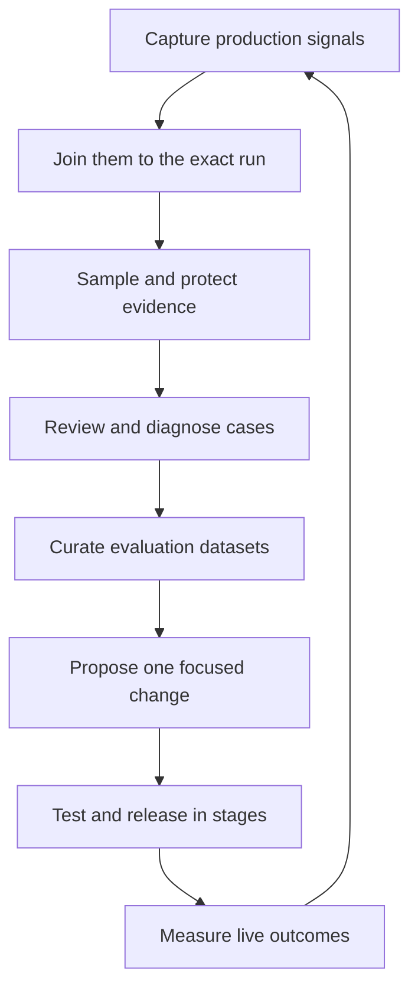
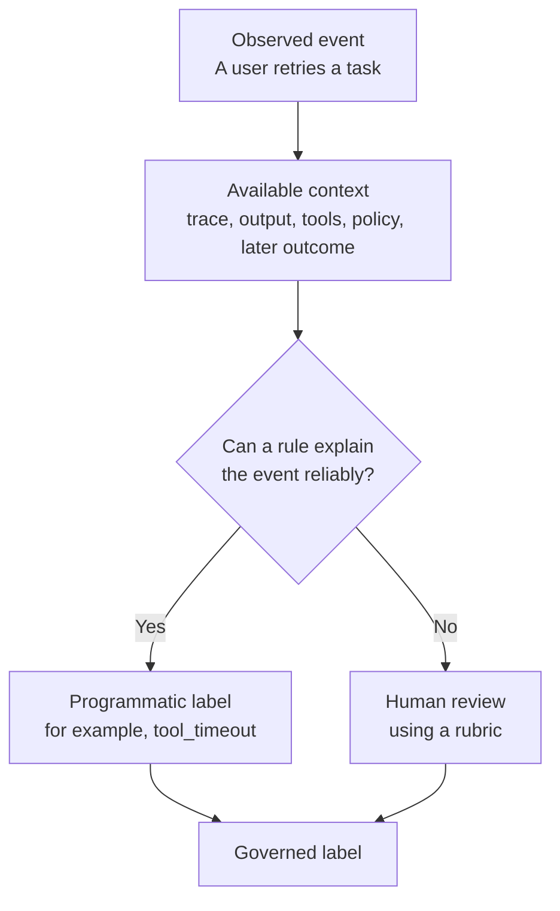
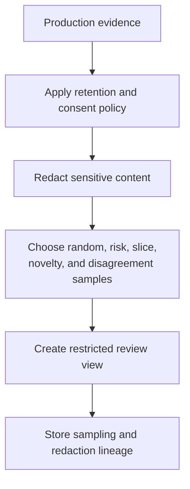
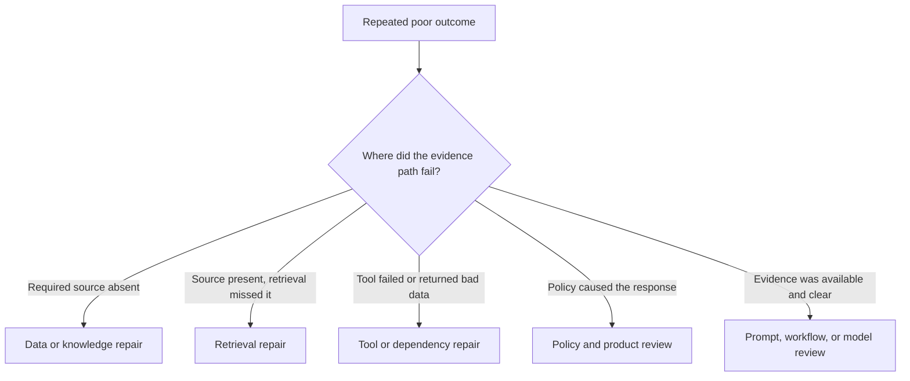
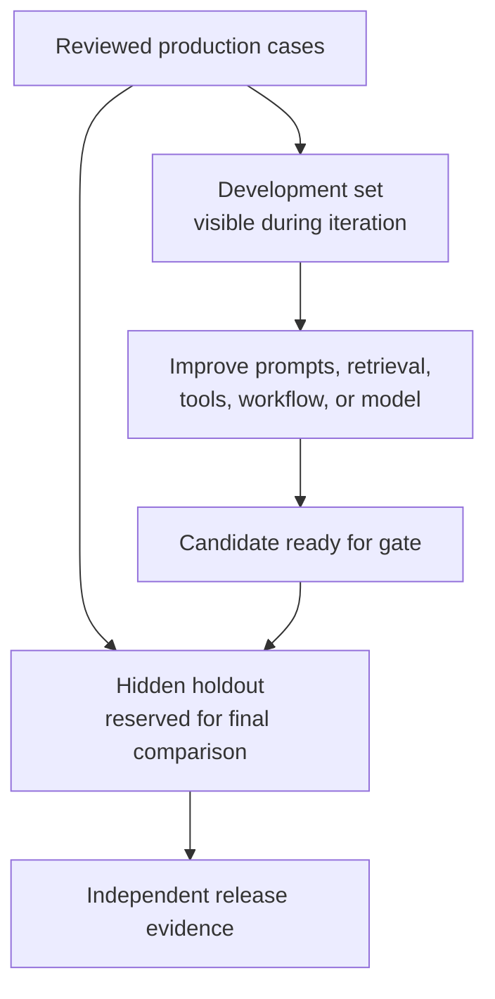
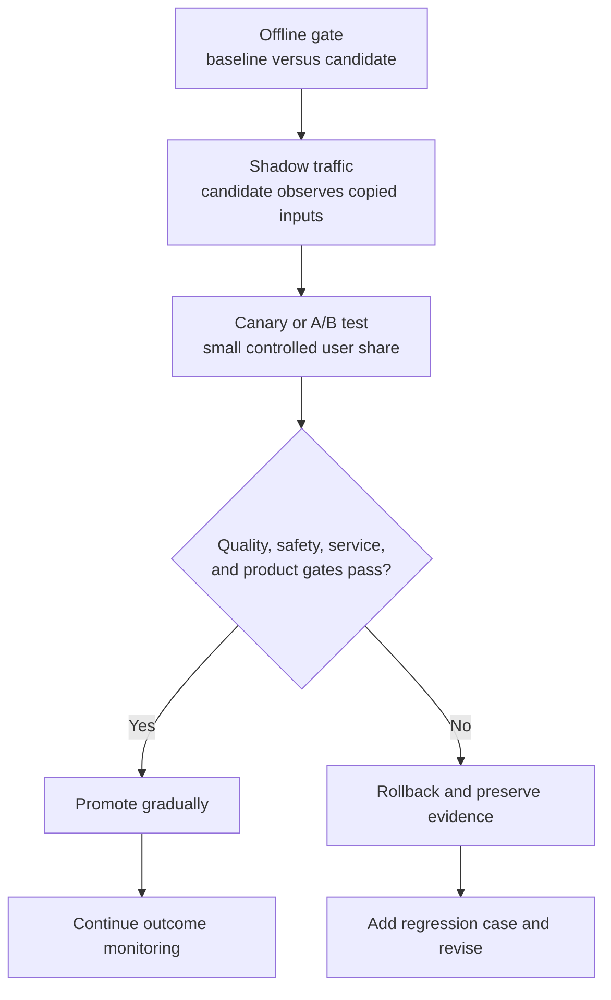
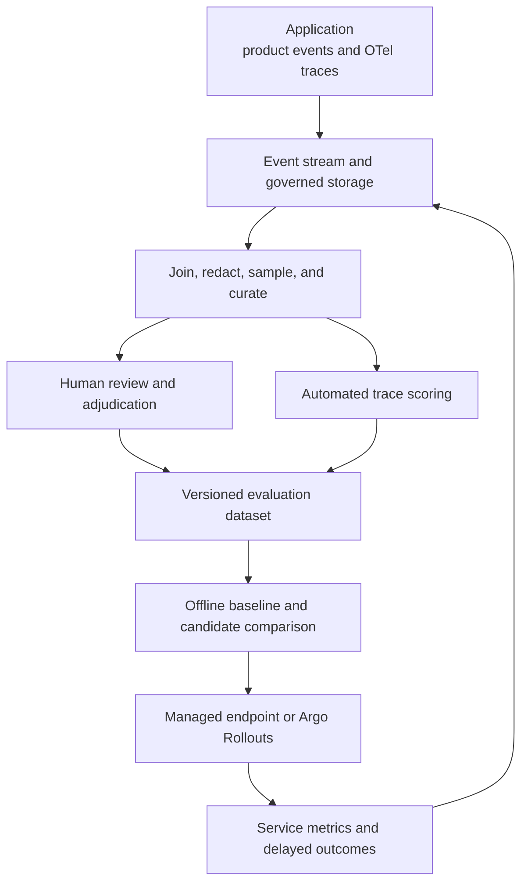

## Table of Contents

1. [What the Feedback Flywheel Is](#what-the-feedback-flywheel-is)
2. [Distinguish Signals, Feedback, And Labels](#distinguish-signals-feedback-and-labels)
3. [Understand Explicit and Implicit Feedback](#understand-explicit-and-implicit-feedback)
4. [Connect Delayed Outcomes to the Right Run](#connect-delayed-outcomes-to-the-right-run)
5. [Sample Useful Evidence Safely](#sample-useful-evidence-safely)
6. [Use Human Review to Create Trustworthy Labels](#use-human-review-to-create-trustworthy-labels)
7. [Group Failures Before Choosing a Fix](#group-failures-before-choosing-a-fix)
8. [Record Where Every Evaluation Case Came From](#record-where-every-evaluation-case-came-from)
9. [Update Offline Evaluations Carefully](#update-offline-evaluations-carefully)
10. [Choose A Fix And Define How To Test It](#choose-a-fix-and-define-how-to-test-it)
11. [Release in Stages and Measure the Result](#release-in-stages-and-measure-the-result)
12. [How Current Production Tools Fit Together](#how-current-production-tools-fit-together)
13. [Measure the Health of the Flywheel](#measure-the-health-of-the-flywheel)
14. [Use Production Feedback To Improve Evaluations And Releases](#use-production-feedback-to-improve-evaluations-and-releases)
15. [References](#references)

## What the Feedback Flywheel Is
<!-- section-summary: A production feedback flywheel turns real product evidence into reviewed evaluation cases, focused changes, controlled releases, and measured improvements. -->

At a high level, a **production feedback flywheel** is the learning system around an AI product. It collects evidence from real use, works out what that evidence means, turns trustworthy cases into evaluations, proposes a focused improvement, and checks the result in production.

The word *flywheel* can make the process sound automatic. In practice, the valuable part is careful judgment. A thumbs-down leaves the cause open. A successful purchase records an outcome without proving that an assistant caused it. A tool error points toward service reliability. Teams first move from observation to explanation. That explanation identifies the responsible area: model behavior, knowledge and retrieval, tools, or product policy.

You can think of the flywheel as eight connected responsibilities:


```mermaid
flowchart TD
    A["Capture production signals"] --> B["Join them to the exact run"]
    B --> C["Sample and protect evidence"]
    C --> D["Review and diagnose cases"]
    D --> E["Curate evaluation datasets"]
    E --> F["Propose one focused change"]
    F --> G["Test and release in stages"]
    G --> H["Measure live outcomes"]
    H --> A

    class A,B,C evidence
    class D,E judgment
    class F,G change
    class H result
```

Each responsibility protects the next one. Weak identifiers make outcome joins unreliable. Biased samples hide quiet users. Vague review labels send engineers toward the wrong component. Leaky evaluation datasets produce impressive scores that disappear in production. A release without a comparison group leaves the team unsure about the effect of its change.

The flywheel therefore serves two goals. It helps the product improve, and it makes the evidence behind each improvement traceable.

## Distinguish Signals, Feedback, And Labels
<!-- section-summary: Production signals record events, feedback expresses a reaction, and labels interpret evidence under a defined rule or rubric. -->

Three words appear throughout feedback systems: **signal**, **feedback**, and **label**. They describe different levels of evidence, from an event the product recorded to an interpretation the team is prepared to use in an evaluation or decision.

A **production signal** is something the system observed. Examples include a retry, an edited answer, a tool timeout, an escalation, a citation click, or a completed task. The event can usually be recorded immediately.

**Feedback** expresses a reaction to an output or experience. A user rating is direct feedback. Replacing an AI-generated paragraph is behavioral feedback. A reviewer’s written correction is expert feedback.

A **label** is an interpretation created under a defined rule. A reviewer may inspect a trace and label the answer `unsupported_claim`. A business rule may label an order `returned_within_window`. Labels can power metrics, evaluation cases, and later training data, so their definitions need versioning.

The distinction matters because the same signal can support several explanations. Consider an assistant that drafts a customer-service response:

- An agent edits the draft heavily. The answer may contain a factual error, use the wrong tone, omit required policy language, or simply differ from the agent’s preferred style.
- The customer reopens the case. The answer may have failed, a delivery may have arrived late, or the customer may have asked a new question.
- The assistant escalates the case. The escalation may be a safe and correct action for a high-risk request.

The event remains useful. Its meaning is uncertain until the team combines it with context and a clear interpretation rule.


```mermaid
flowchart TD
    A["Observed event<br/>A user retries a task"] --> B["Available context<br/>trace, output, tools, policy, later outcome"]
    B --> C{"Can a rule explain<br/>the event reliably?"}
    C -->|"Yes"| D["Programmatic label<br/>for example, tool_timeout"]
    C -->|"No"| E["Human review<br/>using a rubric"]
    D --> F["Governed label"]
    E --> F

    class A,B observed
    class C decision
    class D,E review
    class F result
```

In real systems, a tool timeout is suitable for a deterministic rule because the trace contains the tool result. Helpfulness often needs human judgment because it depends on the user’s goal and the quality of the whole response.

The safest design keeps raw observations separate from interpreted labels. If the rubric changes, the team can relabel the original evidence and compare the old and new definitions.

## Understand Explicit and Implicit Feedback
<!-- section-summary: Explicit feedback states an opinion directly, while implicit feedback infers possible meaning from user behaviour. -->

**Explicit feedback** asks a person to express a judgment. A thumbs-up, a one-to-five rating, a written comment, and an expert review all belong in this group.

Its main advantage is clarity: the system knows that a person intentionally reacted to the output. Its main limitation is participation. People with strong opinions respond more often, rating prompts interrupt the task, and a single score can mix answer quality with price, latency, company policy, or the surrounding product experience.

**Implicit feedback** comes from behaviour. Common signals include:

- accepting, editing, or discarding a generated draft;
- retrying with a new prompt;
- copying a citation;
- abandoning a workflow;
- escalating to a person;
- reopening a resolved case;
- completing or reversing the downstream action.

### Read behaviour in its product context

Implicit signals cover more traffic because they arise during normal product use. Their meaning depends heavily on the workflow.

Suppose a coding assistant proposes a patch. Immediate acceptance suggests usefulness, although the developer may still discover a bug during review. A large edit suggests a mismatch, although the original patch may have supplied a useful structure. A reverted merge is stronger evidence of a problem, especially after the system connects it to the accepted suggestion. Each event describes a different point in the outcome journey.

A practical signal catalog records four properties for every signal:

1. **What happened?** Define the event in observable terms.
2. **What might it mean?** List the interpretations the team expects.
3. **What can confuse it?** Record major sources of ambiguity.
4. **How will it be used?** Choose prevalence reporting, case discovery, review priority, evaluation, or release monitoring.

This catalog prevents a common analytical mistake: treating every available event as a direct quality score.

## Connect Delayed Outcomes to the Right Run
<!-- section-summary: Stable identifiers and point-in-time join rules connect later outcomes to the exact output, model route, prompt, retrieval, tools, and policy involved. -->

Many useful outcomes arrive after the model response. A support case may reopen days later. A purchase may be returned later. A code suggestion may fail in continuous integration after the developer commits it. This is **delayed feedback**.

The system needs to answer a precise question: which model output contributed to this later outcome?

That requires an immutable decision or delivery record. In plain language, the record says, “This is the output the product actually showed or used.” It points back to the full trace and captures every version needed to reproduce the decision.

### Use A Decision Record To Link Outcomes Back To Runs

```yaml
decision_id: decision_8f31
interaction_id: interaction_42c0
trace_id: trace_7ab2
delivered_output_id: response_c19e
model_route: primary
model_version: model_release_17
prompt_version: answer_policy_9
retrieval_version: knowledge_index_12
tool_contract_version: account_tools_4
policy_version: customer_policy_6
delivered_at: event_time
outcome_join_key: governed_case_key
```

This compact record avoids copying an entire conversation into an analytics table. The trace stores detailed execution evidence under tighter access control. The decision record stores the governed identifiers required for joins and comparisons.

A point-in-time join applies a defined attribution window:

```sql
select d.decision_id, d.trace_id, o.outcome_type
from decision_record d
join outcome_event o
  on o.outcome_join_key = d.outcome_join_key
 and o.occurred_at >= d.delivered_at
 and o.occurred_at < d.delivered_at + interval '14 days';
```

The fourteen-day window is a product definition. It should reflect the time in which the output could reasonably affect the outcome. The query also blocks future information from leaking into earlier decisions.

Some joins remain ambiguous. A user may receive three answers before reopening a case. A developer may combine several suggestions in one commit. The pipeline should mark these cases for attribution review or exclude them from automatic model-quality labels. Choosing the nearest event silently would create confident-looking data with weak causal meaning.

Teams monitor the join itself through:

- **join coverage**: the share of eligible outcomes connected to a decision;
- **time to label**: the delay between delivery and the final outcome;
- **ambiguous-join rate**: the share with several plausible decisions;
- **orphan rate**: outcomes or decisions missing their matching record;
- **join-rule version**: the transformation used to create each label.

If a faulty rule attached outcomes to the wrong response, lineage should reveal every derived label, dataset, evaluation run, and training artifact affected by that rule. The team can quarantine those artifacts, repair the join, and rebuild them from source events.

## Sample Useful Evidence Safely
<!-- section-summary: A balanced sampling strategy estimates common quality, discovers rare risks, preserves important slices, and limits privacy exposure. -->

Production systems can generate far more traces than people can review or LLM judges can score. **Sampling** chooses the evidence that enters deeper analysis.

One sampling rule rarely serves every purpose. A useful program combines several queues:

- A **random sample** estimates ordinary production quality.
- A **risk-triggered sample** captures safety events, permission failures, severe tool errors, or costly actions.
- A **behavioural sample** captures retries, large edits, abandonment, and escalation.
- A **slice sample** protects lower-volume languages, routes, tenants, device types, or task categories.
- A **novelty sample** finds unusual topics and new failure shapes.
- A **disagreement sample** collects cases in which rules, LLM judges, and human outcomes differ.
- A **success sample** preserves behaviour that already works well.

Imagine that one product route receives ninety percent of traffic. Pure random sampling will mostly describe that route. A rare high-risk route could remain invisible. Pure failure sampling creates the opposite problem: it produces a useful debugging queue, yet its failure rate cannot represent the whole product. Store the sampling reason and probability with every case so analysts know which estimates require weighting.

Near-duplicate cases also need control. A single upstream outage may produce thousands of nearly identical traces. Clustering those traces and selecting representative examples keeps one incident from dominating the evaluation dataset. The cluster size remains useful as an impact measure.

Privacy starts before review. Collect the fields required for the stated purpose, redact sensitive text, limit tenant access, and give reviewers a purpose-built evidence view. Raw prompts and outputs can contain personal data, secrets, or confidential business context. They should stay out of metric labels and broad dashboards.


```mermaid
flowchart TD
    A["Production evidence"] --> B["Apply retention and consent policy"]
    B --> C["Redact sensitive content"]
    C --> D["Choose random, risk, slice,<br/>novelty, and disagreement samples"]
    D --> E["Create restricted review view"]
    E --> F["Store sampling and redaction lineage"]

    class A source
    class B,C,D,E protect
    class F result
```

Deletion must also travel through the lineage graph. Removing a source trace may require deletion or invalidation of derived review tasks, labels, evaluation cases, and training examples, according to the organization’s retention policy and legal obligations.

## Use Human Review to Create Trustworthy Labels
<!-- section-summary: Human review turns ambiguous production evidence into consistent judgments through clear rubrics, calibrated reviewers, and adjudication. -->

Human review is most valuable for questions that require context: Was the answer supported by the available evidence? Did the assistant follow policy? Was escalation appropriate? Did the response resolve the user’s actual goal?

A good review task gives the reviewer the information needed to answer those questions. For an agentic workflow, this may include the user request, final answer, retrieved sources, tool inputs and results, policy version, and relevant outcome. Showing only the final response forces the reviewer to guess.

### Use A Rubric To Guide Human Review

The **rubric** defines the judgment. Each dimension should explain the positive case, the negative case, and ambiguous boundaries. For example:

```yaml
dimension: citation_support
question: "Do the cited sources support the important factual claims?"
labels:
  supported: "Every important claim is supported."
  partial: "At least one important claim lacks support."
  unsupported: "A cited source conflicts with an important claim."
  cannot_judge: "Required evidence is unavailable."
```

The `cannot_judge` option matters. It separates missing evidence from poor model behavior.

Teams calibrate reviewers on a shared set of examples before large review rounds. Severe or subjective cases can receive two independent reviews. An expert adjudicator resolves disagreements and improves the rubric. Reviewer agreement reveals unclear instructions, difficult cases, or inconsistent standards; it is a property of the labeling process, not a contest between reviewers.

Concrete production tooling follows these responsibilities. Label Studio can import model predictions as preannotations, present source evidence in a review interface, and export completed annotations. Other annotation platforms can fill the same role. The important design choice is the review contract: controlled access, visible evidence, rubric version, reviewer identity, timestamps, and adjudication history.

For pairwise model comparisons, hide the candidate identity and randomize answer order where possible. This reduces preference caused by brand, position, or familiarity. Domain experts should review high-impact legal, medical, financial, or security behavior because general quality raters lack the required expertise.

## Group Failures Before Choosing a Fix
<!-- section-summary: Failure clustering reveals repeated symptoms, while diagnosis assigns the responsible system layer and guides the appropriate repair. -->

Individual cases are useful for debugging. Groups of related cases reveal where engineering effort can have the greatest impact. The team first groups repeated symptoms, then investigates the evidence path and assigns the repair to the system layer that caused the problem.

**Failure clustering** groups cases with similar symptoms, topics, or traces. Embeddings can help discover semantically related answers. Structured trace fields can group tool timeouts, empty retrieval results, missing citations, or policy refusals. A reviewer then checks whether the group represents one meaningful problem.

A cluster is a discovery aid. It is not automatically a root cause. Ten responses may all contain unsupported shipping claims, yet their causes could include missing documents, stale retrieval indexes, failed tools, ambiguous policies, or reasoning errors.

The diagnosis should identify the system layer that owns the repair:


```mermaid
flowchart TD
    A["Repeated poor outcome"] --> B{"Where did the evidence path fail?"}
    B -->|"Required source absent"| C["Data or knowledge repair"]
    B -->|"Source present, retrieval missed it"| D["Retrieval repair"]
    B -->|"Tool failed or returned bad data"| E["Tool or dependency repair"]
    B -->|"Policy caused the response"| F["Policy and product review"]
    B -->|"Evidence was available and clear"| G["Prompt, workflow, or model review"]

    class A problem
    class B decision
    class C,D,E,F,G repair
```

Consider a retrieval-augmented assistant that answers from internal policies. Reviewers find a cluster of unsupported answers about a new returns rule. Trace inspection shows that the policy document never reached the index. A fine-tune would teach the model a temporary policy and hide the ingestion failure. The appropriate solution repairs document ingestion, adds a freshness check, and creates an evaluation case that fails if the current policy cannot be retrieved.

Another cluster may show correct retrieval followed by an answer that repeatedly ignores an explicit exception. That evidence supports a prompt, workflow, or model change. The same visible symptom can therefore lead to a different solution.

## Record Where Every Evaluation Case Came From
<!-- section-summary: A governed evaluation dataset preserves representative behavior, critical regressions, expected outcomes, and links back to reviewed source evidence. -->

An **evaluation dataset** is a collection of inputs and expected judgments used to compare system versions. Production feedback improves the dataset by adding cases that reflect real usage and real failures.

The dataset should contain more than failed outputs. It needs:

- representative everyday tasks;
- critical safety and policy cases;
- newly discovered regression cases;
- important product and user slices;
- successful cases whose behavior must remain stable;
- difficult cases that expose meaningful differences between candidates.

Each row keeps provenance: the source trace or synthetic origin, redaction version, reviewer decision, rubric version, slice, sampling reason, and expected behavior. The expected behavior can be a deterministic condition, a reference answer, a grading rubric, or a required tool sequence.

### Keep A Separate Test Set For Independent Release Decisions

MLflow’s current GenAI dataset APIs support datasets created from production traces or curated examples and preserve source information. LangSmith supports datasets built from curated cases, production traces, and synthetic examples. Provider tools offer similar managed workflows. These products help manage cases; the team still owns the dataset policy and split design.

Related cases need to stay in the same split. If ten near-duplicates from one incident appear across development and holdout sets, the team may tune to one version and appear to generalize on another. Group cases by source incident, task family, or semantic cluster before splitting.

A useful dataset has at least two working areas:


```mermaid
flowchart TD
    A["Reviewed production cases"] --> B["Development set<br/>visible during iteration"]
    A --> C["Hidden holdout<br/>reserved for final comparison"]
    B --> D["Improve prompts, retrieval,<br/>tools, workflow, or model"]
    D --> E["Candidate ready for gate"]
    E --> C
    C --> F["Independent release evidence"]

    class A cases
    class B,C sets
    class D,E work
    class F proof
```

Keep the hidden holdout small enough to maintain and large enough to expose important regressions. Refresh it through a governed process as production behavior changes. Frequent casual inspection turns a holdout into another development set.

## Update Offline Evaluations Carefully
<!-- section-summary: Offline evaluation compares a baseline and candidate on the same governed cases through deterministic checks, human judgments, and calibrated model-based graders. -->

An **offline evaluation** runs a system version against saved cases outside the live user path. It gives the team a controlled place to compare a candidate with the current production baseline.

Start with deterministic checks for facts the system can verify directly: schema validity, required citations, forbidden tool calls, permission boundaries, latency budgets, and exact business rules. These checks are fast, reproducible, and easy to investigate.

Use human review or model-based graders for qualities such as relevance, coherence, groundedness, and instruction following. A model-based grader is useful at scale, although its score is another model output. Teams calibrate it against human judgments, inspect disagreements, version its prompt and model, and keep uncertain or high-impact cases in human review.

### Compare the baseline and candidate on equal terms

OpenAI’s current evaluation guidance recommends task-specific evaluations, production-derived cases, and a mixture of automated metrics and human judgment. Its agent evaluation tools can score final outputs and traces, including tool choices and handoffs. MLflow’s `mlflow.genai.evaluate` evaluates inputs, outputs, and traces with built-in or custom scorers. LangSmith experiments compare versions on datasets and can promote failing production traces into regression cases. Vertex AI’s evaluation service exposes per-row and summary metrics and supports comparison of judge-model ratings with human ratings.

A good comparison asks more than “Did the average score rise?” It checks:

- baseline and candidate on the same dataset;
- results for important slices;
- severe regressions as individual cases;
- scorer and rubric versions;
- sample size and uncertainty;
- latency, token use, and cost;
- changes in tool use and fallback behavior.

Suppose a candidate improves overall helpfulness by answering more directly. The safety slice now contains more policy violations. The aggregate score hides the release blocker. Slice-level gates keep a common improvement from trading away a critical guarantee.

## Choose A Fix And Define How To Test It
<!-- section-summary: A change proposal links one diagnosed problem to an owned system component, an evaluation target, protected metrics, and a rollback plan. -->

The feedback flywheel should produce focused engineering decisions. A change proposal connects one diagnosed production problem to one owned repair and defines the proof required for release. This keeps a broad collection of feedback from turning into an equally broad list of unrelated experiments.

1. the observed failure and affected slice;
2. the evidence supporting the diagnosis;
3. the component that owns the failure;
4. the proposed change;
5. the expected improvement;
6. the metrics and behaviors that must remain stable;
7. the offline gate, rollout plan, and rollback condition.

For example, trace review may show that an agent calls a search tool repeatedly after receiving a clear `permission_denied` result. The proposal could change the workflow to stop retrying, explain the access limit, and route eligible requests to approval. The offline suite should verify the stop condition, user explanation, and escalation path. Production monitoring should check permission-denied retries, completion rate, escalation volume, latency, and user feedback.

This structure keeps the solution connected to the diagnosis. A model change needs evidence of a model-level gap. A missing knowledge source needs ingestion and retrieval work. An unreliable API needs service engineering. A restrictive business policy needs product and governance review.

## Release in Stages and Measure the Result
<!-- section-summary: Progressive delivery moves a candidate through offline gates, shadow traffic, limited live traffic, and promotion using explicit rollback conditions. -->

Passing offline evaluations makes a candidate eligible for production testing. Live systems introduce user mix, dependency behavior, traffic patterns, and delayed outcomes that saved datasets cannot reproduce fully.

A common release path has four stages:


```mermaid
flowchart TD
    A["Offline gate<br/>baseline versus candidate"] --> B["Shadow traffic<br/>candidate observes copied inputs"]
    B --> C["Canary or A/B test<br/>small controlled user share"]
    C --> D{"Quality, safety, service,<br/>and product gates pass?"}
    D -->|"Yes"| E["Promote gradually"]
    D -->|"No"| F["Rollback and preserve evidence"]
    E --> G["Continue outcome monitoring"]
    F --> H["Add regression case and revise"]

    class A,B,C test
    class D decision
    class E,G success
    class F,H stop
```

A **shadow release** runs the candidate on copied traffic and discards its output. It reveals latency, errors, tool behavior, and output differences without changing the user experience. It cannot measure real user outcomes because users never see the candidate answer.

A **canary release** serves the candidate to a small controlled share. An A/B test uses stable assignment to compare variants. These stages can measure product outcomes, provided the assignment and attribution rules remain valid.

### Use Immediate Release Gates And Delayed Outcome Checks

Delayed outcomes require an observation window. A canary that looks healthy after one hour may still increase returns or reopened cases several days later. Teams define immediate gates for safety, errors, latency, and cost, plus delayed gates for business and quality outcomes.

On Kubernetes, Argo Rollouts can shift traffic in steps, pause between steps, run metric analysis, and abort a canary after a failed check. Managed model endpoints offer provider-specific traffic splitting and monitoring. The platform automates the rollout mechanics; the team supplies meaningful metrics, thresholds, observation windows, and rollback decisions.

The production comparison should use the same version dimensions stored in the decision record: model, prompt, retrieval, tools, policy, and route. Otherwise, the candidate group may silently contain several different systems.

## How Current Production Tools Fit Together
<!-- section-summary: Industrial tools support individual flywheel responsibilities, while the architecture keeps capture, review, evaluation, release, and monitoring loosely coupled. -->

The framework comes first because products change faster than the responsibilities. A production implementation usually combines several systems. Each system should own a clear part of the evidence lifecycle and pass stable identifiers, versions, and lineage to the next part.

### Capture and trace the run

OpenTelemetry provides vendor-neutral telemetry APIs and SDKs. Its GenAI semantic conventions describe model, agent, and tool activity. Detailed prompt and response content is sensitive, so teams configure content capture and access deliberately. Structured product events often travel through an event stream into a governed warehouse or lakehouse. Kafka, Amazon Kinesis, and Google Cloud Pub/Sub are common event-stream choices. BigQuery, Snowflake, and Delta Lake are common analytical destinations.

### Join and curate evidence

Airflow or Dagster can schedule delayed-outcome joins and dataset builds. Spark, SQL, or dbt can implement transformations for quality checks and redaction. The storage layer holds durable versions under governed access; Delta Lake, Apache Iceberg, BigQuery, and Snowflake are common choices. Together, these components provide point-in-time joins and reproducible lineage.

### Review ambiguous cases

Label Studio provides configurable labeling interfaces, model preannotations, reviewer annotations, and export. Managed annotation products can provide equivalent review queues. The platform presents the task, while the organization owns rubric design, reviewer calibration, and adjudication.

### Manage offline and production evaluation

MLflow 3 supports production traces and feedback assessments. Its current GenAI APIs also provide datasets, scorers, and offline evaluation. LangSmith connects traces and online evaluators to datasets and offline experiments for LangChain and other instrumented applications.

OpenAI’s current agent evaluation tools support datasets, graders, trace grading, and evaluation runs. The documentation navigation classifies the Evals API under Legacy APIs. The agent-evals guide still directs advanced workflows to Evals alongside datasets. Both parts of the documentation inform capability selection. Vertex AI offers managed GenAI evaluation with summary and per-example results.

MLflow can run automatic evaluations over sampled traces with filters and asynchronous model-based scorers. Databricks exposes this MLflow 3 production-monitoring workflow as a Beta capability, so production adoption should account for that maturity level. LangSmith can also apply online evaluators to sampled or filtered traces.

### Release and observe the candidate

Managed endpoints can split traffic between model versions. Kubernetes teams often use Argo Rollouts for canary and blue-green delivery with automated analysis. Immediate service gates can come from Prometheus and Grafana, an OpenTelemetry backend, or a cloud monitoring service. Product-event stores supply delayed outcome measures.

One practical architecture looks like this:


```mermaid
flowchart TD
    A["Application<br/>product events and OTel traces"] --> B["Event stream and governed storage"]
    B --> C["Join, redact, sample, and curate"]
    C --> D["Human review and adjudication"]
    C --> E["Automated trace scoring"]
    D --> F["Versioned evaluation dataset"]
    E --> F
    F --> G["Offline baseline and candidate comparison"]
    G --> H["Managed endpoint or Argo Rollouts"]
    H --> I["Service metrics and delayed outcomes"]
    I --> B

    class A,B,C capture
    class D,E,F assess
    class G,H change
    class I outcome
```

No single product needs to own the entire loop. Stable identifiers and versioned contracts let teams replace a review tool, evaluator, or rollout controller without losing provenance.

## Measure the Health of the Flywheel
<!-- section-summary: Flywheel metrics reveal whether production evidence reaches decisions quickly, consistently, and with enough coverage to improve the product. -->

A feedback program can collect millions of events and still produce little improvement. Its own operating metrics should show whether collected evidence leads to reviewed cases, owned repairs, controlled releases, and verified outcomes.

Useful measures include:

- **Outcome join coverage:** How much eligible feedback reaches the correct decision record?
- **Label latency:** How long does evidence wait for its final label?
- **Reviewer agreement:** Which rubric dimensions produce consistent judgments?
- **Review backlog age:** Are high-severity cases waiting too long?
- **Slice coverage:** Do evaluation datasets represent important user and task groups?
- **Cluster actionability:** How many recurring clusters receive a verified owner and diagnosis?
- **Regression escape rate:** How often does a known failure return to production?
- **Production verification rate:** How many shipped changes achieve their target outcome under the release measurement plan?

Read these measures together as a pipeline. Low join coverage means later stages see incomplete evidence. High reviewer disagreement weakens dataset quality. A growing review backlog delays protection. Strong offline scores with frequent production escapes point to missing cases, weak release gates, or changing traffic.

Consider a team that adds many regression cases each week, yet only a small share of proposed fixes reaches a controlled rollout. The bottleneck sits between evaluation and release. Another team may ship changes quickly while delayed outcomes remain unjoined. That team can measure operational speed, but it cannot reliably claim product improvement.

The most useful feedback report follows a small number of important changes from source evidence to production outcome. Volume measures support that story; they do not replace it.

## Use Production Feedback To Improve Evaluations And Releases
<!-- section-summary: A trustworthy feedback flywheel preserves the chain from observation to interpretation, evaluation, release, and verified outcome. -->

Production feedback creates value through a governed evidence lifecycle. Signals record what happened. Stable identifiers connect later outcomes to the exact system run. Sampling and privacy controls select safe, representative evidence. Human review and deterministic rules turn ambiguous events into labels. Failure diagnosis directs work to the responsible system layer. Curated datasets convert reviewed cases into repeatable evaluations. Progressive delivery tests the change with real traffic, and monitoring verifies the intended outcome.

In essence, the flywheel is a way to learn from production without confusing activity with truth. Its output is a traceable engineering decision backed by evidence.

## References

- [OpenAI: Evaluation best practices](https://developers.openai.com/api/docs/guides/evaluation-best-practices)
- [OpenAI: Agent evals](https://developers.openai.com/api/docs/guides/agent-evals)
- [MLflow: Evaluation datasets](https://mlflow.org/docs/latest/genai/datasets/)
- [MLflow: Evaluate production traces](https://mlflow.org/docs/latest/genai/eval-monitor/running-evaluation/traces/)
- [MLflow: Feedback assessments](https://mlflow.org/docs/latest/genai/assessments/feedback/)
- [MLflow: Automatic evaluations](https://mlflow.org/docs/latest/genai/eval-monitor/automatic-evaluations/)
- [LangSmith: Evaluation concepts](https://docs.langchain.com/langsmith/evaluation)
- [Label Studio: Connect a model and use predictions](https://labelstud.io/guide/ml.html)
- [Label Studio: Export annotations](https://labelstud.io/guide/export.html)
- [Vertex AI: View GenAI evaluation results](https://docs.cloud.google.com/vertex-ai/generative-ai/docs/models/eval-python-sdk/view-evaluation)
- [Vertex AI: Evaluate a judge model](https://docs.cloud.google.com/vertex-ai/generative-ai/docs/models/evaluate-judge-model)
- [Databricks: MLflow 3 production monitoring for GenAI](https://docs.databricks.com/gcp/en/mlflow3/genai/eval-monitor/production-monitoring)
- [OpenTelemetry: GenAI semantic conventions](https://github.com/open-telemetry/semantic-conventions-genai)
- [Argo Rollouts: Analysis and progressive delivery](https://argo-rollouts.readthedocs.io/en/stable/features/analysis/)
- [NIST AI Risk Management Framework](https://www.nist.gov/itl/ai-risk-management-framework)
