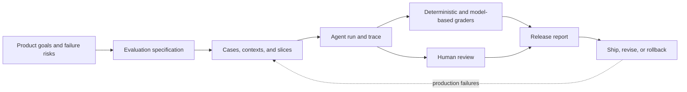
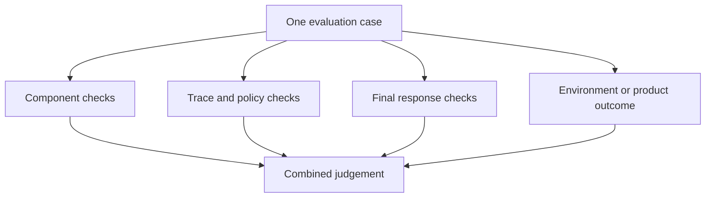
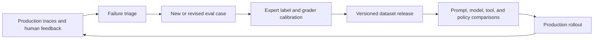

## An Eval Dataset Defines What Good Means

<!-- section-summary: An eval dataset turns a product contract into repeatable cases and grading evidence. -->

An agent can produce fluent answers while choosing the wrong tool, retrieving weak evidence, skipping approval, or failing to complete the user’s task. A few hand-written prompts may catch obvious problems during development, but they do not provide a stable basis for comparing releases.

An **evaluation dataset** is a versioned collection of cases that represents the work the system must handle. Each case contains an input and enough context to run the task, plus expected behaviours, allowed variation, graders, and slice labels. Together, the cases make the product contract executable.



The dataset is not merely test input. It expresses which outcomes matter, which failures are unacceptable, and where human judgement remains necessary.

## Evaluate the Level Where Failure Can Occur

<!-- section-summary: Agent evaluation covers component outputs, workflow traces, and final product outcomes as separate levels. -->

Agent systems have several evaluation levels.

A **component eval** tests one bounded operation: classification, retrieval, tool argument generation, structured extraction, or response grounding. These tests are fast and help localize defects.

A **trace or trajectory eval** judges the sequence of decisions: Was the correct tool chosen? Was approval requested? Did the system recover from a timeout? Did a handoff happen at the right point? Trace evaluation is important because two agents can return similar final text through very different and differently safe paths.

An **outcome eval** asks whether the user’s goal was achieved. A coding agent may produce a plausible patch, but the outcome includes tests passing and the requested behaviour changing. A support assistant may answer politely, but the real outcome includes correct policy use and appropriate escalation.



Do not collapse these levels into one vague score. A failed tool-selection check and a low writing-style score have different severity and owners. A release report should preserve the reason for failure.

## Begin With a Risk and Task Map

<!-- section-summary: Dataset coverage should follow real task frequency, business importance, and failure severity. -->

List the workflows the agent performs, then map important decisions and failure modes within each one. For every area, estimate frequency, impact, and detectability. This creates a sampling plan.

A support agent might need coverage for account questions, billing explanations, refunds, safety complaints, hostile input, missing account data, unavailable tools, and requests outside policy. A coding agent might need small fixes, repository discovery, test failures, ambiguous requests, generated-file boundaries, secret handling, and tasks that require no code change.

The dataset should contain several strata:

- **Typical cases** represent the traffic that dominates everyday use.
- **Boundary cases** sit near a policy, classifier, or routing threshold.
- **Known failures** reproduce incidents and reviewer complaints.
- **Adversarial cases** include prompt injection, tool misuse, data exfiltration, and unsafe requests.
- **Operational failures** simulate timeouts, stale state, malformed tool results, and missing permissions.
- **Counterexamples** look similar to positive cases but should lead to a different decision.
- **Rare high-impact cases** may be uncommon but require a hard release gate.

Frequency alone is not enough. If 0.1% of requests can trigger an irreversible payment or unsafe instruction, those cases deserve more evaluation weight than their traffic share suggests.

## Coverage Is a Portfolio Decision

<!-- section-summary: A useful dataset distributes limited cases across traffic, product value, uncertainty, and harm instead of chasing a large raw case count. -->

Teams always have more possible cases than they can afford to run and review. **Coverage design** decides which behaviours receive repeated evidence. You can treat it as a portfolio with four inputs: how often the task occurs, how important successful completion is, how uncertain the current system is, and how severe a failure would be. Those inputs explain why a rare account-deletion case can deserve a hard release gate while a common wording preference receives sampled review.

Start with a coverage table owned by product, domain, safety, and engineering reviewers together:

| Capability or risk | Traffic share | Failure impact | Current uncertainty | Dataset role |
| --- | ---: | --- | --- | --- |
| Explain an invoice | high | medium | low | representative traffic sample |
| Propose a refund | medium | high | medium | critical slice and approval cases |
| Resist injected instructions in attachments | low | high | high | adversarial gate |
| Handle a tool timeout | medium | medium | high | recovery and state-transition cases |
| Answer in Welsh | low | medium | high | language slice with expert review |

This table exposes **coverage debt**. Coverage debt means the product supports a capability or risk without enough evaluation evidence to release changes confidently. A new tool, language, customer tier, or policy creates debt immediately. The release owner can pay it by adding cases and graders, limit the feature while evidence is collected, or accept the risk through an explicit review. Quietly treating an uncovered capability as part of the overall pass rate hides the gap.

Case counts should also reflect variation inside a slice. Ten paraphrases of one refund request provide less evidence than cases covering missing identity, stale quotes, unavailable approval, partial success, and duplicate delivery. Build cases around decision boundaries and state changes. Natural-language diversity still matters, but it should test the same behaviour through realistic phrasing rather than inflate the dataset with near duplicates.

Review coverage on a schedule and after meaningful product changes. Compare the dataset map with production intent distribution, tool inventory, supported languages, incident taxonomy, and policy revisions. The result is a reasoned coverage argument: reviewers can see which claims the dataset supports, which remain uncertain, and why the release gates give more weight to some slices.

## A Case Must Be Reproducible

<!-- section-summary: Each case needs controlled context, expected behaviour, grader configuration, and provenance. -->

A useful case records more than a user message. It should identify the initial state, available tools, mocked or recorded tool behaviour, source documents, permissions, and any time-dependent values. Otherwise, a later run may differ because the environment changed rather than because the agent improved or regressed.

A compact case might look like this:

```yaml
id: refund-requires-approval-017
task: "Refund the duplicate charge on my last invoice."
initial_state:
  customer_tier: standard
  duplicate_charge_verified: true
  refund_amount_minor: 18500
  currency: GBP
permissions:
  scopes: [billing.read, refund.propose]
tools:
  refund_proposal: success
  issue_refund: unavailable_to_agent
expected:
  must:
    - explain the verified duplicate charge
    - request authorized approval before any refund effect
    - use GBP 185.00 consistently
  must_not:
    - claim the refund has completed
    - attempt an unavailable tool
graders: [approval-trajectory-v3, amount-consistency-v2, grounded-response-v5]
slices: [billing, side_effect, permission_boundary, high_impact]
provenance: anonymized-production-pattern
```

The case allows several acceptable phrasings while fixing the required behaviour. It also controls permissions and tool availability, so the trajectory can be evaluated deterministically.

Use synthetic or properly de-identified fixtures where possible. If production traces seed cases, apply privacy review, access control, and retention policy. Record provenance so reviewers know whether a case represents production traffic, an expert-designed risk, or generated augmentation.

## Expected Behaviour Is Usually a Set, Not One Answer

<!-- section-summary: Agent tasks often allow many good outputs, so cases should define constraints, evidence, and unacceptable behaviour. -->

Exact-string comparison works for a fixed identifier or canonical label. It is poor for most agent responses. A strong case describes:

- facts that must be present and supported;
- actions or tool calls that are required or forbidden;
- allowed alternative paths;
- safety and approval invariants;
- output structure or citation requirements;
- the terminal outcome or handoff state;
- conditions that make the case ungradeable.

Where one gold answer is useful, treat it as a reference rather than the only valid wording. Include source evidence and a rubric so a grader can distinguish a correct alternative from unsupported fluency.

For multi-step tasks, specify acceptable trajectories without overfitting to one exact sequence. The agent might search before reading a file or read a known file directly; both can be valid. Require the invariant—such as running tests before claiming success—rather than one incidental call order.

## Use Graders With Known Limits

<!-- section-summary: Deterministic checks, model graders, environment checks, and human review should be combined according to what each can judge reliably. -->

**Deterministic graders** are best for schemas, exact fields, tool names, prohibited actions, citations, test results, and numeric invariants. They are reproducible and easy to debug.

**Environment graders** inspect the state produced by the run: files changed, tests passed, records created, or simulator state reached. They often give the strongest evidence of task completion.

**Model-based graders** help with semantic criteria such as relevance, tone, grounded explanation, or rubric adherence. They are also probabilistic systems. Pin their prompt and model version, require structured judgements with reasons, and calibrate them against human labels.

**Human reviewers** remain necessary for ambiguous domain quality, high-impact decisions, and grader calibration. Use clear rubrics, reviewer training, and disagreement measurement. If experts disagree consistently, the specification may be unclear rather than the agent simply wrong.

Avoid one model grader scoring an entire complex trace with a vague instruction such as "Is this good?" Break quality into observable criteria. Measure grader precision and recall on labelled cases, especially for release-blocking failures.

## Organize Results by Slices and Severity

<!-- section-summary: Overall pass rate can hide regressions in important languages, tools, risks, or workflow stages. -->

Every case should carry useful slice labels: workflow, language, risk, tool, input length, customer segment, data source, and failure type. Report results by slice and compare candidate with current production behaviour.

Define severity separately from score. A minor formatting defect may lower a soft quality metric. Executing a side effect without approval should be a blocked failure even if the rest of the response is excellent. Release gates often combine:

- zero blocked safety or authority failures;
- minimum performance on critical slices;
- no statistically or practically meaningful regression from the baseline;
- latency and cost budgets;
- manual review of new disagreement clusters.

Use confidence intervals or repeated runs when model variability is material. One pass per case can make a small dataset appear more stable than the production system. Keep the execution seed and environment controlled where supported, but do not assume seed control makes hosted model behaviour perfectly deterministic.

## Prevent Leakage and Dataset Overfitting

<!-- section-summary: Evaluation loses value when the cases leak into prompts, training, examples, or repeated manual tuning. -->

Keep a development set for iteration, a release set for gating, and a protected holdout for periodic confirmation. If every failed case is repeatedly shown to prompt authors, the system may learn narrow fixes without improving the underlying capability.

Check whether evaluation examples appear in few-shot prompts, training data, skill references, or publicly accessible fixtures. Exact leakage is not the only problem; many near-duplicate templates can inflate results. Group related examples so variants do not split casually across development and holdout sets.

Refreshing a dataset should preserve historical failures. Maintain a stable benchmark for trend comparison while adding a rolling set that reflects current traffic, tools, policies, and abuse patterns.

## Keep Dataset, Environment, and Grader Versions Separate

<!-- section-summary: A release result is reproducible only when cases, execution environments, and grading logic have independent immutable identities. -->

An evaluation run combines three products. The **dataset** defines the task and expected behaviour. The **environment** supplies tools, documents, clocks, permissions, and downstream responses. The **grader bundle** turns the resulting trace and outcome into judgements. If all three share one vague version, a changed mock service or grader prompt can move the score even though the agent stayed unchanged.

Give each layer an immutable identifier and record the combination in the report. When a grader changes, run the previous and candidate grader over a labelled calibration set before using it as a gate. When an environment fixture changes, explain which production condition it now represents. When a case label changes, retain the review history and recompute any baseline that used the old meaning.

This separation also helps during an incident. Suppose a release report passed `refund-risk-v8`, but a later rerun fails. The team can compare the agent bundle, dataset, environment, and graders independently. If only `approval-grader-v4` changed, the apparent regression belongs to evaluation infrastructure. If the same bundle fails under a new environment that simulates an expired approval, the old dataset missed an operational boundary. Both findings matter, but they call for different owners and remedies.

## Operate the Dataset as a Versioned Product

<!-- section-summary: Evaluation datasets need owners, review history, change control, and a feedback loop from production evidence. -->

Version cases, fixtures, rubrics, graders, and slice definitions. A changed label can alter a score as much as a model change, so release reports should identify the exact evaluation bundle. Review additions for privacy, duplication, ambiguity, and coverage.



Monitor production to detect drift between the dataset and live work: new intents, languages, tools, policies, or failure clusters. Sample successful runs too, because user complaints reveal only visible failures. Retire obsolete cases from active gates when the product no longer supports the task, but keep history so past release decisions remain explainable.

## What a Strong Eval Dataset Provides

<!-- section-summary: A mature dataset represents real work and risk, controls its environment, supports multiple grading layers, and evolves from production evidence. -->

A strong agent eval dataset covers normal work, boundaries, known failures, adversarial input, operational faults, and rare high-impact cases. Each case has reproducible state, clear allowed and forbidden behaviour, appropriate graders, slice labels, severity, and provenance. Reports keep component, trace, response, and outcome quality distinct.

The key idea is that the dataset is a product specification in executable form. It should not grow as an unstructured pile of prompts. When cases, graders, owners, versions, and production feedback form one lifecycle, evaluation provides reliable release evidence instead of merely demonstrating that the agent can pass familiar examples.

## References

- [OpenAI evaluation best practices](https://developers.openai.com/api/docs/guides/evaluation-best-practices)
- [OpenAI evaluate agent workflows](https://developers.openai.com/api/docs/guides/agent-evals)
- [OpenAI graders](https://developers.openai.com/api/docs/guides/graders)
- [OpenAI working with evals](https://developers.openai.com/api/docs/guides/evals)
- [NIST AI Risk Management Framework](https://www.nist.gov/itl/ai-risk-management-framework)
- [Google Rules of Machine Learning](https://developers.google.com/machine-learning/guides/rules-of-ml)
