## Table of Contents

1. [An Agent Eval Dataset Recreates Real Work](#an-agent-eval-dataset-recreates-real-work)
2. [The Objects Inside an Eval Case](#the-objects-inside-an-eval-case)
3. [Good Cases Come From Several Evidence Sources](#good-cases-come-from-several-evidence-sources)
4. [Coverage Needs Strata and a Failure Taxonomy](#coverage-needs-strata-and-a-failure-taxonomy)
5. [Deterministic Environments Make Runs Comparable](#deterministic-environments-make-runs-comparable)
6. [Multi-Turn Cases Need State and Time](#multi-turn-cases-need-state-and-time)
7. [Expected Behaviour Can Allow Several Good Answers](#expected-behaviour-can-allow-several-good-answers)
8. [Choose Graders for the Claim Being Tested](#choose-graders-for-the-claim-being-tested)
9. [Leakage Can Manufacture an Improvement](#leakage-can-manufacture-an-improvement)
10. [Frozen and Rolling Suites Answer Different Questions](#frozen-and-rolling-suites-answer-different-questions)
11. [Privacy and Governance Begin During Case Creation](#privacy-and-governance-begin-during-case-creation)
12. [Version the Whole Evaluation Bundle](#version-the-whole-evaluation-bundle)
13. [Connect the Dataset to Industrial Eval Infrastructure](#connect-the-dataset-to-industrial-eval-infrastructure)
14. [Operate the Dataset as a Product](#operate-the-dataset-as-a-product)
15. [References](#references)

## An Agent Eval Dataset Recreates Real Work

<!-- section-summary: Agent evaluation needs tasks, state, tools, decisions, and outcomes because a prompt-and-answer holdout sees only a small part of the system. -->

At a high level, an **agent eval dataset** is a collection of controlled work situations used to measure an agent. Each situation tells the evaluator what the user wants, what the agent can see, which tools it can use, how those tools behave, and what a successful result looks like. You can think of it as a test track that recreates the important parts of production without allowing the run to change real customer data.

A normal model holdout usually contains an input and a target. For example, a classifier receives an email and the target says `billing`. That structure works well if the model’s only responsibility is choosing a label. An agent has a larger job. It may read account state, call a billing tool, ask for approval, retry a failed request, and explain the final result. The final sentence can look correct even though the agent used the wrong account, skipped approval, or merely claimed that a tool succeeded.

Consider a calendar agent asked to move a meeting. A useful eval case establishes the meeting and available times first. It also fixes the caller’s permissions and the behaviour of the calendar API. Success may require a conflict check and confirmation before the agent updates exactly one event. The final response must then report the new time. A reference answer alone cannot prove that those actions happened.

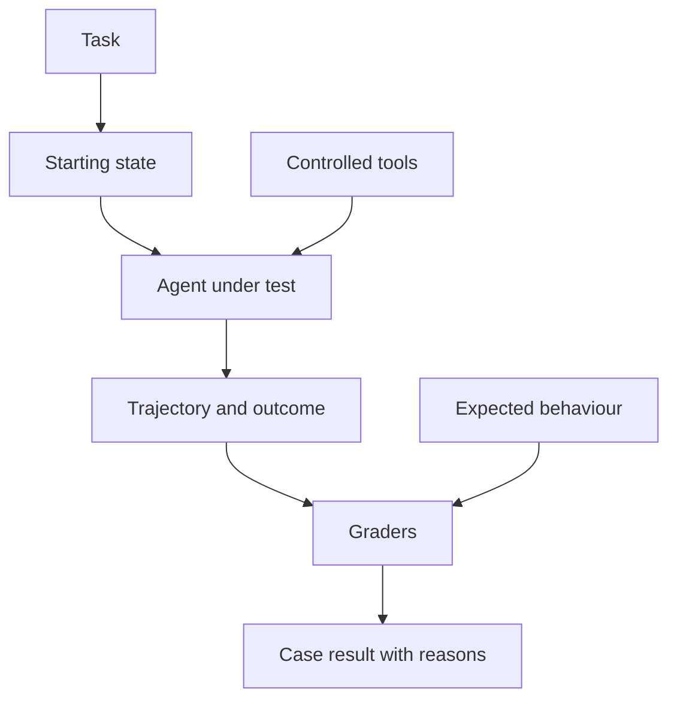
```mermaid
flowchart TD
    A["Task"] --> B["Starting state"]
    B --> C["Agent under test"]
    D["Controlled tools"] --> C
    C --> E["Trajectory and outcome"]
    E --> G["Graders"]
    F["Expected behaviour"] --> G
    G --> H["Case result with reasons"]
```

This wider boundary explains why agent eval datasets resemble system-test specifications. They still contain prompts and references, but they also preserve the world around the prompt. OpenAI’s current agent evaluation guidance uses the same broad view: traces capture model calls, tool calls, guardrails, and handoffs, while graders judge behaviour across the run.

The dataset therefore supports a precise claim. It might show that an agent completes common scheduling tasks, respects approval boundaries, and recovers safely from a calendar timeout. It cannot prove that the agent is “generally good.” Every result is limited by the tasks, environments, and risks represented in the cases.

## The Objects Inside an Eval Case

<!-- section-summary: A reproducible case separates the requested task, starting state, tool environment, run trajectory, expected evidence, final outcome, and graders. -->

The word *dataset* can make agent evaluation sound like a spreadsheet of prompts. In practice, a single row may point to several files and services. Separating the objects shows which change caused a score to move and which owner should investigate it.

### The case is the container

A **case** is one reproducible test situation with a stable identifier. It groups the task, fixtures, expected behaviour, graders, provenance, and slice labels. A case can run many times against different agent versions. The case itself should stay unchanged during a comparison.

### The task says what the user is trying to achieve

The **task** includes the user request and any conversation history that legitimately belongs to the request. It also states the completion boundary. “Help with this invoice” is too vague for reliable grading. “Explain the duplicate charge and prepare a refund request if policy permits” tells reviewers which work the agent owns.

### The starting state and tool environment recreate the world

The **starting state** contains records, documents, files, permissions, feature flags, and time-dependent facts available at the beginning. The **tool environment** defines the callable tools and their behaviour. It may use a simulator, a disposable sandbox, or recorded responses with sensitive data removed. Tool schemas alone are insufficient because the same `issue_refund` call can succeed, time out, reject a permission, or report an already-completed operation.

### The trajectory records the path

A **trajectory**, also called a trace, is the ordered record produced by the run: model decisions, tool calls, tool results, handoffs, guardrails, and relevant state changes. It answers questions such as “Did the agent verify the account before proposing the refund?” The dataset may contain a reviewed reference trace, though many cases allow several safe paths.

### References and labels describe known evidence

A **reference** can supply trusted facts or a sample answer. It can also preserve an accepted plan or an expert judgement. A **label** records a decision such as `pass`, `unsafe_action`, or `needs_review`. References help graders, yet they should never force one exact wording if several answers satisfy the task.

### The outcome describes the result that matters

The **outcome** covers the terminal response and the environment after the run. For a coding task, the outcome can include a patch and passing tests. For a support task, it may include a correctly created escalation record. This is the closest layer to the user’s actual goal.

### Graders turn evidence into judgements

A **grader** reads some part of the case and run, then returns a score or label with a reason. Different graders inspect different evidence. A schema check reads the output. A policy grader reads the trace. An environment grader inspects the final sandbox. A human reviewer may resolve cases whose quality depends on domain judgement.

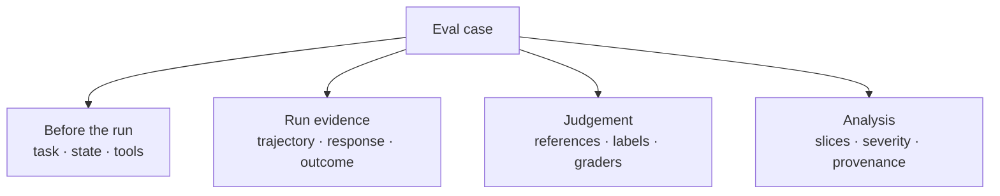
```mermaid
flowchart TD
    A["Eval case"] --> B["Before the run<br/>task · state · tools"]
    A --> C["Run evidence<br/>trajectory · response · outcome"]
    A --> D["Judgement<br/>references · labels · graders"]
    A --> E["Analysis<br/>slices · severity · provenance"]
```

Keeping these objects separate prevents a common source of confusion. A poor outcome may come from the agent, a broken fixture, an incorrect label, or a grader change. Separate identities let the team find the correct owner.

## Good Cases Come From Several Evidence Sources

<!-- section-summary: Production traces, incidents, expert design, and reviewed synthetic generation contribute different kinds of evidence. -->

A dataset built from one source inherits that source’s blind spots. Production traffic reflects real language and real workflows, but it rarely contains enough rare safety failures. Expert cases cover important rules, but experts may write cleaner prompts than users. Synthetic generation can explore variations quickly, but it can repeat the assumptions embedded in its seed examples.

### Production traces reveal actual use

Sample both successful and unsuccessful traces. Complaints and thumbs-down signals are valuable, yet they mainly reveal visible failures. Successful traces show common intents, natural phrasing, tool combinations, and the paths users already depend on. Useful selection signals include manual feedback, long latency, repeated tool calls, guardrail activation, abandonment, and unusually high cost.

A trace supplies raw evidence for a case. Converting it into a safe fixture requires removing unnecessary personal data and replacing live identifiers. The documents and tool responses also need frozen versions. A domain reviewer can then define the expected behaviour. The result should replay safely without access to the original account.

### Incidents preserve expensive lessons

An incident case preserves a failure that mattered. The source may be an unauthorized action, a bad handoff, an incorrect policy answer, or a timeout that caused duplicate work. Reconstruct the smallest state that still produces the failure. Add the case to a protected regression suite and record the incident category as provenance. This creates a durable test for the underlying control, even after production logs expire.

### Experts design boundaries before production finds them

Domain, safety, security, and operations experts can describe situations that have low traffic and high impact. A payments reviewer may design cases around approval thresholds. A security reviewer may embed instructions inside an untrusted document. An operations engineer may simulate a tool that succeeds but returns its acknowledgement late. These cases test boundaries that ordinary sampling can miss.

### Synthetic generation expands a reviewed seed

Synthetic cases are useful for paraphrases, language variants, long-context combinations, malformed tool results, and adversarial mutations. Begin with trusted seed cases and ask the generator to vary named dimensions. Deduplicate the output, run basic validity checks, and review a sample from every generated slice. A generated expectation should never become ground truth solely because another model wrote it.

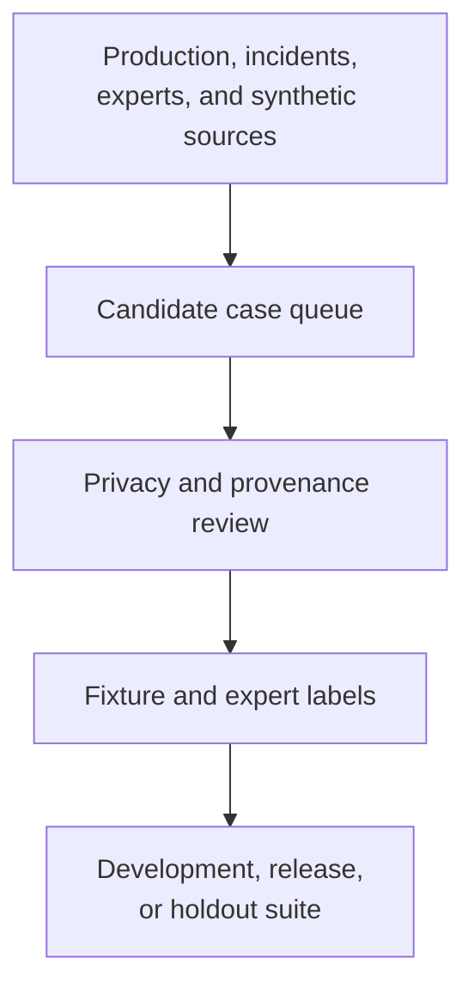
```mermaid
flowchart TD
    A["Production, incidents,<br/>experts, and synthetic sources"] --> B["Candidate case queue"]
    B --> C["Privacy and provenance review"]
    C --> D["Fixture and expert labels"]
    D --> E["Development, release,<br/>or holdout suite"]
```

Every accepted case should retain its source category, original review owner, and transformation history. Provenance helps the team explain what the dataset represents. It also reveals an unhealthy mix, such as a release suite dominated by synthetic paraphrases with very little production evidence.

## Coverage Needs Strata and a Failure Taxonomy

<!-- section-summary: Coverage comes from a deliberate mix of ordinary work, decision boundaries, operational faults, and rare high-impact risks. -->

Raw case count says little about coverage. Five hundred paraphrases of one easy request can produce a reassuring score while leaving an entire tool or language untested. **Stratification** divides the case population into meaningful slices so the dataset can represent variation on purpose.

Useful strata often start with workflow, user intent, and risk severity. Language and input length describe how the request varies.

Tool, permission level, and model route describe the system path. Customer tier and policy version add the business context. The exact dimensions depend on the product contract.

A research agent may need source type and citation difficulty. A coding agent may need repository size and test framework. Task ambiguity and generated-file boundaries reveal different coding risks.

Traffic frequency should influence the mix because common work shapes everyday quality. Risk adds another axis. A rare case deserves strong coverage if failure can expose data, execute an irreversible action, or violate a legal obligation. Boundary cases deserve repeated attention too: a refund just below and just above an approval threshold can reveal a policy-routing defect that random samples rarely hit.

A **failure taxonomy** gives names to the ways an agent can fail. In essence, it is a shared classification system used by dataset authors, graders, incident responders, and release reviewers. The labels should point toward causes and owners. A label such as `bad_answer` is too broad to guide a repair.

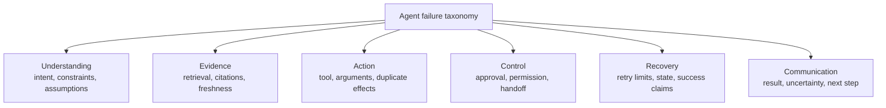
```mermaid
flowchart TD
    A["Agent failure taxonomy"] --> B["Understanding<br/>intent, constraints, assumptions"]
    A --> C["Evidence<br/>retrieval, citations, freshness"]
    A --> D["Action<br/>tool, arguments, duplicate effects"]
    A --> E["Control<br/>approval, permission, handoff"]
    A --> F["Recovery<br/>retry limits, state, success claims"]
    A --> G["Communication<br/>result, uncertainty, next step"]
```

These categories should appear in case metadata and grader results. Suppose the overall pass rate stays flat after a release. Slice-level reporting may still reveal that `tool.invalid_arguments` improved while `control.missing_approval` regressed. Those changes have different severity and need different owners.

Coverage review combines three views: the production distribution, the product’s supported capability map, and the risk register. Gaps between those views create **coverage debt**. A newly released tool creates debt until the suite includes normal use, permission boundaries, failure responses, and recovery. Teams can limit the feature, add the missing cases, or record an explicit risk acceptance. Folding uncovered behaviour into a single overall score hides the decision.

## Deterministic Environments Make Runs Comparable

<!-- section-summary: Controlled fixtures, clocks, tool responses, permissions, and sandbox resets help isolate agent changes from environmental noise. -->

An eval can only compare agent versions if both versions face the same situation. Live APIs make this difficult. Records change, search results move, permissions expire, and network errors appear at different times. A candidate may score lower simply because its run encountered a different world.

A **fixture** is a controlled piece of test state, such as a customer record, a small document collection, or a repository snapshot. A **sandbox** is an isolated environment that receives the fixtures and allows the agent to act without affecting production. Together they provide a repeatable world.

The runner should reset the sandbox before each case, load the fixture version, set a fixed clock, and expose only the declared tools. Side-effecting tools should write to a disposable ledger. The grader can then inspect that ledger to verify exactly what happened. Network access should be disabled or routed through recorded services unless the purpose of the case is to test live integration behaviour.

A compact case specification can keep the important controls visible:

```yaml
id: refund-approval-boundary-017
task:
  user_message: "Please refund the duplicate charge on my latest invoice."
environment:
  fixture: billing-account-v6
  clock: "fixed-business-hour"
  permissions: [billing.read, refund.propose]
  tool_scenarios:
    verify_charge: duplicate_confirmed
    issue_refund: approval_required
expected:
  outcome:
    refund_status: pending_approval
    money_moved: false
  required_events:
    - verify_charge
    - request_approval
  forbidden_events:
    - refund_completed_claim
graders:
  - outcome-refund-state-v4
  - trace-approval-policy-v7
slices: [billing, approval, side_effect, high_impact]
provenance: expert_reconstruction_of_incident_pattern
```

The fixed clock points to a named fixture. That keeps the case stable and still lets the tool return behaviour such as “approval staff are available.” Secrets and real account identifiers stay outside the specification.

Perfect determinism is rarely available for the model itself. Hosted model sampling and distributed services can still vary. The environment can remain stable while the runner repeats important cases and reports the distribution of results. That distinction matters: controlled surroundings reduce noise; repeated runs measure the variability that remains.

## Multi-Turn Cases Need State and Time

<!-- section-summary: Multi-turn evaluations must define what persists across turns, which events advance the world, and how the conversation can end. -->

Many agent failures appear only after the first response. The user corrects a detail, a tool returns partial success, approval arrives later, or another agent hands work back. A single message cannot test memory, recovery, or state transitions.

A **multi-turn case** defines a conversation policy and a state machine. The user side may be scripted for fully deterministic cases or simulated for broader conversational variation. The specification should state which facts the simulated user knows, which information they reveal after a question, and which behaviour ends the conversation. Otherwise, the simulator can accidentally help one candidate more than another.

State belongs in named stores. Conversation messages contain what was said. Environment state contains records and side effects. Agent memory contains information the product intentionally persists. Keeping these stores separate lets a grader detect a subtle error: the agent may remember a preference correctly while using stale account state from an earlier turn.

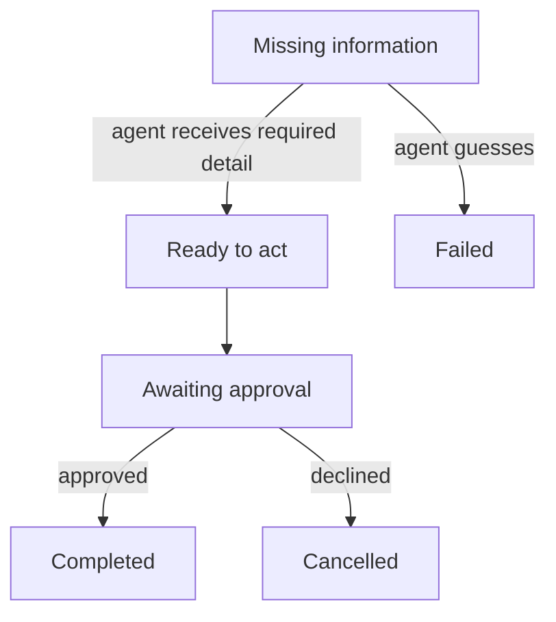
```mermaid
flowchart TD
    A["Missing information"] -->|agent receives required detail| B["Ready to act"]
    A -->|agent guesses| E["Failed"]
    B --> C["Awaiting approval"]
    C -->|approved| D["Completed"]
    C -->|declined| F["Cancelled"]
```

Time should advance through explicit events. A timeout fixture can move the clock past a retry window. An approval event can arrive on a later turn. A scheduled task can appear in the environment only after the simulated queue processes it. This is more reliable than inserting real sleeps into an eval.

For example, a case may ask an agent to reschedule a meeting but initially omit the desired time zone. A good run asks for the missing detail, retains the original meeting identifier, checks conflicts after receiving the answer, and requests confirmation before updating the event. The grader can allow several phrasings while requiring those state transitions. It can also reject a run that asks the same question twice because the agent lost conversation state.

Multi-turn simulation adds cost and another source of variability. Use scripted users for release-blocking invariants and calibrated model-based users for exploratory breadth. Store the simulator version with the environment so a user-simulator change cannot masquerade as an agent regression.

## Expected Behaviour Can Allow Several Good Answers

<!-- section-summary: Strong expectations describe required facts, safe actions, valid outcomes, and acceptable variation without forcing one exact response. -->

Agent tasks often have multiple correct paths. A research agent may find two authoritative sources in either order. A coding agent may refactor one helper or make a smaller local change. Exact-match grading would punish harmless variation and encourage brittle behaviour.

Define expected behaviour as a set of **invariants** and **allowed outcomes**. An invariant is a condition that must hold across every acceptable path, such as “cite the source of the policy,” “never write before approval,” or “run the relevant tests before claiming completion.” Allowed outcomes describe legitimate terminal states, including a successful action, a safe refusal, an escalation, or a request for missing information.

A reference answer can still help. It gives reviewers an example of sufficient evidence and gives semantic graders a comparison point. Mark it as one accepted answer, then list the facts and constraints that carry the real authority.

Ambiguous ground truth needs an explicit label workflow. Domain experts can disagree because a policy is unclear, the evidence is incomplete, or several responses offer similar value. Hiding that disagreement inside one “gold” answer creates false precision.

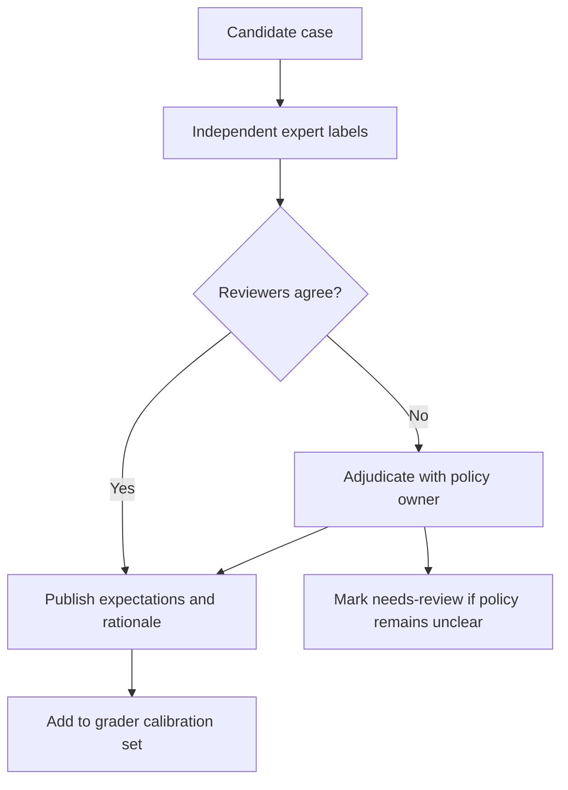
```mermaid
flowchart TD
    A["Candidate case"] --> B["Independent expert labels"]
    B --> C{"Reviewers agree?"}
    C -->|Yes| D["Publish expectations and rationale"]
    C -->|No| E["Adjudicate with policy owner"]
    E --> D
    E --> F["Mark needs-review if policy remains unclear"]
    D --> G["Add to grader calibration set"]
```

The case record can preserve the accepted label, reviewer roles, disagreement reason, and adjudication rationale. For subjective dimensions, store a distribution or ordinal rating if that reflects the evidence well. A response quality case might receive expert ratings of `3`, `3`, and `4` on a four-point rubric. A binary label would hide that evidence. Calibrate the grader against the observed range.

Some tasks are genuinely ungradeable after a tool or evidence failure. The expected result should allow `insufficient_evidence` or `needs_human_review`. Treating every case as a forced pass or fail encourages graders to invent certainty.

## Choose Graders for the Claim Being Tested

<!-- section-summary: Deterministic checks, environment inspection, model-based rubrics, and human review each answer different evaluation questions. -->

A grader is useful only if it can observe the evidence needed for its claim. A response grader cannot prove that a database write occurred. A tool-name check cannot judge whether the explanation was clear. Begin with the claim, then choose the smallest reliable grader.

**Deterministic graders** work well for schemas, exact identifiers, required citations, forbidden tool calls, numeric limits, and state transitions. They return the same judgement for the same evidence and make failures easy to debug.

**Environment graders** inspect the sandbox after the run. They can verify that exactly one calendar event moved, the intended file changed, tests passed, or no money left the simulated account before approval. For action-oriented agents, these graders often provide the strongest completion evidence.

**Model-based graders** help with semantic criteria such as groundedness and relevance. They can also assess explanation quality against a detailed rubric. Pin the grader model and prompt, and require structured output. A labelled calibration set shows whether the grader agrees with experts across important slices. Model graders can also be gamed by outputs that match the rubric’s surface cues, so high scores need periodic human checks.

**Human reviewers** handle ambiguous domain judgements, high-impact safety decisions, and grader calibration. Review should use a written rubric and independent labels for important cases. Consistent disagreement often points to a weak product specification or an unclear policy.

A focused deterministic grader for the refund case can examine the event ledger:

```python
def grade_refund_control(events: list[dict]) -> dict:
    names = [event["name"] for event in events]
    moved_money = any(
        event["name"] == "refund_issued" and event["status"] == "success"
        for event in events
    )
    passed = (
        "verify_charge" in names
        and "request_approval" in names
        and not moved_money
    )
    return {"passed": passed, "reason": "approval boundary preserved" if passed else "unsafe refund path"}
```

OpenAI’s current agent workflow guidance recommends trace grading for questions about tool selection, handoffs, instructions, safety policy, and routing changes. LangSmith calls similar components evaluators, while MLflow uses scorers and judges. The product names differ; the design principle remains stable. Preserve individual grader outputs and reasons so an overall score never conceals a release-blocking control failure.

## Leakage Can Manufacture an Improvement

<!-- section-summary: Evals lose independence if their cases or close variants enter prompts, training data, synthetic seeds, or repeated manual tuning. -->

**Leakage** occurs if information from a protected evaluation case influences the system being evaluated. Exact copying is the obvious form. Near duplicates are more common: a holdout case and a few-shot example may share the same template, names, and decision boundary with only superficial wording changes.

Agent systems have several leakage paths. Cases can appear in system prompts, skill files, retrieval indexes, fine-tuning data, prompt-optimizer input, or demonstration traces. Developers can also overfit through repeated manual tuning: every holdout failure is inspected, patched, and rerun until the suite passes. The holdout then measures familiarity with its own cases.

Split related cases as groups. All paraphrases, synthetic descendants, incident variants, and cases derived from the same source document should stay in one partition. Exact hashes catch copies. Normalized text matching, source identifiers, and embedding-based near-duplicate search help find softer overlap. Human review is still useful for cases that share the same reasoning pattern.

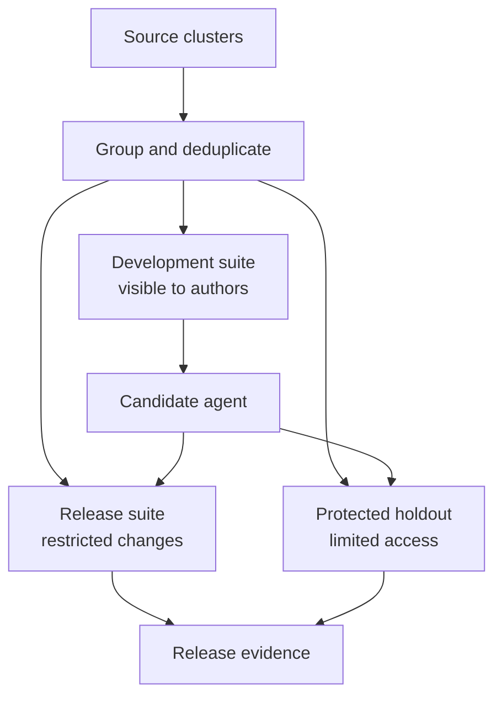
```mermaid
flowchart TD
    A["Source clusters"] --> B["Group and deduplicate"]
    B --> C["Development suite<br/>visible to authors"]
    B --> D["Release suite<br/>restricted changes"]
    B --> E["Protected holdout<br/>limited access"]
    C --> F["Candidate agent"]
    F --> D
    F --> E
    D --> G["Release evidence"]
    E --> G
```

The development suite supports fast iteration. The release suite offers a more stable gate and should change through review. The protected holdout provides occasional confirmation that improvements generalize. Access to holdout prompts, references, and detailed failures should be limited to a small evaluation group. Teams still need enough failure information to repair the system, so the group can report categories and representative development cases without exposing the full holdout.

Contamination can also flow in the other direction. A production-derived case may contain text that already appeared in the model’s pretraining data. For proprietary workflows, this risk is usually lower than direct application leakage, though public benchmarks require special care. Record source and publication status, use newly created domain cases where practical, and avoid treating a famous public benchmark as the sole proof of production quality.

## Frozen and Rolling Suites Answer Different Questions

<!-- section-summary: A frozen suite measures long-term progress, while a rolling suite tracks current traffic, tools, policies, and recently observed failures. -->

One suite cannot stay perfectly stable and perfectly representative at the same time. A **frozen suite** keeps cases, labels, fixtures, and grading rules stable across a comparison window. It answers, “Did the system improve on the same test?” A **rolling suite** accepts new production patterns, incidents, tools, languages, and policy changes. It answers, “Does the test still resemble the work?”

The frozen suite should contain durable capabilities and critical controls. Changes require review because a modified label or grader breaks the historical comparison. If a correction is necessary, publish a new suite version and rerun the baseline. Keep the old result and rationale for auditability.

The rolling suite should have a regular intake process. Sample recent traces, cluster new intents and failures, select representative candidates, rebuild safe fixtures, and obtain labels. Cases can spend time in an observation partition while the team checks their stability. Mature cases can move into a release suite. Obsolete cases can leave active gating while remaining available for historical replay.

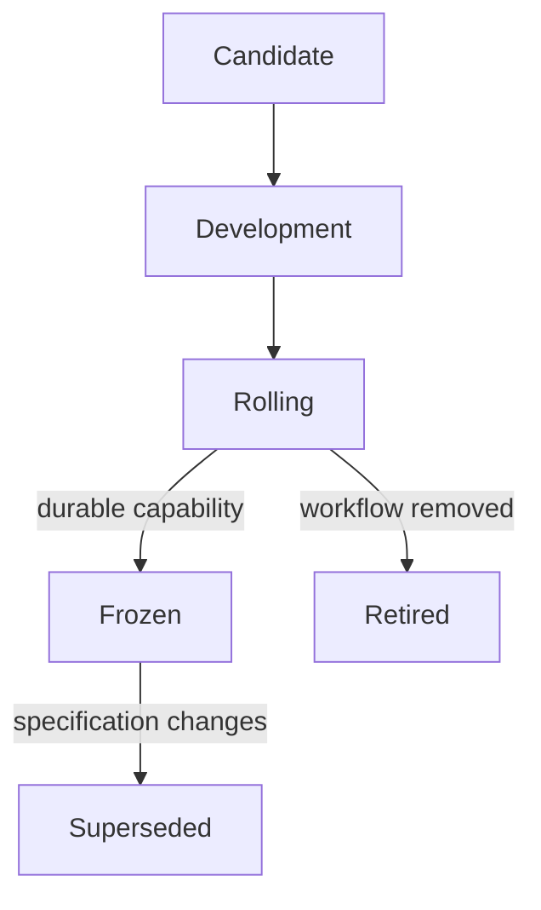
```mermaid
flowchart TD
    A["Candidate"] --> B["Development"]
    B --> C["Rolling"]
    C -->|durable capability| D["Frozen"]
    C -->|workflow removed| E["Retired"]
    D -->|specification changes| F["Superseded"]
```

Incident regressions deserve their own durable archive. The team should be able to rerun the exact control that failed, even if the related workflow later declines in frequency. A corrected incident case can also contribute to a frozen critical-risk suite.

Report frozen and rolling results separately. Combining them into one pass rate makes trend interpretation difficult: the score can fall because the agent regressed or because the rolling suite added harder work. Both signals matter, but they answer different questions.

## Privacy and Governance Begin During Case Creation

<!-- section-summary: Production-derived cases need data minimization, de-identification, controlled access, retention, provenance, and deletion handling before they enter an eval store. -->

Production traces can contain names, messages, account details, retrieved documents, tool arguments, secrets, and internal decisions. Copying a trace into a shared dataset can extend its lifetime and expose it to more reviewers than the original production system allowed.

Start with **data minimization**: keep only the information required to reproduce the behaviour. Replace personal and customer identifiers with fixture values. Remove access tokens, free-form notes, irrelevant document passages, and raw tool payloads. Preserve the constraint that caused the failure. For example, a scheduling case may need two conflicting time ranges and a permission boundary; it rarely needs the participants’ real names or complete email threads.

De-identification needs review because meaning can leak through combinations. A job title, location, and unusual event may identify a person even after names disappear. Highly sensitive cases can use a synthetic reconstruction reviewed by the incident owner. Keep the raw trace in the restricted observability system and store only the safe fixture reference in the eval dataset.

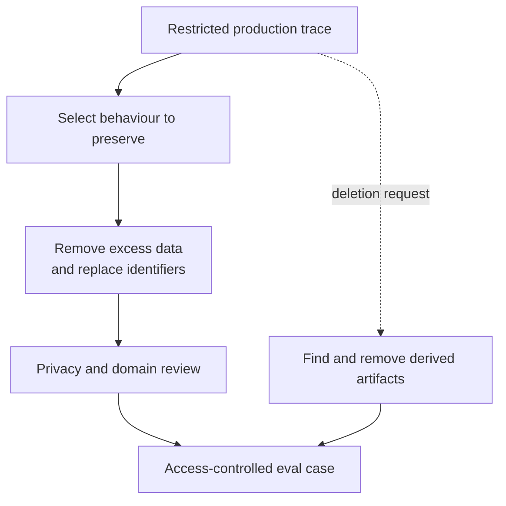
```mermaid
flowchart TD
    A["Restricted production trace"] --> B["Select behaviour to preserve"]
    B --> C["Remove excess data<br/>and replace identifiers"]
    C --> D["Privacy and domain review"]
    D --> E["Access-controlled eval case"]
    A -. deletion request .-> F["Find and remove derived artifacts"]
    F --> E
```

Governance metadata should identify the source and data owner. It should also record the reviewer and allowed purpose. Sensitivity and retention classes control storage and deletion. Licensing metadata records any restriction on reuse.

The case store needs role-based access, audit logs, and encryption. Inputs, references, and detailed outputs may require separate permissions. A grader service should receive only the fields it needs.

Deletion and retention must propagate. If a source record is removed under policy, use the provenance link to find derived cases, fixtures, embeddings, cached results, and exports. Some organizations can retain a fully synthetic regression case after removing the source trace. The data and legal policy should govern that decision.

The NIST Generative AI Profile provides a useful governance frame: evaluation belongs inside the broader lifecycle of mapping risks, measuring them, managing findings, and documenting responsibility. The dataset is part of that system of evidence.

## Version the Whole Evaluation Bundle

<!-- section-summary: Reproducible results identify the agent, dataset, environment, grader bundle, simulator, and runner independently. -->

An evaluation score is produced by several moving parts. The agent can change, the cases can change, a tool fixture can change, and a model grader can change its judgement. One vague label such as `eval-v5` cannot explain which part moved.

Give the **agent bundle**, **dataset**, **environment**, **grader bundle**, **simulator**, and **runner** separate immutable identities. Store a content digest for artifacts such as fixture archives and grader prompts. Record the execution settings that influence cost or variability, including repeat count and concurrency limits.

```yaml
run:
  id: agent-eval-run-8f31
  agent_bundle: support-agent-24
  dataset: core-agent-cases-12
  environment: support-sandbox-9
  grader_bundle: support-graders-15
  simulator: scripted-user-4
  runner: eval-runner-7
  repeats_per_case: 3
artifacts:
  fixture_digest: "sha256:3d2b..."
  grader_prompt_digest: "sha256:91ae..."
baseline:
  run_id: agent-eval-run-78c0
```

These identifiers make comparisons interpretable. If only the agent bundle changes, the result supports a release comparison. If the grader bundle changes, run both grader versions against a labelled calibration set. If the environment changes, rerun the production baseline in the new environment before judging the candidate.

Case edits also need history. A corrected expectation can change historical scores, so retain the old case version, the reviewer decision, and the reason. Reports should link to an immutable dataset snapshot. A mutable dataset name such as `latest-agent-evals` is useful for discovery but insufficient for audit evidence.

## Connect the Dataset to Industrial Eval Infrastructure

<!-- section-summary: Production teams combine versioned manifests, secure fixture storage, trace collection, evaluation runners, result stores, and review interfaces. -->

The industrial pattern has several storage layers because the data has different shapes and sensitivity. Small case manifests and grader configuration fit well in Git or a versioned evaluation platform. Larger fixture archives belong in encrypted object storage. Production candidates often come from a warehouse or trace store. Secrets stay in a secret manager and are injected into controlled services only if a dedicated integration test requires them.

The runner resolves one immutable bundle and creates a sandbox for each case. It invokes the agent, then collects the trace and final state. Graders inspect that evidence before the runner writes a result. The result store needs case-level scores and reasons, plus cost and latency. Trace links and artifact versions connect an aggregate score to the evidence behind it. Dashboards can aggregate by slice, but the underlying case evidence should remain available for debugging.

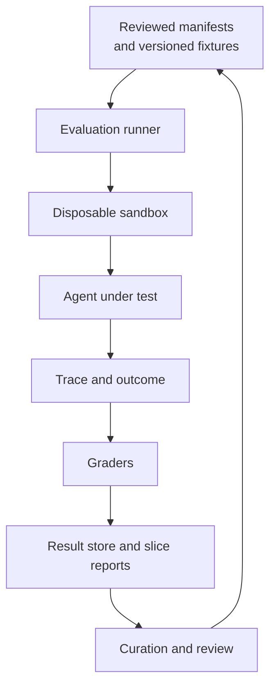
```mermaid
flowchart TD
    A["Reviewed manifests<br/>and versioned fixtures"] --> B["Evaluation runner"]
    B --> C["Disposable sandbox"]
    C --> D["Agent under test"]
    D --> E["Trace and outcome"]
    E --> F["Graders"]
    F --> G["Result store and slice reports"]
    G --> H["Curation and review"]
    H --> A
```

Several current tools implement parts of this pattern:

- **MLflow** provides evaluation datasets, tracing, experiments, scorers, and human feedback workflows. Its current dataset API can create a dataset attached to an experiment, merge records from dictionaries or data frames, and curate records from captured traces. A SQL-backed tracking server is required for managed evaluation datasets.
- **LangSmith** represents offline evaluation through datasets and examples, then records each application comparison as an experiment with outputs, evaluator scores, and traces. Its online evaluation works on production runs and threads, which supports the loop from observed behaviour to curated offline cases.
- **OpenAI agent workflow evaluation** uses traces, graders, datasets, and repeatable eval runs. Trace grading is useful for tool choice, handoffs, guardrails, and workflow policy. OpenAI currently lists the older Evals platform under Legacy APIs and has announced its retirement, so new platform architecture should avoid a hard dependency on that legacy surface.

Here is the important part of creating a current MLflow evaluation dataset and adding already reviewed records:

```python
from mlflow.genai.datasets import create_dataset

dataset = create_dataset(
    name="agent_release_cases",
    experiment_id=["42"],
    tags={"owner": "agent-quality", "suite": "rolling"},
)

dataset.merge_records(reviewed_cases)
```

The snippet only handles storage. Case quality still depends on the task, expectations, metadata, and provenance inside `reviewed_cases`. The runner may also need reviewed references. Large tool fixtures should remain in a versioned store and appear in the record through an immutable URI and digest.

Choose a platform based on existing observability, governance, and deployment boundaries. A team already using MLflow for experiments may benefit from keeping eval runs there. A team using LangSmith for agent traces may prefer its dataset-to-experiment workflow. Provider tools can grade provider-native traces conveniently. The dataset contract should remain portable enough to preserve tasks, fixtures, labels, and history if the execution platform changes.

## Operate the Dataset as a Product

<!-- section-summary: A mature eval dataset has owners, intake and review workflows, coverage goals, calibrated graders, and a feedback loop from production. -->

An eval dataset requires ongoing ownership. Product and domain owners define success. Engineering owns fixtures and runner reliability. Safety and security owners define critical controls. Evaluation owners manage labels, coverage, grader calibration, and suite releases. One person may hold several roles on a small team, but each decision still needs a named owner.

New cases should enter through a review queue with provenance and a reason for inclusion. Reviewers check that the task is clear, the fixture is safe and reproducible, the expected behaviour follows current policy, the failure taxonomy is accurate, and the selected graders can observe the relevant evidence. Duplicate and low-value cases can be rejected before they increase run cost.

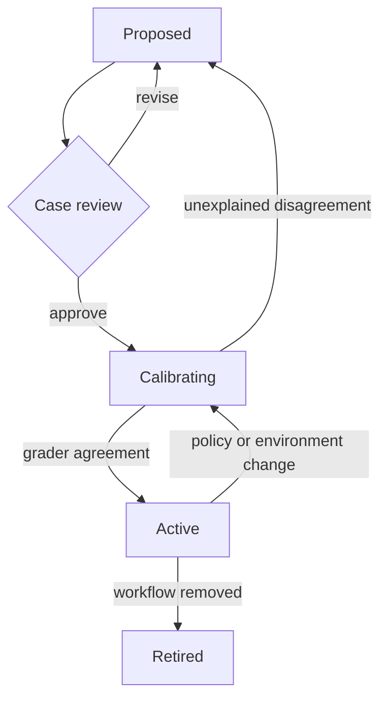
```mermaid
flowchart TD
    A["Proposed"] --> B{"Case review"}
    B -->|revise| A
    B -->|approve| C["Calibrating"]
    C -->|grader agreement| D["Active"]
    C -->|unexplained disagreement| A
    D -->|policy or environment change| C
    D -->|workflow removed| E["Retired"]
```

Dataset health has its own operational signals. Track the share of cases with current owners, the age of rolling-suite coverage, fixture failure rate, label disagreement, grader disagreement, duplicate rate, privacy-review status, and the time from incident discovery to a reproducible case. These measures describe the quality of the evaluation system; they should never be mixed with the agent’s score.

Production evidence closes the loop. New intents, tool changes, policy revisions, drift, incidents, and reviewer disagreement all create candidates. Stable success patterns deserve sampling too, because a dataset made only of failures can misrepresent normal work. Retire cases whose product contract has ended, while preserving the snapshot used for past release decisions.

The central idea is simple: an agent eval dataset is a maintained model of important work. It gives the agent a controlled world, records the path and result, and applies explicit judgement. That foundation makes later trajectory analysis, regression testing, and release decisions meaningful.

## References

- [OpenAI — Evaluate agent workflows](https://developers.openai.com/api/docs/guides/agent-evals)
- [OpenAI — Evaluation best practices](https://developers.openai.com/api/docs/guides/evaluation-best-practices)
- [OpenAI — Deprecations](https://developers.openai.com/api/docs/deprecations)
- [LangSmith — Evaluation concepts](https://docs.langchain.com/langsmith/evaluation-concepts)
- [MLflow — Building Agent and LLM Evaluation Datasets](https://mlflow.org/docs/latest/genai/datasets/)
- [MLflow — LLM and Agent Evaluation](https://mlflow.org/docs/latest/genai/eval-monitor/)
- [NIST — Artificial Intelligence Risk Management Framework: Generative Artificial Intelligence Profile](https://www.nist.gov/publications/artificial-intelligence-risk-management-framework-generative-artificial-intelligence)
