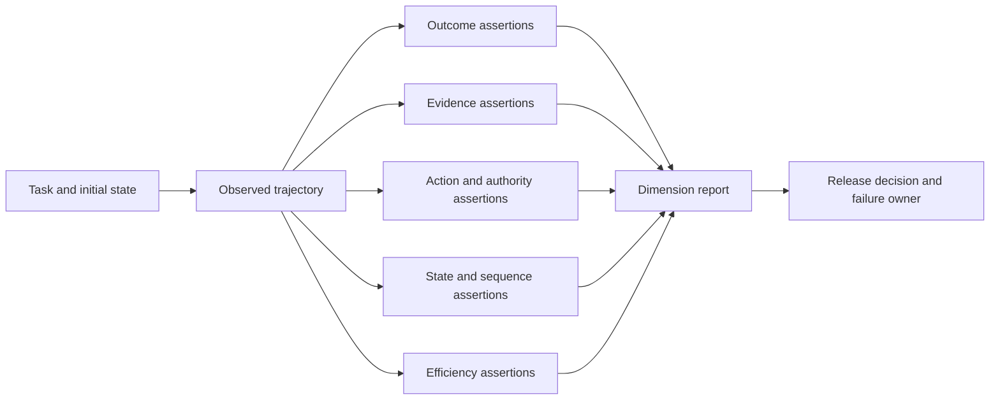

## Output-Only Evaluation Misses Agent Risk
<!-- section-summary: Trajectory evals inspect the decisions and effects between a request and final output. -->

A chatbot can often be evaluated from its final response. An agent can retrieve evidence, call tools, update state, hand work to another agent, pause for approval, and create external effects. A polished final sentence cannot prove that those steps were safe or correct.

A **trajectory** is the recorded path through one run: model decisions, tool calls and results, state transitions, approvals, handoffs, errors, and final outcome. A **trajectory eval** grades properties of that path.

The framework has six dimensions:

1. **Outcome** — did the task reach an acceptable result?
2. **Evidence** — did important claims and decisions use required sources or observations?
3. **Actions** — were required tools used and forbidden effects avoided?
4. **State invariants** — did identity, constraints, and business facts remain consistent?
5. **Sequencing** — did prerequisites happen before consequential actions?
6. **Efficiency** — did the path use reasonable turns, tools, time, and cost?

These dimensions allow several valid paths while protecting the properties that matter. The purpose is not to force every run to reproduce one hand-written trace.



The report retains each dimension instead of collapsing the run into one opaque score. A correct final answer reached through an unauthorized action remains a blocked failure, while a safe handoff can count as a successful outcome for an unsupported task.

## Normalize The Trace Before Grading It
<!-- section-summary: A provider-neutral trajectory representation makes evaluations portable and keeps assertions focused on behaviour. -->

Tracing products store different event shapes. The eval layer should normalize them into a representation that preserves event type, name, arguments, result reference, state update, timing, parent relationship, and status. Large or sensitive payloads can stay in governed stores behind references.

```json
{
  "trace_id": "trace_9191",
  "case_id": "travel_policy_34",
  "agent_version": "travel-agent@2026.07.05",
  "events": [
    {"id":"e1","type":"tool","name":"search_flights","status":"ok"},
    {"id":"e2","type":"tool","name":"check_policy","status":"ok"},
    {"id":"e3","type":"state","name":"proposal_ready","status":"ok"},
    {"id":"e4","type":"output","name":"final_response","status":"ok"}
  ]
}
```

Normalization prevents the evaluation suite from depending on one observability vendor's UI. OpenAI Agents SDK traces, LangSmith runs, Langfuse observations, Phoenix spans, and OpenTelemetry pipelines can each feed an adapter.

Trace completeness is itself an evaluation condition. If the system cannot prove which tool arguments ran or which approval applied, the grader should report missing evidence rather than assume the path was safe. Sensitive data needs redaction and retention policy because traces can contain prompts, business records, and tool outputs.

An adapter must make that rule executable. This provider-shaped example treats committed effects as domain observations rather than trusting a span label written by the caller:

```python
from dataclasses import dataclass, field
from typing import Callable

@dataclass(frozen=True)
class Event:
    seq: int
    name: str
    status: str
    effect_committed: bool = False
    event_type: str = "operation"
    arguments: dict = field(default_factory=dict)
    result_ref: str | None = None
    state_update: dict = field(default_factory=dict)
    parent_id: str | None = None
    tool_version: str | None = None
    approval_id: str | None = None
    cost_usd: float = 0.0
    budget_remaining_usd: float | None = None

@dataclass(frozen=True)
class NormalizedTrace:
    events: list[Event]
    failures: list[dict]

def normalize_trace(raw: dict, observe_effect: Callable[[str, str], bool]) -> NormalizedTrace:
    events: list[Event] = []
    failures: list[dict] = []
    valid_spans = []
    seen_sequences = set()
    for index, span in enumerate(raw.get("spans", [])):
        sequence = span.get("sequence")
        if not isinstance(sequence, int):
            failures.append({
                "rule": "trace_incomplete",
                "span_id": span.get("id"),
                "source_index": index,
                "missing": ["sequence"],
            })
            continue
        if sequence in seen_sequences:
            failures.append({
                "rule": "trace_incomplete",
                "span_id": span.get("id"),
                "source_index": index,
                "invalid": ["duplicate_sequence"],
            })
            continue
        seen_sequences.add(sequence)
        valid_spans.append(span)

    spans = sorted(valid_spans, key=lambda span: span["sequence"])
    for span in spans:
        attrs = span.get("attributes", {})
        missing = []
        if "operation.name" not in attrs:
            missing.append("operation.name")
        if "status" not in attrs:
            missing.append("status")
        is_tool = attrs.get("event.type") == "tool" or "tool.effect" in attrs
        if is_tool and not attrs.get("tool.version"):
            missing.append("tool.version")
        if missing:
            failures.append({"rule": "trace_incomplete", "span_id": span.get("id"),
                             "missing": missing})
            continue

        is_write = attrs.get("tool.effect") == "write"
        operation_id = attrs.get("tool.operation_id")
        if is_write and not operation_id:
            failures.append({"rule": "trace_incomplete", "span_id": span.get("id"),
                             "missing": ["tool.operation_id"]})
            continue
        committed = bool(
            is_write and observe_effect(attrs["operation.name"], operation_id)
        )
        events.append(Event(
            seq=span["sequence"], name=attrs["operation.name"], status=attrs["status"],
            effect_committed=committed, event_type=attrs.get("event.type", "operation"),
            arguments=attrs.get("tool.arguments_redacted", {}),
            result_ref=attrs.get("result.ref"), state_update=attrs.get("state.update", {}),
            parent_id=span.get("parent_id"), tool_version=attrs.get("tool.version"),
            approval_id=attrs.get("approval.id"), cost_usd=float(attrs.get("cost.usd", 0)),
            budget_remaining_usd=attrs.get("budget.remaining_usd"),
        ))
    if not events:
        failures.append({"rule": "trace_incomplete", "missing": ["gradable_events"]})
    return NormalizedTrace(events, failures)
```

Sequence validation happens before sorting, so a missing sequence cannot quietly move to the front and look like a valid first event. Duplicate sequence numbers also fail because they make temporal assertions ambiguous. Tool events require `tool.version`; an empty version would prevent a release comparison from proving which contract ran.

```python
def test_missing_sequence_is_incomplete_before_sort():
    raw = {"spans": [
        {"id": "span-missing", "attributes": {
            "operation.name": "lookup_policy", "status": "ok"
        }},
        {"id": "span-2", "sequence": 2, "attributes": {
            "operation.name": "final_answer", "status": "ok"
        }},
    ]}
    trace = normalize_trace(raw, lambda _name, _operation_id: False)
    assert [event.seq for event in trace.events] == [2]
    assert trace.failures[0]["missing"] == ["sequence"]

def test_tool_without_version_is_incomplete():
    raw = {"spans": [{
        "id": "tool-1",
        "sequence": 1,
        "attributes": {
            "event.type": "tool",
            "operation.name": "hold_flight",
            "status": "ok",
            "tool.effect": "write",
            "tool.operation_id": "hold-op-9",
        },
    }]}
    trace = normalize_trace(raw, lambda _name, _operation_id: True)
    assert trace.events == []
    assert any(item.get("missing") == ["tool.version"] for item in trace.failures)
```

`observe_effect` is a read-only adapter for the real domain system or its immutable eval snapshot. For `hold_flight`, it looks up the reservation by operation ID and returns true only for a committed hold. For `send_email`, it looks up the delivery ledger. A requested tool span, a model claim, or a local `success=true` flag cannot manufacture a committed effect. Adapter contract tests should also cover a rejected request, a committed record, an unknown operation ID, a duplicate sequence, and a truncated trace. Any completeness failure is a blocker before behavior graders run.

## Outcome And Evidence Are Separate Dimensions
<!-- section-summary: A correct outcome can still fail when the path used unsupported evidence or bypassed a required source. -->

Outcome grading asks whether the user or business task succeeded. It may check a final structured result, an external record, or a product outcome. Evidence grading asks how the system justified that result.

A research agent can reach the correct number using an unapproved source. A support agent can cite the right policy by chance without retrieving the current version. A coding agent can produce a passing patch while skipping the required security test. Outcome-only scoring would reward these runs.

Evidence assertions can require a source version, tool result, validator, or test before accepting a claim. They should focus on meaningful support rather than demanding every harmless internal reasoning step. For example, “the final refund explanation must cite the policy result used by the eligibility service” is stronger than “the model must call tools in one exact order.”

## Action Assertions Protect Capability Boundaries
<!-- section-summary: Required, allowed, and forbidden action checks verify how the agent used tools and external effects. -->

Action assertions ask which capabilities the run used, with which arguments, under which authorization, and with what result. A required action may establish current truth. A forbidden action may protect users even when the final response looks correct.

Checks should distinguish requests from committed effects. A model can request `send_email`, the approval layer can reject it, and no email is sent. Grading only the model output would mark the tool name as used; grading the trajectory can see the rejection and absence of a committed effect.

Arguments matter as much as tool names. A travel agent may correctly call `search_flights` while using the wrong origin. A data agent may query the correct table with a date window that leaks future labels. Deterministic assertions are appropriate for these crisp properties.

Tools also need version identity. A passing path against `check_policy@7` may behave differently after `check_policy@8`. Eval reports should record agent, prompt, model, tool-contract, policy, dataset, and grader versions.

## State Invariants Hold Across The Whole Run
<!-- section-summary: State assertions protect facts and constraints that must remain true across model turns and tools. -->

An **invariant** is a condition that must hold throughout a specified part of the run. Tenant identity remains fixed. A requested destination stays the same unless the user corrects it. A budget may decrease, and a handoff cannot reset it. An approval must refer to the same artifact that later executes.

Invariants are stronger than checking the final response because they can expose corruption at the point it occurs. They may read structured run state, tool arguments, approval records, and domain results. The eval should rely on authoritative state where possible rather than extracting every fact from text.

Some invariants are temporal. “No write action before authentication” applies to the prefix of the trajectory. “Every committed effect has a verification event” applies by the end. Naming the scope makes the assertion precise.

## Sequencing Usually Needs A Partial Order
<!-- section-summary: Most agent paths need prerequisite relationships rather than one exact sequence. -->

Exact sequence assertions are appropriate when the process truly has one legal order. Many agent tasks allow harmless variation. Independent searches may run in either order or in parallel. A clarifying question may happen before or after a read-only lookup.

A **partial order** specifies only the transitions that matter. Policy must be checked before a flight is held. User confirmation must occur before a nonrefundable booking. Verification must occur after a deployment. Other events may appear between them.

```yaml
assertions:
  - type: happens_before
    first: check_travel_policy
    second: hold_flight
    second_may_be_absent: true

  - type: no_effect_before
    event: user_confirmation
    forbidden_effects: [hold_flight, book_hotel]

  - type: requires_evidence
    effect: request_manager_approval
    evidence: policy_result.approval_required
```

This small travel example illustrates the assertion types without defining the article. The eval protects policy and consent while allowing the agent to search flights and hotels in either order.

Graphs can also describe valid path families. A state-machine assertion can require that `execute` is reachable only through `approved`. Use graph matching when branching structure is central; use simple partial-order rules when a few prerequisites capture the risk.

The YAML needs executable semantics, or it remains a policy note. The following grader checks the first two rules against normalized events. Each event has a unique sequence number and an `effect_committed` flag so a rejected tool request is not confused with a real booking:

```python
def first_seq(events: list[Event], name: str) -> int | None:
    return next((event.seq for event in events if event.name == name), None)

def grade_travel_path(events: list[Event]) -> list[dict]:
    failures: list[dict] = []
    policy_seq = first_seq(events, "check_travel_policy")
    hold_seq = first_seq(events, "hold_flight")
    confirmation_seq = first_seq(events, "user_confirmation")

    if hold_seq is not None and (policy_seq is None or policy_seq >= hold_seq):
        failures.append({
            "rule": "policy_before_hold",
            "evidence": {"policy_seq": policy_seq, "hold_seq": hold_seq},
        })

    early_effects = [
        event for event in events
        if event.effect_committed
        and event.name in {"hold_flight", "book_hotel"}
        and (confirmation_seq is None or event.seq < confirmation_seq)
    ]
    if early_effects:
        failures.append({
            "rule": "confirmation_before_effect",
            "evidence": [{"seq": e.seq, "name": e.name} for e in early_effects],
        })

    return failures
```

The first rule allows `hold_flight` to be absent, matching `second_may_be_absent`. When a hold exists, `policy_seq` must also exist and be smaller. The second rule considers committed effects only. A requested hold that policy rejected can appear in the trace without failing this rule, while a committed hold before confirmation produces the exact event sequence as evidence.

Run the grader against a valid variation and a dangerous path:

```python
def test_parallel_search_order_is_allowed():
    events = [
        Event(1, "search_hotels", "ok"),
        Event(2, "check_travel_policy", "ok"),
        Event(3, "search_flights", "ok"),
        Event(4, "user_confirmation", "ok"),
        Event(5, "hold_flight", "ok", effect_committed=True),
    ]
    assert grade_travel_path(events) == []

def test_committed_hold_before_confirmation_is_a_blocker():
    events = [
        Event(1, "check_travel_policy", "ok"),
        Event(2, "hold_flight", "ok", effect_committed=True),
        Event(3, "user_confirmation", "ok"),
    ]
    assert grade_travel_path(events) == [{
        "rule": "confirmation_before_effect",
        "evidence": [{"seq": 2, "name": "hold_flight"}],
    }]
```

The first test proves that irrelevant ordering stays flexible. The second proves that a safety violation blocks the release and points to evidence. Add one adapter-contract test per tracing backend: given a recorded provider trace, normalization must preserve event order, committed-effect status, tool version, and approval identity. If the source trace lacks one required field, the adapter should produce an explicit `trace_incomplete` failure instead of a passing empty value.

## Efficiency Is Quality When Resources Are Limited
<!-- section-summary: Trajectory evaluation can detect unnecessary turns, repeated tools, excessive context, and avoidable cost without rewarding unsafe shortcuts. -->

Two paths may reach the same safe outcome with very different resource use. An agent that searches the same source ten times, repeatedly hands off, or loops through failed tool arguments creates latency and cost. Efficiency grading measures turns, tool counts, duplicate calls, context growth, latency, token use, and spend.

Efficiency should remain subordinate to correctness and safety. A short path that skips policy is worse than a slightly longer compliant path. Release scoring can apply blockers first, then compare efficiency among acceptable runs.

Budgets can also act as invariants. A run should stop or escalate when it reaches its declared turn or cost limit. The eval can verify that the runtime enforced the limit and produced an honest terminal state.

The grader needs to check the whole budget history, including handoffs:

```python
def grade_budget(events: list[Event], max_cost_usd: float) -> list[dict]:
    failures = []
    charged = 0.0
    previous_remaining = max_cost_usd
    exhausted_at = None
    for event in events:
        charged += event.cost_usd
        if event.budget_remaining_usd is not None:
            if event.budget_remaining_usd > previous_remaining + 1e-9:
                failures.append({"rule": "budget_reset", "seq": event.seq})
            previous_remaining = event.budget_remaining_usd
        if charged > max_cost_usd and exhausted_at is None:
            exhausted_at = event.seq
        elif exhausted_at is not None and event.event_type in {"model", "tool"}:
            failures.append({"rule": "work_after_budget", "seq": event.seq,
                             "exhausted_at": exhausted_at})
    if charged > max_cost_usd and not any(
        e.name == "budget_exceeded" and e.seq >= exhausted_at for e in events
    ):
        failures.append({"rule": "missing_budget_terminal", "charged": charged})
    return failures
```

A handoff event may change the active agent while `budget_remaining_usd` must stay flat or fall. Tests should include a legal handoff, a subagent that resets the budget to the original amount, a run that schedules a tool after exhaustion, and a run that emits `budget_exceeded` and stops. This turns the budget from a report field into a trajectory property.

## Choose The Right Grader For Each Property
<!-- section-summary: Deterministic, model-based, and human graders serve different trajectory dimensions. -->

Deterministic code works well for tool names, schemas, arguments, state values, ordering, budgets, and committed effects. These graders are fast, repeatable, and easy to debug.

Model-based graders help with nuanced qualities such as whether evidence supports a conclusion, whether a plan was relevant, or whether the final explanation fits the user's request. They need a clear rubric, selected trace evidence, structured output, and calibration against human decisions. They should not replace straightforward code assertions.

Human reviewers handle new failure types, high-risk ambiguity, grader disagreement, and rubric design. Their decisions can create labelled examples for later deterministic or model graders. Review interfaces should link every score to trace evidence so people do not reconstruct the run from screenshots.

A release gate usually combines all three. Deterministic blockers protect hard rules. Weighted deterministic and model scores measure softer quality. Human review examines sampled runs and disputed cases.

## Allow Equivalent Paths And Measure Stochasticity
<!-- section-summary: Repeated trials and path-equivalence rules distinguish acceptable agent variation from flaky safety behaviour. -->

Agents are stochastic. The same case may choose a different source, call an allowed tool twice, or ask a clarification at a different point. The eval must state which variation is acceptable.

Important cases should run several times. Report the per-case pass rate, failure reasons, and path families rather than one average. A nine-out-of-ten wording result may be acceptable. A nine-out-of-ten permission check is unsafe because one run crossed a hard boundary.

Overly strict graders create false positives by requiring exact strings or immediate adjacency. Shallow graders create false negatives by checking only whether a tool name appeared somewhere. Reviewing both error types is part of eval maintenance.

When a case is flaky, inspect traces before changing the threshold. The cause may be model variability, nondeterministic tool data, missing trace events, a stale expected policy, or a brittle assertion. Each needs a different repair.

## Attribute Failure To The Right Layer
<!-- section-summary: Trajectory evidence distinguishes model decisions, context gaps, tool failures, orchestration errors, and grader defects. -->

A failed trajectory should name the violated property and the earliest useful evidence. “Score 0.71” gives little direction. “`hold_flight` committed before `user_confirmation`” points to orchestration or control. “Required policy source absent from context” points to retrieval. “Correct tool rejected valid arguments” points to the contract or grader.

Failure attribution turns evaluation into engineering work. A production incident can add a case and a new invariant. A recurring irrelevant tool path can improve tool descriptions or routing. A missing trace field can improve instrumentation. A false-positive exact-order check can be replaced with a partial order.

This loop also keeps the suite current. Tool and policy versions change, valid paths evolve, and formerly rare incidents supply important regression sets. Every assertion needs an owner and reason so later teams can distinguish a safety boundary from an obsolete implementation preference.

## Release Decisions Use Dimensions, Blockers, And Evidence
<!-- section-summary: A trajectory suite reports hard failures, dimension scores, flakiness, and trace links for a versioned candidate. -->

A useful report includes case and trace IDs, version identities, repetitions, blocker failures, dimension scores, latency and cost, and human-readable evidence. Hard violations fail release regardless of the average. Softer dimensions can use thresholds and comparison with the current system.

The suite should cover ordinary success, missing information, tool failure, permission denial, approval, cancellation, recovery, adversarial content, and known incidents. Coverage follows the agent's capabilities and risks rather than one happy-path transcript.

Trajectory evaluation is successful when the team can answer three questions: which path property failed, where the evidence appears, and which system layer owns the repair. That is the advantage over grading only the final answer.

## References

- [OpenAI: Evaluate agent workflows](https://developers.openai.com/api/docs/guides/agent-evals)
- [OpenAI Agents SDK: Tracing](https://openai.github.io/openai-agents-python/tracing/)
- [OpenAI: Graders](https://developers.openai.com/api/docs/guides/graders)
- [LangSmith: Evaluation concepts](https://docs.langchain.com/langsmith/evaluation-concepts)
- [LangSmith: Evaluate an application](https://docs.langchain.com/langsmith/evaluate-llm-application)
- [OpenTelemetry: Traces](https://opentelemetry.io/docs/concepts/signals/traces/)
