## Table of Contents

1. [A Trajectory Shows How the Agent Reached Its Answer](#a-trajectory-shows-how-the-agent-reached-its-answer)
2. [Understand The Records Inside A Trajectory](#understand-the-records-inside-a-trajectory)
3. [Step Graders and Whole-Trajectory Graders See Different Problems](#step-graders-and-whole-trajectory-graders-see-different-problems)
4. [Tool Evaluation Covers Selection, Arguments, and Effects](#tool-evaluation-covers-selection-arguments-and-effects)
5. [Allow Different Valid Paths While Enforcing Required Order](#allow-different-valid-paths-while-enforcing-required-order)
6. [Handoffs and Guardrails Are Part of the Path](#handoffs-and-guardrails-are-part-of-the-path)
7. [Recovery Evaluation Tests the Difficult Branches](#recovery-evaluation-tests-the-difficult-branches)
8. [Scores Need Partial Credit and Severity](#scores-need-partial-credit-and-severity)
9. [Model Judges Need Their Own Evaluation](#model-judges-need-their-own-evaluation)
10. [Protect Sensitive Trace Data Without Hiding Required Evidence](#protect-sensitive-trace-data-without-hiding-required-evidence)
11. [Replay Needs a Deterministic Environment](#replay-needs-a-deterministic-environment)
12. [Use Current Tools To Store Traces And Run Scorers](#use-current-tools-to-store-traces-and-run-scorers)
13. [Write Reports That Identify The Failed Step And Owner](#write-reports-that-identify-the-failed-step-and-owner)
14. [References](#references)

## A Trajectory Shows How the Agent Reached Its Answer

<!-- section-summary: Final-output grading sees the answer, while trajectory grading also sees the decisions and effects that produced it. -->

Two agents can return the same final answer after taking very different actions. A **trajectory** records that path: the model turns, tool calls, results, guardrails, handoffs, state changes, errors, and final response. A **trajectory eval** checks whether the path followed the rules of the task.

This extra view matters because an agent can reach a correct-looking answer through a bad process. A support agent may quote the correct refund rule from memory without reading the current policy. A scheduling agent may announce a new meeting time even though the calendar write failed. A research agent may use a document containing injected instructions and still produce a plausible summary. Final-answer grading can miss all three failures.

The path also helps diagnose a weak final answer. A trace can show that retrieval returned the wrong source, the model selected the wrong tool, valid arguments were rejected by a tool contract, or the orchestrator lost state after a handoff. The answer says that the run failed. The trajectory shows where useful evidence first appeared.


*Final text can look acceptable while the path violates evidence, effect, or guardrail rules. The trajectory shows the earliest trustworthy failure evidence and the layer most likely to own the repair.*

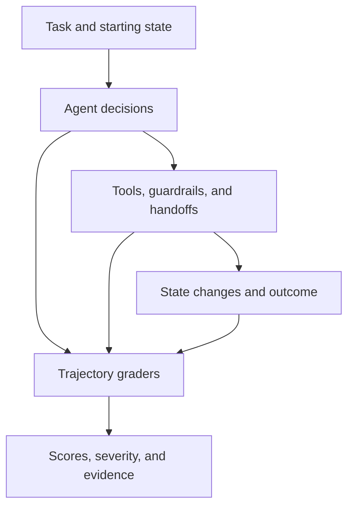
```mermaid
flowchart TD
    A["Task and starting state"] --> B["Agent decisions"]
    B --> C["Tools, guardrails, and handoffs"]
    C --> D["State changes and outcome"]
    B --> E["Trajectory graders"]
    C --> E
    D --> E
    E --> F["Scores, severity, and evidence"]
```

Trajectory evaluation complements outcome evaluation. An environment grader can prove that the requested record exists. A trajectory grader can prove that the agent used the right account, obtained approval, and handled the tool response honestly. Strong evaluation usually keeps both results.

The eval dataset supplies the task, starting state, tool environment, and expectations. The trajectory is produced by running the agent inside that case. This boundary matters: a trace is evidence from a run, while the case defines the conditions under which that evidence should be judged.

## Understand The Records Inside A Trajectory

<!-- section-summary: A trace is the whole run, spans group timed operations, events record important moments, and state transitions show how the world changed. -->

Tracing vocabulary can feel abstract at first, so start with an ordinary request. Suppose an agent must check a policy and then prepare an approval request. The whole piece of work is one **trace**. The policy lookup, model decision, and approval-tool call are **spans** inside it. A retry or guardrail result can appear as an **event**. The move from `policy_unknown` to `approval_required` is a **state transition**.

### A Trace Contains Spans, Events, And State Changes

A **trace** represents one end-to-end operation. It has a trace identifier and usually contains a tree of spans. A **span** represents one operation with a start, an end, a status, and a parent relationship. Parent links show which model turn caused a tool call or which agent created a subagent. OpenTelemetry uses this structure across distributed systems, and current agent platforms extend spans with model, tool, retrieval, guardrail, and handoff details.

An **event** records a meaningful point inside a span. Examples include a retry scheduled, a token budget crossed, or a guardrail triggered. An **attribute** is a structured fact attached to a trace or span, such as `tool.name`, `tool.version`, `approval.id`, or `tenant.id`. Attributes make deterministic grading possible because the grader reads known fields directly. It no longer has to recover every fact from prose.

A **state transition** records a change that matters to the task. The change may live in agent memory, orchestration state, or an external system. For trajectory grading, the transition needs a reliable before-and-after value or a reference to an authoritative snapshot.

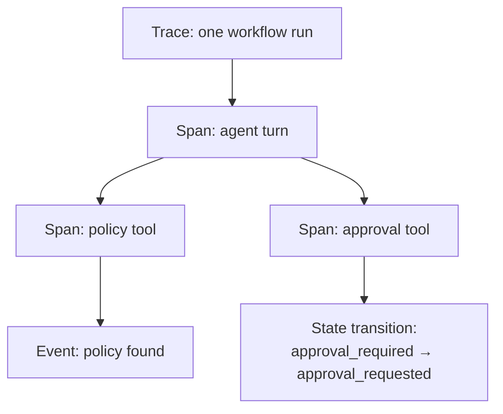
```mermaid
flowchart TD
    A["Trace: one workflow run"] --> B["Span: agent turn"]
    B --> C["Span: policy tool"]
    B --> D["Span: approval tool"]
    C --> E["Event: policy found"]
    D --> F["State transition:<br/>approval_required → approval_requested"]
```

OpenAI’s Agents SDK currently records model generations, function tools, handoffs, guardrails, and agent runs as spans. Its trace is the enclosing workflow. MLflow and LangSmith use their own trace models, while OpenTelemetry supplies a widely adopted observability foundation. A trajectory evaluator should preserve the common meaning even if provider field names differ.

### Use One Event Format Across Runtimes

A compact normalized event can look like this:

```json
{
  "sequence": 4,
  "type": "tool",
  "name": "request_approval",
  "status": "ok",
  "parent_id": "span_agent_turn_2",
  "arguments": {"policy_id": "refund-policy-v8"},
  "state_change": {"approval_status": ["required", "requested"]}
}
```

Normalization should keep only the fields needed for evaluation and debugging. Large documents, raw prompts, and sensitive tool results can stay in controlled stores behind immutable references. Missing fields should produce `trace_incomplete`; an empty value must never count as proof that a check passed.

## Step Graders and Whole-Trajectory Graders See Different Problems

<!-- section-summary: Step graders isolate one decision, while whole-trajectory graders check relationships that stretch across the run. -->

A **step-level grader** evaluates one bounded decision. It may check whether the agent chose `search_policy`, whether the search query used the correct account type, or whether a handoff target matched the task. These graders are fast and precise. They also make a local defect easy to reproduce because the test can supply the state immediately before the decision.

Step tests lose part of the system around that decision. A correct tool choice can still participate in an unsafe path. The agent may select `request_approval` correctly, then execute the side effect before approval arrives. It may retrieve the right source during one turn and lose the source version after a handoff.

### Use Whole-Trajectory Graders For Cross-Step Rules

A **whole-trajectory grader** reads the full path. It can check that identity stayed consistent, evidence appeared before a claim, approval happened before a write, retries remained within policy, and the final response matched the actual tool outcome. These graders capture relationships across time.

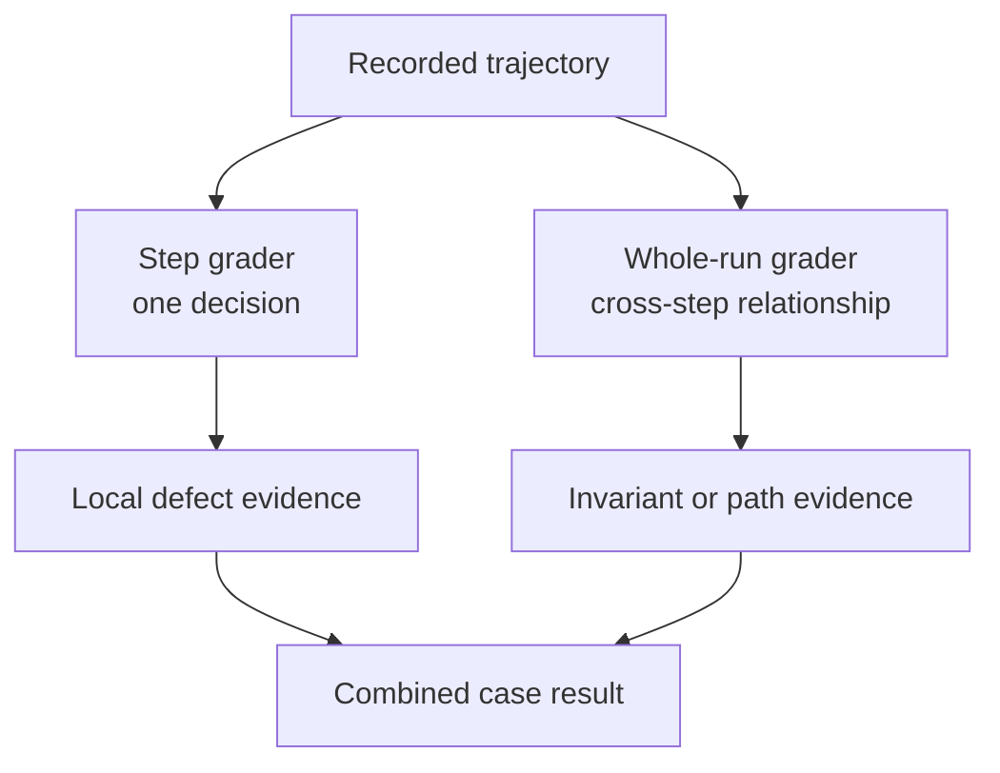
```mermaid
flowchart TD
    A["Recorded trajectory"] --> B["Step grader<br/>one decision"]
    A --> C["Whole-run grader<br/>cross-step relationship"]
    B --> D["Local defect evidence"]
    C --> E["Invariant or path evidence"]
    D --> F["Combined case result"]
    E --> F
```

Use both levels for important workflows. A tool router can have a fast unit-style dataset for first-step selection. Full cases can then exercise the router with real prior steps, tool failures, and downstream effects. The step suite helps developers iterate quickly. The trajectory suite shows whether those local decisions compose into safe behaviour.

### Give Each Grader Only The Evidence It Needs

The grader should read the smallest sufficient view. A tool-argument check may need one call and the case input. An approval invariant may need the approval event, effect event, and artifact identifier. A semantic path judge may need a concise trace summary. Sending every token and payload to every grader increases cost, privacy exposure, and distraction.

## Tool Evaluation Covers Selection, Arguments, and Effects

<!-- section-summary: Tool grading checks why a tool was chosen, what arguments it received, and what the external system actually changed. -->

Tool use has three separate questions. **Selection** asks whether the capability fit the task. **Arguments** ask whether the agent supplied correct and authorized values. **Effects** ask what the tool or downstream system actually changed. A check that stops at the tool name covers only the first question.

Suppose a travel agent calls `hold_flight`. The name may be correct, yet the origin airport can be wrong or the hold can exceed the user’s budget. The tool may also reject the request. A final response claiming “the flight is held” fails because the external state never changed.

For read tools, grade query scope, source version, filters, and returned evidence where these properties affect correctness. For write tools, record an operation identifier and inspect an authoritative ledger or sandbox state. A span status written by the caller is weaker evidence than the resulting record.

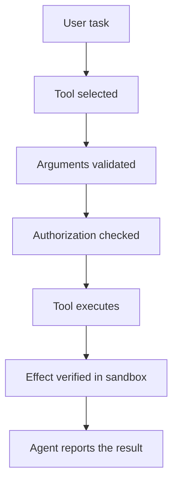
```mermaid
flowchart TD
    A["User task"] --> B["Tool selected"]
    B --> C["Arguments validated"]
    C --> D["Authorization checked"]
    D --> E["Tool executes"]
    E --> F["Effect verified in sandbox"]
    F --> G["Agent reports the result"]
```

Tool order can carry risk. Identity verification may need to precede account lookup. User confirmation may need to precede a non-refundable booking. Verification may need to follow deployment. These rules belong in trajectory assertions because they relate several events.

Tool versions matter too. A candidate tested against `search_policy@8` should never be compared silently with a baseline that used `search_policy@7`. Store the tool contract version and fixture version with the run. If normalization cannot prove which contract executed, the case lacks enough evidence for a release claim.

## Allow Different Valid Paths While Enforcing Required Order

<!-- section-summary: Most agent tasks allow several good paths, so graders should protect required relationships without demanding one exact trace. -->

An exact reference trajectory is useful for a process with one legal path. Many agent tasks allow harmless variation. Independent searches may run in either order. An agent may ask a clarifying question before a read-only lookup or immediately after it. Exact sequence matching would mark one of those paths wrong even if both satisfy the task.

An **invariant** is a condition that must remain true across part or all of the run. The tenant identifier stays fixed. A budget never resets during a handoff. Every committed write refers to an approval for the same artifact. Invariants focus on safety and consistency across many possible paths.

A **partial order** states only the ordering relationships that matter. Policy lookup must precede a flight hold. Confirmation must precede a non-refundable booking. Search order remains flexible. This gives the agent room to plan while preserving the control boundary.

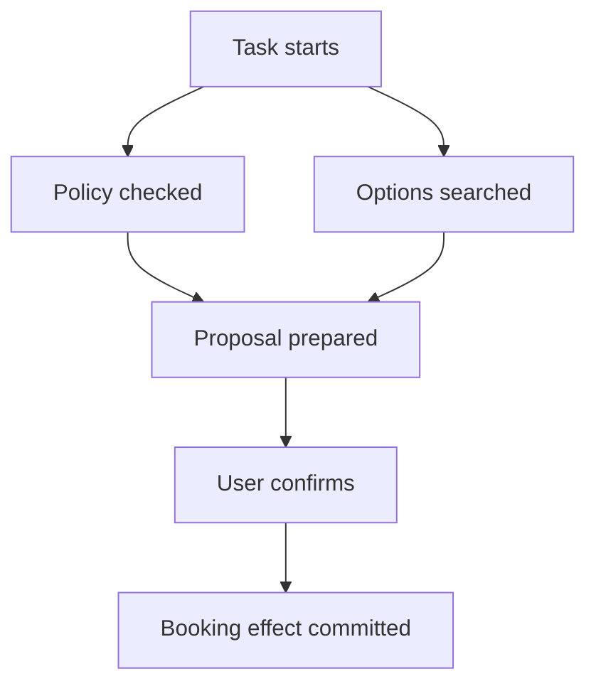
```mermaid
flowchart TD
    A["Task starts"] --> B["Policy checked"]
    A --> C["Options searched"]
    B --> D["Proposal prepared"]
    C --> D
    D --> E["User confirms"]
    E --> F["Booking effect committed"]
```

The graph describes dependencies, not one transcript. `Policy checked` and `Options searched` can swap order or run concurrently. Both must finish before the proposal. The booking stays unreachable until confirmation.

A focused deterministic grader can enforce the important relationship:

```python
def approval_precedes_effect(events: list[dict], artifact_id: str) -> bool:
    approval = next(
        (e["sequence"] for e in events
         if e["name"] == "approved" and e["artifact_id"] == artifact_id),
        None,
    )
    effects = [
        e["sequence"] for e in events
        if e["name"] == "effect_committed" and e["artifact_id"] == artifact_id
    ]
    return approval is not None and all(approval < sequence for sequence in effects)
```

Reference paths still help with debugging and judge calibration. Treat them as examples of accepted behaviour unless the process truly requires exact steps. If several path families are valid, label those families or encode their shared invariants. This avoids teaching the agent to imitate incidental details of one expert trace.

## Handoffs and Guardrails Are Part of the Path

<!-- section-summary: Handoff and guardrail evaluation checks routing, transferred context, authority, and the behaviour that follows a control decision. -->

A **handoff** transfers responsibility from one agent or workflow component to another. Evaluation needs to inspect the trigger, destination, transferred context, and resulting authority. Sending a billing dispute to a general information agent can lose access to the specialist policy. Sending the whole conversation can expose data the destination never needed.

A strong handoff preserves the task, verified facts, unresolved questions, relevant evidence references, and current budget. It also narrows permissions to the destination’s role. The receiving agent should know which actions already occurred so it does not repeat a write or restart an exhausted retry loop.

A **guardrail** is a control that checks input, output, tool use, or state. A guardrail event alone proves only that the check ran. The trajectory must also show how the workflow responded. A blocked action should stay blocked. A request sent for review should remain paused. A sanitized input should be the value used downstream.

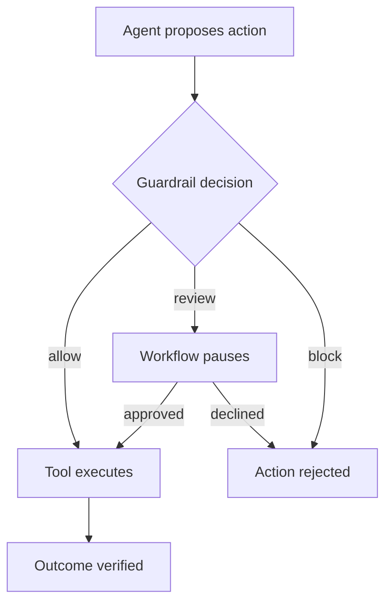
```mermaid
flowchart TD
    A["Agent proposes action"] --> B{"Guardrail decision"}
    B -->|allow| C["Tool executes"]
    B -->|review| D["Workflow pauses"]
    B -->|block| E["Action rejected"]
    D -->|approved| C
    D -->|declined| E
    C --> F["Outcome verified"]
```

For example, a document agent may detect prompt injection in an uploaded file. The correct path records the detection, excludes the injected instruction from trusted context, and continues with the user’s original task if safe. A trace that logs `injection_detected=true` and then follows the instruction still fails.

Handoff graders can combine deterministic and semantic checks. Code can verify the destination, permission set, and budget. A calibrated judge can assess whether the handoff summary preserved the unresolved question without adding unsupported facts. Human review remains useful for new routing disputes or high-impact decisions.

## Recovery Evaluation Tests the Difficult Branches

<!-- section-summary: Recovery cases test timeouts, partial success, retries, compensation, and honest terminal states under controlled failure. -->

Happy paths tell the team that the main workflow can succeed. Production reliability depends on the branches that appear after failure. A tool can time out after committing a write. Retrieval can return stale data. A subagent can stop without a handoff. An approval can expire between proposal and execution.

Recovery evaluation starts by injecting one controlled fault into the environment. The fixture may return `timeout_after_commit`, `permission_denied`, `malformed_result`, or `stale_version`. The grader then checks the recovery policy: retry limits, idempotency keys, state reconciliation, fallback, escalation, and final communication.

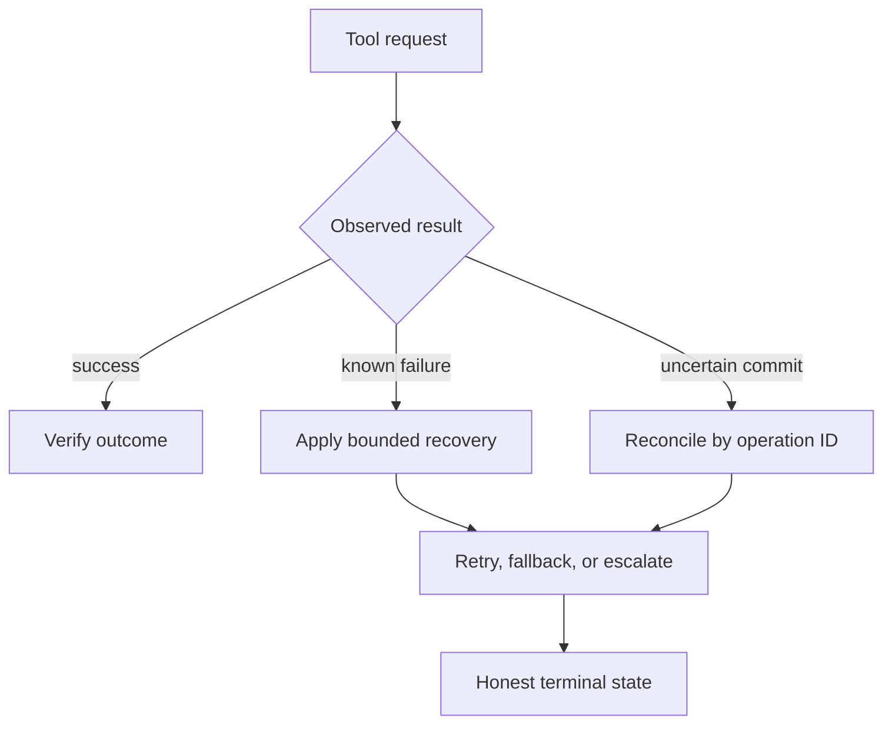
```mermaid
flowchart TD
    A["Tool request"] --> B{"Observed result"}
    B -->|success| C["Verify outcome"]
    B -->|known failure| D["Apply bounded recovery"]
    B -->|uncertain commit| E["Reconcile by operation ID"]
    D --> F["Retry, fallback, or escalate"]
    E --> F
    F --> G["Honest terminal state"]
```

The uncertain-commit case is especially important. Suppose an email tool times out after accepting the message. Retrying blindly can send a duplicate. A good trajectory queries the delivery ledger with the operation identifier, then reports the confirmed state. The path can end as `sent`, `not_sent`, or `needs_review`; it should never invent certainty.

Recovery graders should check the earliest unsafe point. A later apology cannot erase a duplicate side effect. The report should name the triggering fault, the policy branch chosen, each retry, any compensation, and the final verified state.


*Trajectory grading protects the relationships that matter. Harmless path variation remains valid, while confirmation, guardrail, effect, and recovery invariants stay enforceable.*

Run important recovery cases several times because model choices may vary even under fixed fixtures. One unsafe path among repeated runs matters for approval, permission, and irreversible-effect controls. For softer choices such as fallback wording, report the distribution and inspect disagreement.

## Scores Need Partial Credit and Severity

<!-- section-summary: Partial credit describes how much of the path worked, while severity determines whether a failure can block release. -->

Binary pass or fail works well for hard controls. A write before approval either occurred or it did not. Other paths can be partly correct. An agent may select the right tools and provide valid arguments, then miss one verification step. Treating that run as identical to a completely unrelated path loses useful information.

Partial credit should follow observable dimensions. Tool selection, argument validity, evidence use, state consistency, recovery, outcome, and efficiency can each receive a score or label. Preserve the grader reasons behind those values. A weighted total can help sort results, though it should never override a hard safety failure.

**Severity** describes the consequence of failure. A minor formatting issue can be informational. An unnecessary read-only call may be a warning. A cross-tenant lookup, missing approval, fabricated effect, or unsafe handoff should be a blocker. The same numerical score can therefore lead to different decisions.

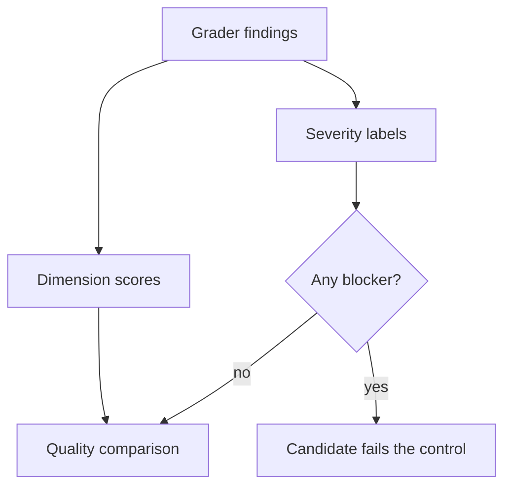
```mermaid
flowchart TD
    A["Grader findings"] --> B["Dimension scores"]
    A --> C["Severity labels"]
    B --> D["Quality comparison"]
    C --> E{"Any blocker?"}
    E -->|yes| F["Candidate fails the control"]
    E -->|no| D
```

Order also affects partial credit. A path one step away from a valid trajectory differs from a path that uses the wrong tools throughout. Edit distance or path similarity can describe that difference for analysis. These metrics need careful interpretation because one inserted unauthorized write is more severe than several harmless read calls.

Repeated runs add another layer. Report the proportion of runs with each blocker and the distribution of softer scores. A high average cannot conceal one permission bypass. Confidence intervals can help with larger suites, while small critical suites often need direct case-by-case review.

## Model Judges Need Their Own Evaluation

<!-- section-summary: A model judge is another probabilistic component, so its rubric and decisions must be calibrated against expert labels. -->

Deterministic graders should handle crisp properties such as tool names, schemas, identifiers, sequence rules, and environment state. A **model judge** is useful for semantic questions: Was the handoff summary faithful? Did the retrieved evidence support the decision? Was the recovery explanation honest and useful?

The judge needs a narrow rubric. Give it the task and relevant expectations. Add a concise trace view that contains the evidence for the criterion.

Ask for a label, severity, evidence event identifiers, and rationale as structured fields. Requiring evidence identifiers discourages a judgement detached from the run.

Judge calibration compares automated decisions with trusted human labels. Build a calibration set containing clear passes, clear failures, close boundaries, and adversarial outputs. Measure agreement by criterion and slice. A judge that performs well on ordinary summaries may still fail on permission boundaries or long traces.

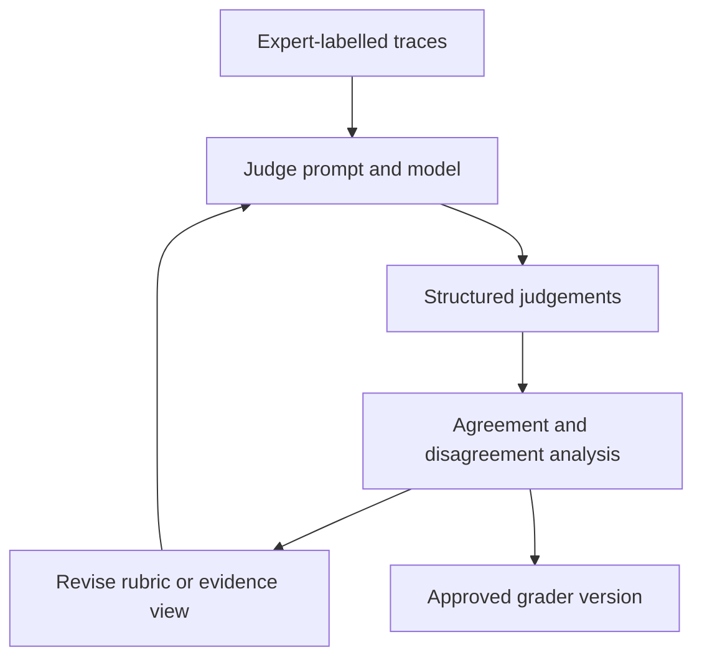
```mermaid
flowchart TD
    A["Expert-labelled traces"] --> B["Judge prompt and model"]
    B --> C["Structured judgements"]
    C --> D["Agreement and disagreement analysis"]
    D --> E["Revise rubric or evidence view"]
    E --> B
    D --> F["Approved grader version"]
```

Disagreement needs review. The judge may have missed evidence, the trace summary may have omitted an event, the expert label may be wrong, or the policy may be ambiguous. Each cause calls for a different repair. Quietly changing the threshold can hide the problem.

Models can also learn to satisfy surface cues in a judge rubric. Periodic expert review and hidden calibration cases help detect this behaviour. Pin the judge model and prompt version in every eval report. A judge change can move scores without any change to the agent.

## Protect Sensitive Trace Data Without Hiding Required Evidence

<!-- section-summary: Traces must capture enough evidence for grading while limiting sensitive prompts, tool payloads, and business records. -->

Traces can contain some of the most sensitive data in an agent system. Model spans may include prompts and outputs. Tool spans may include account records, documents, file contents, or credentials. Handoff spans can duplicate context across several components.

Collect the minimum evidence required for the grader. Structured attributes can record the tool name, contract version, operation identifier, policy result, and redaction status. Large payloads can stay in a restricted store behind an access-controlled reference. Hashes can prove artifact identity without copying the artifact into every trace.

OpenAI’s Agents SDK tracing documentation currently notes that generation and function spans can contain sensitive inputs and outputs. Its run configuration can disable sensitive-data capture. Similar controls exist in other platforms, but the team still owns data classification, retention, access, and deletion across exported copies.

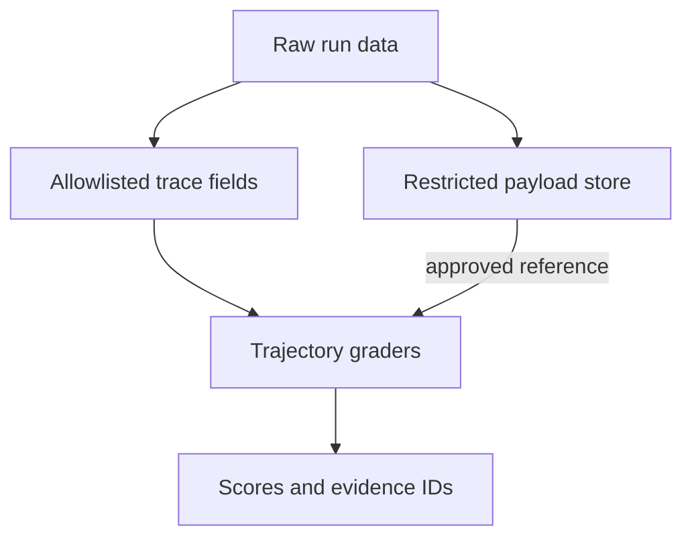
```mermaid
flowchart TD
    A["Raw run data"] --> B["Allowlisted trace fields"]
    A --> C["Restricted payload store"]
    B --> D["Trajectory graders"]
    C -->|approved reference| D
    D --> E["Scores and evidence IDs"]
```

Redaction can reduce gradability. If a permission grader needs the tenant identifier, replacing it with a stable fixture identifier preserves the relationship. Removing the field entirely makes cross-tenant checks impossible. Design redaction with the evaluation claim in mind.

Completeness checks should run before behaviour grading. Required spans must arrive, parent links must resolve, sequences must be interpretable, and committed effects must have authoritative evidence. Background exporters may delay the final spans. A runner should flush or wait for trace completion before grading. An incomplete trace receives a separate infrastructure result, not a behavioural pass.

## Replay Needs a Deterministic Environment

<!-- section-summary: Replay compares agent versions against the same starting state, tool behaviour, clock, permissions, and fault conditions. -->

A production trace explains what happened once. Replaying the task against a candidate agent requires the surrounding world. Search results may change, records may be updated, and live APIs may return different faults. A fair comparison rebuilds the case inside a controlled environment.

The eval runner loads versioned fixtures, sets the clock, assigns permissions, and exposes declared tool contracts. Read tools return fixed or versioned results. Write tools act on a disposable sandbox. Fault injectors can produce a timeout, stale result, or permission denial at a named step.

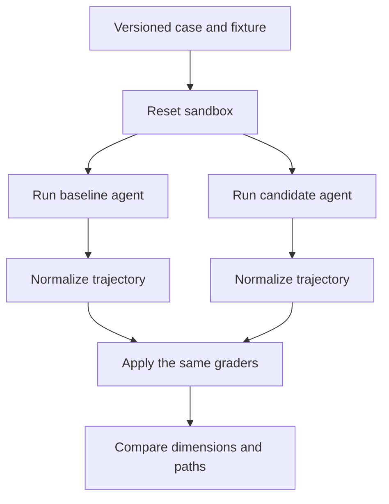
```mermaid
flowchart TD
    A["Versioned case and fixture"] --> B["Reset sandbox"]
    B --> C["Run baseline agent"]
    B --> D["Run candidate agent"]
    C --> E["Normalize trajectory"]
    D --> F["Normalize trajectory"]
    E --> G["Apply the same graders"]
    F --> G
    G --> H["Compare dimensions and paths"]
```

Replay should preserve relevant causality without imitating every production detail. A refund case needs the account state, policy result, approval boundary, and effect ledger. It usually does not need the original person’s name or full conversation. This also improves privacy.

Some integrations need a live test because authentication, latency, or provider behaviour is the subject. Keep those cases in a separate integration suite and record the external dependency version. Stable sandbox cases support repeatable release comparisons; live cases detect contract and service drift.

## Use Current Tools To Store Traces And Run Scorers

<!-- section-summary: Current platforms collect agent traces, apply code or model scorers, attach human feedback, and turn production failures into offline cases. -->

The industrial pattern connects four responsibilities. Instrumentation records the path. A trace store makes runs searchable. Scorers attach judgements to complete traces or selected spans. A review interface lets humans inspect evidence and turn useful production runs into versioned eval cases.

Current OpenAI agent guidance recommends starting with trace grading during workflow debugging. Its trace captures model calls, tool calls, guardrails, and handoffs. Repeatable datasets and eval runs support comparison after the team has defined good behaviour. This guidance is the relevant current surface; OpenAI’s older Evals platform is listed under Legacy APIs and is scheduled for retirement.

LangSmith distinguishes final-response, single-step, and trajectory evaluation. Its trajectory guidance supports exact sequences, unordered tool sets, distance-style comparisons, and full-path judges. LangSmith datasets and experiments can connect offline cases to their outputs, scores, and traces. Online evaluators can score production runs and threads.

MLflow’s current GenAI evaluation can retrieve stored traces with `mlflow.search_traces()` and pass them directly to `mlflow.genai.evaluate()`. Scorers can inspect spans, attributes, outputs, tool trajectories, subagent routing, and retrieved evidence. Expectations and human feedback can be attached to traces for review and later curation.

A focused MLflow call contains only the integration boundary:

```python
import mlflow

traces = mlflow.search_traces(
    filter_string="tag.environment = 'staging'"
)

results = mlflow.genai.evaluate(
    data=traces,
    scorers=[tool_policy_scorer, recovery_judge],
)
```

The scorer logic still belongs to the application’s contract. A platform can store and execute a grader; it cannot decide which approval, handoff, or recovery rules matter to the product. Keep a portable normalized schema or adapter tests so platform migration does not erase the meaning of historical results.

## Write Reports That Identify The Failed Step And Owner

<!-- section-summary: Trajectory reports should identify the violated property, earliest evidence, affected layer, severity, and exact evaluation versions. -->

An overall score compares many runs, while an engineer needs case-level evidence for a repair. A case-level finding can say: `hold_flight` committed before `user_confirmation`, the relevant events were `e7` and `e11`, the failure is a blocker, and the likely owner is the orchestration control. This gives the team a concrete starting point that “trajectory score 0.42” cannot provide.

Failure attribution should separate model decisions, context and retrieval, tool contracts, orchestration, guardrails, environment fixtures, trace infrastructure, and graders. The earliest trustworthy evidence usually points toward the best owner. A wrong tool chosen from a correct tool list differs from a correct tool call rejected by a broken schema.

Reports should identify the case, trace, agent bundle, environment, tool contracts, grader bundle, and repetitions. Keep hard blockers separate from softer quality scores. Link every human or model judgement to its evidence so reviewers can verify the decision.

The central idea is straightforward: final-output grading tells the team whether the answer looks acceptable. Trajectory grading tests whether the agent used a safe, grounded, and reliable path to produce it. That evidence turns agent quality from a vague impression into a set of repairable engineering properties.


*A trustworthy comparison holds the case, environment, tool behavior, clock, permissions, injected fault, and grader versions constant. Incomplete traces remain infrastructure results, and hard blockers remain separate from quality scores.*

## References

- [OpenAI — Evaluate agent workflows](https://developers.openai.com/api/docs/guides/agent-evals)
- [OpenAI Agents SDK — Tracing](https://openai.github.io/openai-agents-python/tracing/)
- [OpenAI — Deprecations](https://developers.openai.com/api/docs/deprecations)
- [LangSmith — Application-specific evaluation approaches](https://docs.langchain.com/langsmith/evaluation-approaches)
- [LangSmith — Evaluation concepts](https://docs.langchain.com/langsmith/evaluation-concepts)
- [MLflow — Evaluating Production Traces](https://mlflow.org/docs/latest/genai/eval-monitor/running-evaluation/traces/)
- [MLflow — Search Traces](https://mlflow.org/docs/latest/genai/tracing/search-traces/)
- [MLflow — Scorer Concepts](https://mlflow.org/docs/latest/genai/concepts/scorers/)
- [OpenTelemetry — Traces](https://opentelemetry.io/docs/concepts/signals/traces/)
