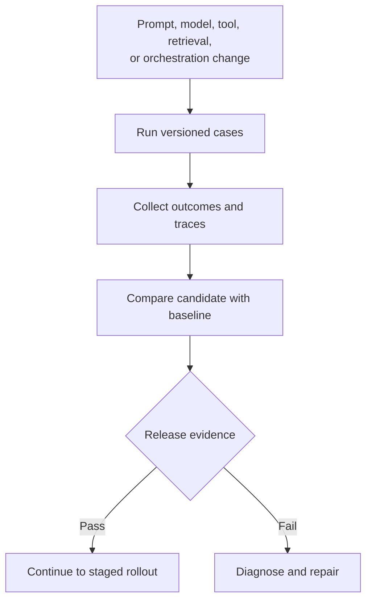
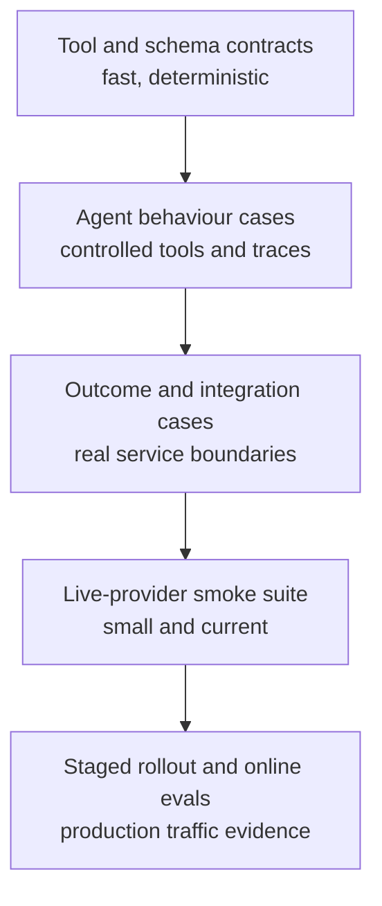
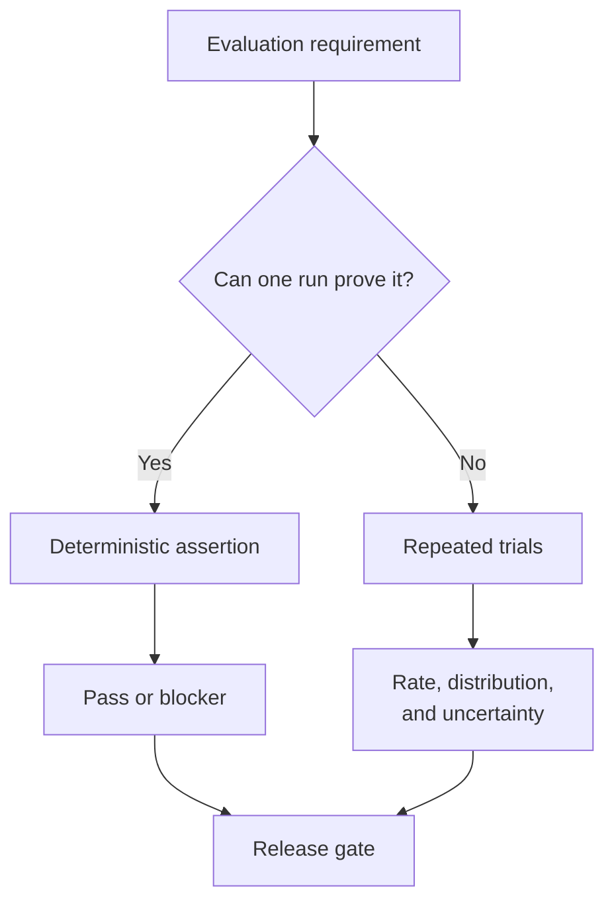
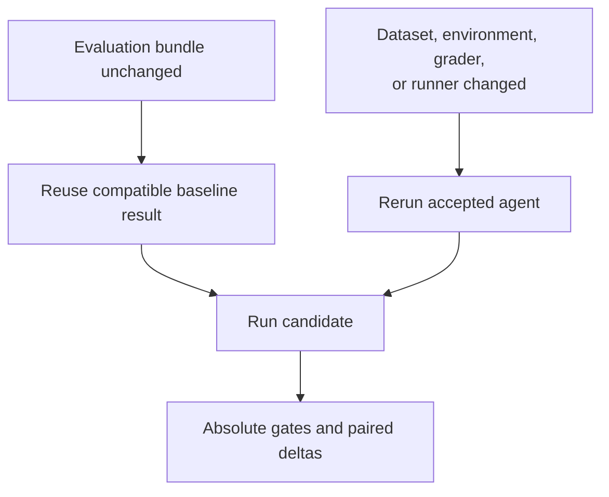
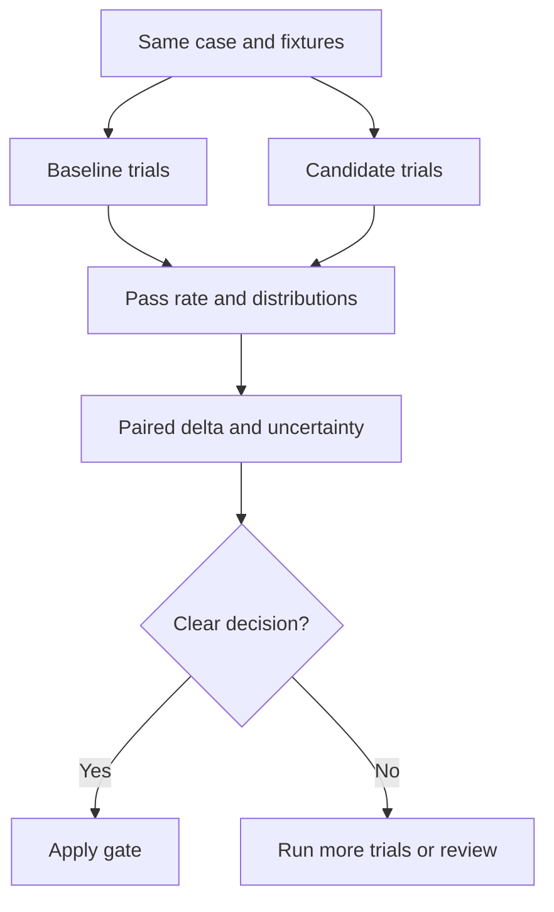
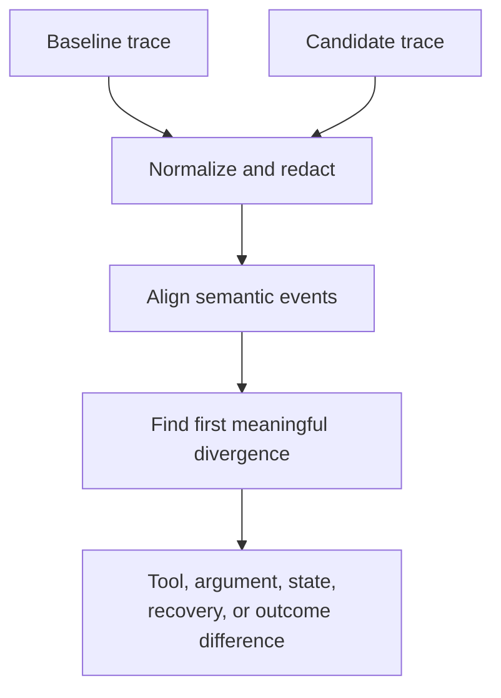
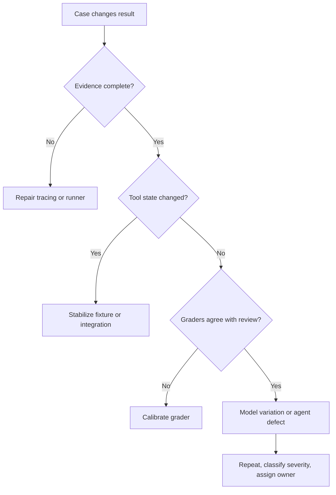
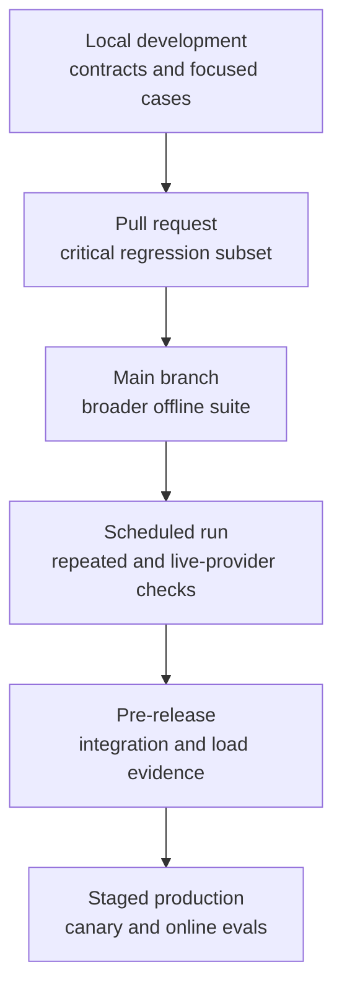
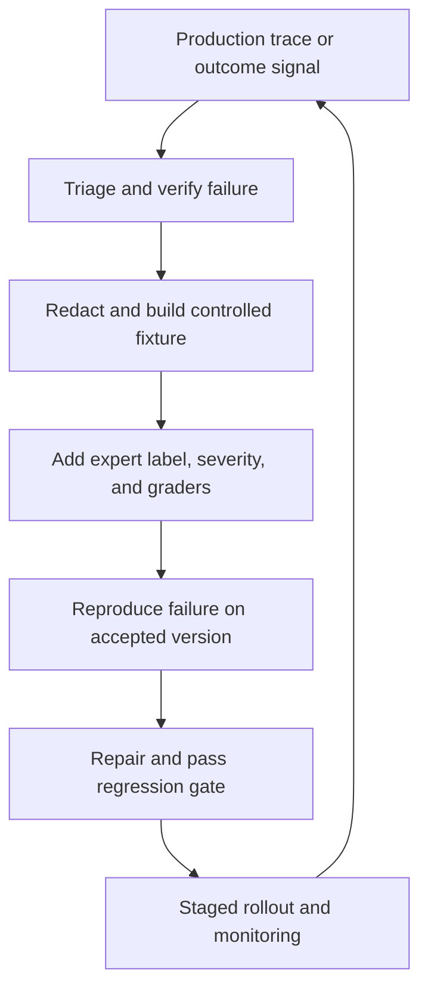

## Table of Contents

1. [An Agent Regression Is a Lost Behaviour](#an-agent-regression-is-a-lost-behaviour)
2. [Test Regressions At Several Layers](#test-regressions-at-several-layers)
3. [Deterministic and Stochastic Checks Need Different Rules](#deterministic-and-stochastic-checks-need-different-rules)
4. [Version Cases, Graders, Tools, And Runtime Together](#version-cases-graders-tools-and-runtime-together)
5. [Baselines Compare Like With Like](#baselines-compare-like-with-like)
6. [Repeated Trials Measure Uncertainty](#repeated-trials-measure-uncertainty)
7. [Release Gates Separate Blockers From Quality Budgets](#release-gates-separate-blockers-from-quality-budgets)
8. [Trace Diffing Explains What Changed](#trace-diffing-explains-what-changed)
9. [Investigate Intermittent Test Failures](#investigate-intermittent-test-failures)
10. [CI Tiers Balance Speed, Cost, and Coverage](#ci-tiers-balance-speed-cost-and-coverage)
11. [Run Fast Regression Checks In CI](#run-fast-regression-checks-in-ci)
12. [Record Why A Release Passed Or Failed](#record-why-a-release-passed-or-failed)
13. [Add Production Failures To The Regression Suite](#add-production-failures-to-the-regression-suite)
14. [References](#references)

## An Agent Regression Is a Lost Behaviour

<!-- section-summary: An agent regression occurs after a change causes previously accepted behaviour to fail, even if the final response still sounds convincing. -->

At a high level, an **agent regression** means that a behaviour which previously met its requirements now fails after a change. The change could affect a prompt, model, tool schema, retrieval system, orchestrator, safety policy, or grader. The lost behaviour might be answer quality, correct tool use, approval handling, recovery from an error, or respect for a cost limit.

This idea comes from ordinary software testing, with one important addition. An agent produces both an answer and a path through a changing environment. A useful regression suite therefore checks the outcome and the path. It reruns stable cases against a candidate version, compares the evidence with an accepted baseline, and turns the differences into a release decision.



### Why final-answer snapshots miss important failures

A text snapshot compares the new response with a stored response. That technique works for exact strings and tightly controlled templates. Agent responses often have many valid phrasings, so a harmless wording change can fail the snapshot. A more serious process failure can also pass if the final paragraph still sounds plausible.

Consider an agent that must check a refund policy and request approval before issuing a credit. A final-answer check may accept “The refund was approved.” The trace could reveal that the agent read an expired policy, skipped approval, received an error from the payment tool, and reported success anyway. The words alone hide the safety and state failures.

A useful agent regression case can examine several kinds of evidence:

- the final outcome in the authoritative system;
- required and forbidden tool calls;
- tool arguments and returned status;
- ordering rules such as approval before a write;
- recovery after timeouts or rejected arguments;
- latency, token use, and estimated cost;
- trace completeness and grader confidence.

The suite does not demand one identical trajectory for every run. It protects the properties that define acceptable behaviour. If two search strategies both use current sources and produce a grounded answer, both paths may pass. If either path performs an unauthorized write, the case fails.

## Test Regressions At Several Layers

<!-- section-summary: Layered suites place fast deterministic checks close to development and reserve slower live evaluation for broader system evidence. -->

One eval suite rarely provides every kind of evidence at a practical speed. In essence, a **layered suite** gives each question to the cheapest environment capable of answering it reliably. Fast contract checks catch basic breakage during development. Full agent cases test decisions and trajectories. Live integration checks confirm that external providers and deployed services still behave as expected.

The layers form a progression from controlled evidence to realistic evidence. Higher layers usually cost more and vary more. Lower layers run frequently and point to a narrow defect. A release decision combines them without pretending that one score represents the whole system.



### Contract and component suites

The first layer checks ordinary software properties. Tool schemas parse. Required fields are present. Permission rules reject unauthorized calls. A state reducer produces the expected next state. Retrieval filters preserve tenant boundaries. These tests can use fixtures, stubs, and sandbox records. They should run on every relevant pull request because the result is stable and the defect is usually local.

For example, a tool contract test can submit a refund request without an `approval_id` and assert that validation rejects it. No model call is needed. Another test can confirm that an orchestrator routes `tool_timeout` into a bounded recovery state. These checks protect agent infrastructure before stochastic reasoning enters the run.

### Behaviour and trajectory suites

The next layer runs the agent against versioned tasks. It checks semantic outcomes plus important events in the trace. A customer-support case may accept several polite answers while requiring a current policy lookup and forbidding a payment write. A coding-agent case may allow different exploration paths while requiring tests before a completion claim.

[OpenAI agent evals](https://developers.openai.com/api/docs/guides/agent-evals) connect datasets, eval runs, graders, and trace grading for this purpose. [LangSmith evaluation](https://docs.langchain.com/langsmith/evaluation-concepts) organizes offline experiments around datasets and examples. [MLflow GenAI evaluation](https://mlflow.org/docs/latest/genai/eval-monitor/) records traces, scorers, datasets, and comparison results. Each platform uses different names around the edges, yet the core objects are similar: case, run, evidence, grader, and result.

### Integration, live-provider, and production suites

Integration cases exercise real boundaries such as a vector store, identity service, or tool sandbox. A small live-provider suite also catches model endpoint changes, authentication problems, quota failures, and tool-calling incompatibilities. Its cases should be few, high value, and isolated from irreversible effects.

Production online evaluation serves a different purpose. It observes real traffic, delayed outcomes, and previously unseen inputs after release. Canary analysis and monitoring can stop a rollout, while the merge-time suite protects known behaviour earlier. A production failure should eventually enter an offline regression dataset after privacy review and expert labeling.

## Deterministic and Stochastic Checks Need Different Rules

<!-- section-summary: Exact contracts can use binary assertions, while variable model behaviour requires repeated trials and statistical summaries. -->

Agent systems mix deterministic software with stochastic model behaviour. **Deterministic checks** should return the same answer for the same controlled input. **Stochastic checks** can vary because model sampling, provider infrastructure, retrieval order, and external tools introduce uncertainty. Treating both groups as a single average score creates confusing gates.

The practical rule is simple: use exact assertions for exact requirements, then use repeated evidence for variable behaviour.
A required approval, forbidden tool, schema field, effect ledger, or maximum retry count is a contract.
Semantic helpfulness, path efficiency, and recovery quality often need a rubric or model judge.



### Use Deterministic Checks For Rules That Must Always Hold

An **invariant** is a rule that must hold across every acceptable path. Examples include “the account ID never changes,” “approval precedes the write,” and “a failed tool result cannot be reported as success.” The evaluator reads structured trace fields or authoritative state to prove these rules.

Suppose a scheduling agent may call either `find_slots` or `find_team_slots`. Both choices can be valid. The invariant requires a successful calendar write before the response says that a meeting was booked. A deterministic grader can inspect the tool result and calendar sandbox. One violation is meaningful; averaging it with several successful trials would weaken the contract.

### Use Repeated Stochastic Checks For Rates And Distributions

A semantic answer grader may pass four runs and fail one. That result carries more information than either “passed” or “failed.” The report should retain trial outcomes, grader reasons, and the uncertainty around the observed pass rate. Latency and cost also form distributions, so teams often compare medians and tail values such as p95.

Model-based graders need versioning and calibration. Their prompts, models, rubrics, and output parsing all affect results. Human-reviewed examples should verify that the judge recognizes acceptable variation and catches important failures. A grader change creates a new measurement system, which is why baseline comparison needs special handling.

## Version Cases, Graders, Tools, And Runtime Together

<!-- section-summary: Reproducible regression evidence records the cases, environment, agent, graders, runner, and thresholds as one versioned bundle. -->

A score can only be interpreted alongside the conditions that produced it. The **evaluation bundle** is the full set of inputs and rules for one run. It includes the dataset, environment fixtures, agent configuration, model settings, prompt, tool contracts, retrieval snapshot, graders, runner, and gate policy.

Think of the bundle as a build manifest for behavioural evidence. If a result changes, the manifest helps reviewers identify which parts changed. If a provider model uses an alias that can move, record the resolved model identifier where the provider exposes one. If retrieval depends on a mutable index, capture a snapshot or immutable corpus version.

```yaml
suite: agent-release
dataset: datasets/release-v12.jsonl
environment: fixtures/support-sandbox-v7
agent:
  revision: "${GIT_SHA}"
  prompt: prompts/support-agent-v19.md
  tools: contracts/support-tools-v8.json
  retrieval_snapshot: policies-v31
model:
  name: "${MODEL_NAME}"
  temperature: 0
graders:
  revision: graders-v14
  judge_model: "${JUDGE_MODEL}"
runner:
  revision: eval-runner-v6
  trials_per_case: 5
gate_policy: policies/release-gate-v9.yaml
```

The manifest deliberately points to separately versioned artifacts. The CI job should resolve those references, calculate content hashes, and write the resolved values into the report. A Git commit alone cannot identify a hosted dataset, mutable model alias, or remote grader configuration.

### Assign An Owner To Every Versioned Component

Different owners review different parts of the bundle. Domain experts approve expected outcomes and severity. Platform engineers own runner and environment reproducibility. Security teams own permission and data-handling rules. Model engineers own prompts, model settings, and semantic graders. The release report should show which bundle fields changed so the right reviewer can focus on the relevant evidence.

OpenAI Datasets support shared test data and grader iteration. LangSmith datasets keep examples for offline experiments. MLflow evaluation datasets can record structured inputs and expectations. Teams can use one of these services as the system of record, while still exporting immutable identifiers and hashes into CI artifacts.

## Baselines Compare Like With Like

<!-- section-summary: A baseline represents accepted behaviour under a compatible evaluation bundle, allowing candidate deltas to support a fair release decision. -->

A **baseline** is the accepted result from a known agent version. It answers a practical question: did this candidate preserve or improve behaviour under comparable conditions? The baseline usually comes from the current production version or the most recently approved release candidate.

Fair comparison requires the candidate and baseline to share the measurement system.
They need the same dataset cases, environment, grader versions, runner logic, and trial policy.
If the grader or environment changes, rerun the accepted agent with the new bundle.
Comparing an old score from grader version 6 with a candidate score from grader version 7 mixes behaviour change with measurement change.



### Use Absolute Requirements And Relative Comparisons Together

An absolute gate asks whether the candidate is safe and useful enough. Examples include zero unauthorized writes, at least 95% pass rate on a critical policy slice, and p95 latency below the service objective. A relative gate asks whether the candidate regressed compared with the baseline, such as a pass-rate drop greater than two percentage points.

Both are useful. A weak baseline should never authorize another weak release merely because the delta is small. An unusually strong baseline should not cause a harmless sampling fluctuation to block every candidate. The gate policy can combine a hard floor, an allowed delta, and uncertainty evidence.

For example, suppose the accepted agent passes 96% of billing-policy trials and the candidate passes 91%. The candidate may remain above a broad 90% floor, yet the five-point drop signals a regression. A separate security slice with one unauthorized action should fail immediately, regardless of the overall average.

### Review Any Change To The Comparison Baseline

Promote a new baseline after the candidate passes and is accepted for release. Store the resolved bundle, raw case results, trace references, summary metrics, and approval record. Updating the baseline to silence a failing pull request erases the evidence. If expected behaviour genuinely changed, update the affected cases and explain the product or policy decision in review.

## Repeated Trials Measure Uncertainty

<!-- section-summary: Repeated trials estimate how reliably a variable agent meets its requirements and show whether an observed score difference is credible. -->

One successful agent run proves that success is possible. It says little about reliability. **Repeated trials** run the same case several times under controlled conditions and record the proportion of acceptable outcomes. This exposes intermittent tool choices, fragile recovery paths, and semantic answers that only sometimes meet the rubric.

Uncertainty matters most near a gate. A candidate that passes 18 of 20 trials has an observed 90% pass rate, yet the sample is small. The true reliability could be meaningfully higher or lower. A confidence interval or bootstrap interval communicates that uncertainty. More trials narrow the interval, with a corresponding increase in cost and runtime.



### Pair trials under comparable conditions

Paired comparison reduces noise by running baseline and candidate against the same case, fixture version, tool responses, and evaluation policy. A fixed random seed can help with local components, although hosted models may still vary. Limit concurrency if rate limits or shared resources change tool behavior.

A **paired bootstrap** repeatedly resamples the case-level baseline and candidate differences to estimate a confidence interval for the overall delta. A simpler team may report Wilson intervals for pass rates and require a minimum sample size. The statistical method matters less than making uncertainty visible and applying it consistently.

### Keep Critical Failures As Release Blockers

Repeated trials never turn a safety violation into a small average penalty. If one run sends a write before approval, the case records a blocker occurrence. The report can also show its frequency, such as one violation in ten trials. Release policy can then require zero occurrences and a minimum number of clean trials for critical workflows.

Trial counts should follow risk and cost. Fast deterministic checks need one run. Critical stochastic cases deserve more repetitions. Broad low-risk suites may use fewer trials on pull requests and more during scheduled or pre-release runs.

## Release Gates Separate Blockers From Quality Budgets

<!-- section-summary: A release gate evaluates hard behavioural contracts separately from bounded changes in quality, latency, token use, and cost. -->

A **release gate** converts eval evidence into an automated pass or fail. Strong gates separate hard blockers from quality and resource budgets. This distinction stops a high average score from hiding a severe failure, while still allowing teams to manage normal variation in softer metrics.

Blockers represent unacceptable events: an unauthorized effect, sensitive-data disclosure, missing required approval, false success claim, incomplete trace for a critical case, or failure of a mandatory tool contract. Budgets cover bounded tradeoffs such as semantic quality, task completion rate, latency, token use, tool-call count, and estimated cost.

### Set Release Gates For Important User Groups

Overall averages can hide a concentrated regression.
A support agent might improve on common account questions while losing accuracy on cancellation policy.
A **slice** groups cases by a meaningful property such as locale, workflow, risk level, tool, customer segment, or input length.
Each critical slice needs its own minimum sample size and threshold.

The gate below shows the important logic without tying it to a specific evaluation platform:

```python
def release_allowed(report, policy):
    if report.blocker_occurrences > 0:
        return False
    if report.trace_completeness < policy.min_trace_completeness:
        return False
    if report.critical_slice_lower_bound < policy.min_critical_quality:
        return False
    if report.quality_delta_lower_bound < -policy.max_quality_drop:
        return False
    if report.p95_latency_ms > policy.max_p95_latency_ms:
        return False
    if report.mean_cost_usd > policy.max_mean_cost_usd:
        return False
    return True
```

The `lower_bound` fields use the conservative end of an uncertainty interval. This policy requires uncertainty evidence alongside the point estimate. Teams with few trials can send borderline results to manual review or schedule more runs.

### Cost and latency are part of agent behaviour

An agent can preserve answer quality while doubling tool calls or repeatedly retrying a slow service. That change affects user experience and infrastructure spend. Record end-to-end latency plus useful components such as model time, tool time, and queue time. Report token usage, tool calls, and provider cost using the resolved pricing policy.

Use separate limits for sudden regressions and absolute service objectives. A 20% latency increase may matter even below the maximum. A small percentage increase may also violate the absolute objective if the baseline was already close to the limit. For highly variable latency, compare p50 and p95 alongside timeout frequency.

## Trace Diffing Explains What Changed

<!-- section-summary: Trace diffing compares meaningful agent events and points reviewers to the earliest behavioural divergence between baseline and candidate. -->

A failed score tells the team that behaviour changed. A **trace diff** helps explain how. It compares normalized baseline and candidate trajectories, then highlights meaningful differences in tool selection, arguments, state transitions, handoffs, guardrails, retries, and outcomes.

Raw traces contain values that change every run, including timestamps, span identifiers, request identifiers, and token-level details. A useful diff removes those fields, redacts sensitive payloads, and maps platform-specific records into a stable event schema. The comparison should preserve event order and causal parent relationships where they affect the task.



Suppose the baseline path is `search_policy → read_policy → request_approval`, while the candidate path is `search_policy → issue_credit`. The first meaningful divergence occurs after search. The candidate skipped evidence reading and approval. A reviewer can inspect the prompt or planner decision around that event without reading every model token.

Another trace may contain the same tool names with different arguments. The baseline searches `policy_status=current`; the candidate omits the status filter and reads an archived policy. The diff should show the argument change, retrieved document version, and downstream claim. Matching only tool names would miss the regression.

### Compare Traces Without Requiring Identical Paths

Exact sequence comparison is often too strict. One run may perform two independent reads in a different order. Another may retry a transient read once. Normalize equivalent events and use partial-order rules for dependencies such as “approval precedes write.” Reserve exact sequence assertions for protocols that truly require them.

OpenAI trace grading can evaluate end-to-end agent traces. LangSmith and MLflow expose trace records and experiment comparisons that support investigation. Teams often add a small normalization layer so release reports retain a stable diff format across SDK or observability changes.

## Investigate Intermittent Test Failures

<!-- section-summary: Flake triage distinguishes expected model variation from unstable infrastructure, incomplete evidence, weak graders, and genuine intermittent defects. -->

A **flaky eval** changes result across equivalent runs without an intentional product change. Flakes waste review time and eventually teach developers to ignore CI. Triage should identify the source of variation and assign an owner. Automatic retries that continue until the suite turns green hide useful evidence.

Five common sources deserve separate treatment. Model variability changes a semantic decision. Tool or environment nondeterminism changes the available evidence. Trace instrumentation drops events. A grader applies the rubric inconsistently. The agent contains a genuine intermittent defect such as a race, unbounded retry, or fragile planner branch.



### Reruns gather evidence; they do not erase the first result

A bounded rerun policy can help classify a failure. Keep the original result and mark every rerun. If the case passes four times and fails once, report five trials with one failure. For a semantic low-risk case, the release policy may evaluate the estimated pass rate. For an authorization case, the single violation remains a blocker.

Quarantine is appropriate only for a known low-risk test defect with an owner and expiry condition. The quarantined case should continue running so the team sees whether it recovers. A flaky critical case needs repair or an explicit risk decision because removing it would create a blind spot.

Caching can speed local evaluation. LangSmith's pytest integration supports cached LLM calls, for example. Cached responses are useful for deterministic runner and grader development. A live-provider compatibility tier should bypass that cache so it can detect provider-side changes.

## CI Tiers Balance Speed, Cost, and Coverage

<!-- section-summary: CI tiers run small high-signal suites near each change and move broader repeated evaluation to later release stages. -->

Running every case with many trials on every commit can be slow and expensive. **CI tiers** match suite depth to the development stage. The earliest tiers provide rapid feedback. Later tiers add breadth, repeated trials, live integrations, and production evidence.

Each tier should have a clear purpose. A pull-request gate protects known critical behaviour. A scheduled suite measures broader quality and detects provider drift. A pre-release suite exercises realistic integration boundaries. Production monitoring checks live traffic and delayed outcomes.



### Local and pull-request tiers

Local tests should finish quickly and avoid irreversible external actions. They cover schema validation, policy invariants, grader unit tests, and a few targeted cases for the code under change. Pull requests add the frozen critical set and known regressions. Path filters can skip unrelated work, while a manual trigger supports investigation.

The pull-request report should finish within the team's normal review cycle. Expensive cases can use fewer trials here if blocker checks remain strong. Any reduced coverage must be visible in the report.

### Main, scheduled, and release tiers

The main-branch suite can run a broader dataset after merge. Scheduled evaluation can use more trials, judge calibration checks, and the small live-provider suite. Pre-release jobs exercise deployed candidate endpoints, identity, retrieval, tool sandboxes, and representative load.

Equivalent tiers work in GitHub Actions, GitLab CI, Jenkins, Buildkite, or managed cloud pipelines. The product choice affects workflow syntax. The release logic stays the same: resolve a bundle, run cases, grade evidence, compare a compatible baseline, apply gates, and publish the report.

## Run Fast Regression Checks In CI

<!-- section-summary: A practical CI job installs a locked runner, executes the selected tier, preserves the report, and returns a failing exit code for a blocked release. -->

The CI workflow should stay small because the evaluation runner owns the domain logic. The workflow selects the tier, supplies approved secrets, executes the runner, uploads its report, and preserves the exit code. Dataset handling, trial execution, grading, statistics, and gate policy belong in tested application code.

The following GitHub Actions job illustrates that boundary. It uses current major releases from the official `actions` repositories. Production teams may pin full commit SHAs for stronger supply-chain control. The job grants read-only repository permission and keeps provider credentials in GitHub secrets or an identity-federated secret manager.

```yaml
name: agent-regression

on:
  pull_request:
    paths: ["agent/**", "evals/**", ".github/workflows/agent-regression.yml"]
  workflow_dispatch:

permissions:
  contents: read

jobs:
  critical-suite:
    runs-on: ubuntu-latest
    timeout-minutes: 30
    steps:
      - uses: actions/checkout@v7
      - uses: actions/setup-python@v7
        with:
          python-version: "3.13"
          cache: "pip"
          cache-dependency-path: "evals/requirements.lock"
      - run: pip install --require-hashes -r evals/requirements.lock
      - name: Run release gate
        env:
          MODEL_API_KEY: ${{ secrets.MODEL_API_KEY }}
        run: python -m evals.run --tier pull-request --report reports/eval.json
      - name: Preserve evaluation report
        if: always()
        uses: actions/upload-artifact@v7
        with:
          name: agent-regression-report
          path: reports/
```

The runner should return a nonzero exit code after a gate fails. It should still write the report before exiting so reviewers can see the cases, grader reasons, trace links, and metric deltas. `if: always()` preserves that report after a failed run.

### Platform integrations can publish richer evidence

[LangSmith's pytest integration](https://docs.langchain.com/langsmith/pytest) can turn decorated tests into dataset examples and experiment results with pass/fail feedback. [MLflow regression testing](https://mlflow.org/docs/latest/genai/eval-monitor/regression-testing/) provides `@mlflow.test`, `mlflow.genai.evaluate()`, and `result.passed` for pytest-based gates. OpenAI Datasets and eval runs can host shared cases and grader results. A team can use these services inside the runner while keeping the CI exit code and report schema portable.

The same pattern maps to GitLab CI or Jenkins: use a locked environment, narrow credentials, bounded timeout, artifact upload, and the runner's exit code. Cloud-hosted eval jobs can also report status back to the source-control check if they preserve the same release evidence.

## Record Why A Release Passed Or Failed

<!-- section-summary: A release report records what ran, how it differed from the baseline, why the gate decided, and where reviewers can inspect evidence. -->

A CI badge gives one bit of information. A **release report** preserves the evidence behind that bit. It allows a reviewer to answer which bundle ran, which baseline was compatible, which cases failed, whether failures clustered in a slice, how uncertain the metrics are, and which resource budgets changed.

The report should be machine-readable for automation and readable through a summary page or pull-request comment. Keep sensitive prompts, tool payloads, and customer data in access-controlled trace storage. The CI artifact can contain redacted summaries plus stable references.

```json
{
  "decision": "blocked",
  "suite": "agent-release",
  "candidate_revision": "git-sha",
  "baseline_revision": "accepted-release",
  "bundle_digest": "sha256:...",
  "blockers": [{"case": "approval-17", "reason": "write_before_approval"}],
  "quality": {"candidate": 0.93, "baseline": 0.95, "delta": -0.02},
  "critical_slice": {"lower_bound": 0.89, "required": 0.94},
  "p95_latency_ms": {"candidate": 8200, "baseline": 7600},
  "mean_cost_usd": {"candidate": 0.041, "baseline": 0.036},
  "flakes": [{"case": "search-08", "classification": "tool_fixture"}],
  "report_version": 1
}
```

### Include The Failed Test, Evidence, And Owner

Every failed gate needs evidence and an owner. Tool contract failures usually go to the tool or platform team. Semantic slice failures go to the domain and model owners. Missing spans go to observability. Grader disagreements go to the eval owner. Cost and latency regressions may involve orchestration, model selection, or provider behavior.

Store raw trial results so aggregate metrics can be recalculated. Preserve the gate policy and bundle digest used at decision time. GitHub workflow artifacts can share reports across jobs and retain them after the run. MLflow or LangSmith experiments can hold detailed case and trace evidence, while a data warehouse supports longer-term trend analysis. Retention and access policies should match the sensitivity of the underlying data.

## Add Production Failures To The Regression Suite

<!-- section-summary: Reviewed production failures should create durable regression cases so a repaired behaviour stays protected in future releases. -->

CI protects known failures. Production reveals new ones. The connection between them is a **production-to-regression feedback loop**: capture a failed trace, investigate the cause, remove sensitive data, construct a controlled fixture, add expert expectations, and run the new case across future candidates.

This loop turns an incident into durable test coverage. The case should preserve the mechanism of failure, not every incidental detail from the original request. If an agent selected an archived policy because a retrieval filter was missing, the fixture needs current and archived documents plus the expected filter. It does not need the customer's identity or the original wording.



### Check Evaluation Evidence Before Promoting A Release

Before adding a production case, confirm that the trace is complete and the outcome is authoritative. A missing tool result can resemble an agent error. A delayed or incorrect label can create a false regression. Human review should identify the actual failure, expected behavior, relevant slice, and severity.

The new case should fail against the affected version. This reproduction step proves that the fixture captures the defect. After the repair, the case joins the frozen regression set or a risk-specific suite. OpenAI's eval guidance, LangSmith datasets, and MLflow evaluation datasets all support this continuous path from observed behavior to reusable offline evidence.

CI regression therefore operates as a learning system. The dataset remembers important failures. Traces explain the path. Graders encode the acceptance rules. Baselines define accepted behavior under a compatible bundle. Gates turn that evidence into a release decision, and production supplies the next set of unknowns.

## References

- [OpenAI — Agent evals](https://developers.openai.com/api/docs/guides/agent-evals)
- [OpenAI — Evaluation best practices](https://developers.openai.com/api/docs/guides/evaluation-best-practices)
- [OpenAI — Datasets](https://developers.openai.com/api/docs/guides/evals)
- [LangSmith — Evaluation concepts](https://docs.langchain.com/langsmith/evaluation-concepts)
- [LangSmith — Pytest and Vitest/Jest integrations](https://docs.langchain.com/langsmith/pytest)
- [MLflow — GenAI evaluation and monitoring](https://mlflow.org/docs/latest/genai/eval-monitor/)
- [MLflow — Regression testing for GenAI applications](https://mlflow.org/docs/latest/genai/eval-monitor/regression-testing/)
- [MLflow — Evaluation datasets](https://mlflow.org/docs/latest/genai/datasets/)
- [GitHub Docs — Workflow syntax for GitHub Actions](https://docs.github.com/actions/using-workflows/workflow-syntax-for-github-actions)
- [GitHub Docs — Workflow artifacts](https://docs.github.com/en/actions/concepts/workflows-and-actions/workflow-artifacts)
- [GitHub — checkout](https://github.com/actions/checkout)
- [GitHub — setup-python](https://github.com/actions/setup-python)
- [GitHub — upload-artifact](https://github.com/actions/upload-artifact)
