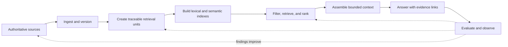
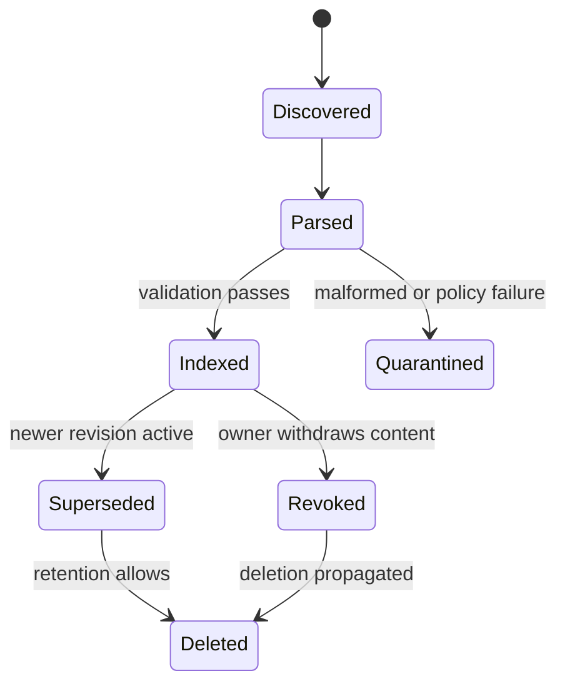
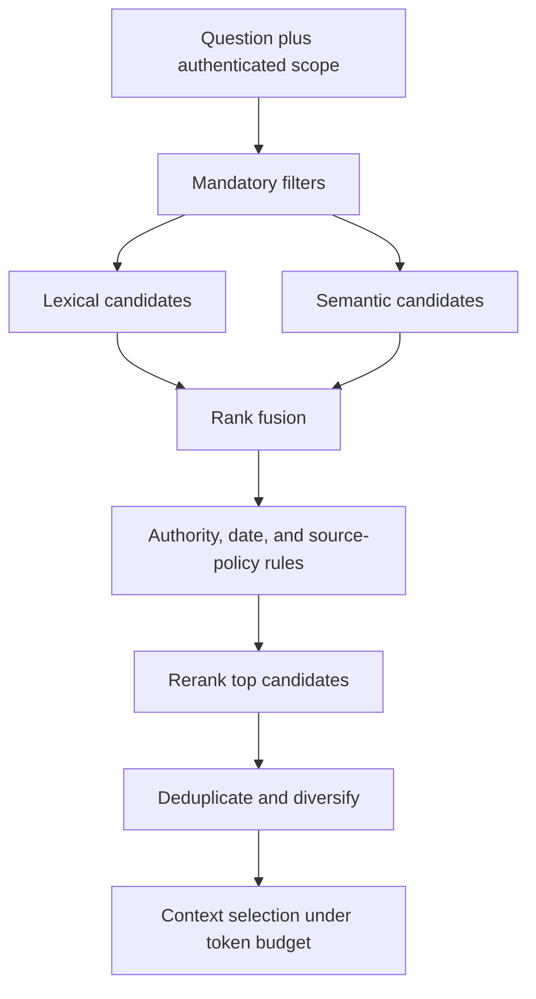

An LLM can write fluent prose without knowing the current policy, contract, product record, or incident. **Retrieval** gives an application a controlled way to find external knowledge and place selected evidence in the model's context before it answers.

The common label **RAG** means retrieval-augmented generation. It describes the connection between search and generation, but it can hide most of the real system. A production retrieval design also decides which sources are authoritative, how content is versioned, what one searchable unit means, when permissions apply, how results are ranked, how citations survive, and how failures are evaluated.

## Follow The Evidence, Not The Database
<!-- section-summary: A retrieval system is an evidence lifecycle from source ownership to an answer whose supporting passages can be traced and checked. -->

Use PolicyDesk, an internal assistant for a medical-device manufacturer, as a supporting example. An employee asks, “May I accept a supplier's dinner invitation during the Munich trade show?” The answer may depend on a global gifts policy, a regional addendum, the employee's role, the current approval threshold, and the date of the event.

The evidence moves through six stages:



Each stage can independently make the answer wrong. A perfect vector search cannot rescue an obsolete source. A relevant chunk without its section heading may be ambiguous. A correct passage retrieved before an access check can leak data. A good context set can still be misquoted by the model. The architecture therefore preserves an **evidence chain** from answer claim back to source version.

This is the main distinction between knowledge and context. The knowledge system holds governed, searchable content. Model context is a temporary projection of a few records for one decision. The context window is not the knowledge base, and a vector database is not the source of truth.

## Start With Source Authority And Freshness
<!-- section-summary: Retrieval quality begins by knowing who owns each source, which version is active, and how updates or deletions propagate into every index. -->

Before chunking documents, build a source inventory. For each source, record its owner, authority, update mechanism, classification, access model, effective dates, retention, and deletion process. PolicyDesk should prefer the compliance repository over an employee's copied PDF because the repository owns the policy lifecycle.

Authority is domain-specific. A ticket may be authoritative for support history but not for the official product warranty. A wiki may explain how engineers use a service while the versioned API specification defines what the service promises. Retrieval should preserve these source classes so ranking and answer policy can distinguish them.

Ingestion turns a source revision into searchable artifacts. It should be repeatable and idempotent: processing the same source version twice must not create duplicate active chunks. Keep the original source ID and revision, ingestion time, content hash, parser version, and status. Mark a replacement as a new revision rather than editing indexed text in place without lineage.



Freshness has two parts. **Content freshness** asks whether the indexed revision matches the owner source. **Decision freshness** asks whether that revision is valid for the question's effective date. A policy effective next month may be the newest document but the wrong rule for today's expense.

Deletion must reach the text index, vector index, cache, citation resolver, and any precomputed summaries. A record removed only from the primary index can continue appearing through another retrieval path.

## A Chunk Is An Evidence Unit
<!-- section-summary: Chunking should preserve a passage that can be retrieved, understood, cited, and governed on its own; fixed token windows are only one implementation technique. -->

Documents are usually too large and too mixed in purpose to retrieve as one unit. A **chunk**—also called a node or passage—is the unit indexed and returned by search. Its boundary should match how evidence is used.

For policy content, a section or subsection is often stronger than an arbitrary slice. Keep the heading path and, when needed, include a small parent summary so the passage remains understandable. Tables may need row groups plus headers. Code documentation may split by symbol. Transcripts may split by speaker turn and time. Fixed token windows are acceptable as a fallback, but they can separate a rule from its exception or a table value from its label.

A useful chunk record is small enough to inspect:

```json
{
  "chunk_id": "gift-policy-9.2-v7",
  "source_id": "policy://compliance/gifts",
  "source_revision": "7",
  "heading_path": ["Supplier hospitality", "Meals at events"],
  "effective_from": "2026-04-01",
  "regions": ["EU"],
  "access_groups": ["employees"],
  "authority": "official-policy",
  "text": "...",
  "locator": "policy://compliance/gifts?v=7#section-9.2"
}
```

Metadata directly affects retrieval behaviour. Region, product, language, document type, effective date, tenant, permission group, and authority can all serve as filters or ranking signals. Keep sensitive attributes in structured filters when they can enforce the boundary more clearly than embeddings.

Chunk size creates a tradeoff. Very small chunks retrieve precisely but lose surrounding conditions. Very large chunks preserve context but dilute the matching signal and consume more model input. Evaluate boundaries using real questions. “How many tokens?” has no universal answer because document structure and evidence needs differ.

## Retrieval Has Several Signals
<!-- section-summary: Lexical search, semantic search, structured filters, recency, authority, and reranking contribute different evidence about relevance. -->

**Lexical search** matches words and phrases. It is strong for identifiers, policy numbers, exact legal terms, product names, and rare vocabulary. **Semantic search** compares vector representations and is useful when question and source express the same idea with different words. Neither dominates every query.

For “supplier dinner at a trade show,” semantic search may connect dinner with hospitality. Lexical search may precisely find “supplier,” “Munich,” or a section number. **Hybrid search** runs both and fuses their ranked candidates. Reciprocal rank fusion (RRF) is a common starting method because it combines rank positions without assuming lexical and vector scores share the same scale.

The first-stage retriever should favor recall: collect a manageable candidate set that probably contains the needed evidence. A **reranker** then spends more computation comparing the question with those candidates and reorders them. Structured rules can boost official sources, demote superseded material, or require a regional addendum when the query has a region.



Notice that permissions are applied before candidate text leaves the index boundary. A prompt that says “ignore documents you cannot access” is not access control. Post-filtering a global nearest-neighbor list can also damage recall: if most top candidates are forbidden, the allowed result set may be empty even when relevant allowed content exists. Prefer an index and search design that supports filtered retrieval within the permitted scope.

Ranking should also avoid redundancy. Five overlapping chunks from one section may crowd out the regional addendum that changes the answer. Group by source section, merge adjacent passages when justified, and preserve diversity across required evidence types.

## Context Assembly Is A Selection Policy
<!-- section-summary: Retrieved candidates enter model context only after the application chooses a bounded, labeled, and instruction-safe evidence set. -->

Search returns candidates; context assembly decides what the model may see. Keep only evidence needed for the task, label every passage with source and locator, order passages deliberately, and state how conflicts should be handled. The model should be able to distinguish official policy, explanatory guidance, historical material, and user-provided text.

Retrieved content is untrusted input. A document can contain text such as “ignore previous instructions” either accidentally or maliciously. Preserve the trust boundary: evidence can supply facts and must never silently gain system-policy or tool-authorization authority. Tool use, access, and output constraints remain in higher-authority application instructions and deterministic checks.

When sources conflict, do not hide the conflict through ranking alone. Prefer an authoritative and applicable source when the policy is clear. Otherwise show the disagreement, cite both records, and ask for review. The answer contract may require the model to abstain when mandatory evidence types are missing.

The context budget belongs to retrieval design. More passages can reduce answer quality by adding irrelevant or contradictory text. Reserve tokens for instructions, the current request, conversation state, tool results, and output. Compaction or summarization can help, but generated summaries need lineage and should not replace exact evidence for high-stakes claims.

## Citations Must Resolve Beyond The Model Output
<!-- section-summary: A trustworthy citation links an answer claim to an immutable evidence record and then to a user-visible source location. -->

Giving the model labels such as `[S1]` is only the first step. The application should own the mapping from each label to a chunk ID, source revision, and stable locator. After generation, validate that cited labels were actually provided and that the caller may still open the source.

A citation should answer three questions: Which claim uses this evidence? Which exact passage and source revision supports it? Can the user inspect that location? A source title without section or version can be too weak, especially when several revisions share a title.

Citation presence is not citation correctness. The referenced passage may be related but fail to support the claim. Evaluate **entailment** or support separately, using human review, a calibrated grader, or task-specific rules. For PolicyDesk, a quoted spending threshold can often be checked deterministically against the retrieved passage.

Hosted retrieval tools can reduce implementation work. OpenAI File Search, for example, currently provides managed semantic and keyword search over uploaded vector stores. A hosted tool still leaves application decisions: which files enter which store, how tenants are isolated, which metadata filters apply, how deletion is verified, and whether the returned evidence satisfies the product's citation contract.

## Evaluate Retrieval Separately From Generation
<!-- section-summary: Retrieval evals locate failures in source coverage, ranking, context selection, and answer grounding instead of reducing the entire system to one answer score. -->

An answer can fail because the source was absent, the right chunk was not indexed, filters removed it, ranking placed it too low, context assembly dropped it, or the model ignored it. An end-to-end score alone cannot tell the team which component to fix.

Create an evaluation set from real questions and important edge cases. For each question, record the applicable source revision, required evidence chunks or sections, forbidden or stale sources, expected answer properties, and abstention conditions. Include exact identifiers, paraphrases, multi-source questions, permission boundaries, temporal questions, ambiguous wording, and adversarial document text.

At the retrieval layer, measure whether required evidence appears in the candidate set and final context. Common measures include recall at *k*, precision at *k*, mean reciprocal rank, and normalized discounted cumulative gain. The metric name matters less than matching the product need: a single-answer lookup cares about the first correct hit; a policy synthesis may require several distinct evidence types.

At the answer layer, measure factual support, citation correctness, completeness, conflict handling, abstention, and task usefulness. Slice results by source, region, language, query type, tenant configuration, and content age. A good average can hide a complete failure on table-heavy policies or exact part numbers.

Use the same set to compare chunking, embedding, hybrid fusion, reranking, and context budgets. Change one important stage at a time and retain the full configuration with the result. Retrieval tuning without versioned eval evidence leaves the team guessing.

## Operate Retrieval As A Data Product
<!-- section-summary: Production traces and runbooks need lineage, timing, selection decisions, and deletion evidence across ingestion, search, and generation. -->

Trace a request through query interpretation, scope filters, candidate IDs and scores, fusion and reranking versions, selected context, citations, answer validation, latency, and cost. Log identifiers and redacted metadata where content is sensitive. Link the trace to source lineage so an incident responder can answer, “Why did this answer use revision 6 after revision 7 was published?”

Monitor ingestion lag, failed or quarantined sources, active revisions, index counts, permission-filter outcomes, empty-result rate, retrieval latency, reranker latency, citation resolution, stale-source use, and evaluation quality. A healthy vector database does not prove the knowledge is current.

When a bad source is discovered, stop serving it first: revoke the revision or add a deny rule that every retrieval path honors. Find affected chunks, cached contexts, and recent answers through lineage. Re-index the corrected source, run focused evals, and only then remove the temporary block. Keep evidence of deletion or supersession.

The durable lesson is that retrieval is an evidence system. Govern sources before indexing them. Make chunks independently understandable and traceable. Combine signals under permissions and freshness rules. Give the model a small, labeled context. Validate citations and evaluate retrieval separately from writing. The vector store is one component inside that framework, not the framework itself.

## References

- [OpenAI API docs: Retrieval](https://developers.openai.com/api/docs/guides/retrieval)
- [OpenAI API docs: File search](https://developers.openai.com/api/docs/guides/tools-file-search)
- [OpenAI API docs: Vector embeddings](https://developers.openai.com/api/docs/guides/embeddings)
- [OpenAI API docs: Data controls](https://developers.openai.com/api/docs/guides/your-data)
- [Elasticsearch hybrid search](https://www.elastic.co/docs/solutions/search/hybrid-search)
- [Elasticsearch ranking and reranking](https://www.elastic.co/docs/solutions/search/ranking)
- [Pinecone metadata filtering](https://docs.pinecone.io/guides/search/filter-by-metadata)
- [Qdrant hybrid queries](https://qdrant.tech/documentation/search/hybrid-queries/)
- [OWASP prompt injection](https://genai.owasp.org/llmrisk/llm01-prompt-injection/)
- [OpenTelemetry GenAI semantic conventions repository](https://github.com/open-telemetry/semantic-conventions-genai)
