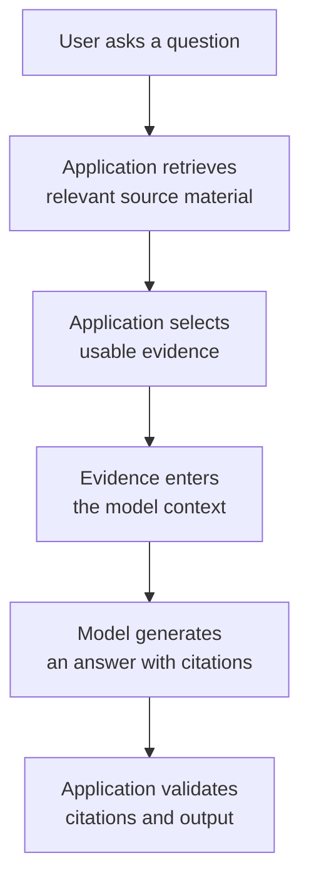
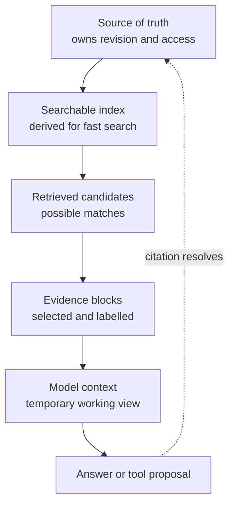
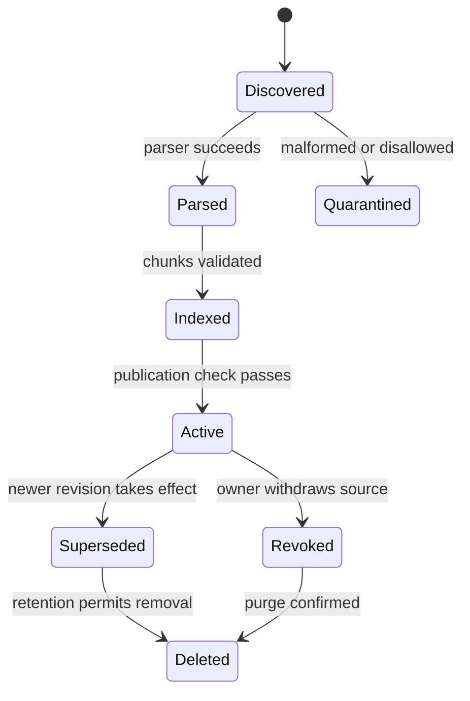
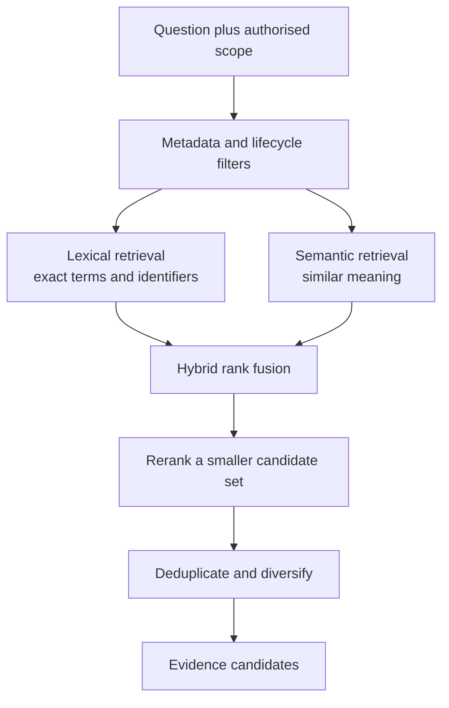
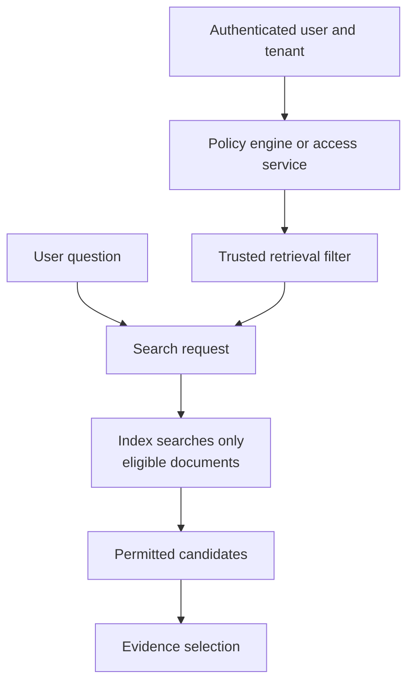
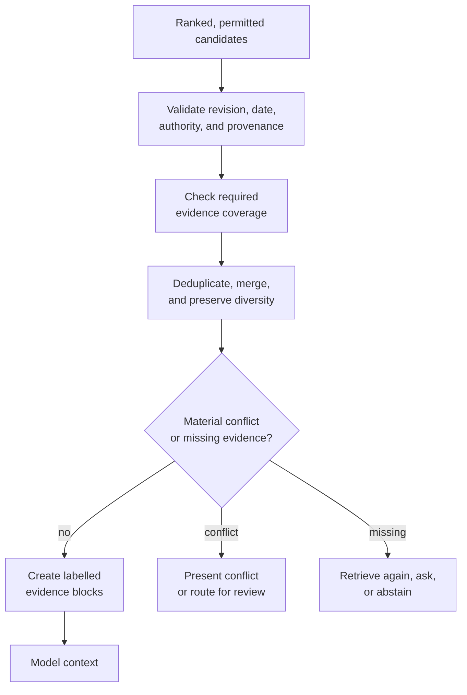
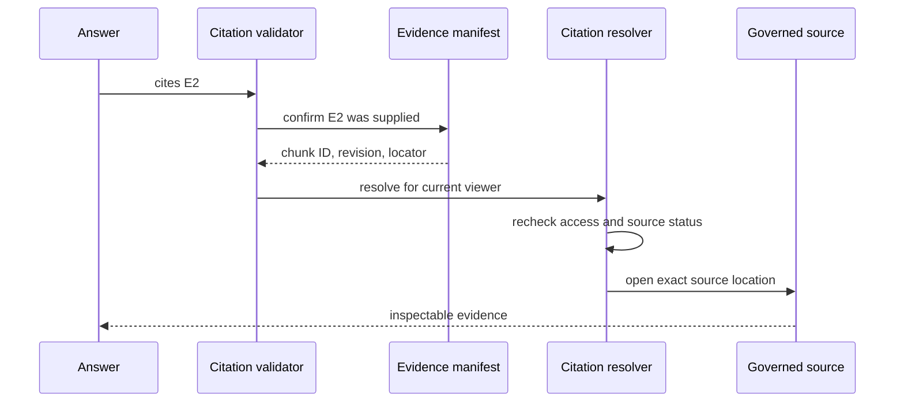
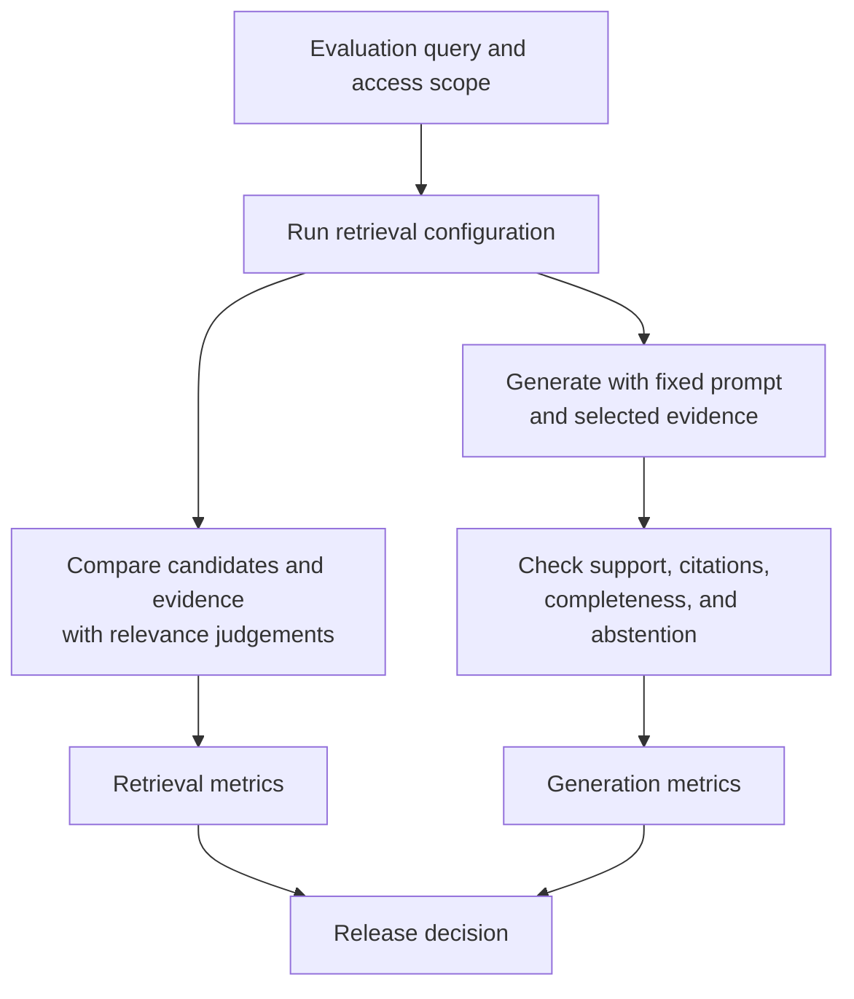
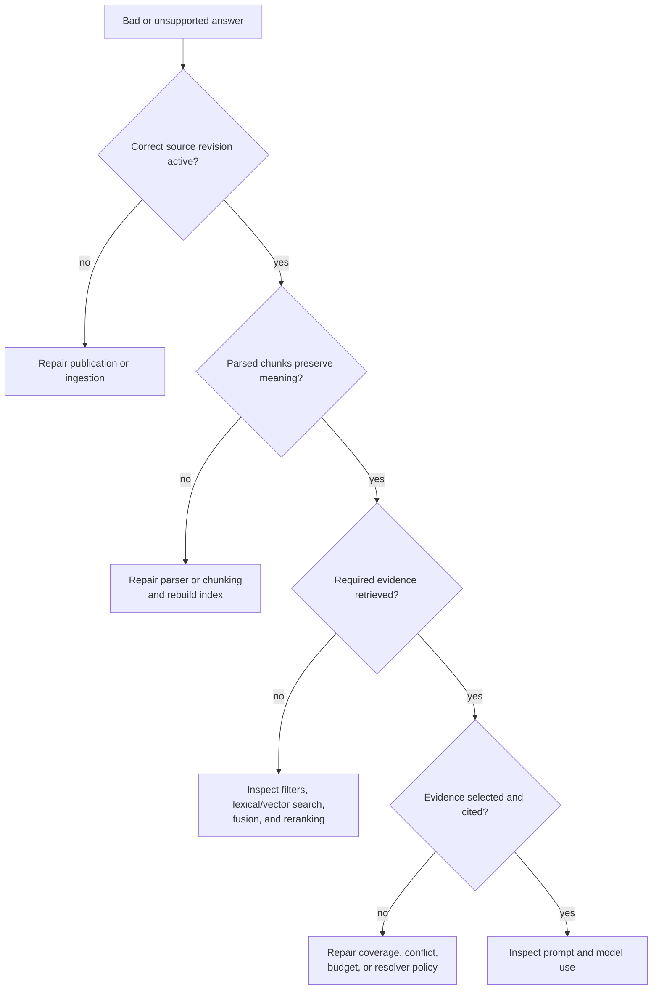

## Table of Contents

1. [Use Retrieval To Give The Model External Evidence](#use-retrieval-to-give-the-model-external-evidence)
2. [Distinguish The Source, Index, Search Results, Evidence, And Model Context](#distinguish-the-source-index-search-results-evidence-and-model-context)
3. [Manage Source Versions Before Tuning Search](#manage-source-versions-before-tuning-search)
4. [Prepare Source Material For Search](#prepare-source-material-for-search)
5. [Combine Several Ways To Search](#combine-several-ways-to-search)
6. [Permissions Must Constrain the Search](#permissions-must-constrain-the-search)
7. [Choose Evidence That Is Complete, Consistent, And Sufficient](#choose-evidence-that-is-complete-consistent-and-sufficient)
8. [Link Every Citation Back To Its Source](#link-every-citation-back-to-its-source)
9. [Evaluate Retrieval Separately From Generation](#evaluate-retrieval-separately-from-generation)
10. [Operate Retrieval as a Production Data System](#operate-retrieval-as-a-production-data-system)
11. [References](#references)

## Use Retrieval To Give The Model External Evidence
<!-- section-summary: Retrieval finds relevant external material and supplies selected evidence to a model without turning the model into the owner of that knowledge. -->

At a high level, **retrieval** is the process of finding information outside a model and bringing the useful parts into one model decision. The external information might be a policy, product manual, source file, support record, research paper, or incident runbook.

This capability matters because a model's training cannot contain every private record or every recent change. Imagine a user asking:

**“What is the current hotel expense limit for a trip to Berlin?”**

A useful answer depends on information that the model may never have seen:

- the organisation's active travel policy.
- the employee's region and role.
- the trip date.
- a local exception for high-cost cities.
- the approval rule for spending above the limit.

The application searches governed sources, selects the passages that apply, and places them in the model's context. The model then explains the limit using those passages.

This pattern is commonly called **retrieval-augmented generation**, or **RAG**. “Retrieval” finds external material. “Augmented” means that the material is added to the model input. “Generation” produces the answer.


```mermaid
flowchart TD
    Q["User asks a question"]
    Q --> R["Application retrieves<br/>relevant source material"]
    R --> S["Application selects<br/>usable evidence"]
    S --> C["Evidence enters<br/>the model context"]
    C --> G["Model generates<br/>an answer with citations"]
    G --> V["Application validates<br/>citations and output"]
```

RAG solves a specific problem: it gives the model timely access to external knowledge at request time. Several other controls remain necessary.

If the source contains an obsolete limit, retrieval can faithfully return obsolete evidence. If the search ignores permissions, it can expose another department's document. If chunking separates a rule from its exception, the retrieved passage can mislead the model. If the model overstates what the passage says, a relevant search result still produces a poorly grounded answer.

A production retrieval system therefore owns four outcomes:

1. the right sources are available and current.
2. the right evidence is found inside the caller's access scope.
3. the evidence arrives with enough context and provenance to be understood.
4. the final answer can be checked against the supplied evidence.

The model participates at the end of this path. Data governance, indexing, access control, and evidence selection determine the quality of what it receives.

## Distinguish The Source, Index, Search Results, Evidence, And Model Context
<!-- section-summary: Source records, searchable indexes, candidates, evidence blocks, and model context represent different stages of the retrieval path. -->

Retrieval discussions often use “knowledge base,” “vector store,” “document,” and “context” as loose synonyms. Clear object boundaries show which component owns a fact and where each failure can occur. Five objects are especially important.

### Keep Original Material In A Source Of Truth

The **source of truth** is the system authorised to publish or change the material. A policy repository may own expense rules. A Git repository may own versioned code. A product catalogue may own specifications. An incident platform may own the active incident record.

The source of truth controls status, revision, ownership, permissions, retention, and deletion. Search systems consume its records. They do not take over that ownership.

### The searchable index is a derived copy

A **searchable index** is a representation prepared for fast retrieval. It may contain lexical terms, vectors, structured metadata, or several of these together. Elasticsearch, OpenSearch, PostgreSQL full-text search, a vector database, and provider-managed vector stores can all serve this role.

Indexes trade source fidelity for search performance. They may lag behind the source, use a different schema, and contain several chunks for one document. An index health check can report green while its content is stale.

### Treat Each Search Result As A Possible Match

A **candidate** is one result returned by a first-stage search. It usually includes an identifier, score, metadata, and text or a reference to text. Candidates are possible evidence. Their presence says, “the search system found this potentially relevant.”

A candidate can still be wrong for the task. It may belong to an expired revision, duplicate another result, miss a regional exception, or lack the caller's required evidence type.

### Select Search Results The Model Can Use

An **evidence block** is a candidate that has passed the application's selection rules. The block contains enough surrounding material to support a claim. It also carries a stable source locator and a clear role, such as `official_policy`, `supporting_guidance`, or `historical_record`.

This is the point where search results become decision material. Selection may merge adjacent chunks, attach a heading path, reject stale revisions, or pair a rule with its exception.

### Model context is the temporary working view

The **model context** contains the evidence blocks plus instructions, current user input, relevant state, and permitted tools for one inference step. It is temporary. The context window never replaces the source or the index.


```mermaid
flowchart TD
    S["Source of truth<br/>owns revision and access"]
    S --> I["Searchable index<br/>derived for fast search"]
    I --> C["Retrieved candidates<br/>possible matches"]
    C --> E["Evidence blocks<br/>selected and labelled"]
    E --> M["Model context<br/>temporary working view"]
    M --> A["Answer or tool proposal"]

    A -. "citation resolves" .-> S
```

Consider a current travel policy stored in a document repository. The repository record is the source. OpenSearch may hold one lexical and vector representation per section. A query returns twenty candidates. The application selects the active global limit and the applicable regional exception as two evidence blocks. Those blocks enter the model context with the user's question.

Each object has its own failure mode. A missing source is an ingestion problem. A missing index entry is an indexing problem. Poor candidate order is a ranking problem. A missing exception in the final evidence is a selection problem. A correct evidence set followed by an unsupported answer is a generation problem.

## Manage Source Versions Before Tuning Search
<!-- section-summary: Search quality depends on a governed lifecycle that publishes, versions, activates, supersedes, revokes, and deletes source material across every retrieval path. -->

The best ranking algorithm cannot recover a document that never entered the index. It also cannot know that a source owner withdrew a policy unless the lifecycle carries that decision into search.

Begin with a source registry. For each collection, record:

- the source owner and approved ingestion path.
- which facts the source can establish.
- document classification and access model.
- revision and effective-date fields.
- update frequency and freshness target.
- retention and deletion requirements.
- the indexes, caches, and summaries derived from it.

This registry explains what “current” means. A product manual may become current as soon as a release tag is published. A policy may be published today with an effective date next month. An incident note may become stale after a few minutes.

### Track Each Source Revision From Ingestion To Deletion

Ingestion should create an immutable record for each source revision. Reprocessing the same revision should produce the same active chunk identities or replace them atomically. Silent in-place edits make citations and incident investigation unreliable.


```mermaid
stateDiagram-v2
    [*] --> Discovered
    Discovered --> Parsed: parser succeeds
    Discovered --> Quarantined: malformed or disallowed
    Parsed --> Indexed: chunks validated
    Indexed --> Active: publication check passes
    Active --> Superseded: newer revision takes effect
    Active --> Revoked: owner withdraws source
    Superseded --> Deleted: retention permits removal
    Revoked --> Deleted: purge confirmed
```

An ingestion record should retain the source ID, revision, content hash, parser version, ingestion time, classification, and current status. The individual chunks inherit that lineage.

### Freshness has two meanings

**Content freshness** asks whether the searchable copy matches the latest source revision. A stale index may still return an old manual after the repository has published a new one.

**Decision freshness** asks whether the revision applies to the situation. The newest travel policy may take effect next month. A question about an expense from last month may require an older revision.

Keep effective intervals as structured metadata:

```text
effective_from <= decision_time
and (effective_to is empty or decision_time < effective_to)
```

This filter expresses a business rule directly. Similarity scores should not choose between policy periods.

### Delete Source Data From Every Derived System

Deleting the source record is only the first step. Derived text indexes, vector indexes, caches, citation mappings, summaries, and evaluation fixtures may still contain the material.

A robust deletion workflow:

1. marks the source revision revoked so new requests cannot select it.
2. removes its chunks from every search path.
3. invalidates cached candidate and context sets.
4. updates citation resolution according to the retention policy.
5. verifies that representative queries return zero active results.
6. records completion for audit.

Provider behaviour affects the temporary control. OpenAI's vector-store documentation states that removing a file is eventually consistent, so search results may include it briefly. An application with urgent revocation requirements needs an immediate deny rule keyed by source or revision while deletion propagates.

This approach treats deletion as a safety property. A successful API response alone provides incomplete evidence.

## Prepare Source Material For Search
<!-- section-summary: Parsing preserves document structure, while chunking turns that structure into passages that can be found, understood, governed, and cited. -->

Raw files are rarely ready for search. A PDF may contain headers, footers, tables, images, and text in a reading order that differs from the page layout. A web page may include navigation and hidden text. A spreadsheet stores meaning in row and column relationships.

**Parsing** extracts useful content and structure from the source. A good parser keeps the hierarchy of headings and paragraphs. Lists and code blocks need their boundaries. Tables need their headers, and page references need to remain connected to the text they locate.

Scanned documents may require optical character recognition, or OCR. OCR converts images of text into machine-readable text, though its output still needs quality checks.

Parser quality directly affects retrieval. If a two-column PDF is read across both columns, the resulting sentences may be nonsense. If table headers disappear, a row containing “Berlin | 240” loses the meaning of 240. Quarantine malformed output and expose parser failures as ingestion errors.

### Keep Each Search Passage Meaningful On Its Own

A **chunk** is the unit stored and returned by the search index. You can think of it as a passage prepared for independent use. Its boundary should preserve the meaning needed to support a claim.

Suppose a policy contains:

**Policy text:** “Hotels are reimbursed up to the regional nightly limit. Conference hotels may exceed that limit with pre-approval.”

Splitting immediately after the first sentence produces a precise-looking rule with a missing exception. A stronger chunk keeps the rule and exception together, along with the heading “Accommodation limits.”

Different content benefits from different boundaries:

- policies often split by section or subsection.
- API documentation often splits by operation or symbol.
- source code often splits by function, class, or logical block.
- tables need headers repeated with relevant row groups.
- transcripts often split by speaker and time range.
- long narrative documents may use paragraph groups with small overlaps.

Fixed token windows remain a practical fallback. Their size and overlap should come from retrieval evaluations. A universal chunk size ignores document structure and task requirements.

### Parent and child passages can work together

Some systems index a small **child chunk** for precise matching, then return a larger **parent passage** for understanding. For example, search may match one paragraph about conference hotels and expand the result to the complete accommodation section.

This pattern separates two goals:

- a narrow representation improves matching precision.
- a wider evidence block preserves conditions, exceptions, and citation context.

The expansion still needs a budget. Returning an entire handbook because one sentence matched recreates the noise problem.

### Record Where Each Search Passage Came From

Every stored search passage needs enough metadata to identify its source, revision, location, permissions, and processing history. A practical record may look like this:

```json
{
  "chunk_id": "travel-policy@18#accommodation-berlin",
  "source_id": "policy://travel",
  "source_revision": "18",
  "heading_path": ["Accommodation", "Regional limits"],
  "language": "en",
  "region": "DE",
  "effective_from": "policy-effective-start",
  "effective_to": null,
  "access_groups": ["employees"],
  "authority": "official_policy",
  "parser_version": "layout-parser-v6",
  "parent_id": "travel-policy@18#accommodation",
  "locator": "policy://travel?revision=18#regional-limits",
  "text": "..."
}
```

Structured metadata supports permissions, time filters, authority rules, citation resolution, and incident diagnosis. Keep filterable attributes out of the embedding alone. An embedding captures meaning; it does not provide a reliable tenant or retention boundary.

## Combine Several Ways To Search
<!-- section-summary: Lexical matching, semantic similarity, structured filters, hybrid fusion, reranking, and diversity contribute different evidence about relevance. -->

One search method rarely handles every query well. Production retrieval commonly combines several signals because each catches a different relationship between the question and the source.

### Lexical search finds exact language

**Lexical search** looks for words and phrases. Search engines often use BM25, a ranking method that gives more weight to informative terms and considers how frequently terms appear in a document.

You can think of lexical search as a skilled index lookup. It is strong for:

- error codes such as `PAYMENT_1042`.
- product identifiers and part numbers.
- policy section names.
- exact phrases.
- rare technical terms.
- names that embeddings may blur together.

PostgreSQL includes full-text search with `tsvector`, `tsquery`, and ranking functions. It can be a practical starting point for a bounded corpus already stored in PostgreSQL.

```sql
SELECT chunk_id,
       ts_rank_cd(search_vector, websearch_to_tsquery('english', :query)) AS rank
FROM knowledge_chunks
WHERE tenant_id = :tenant_id
  AND status = 'active'
  AND search_vector @@ websearch_to_tsquery('english', :query)
ORDER BY rank DESC
LIMIT 40;
```

The query shows two important ideas. Full-text matching finds candidates, and structured conditions restrict the eligible corpus. In production, `tenant_id` must come from authenticated runtime state. Appropriate indexes and database access controls support the query at scale.

### Semantic search finds similar meaning

**Semantic search** represents the query and passages as vectors called **embeddings**. Nearby vectors often express related meaning even if they use different words.

A user may ask about “meal invitations from a vendor,” while the policy uses “supplier hospitality.” Semantic search can connect these phrases. It is useful for natural-language questions, paraphrases, and inconsistent vocabulary.

Semantic similarity still lacks business authority. An archived policy may be the closest vector. A public document may resemble a private one. Structured filters and lifecycle status constrain the vector search.

### Hybrid search combines exact and semantic matches

**Hybrid search** runs lexical and semantic retrieval, then combines the rankings. This protects exact identifiers while still finding paraphrases.

Elasticsearch and OpenSearch both provide current hybrid-search paths. Reciprocal rank fusion, or **RRF**, is a common combination method. It works from rank positions, so lexical and vector scores do not need the same numeric scale.


```mermaid
flowchart TD
    Q["Question plus authorised scope"]
    Q --> F["Metadata and lifecycle filters"]
    F --> L["Lexical retrieval<br/>exact terms and identifiers"]
    F --> V["Semantic retrieval<br/>similar meaning"]
    L --> H["Hybrid rank fusion"]
    V --> H
    H --> R["Rerank a smaller candidate set"]
    R --> D["Deduplicate and diversify"]
    D --> E["Evidence candidates"]
```

RRF is a baseline, not a universal winner. Elastic recommends RRF for its hybrid-search workflow, and OpenSearch provides rank- and score-based combinations. The right settings depend on the corpus and query set. Search-quality evaluations should choose the configuration.

### Metadata filters enforce hard conditions

Metadata filters handle facts that similarity should never guess:

- tenant and access group.
- active or revoked status.
- region and language.
- product or service version.
- source type and authority.
- effective interval.
- document classification.

Apply hard filters before or during candidate retrieval. OpenAI vector-store search and File Search support attribute-based filtering. OpenSearch and Elasticsearch support structured filters in their search queries. Many dedicated vector databases provide similar capabilities.

### Reranking spends more effort on fewer candidates

A **reranker** takes a question and a smaller candidate set, then reorders those candidates using a more expensive relevance model or business rules.

First-stage search may inspect millions of records quickly and return forty candidates. A cross-encoder reranker can compare the full question with those forty passages more carefully. The final selection may use the top eight.

This two-stage design balances speed and quality. Elasticsearch and OpenSearch both support reranking workflows. Teams can also use a separately hosted reranking model.

### Remove Duplicate Results To Cover More Evidence

The five highest-scoring chunks may repeat the same paragraph with small overlaps. **Diversity** controls redundancy so several evidence needs can fit into the context.

Suppose an answer requires a global limit, a regional exception, and an approval rule. Three copies of the global-limit paragraph provide poor coverage.

Group adjacent chunks that express one idea. Deduplicate near-identical text and cap results from one source section. The selector can then reserve places for the exception and approval rule.

## Permissions Must Constrain the Search
<!-- section-summary: Authenticated identity and policy-derived filters must narrow the candidate corpus before restricted text leaves the retrieval boundary. -->

Retrieval can leak information even if the model never quotes it. Candidate IDs, titles, snippets, scores, and result counts may reveal that a restricted document exists. Permission enforcement therefore begins before search results enter model-facing code.

The access path starts with authenticated runtime state:

1. verify the caller and tenant.
2. resolve roles, groups, resource scopes, and purpose.
3. translate those grants into trusted search filters.
4. execute retrieval inside that authorised corpus.
5. recheck access when resolving a citation or opening a source.


```mermaid
flowchart TD
    U["Authenticated user and tenant"]
    U --> P["Policy engine or access service"]
    P --> F["Trusted retrieval filter"]
    Q["User question"] --> S["Search request"]
    F --> S
    S --> I["Index searches only<br/>eligible documents"]
    I --> C["Permitted candidates"]
    C --> E["Evidence selection"]
```

The user message can contain useful search terms. It cannot supply the trusted tenant ID or grant itself a new role. Those values come from the session, identity provider, or policy service.

### Filter By Permissions Before Ranking Results

Imagine a global vector search that returns ten nearest passages and removes forbidden results afterwards. If nine results belong to another tenant, the caller receives only one passage. A relevant allowed passage ranked eleventh never enters the result set.

Searching inside the authorised scope avoids this recall loss. OpenSearch document-level security can restrict which documents a role retrieves. Other stacks may use filtered indexes, row-level security, tenant-specific collections, or mandatory metadata predicates.

The correct design depends on scale and isolation needs:

- shared indexes with mandatory filters can work for many applications.
- separate indexes or collections reduce cross-tenant exposure for stronger isolation.
- highly sensitive workloads may use separate accounts, projects, or infrastructure.

Every path must follow the same rule. Lexical and vector searches need equivalent access filters. Reranking fetches and citation resolution must recheck the permitted documents. Caches and debugging tools must preserve the same boundary.

### Clear Cached Results After Access Changes

Access can change after a context or candidate set has been cached. A user may leave a project, or a document may become restricted.

Cache keys should include the relevant identity or policy version. Sensitive caches need short lifetimes or active invalidation. Citation resolvers should recheck current access before opening a source, even if the answer was created earlier.

## Choose Evidence That Is Complete, Consistent, And Sufficient
<!-- section-summary: Candidate selection builds a small evidence set with the required coverage, explicit source roles, conflict handling, and a safe path for missing support. -->

Search ranking answers, “Which passages look relevant?” Evidence selection answers a richer question: “Which passages are sufficient and appropriate for this decision?”

Task requirements define the selection policy. A hotel-limit answer may require:

- the active base policy.
- the regional limit.
- an exception for event hotels.
- the approval rule.
- the policy revision and stable locator.

A high-scoring regional paragraph alone is incomplete. The selector should check the required evidence types before generation.


```mermaid
flowchart TD
    C["Ranked, permitted candidates"]
    C --> V["Validate revision, date,<br/>authority, and provenance"]
    V --> K["Check required<br/>evidence coverage"]
    K --> D["Deduplicate, merge,<br/>and preserve diversity"]
    D --> X{"Material conflict<br/>or missing evidence?"}
    X -->|no| E["Create labelled<br/>evidence blocks"]
    X -->|conflict| R["Present conflict<br/>or route for review"]
    X -->|missing| A["Retrieve again, ask,<br/>or abstain"]
    E --> M["Model context"]
```

### Resolve Conflicts By Source Authority

Two passages may disagree because one is explanatory guidance and the other is the active policy. The source registry should say which class owns the fact. Select the applicable authoritative revision and retain the supporting material only if it helps interpretation.

Some conflicts cannot be resolved automatically. Two active records may both claim authority. A regional addendum may lack an effective date. A contract and policy may govern different parts of the decision.

In these cases, preserve the disagreement. Give the model both labelled records and a response rule that avoids a definitive claim. High-impact workflows can route the case to a human owner.

### Decide What Happens Below The Confidence Threshold

A similarity threshold can reject weak matches, but a number alone cannot prove evidence sufficiency. A score of `0.82` has no universal meaning across indexes, embedding models, or query types.

Calibrate thresholds on representative questions. Combine the score with required evidence coverage, source authority, and provenance checks. Low-confidence outcomes need an explicit action:

- reformulate or expand the search.
- query another governed source.
- ask the user for a missing detail.
- return “insufficient evidence”.
- escalate for review.

**Abstention** means declining to make a claim that lacks adequate support. It is a designed product behaviour, not a model failure.

### Label And Delimit Evidence Passed To The Model

Each final block should tell the model what it represents:

```text
[E2]
role: official_policy
source: Travel Policy, revision 18
location: Accommodation > Regional limits
applies_to: Germany
effective_for: requested trip period
content: ...
```

Labels help the model distinguish policy from user-provided text or historical guidance. They also provide the keys used by the citation resolver.

## Link Every Citation Back To Its Source
<!-- section-summary: Citation labels must resolve through application-owned evidence records to an inspectable source revision and location. -->

A generated citation such as `[E2]` is a reference inside the answer. The application still needs to map it to the selected evidence block and the underlying source.

You can think of the citation resolver as a link service with access control. It answers:

- Was `[E2]` present in the model's evidence set?
- Which chunk and source revision produced it?
- Which page, section, row, symbol, or time range should open?
- Does the current viewer still have access?
- Is the source active, superseded, revoked, or retained for historical audit?


```mermaid
sequenceDiagram
    participant A as Answer
    participant V as Citation validator
    participant E as Evidence manifest
    participant R as Citation resolver
    participant S as Governed source

    A->>V: cites E2
    V->>E: confirm E2 was supplied
    E-->>V: chunk ID, revision, locator
    V->>R: resolve for current viewer
    R->>R: recheck access and source status
    R->>S: open exact source location
    S-->>A: inspectable evidence
```

The evidence manifest should be immutable for the completed response. A later index rebuild may assign different internal document positions. Stable source IDs and revision-aware locators keep older answers reproducible.

### Citation presence and citation support are different

An answer can cite a relevant passage that fails to support the claim. For example, a passage may mention hotel limits while omitting the amount stated in the answer.

Validate citations at two levels:

1. **resolution:** the label maps to evidence that was actually provided.
2. **support:** the evidence justifies the nearby claim.

Support can be reviewed by humans, checked with task-specific rules, or scored by a calibrated model-based grader. Numeric limits, dates, and identifiers often allow deterministic checks.

Hosted retrieval tools can supply part of this path. OpenAI File Search returns file citations with the generated message and can expose the underlying search results through the response's `include` option. The application still owns source admission, tenant isolation, revision policy, user-facing resolution, and product-specific support checks.

## Evaluate Retrieval Separately From Generation
<!-- section-summary: Retrieval evaluation tests whether the system found and selected the required evidence, while generation evaluation tests how the model used it. -->

An end-to-end answer score tells you whether the whole experience worked. It rarely identifies the failing stage. Retrieval evaluation checks whether the system found and selected the required evidence. Generation evaluation checks how the model used a fixed evidence set. Teams need both views to choose the right repair.

Suppose the answer gives the wrong Berlin limit. Several causes are possible:

- the current policy was absent from the source collection.
- parsing damaged the limit table.
- chunking separated the city from its value.
- the permission filter removed the correct document.
- lexical and semantic retrieval ranked an old addendum first.
- the selector omitted the exception.
- the model misread a correct evidence set.

Separate evaluation exposes the cause.

### Record Which Evidence Each Test Question Requires

Create an evaluation set from real questions, common tasks, and high-risk edge cases. For each query, record:

- the applicable source revision.
- relevant chunks or source sections.
- required evidence types.
- forbidden, stale, or out-of-scope sources.
- caller permissions and decision time.
- acceptable abstention conditions.

Include exact identifiers, paraphrases, multi-source questions, table lookups, permission boundaries, temporal questions, ambiguous requests, and hostile document text.

### Measure Both Search Results And Selected Evidence

**Recall at k** asks whether the required evidence appears among the first *k* results. It matters where missing one passage can invalidate the answer.

**Precision at k** asks how much of the first *k* is relevant. It catches noisy candidate sets that waste reranker and context budgets.

**Mean reciprocal rank**, or MRR, rewards systems that put the first relevant result near the top. It suits tasks where one correct record is enough.

**Normalized discounted cumulative gain**, or nDCG, rewards good ordering across several levels of relevance. It suits results where multiple passages have different usefulness.

Search platforms can calculate these metrics from query sets and relevance judgements. Elasticsearch and OpenSearch both expose ranking-evaluation APIs. The important asset is the judgement set: representative queries paired with reviewed relevance labels.

### Evaluate the generated answer with fixed evidence

Generation evaluation holds the evidence set constant and tests:

- factual support.
- citation correctness.
- completeness.
- conflict handling.
- appropriate uncertainty.
- abstention.
- required output shape.

This isolates the model and prompt from the retriever. A second experiment can hold the model and prompt constant while changing chunking, embeddings, hybrid weights, reranking, or evidence budgets.


```mermaid
flowchart TD
    Q["Evaluation query and access scope"]
    Q --> R["Run retrieval configuration"]
    R --> J["Compare candidates and evidence<br/>with relevance judgements"]
    J --> RM["Retrieval metrics"]

    R --> G["Generate with fixed prompt<br/>and selected evidence"]
    G --> A["Check support, citations,<br/>completeness, and abstention"]
    A --> GM["Generation metrics"]

    RM --> D["Release decision"]
    GM --> D
```

Slice both result sets by source, language, region, query type, document structure, tenant policy, and content age. A healthy average can hide a complete failure on scanned tables or exact part numbers.

Change one major stage at a time. Store the source snapshot, parser version, and chunking policy with the evaluation. Record the embedding model, search query, fusion settings, and reranker as a second group. The selection policy, prompt version, and model configuration complete the reproducible record.

## Operate Retrieval as a Production Data System
<!-- section-summary: Production retrieval needs lineage, freshness monitoring, stage-level traces, deletion controls, and incident diagnosis before teams change the model. -->

Retrieval combines a data pipeline and an online serving path. The data pipeline keeps source revisions and parsed chunks current. It also builds embeddings and updates indexes.

The serving path applies permissions before candidate search. It reranks candidates, selects evidence, and resolves citations for live requests. Each path needs service-level objectives, telemetry, and runbooks.

### Monitor ingestion and serving separately

The ingestion side should expose:

- source discovery and publication lag.
- parse success, quarantine rate, and parser version.
- chunk counts by source revision.
- embedding and index completion.
- active, superseded, and revoked records.
- deletion backlog and verification status.

The serving side should expose:

- query volume and latency by stage.
- empty and low-confidence result rates.
- permission-filter outcomes.
- lexical, semantic, and fused candidate counts.
- reranker latency and failures.
- selected evidence count and token use.
- citation resolution and support quality.
- retrieval and generation evaluation scores.

A healthy vector cluster says that the service is reachable. It cannot prove that the latest source revision was indexed or that the answer used the correct exception.

### Trace A Question From Search To Citation

OpenTelemetry's Generative AI semantic conventions include a retrieval span with `gen_ai.operation.name` set to `retrieval`. Those conventions remain in development, so teams should pin the emitted schema version and review upgrades.

Keep sensitive query text and retrieved documents opt-in. Record stable identifiers, counts, versions, and timing as the default:

```python
with tracer.start_as_current_span("retrieval knowledge-policy") as span:
    span.set_attribute("gen_ai.operation.name", "retrieval")
    span.set_attribute("gen_ai.data_source.id", "knowledge-policy")
    span.set_attribute("app.retrieval.config_version", config.version)
    span.set_attribute("app.retrieval.candidate_count", len(candidates))
    span.set_attribute("app.retrieval.evidence_count", len(evidence))
    span.set_attribute("app.retrieval.source_revision_count", revision_count)
    span.set_attribute("app.retrieval.required_missing", len(missing))
```

Link the retrieval span to ingestion lineage, the context projection, the provider inference span, and citation validation. An operator can then follow one answer back to the exact source revisions and selection rules.

### Diagnose incidents in source-to-answer order

If answer quality drops, begin with evidence integrity. Check the source revision, ingestion status, parser output, chunk metadata, permission filters, candidate rankings, evidence selection, and citation mapping. Inspect model behaviour after confirming the input.


```mermaid
flowchart TD
    I["Bad or unsupported answer"]
    I --> S{"Correct source revision active?"}
    S -->|no| SF["Repair publication or ingestion"]
    S -->|yes| P{"Parsed chunks preserve meaning?"}
    P -->|no| PF["Repair parser or chunking<br/>and rebuild index"]
    P -->|yes| R{"Required evidence retrieved?"}
    R -->|no| RF["Inspect filters, lexical/vector search,<br/>fusion, and reranking"]
    R -->|yes| E{"Evidence selected and cited?"}
    E -->|no| EF["Repair coverage, conflict,<br/>budget, or resolver policy"]
    E -->|yes| G["Inspect prompt and model use"]
```

This order prevents an unnecessary model rollback after a stale source or broken permission filter.

### Contain a bad source before rebuilding

Suppose a withdrawn handbook revision keeps appearing in answers. The first action is containment:

1. add the source revision to a deny rule honoured by every retrieval path.
2. invalidate cached candidates and contexts containing that revision.
3. find affected answers through source lineage.
4. remove the revision from lexical and vector indexes.
5. verify zero active hits with targeted queries.
6. ingest the corrected revision and run focused evaluations.
7. remove the temporary deny rule after deletion is confirmed.

The deny rule provides immediate protection during an eventually consistent delete. The targeted evaluation confirms that the replacement still answers the important questions. Lineage identifies which previous outputs may need review.

A mature retrieval system delivers governed evidence, not merely similar text. Source ownership keeps facts current. Parsing and chunking preserve meaning. Hybrid search, filters, reranking, and diversity find useful candidates. Selection creates a sufficient evidence set. Citation resolution lets people inspect it. Separate evaluations and stage-level traces show exactly where a failure entered the path.

## References

- [OpenAI API: Retrieval and vector stores](https://developers.openai.com/api/docs/guides/retrieval)
- [OpenAI API: File Search](https://developers.openai.com/api/docs/guides/tools-file-search)
- [OpenAI API: Data controls](https://developers.openai.com/api/docs/guides/your-data)
- [PostgreSQL: Full-text search](https://www.postgresql.org/docs/current/textsearch.html)
- [PostgreSQL: Controlling text search and ranking](https://www.postgresql.org/docs/current/textsearch-controls.html)
- [Elasticsearch: Hybrid search](https://www.elastic.co/docs/solutions/search/hybrid-search)
- [Elasticsearch: Ranking and reranking](https://www.elastic.co/docs/solutions/search/ranking)
- [Elasticsearch: Ranking evaluation](https://www.elastic.co/docs/reference/elasticsearch/rest-apis/search-rank-eval)
- [OpenSearch: Hybrid query](https://docs.opensearch.org/latest/query-dsl/compound/hybrid/)
- [OpenSearch: Reranking search results](https://docs.opensearch.org/latest/search-plugins/search-relevance/reranking-search-results/)
- [OpenSearch: Document-level security](https://docs.opensearch.org/latest/security/access-control/document-level-security/)
- [OpenSearch: Ranking Evaluation API](https://docs.opensearch.org/latest/api-reference/search-apis/rank-eval/)
- [OpenTelemetry: Generative AI semantic conventions](https://github.com/open-telemetry/semantic-conventions-genai)
