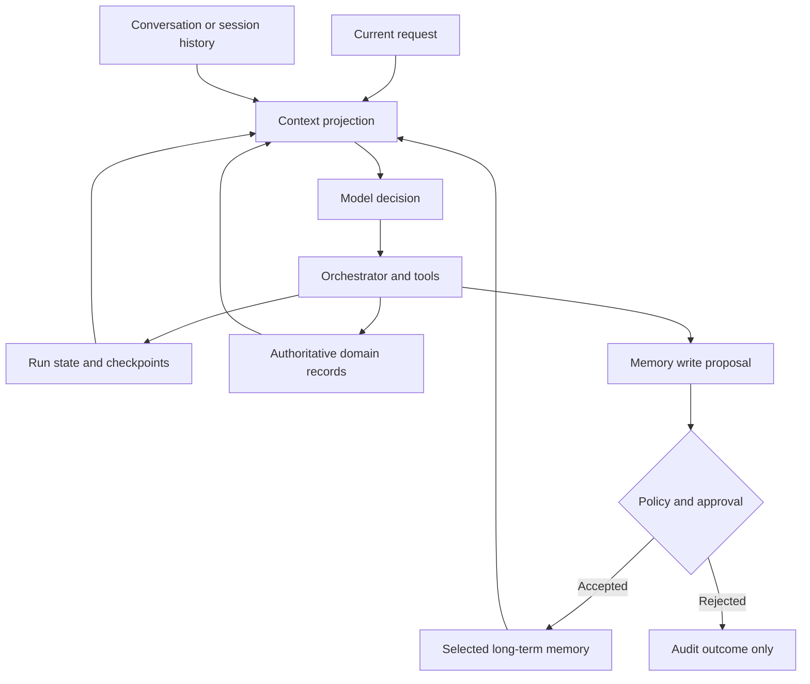
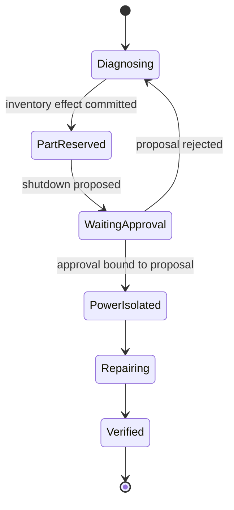
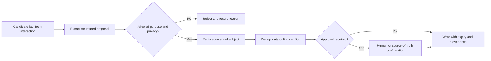

**State** records what is true about the current run and where work should continue. **Memory** stores selected information that may help across later turns or runs. **Conversation history** records exchanged messages. **Domain state** records authoritative business facts such as an order, reservation, or work order.

These concepts are related and should not collapse into one transcript. A message can say that a refund was requested; the payment service determines whether it committed. A checkpoint can say that an agent was waiting for approval; the approval record determines who approved which proposal. A long-term memory can say that a user prefers email; identity and policy determine whether that memory may be used in the current tenant.

## The Architecture Has Four Continuity Layers
<!-- section-summary: Conversation history, run state, domain records, and long-term memory solve different continuity problems and have different authority. -->



The **context projection** is the small view assembled for one model step. Authoritative services remain the systems of record. The application selects current messages, relevant run fields, approved domain facts, and permitted memories. This keeps the model input focused and makes every source traceable.

| Layer | Purpose | Typical lifetime | Authority |
| --- | --- | --- | --- |
| Conversation history | Preserve what participants exchanged | session or thread | evidence of communication |
| Run state | Track progress, pending work, and completed transitions | one task or workflow | orchestrator state |
| Domain records | Store committed business facts and effects | business lifecycle | authoritative domain service |
| Long-term memory | Reuse selected facts, preferences, or experience | across sessions under policy | memory store with provenance |
| Audit history | Explain reads, writes, decisions, and approvals | retention policy | append-only evidence |

This separation prevents two opposite failures. A stateless system repeats questions and actions after interruption. An over-retentive system saves every utterance and later exposes stale, private, or irrelevant information.

## Conversation History Is Evidence, Not Current Truth
<!-- section-summary: Message history preserves dialogue, while structured state and domain services determine current progress and committed effects. -->

Chat history is useful for pronouns, recent instructions, user corrections, and conversational tone. It is weak as the only state mechanism.

Suppose a user says, “Reserve the replacement motor,” the agent requests the inventory tool, and the process crashes after the inventory service commits. The transcript may end with the request. On restart, replaying messages can cause a second reservation. Run state needs the tool-call ID and operation key; the inventory service needs an idempotent reservation record; recovery needs a status query.

Long histories also create context pressure. Even when a model accepts the tokens, stale messages can distract it and increase cost. Session systems should support trimming, compaction, or summary while retaining links to important source records. A summary is a convenience view and can contain errors, so safety-critical facts should be re-read from the authoritative source.

Current OpenAI Agents SDK sessions maintain conversation items across runs and support several storage implementations. The documentation also states that SDK sessions should not be layered with provider-side `conversation_id` or `previous_response_id` continuation in the same run. Choose one history mechanism deliberately so the same items are not duplicated.

## Run State Is A Typed Workflow Record
<!-- section-summary: Run state represents progress, decisions, pending effects, and next transitions in fields that application code can validate. -->

Run state should answer:

- Which task and tenant does this run belong to?
- Which step is active and which transitions are allowed?
- Which inputs and artifacts have stable identities?
- Which tools were requested, completed, or left uncertain?
- Which approvals are pending and what proposal do they bind to?
- Which budget, deadline, and cancellation state apply?
- Which checkpoint can safely resume?

A concise state shape is more useful than a giant object:

```yaml
run_id: repair-88172
thread_id: store-118-condenser
state_version: 14
status: waiting_for_approval
active_step: confirm_power_shutdown
facts:
  equipment_id: condenser-north-2
  observed_error: E-47
completed:
  - safety_manual_retrieved
  - replacement_motor_reserved
effects:
  - operation_id: reserve-motor-WO-88172-FM-204
    status: committed
    authoritative_record: inventory://reservations/9921
pending_approval:
  proposal_digest: sha256:8c31...
  required_role: store_manager
next_on_approval: isolate_power
```

The state contains references and decisions rather than full manuals or transcripts. `state_version` supports optimistic concurrency: a writer updates only the version it read. If another process advanced the run first, the stale writer reloads and reconciles instead of overwriting newer state.

State transitions should be explicit. A model can propose `isolate_power`; application code checks that manager approval exists for the exact proposal digest, safety prerequisites are complete, and the current state still allows the transition.

## Checkpoints Preserve Execution Progress
<!-- section-summary: A checkpoint captures workflow state at a meaningful transition so an interrupted run can resume without repeating completed work blindly. -->

A **checkpoint** is a persisted snapshot or set of state changes associated with a workflow step. It supports interruption, human review, recovery, and debugging.



Checkpoint after meaningful transitions and external effects, not after every token. The checkpoint should include the next allowed node, state version, completed effects, pending interrupts, and code or graph version needed to interpret it.

Resuming has three rules:

1. Read the latest checkpoint and authoritative domain records.
2. Reconcile ambiguous effects before executing again.
3. Continue from an allowed transition under the current workflow-version policy.

LangGraph persistence writes thread-scoped checkpoints at graph steps and supports interrupts, replay, state history, and fault recovery. Its current documentation notes that replay re-executes steps after the chosen checkpoint, including model calls and external operations. Those operations therefore need idempotency or isolation.

Workflow evolution also matters. A checkpoint written by version 4 of a graph may resume under version 5 depending on the runtime. Store workflow identity and define migration or pinning policy for long-lived runs.

## Domain State Remains Authoritative
<!-- section-summary: Business services own committed facts; agent state stores references and reconciliation status rather than pretending to own those facts. -->

Orders, payments, reservations, tickets, access grants, and work orders belong to domain systems. The agent should read them through authorized tools and record stable references.

For a read, capture the source version or timestamp when later decisions depend on it. For a write, use an operation key the domain service recognises. If the caller times out, query by that key. The result may be committed, rejected, pending, or absent. Update run state only from the authoritative response.

Do not “repair” disagreement by editing agent memory. If memory says a customer prefers SMS while the customer profile now says email, the product rule decides which source wins and whether the memory should be corrected or retired.

## Long-Term Memory Needs A Purpose
<!-- section-summary: Durable memory should store a small class of reusable information with subject, provenance, confidence, privacy, expiry, and ownership. -->

Long-term memory can hold different kinds of information:

- **Semantic memory:** a fact or preference, such as an approved site operating constraint.
- **Episodic memory:** a past experience or case that may help with a similar task.
- **Procedural memory:** learned guidance about how to perform work, usually better governed as versioned instructions or policy.

These labels come from human-memory terminology and are useful only when they change storage or review. A user preference may be updated directly. An incident episode may be retained as a sanitized eval case. Procedural guidance should often go through code or prompt review instead of allowing an agent to rewrite its own operating policy silently.

Every durable memory should have:

| Field | Purpose |
| --- | --- |
| Subject and namespace | Prevent cross-user, tenant, or project leakage |
| Type and purpose | Explain why the memory exists |
| Content or structured value | Store the reusable fact, not a raw transcript |
| Provenance | Link to source and confirmation |
| Confidence or verification | Distinguish reported, inferred, and authoritative facts |
| Privacy class and access | Control who may read or change it |
| Created, reviewed, and expiry times | Support ageing and deletion |
| Supersession link | Preserve correction history without using stale values |

Memory is an application feature and should be visible to users where appropriate. Users may need to inspect, correct, or delete remembered information. Privacy, regional, employment, and regulated-domain requirements can restrict what is retained and how consent works.

## Memory Reads Are A Retrieval Problem
<!-- section-summary: Memory retrieval scopes by tenant, subject, task, permission, validity, and relevance before projecting a few records into model context. -->

Do not load every memory associated with a user. Filter in layers:

1. tenant and authenticated subject;
2. allowed memory type for the workflow;
3. validity, expiry, and supersession;
4. permission and privacy class;
5. relevance to the current task;
6. context budget and diversity.

Keyword, structured, recency, and semantic search can all help. Semantic similarity alone is unsafe for authority. A highly similar memory from another tenant must never cross the boundary. A superseded policy note should stay excluded even if it ranks first.

The context projection should label memory as remembered information with source and date. It should not merge memory text into system instructions. Untrusted or user-authored memories can contain prompt injection and should retain their trust class.

Measure whether memory improves the task. Track retrieval precision, stale-memory use, contradiction rate, user corrections, privacy incidents, and task outcome. If a memory rarely helps, retention cost and risk may outweigh its value.

## Memory Writes Need A Governed Pipeline
<!-- section-summary: A model can propose a memory, while deterministic policy, validation, approval, and deduplication decide whether it is stored. -->

A safe write path is:



Separate extraction from storage. A model may identify “Store 118 requires manager approval before power shutdown.” Policy checks whether `site_operating_constraint` is an allowed type. The application verifies the site, source, and confirmer. It looks for an existing constraint. A manager or trusted system confirms the update. The final record carries provenance and expiry.

Background memory extraction can keep the user path fast and allow richer review. Hot-path writes may be needed for immediate corrections. In both cases, one interaction should not create dozens of low-value memories. Apply quotas and deduplication.

Conflicting memories need a resolution state. Preserve both source claims, mark which is active, and record who resolved the conflict. Last-write-wins is weak when facts have different authority.

## State, Memory, And Context Have Different Retention Rules
<!-- section-summary: Retention and deletion follow the purpose and authority of each layer rather than one universal conversation setting. -->

Conversation history may expire after a support period. Run state may remain through task closure and a recovery window. Domain records follow business and regulatory retention. Long-term memory follows its declared purpose and user controls. Audit records may retain metadata longer than sensitive payloads.

Deletion must propagate through indexes, caches, summaries, and backups according to policy. A memory deleted from the primary table but still returned by a vector index is not deleted operationally. Keep subject and lineage IDs so erasure jobs can find derived copies.

Encryption, access control, audit, tenant isolation, and data residency apply to the backing stores. Framework persistence features do not replace the organisation's privacy design.

## Observe And Test Continuity Failures
<!-- section-summary: Traces and evals should show what state and memory were read, changed, resumed, rejected, or contradicted. -->

Trace state and memory through identifiers and decisions:

- run, thread, checkpoint, and state version;
- selected memory IDs and policy version;
- context projection digest;
- tool operation and authoritative record;
- memory proposal, validation, approval, write, supersession, or rejection;
- resume source and replayed steps;
- conflict or concurrency failure.

Avoid putting sensitive memory content into broad telemetry. Store IDs, types, and redacted summaries, with controlled links to the record.

Test scenarios that expose the architecture:

- process crashes after a tool commits and before state updates;
- two devices update the same run concurrently;
- approval arrives for an older proposal;
- a memory expires between retrieval and use;
- a user corrects a remembered fact;
- a similar memory exists in another tenant;
- a summary omits a safety-critical domain fact;
- a workflow version changes before a checkpoint resumes;
- a deletion request must remove a memory and its index entry.

The expected result should include state transition, effect count, selected memory, user-visible response, and audit event. These checks keep continuity bugs from being misdiagnosed as random model behaviour.

## Map The Concepts To Frameworks
<!-- section-summary: Session and graph persistence features implement parts of the architecture after authority, lifetime, and policy are defined. -->

OpenAI Agents SDK **sessions** manage conversation items across runs. They are useful for client-side conversational continuity with supported SQLite, Redis, SQLAlchemy, Dapr, MongoDB, and other implementations. Business state and long-term memory still need application contracts.

LangGraph uses thread-scoped **checkpointers** for graph state and a separate **Store** interface for information shared across threads. This maps cleanly to the distinction between run state and long-term memory. The developer still defines schemas, namespaces, write policy, retention, and authority.

A custom design can use a relational database for run state, a domain database for business records, and a memory store with structured and semantic indexes. Use a framework where it reduces lifecycle work; preserve the conceptual boundaries regardless of storage technology.

## The Durable Continuity Method
<!-- section-summary: Safe continuity comes from separating history, workflow progress, committed domain facts, and selected memory, then projecting only what one decision needs. -->

Treat conversation history as communication evidence. Keep run progress in typed state and checkpoints. Reconcile effects with domain systems. Store long-term memory only for a declared purpose with provenance, privacy, and expiry. Retrieve it under subject and policy scope. Let models propose reads and writes while application code owns authority.

That architecture helps an agent continue after interruption and remain useful across sessions without turning every conversation into permanent, unreviewed memory.

## References

- [LangChain memory overview](https://docs.langchain.com/oss/python/concepts/memory)
- [LangGraph persistence](https://docs.langchain.com/oss/python/langgraph/persistence)
- [LangGraph interrupts](https://docs.langchain.com/oss/python/langgraph/interrupts)
- [OpenAI Agents SDK sessions](https://openai.github.io/openai-agents-python/sessions/)
- [OpenAI Agents SDK agent memory](https://openai.github.io/openai-agents-python/sandbox/memory/)
- [OWASP LLM prompt injection prevention](https://cheatsheetseries.owasp.org/cheatsheets/LLM_Prompt_Injection_Prevention_Cheat_Sheet.html)
- [NIST Privacy Framework](https://www.nist.gov/privacy-framework)
