## Table of Contents

1. [Separate the Five Information Layers](#separate-the-five-information-layers)
2. [Understand Why Agent Memory Exists](#understand-why-agent-memory-exists)
3. [Decide What Deserves Persistence](#decide-what-deserves-persistence)
4. [Give Every Record a Scope and Lifetime](#give-every-record-a-scope-and-lifetime)
5. [Build Working Context Through a Read Policy](#build-working-context-through-a-read-policy)
6. [Govern Memory Writes as Data Changes](#govern-memory-writes-as-data-changes)
7. [Consolidate Memory Without Losing Evidence](#consolidate-memory-without-losing-evidence)
8. [Resolve Conflict and Staleness Explicitly](#resolve-conflict-and-staleness-explicitly)
9. [Keep Domain Systems Authoritative](#keep-domain-systems-authoritative)
10. [Design Privacy, Access, and Deletion Together](#design-privacy-access-and-deletion-together)
11. [Recover Session State Without Repeating Effects](#recover-session-state-without-repeating-effects)
12. [Evaluate Memory as a Product Feature](#evaluate-memory-as-a-product-feature)
13. [Observe Memory Decisions Safely](#observe-memory-decisions-safely)
14. [Choose Industrial Implementations by Responsibility](#choose-industrial-implementations-by-responsibility)
15. [Put the Pieces Into One Production Design](#put-the-pieces-into-one-production-design)
16. [The Main Idea](#the-main-idea)
17. [References](#references)

## Separate the Five Information Layers
<!-- section-summary: Working context, session state, durable memory, retrieved knowledge, and system-of-record data serve different purposes and carry different authority. -->

At a high level, **agent memory is the part of an application that preserves selected information so a later model call can continue useful work**.
The difficult part is deciding what “selected” and “later” mean.

Teams often place a transcript, tool results, user preferences, workflow progress, and business records into one object called memory.
That object soon contains information with different owners, lifetimes, and trust levels.
A useful design starts by separating five layers.

### Working context is the model's temporary desk

**Working context** is the exact information sent to the model for one step.
It can contain instructions, recent messages, selected memories, retrieved passages, current state, and tool descriptions.

You can think of it as a temporary desk.
The application places the material needed for the current decision on the desk, the model uses it, and the next step may receive a different arrangement.
The context window limits how much fits on that desk.
Material appearing there gains no new authority simply because the model can see it.

### Session state records current progress

**Session state** records what is happening inside one conversation, task, or workflow.
It may hold the active step, completed tool calls, pending approval, selected files, budget, checkpoint, and recent message history.

This is the system's working record for continuation.
If a process restarts, session state should explain where execution may safely resume.
Conversation history is useful session evidence, although structured fields should carry progress that application code must validate.

### Durable memory carries selected information across sessions

**Durable memory** stores information expected to help again after the current session ends.
A confirmed communication preference, a project convention, or a sanitized lesson from a resolved incident can qualify.

Durable memory is selective.
Each record names its subject and future purpose.
It also carries its source, confidence, and privacy class.
An expiry or review policy limits how long the application treats it as active.
It may still be wrong or outdated, so the application presents it as remembered information with visible source, age, and confidence.

### Retrieved knowledge brings source material into the current decision

**Retrieved knowledge** comes from documents, code, policies, catalogues, or other governed collections.
The retrieval index helps find that material.
The source system still owns its revision, permissions, and meaning.

A team handbook explaining an expense rule is retrieved knowledge.
A user preference for receiving a weekly digest is durable memory.
They may both enter working context, but they answer different questions and follow different update paths.

### System-of-record data owns committed facts

**System-of-record data** is the authoritative business state: the current order status, account balance, access grant, reservation, or incident record.
The agent reads or changes it through an authorized tool.

Memory may retain a reference such as `order_id: 8421`.
The commerce service decides whether that order has shipped.
Copying yesterday's order status into long-term memory would create a stale rival to the real record.

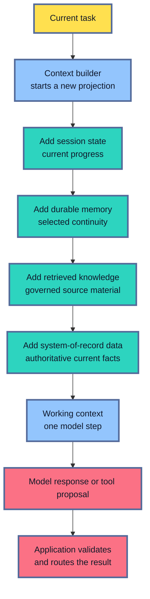
```mermaid
flowchart TD
    A["Current task"] --> B["Context builder<br/>starts a new projection"]
    B --> C["Add session state<br/>current progress"]
    C --> D["Add durable memory<br/>selected continuity"]
    D --> E["Add retrieved knowledge<br/>governed source material"]
    E --> F["Add system-of-record data<br/>authoritative current facts"]
    F --> G["Working context<br/>one model step"]
    G --> H["Model response or tool proposal"]
    H --> I["Application validates<br/>and routes the result"]

    classDef task fill:#FFE04F,stroke:#536A9A,stroke-width:3px,color:#111827
    classDef source fill:#2DD4BF,stroke:#536A9A,stroke-width:3px,color:#0F172A
    classDef context fill:#93C5FD,stroke:#536A9A,stroke-width:3px,color:#0F172A
    classDef action fill:#FB7185,stroke:#536A9A,stroke-width:3px,color:#111827
    class A task
    class C,D,E,F source
    class B,G context
    class H,I action
```

The boundaries map each failure to the component that owns it.
A missing recent instruction is a context-selection problem.
A task resuming at the wrong step is a session-state problem.
A stale preference is a durable-memory problem.
An obsolete policy passage is a retrieval problem.
An incorrect payment status is a domain-data problem.

## Understand Why Agent Memory Exists
<!-- section-summary: Memory provides continuity, personalization, and accumulated experience where repeated model calls would otherwise start with too little useful history. -->

Models process the input supplied to the current call.
They do not automatically remember a discussion after the application stops sending it.
Long conversations also outgrow practical context budgets, and production workers restart or move between machines.

Memory addresses three practical needs.

**Continuity** lets a later turn understand references such as “continue the migration plan” without replaying an entire session.
Session state supplies the current plan and unfinished step.

**Personalization** lets a later session reuse an allowed, stable preference.
For example, an accessibility setting that requests concise text and avoids colour-only explanations can improve future responses without forcing the user to repeat it.

**Accumulated experience** lets an application retain useful lessons.
A coding agent may remember a repository's confirmed test command.
An operations assistant may retrieve a sanitized incident pattern that was reviewed after resolution.

These benefits have costs.
Every retained record can grow stale, cross a privacy boundary, consume retrieval budget, or carry malicious instructions forward.
More stored text also creates more candidates for the context builder to rank.

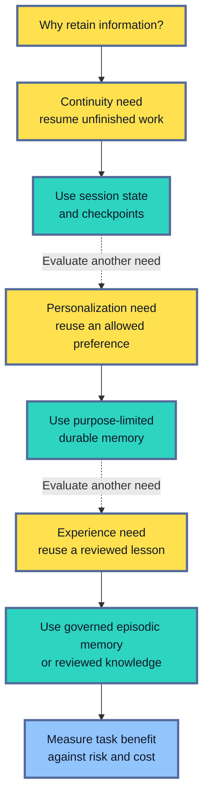
```mermaid
flowchart TD
    A["Why retain information?"] --> B["Continuity need<br/>resume unfinished work"]
    B --> C["Use session state<br/>and checkpoints"]
    C -. "Evaluate another need" .-> D["Personalization need<br/>reuse an allowed preference"]
    D --> E["Use purpose-limited<br/>durable memory"]
    E -. "Evaluate another need" .-> F["Experience need<br/>reuse a reviewed lesson"]
    F --> G["Use governed episodic memory<br/>or reviewed knowledge"]
    G --> H["Measure task benefit<br/>against risk and cost"]

    classDef need fill:#FFE04F,stroke:#536A9A,stroke-width:3px,color:#111827
    classDef store fill:#2DD4BF,stroke:#536A9A,stroke-width:3px,color:#0F172A
    classDef outcome fill:#93C5FD,stroke:#536A9A,stroke-width:3px,color:#0F172A
    class A,B,D,F need
    class C,E,G store
    class H outcome
```

The right goal is useful continuity with controlled retention.
A stateless application repeatedly asks for the same information.
An over-retentive application carries every remark into future decisions.
Production design finds the smaller set of information that produces a measurable benefit.

## Decide What Deserves Persistence
<!-- section-summary: A durable memory earns retention through a declared future use, stable meaning, valid source, permitted scope, and manageable correction path. -->

Persistence gives today's information a chance to influence future behaviour.
That influence deserves an explicit product decision because every saved record adds retrieval cost, privacy exposure, and a possible stale fact.

The first memory policy should answer a simple question:
**Which future task will this record improve?**

A confirmed preference for kilograms may improve later measurement answers.
A one-time request to “use kilograms in this reply” belongs only to the current session.
A shipping address belongs in the customer profile if the product is authorized to store it.
The agent memory can keep the profile identifier and retrieve the current address through the account service.

Five tests help decide whether a candidate deserves durable storage:

1. **Future value:** the information has a named use beyond the current turn.
2. **Stability:** it is likely to remain useful for the planned lifetime.
3. **Permission:** collection and reuse fit the product purpose, consent, and access policy.
4. **Evidence:** the system can identify who supplied or verified it.
5. **Correction:** a user or owner can inspect, update, supersede, or delete it.

Durable memory commonly takes three forms.

**Semantic memory** stores a fact or preference, such as an approved project naming convention.
**Episodic memory** stores a past case, such as a reviewed summary of how a deployment failure was diagnosed.
**Procedural memory** stores reusable operating guidance.
Procedural material usually deserves code, prompt, or policy review because it can change how the agent behaves across many tasks.

Avoid storing raw material merely because it might help one day.
Credentials, complete tool payloads, transient emotions, unverified allegations, and copies of authoritative business fields create more risk than continuity.
Keep large artifacts in their governed source and store a stable reference where needed.

A structured record makes the decision visible:

```yaml
memory_id: mem_7f42
type: communication_preference
subject:
  tenant_id: tenant_18
  user_id: user_204
scope: user
value:
  response_style: concise
purpose: adapt_future_explanations
source:
  kind: explicit_user_confirmation
  interaction_id: turn_918
verification: confirmed
privacy_class: personal_preference
created_at: event_time
retention:
  review_after_days: 180
  expires_after_days: 365
status: active
supersedes: null
```

The fields matter more than the YAML format.
The record states who it belongs to, why it exists, how it was learned, and how long it should remain active.
An embedding can be added for retrieval, while these structured fields still govern access and validity.

## Give Every Record a Scope and Lifetime
<!-- section-summary: Scope controls who and what may reuse information, while lifetime controls how long that reuse remains justified. -->

**Scope** answers where a piece of state or memory may be reused.
**Lifetime** answers how long it remains available or active.

Common scopes form a widening ladder:

- **step scope** lasts for one model or tool decision;
- **run scope** lasts through one execution attempt;
- **thread or session scope** survives several turns in one conversation or workflow;
- **user scope** can appear across that user's sessions;
- **project or team scope** supports a shared body of work;
- **tenant scope** supports one organization under its policy;
- **global application scope** applies to every allowed user.

Wider scope requires stronger review.
A project convention confirmed by a repository owner may belong to the project.
One developer's preferred command should stay personal until the project adopts it.
An agent-generated “best practice” should never drift into global instructions through an ordinary memory write.

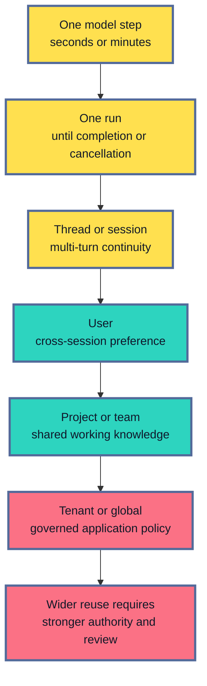
```mermaid
flowchart TD
    A["One model step<br/>seconds or minutes"] --> B["One run<br/>until completion or cancellation"]
    B --> C["Thread or session<br/>multi-turn continuity"]
    C --> D["User<br/>cross-session preference"]
    D --> E["Project or team<br/>shared working knowledge"]
    E --> F["Tenant or global<br/>governed application policy"]
    F --> G["Wider reuse requires<br/>stronger authority and review"]

    classDef short fill:#FFE04F,stroke:#536A9A,stroke-width:3px,color:#111827
    classDef durable fill:#2DD4BF,stroke:#536A9A,stroke-width:3px,color:#0F172A
    classDef governed fill:#FB7185,stroke:#536A9A,stroke-width:3px,color:#111827
    class A,B,C short
    class D,E durable
    class F,G governed
```

Lifetime also has several meanings.
A session can close after inactivity.
A memory can expire at a fixed time.
A record can remain stored for audit while its status prevents active retrieval.
A business fact can follow the retention rule of its source system.

Use explicit states such as `active`, `superseded`, `expired`, `quarantined`, and `deleted`.
Time-to-live settings provide mechanical cleanup, while review dates handle information whose meaning may change before a fixed expiry.
An annual travel preference may survive for months.
A temporary project role may need review after a few weeks.

Namespace keys should include the true security boundary.
For a multi-tenant application, `(tenant_id, user_id, memory_type)` is safer than `user_id` alone.
Authorization still runs on every read and write.
A namespace organizes data, while access control decides whether the caller may use it.

## Build Working Context Through a Read Policy
<!-- section-summary: A memory read filters by identity, permission, validity, authority, relevance, and token budget before selected records enter working context. -->

Storing a memory creates only the possibility of future use.
The **read policy** decides whether the current task may see it.

Start with identity and authorization before similarity search.
The application resolves the tenant, user, project, agent role, and current purpose.
It then removes expired, superseded, quarantined, or disallowed records.
Only the remaining candidates should enter lexical, structured, recency, or semantic ranking.

This ordering protects the security boundary.
A vector search across every tenant followed by client-side filtering risks leakage through results, logs, timing, and mistakes.
Filter at the storage or query boundary whenever the platform supports it.

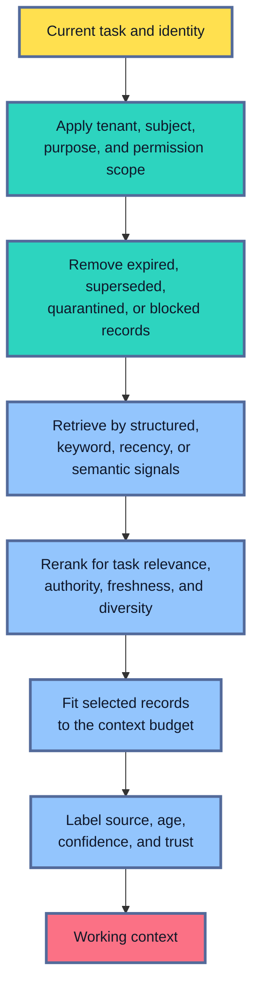
```mermaid
flowchart TD
    A["Current task and identity"] --> B["Apply tenant, subject,<br/>purpose, and permission scope"]
    B --> C["Remove expired, superseded,<br/>quarantined, or blocked records"]
    C --> D["Retrieve by structured,<br/>keyword, recency, or semantic signals"]
    D --> E["Rerank for task relevance,<br/>authority, freshness, and diversity"]
    E --> F["Fit selected records<br/>to the context budget"]
    F --> G["Label source, age,<br/>confidence, and trust"]
    G --> H["Working context"]

    classDef request fill:#FFE04F,stroke:#536A9A,stroke-width:3px,color:#111827
    classDef filter fill:#2DD4BF,stroke:#536A9A,stroke-width:3px,color:#0F172A
    classDef select fill:#93C5FD,stroke:#536A9A,stroke-width:3px,color:#0F172A
    classDef context fill:#FB7185,stroke:#536A9A,stroke-width:3px,color:#111827
    class A request
    class B,C filter
    class D,E,F,G select
    class H context
```

Relevance alone is insufficient.
A highly similar preference from three years ago may lose to a recent confirmed correction.
A project policy from an owner may outrank an informal personal note.
Several near-duplicate memories can crowd out a different fact that the task also needs.

The context builder should preserve provenance and trust.
For example, one projected record might read: **Remembered preference, confirmed by the user, reviewed six weeks ago: use metric units.**

The label tells the model and reviewer where the value came from and how much trust it carries.
An unlabeled sentence beside system instructions would hide both facts.
User-authored or externally extracted memory remains untrusted content and can contain prompt injection.
Treat it as data, keep it separate from privileged instructions, and constrain any action through application policy.

Read policies should also support an empty result.
If no valid memory applies, the system can ask a focused question or continue without personalization.
Forcing a vaguely similar record into context creates confident continuity from weak evidence.

## Govern Memory Writes as Data Changes
<!-- section-summary: A memory write moves through extraction, validation, authorization, conflict handling, approval, and versioned persistence. -->

A durable memory write is a product data change.
After it is accepted, the value may influence later sessions, other agents, or a wider project scope.
The write path therefore needs the same kind of schema, authorization, versioning, and audit controls used for other governed application data.

A model can notice a possible memory.
Application policy decides whether that proposal may change durable state.

Consider the sentence, “Use the short report format for this project from now on.”
The model can extract a candidate with type `project_output_preference`.
The application still needs to identify the project, confirm the speaker's authority, define what “short” refers to, check for an existing preference, and record the change.

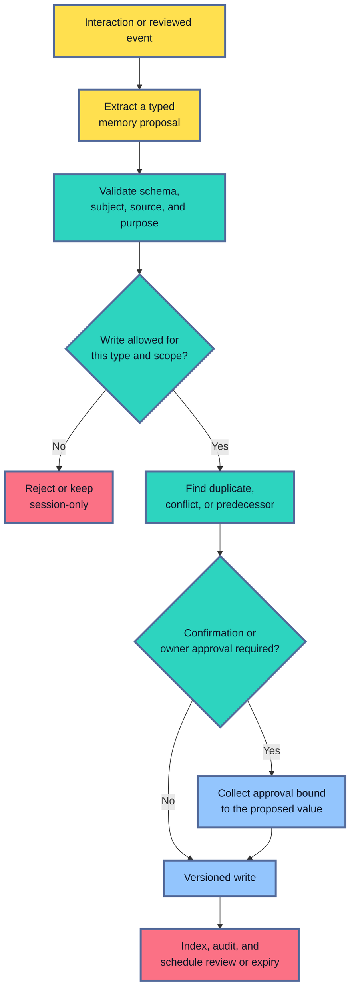
```mermaid
flowchart TD
    A["Interaction or reviewed event"] --> B["Extract a typed<br/>memory proposal"]
    B --> C["Validate schema,<br/>subject, source, and purpose"]
    C --> D{"Write allowed for<br/>this type and scope?"}
    D -->|"No"| E["Reject or keep<br/>session-only"]
    D -->|"Yes"| F["Find duplicate,<br/>conflict, or predecessor"]
    F --> G{"Confirmation or<br/>owner approval required?"}
    G -->|"Yes"| H["Collect approval bound<br/>to the proposed value"]
    G -->|"No"| I["Versioned write"]
    H --> I
    I --> J["Index, audit, and<br/>schedule review or expiry"]

    classDef candidate fill:#FFE04F,stroke:#536A9A,stroke-width:3px,color:#111827
    classDef policy fill:#2DD4BF,stroke:#536A9A,stroke-width:3px,color:#0F172A
    classDef decision fill:#93C5FD,stroke:#536A9A,stroke-width:3px,color:#0F172A
    classDef outcome fill:#FB7185,stroke:#536A9A,stroke-width:3px,color:#111827
    class A,B candidate
    class C,D,F,G policy
    class H,I decision
    class E,J outcome
```

Write policy usually varies by type.
An explicit personal display preference may be saved immediately with a user control.
An inferred preference may require confirmation.
A shared project rule may require an owner.
A security exception belongs in the organization's policy system.

There are two common write timings.

**Hot-path writes** happen during the interaction.
They support immediate corrections such as “I no longer want SMS notifications.”
Keep them small and deterministic because they add latency and can change future turns immediately.

**Background writes** extract and consolidate candidates after the response.
They keep the interactive path fast and give validation or review more time.
They also introduce delay, so the current session should not assume that a durable record already exists.

Idempotency protects retries.
Derive or store a proposal ID from the source interaction and memory type.
Repeating the background job should update the same proposal and suppress duplicates.
Use optimistic concurrency or a transaction while superseding an existing record so two corrections cannot both become active.

## Consolidate Memory Without Losing Evidence
<!-- section-summary: Consolidation turns repeated events into smaller, reusable records while retaining lineage to the source claims and corrections. -->

Long-running systems collect repeated, overlapping information.
Loading every event wastes context and makes contradictions harder to see.
**Consolidation** produces a smaller representation that remains useful across later tasks.

Suppose a user confirms metric units in several sessions.
One active record can represent the current preference.
It can keep one current semantic memory, update its last-confirmed time, and retain links to the supporting interactions according to policy.

An episodic memory can also be distilled.
A resolved deployment incident may produce a short reviewed record containing the symptom, verified cause, successful recovery, affected versions, and link to the incident report.
The raw logs stay in the observability platform.
The official corrective action stays in the incident or change system.

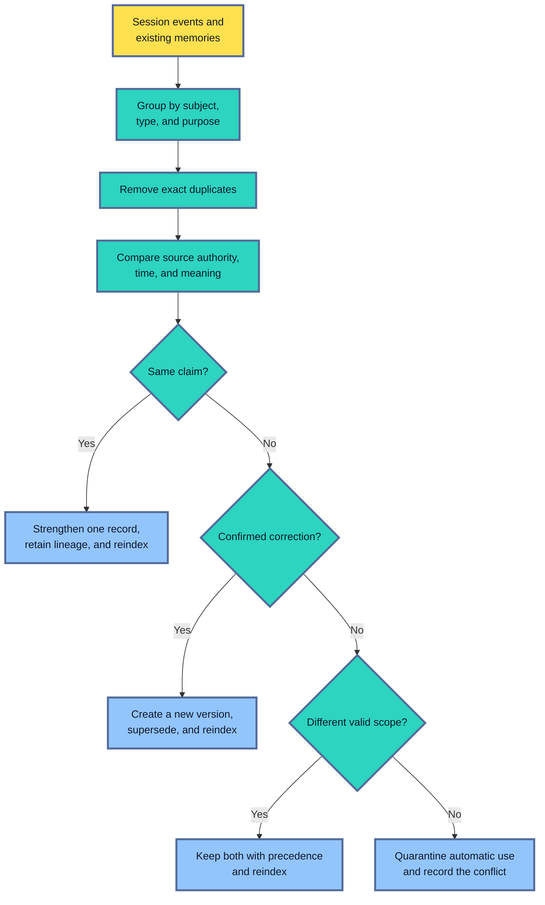
```mermaid
flowchart TD
    A["Session events and<br/>existing memories"] --> B["Group by subject,<br/>type, and purpose"]
    B --> C["Remove exact duplicates"]
    C --> D["Compare source authority,<br/>time, and meaning"]
    D --> E{"Same claim?"}
    E -->|"Yes"| F["Strengthen one record,<br/>retain lineage, and reindex"]
    E -->|"No"| K{"Confirmed correction?"}
    K -->|"Yes"| G["Create a new version,<br/>supersede, and reindex"]
    K -->|"No"| L{"Different valid scope?"}
    L -->|"Yes"| M["Keep both with precedence<br/>and reindex"]
    L -->|"No"| H["Quarantine automatic use<br/>and record the conflict"]

    classDef input fill:#FFE04F,stroke:#536A9A,stroke-width:3px,color:#111827
    classDef process fill:#2DD4BF,stroke:#536A9A,stroke-width:3px,color:#0F172A
    classDef decision fill:#93C5FD,stroke:#536A9A,stroke-width:3px,color:#0F172A
    class A input
    class B,C,D,E,K,L process
    class F,G,H,M decision
```

Model-generated summaries need the same caution as other generated text.
A summary can omit a condition, merge two people, or turn a tentative statement into a fact.
Consolidation should use a typed output, preserve source identifiers, and pass important memory types through deterministic or human validation.

Procedural consolidation deserves the highest bar.
If several successful runs suggest a new operating method, convert that suggestion into a prompt, code, runbook, or policy change through its normal review pipeline.
Silent self-modification makes behaviour hard to reproduce and easy to poison.

## Resolve Conflict and Staleness Explicitly
<!-- section-summary: Memory systems preserve corrections and disagreements through versions, authority rules, validity periods, and resolvable conflict states. -->

Memory changes because people change their minds, projects evolve, and earlier extraction can be wrong.
Overwriting the old value removes the evidence needed to explain the change.
Keeping every value active leaves the model to guess.

Use versioned records.
A correction creates a new record or revision and marks the older one `superseded`.
The active record points to its predecessor.
The audit trail records who confirmed the change and which policy accepted it.

Some disagreements are corrections.
“Use email instead of SMS” can supersede a previous channel preference after identity and consent checks.

Other disagreements come from different scopes.
A user may prefer concise answers, while a regulated report template requires full detail.
Both records can stay valid.
The more specific task policy controls the report, and the user preference applies elsewhere.

Some claims require resolution.
Two project owners may give incompatible deployment windows.
The system should mark the conflict, exclude an unsafe automatic choice, and ask the owning process for a decision.

Staleness can be time-based or event-based.
A role memory may expire after a date.
A project convention may remain active until a repository configuration changes.
A product preference may require periodic confirmation after long inactivity.
Capture the event or schedule that triggers review.

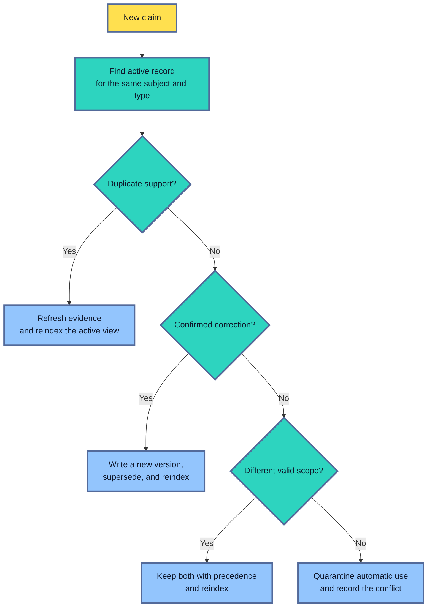
```mermaid
flowchart TD
    A["New claim"] --> B["Find active record<br/>for the same subject and type"]
    B --> C{"Duplicate support?"}
    C -->|"Yes"| G["Refresh evidence<br/>and reindex the active view"]
    C -->|"No"| D{"Confirmed correction?"}
    D -->|"Yes"| E["Write a new version,<br/>supersede, and reindex"]
    D -->|"No"| F{"Different valid scope?"}
    F -->|"Yes"| H["Keep both with precedence<br/>and reindex"]
    F -->|"No"| I["Quarantine automatic use<br/>and record the conflict"]

    classDef claim fill:#FFE04F,stroke:#536A9A,stroke-width:3px,color:#111827
    classDef compare fill:#2DD4BF,stroke:#536A9A,stroke-width:3px,color:#0F172A
    classDef resolution fill:#93C5FD,stroke:#536A9A,stroke-width:3px,color:#0F172A
    class A claim
    class B,C,D,F compare
    class E,G,H,I resolution
```

Last-write-wins is useful only where every writer has equal authority and later time truly decides the value.
Preferences can sometimes fit that rule.
Safety constraints, approvals, and business facts usually need stronger precedence.

## Keep Domain Systems Authoritative
<!-- section-summary: Agent state records references and reconciliation status, while domain services remain responsible for committed business facts and external effects. -->

A **system of record** is the service authorized to own and change a business fact.
Agent memory can carry a useful identifier or historical note, while the owning service supplies the current value used for a decision.

An agent obtains that current information through an authorized tool call.

Imagine a user asks, “Has my replacement shipped?”
A memory may recall the replacement case and its order identifier.
The order service provides the current shipment state.
If the memory says “awaiting dispatch” and the order service says “shipped,” the order service wins.

The same rule applies to writes.
After a payment, reservation, ticket update, or access change, session state should store the operation ID and authoritative record reference.

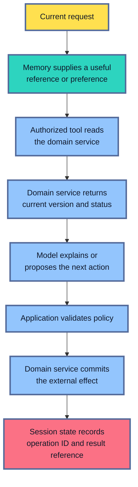
```mermaid
flowchart TD
    A["Current request"] --> B["Memory supplies a useful<br/>reference or preference"]
    B --> C["Authorized tool reads<br/>the domain service"]
    C --> D["Domain service returns<br/>current version and status"]
    D --> E["Model explains or<br/>proposes the next action"]
    E --> F["Application validates policy"]
    F --> G["Domain service commits<br/>the external effect"]
    G --> H["Session state records<br/>operation ID and result reference"]

    classDef request fill:#FFE04F,stroke:#536A9A,stroke-width:3px,color:#111827
    classDef memory fill:#2DD4BF,stroke:#536A9A,stroke-width:3px,color:#0F172A
    classDef domain fill:#93C5FD,stroke:#536A9A,stroke-width:3px,color:#0F172A
    classDef state fill:#FB7185,stroke:#536A9A,stroke-width:3px,color:#111827
    class A request
    class B memory
    class C,D,E,F,G domain
    class H state
```

Cached domain data needs a freshness contract.
Record the source version or read time, define the allowed age, and re-read before a high-impact action.
A remembered result can help explain history, while the action guard uses current authoritative data.

This boundary also simplifies deletion and correction.
The customer profile owns the address.
The inventory system owns the reservation.
The identity service owns the role.
Agent memory stores only the continuity its product purpose requires.

## Design Privacy, Access, and Deletion Together
<!-- section-summary: Privacy-safe memory limits collection, isolates subjects and tenants, gives users appropriate control, and removes derived copies through a traceable deletion workflow. -->

Durable memory can contain personal preferences, work history, confidential project details, or sensitive inferences.
Privacy architecture starts before the first write.

Define allowed memory types and prohibited data.
Collect the smallest value needed for the declared purpose.
Separate explicit user statements from model inferences.
Record consent or another valid basis where required by the product and jurisdiction.
Encrypt data in transit and at rest, and restrict service identities to the smallest usable scope.

User controls should match the product.
A user may need to view remembered preferences, correct an extraction, disable a memory category, or delete records.
A project owner may manage shared project memory.
An administrator may set retention limits without gaining access to unrelated raw content.

Deletion is a distributed operation.
Removing a row from the primary store leaves derived vector entries, keyword indexes, caches, summaries, analytics extracts, and pending consolidation jobs.
Use stable subject and lineage identifiers so the deletion worker can find every derived copy.

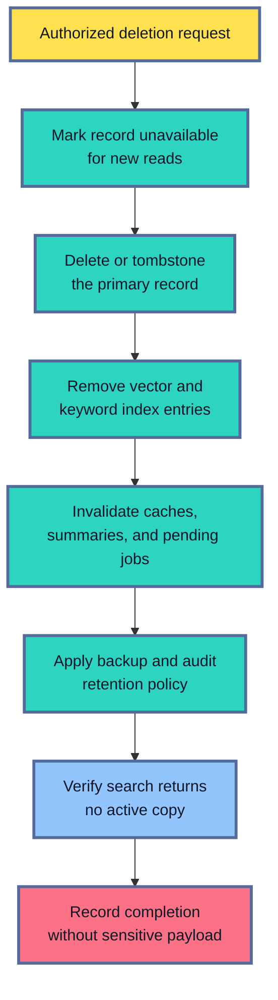
```mermaid
flowchart TD
    A["Authorized deletion request"] --> B["Mark record unavailable<br/>for new reads"]
    B --> C["Delete or tombstone<br/>the primary record"]
    C --> D["Remove vector and<br/>keyword index entries"]
    D --> E["Invalidate caches,<br/>summaries, and pending jobs"]
    E --> F["Apply backup and audit<br/>retention policy"]
    F --> G["Verify search returns<br/>no active copy"]
    G --> H["Record completion<br/>without sensitive payload"]

    classDef request fill:#FFE04F,stroke:#536A9A,stroke-width:3px,color:#111827
    classDef delete fill:#2DD4BF,stroke:#536A9A,stroke-width:3px,color:#0F172A
    classDef verify fill:#93C5FD,stroke:#536A9A,stroke-width:3px,color:#0F172A
    classDef evidence fill:#FB7185,stroke:#536A9A,stroke-width:3px,color:#111827
    class A request
    class B,C,D,E,F delete
    class G verify
    class H evidence
```

Backups and immutable audit records may follow a separate retention rule.
The product should explain that rule accurately and prevent retained audit metadata from re-entering ordinary memory retrieval.

Memory integrity is also a security concern.
Untrusted messages, retrieved documents, tool output, and peer agents can propose content designed to influence future sessions.
OWASP identifies memory poisoning as an agent risk.
Typed schemas, source labels, least-privilege writes, approval for wider scopes, integrity checks, and regression tests reduce that risk.

## Recover Session State Without Repeating Effects
<!-- section-summary: Checkpoints and idempotent domain operations let an interrupted agent resume from known progress without repeating committed actions. -->

Session persistence solves a different problem from long-term personalization.
It must let the workflow resume safely after a crash, timeout, deployment, human pause, or worker move.

A **checkpoint** is a persisted view of workflow state at a meaningful boundary.
It may contain the active node, state version, completed tool operations, pending approval, budget, and next allowed transition.

Consider a reservation tool that commits successfully while the agent process times out before saving its new state.
On restart, the system sees an uncertain operation.
Repeating the reservation could create a duplicate.
The recovery path queries the domain service with the same idempotency key, records the committed result, and continues.

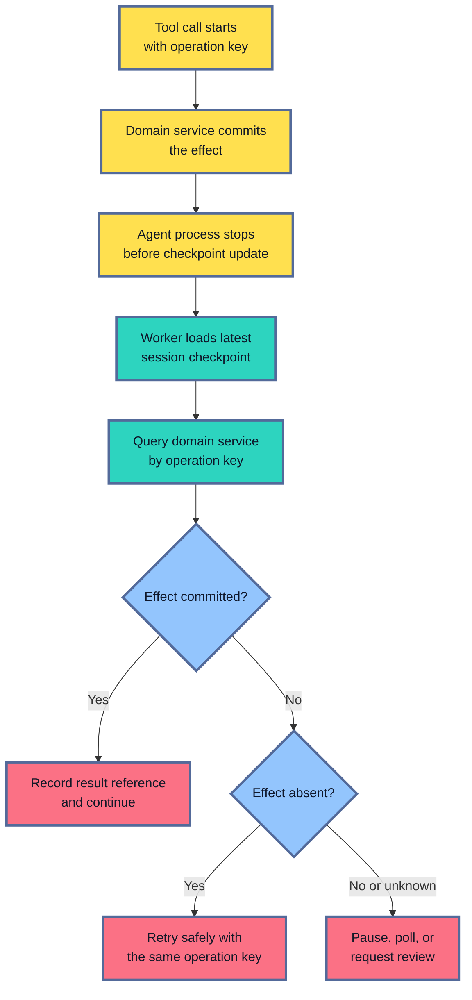
```mermaid
flowchart TD
    A["Tool call starts<br/>with operation key"] --> B["Domain service commits<br/>the effect"]
    B --> C["Agent process stops<br/>before checkpoint update"]
    C --> D["Worker loads latest<br/>session checkpoint"]
    D --> E["Query domain service<br/>by operation key"]
    E --> F{"Effect committed?"}
    F -->|"Yes"| G["Record result reference<br/>and continue"]
    F -->|"No"| J{"Effect absent?"}
    J -->|"Yes"| H["Retry safely with<br/>the same operation key"]
    J -->|"No or unknown"| I["Pause, poll, or<br/>request review"]

    classDef effect fill:#FFE04F,stroke:#536A9A,stroke-width:3px,color:#111827
    classDef recover fill:#2DD4BF,stroke:#536A9A,stroke-width:3px,color:#0F172A
    classDef decision fill:#93C5FD,stroke:#536A9A,stroke-width:3px,color:#0F172A
    classDef outcome fill:#FB7185,stroke:#536A9A,stroke-width:3px,color:#111827
    class A,B,C effect
    class D,E recover
    class F,J decision
    class G,H,I outcome
```

Optimistic concurrency prevents two workers from quietly overwriting each other.
A focused relational update can enforce it:

```sql
UPDATE agent_runs
SET state = :next_state,
    state_version = state_version + 1
WHERE run_id = :run_id
  AND state_version = :expected_version;
```

One updated row means the transition used the current version.
Zero rows means another writer advanced the run first; reload the state and reconcile.

Store the workflow or graph version with long-lived checkpoints.
A newer deployment may change state fields or transitions.
Pinning, migration, or explicit incompatibility handling is safer than interpreting an old checkpoint under an unrelated graph.

## Evaluate Memory as a Product Feature
<!-- section-summary: Memory evaluation measures whether the right information is stored, retrieved, used, corrected, isolated, and deleted for the intended task. -->

A memory feature succeeds only if it improves user or task outcomes under its safety constraints.
Retrieval similarity by itself cannot answer that question.

Build an evaluation set around complete memory journeys.
Each case starts with earlier interactions and the write the system should produce.
It then defines a later task, the valid memories, and realistic distractors.
The case also states the governing policy and expected behaviour.

Useful scenario families include:

- a later task genuinely requires a confirmed preference;
- the task has no relevant memory and should proceed cleanly;
- a newer correction supersedes an older value;
- two scopes contain different valid rules;
- a tempting record belongs to another tenant;
- a retrieved memory contains an instruction-like payload;
- an expired memory ranks highly by similarity;
- a deletion request removes the record and derived index entry;
- a process resumes after an external effect committed;
- memory is unavailable and the product must degrade gracefully.

Evaluate the stages separately.

**Write quality** measures whether the system proposes the right type, value, subject, scope, and expiry.
**Retrieval quality** measures whether valid useful records are found and invalid records are excluded.
**Context quality** measures whether the selected memory fits with current instructions, knowledge, and domain facts.
**Use quality** measures whether the model applies the memory correctly.
**Lifecycle quality** measures correction, supersession, deletion, and recovery.

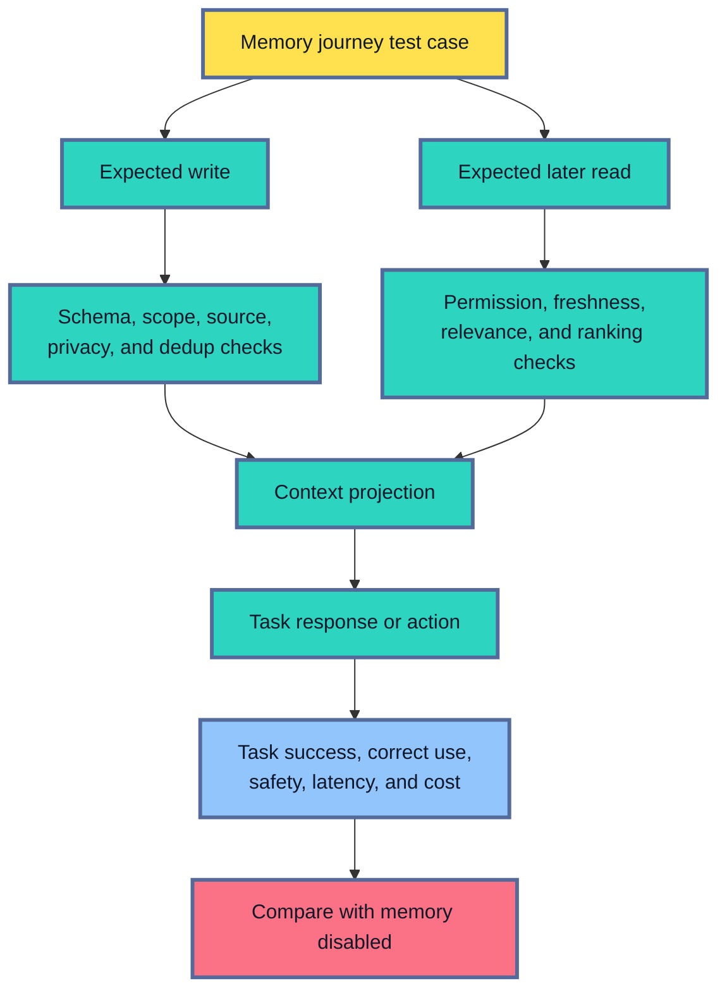
```mermaid
flowchart TD
    A["Memory journey test case"] --> B["Expected write"]
    A --> C["Expected later read"]
    B --> D["Schema, scope, source,<br/>privacy, and dedup checks"]
    C --> E["Permission, freshness,<br/>relevance, and ranking checks"]
    D --> F["Context projection"]
    E --> F
    F --> G["Task response or action"]
    G --> H["Task success, correct use,<br/>safety, latency, and cost"]
    H --> I["Compare with memory disabled"]

    classDef case fill:#FFE04F,stroke:#536A9A,stroke-width:3px,color:#111827
    classDef stage fill:#2DD4BF,stroke:#536A9A,stroke-width:3px,color:#0F172A
    classDef result fill:#93C5FD,stroke:#536A9A,stroke-width:3px,color:#0F172A
    classDef compare fill:#FB7185,stroke:#536A9A,stroke-width:3px,color:#111827
    class A case
    class B,C,D,E,F,G stage
    class H result
    class I compare
```

An ablation compares the same task with memory enabled and disabled.
It reveals whether the feature actually reduces repeated questions, improves completion, or saves time.
It also exposes cases where irrelevant memory distracts the model.

Production metrics can include useful-memory rate, user correction rate, stale-memory use, conflict rate, cross-scope access denials, write rejection reasons, retrieval latency, added tokens, task completion, and deletion completion time.
Inspect important slices such as tenant type, memory category, language, workflow, and age band.

Human review remains valuable for meaning.
A record can match the expected text while capturing the wrong scope.
A response can mention the right preference while applying it to an inappropriate task.

## Observe Memory Decisions Safely
<!-- section-summary: Memory observability traces identifiers, versions, policy decisions, latency, and outcomes while keeping sensitive content out of broad telemetry. -->

Memory observability explains which retained information influenced a run and which policy allowed that use.
It follows the path from session loading and candidate retrieval through context selection, model execution, and any later write.

Memory failures often appear as strange model behaviour.
Tracing the lifecycle turns that mystery into a diagnosable data path.

For each run, correlate the session or thread ID, checkpoint version, memory-policy version, context-projection ID, model call, and tool operations.
For each memory read, record the namespace, candidate count, selected record IDs and versions, exclusion reasons, retrieval latency, and tokens added.
For each write, record the proposal ID, type, scope, validator result, approval, conflict outcome, active record version, and indexing status.

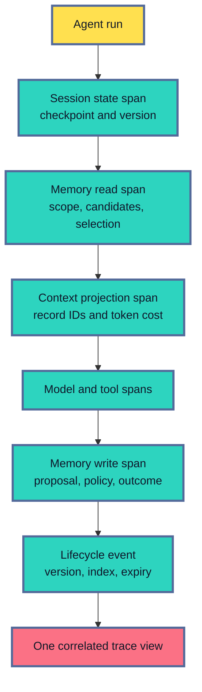
```mermaid
flowchart TD
    A["Agent run"] --> B["Session state span<br/>checkpoint and version"]
    B --> C["Memory read span<br/>scope, candidates, selection"]
    C --> D["Context projection span<br/>record IDs and token cost"]
    D --> E["Model and tool spans"]
    E --> F["Memory write span<br/>proposal, policy, outcome"]
    F --> G["Lifecycle event<br/>version, index, expiry"]
    G --> H["One correlated trace view"]

    classDef run fill:#FFE04F,stroke:#536A9A,stroke-width:3px,color:#111827
    classDef span fill:#2DD4BF,stroke:#536A9A,stroke-width:3px,color:#0F172A
    classDef view fill:#FB7185,stroke:#536A9A,stroke-width:3px,color:#111827
    class A run
    class B,C,D,E,F,G span
    class H view
```

Broad traces should contain identifiers and low-cardinality outcome labels.
Raw memory text remains in its governed store.
Authorized investigators can follow a controlled link to the governed record.
Prompt and response capture needs an explicit policy because it can duplicate sensitive content into another retention system.

OpenTelemetry provides common GenAI and conversation attributes, while memory-policy details are still often application-specific.
Document custom attribute names and bounded values.
Avoid putting user IDs, free-form text, memory IDs, or vector queries into metric labels.

Alerts should focus on system behaviour.
Examples include rising write rejection, indexing backlog, stale-read rate, conflict backlog, cross-tenant access denials, checkpoint contention, and deletion jobs exceeding their service objective.

## Choose Industrial Implementations by Responsibility
<!-- section-summary: Current frameworks and managed services implement different parts of session persistence and durable memory, while application policy still owns authority, privacy, and lifecycle decisions. -->

Industrial designs use a framework or managed service to remove storage plumbing, then keep the five information layers explicit.
Product choice follows deployment platform, data residency, latency, operational skill, and required lifecycle controls.

### OpenAI Agents SDK sessions manage conversation continuity

OpenAI Agents SDK **sessions** maintain conversation items across agent runs.
Current implementations include SQLite for local or lightweight persistence, Redis for shared low-latency sessions, SQLAlchemy for existing relational databases, Dapr state stores, MongoDB, and OpenAI-hosted Conversations.

This feature is well suited to message continuity.
The application still needs separate contracts for workflow state, domain records, and governed long-term preferences.
The SDK documentation also warns against combining an SDK session with provider-side `conversation_id`, `previous_response_id`, or automatic previous-response continuation in the same run.
Choose one continuation mechanism so the history is not duplicated.

### LangGraph separates thread checkpoints from cross-thread stores

LangGraph **checkpointers** save graph state in a thread and support interruption, replay, human review, and recovery.
Its **Store** interface holds JSON records under custom namespaces for information shared across threads.
That maps naturally to session state versus durable memory.

In-memory implementations suit tests and prototypes.
Persistent Postgres, MongoDB, or Redis implementations suit production according to the documented integration and operating model.
The developer still defines state schemas, namespace security, write policy, expiry, and domain authority.

### Managed cloud memory services provide extraction and retrieval pipelines

Amazon Bedrock AgentCore Memory stores short-term interaction events and can generate long-term records asynchronously through configured memory strategies.
Its strategies cover extraction and consolidation, while actor, session, and namespace fields organize access.
Teams should still review which event types are sent, which strategy can create each memory type, and how deletion or conflict rules map to the product.

Google's Gemini Enterprise Agent Platform Memory Bank provides long-term memory generation, consolidation, exact-scope retrieval, time-to-live controls, revisions, and IAM conditions.
It also integrates with Google's Agent Development Kit.
Scope design is part of the security boundary because retrieval considers memories with the exact requested scope.

Microsoft Foundry Agent Service offers managed long-term memory stores with scope, extraction, search, and time-to-live controls.
The current memory capability is also documented as Preview.
Treat its schema and availability as evolving until the provider marks the required capability stable.

### A custom stack remains a practical baseline

A common custom baseline uses PostgreSQL for session rows, memory metadata, versions, policy fields, and audit references.
`pgvector` can add semantic search where the scale and latency fit.
Redis can cache active session data or recent reads.
An object store can hold large governed artifacts.
OpenSearch or another search platform can serve larger hybrid indexes.

The primary database keeps the active record and lifecycle state.
The vector or search index is a derived retrieval path.
Corrections update the governed record, and deletion can enumerate every index derived from that record.
An embedding collection used as the only copy would hide those lifecycle relationships.

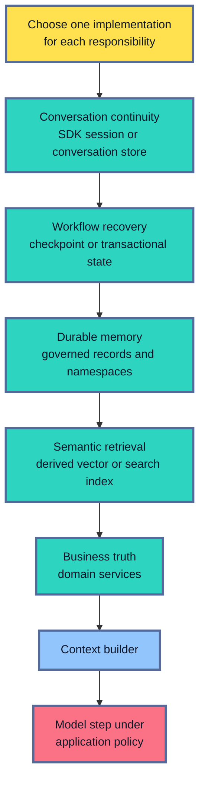
```mermaid
flowchart TD
    A["Choose one implementation<br/>for each responsibility"] --> B["Conversation continuity<br/>SDK session or conversation store"]
    B --> C["Workflow recovery<br/>checkpoint or transactional state"]
    C --> D["Durable memory<br/>governed records and namespaces"]
    D --> E["Semantic retrieval<br/>derived vector or search index"]
    E --> F["Business truth<br/>domain services"]
    F --> G["Context builder"]
    G --> H["Model step under<br/>application policy"]

    classDef responsibility fill:#FFE04F,stroke:#536A9A,stroke-width:3px,color:#111827
    classDef implementation fill:#2DD4BF,stroke:#536A9A,stroke-width:3px,color:#0F172A
    classDef context fill:#93C5FD,stroke:#536A9A,stroke-width:3px,color:#0F172A
    classDef model fill:#FB7185,stroke:#536A9A,stroke-width:3px,color:#111827
    class A responsibility
    class B,C,D,E,F implementation
    class G context
    class H model
```

Managed memory reduces implementation work.
The organization still defines allowed memory types, source precedence, privacy purpose, correction process, and release evidence.
Validate those controls with the same journey tests regardless of provider.

## Put the Pieces Into One Production Design
<!-- section-summary: A production memory architecture joins an authorized context builder, transactional session state, governed memory records, derived indexes, domain tools, evaluation, and lifecycle workers. -->

A practical production design starts each step with the authenticated task.
The orchestrator loads the latest session state, retrieves permitted memories, fetches relevant knowledge, and reads current domain facts only where the task needs them.
The context builder labels each source and fits the result to the model budget.

After the model proposes a response or tool call, application code validates the action.
External effects go through domain services with idempotency.
Session state records progress through a transactional checkpoint.
Durable memory proposals enter a separate policy pipeline.

Background workers consolidate records, update derived indexes, expire old data, propagate deletion, and run evaluation samples.
Traces connect the stages through stable IDs while keeping sensitive content in governed stores.

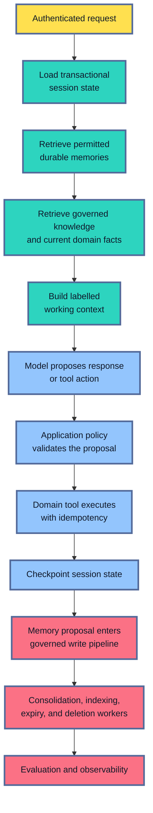
```mermaid
flowchart TD
    A["Authenticated request"] --> B["Load transactional<br/>session state"]
    B --> C["Retrieve permitted<br/>durable memories"]
    C --> D["Retrieve governed knowledge<br/>and current domain facts"]
    D --> E["Build labelled<br/>working context"]
    E --> F["Model proposes response<br/>or tool action"]
    F --> G["Application policy<br/>validates the proposal"]
    G --> H["Domain tool executes<br/>with idempotency"]
    H --> I["Checkpoint session state"]
    I --> J["Memory proposal enters<br/>governed write pipeline"]
    J --> K["Consolidation, indexing,<br/>expiry, and deletion workers"]
    K --> L["Evaluation and observability"]

    classDef request fill:#FFE04F,stroke:#536A9A,stroke-width:3px,color:#111827
    classDef context fill:#2DD4BF,stroke:#536A9A,stroke-width:3px,color:#0F172A
    classDef action fill:#93C5FD,stroke:#536A9A,stroke-width:3px,color:#0F172A
    classDef lifecycle fill:#FB7185,stroke:#536A9A,stroke-width:3px,color:#111827
    class A request
    class B,C,D,E context
    class F,G,H,I action
    class J,K,L lifecycle
```

This design also provides graceful failure.
If durable memory is unavailable, the task can continue without personalization.
If the domain service is unavailable, the agent should avoid inventing current status.
If session state cannot be updated after an effect, recovery uses the operation key.
If the memory index lags, the primary record remains available for repair and reindexing.

Release evidence should prove more than a happy conversation.
Test the read and write policies, cross-tenant isolation, correction, conflict, expiry, deletion, checkpoint recovery, provider outage, and the product response with memory disabled.

## The Main Idea
<!-- section-summary: Reliable memory comes from separating information layers and governing every transition from interaction to state, durable record, working context, and deletion. -->

Agent memory is a continuity feature built on data lifecycle controls.
Working context gives one model step a temporary view.
Session state preserves current progress.
Durable memory carries selected information across sessions.
Retrieved knowledge brings governed source material into the task.
System-of-record services own committed business facts.

The architecture decides what deserves persistence, who may reuse it, how long it remains active, and which evidence supports it.
Read policy selects a small, authorized set for the current task.
Write policy validates and versions changes.
Consolidation reduces repetition while retaining lineage.
Conflict, staleness, privacy, and deletion stay visible throughout the lifecycle.

Frameworks and managed services can provide sessions, checkpoints, stores, extraction, and semantic retrieval.
The application still owns authority, product purpose, and safe behaviour.
A useful memory system helps people repeat themselves less while giving them clear ways to inspect, correct, and remove what the system retained.

## References

- [OpenAI Agents SDK: Sessions](https://openai.github.io/openai-agents-python/sessions/)
- [OpenAI Agents SDK: Agent memory](https://openai.github.io/openai-agents-python/sandbox/memory/)
- [LangChain: Memory overview](https://docs.langchain.com/oss/python/concepts/memory)
- [LangGraph: Persistence](https://docs.langchain.com/oss/python/langgraph/persistence)
- [Amazon Bedrock AgentCore: Memory types](https://docs.aws.amazon.com/bedrock-agentcore/latest/devguide/memory-types.html)
- [Amazon Bedrock AgentCore: Memory strategies](https://docs.aws.amazon.com/bedrock-agentcore/latest/devguide/memory-strategies.html)
- [Google Cloud: Agent Platform Memory Bank](https://docs.cloud.google.com/gemini-enterprise-agent-platform/scale/memory-bank)
- [Microsoft Foundry Agent Service: Create and use memory](https://learn.microsoft.com/en-us/azure/foundry/agents/how-to/memory-usage)
- [OWASP: AI Agent Security Cheat Sheet](https://cheatsheetseries.owasp.org/cheatsheets/AI_Agent_Security_Cheat_Sheet.html)
- [NIST Privacy Framework](https://www.nist.gov/privacy-framework/privacy-framework)
- [OpenTelemetry: Generative AI semantic conventions](https://github.com/open-telemetry/semantic-conventions-genai)
