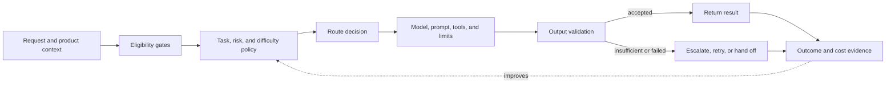
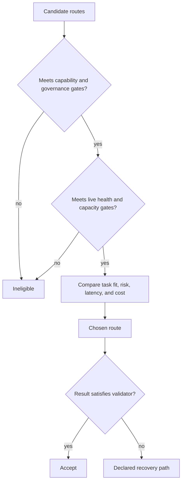
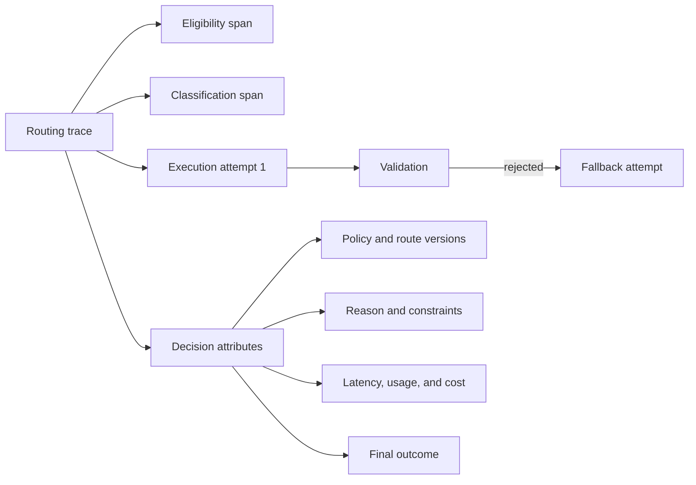

## Routing Is More Than Choosing a Model

<!-- section-summary: A production router chooses an entire execution path, not merely a model name. -->

A small LLM application can send every request to one model. That is often the right starting point: there is one prompt path to evaluate, one latency profile to understand, and one failure mode to operate. Routing earns its extra complexity when the traffic contains materially different requirements. Some requests may need image input, a long context window, tool use, strict data residency, low latency, or extra review. Others are simple enough that the most capable route would waste time and money.

**Model routing** is the policy layer that matches each request to an acceptable execution path. The path includes more than a model name. It can also determine the provider or deployment, prompt version, tools, reasoning budget, timeout, cache policy, validator, and fallback. The router therefore sits between product intent and model execution.



This wider view prevents a common design error: treating routing as a clever `if` statement that selects the cheapest model. A useful router must protect hard requirements before optimizing cost, deal explicitly with uncertainty and failure, and leave evidence that connects the decision to the eventual outcome.

## Start With the Product Contract

<!-- section-summary: Routing starts from the quality, safety, latency, and data requirements of the product instead of a catalogue of available models. -->

Before adding a router, write down what an acceptable result means for each important task. A document classifier might require a valid label within 500 milliseconds. A code-change agent may require repository access, a large context, sandboxed tools, tests, and human approval before publishing. A healthcare workflow may forbid particular providers or require a person to review every recommendation.

These requirements form the **product contract**. It normally contains five kinds of constraint:

- **Capability:** required modality, context length, language, tool use, structured output, or reasoning performance.
- **Quality and risk:** acceptable error rate, high-risk categories, review rules, and abstention behaviour.
- **Performance:** latency deadline, throughput target, and whether the work is interactive or asynchronous.
- **Governance:** allowed data regions, providers, retention settings, model licences, and audit requirements.
- **Economics:** target cost per successful outcome, not merely cost per token or request.

The router should not make these constraints disappear into a single score. A cheap route that violates residency is ineligible, not "slightly worse." A route that misses the safety threshold should not win because it is fast. Hard constraints are gates; optimization happens only among the routes that remain.

Routing is not automatically worthwhile. Keep one route while it meets the important contracts and routing would save little or add more risk than value. Add routing when task diversity, cost, capacity, latency, risk, or provider reliability creates a measurable reason to split traffic.

## A Router Has Three Decisions

<!-- section-summary: Eligibility, selection, and recovery are separate decisions and should be evaluated separately. -->

A production router is easier to reason about when it is divided into three decisions.

### 1. Which routes are eligible?

Eligibility is deterministic whenever possible. Remove routes that cannot accept the modality, exceed their context window, lack a required tool, violate a data rule, are disabled for the tenant, or are currently unhealthy. This layer should also force explicitly high-risk work to an approved route or a human queue.

Deterministic gates are valuable because they are inspectable. If an image request reaches a text-only model, or restricted data crosses a provider boundary, the problem is a policy defect rather than an ambiguous model judgement.

### 2. Which eligible route is the best fit?

Selection considers task, estimated difficulty, risk, latency, capacity, and cost. The decision can be a static rule, a learned classifier, a cascade, or a combination. "Best" means most likely to satisfy the product contract—not most capable in the abstract and not cheapest per call.

### 3. What happens if that route cannot finish acceptably?

Recovery covers timeouts, rate limits, invalid output, low-quality results, unavailable tools, and uncertain classifications. The next action might be a bounded retry, another approved deployment, a stronger route, a simpler response, asynchronous processing, or a human handoff. Recovery is part of the route design, not an exception added after launch.



Separating the decisions also improves diagnosis. A poor result may come from an eligibility rule, a difficulty classifier, the selected model, the prompt, the validator, or the fallback. If a trace records only `model=...`, those causes are mixed together.

## Common Routing Patterns

<!-- section-summary: Static rules, classifiers, cascades, failover, and ensembles solve different routing problems. -->

A **static policy router** uses facts already known by the application: endpoint, tenant, modality, data class, language, or an explicit review flag. It is the clearest option for stable product boundaries and hard governance rules.

A **classifier router** predicts task type, risk, or difficulty. It helps when boundaries are fuzzy and adds another model that needs labelled examples, thresholds, versioning, monitoring, and an uncertainty policy. Its confidence output should not be treated as calibrated merely because it is a number.

A **cascade** attempts an inexpensive route and escalates when a validator rejects the result. Cascades work when success can be checked reliably—for example, schema validity, retrieval support, compilation, tests, or a task-specific evaluator. They are less convincing when escalation depends only on the first model declaring that its own answer is good.

A **health failover** changes deployment or provider when latency, quota, or availability is unhealthy. The alternate route must still meet capability, data, tool, and output-contract requirements. Two models that both accept text are not necessarily interchangeable.

An **ensemble** runs multiple routes and combines or judges their outputs. It can help with rare, valuable work where extra evidence justifies the latency and cost. Careful evaluation of a single route remains the simpler default.

Real systems often compose these patterns: hard rules establish eligibility, a classifier selects among ordinary task routes, a validator drives a cascade, and health policy chooses an approved deployment.

## Treat Uncertainty as a Route

<!-- section-summary: A router needs an explicit policy for requests it cannot classify confidently or execute safely. -->

The dangerous assumption in many routers is that every request belongs to one known class. Production traffic contains novel products, mixed intents, malformed input, prompt injection, unsupported languages, and partial outages. The router therefore needs explicit states such as `classification_unknown`, `no_eligible_route`, and `validation_failed`.

Uncertainty can lead to a conservative general route, a request for clarification, a queue for later processing, or human review. Which response is correct depends on the product contract. Missing risk information needs an explicit `unknown` state, and a failed parser needs a safe declared route instead of the cheapest model.

The same principle applies after generation. A validator can check structure, citations, tool results, tests, policy rules, or task-specific quality. It should return a reasoned outcome such as accepted, retryable, escalate, or reject. This makes the cascade a controlled state transition rather than an unbounded sequence of model calls.

## Route Stability Depends on the Unit of Work

<!-- section-summary: A router must decide whether it selects per request, conversation, workflow step, or whole run because switching routes can change state and behaviour. -->

The word “request” can hide several different units. A one-shot extraction has one model call and can select a route each time. A conversation carries references, tone, and provider-managed state across turns. An agent workflow may contain a cheap classification step, a capable planning step, and a tightly controlled action step. The router needs an explicit **routing scope** for each product.

Conversation routes are often pinned for a defined period. Pinning means storing the chosen route and its concrete bundle version with the session so later turns use compatible prompts, tools, schemas, and state APIs. A health failure can still move the session to an approved alternate, but that transition needs a migration rule. If the alternate cannot consume the same continuation state or tool-result format, the runtime may need to rebuild context from portable application state instead of forwarding provider-specific identifiers.

Workflow routing can vary by step because the requirements vary. A deterministic classifier may use a small, fast route. Drafting may use a route selected for language and complexity. A payment proposal may use a reviewed route with narrower tools and stronger validation. The workflow state records each decision, so one run can contain several routes without losing causality.

Side effects create another boundary. If route A times out after invoking a write tool, route B should not simply repeat the entire agent step. The orchestrator first reconciles the effect by its operation identity, loads the current workflow state, and then decides whether a new model decision is needed. Routing cannot repair unsafe retry semantics by itself.

For cascades, define a **stopping rule**. A stopping rule identifies which validator result permits escalation, which route comes next, the maximum attempts, and what happens when no route succeeds. This prevents a difficult request from consuming every available model and still returning the last answer by accident. It also makes cost predictable: evaluation can report how many cases succeed on the first route, how many require escalation, and how many reach review.

These choices should appear in the route contract:

| Decision | Example policy |
| --- | --- |
| Routing scope | pin `standard_assistant` for one conversation |
| Step override | use `high_risk_review` for an external side-effect proposal |
| Migration | rebuild from application transcript and typed state |
| Cascade limit | one initial attempt and one stronger attempt |
| Terminal recovery | ask for clarification or send to a human queue |

This level of detail connects model choice to state management. It prevents a provider failover or cost optimization from changing a live workflow in ways that the context, tools, or recovery logic cannot support.

## Keep Policy Separate From Provider Details

<!-- section-summary: Stable product routes should be distinct from changeable model deployments and prices. -->

Product-facing route names should express jobs such as `fast_extraction`, `standard_assistant`, or `review_required`. Provider model identifiers, prices, rate limits, and deployment regions change more frequently. Keeping them in a dated, versioned policy lets the team change an implementation without breaking dashboards or historical comparisons.

A compact route table might look like this:

```yaml
policy_version: 2026-07-16

routes:
  fast_extraction:
    requires: [text, structured_output]
    model_ref: extraction-small-eu
    timeout_ms: 800
    validator: extraction-schema-v4
    on_reject: standard_assistant

  standard_assistant:
    requires: [text, tools]
    model_ref: assistant-default-eu
    timeout_ms: 5000
    validator: grounded-answer-v7
    on_reject: review_required

  review_required:
    execution: human_queue

hard_rules:
  - when: data_class == "restricted"
    allow_deployments: [eu-approved]
  - when: risk == "high" or classification == "unknown"
    force_route: review_required
```

This is configuration, not the whole router. The runtime still needs authenticated policy loading, typed inputs, concurrency control, idempotency around side effects, provider adapters, and trace propagation. The important point is that reviewers can see the route contract, its validator, and its recovery path without reading scattered application branches.

Prices and model capabilities should be refreshed from current provider documentation or an internal catalogue during release review. Freezing them into explanatory prose makes an article and often the system itself age badly.

## Evaluate the Whole Decision System

<!-- section-summary: Router quality includes route selection, downstream outcome, latency, and total cost across attempts. -->

Evaluating each candidate model is necessary but insufficient. The router can still fail by misclassifying traffic or escalating too often. Build a routing dataset that represents task types, difficulty, risk, language, input size, tenant constraints, and novel or ambiguous cases. For each example, record the allowed routes or required outcome rather than only one preferred model.

Measure at least four layers:

1. **Eligibility correctness:** did the router obey capability and governance rules?
2. **Decision quality:** did it select an allowed route, abstain when uncertain, and protect high-risk cases?
3. **Outcome quality:** did the final result satisfy the task-specific evaluator or human review?
4. **System efficiency:** what were end-to-end latency and total cost, including classification, rejected attempts, retries, and fallbacks?

Cost per request can be misleading. A cheap first call followed by frequent escalation may cost more and respond more slowly than one reliable call. A better economic metric is cost per accepted answer, resolved case, completed task, or other product outcome.

Before a policy receives production traffic, compare it with the current route offline. Then use shadow traffic when privacy and capacity permit: the candidate makes decisions on representative live requests without serving its result. Canary rollout follows with a small audience and explicit rollback thresholds. Keep model, prompt, tool, validator, and policy versions attached to every evaluation record.

## Observe Decisions, Not Just Calls

<!-- section-summary: Routing telemetry must make the selected path and its consequences explainable. -->

A useful trace contains a parent routing decision and child spans for classification, model calls, tools, validation, retries, and fallback. Metrics summarize route volume, accepted-result rate, abstention, escalation, errors, latency, and total cost. Logs hold sparse diagnostic events that do not belong in metric labels.



Record route and policy version, eligible candidates, exclusion reasons, chosen route, decision reason, validator result, fallback reason, latency, usage, and eventual outcome. Do not place raw prompts, personal data, or unbounded customer identifiers into metric labels. Sensitive trace content needs redaction, access control, and retention rules.

Alerts should protect the product contract: a rise in `no_eligible_route`, high-risk misroutes, accepted-result failures, fallback rate, or end-to-end latency. A provider error-rate alert is useful, but it does not reveal whether users still received an acceptable result through recovery.

## What a Production-Ready Router Provides

<!-- section-summary: A mature router is a governed and observable decision system with bounded recovery. -->

A production-ready router has named product routes, explicit eligibility rules, a versioned policy, uncertainty handling, task-specific validators, bounded retries, approved fallbacks, and human paths where automation should stop. Each route has an owner and quality, latency, and cost objectives. Candidate changes pass offline evaluation, shadow comparison, and a reversible rollout.

The central design rule is simple: optimize only after protecting the product contract. Start with one evaluated route. When diverse requirements justify routing, separate eligibility, selection, execution, validation, and recovery. That structure lets a beginner see what the router is responsible for and gives an experienced team the boundaries it needs to test and operate the system.

## References

- [OpenAI model selection](https://developers.openai.com/api/docs/guides/model-selection)
- [OpenAI cost optimization](https://developers.openai.com/api/docs/guides/cost-optimization)
- [OpenAI latency optimization](https://developers.openai.com/api/docs/guides/latency-optimization)
- [OpenAI Structured Outputs](https://developers.openai.com/api/docs/guides/structured-outputs)
- [OpenAI evaluation best practices](https://developers.openai.com/api/docs/guides/evaluation-best-practices)
- [OpenTelemetry documentation](https://opentelemetry.io/docs/)
- [Prometheus alerting practices](https://prometheus.io/docs/practices/alerting/)
