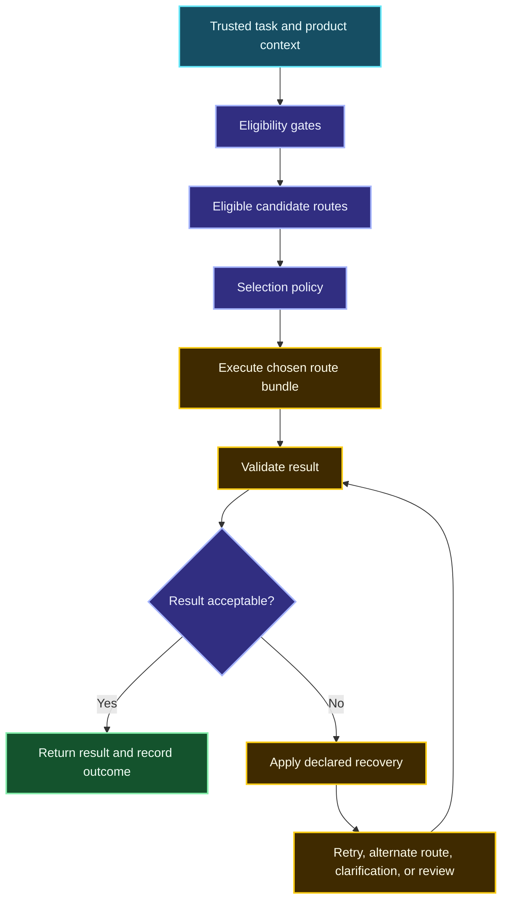
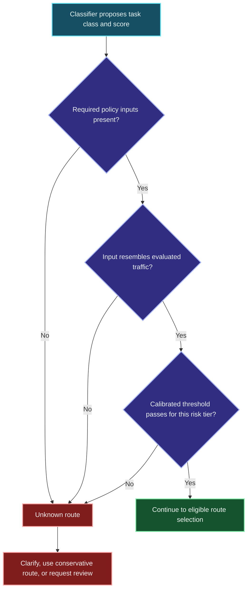
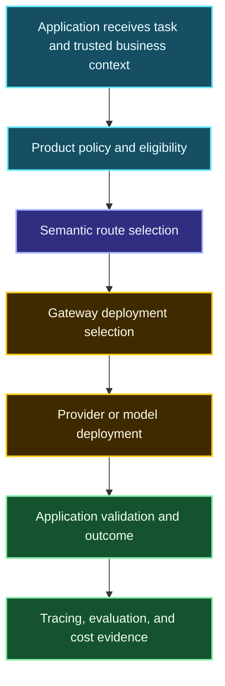
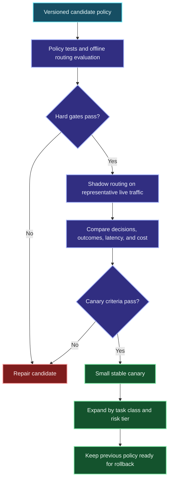

## Table of Contents

1. [What Model Routing Means](#what-model-routing-means)
2. [Why One Route Eventually Stops Fitting Every Task](#why-one-route-eventually-stops-fitting-every-task)
3. [Follow The Complete Routing Framework](#follow-the-complete-routing-framework)
4. [Define Candidate Routes As Complete Bundles](#define-candidate-routes-as-complete-bundles)
5. [Apply Deterministic Eligibility Gates First](#apply-deterministic-eligibility-gates-first)
6. [Choose Among Eligible Routes](#choose-among-eligible-routes)
7. [Treat Confidence And Uncertainty As Policy Inputs](#treat-confidence-and-uncertainty-as-policy-inputs)
8. [Keep Routes Stable Across Stateful Work](#keep-routes-stable-across-stateful-work)
9. [Design Fallbacks As Separate Decisions](#design-fallbacks-as-separate-decisions)
10. [Put Budgets Inside The Routing Policy](#put-budgets-inside-the-routing-policy)
11. [Give Applications, Policy Engines, Routers, And Gateways Different Jobs](#give-applications-policy-engines-routers-and-gateways-different-jobs)
12. [Evaluate The Complete Decision System](#evaluate-the-complete-decision-system)
13. [Release Routing Policies Safely](#release-routing-policies-safely)
14. [Observe Every Routing Decision](#observe-every-routing-decision)
15. [Diagnose And Repair Routing Failures](#diagnose-and-repair-routing-failures)
16. [Build Routing In A Practical Order](#build-routing-in-a-practical-order)
17. [References](#references)

At a high level, **model routing** is the process of choosing an approved execution path for each LLM task.

Imagine an assistant that receives two requests. One asks it to classify a short message into a known category. The other asks it to compare a long contract, use several tools, and prepare a recommendation for human approval. A single powerful model may complete both, although the classification wastes time and money. A small, fast model may handle the classification well and fail badly on the contract.

A router lets the system make a different choice for each task. The choice must protect quality, safety, data rules, and user experience before it considers savings. That is why production routing is broader than picking a model name from a list.

## What Model Routing Means
<!-- section-summary: A model router selects a complete execution route that can satisfy the product contract for the current task. -->

A **route** is the complete way an application plans to execute a task. It can contain a model deployment, prompt bundle, context policy, available tools, reasoning setting, timeout, output limit, validator, and recovery action.

The **router** is the decision layer that selects one of those routes. It receives trusted information about the task and returns a versioned decision that the runtime can execute.

You can think of routing as a dispatch desk. The desk checks what is being transported, which drivers are licensed, which roads are open, what deadline applies, and what should happen if delivery fails. Only the eligible options enter the final comparison.

For an LLM application, the same logic means:

- an image request needs a route that accepts images;
- restricted data needs an approved provider, region, and retention path;
- a high-risk action may need stronger validation and human approval;
- an interactive request needs a route likely to meet its latency target;
- a routine extraction may use a smaller model after evaluation proves the result remains acceptable.

Routing adds another system that can fail. One route is the best default while it satisfies the product requirements. Add a router after measured task diversity, cost, latency, capacity, governance, or reliability creates a clear reason for multiple paths.

## Why One Route Eventually Stops Fitting Every Task
<!-- section-summary: Routing earns its complexity after the production workload contains different capability, risk, performance, or governance requirements. -->

Early applications often send every task to one model. This creates a strong baseline: one prompt path, one set of quality results, one latency distribution, and one operational dependency. The team can learn what “good enough” means before adding policy complexity.

Production traffic may later split into distinct groups. Short classification and multilingual drafting can require different capabilities from image analysis or long-context review. Tool-driven work and safety-sensitive actions add another set of requirements. Tenant contracts may also restrict regions or providers. Interactive tasks and overnight batch work have different latency and cost priorities.

The router should solve a measured mismatch. For example, traces may show that most requests are short extractions with a reliable schema check, while a small group requires deeper reasoning. Offline evaluation may prove that a smaller route preserves extraction quality and cuts latency. The complex group stays on the stronger route.

Three conditions support that decision:

1. The task groups can be identified from trusted inputs or a tested classifier.
2. Each candidate route has evidence that it satisfies the relevant quality and safety requirements.
3. The expected benefit exceeds the router’s latency, cost, maintenance, and failure risk.

If the groups cannot be distinguished reliably, a routing policy may create more quality variation than it saves. If every task still needs the strongest route, the router has no useful decision to make. If a smaller model only saves a tiny amount while requiring a second classifier call, the economics may also fail.

## Follow The Complete Routing Framework
<!-- section-summary: Production routing proceeds through eligibility, selection, execution, validation, recovery, and outcome evidence. -->

A reliable router separates six decisions that are often collapsed into one `if` statement. The separation shows a beginner which question the system is answering at each stage and gives operators a precise place to investigate failures.

**Eligibility** removes routes that cannot satisfy hard requirements. **Selection** chooses among the remaining routes. **Execution** runs the complete route bundle. **Validation** checks whether the result meets its contract. **Recovery** handles uncertainty, rejection, and operational failure. **Evidence** connects the original decision to the final outcome.


```mermaid
flowchart TD
    A["Trusted task and product context"] --> B["Eligibility gates"]
    B --> C["Eligible candidate routes"]
    C --> D["Selection policy"]
    D --> E["Execute chosen route bundle"]
    E --> F["Validate result"]
    F --> G{"Result acceptable?"}
    G -->|Yes| H["Return result and record outcome"]
    G -->|No| I["Apply declared recovery"]
    I --> J["Retry, alternate route, clarification, or review"]
    J --> F

    classDef input fill:#164E63,stroke:#67E8F9,color:#ECFEFF,stroke-width:2px; classDef decide fill:#312E81,stroke:#A5B4FC,color:#EEF2FF,stroke-width:2px;
    classDef execute fill:#3F2A00,stroke:#FACC15,color:#FEFCE8,stroke-width:2px; classDef result fill:#14532D,stroke:#86EFAC,color:#F0FDF4,stroke-width:2px;
    class A input;
    class B,C,D,G decide;
    class E,F,I,J execute;
    class H result;
```

The order matters. Cost optimization belongs after eligibility because a route that violates data residency or lacks a required tool cannot compete. Validation belongs after execution because a permitted route can still produce an unacceptable result. Recovery needs its own policy because an error retry and a quality escalation solve different problems.

This framework also improves incident response. A bad outcome can be traced to an incorrect input feature, eligibility defect, selection error, weak route, failed validator, or unsafe recovery transition. Recording only the final model name would mix all six possibilities together.

## Define Candidate Routes As Complete Bundles
<!-- section-summary: A candidate route includes every component that affects capability, behaviour, cost, and recovery. -->

A production route should have a product-facing name such as `fast_extraction`, `standard_assistant`, or `review_required`. The name describes the job. Provider model identifiers stay behind that stable contract because model deployments change more frequently. Prices and regional availability can also move without changing the product route.

The route also includes the prompt and tools evaluated with that model. A smaller model may need a narrower schema, different examples, or fewer tools. Switching only the model ID can create an invalid comparison.

```yaml
policy_version: route-policy-v18

routes:
  fast_extraction:
    model_ref: extraction-small-eu
    prompt_bundle: extraction-v6
    capabilities: [text, structured_output]
    tools: []
    validator: extraction-schema-v4
    timeout_ms: 1200
    max_attempts: 1
    on_reject: standard_assistant

  standard_assistant:
    model_ref: assistant-default-eu
    prompt_bundle: assistant-v11
    capabilities: [text, structured_output, tools]
    tools: [knowledge_search]
    validator: grounded-answer-v8
    timeout_ms: 8000
    max_attempts: 1
    on_reject: review_required

  review_required:
    execution: human_queue
```

`model_ref` points to a governed deployment catalogue. The catalogue contains provider, region, model version, current price categories, context limit, supported modalities, health, and lifecycle status. Route configuration refers to that catalogue instead of copying changing provider facts into application code.

Every route needs an owner and a contract. The contract states eligible task classes, quality objective, and safety guardrails. It also defines latency and cost targets. Validator behaviour and the recovery path explain how execution ends. A route with no validator or terminal recovery leaves the orchestrator guessing after a weak result.

## Apply Deterministic Eligibility Gates First
<!-- section-summary: Hard capability and governance requirements remove unsafe or impossible routes before any optimization occurs. -->

An **eligibility gate** is a rule with a definite result: a route is permitted for the task or it is excluded. These gates should use trusted application facts rather than asking an LLM to interpret critical policy.

Common inputs include modality, estimated context size, task class, data classification, tenant policy, region, required tools, output schema, risk tier, and current route health. A text-only route is excluded from image work. A deployment outside the approved data zone is excluded from restricted records. A route without the payment-approval tool is excluded from that workflow step.

Eligibility should fail safely. Missing data classification can produce `classification_unknown` and send the task to a conservative path. An unavailable policy service can use a declared fail-closed rule for restricted work. Silently treating unknown data as public creates an unsafe default.

Open Policy Agent (OPA) is one industrial option for externalizing these rules. OPA accepts structured input and returns a policy decision. The application remains the enforcement point that executes the approved result.

```rego
package llm.routing

import rego.v1

allowed_routes contains "eu_reviewed" if {
    input.data_class == "restricted"
    input.region == "eu"
}

allowed_routes contains "standard_assistant" if {
    input.data_class == "internal"
    input.risk_tier == "normal"
}
```

This policy only establishes eligibility. It does not estimate task difficulty, call a provider, or validate the answer. Keeping that boundary narrow makes the high-consequence rules reviewable and testable with ordinary policy tests.

## Choose Among Eligible Routes
<!-- section-summary: Selection compares task fit, expected quality, latency, capacity, and cost across routes that already satisfy hard requirements. -->

After eligibility, the router may have one candidate or several. A single candidate is selected directly. Multiple candidates require a **selection policy**.

A deterministic selector uses known rules. Short extraction with a supported schema goes to `fast_extraction`. A code change that touches deployment files goes to a stronger reviewed route. Static rules work well if product boundaries are stable and easy to explain.

A learned selector uses a trained classifier or scoring model. It may estimate task type, difficulty, or expected quality for each candidate. This helps with fuzzy boundaries, although it introduces training data, feature drift, calibration, and monitoring responsibilities.

A **cascade** runs a lower-cost route first and escalates after a validator rejects the result. Cascades fit tasks with reliable checks, such as schema validation, citation support, compilation, tests, or deterministic totals. A first model judging its own output provides weak escalation evidence unless it has been independently calibrated.

Provider-native semantic routers predict which approved model fits the prompt. They reduce application code for supported cases but usually receive less business context than the application. An outer eligibility layer should still protect tenant, data, tool, and risk constraints.

An **ensemble** runs several routes and combines or judges the outputs. It can improve evidence for rare, valuable tasks, at the cost of extra latency and spend. A single evaluated route or bounded cascade remains the simpler production choice for most traffic.

Selection can combine these patterns: deterministic gates create the pool, a learned selector chooses an ordinary route, a validator drives one escalation, and a gateway finds a healthy deployment for the chosen route.

## Treat Confidence And Uncertainty As Policy Inputs
<!-- section-summary: A router needs explicit behaviour for ambiguous, novel, or weakly classified tasks. -->

A learned router often returns a score beside its predicted class. That score is **confidence** according to the classifier. It should not be interpreted as a trustworthy probability until calibration proves the relationship.

**Calibration** checks whether score levels match observed correctness. Among decisions scored near 0.8, roughly 80% should be correct for a well-calibrated classifier. Reliability plots and held-out routing cases reveal overconfidence. Calibrate by task class and risk tier because one global threshold can hide weak segments.

Production traffic also contains **out-of-distribution** tasks: inputs unlike the examples used to train or test the selector. A new language, product, document format, or attack pattern may receive a confident but unreliable score. Novelty indicators, missing required features, and low similarity to known task groups can all support an uncertainty decision.


```mermaid
flowchart TD
    A["Classifier proposes task class and score"] --> B{"Required policy inputs present?"}
    B -->|No| F["Unknown route"]
    B -->|Yes| C{"Input resembles evaluated traffic?"}
    C -->|No| F
    C -->|Yes| D{"Calibrated threshold passes for this risk tier?"}
    D -->|No| F
    D -->|Yes| E["Continue to eligible route selection"]
    F --> G["Clarify, use conservative route, or request review"]

    classDef start fill:#164E63,stroke:#67E8F9,color:#ECFEFF,stroke-width:2px; classDef decide fill:#312E81,stroke:#A5B4FC,color:#EEF2FF,stroke-width:2px;
    classDef uncertain fill:#7F1D1D,stroke:#FCA5A5,color:#FEF2F2,stroke-width:2px; classDef proceed fill:#14532D,stroke:#86EFAC,color:#F0FDF4,stroke-width:2px;
    class A start;
    class B,C,D decide;
    class F,G uncertain;
    class E proceed;
```

The **abstention policy** defines what the router does instead of forcing a weak classification. Low-risk work may ask the user for clarification. Restricted or high-impact work may go to a reviewed route. An asynchronous workflow may queue the task until a specialist is available.

Track abstention as a product outcome. A rising unknown-route rate may signal new traffic, a broken feature, or an outdated classifier. Treating it as an error to suppress can hide the earliest warning of routing drift.

## Keep Routes Stable Across Stateful Work
<!-- section-summary: The routing scope determines whether a choice applies to one request, one workflow step, a conversation, or an entire run. -->

A one-shot extraction can choose a route for every task. Conversations and agents carry state across several calls, so frequent switching can change behaviour, tool formats, context handling, and provider-managed continuation state.

The **routing scope** states how long a decision remains active. Common scopes are one request, one conversation, one workflow step, or one complete run.

Conversation routes are often pinned to a route bundle version. Pinning stores the selected route with the session so later turns receive compatible prompts, tools, schemas, and state handling. A deployment-health failover can still choose another compatible backend behind that route.

An agent workflow may route by step. A fast classifier can identify intent, a stronger planner can create a plan, and a tightly controlled action route can propose an external side effect. Each decision is recorded in the shared trace under the same run.

Provider-managed state deserves special care. A fallback provider may be unable to consume another provider’s continuation identifier or reasoning state. Keep portable conversation messages and typed workflow state in the application’s governed store. A failover can rebuild the request from that portable state if the product permits it.

Side effects create a hard boundary. If a route times out after invoking a write tool, another route must not repeat the action blindly. The orchestrator first reconciles the tool operation through an idempotency key, loads current workflow state, and decides whether another model step is still necessary.

## Design Fallbacks As Separate Decisions
<!-- section-summary: Retries, deployment failover, quality escalation, graceful degradation, and human review solve different failure classes. -->

The word **fallback** often hides several mechanisms. Production policy should name them separately because each mechanism responds to a different failure, carries a different cost, and changes the user experience in a different way.

A **retry** repeats the same logical operation after a transient error such as a timeout. It uses bounded attempts, backoff, and idempotency. An authorization failure or invalid request is permanent and should stop.

A **deployment failover** sends the same approved route to another compatible backend after quota, rate-limit, or server failure. The alternate must support the same capability, region, output contract, tools, and data policy.

A **quality escalation** moves to a stronger route after validation rejects a result. This is a new model decision with additional cost, and it needs an explicit reason.

**Graceful degradation** returns a reduced service, such as an extract without free-form explanation, a link to source material, or an asynchronous result. **Human review** handles tasks whose uncertainty or risk exceeds automation policy.

```mermaid
flowchart TD
    A["Primary route attempt"] --> B{"Failure class"}
    B -->|Transient provider error| C["Bounded retry or compatible deployment failover"]
    B -->|Validation rejection| D["Quality escalation"]
    B -->|Missing information| E["Ask for clarification"]
    B -->|Risk or uncertainty| F["Human review"]
    B -->|Budget exhausted| G["Graceful degradation"]
    C --> H["Validate next result"]
    D --> H
    E --> I["Resume with new task context"]
    F --> J["Reviewed outcome"]
    G --> J

    classDef attempt fill:#164E63,stroke:#67E8F9,color:#ECFEFF,stroke-width:2px; classDef decide fill:#312E81,stroke:#A5B4FC,color:#EEF2FF,stroke-width:2px;
    classDef recovery fill:#3F2A00,stroke:#FACC15,color:#FEFCE8,stroke-width:2px; classDef end fill:#14532D,stroke:#86EFAC,color:#F0FDF4,stroke-width:2px;
    class A attempt;
    class B decide;
    class C,D,E,F,G,H recovery;
    class I,J end;
```

Every cascade needs a stopping rule. It names eligible rejection reasons and the next route. It also defines maximum attempts, a total elapsed-time limit, and the terminal outcome. Without a stopping rule, a difficult task can consume every route and still return the final answer by accident.

## Put Budgets Inside The Routing Policy
<!-- section-summary: Routing budgets limit total workflow work and compare cost against accepted outcomes rather than isolated calls. -->

A route can be cheap per call and expensive per completed task. A classifier call, failed first attempt, validator call, and stronger fallback all contribute to the final cost.

For a two-route cascade, expected machine cost is:

```text
expected cost
= cost of first attempt
  + probability of escalation × cost of second attempt
  + validation and routing cost
```

The actual decision should use measured production rates by task class. If the smaller route fails 70% of complex tasks, placing it first may increase cost and latency. If it succeeds on 98% of schema-checked extractions, the cascade may be efficient.

Budgets operate at several levels. The task budget limits total model calls, tool calls, elapsed time, context, and estimated cost. The route budget limits attempt size and retries. Tenant and product budgets control period consumption. A high-risk path may spend more because review and stronger validation protect the outcome.

Cost per accepted outcome is more useful than cost per request. A router that lowers provider spend while increasing rejected drafts, reopen rates, or human correction has shifted cost rather than improved the system.

Provider prices belong in a versioned catalogue. The router can use current estimates for policy, while telemetry retains raw usage units and the price-catalogue version for later reconciliation. Avoid embedding changing price numbers in route code.

## Give Applications, Policy Engines, Routers, And Gateways Different Jobs
<!-- section-summary: Product policy, semantic selection, provider routing, and deployment failover belong to distinct layers that can be combined. -->

Industrial routing platforms use the word “router” for several different jobs. A clear architecture assigns one owner to each decision. Product policy understands user risk and governance. Semantic selection compares approved capabilities. A gateway chooses a healthy deployment and controls shared infrastructure.

These layers can be combined without surrendering the product contract. The application sends a bounded eligible set to a provider router or internal selector. The selected product route then passes through a gateway that owns credentials, capacity, and compatible backend failover. Validation returns to the application because only the product can decide whether the final outcome is acceptable.


```mermaid
flowchart TD
    A["Application receives task and trusted business context"] --> B["Product policy and eligibility"]
    B --> C["Semantic route selection"]
    C --> D["Gateway deployment selection"]
    D --> E["Provider or model deployment"]
    E --> F["Application validation and outcome"]
    F --> G["Tracing, evaluation, and cost evidence"]

    classDef product fill:#164E63,stroke:#67E8F9,color:#ECFEFF,stroke-width:2px; classDef route fill:#312E81,stroke:#A5B4FC,color:#EEF2FF,stroke-width:2px;
    classDef infrastructure fill:#3F2A00,stroke:#FACC15,color:#FEFCE8,stroke-width:2px; classDef evidence fill:#14532D,stroke:#86EFAC,color:#F0FDF4,stroke-width:2px;
    class A,B product;
    class C route;
    class D,E infrastructure;
    class F,G evidence;
```

### Application policy owns product meaning

The application knows tenant rules, data class, workflow step, user deadline, task risk, tool permissions, and acceptable recovery. Keep those inputs at the product boundary. OPA can externalize deterministic decisions and produce decision logs, although the application still enforces the returned route set.

### Provider-native routers own supported semantic selection

Amazon Bedrock Intelligent Prompt Routing is generally available. It chooses between exactly two models from the same model family and optimizes predicted response quality against cost. AWS documents important boundaries: the router is optimized for English prompts and cannot adjust decisions from application-specific performance data. An outer product policy remains necessary for domain risk and governance.

Microsoft Foundry Model Router also has a generally available version. It offers quality, cost, and balanced modes plus configurable model subsets. Foundry honours eligible deployment and data-zone boundaries. The smallest context window in the chosen pool limits the effective router context, so route eligibility still needs a context check. Individual underlying models can have separate preview status.

Google Vertex AI documents automatic and manual model routing preferences. Its REST routing documentation still labels the relevant surface Preview, while client references expose several API versions and lifecycle transitions. Treat that integration as version-specific: pin the exact API and SDK, verify the selected region and models, and recheck maturity before production approval.

### Gateways own credentials, capacity, and backend recovery

An LLM gateway centralizes authentication, provider adapters, rate limits, budgets, usage records, load balancing, and operational fallbacks. LiteLLM Proxy is one common open-source option and documents routing across deployments, cooldowns, retries, and fallback groups.

Databricks Unity AI Gateway documents weighted traffic splitting, session affinity, and ordered fallbacks across model destinations. The current model-service traffic-splitting and fallback capability is Beta. It is useful for rollout and availability, while application-level semantic eligibility still belongs above it.

A gateway health fallback should preserve the chosen product route. Changing from a reviewed high-risk route to an arbitrary cheaper model because the first endpoint returned a server error would violate the original decision.

## Evaluate The Complete Decision System
<!-- section-summary: Router evaluation measures eligibility, selection, final outcome, recovery, latency, and complete cost on representative tasks. -->

Evaluating candidate models separately is necessary. The router can still fail by sending the wrong tasks to them, abstaining too often, or escalating wastefully.

Build a routing evaluation set from real task families, important languages, and several input sizes. Include risk tiers and tenant constraints. Ambiguous cases and previous incidents test the boundaries. Add novel inputs that should produce an unknown route. Each case defines hard exclusions, acceptable routes, expected outcome, and required recovery behaviour.

The evaluation has several layers.

**Eligibility correctness** checks capability and governance. One restricted-data misroute can block release even if average quality rises. **Selection quality** checks whether the chosen route was appropriate among eligible candidates. **Outcome quality** applies the task-specific scorer or human review to the final result. **System efficiency** measures end-to-end latency and complete cost across classification, attempts, validators, and fallbacks.

For learned routers, measure per-class precision and recall, calibration, unknown-route recall, and performance on shifted inputs. Review a confusion matrix to see which task groups are mistaken for one another. A global routing-accuracy score can hide a severe error class.

For cascades, report first-route success, escalation rate, second-route success, terminal failure, and total cost per accepted task. Compare the cascade with the simpler baseline that calls the stronger route once. The extra machinery should earn its place.

OpenAI’s current model-selection guidance recommends reaching the accuracy target before optimizing cost and latency. That principle applies to routing: establish an acceptable route for each task group, then prove that a faster or cheaper decision preserves the outcome. Use MLflow 3, LangSmith, Langfuse, Phoenix, provider evaluation services, or an internal evaluation runner; the required evidence matters more than the product name.

## Release Routing Policies Safely
<!-- section-summary: A route-policy release passes offline comparison, shadow decisions, canary exposure, and explicit rollback criteria. -->

A routing release can change which model, prompt, tools, and data path serve a task. Version the policy like application code. The release record identifies the policy and route bundles. It also pins the deployment catalogue, classifier, calibration data, validators, and evaluation run.

The release process must prove two things. First, every hard eligibility rule still protects the intended traffic. Second, the candidate improves or preserves final outcomes across the task groups it changes. Route-share and provider-cost charts alone cannot provide that evidence.

Traffic exposure should increase gradually because offline cases cannot reproduce every live task, dependency, and quota condition. Shadow decisions reveal how the candidate classifies production traffic. A stable canary then measures the effect on users while the previous policy remains available for rollback.


```mermaid
flowchart TD
    A["Versioned candidate policy"] --> B["Policy tests and offline routing evaluation"]
    B --> C{"Hard gates pass?"}
    C -->|No| D["Repair candidate"]
    C -->|Yes| E["Shadow routing on representative live traffic"]
    E --> F["Compare decisions, outcomes, latency, and cost"]
    F --> G{"Canary criteria pass?"}
    G -->|No| D
    G -->|Yes| H["Small stable canary"]
    H --> I["Expand by task class and risk tier"]
    I --> J["Keep previous policy ready for rollback"]

    classDef candidate fill:#164E63,stroke:#67E8F9,color:#ECFEFF,stroke-width:2px; classDef test fill:#312E81,stroke:#A5B4FC,color:#EEF2FF,stroke-width:2px;
    classDef stop fill:#7F1D1D,stroke:#FCA5A5,color:#FEF2F2,stroke-width:2px; classDef release fill:#14532D,stroke:#86EFAC,color:#F0FDF4,stroke-width:2px;
    class A candidate;
    class B,C,E,F,G test;
    class D stop;
    class H,I,J release;
```

**Shadow routing** lets the candidate make decisions without serving its chosen result. It reveals route-mix and eligibility changes on real traffic. Privacy and provider capacity still apply if the shadow also executes models; decision-only shadowing is cheaper and safer.

A canary serves a small eligible cohort. Pin conversations or runs to one policy to prevent route changes in the middle of stateful work. Compare candidate and control by task class, risk tier, outcome quality, fallback rate, latency, and cost per accepted outcome.

Rollback should restore the previous policy and route bundles. Existing stateful runs may finish on their pinned version or follow an explicit migration rule. Keep both policies available until the rollback window closes.

Managed provider routers can change their supported model sets and internal selection behaviour. Custom subsets, explicit versioning, evaluation, and logging of the concrete selected model reduce surprise. A provider feature reaching general availability does not remove the need for application-specific evidence.

## Observe Every Routing Decision
<!-- section-summary: Routing telemetry connects decision inputs and exclusions to execution attempts, validation, recovery, and delayed outcomes. -->

An operator needs to explain why a task reached a route and whether the decision helped. One trace should follow the routing decision through every execution attempt and final outcome.

A routing span can record policy version, routing scope, task class, risk tier, eligible route names, exclusion reason codes, chosen route, selection method, classifier version, confidence band, budget, and decision reason. Child spans record model calls, tools, validation, retries, and fallbacks.

Metrics summarize route volume, unknown-route rate, eligibility failures, selected-route share, validation rejection, escalation, provider failover, latency, and cost per accepted outcome. Use bounded labels such as route, policy version, task class, risk tier, and reason code. Raw task IDs, prompts, user identifiers, and full errors belong in governed traces or analytical records.

OpenTelemetry supplies portable trace and metric concepts. Its GenAI semantic conventions now live in a dedicated repository and continue to evolve. Pin instrumentation versions and map provider fields into a stable internal routing contract.

The most valuable dashboard connects three levels:

1. product outcomes and hard guardrails;
2. route mix, fallback rate, latency, and unit cost by segment;
3. representative traces showing decision, execution, and validation.

For example, a rise in strong-route traffic may be legitimate because complex tasks increased. If traffic mix stays stable, the same rise may indicate classifier drift, an overly strict validator, or a smaller route losing quality.

## Diagnose And Repair Routing Failures
<!-- section-summary: Routing incidents are repaired by locating the failed decision stage and changing the responsible policy, model, validator, or infrastructure layer. -->

Start an investigation by verifying telemetry freshness, policy versions, deployment-catalogue updates, classifier feature availability, evaluation coverage, and delayed-outcome joins. A missing task feature can send traffic to the unknown route. A stale health feed can remove every candidate. A broken outcome join can make one route appear ineffective.

Next locate the changed task class, risk tier, tenant group, language, route, policy release, and recovery reason. Compare representative traces with a healthy baseline.

### High-risk work reaches an ordinary route

Inspect the trusted risk input and deterministic eligibility decision first. Add or repair a hard exclusion, write a policy regression test, and replay similar historical tasks. Raising a learned-classifier threshold is insufficient if the risk rule can be expressed deterministically.

### Fallback traffic rises sharply

Separate operational failover from quality escalation. Provider errors, rate limits, and timeouts point to capacity or gateway health. Validator rejections point to prompt, model, retrieval, or scoring behaviour. Increase capacity for the first class; repair and re-evaluate the route for the second.

### Cost rises after a policy release

Compare task mix, classifier calls, first-route usage, validation rejection, and cascade depth. A cheap-first cascade can cost more if too many tasks escalate. Change eligibility or send that task group directly to the stronger route, then verify quality and cost on paired cases.

### Conversations switch routes repeatedly

Check routing scope and session identity. Pin the route bundle for the conversation, and reserve backend failover for compatible deployments. Rebuild from portable application state if a provider transition is approved.

### No eligible route increases

Check capability metadata, region rules, model lifecycle, tool availability, and health feeds. The repair may be a catalogue update or new approved route. Sending unknown work to the cheapest deployment would hide the coverage gap.

Every confirmed incident should produce a policy or code fix, representative trace IDs, a regression case, an evaluation comparison, and a release decision. That evidence prevents the same defect from returning under a new model name.

## Build Routing In A Practical Order
<!-- section-summary: Routing matures from one evaluated baseline to explicit rules, bounded recovery, learned selection, and managed infrastructure support. -->

The first production stage uses one evaluated route and complete tracing. Define the user task, acceptable outcome, quality guardrails, latency target, and cost per accepted outcome. This baseline reveals whether routing would solve a real problem.

Next create named route bundles and deterministic eligibility gates. Add a human or clarification path for unknown work. Introduce bounded deployment failover for operational reliability and one validator-driven escalation only if the validator is trustworthy.

Add a learned selector after labelled routing cases and task diversity justify it. Calibrate confidence, define abstention, evaluate shifted inputs, and release by shadow comparison plus canary. Keep semantic policy in the application layer, and use gateways for credentials, capacity, usage, and compatible backend recovery.

The complete operating loop defines routes, protects hard constraints, selects among eligible candidates, validates the result, applies declared recovery, connects the decision to its outcome, and updates policy from reviewed evidence.

In essence, model routing is a governed decision system. Its success is measured by acceptable user outcomes, safe policy compliance, predictable latency, and complete task cost. A clever classifier alone cannot provide those guarantees.

## References

- [OpenAI model selection](https://developers.openai.com/api/docs/guides/model-selection)
- [OpenAI cost optimization](https://developers.openai.com/api/docs/guides/cost-optimization)
- [OpenAI latency optimization](https://developers.openai.com/api/docs/guides/latency-optimization)
- [OpenAI evaluation best practices](https://developers.openai.com/api/docs/guides/evaluation-best-practices)
- [Amazon Bedrock Intelligent Prompt Routing](https://docs.aws.amazon.com/bedrock/latest/userguide/prompt-routing.html)
- [Amazon Bedrock Intelligent Prompt Routing general availability](https://aws.amazon.com/about-aws/whats-new/2025/04/amazon-bedrock-intelligent-prompt-routing-generally-available/)
- [Microsoft Foundry Model Router concepts](https://learn.microsoft.com/en-us/azure/foundry/openai/concepts/model-router)
- [Microsoft Foundry Model Router updates and maturity](https://learn.microsoft.com/en-us/azure/foundry/foundry-models/whats-new-model-router)
- [Govern Model Router with Azure Policy](https://learn.microsoft.com/en-us/azure/foundry/how-to/model-router-policy)
- [Vertex AI GenerationConfig routing reference](https://cloud.google.com/vertex-ai/generative-ai/docs/reference/rest/v1beta1/GenerationConfig)
- [Open Policy Agent documentation](https://www.openpolicyagent.org/docs)
- [Open Policy Agent integration guidance](https://www.openpolicyagent.org/docs/integration)
- [LiteLLM routing and load balancing](https://docs.litellm.ai/docs/routing)
- [Databricks Unity AI Gateway traffic splitting and fallbacks](https://docs.databricks.com/aws/en/ai-gateway/configure-traffic-splitting)
- [MLflow 3 for GenAI](https://docs.databricks.com/aws/en/mlflow3/genai/)
- [OpenTelemetry GenAI semantic conventions](https://github.com/open-telemetry/semantic-conventions-genai)
