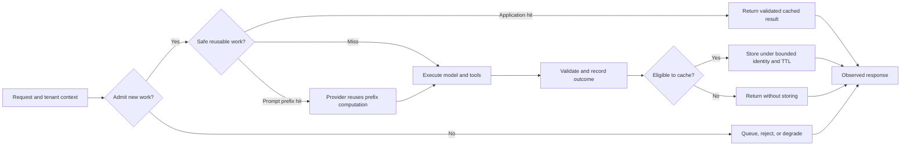
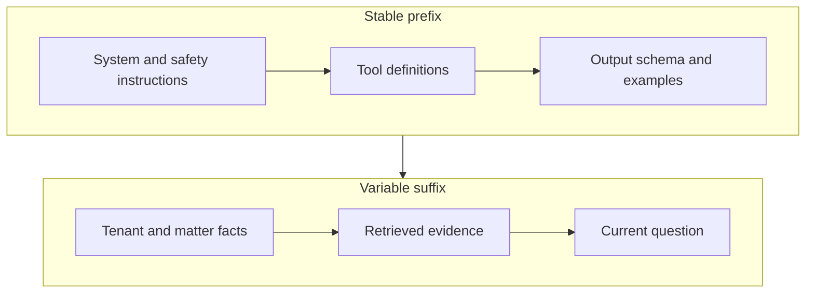
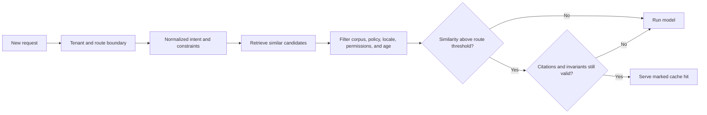

An LLM application can fail even when every model response is correct. A burst of requests can exhaust provider capacity. One tenant can consume the shared budget. Repeated long prompts can make a simple interaction slow and expensive. Automatic retries can turn a temporary problem into an outage.

Two families of controls address this. **Caching** avoids work whose result can be safely reused. **Limits** decide how much new work the system will admit. They are related, but they are not interchangeable: a cache lowers average demand, while admission control protects the system when misses and traffic still exceed capacity.

## See The Control System Before Choosing A Cache
<!-- section-summary: A production request passes through admission, reuse, execution, and degradation controls; each solves a different failure mode. -->

Use a legal research assistant called CaseLens as a supporting example. A lawyer asks it to search approved documents and produce a cited answer for one client matter. The request may contain a long policy prefix, retrieval results, tool calls, and generated text. Other lawyers may ask identical or similar questions.

The request path has four control stages:



The diagram separates several mechanisms that are often bundled under “LLM optimization.” Provider prompt caching reuses model-side computation for a repeated prefix but still produces a new response. An exact result cache returns an earlier application result. A semantic cache may return an earlier result for a merely similar request. Rate limits and quotas govern admission. Queues move accepted work out of the live path. Circuit breakers stop calls to a dependency that is already failing.

Before adding any mechanism, name the work it avoids, the identity that proves reuse is valid, the maximum acceptable staleness, and the fallback on failure. Without those four answers, a cache is just an uncontrolled second source of truth.

## Prompt Caching Reuses A Prefix, Not An Answer
<!-- section-summary: Provider prompt caching reduces repeated input processing when the beginning of a request is identical; it does not reuse the generated answer or remove the need for rate controls. -->

LLM requests often start with the same system instructions, tool definitions, schemas, and examples. A provider can retain intermediate computation for this identical prefix and reuse it when a later request begins the same way. The variable user question and retrieved context still receive fresh processing, and the model still generates a new answer.

For CaseLens, put stable instructions first: the role, citation policy, allowed tools, output schema, and firm-wide safety rules. Put volatile material later: matter permissions, the current question, retrieved passages, and conversation-specific state.



OpenAI's current prompt-caching documentation says eligible requests are cached automatically and that hits depend on exact prefix matches. It also exposes cached-token usage so the effect can be measured. Model-specific eligibility, pricing, thresholds, and retention can change, so keep those details in provider configuration or a current runbook rather than hard-coding them into the application architecture.

Several small changes can destroy a useful prefix: inserting a request ID near the top, changing tool order, serializing the same schema differently, or placing retrieved passages before stable instructions. A good trace therefore records the model, prompt-template version, prefix fingerprint, input tokens, cached tokens, and latency. A low hit rate should lead to an inspection of prefix stability, not a guess that “the cache is broken.”

Prompt caching does not create cross-request answer staleness because the answer is generated again. It also does not guarantee capacity, fairness, or a lower output-token bill. Those remain separate controls.

## Result Caching Requires A Complete Identity
<!-- section-summary: An application result can be reused only when the cache key represents every input and policy decision that could change the valid answer. -->

An **exact result cache** returns a previously produced result when the application decides that the new request is equivalent. The difficult part is not `GET` and `SET`; it is defining equivalence.

For a cited legal answer, the question text alone is not enough. The valid result also depends on tenant and matter boundaries, corpus revision, jurisdiction, retrieval configuration, prompt and tool versions, model policy, output schema, and the caller's permission class. If any of those can change the answer, it belongs in the identity or makes the route ineligible for caching.

A compact key contract makes that reasoning visible:

```yaml
namespace: caselens-answer-v3
scope:
  tenant: firm-27
  matter: matter-884
identity:
  normalized_request_digest: sha256:...
  corpus_snapshot: legal-docs-2026-07-15
  prompt_version: cited-answer-12
  retrieval_policy: hybrid-rerank-4
  model_policy: research-standard-7
  permission_class: matter-counsel
freshness:
  expires_at: 2026-07-16T14:00:00Z
```

This is more than a storage key. It is the proof behind the reuse decision. Store the result together with citations, source versions, validation outcome, creation time, and provenance. On a hit, the application can still perform cheap checks: is the user still authorized, is the corpus snapshot still active, and did any cited source receive an urgent revocation?

**Time to live (TTL)** sets an upper bound on how long an entry remains reusable. TTL is useful, but it is not a complete invalidation strategy. A document withdrawal, permission change, policy release, or discovered unsafe answer may need immediate invalidation. Versioned keys avoid expensive broad deletes for ordinary releases; a revocation index handles exceptional cases that cannot wait for expiry.

Caching also creates concurrency problems. When a popular key expires, many workers may compute it at once—a **cache stampede**. Request coalescing lets one worker fill the entry while others wait briefly or use a permitted stale value. Add TTL jitter so many related keys do not expire at exactly the same second. Bound memory and select an eviction policy so the cache cannot grow without limit.

## Semantic Caching Changes The Product Meaning
<!-- section-summary: A semantic cache treats similar requests as reusable, so its threshold, scope, and validation are quality and security decisions rather than ordinary performance tuning. -->

An exact cache asks, “Are these inputs the same under our normalization rules?” A **semantic cache** asks, “Are these requests similar enough that the old answer should serve the new one?” It usually embeds a request, retrieves nearby prior requests, applies metadata filters, and compares a similarity score with a threshold.

That can help narrow, low-risk routes such as rewriting a generic product explanation. It is far more dangerous for legal, medical, financial, personalized, or rapidly changing answers. “Can this employee be dismissed?” and “Can this contractor be dismissed?” may be close in vector space while depending on different law and evidence. A high similarity score is not proof of equivalent intent.

A safe semantic decision is therefore a policy pipeline:



The route—not the cache library—should define the threshold and invariants. CaseLens might prohibit semantic answer caching entirely while allowing semantic reuse of a document classification step. Another product might require that extracted entities, locale, policy version, and requested output mode match exactly even when the free-text wording is similar.

Evaluate semantic caching with a labeled set of request pairs. Measure unsafe-hit rate, false misses, answer-quality delta, citation validity, and latency/cost savings. A high hit rate is not success if it returns plausible answers to non-equivalent questions.

## Limits Allocate Scarce Capacity
<!-- section-summary: Provider rate limits describe upstream capacity; application quotas and concurrency limits allocate that capacity among users, tenants, routes, and workloads. -->

**Rate limits** cap work over time, such as requests or tokens per minute. **Concurrency limits** cap simultaneous work. **Quotas** cap consumption over a longer budget window, such as tokens or currency per day. These controls answer different questions.

Provider limits protect the upstream service and may vary by model, organization, project, or usage tier. The application sees them as a hard outer boundary. Product controls sit inside that boundary and express business policy: reserve capacity for interactive traffic, prevent one tenant from monopolizing workers, bound an agent's steps, and stop a background evaluation from draining the live budget.

Token-based controls matter because two requests can consume radically different capacity. A short classification and a long agent run should not count as equal. Estimate input size before admission, set maximum output and tool-step budgets, then reconcile the estimate with actual usage.

Hierarchical admission makes fairness explicit:

| Boundary | Example question |
| --- | --- |
| Request | Is this context, output, and step budget allowed? |
| User | Is this burst consistent with the user's product tier? |
| Tenant | Has this customer reached its shared budget or concurrency? |
| Route | Should live chat outrank document re-indexing? |
| Model/provider | Is there upstream headroom for this workload? |
| System | Can queues and workers stay within latency and memory targets? |

The order matters. Reject an oversized request before consuming a tenant token. Reserve capacity before starting expensive retrieval. Release reservations when requests fail. Use an idempotency key so a client retry does not spend the quota twice.

Return a clear outcome. A `429` means the caller exceeded an admission rule and should retry only when advised. A `503` more often signals temporary service unavailability. Include a bounded retry delay where appropriate, but do not reveal other tenants' usage or internal capacity.

## Backpressure Prevents A Queue From Hiding Overload
<!-- section-summary: Backpressure slows or rejects producers when downstream work cannot keep up, preserving a bounded queue and a useful latency promise. -->

A queue absorbs short bursts and separates request acceptance from execution. It does not create capacity. If work arrives faster than workers complete it, queue age grows until the product has only moved the outage into the future.

Track both queue depth and age of the oldest eligible job. Depth alone is misleading because jobs vary in cost. Set a maximum age, maximum pending work per tenant, and cancellation policy. Interactive requests may be rejected quickly; document ingestion or nightly evaluation may be accepted for background completion.

Use provider batch processing only when its completion window and operational contract fit the job. OpenAI's current Batch API, for example, is asynchronous and uses per-request IDs to reconcile outputs. It is suitable for workloads such as eval scoring or embeddings that do not need an immediate response, not as a transparent substitute for live chat.

When an upstream service returns a rate-limit or transient error, retry with exponential backoff and random jitter. Respect provider retry hints. Cap attempts and elapsed time. Retrying every failed request immediately synchronizes clients into another spike—the **thundering herd** problem.

## Circuit Breakers And Degradation Bound Failure
<!-- section-summary: A circuit breaker stops repeated calls to an unhealthy dependency, while a degradation policy defines what useful and honest service remains. -->

A **circuit breaker** observes calls to one dependency. In the closed state, calls flow normally. After a threshold of qualifying failures, it opens and fails fast. After a cool-down, a small number of probe calls enter the half-open state. Success closes the circuit; failure opens it again.

Breakers should be scoped to the real fault domain: provider, model, region, or tool—not necessarily the whole application. A failed web-search tool should not disable a response that can honestly rely on approved internal documents.

Degradation is a product decision. CaseLens might switch a background summarization job to a slower model, offer search results without synthesized advice, or ask the lawyer to retry later. It must not silently remove citations or cross a data-residency boundary to keep the page green. The response should state when a reduced mode changes capability.

Timeouts, retries, concurrency limits, and circuit breakers must be designed together. A timeout bounds one attempt. A retry handles a limited transient failure. A concurrency limit prevents too many attempts at once. A breaker stops attempts when evidence says the dependency is unhealthy.

## Operate The Controls As Quality Features
<!-- section-summary: Cache and limit telemetry must explain saved work, unsafe reuse, rejected demand, queue pressure, and degraded outcomes rather than celebrating hit rate alone. -->

Observe the complete decision path. For each request, record the route and tenant class, admission outcome, estimated and actual tokens, queue wait, cache type and key version, hit or miss, staleness age, provider cached tokens, retry count, breaker state, degraded mode, latency, cost, and quality outcome. Protect or hash sensitive key material.

Useful questions include:

- Did lower latency come from prompt caching, answer reuse, a smaller model, or skipped work?
- Are misses caused by legitimate corpus changes or accidental prompt-prefix churn?
- Which tenant or background route creates queue age?
- Do semantic hits pass the same quality and citation checks as fresh answers?
- Are 429 responses controlling bursts, or is the product permanently under-provisioned?
- Does degradation preserve the promised safety and evidence?

Test the failure paths deliberately. Change a permission after an answer is cached. Revoke a cited document. Expire a hot key under load. Send two requests with the same idempotency key. Exhaust one tenant's quota while another remains active. Force the provider to return 429s and timeouts. Open a breaker and verify that the user sees the intended reduced mode.

The release gate should compare more than cost. Track latency distributions, cost per successful task, cache eligibility, exact and semantic hit quality, stale-hit rate, rejected demand, queue age, dependency error rate, and task success. A cheaper system that serves invalid evidence or rejects the wrong users has not improved.

## Build The System In This Order
<!-- section-summary: Start with bounded requests and admission, then stabilize prompt structure, add exact caches, and introduce semantic reuse only after route-specific evidence supports it. -->

Begin with request budgets, tenant boundaries, concurrency controls, timeouts, and honest error handling. Those controls protect the system before any cache is warm. Next, make stable prompt prefixes truly stable and measure provider-side caching. Add exact result caching only to routes with a complete identity and invalidation story. Introduce queues for work that can be delayed. Add circuit breakers and explicit degradation for dependencies whose failure would otherwise cascade.

Semantic caching comes last. It requires a route-specific equivalence policy and an evaluation set, not merely a vector index.

The central design is simple: reuse only when identity proves the work is still valid; admit new work only when budgets and downstream capacity allow it; and make every rejection, stale boundary, and degraded response visible. That is how caching and limits support product correctness instead of acting as a collection of isolated optimization tricks.


*The control stack separates safe reuse, fair limits, and clear degradation so legal research stays bounded and auditable.*

## References

- [OpenAI prompt caching](https://developers.openai.com/api/docs/guides/prompt-caching)
- [OpenAI rate limits](https://developers.openai.com/api/docs/guides/rate-limits)
- [OpenAI data controls](https://developers.openai.com/api/docs/guides/your-data)
- [OpenAI Batch API](https://developers.openai.com/api/docs/guides/batch)
- [OpenAI API deployment checklist](https://developers.openai.com/api/docs/guides/deployment-checklist)
- [Redis cache-aside pattern](https://redis.io/docs/latest/develop/use-cases/cache-aside/)
- [Redis key eviction](https://redis.io/docs/latest/develop/reference/eviction/)
- [Redis semantic cache](https://redis.io/docs/latest/develop/use-cases/semantic-cache/)
- [OpenTelemetry documentation](https://opentelemetry.io/docs/)
