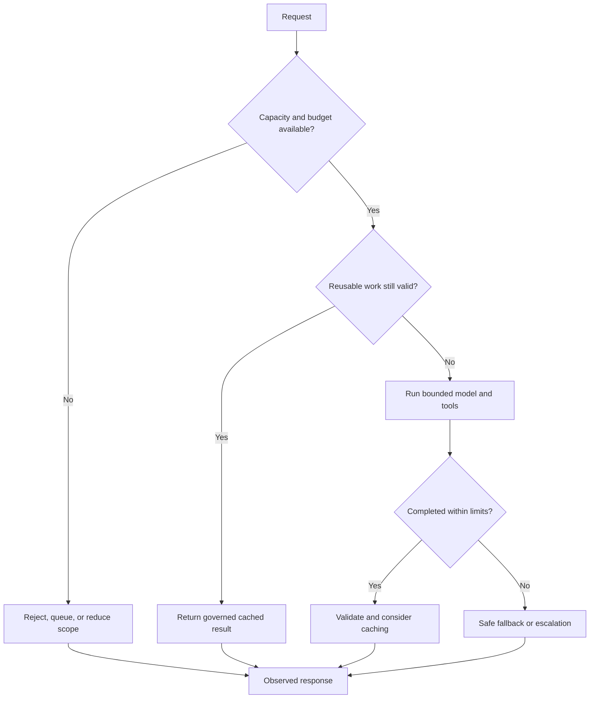
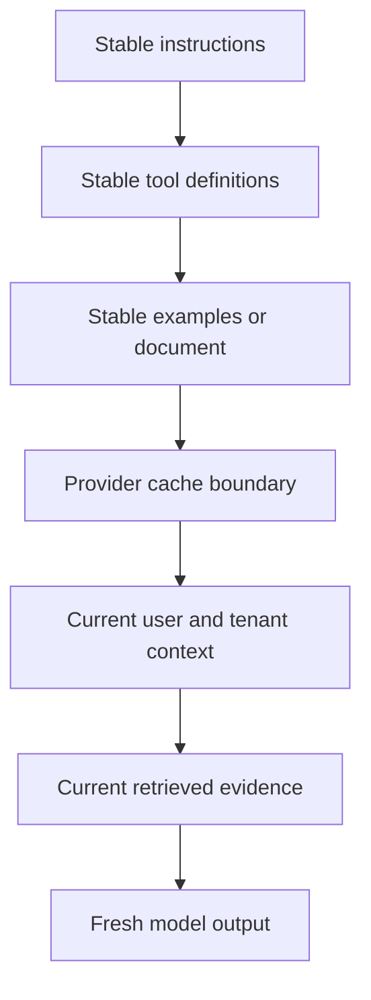
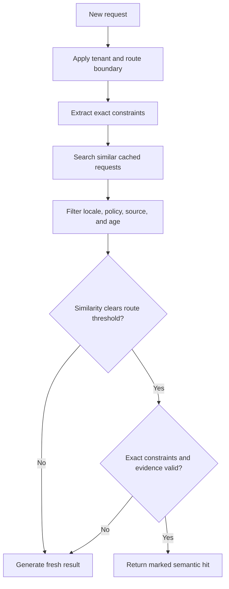
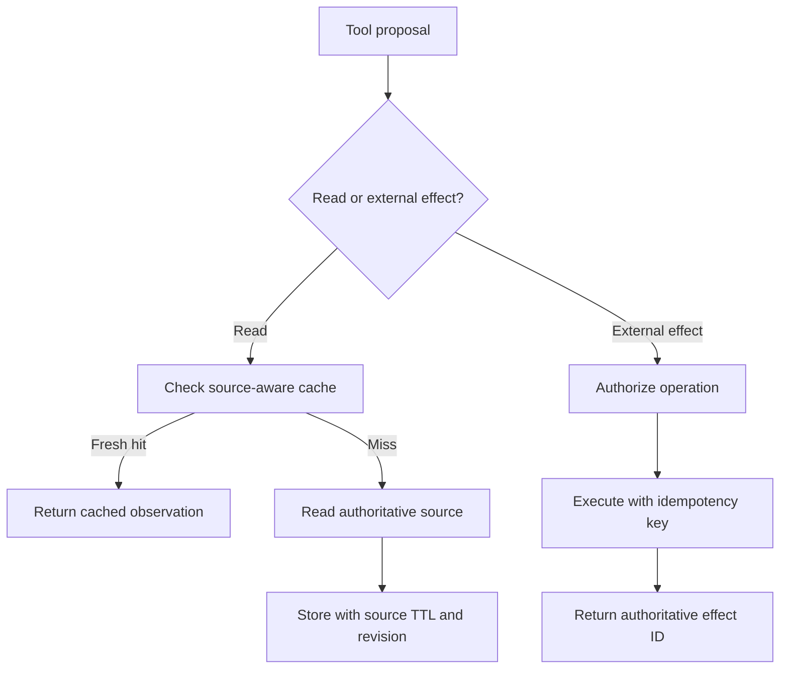
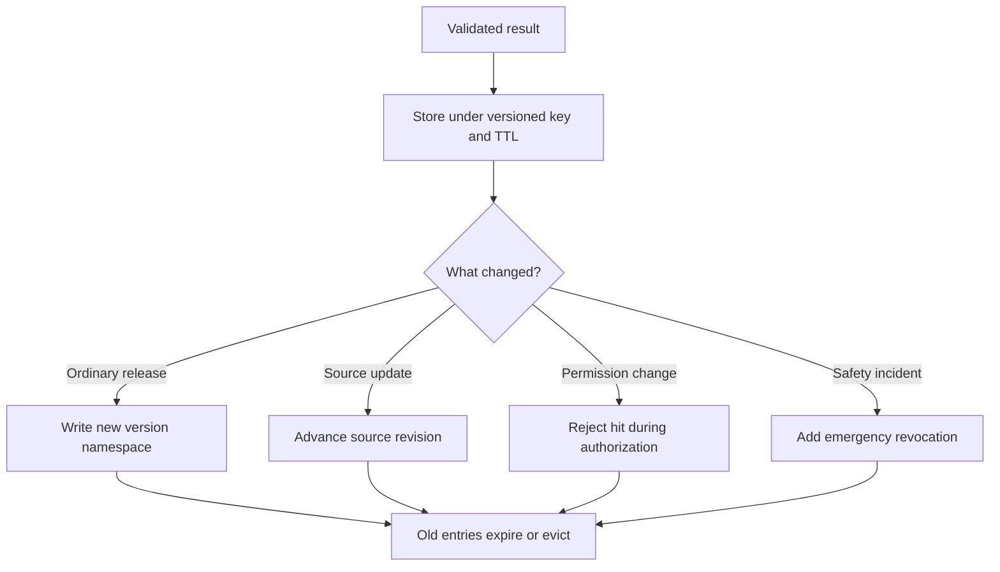
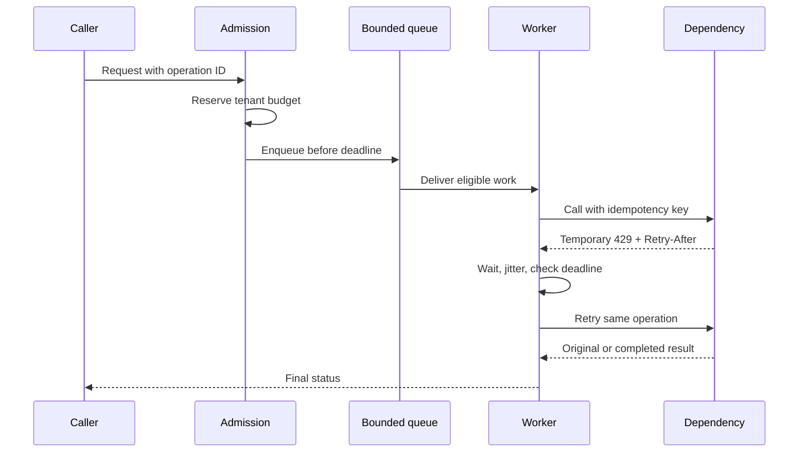
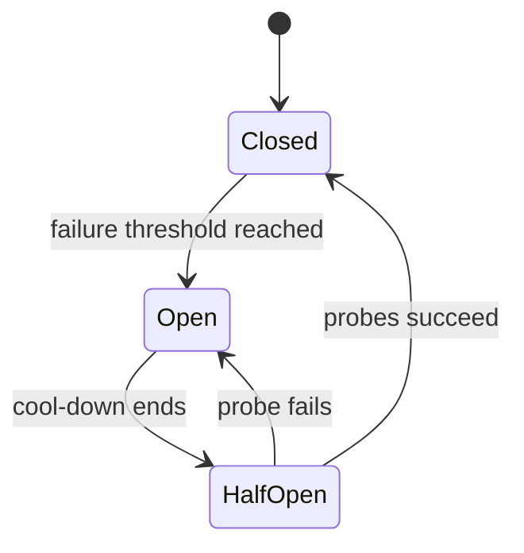
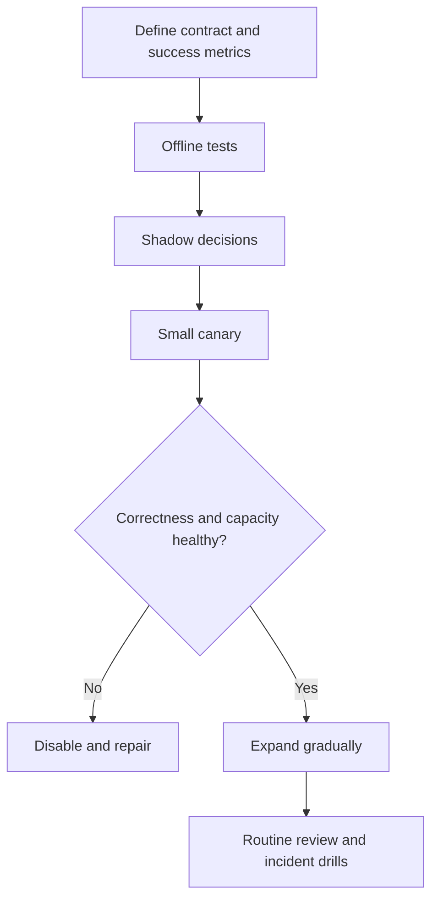

## Table of Contents

1. [Caching and Limits Control Two Production Problems](#caching-and-limits-control-two-production-problems)
2. [Treat A Cache As A Controlled Copy Of Reusable Work](#treat-a-cache-as-a-controlled-copy-of-reusable-work)
3. [Provider Prompt Caches Reuse Prefix Computation](#provider-prompt-caches-reuse-prefix-computation)
4. [Choose Exact Or Semantic Result Caching](#choose-exact-or-semantic-result-caching)
5. [Cache Retrieval And Tool Results According To Source Rules](#cache-retrieval-and-tool-results-according-to-source-rules)
6. [Include Identity And Freshness In Cache Keys And Invalidation](#include-identity-and-freshness-in-cache-keys-and-invalidation)
7. [Rate Limits, Quotas, and Concurrency Allocate Capacity](#rate-limits-quotas-and-concurrency-allocate-capacity)
8. [Set Limits For Tokens, Tools, Steps, Time, And Spend](#set-limits-for-tokens-tools-steps-time-and-spend)
9. [Control Overload With Backpressure, Queues, Safe Retries, And Idempotency](#control-overload-with-backpressure-queues-safe-retries-and-idempotency)
10. [Tell Users When The System Falls Back Or Cannot Complete The Request](#tell-users-when-the-system-falls-back-or-cannot-complete-the-request)
11. [Observability and Evaluation Measure Correctness as Well as Savings](#observability-and-evaluation-measure-correctness-as-well-as-savings)
12. [Test Each Cache Or Limit Before Full Rollout](#test-each-cache-or-limit-before-full-rollout)
13. [Common Failures Have Specific Repairs](#common-failures-have-specific-repairs)
14. [Reduce Incoming Work Before Repairing An Overload](#reduce-incoming-work-before-repairing-an-overload)
15. [Protect Correctness As Well As Cost](#protect-correctness-as-well-as-cost)
16. [References](#references)

## Caching and Limits Control Two Production Problems

<!-- section-summary: Caching avoids safe-to-reuse work, while limits prevent a service from accepting more new work than it can complete reliably. -->

At a high level, caching and limits keep an LLM product from paying for the same work repeatedly or accepting more work than it can finish safely. Both problems can appear while every individual model call still works.

Imagine hundreds of users asking for the same public return policy. Generating an identical explanation every time wastes input processing, output tokens, and latency. Now imagine one agent repeatedly calling search because it cannot settle on an answer. That run can consume minutes of worker time and a large token bill. A traffic burst, automatic retry loop, or large document upload can create the same pressure across the whole service.

**Caching** stores reusable work so a later request can avoid some computation. **Limits** place boundaries around new work. The first control reduces average demand. The second protects the system during cache misses, traffic spikes, slow dependencies, and unusual agent behavior.

You can think of the production path as four gates. The service first decides whether it has capacity and budget. It then checks whether valid work already exists. A miss enters bounded execution. A failure or exhausted budget enters an explicit fallback.


```mermaid
flowchart TD
    A["Request"] --> B{"Capacity and budget available?"}
    B -->|No| C["Reject, queue, or reduce scope"]
    B -->|Yes| D{"Reusable work still valid?"}
    D -->|Yes| E["Return governed cached result"]
    D -->|No| F["Run bounded model and tools"]
    F --> G{"Completed within limits?"}
    G -->|Yes| H["Validate and consider caching"]
    G -->|No| I["Safe fallback or escalation"]
    H --> J["Observed response"]
    E --> J
    C --> J
    I --> J
```

Each gate owns a different decision. A cache hit says an earlier computation remains suitable. Admission control says the platform can start more work. A run budget says one accepted task can consume only a bounded amount. Fallback says what useful and truthful service remains after a boundary is reached.

## Treat A Cache As A Controlled Copy Of Reusable Work

<!-- section-summary: Cache keys identify reusable work, TTLs limit age, eviction bounds storage, and invalidation removes entries after meaningful source changes. -->

A cache is a fast, disposable copy of work that can be recomputed from an authoritative source. It may store a model result, a retrieval response, a tool result, an embedding, or provider-side prompt computation. Production safety depends on four basic concepts: cache key, time to live, eviction, and invalidation.

A **cache key** identifies the work. Two requests share a key only if every difference that can change the valid result has been represented. A support answer may depend on tenant, user permission class, locale, source revision, prompt version, retrieval settings, model policy, and requested output format. Using question text alone can return another user’s answer or an answer based on withdrawn evidence.

A **time to live**, usually shortened to **TTL**, gives an entry an expiration time. A sixty-second inventory result and a one-day public glossary entry express different freshness promises. TTL sets a maximum age for ordinary reuse. Urgent source withdrawal and permission revocation still require immediate invalidation.

**Eviction** removes entries to stay within a storage or memory limit. Redis supports policies such as least recently used and least frequently used. Eviction is a capacity decision: any evicted entry should be safe to recompute. Durable workflow state, approvals, and business records belong in authoritative storage.

**Invalidation** marks cached work unusable after a meaningful change. Common triggers include a source revision, prompt release, policy update, model change, permission change, safety incident, or corrected answer. Versioned keys handle normal releases. A revocation mechanism handles urgent removals that cannot wait for TTL.

The key construction should be deterministic and reviewable. Canonical JSON plus a cryptographic digest avoids differences caused by dictionary order:

```python
import hashlib
import json


def answer_cache_key(identity: dict[str, str]) -> str:
    required = {
        "tenant_id",
        "permission_class",
        "request_digest",
        "source_revision",
        "prompt_version",
        "retrieval_version",
        "model_policy",
        "locale",
    }
    missing = required - identity.keys()
    if missing:
        raise ValueError(f"missing cache identity: {sorted(missing)}")

    canonical = json.dumps(identity, sort_keys=True, separators=(",", ":"))
    digest = hashlib.sha256(canonical.encode()).hexdigest()
    return f"llm-result:v4:{digest}"
```

The stored value should carry its creation time, source references, validation result, and cache-contract version. On a hit, the application still performs cheap checks such as current authorization and emergency revocation. Redis `SET` with `EX` can attach a TTL, while `maxmemory` and an eviction policy keep cache memory bounded.

## Provider Prompt Caches Reuse Prefix Computation

<!-- section-summary: Provider prompt caching reuses model-side computation for an exact stable prefix and still generates a fresh output for the variable suffix. -->

LLM requests often repeat a long opening: system instructions, tool definitions, output schemas, examples, or a shared document. A provider prompt cache can reuse intermediate computation for that identical prefix. The variable question still receives fresh processing, and the model still generates a new output.

In another term, a provider prompt cache speeds up reading the repeated opening. It is different from an application result cache, which can return an earlier final answer without a new model call.

Prompt layout directly affects hits. Stable material belongs first. Request IDs, timestamps, retrieved records, conversation changes, and the current user message belong after the reusable boundary. Changing tool order or serializing the same schema differently can create a miss because the prefix bytes or tokens change.


```mermaid
flowchart TD
    A["Stable instructions"] --> B["Stable tool definitions"]
    B --> C["Stable examples or document"]
    C --> D["Provider cache boundary"]
    D --> E["Current user and tenant context"]
    E --> F["Current retrieved evidence"]
    F --> G["Fresh model output"]
```

Provider behavior must be checked for the exact model and API:

OpenAI’s current documentation distinguishes GPT-5.6 and later families from earlier models. Newer families support implicit or explicit cache breakpoints and use `prompt_cache_key` for more reliable matching. In explicit mode, the request places `prompt_cache_breakpoint: {"mode": "explicit"}` on the final stable content block and puts changing content afterward. They report reads in `cached_tokens` and writes in `cache_write_tokens`. Earlier eligible models use their documented automatic exact-prefix behavior and reject the newer breakpoint fields.

The rendered prefix before that breakpoint must meet the provider’s minimum size. OpenAI’s documented threshold is 1,024 tokens for eligible prompt caching. The application should log both read and write token counts because repeated cache writes with few later reads can increase cost on models that charge for writes.

Anthropic supports cache controls on cacheable content blocks and reports cache-read and cache-creation tokens. Its API documentation describes automatic and explicit breakpoints, with platform-specific differences. Amazon Bedrock supports prompt-cache checkpoints for supported models, yet its Anthropic route has different automatic-cache support from the direct Claude API. Google’s supported Gemini routes offer implicit and explicit context caching; an explicit cache is a named resource with its own TTL and storage behavior.

These differences affect pricing, retention, rate-limit accounting, supported content, minimum size, and control fields. Keep provider details in a tested adapter and current runbook. The architecture should depend only on the shared promise: an exact stable prefix may receive model-side computational reuse.

## Choose Exact Or Semantic Result Caching

<!-- section-summary: Exact result caches reuse equivalent inputs, while semantic caches infer equivalence from similarity and therefore require stronger evaluation and policy gates. -->

An **exact result cache** returns a previous application result after deterministic normalization produces the same complete identity. Normalization might trim harmless whitespace or canonicalize a structured request. It must preserve every detail that changes meaning.

A **semantic cache** goes further. It embeds the new request, searches earlier requests, and may return an answer whose wording differs. The cache is making a product-level claim: the old answer is valid for the new intent. Vector similarity alone cannot prove that claim.

Consider two policy questions: “Can contractors access the benefit?” and “Can employees access the benefit?” The sentences are close in embedding space, while the answer may depend entirely on the changed role. Similar risks appear with locale, plan tier, jurisdiction, product version, customer identity, and requested time period.

A semantic hit therefore needs hard filters before and after similarity:


```mermaid
flowchart TD
    A["New request"] --> B["Apply tenant and route boundary"]
    B --> C["Extract exact constraints"]
    C --> D["Search similar cached requests"]
    D --> E["Filter locale, policy, source, and age"]
    E --> F{"Similarity clears route threshold?"}
    F -->|No| G["Generate fresh result"]
    F -->|Yes| H{"Exact constraints and evidence valid?"}
    H -->|No| G
    H -->|Yes| I["Return marked semantic hit"]
```

Redis provides a current industrial implementation through vector search, metadata filters, TTLs, and bounded memory. The embedding field finds nearby requests. Tenant, locale, model version, policy version, and safety state remain hard filters. Redis documentation also stresses threshold tuning: a loose threshold raises wrong-hit risk, while a tight threshold removes much of the benefit.

Semantic result caching fits repetitive, low-risk, slowly changing routes such as public FAQ explanations or generic formatting help. Personalized advice, financial decisions, medical guidance, legal interpretation, live incident diagnosis, and permission-dependent answers usually demand fresh execution or much stronger domain validation.

Evaluation uses labeled request pairs with a domain-approved equivalence decision. Measure unsafe-hit rate, false misses, answer-quality delta, evidence validity, and savings. Cache hit rate alone rewards aggressive reuse even if the returned meaning is wrong.

## Cache Retrieval And Tool Results According To Source Rules

<!-- section-summary: Retrieval and tool caches inherit the authorization, freshness, side-effect, and invalidation rules of the systems whose work they reuse. -->

An LLM pipeline performs expensive work outside the model. It may embed a query, retrieve documents, rerank candidates, fetch account state, call a weather API, or run a database query. Caching these stages can save more time than caching the final answer while preserving fresh generation.

A retrieval cache can store candidate document IDs or ranked chunks for a query. Its identity includes tenant, user access class, source snapshot, filter set, embedding model, retrieval algorithm, and reranker version. Source permission changes and document deletion must invalidate the cached candidates before they enter model context.

A read-only tool result can be cached according to the source’s meaning. A public country-code lookup may tolerate a long TTL. Current inventory may tolerate only seconds. A security alert or payment status may require a direct authoritative read. The tool contract should state the freshness bound so the agent can tell the user what the result represents.

Mutating tools require a different concept: **idempotency**. An operation is idempotent if repeating the same intended request produces the same external effect as performing it once. An idempotency key identifies one business operation across retries. It prevents a network timeout from creating two refunds, two messages, or two deployments.


```mermaid
flowchart TD
    A["Tool proposal"] --> B{"Read or external effect?"}
    B -->|Read| C["Check source-aware cache"]
    C -->|Fresh hit| D["Return cached observation"]
    C -->|Miss| E["Read authoritative source"]
    E --> F["Store with source TTL and revision"]
    B -->|External effect| G["Authorize operation"]
    G --> H["Execute with idempotency key"]
    H --> I["Return authoritative effect ID"]
```

An idempotency record is neither a general result cache nor permission. The service compares the repeated request with the original operation and returns the recorded outcome only inside its documented scope. Authorization still runs, and a changed payload requires a new operation or an explicit conflict. AWS and Stripe APIs provide common industrial examples through client tokens or idempotency keys.

Errors and partial results deserve conservative caching. A transient provider error should rarely become a normal cached answer. “Record unavailable” may be safe for a few seconds if the source contract says so. Tool output containing a short-lived signed URL should expire before the URL. The source semantics determine the rule.

## Include Identity And Freshness In Cache Keys And Invalidation

<!-- section-summary: Safe reuse requires a complete identity, an acceptable age, and a reliable response to source, permission, policy, and release changes. -->

Every cache hit should answer three questions. Does this entry belong to the same authorized identity and task? Is its age acceptable for the product promise? Has any change invalidated the assumptions behind it?

Identity includes security and behavior. Tenant, user or permission class, data region, route, locale, prompt version, tool set, model policy, source revision, and output schema can all matter. Shared public content may omit user identity. Personalized results usually cannot.

Freshness has two clocks. **Age freshness** compares the entry with its TTL. **Version freshness** compares source, policy, and release versions. A result created one second ago can already be invalid after an urgent document withdrawal. A stable public definition can remain valid across a model outage if its source revision remains active.

Invalidation needs both ordinary and emergency paths:


```mermaid
flowchart TD
    A["Validated result"] --> B["Store under versioned key and TTL"]
    B --> C{"What changed?"}
    C -->|Ordinary release| D["Write new version namespace"]
    C -->|Source update| E["Advance source revision"]
    C -->|Permission change| F["Reject hit during authorization"]
    C -->|Safety incident| G["Add emergency revocation"]
    D --> H["Old entries expire or evict"]
    E --> H
    F --> H
    G --> H
```

Versioned namespaces make releases predictable. A prompt change writes under `answer:v5` while `answer:v4` ages out. This avoids a large delete operation in the critical path. Emergency revocation adds an entry ID, source ID, or version to a fast deny set so a known-bad result cannot be served during that TTL window.

Cache stampedes need their own control. A popular key can expire and send hundreds of identical misses downstream. Request coalescing lets one worker recompute while peers wait briefly. TTL jitter spreads related expirations across time. A stale-while-revalidate path may serve a slightly older result only for routes whose freshness policy explicitly allows it.

## Rate Limits, Quotas, and Concurrency Allocate Capacity

<!-- section-summary: Rate limits control arrival speed, quotas control accumulated consumption, and concurrency limits control simultaneous pressure on workers and dependencies. -->

A **rate limit** caps how quickly work arrives, such as requests or tokens per minute. A **quota** caps total consumption over a longer window, such as tokens, tool calls, or currency per day. A **concurrency limit** caps the number of tasks running at the same time. These controls protect different resources.

Request counts alone are weak for LLM workloads. One classification may use a few hundred tokens. A long-context agent can use many model calls, retrievals, and thousands of output tokens. Admission should estimate the work and reserve enough capacity before execution. Actual usage then reconciles the reservation.

Limits usually form a hierarchy. The user gets a burst allowance. The tenant gets shared tokens and concurrency. Interactive routes reserve capacity ahead of background indexing. The model adapter stays below provider request and token limits. The whole system stays within worker, database, and cost boundaries.

A **token bucket** is a common rate-limit algorithm. Tokens enter a bucket at a fixed rate up to a maximum. Each request consumes one or more tokens. The maximum permits a short burst, while the refill rate controls sustained traffic. Envoy’s local rate-limit filter implements this pattern at the gateway:

```yaml
typed_config:
  "@type": type.googleapis.com/envoy.extensions.filters.http.local_ratelimit.v3.LocalRateLimit
  stat_prefix: llm_ingress
  token_bucket:
    max_tokens: 20
    tokens_per_fill: 10
    fill_interval: 1s
  filter_enabled:
    default_value: {numerator: 100, denominator: HUNDRED}
  filter_enforced:
    default_value: {numerator: 100, denominator: HUNDRED}
```

This local bucket protects one Envoy process or configured local scope. A distributed tenant quota needs shared state or a global rate-limit service. Gateway request limits also lack token awareness unless the application supplies cost descriptors. Many teams combine a fast edge burst limit with an application admission service that tracks tenant tokens, concurrency, and spend.

Provider limits create an outer ceiling. OpenAI currently documents separate measures such as requests and tokens across time windows and exposes remaining capacity in response headers. Other providers organize limits by account, project, region, model, or provisioned throughput. Read the target provider’s current quota contract and leave headroom for retries and measurement error.

Return `429 Too Many Requests` for a caller-specific admission limit and include `Retry-After` where a temporary window has a meaningful retry time. A `503` can describe temporary service unavailability. The response should identify the user’s next safe action without revealing another tenant’s consumption.

## Set Limits For Tokens, Tools, Steps, Time, And Spend

<!-- section-summary: A run budget gives one accepted request finite allowances for context, output, tool calls, agent steps, elapsed time, retries, and estimated cost. -->

A **budget** is the maximum amount of a resource that one task may consume. Admission limits control work across users and time. A run budget controls the behavior of one accepted request.

Agents need multiple budgets because no single number captures their work. An input-token budget bounds assembled context. An output-token budget bounds generation. Tool and step budgets prevent loops. An elapsed-time deadline keeps the user experience finite. Retry and cost budgets stop a failing dependency from multiplying spend.

Budget values should follow the route and risk. A chat classification can allow one model call and no tools. A research task can allow several searches and a longer deadline. A high-impact tool may consume an action budget only after approval. The model can receive the remaining step count as guidance, while the orchestrator enforces the counters.

```yaml
route: cited_support_answer
budget:
  input_tokens: 24000
  output_tokens: 1200
  model_calls: 3
  tool_calls:
    search_knowledge: 4
    read_document: 6
  agent_steps: 10
  retries: 2
  elapsed_seconds: 45
  estimated_cost_usd: 0.40
on_exhaustion:
  search_knowledge: answer_from_verified_evidence
  input_tokens: summarize_or_drop_low_priority_context
  elapsed_seconds: return_partial_with_limit_reason
```

The context builder spends input budget intentionally. System and safety instructions have highest priority. Current user intent, tool schemas, and essential evidence follow. Old conversation turns and low-ranked retrievals may be summarized or removed. Truncating arbitrary tokens at the model boundary can cut a citation, schema, or instruction in half.

Budget exhaustion is a normal runtime outcome. The orchestrator records which allowance ended the run and chooses a defined response: use verified evidence already collected, ask the user to narrow the task, enqueue an approved background job, or return a partial result marked with its limitation. Quietly continuing under an untracked “emergency” budget defeats the control.

## Control Overload With Backpressure, Queues, Safe Retries, And Idempotency

<!-- section-summary: Backpressure slows producers as downstream capacity fills, bounded queues defer suitable work, and limited idempotent retries recover from transient failures. -->

**Backpressure** is the signal that asks producers to slow down because downstream work cannot keep pace. Without it, requests continue entering memory, queues, database connections, and provider calls until latency and failures spread across the service.

A queue can absorb a short burst or move delay-tolerant work into the background. It creates scheduling flexibility; it creates no new capacity. If arrivals stay above completions, queue age rises and results can arrive after users no longer need them.

Bound the queue by tenant, route, count, estimated tokens, and oldest acceptable age. Separate interactive work from batch evaluation or document indexing. Track the age of the oldest eligible job alongside depth. Expired or cancelled work should leave the queue before consuming provider capacity.

Retries address a narrow class of transient failures. Follow a provider’s `Retry-After` value where supplied. Otherwise, use exponential backoff with random jitter. Cap attempts and total elapsed time. OpenAI’s official SDKs already retry eligible rate-limit errors, so an extra application loop can accidentally multiply retries.


```mermaid
sequenceDiagram
    participant C as Caller
    participant A as Admission
    participant Q as Bounded queue
    participant W as Worker
    participant D as Dependency

    C->>A: Request with operation ID
    A->>A: Reserve tenant budget
    A->>Q: Enqueue before deadline
    Q->>W: Deliver eligible work
    W->>D: Call with idempotency key
    D-->>W: Temporary 429 + Retry-After
    W->>W: Wait, jitter, check deadline
    W->>D: Retry same operation
    D-->>W: Original or completed result
    W-->>C: Final status
```

Idempotency protects retries that may create an external effect. The same key must describe the same normalized operation and scope. The domain service stores the result or detects an in-progress request. A changed payload with the same key should return a conflict. Reads and pure computations may be naturally repeatable; payments, messages, deployments, and record creation need explicit guarantees.

## Tell Users When The System Falls Back Or Cannot Complete The Request

<!-- section-summary: Fallback defines a smaller trustworthy service after capacity, budget, cache, model, or tool failure and keeps changed capability visible to the user. -->

A fallback is the product behavior after the preferred path cannot complete safely. Good fallback preserves a truthful, useful subset of the service. It never crosses a permission or data-residency boundary to improve availability.

A support assistant may return verified source links without synthesis. A research task may move to a background queue and notify the user. A long agent run may present collected evidence and ask for a narrower question. A cache failure may trigger bounded fresh computation. Each route should document acceptable reductions before an incident.

A **circuit breaker** protects a failing dependency. Calls pass normally in the closed state. Repeated qualifying failures open the breaker and fail fast. After a cool-down, a small number of probes enter a half-open state. Successful probes close the breaker; failure opens it again.


```mermaid
stateDiagram-v2
    [*] --> Closed
    Closed --> Open: failure threshold reached
    Open --> HalfOpen: cool-down ends
    HalfOpen --> Closed: probes succeed
    HalfOpen --> Open: probe fails
```

Breaker scope should match the failure domain. A web-search outage can disable that tool while internal retrieval continues. One model-region failure can route to an approved alternative whose quality, data controls, and budget fit the task. A broad global breaker can remove healthy capabilities along with the failed one.

Fallback quality belongs in evaluation. A smaller model may miss required reasoning. A cached public answer may be stale for a live incident. A partial answer may need prominent wording that evidence collection ended early. “Available” has little value if the reduced mode violates the product promise.

## Observability and Evaluation Measure Correctness as Well as Savings

<!-- section-summary: Operational evidence explains reuse, rejection, budget exhaustion, queue pressure, retries, and fallback while evaluation measures the quality of each decision. -->

Caching and limits are quality controls with cost benefits. A dashboard showing only cache hit rate and saved tokens can hide cross-tenant reuse, stale answers, unfair throttling, or agent tasks that end before producing value.

Each request should record the cache contract and admission decision. Useful fields include route, tenant class, key version, cache type, hit or miss, entry age, source revision, invalidation reason, estimated and actual tokens, provider cached tokens, queue wait, budget exhaustion reason, retry count, breaker state, fallback mode, latency, cost, and task result. Hash or omit sensitive key material.

Different caches need different success measures:

- Provider prompt caches: read tokens, write tokens, time to first token, prefix stability, and net cost.
- Exact result caches: eligible requests, valid hits, stale-hit rate, authorization failures, and latency saved.
- Semantic caches: unsafe-hit rate, false misses, evidence validity, and task-quality delta.
- Retrieval and tool caches: source age, invalidation lag, source-call reduction, and permission correctness.

Limit telemetry should explain demand that the product declined. Track rate-limit decisions by user and tenant class, reserved versus actual tokens, active concurrency, queue depth and age, run-budget exhaustion, provider `429` responses, retry amplification, and fallback success. High denial rates can signal abuse, a broken estimator, an overly small product limit, or insufficient capacity.

Evaluation needs adversarial and load cases. Change a user’s permission after a result enters the cache. Withdraw a cited document. Send semantically close questions with different critical facts. Expire a hot key under load. Exhaust one tenant’s quota and verify another tenant remains healthy. Force tool timeouts, provider rate limits, and partial failures. Reuse an idempotency key with changed arguments and expect a conflict.

The final gate compares task success, latency distributions, cost per successful outcome, valid reuse, stale exposure, rejected demand, and degraded-mode quality. Savings count only after correctness remains within the route’s acceptance threshold.

## Test Each Cache Or Limit Before Full Rollout

<!-- section-summary: Safe rollout observes decisions before enforcement, compares cache hits with fresh execution, canaries bounded traffic, and keeps a fast disable path. -->

Caching and admission changes can alter answers and availability, so rollout should reveal their decisions before they control all traffic. Each mechanism also needs an emergency disable switch independent of a full deployment.

Start cache rollout with shadow reads. The application looks up entries and records potential hits while fresh execution still serves the user. Compare the cached candidate with the fresh result, evidence, authorization, and latency. After the contract passes evaluation, serve exact hits to a small traffic segment.

Semantic caches need a stricter sequence. Build a labeled pair set, choose route-specific hard filters, sweep similarity thresholds offline, and shadow candidates in production. Human review of high-impact disagreements can uncover missing constraints. Canary only the narrow routes with acceptable unsafe-hit evidence.

Limits can also run in observe-only mode. Envoy supports separate enabled and enforced fractions for local rate limiting, for example. Log which requests would receive a denial, then check tenant fairness, route priorities, and user experience before enforcing a small percentage.


```mermaid
flowchart TD
    A["Define contract and success metrics"] --> B["Offline tests"]
    B --> C["Shadow decisions"]
    C --> D["Small canary"]
    D --> E{"Correctness and capacity healthy?"}
    E -->|No| F["Disable and repair"]
    E -->|Yes| G["Expand gradually"]
    G --> H["Routine review and incident drills"]
```

Warm-cache and cold-cache load tests reveal different behavior. A release can appear healthy with a full cache and overload providers immediately after invalidation. Test ordinary key-version changes, regional cache loss, popular-key expiry, and total cache unavailability. Capacity plans should survive the agreed cold-cache scenario.

## Common Failures Have Specific Repairs

<!-- section-summary: Cache leaks, stale results, stampedes, retry storms, unfair limits, and runaway agents each point to a specific authoritative control. -->

The visible symptom often looks like “the LLM is slow” or “the answer is wrong.” Repair starts by identifying which reuse or admission promise failed.

### Cached Data Reached The Wrong User Or Tenant

A result appears under the wrong tenant, user, locale, or permission class. Disable the affected namespace, add emergency revocation, and inspect key construction plus authorization on hits. Derived cache entries and traces may contain exposed data. Rebuild under a new version and add negative cross-boundary tests.

### Freshness or Invalidation Failed

An answer cites withdrawn content or old policy. Revoke entries referencing the source, advance the source revision, and measure invalidation lag. The long-term repair may combine versioned keys, source-to-cache lineage, shorter TTL, and a fast deny set for urgent changes.

### Many Cache Misses Overloaded A Dependency

Many workers recompute the same expired key. Add request coalescing, TTL jitter, bounded stale reuse for eligible routes, and cold-cache load tests. Confirm that the cache memory policy retains genuinely hot entries without treating the cache as permanent storage.

### Retries Multiplied the Outage

Application retries, SDK retries, queue redelivery, and agent retries can stack. Map every retry layer and choose one owner per dependency.

Honor `Retry-After` and cap attempts plus elapsed time. Side effects require idempotency. A breaker can stop calls after evidence shows the dependency is unhealthy.

### Limits Blocked The Wrong Requests

One tenant consumes shared capacity, or cheap work is rejected behind expensive work. Add tenant and route isolation, token-aware reservations, separate interactive and background queues, and tested priority rules. Compare reserved with actual consumption so the estimator improves.

### One Run Consumed Too Many Resources

The orchestrator allowed repeated model or tool calls without useful progress. Enforce step, tool, token, retry, time, and cost budgets. Record the exhaustion reason and evaluate the defined partial response. Repeated exhaustion on normal tasks may indicate poor tool design or orchestration rather than an intentionally difficult request.

## Reduce Incoming Work Before Repairing An Overload

<!-- section-summary: Cache or overload incidents stop unsafe reuse and excess admission, preserve evidence, reconcile effects, repair the control, and recover gradually. -->

A cache correctness incident starts by stopping unsafe hits. Disable the namespace or semantic route, add a revocation rule, and force fresh execution only if the downstream system has capacity. If safe fresh capacity is unavailable, reject or queue work with a clear explanation.

An overload incident starts by reducing new work. Tighten admission, pause background routes, cap concurrency, open a breaker for the failing dependency, and stop unbounded retries. Preserve capacity for health checks, operator actions, and the highest-priority user paths.

Next, preserve the cache key version, entry provenance, source revision, and policy or prompt versions. Admission reason, queue state, budget counters, retry chain, provider headers, and external effect IDs complete the decision evidence.

Sensitive cache values require the same access controls as their source data.

Scope the impact through concrete questions. Which routes and tenants could receive the entry? Which source change failed to propagate? Did any mutating tool execute twice? Which jobs are now too old to provide value? Can the service handle a cold-cache recovery without creating a second overload?

Recovery proceeds gradually. Repair and test the authoritative control, invalidate affected entries, reconcile external effects, and restore traffic through a small canary. Watch valid-hit rate, provider capacity, queue age, budget exhaustion, and fallback quality. Keep the emergency lever available until the cache and downstream system reach a stable operating state.

Residual uncertainty remains. Provider cache semantics, billing, model support, retention, and quota behavior can change. Semantic similarity can miss a domain-specific distinction. Token estimators can undercount. A layered design limits those risks through provider adapters, hard identity filters, current documentation checks, conservative budgets, shadow evaluation, and tested disable paths.

## Protect Correctness As Well As Cost

<!-- section-summary: Production LLM systems reuse work only under a valid identity and admit new work only inside explicit capacity and run budgets. -->

Caching and limits form one control system. Caches reuse prompt computation, results, retrieval, or tool observations only while identity, freshness, and source assumptions remain valid. Limits allocate arrival rate, accumulated quota, concurrency, and one run’s finite budget.

In essence, reuse needs proof and new work needs permission from capacity. Backpressure and bounded queues protect downstream services. Idempotent retries recover uncertain operations, circuit breakers stop repeated failure, and honest fallback keeps reduced service visible.

A reliable implementation can explain every shortcut and every refusal. Operators can see why an entry was reusable, why work entered the system, which budget ended a run, and which safe path handled the result.

## References

- [OpenAI API: Prompt Caching](https://developers.openai.com/api/docs/guides/prompt-caching)
- [OpenAI API: Rate Limits](https://developers.openai.com/api/docs/guides/rate-limits)
- [Anthropic: Prompt Caching](https://platform.claude.com/docs/en/build-with-claude/prompt-caching)
- [Amazon Bedrock: Prompt Caching](https://docs.aws.amazon.com/bedrock/latest/userguide/prompt-caching.html)
- [Google Cloud: Context Caching Overview](https://cloud.google.com/vertex-ai/generative-ai/docs/context-cache/context-cache-overview)
- [Redis: Semantic Cache](https://redis.io/docs/latest/develop/use-cases/semantic-cache/)
- [Redis: SET Command](https://redis.io/docs/latest/commands/set/)
- [Redis: Key Eviction](https://redis.io/docs/latest/develop/reference/eviction/)
- [Envoy: Local Rate Limit Filter](https://www.envoyproxy.io/docs/envoy/latest/configuration/http/http_filters/local_rate_limit_filter.html)
- [RFC 6585: 429 Too Many Requests](https://www.rfc-editor.org/rfc/rfc6585.html)
- [AWS Well-Architected: Make Mutating Operations Idempotent](https://docs.aws.amazon.com/wellarchitected/latest/framework/rel_prevent_interaction_failure_idempotent.html)
- [AWS Well-Architected: Control and Limit Retry Calls](https://docs.aws.amazon.com/wellarchitected/latest/framework/rel_mitigate_interaction_failure_limit_retries.html)
- [AWS Well-Architected: Fail Fast and Limit Queues](https://docs.aws.amazon.com/wellarchitected/latest/framework/rel_mitigate_interaction_failure_fail_fast.html)
- [Stripe API: Idempotent Requests](https://docs.stripe.com/api/idempotent_requests)
