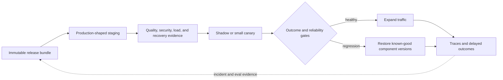

## From a Demo to an Operated Service

<!-- section-summary: Production deployment joins normal service reliability with versioned prompts, models, retrieval, tools, evals, data controls, and rollback. -->

**Production deployment** is the process that gives an LLM application real users, reliable infrastructure, controlled releases, observable behaviour, and a safe recovery path. The model call is one part of that process. Prompts, retrieval indexes, tool permissions, guardrails, runtime code, and model routes can all change what users experience.

Production deployment has five connected responsibilities. **Release identity** pins every component that changes behaviour. **Environment promotion** moves immutable code while injecting reviewed configuration and short-lived secrets. **Pre-release evidence** exercises quality, security, latency, and recovery against the production-shaped path. **Traffic control** limits exposure and compares the candidate with the current release. **Recovery** restores the specific failed layer and verifies that the restoration reached users.

These responsibilities form a release lifecycle: assemble and sign the release, deploy the same artifact to staging, collect required evidence, expose a small live cohort, expand or stop from measured results, and preserve the evidence for learning. A healthy Kubernetes Deployment covers only part of that lifecycle. It cannot tell the team whether a new prompt lost citations, whether a retrieval index contains the correct policy revision, or whether the model route increased unsafe tool use.

The examples use **WorkPilot**, an internal platform with HR, finance, and engineering copilots. Each one reads different data and receives different tools. The example supplies concrete names for the framework; its release sequence follows the five responsibilities above.

The first prototype ran from a script and one document index. Production introduces questions the demo could ignore. Which employee can search which documents? What happens when a model call takes 40 seconds? How does the team know which prompt and retrieval index produced a bad answer? Can a release be stopped without disabling all three copilots?

The HR change updates a prompt and model route. That narrow change is useful because it demonstrates why an LLM release contains more than a container image.



This lifecycle keeps artifact promotion, behaviour evidence, traffic exposure, and recovery connected. Deployment automation can then identify which component moved, which evidence approved it, and which previous bundle can safely receive traffic.

## Decide What the Release Actually Contains

<!-- section-summary: A WorkPilot release pins the runtime image and the LLM configuration that together define user-visible behaviour. -->

The HR team wants clearer explanations of parental-leave policy. The proposed change updates the prompt bundle and routes complex policy comparisons to a stronger model. The application code, tool contracts, and retrieval index stay unchanged.

WorkPilot gives the release a version and records the exact runtime image, prompt bundle, model-route configuration, tool-policy version, retrieval-index version, and evaluation run. These values form one user-visible release even though they live in different systems.

This identity matters during an incident. An operator should be able to open one trace and see that the answer came from runtime image `8f1ac9…`, HR prompt bundle `2026-07-12.3`, model route `hr-route-9`, and policy index `hr-policy-2026-07-10`. A label such as `latest` would not preserve that history.

A release manifest gives deployment automation and traces one shared identity:

```yaml
release_id: workpilot-hr-2026-07-12.3
scope: hr-copilot
runtime_image: registry.example.com/workpilot/runtime@sha256:ffffffffffffffffffffffffffffffffffffffffffffffffffffffffffffffff
prompt_bundle: hr-support@sha256:eeeeeeeeeeeeeeeeeeeeeeeeeeeeeeeeeeeeeeeeeeeeeeeeeeeeeeeeeeeeeeee
model_route: hr-route-9
retrieval_index: hr-policy-2026-07-10
tool_policy: hr-tools-14
eval_run: eval-8391
data_policy: employee-internal-v4
rollback_target: workpilot-hr-2026-07-05.2
```

The hashes identify immutable artifacts, while the version names remain readable to operators. `scope` prevents the HR candidate from silently changing finance traffic. `eval_run` points to the exact case set, graders, repetitions, and results that authorized live exposure. `data_policy` identifies the retention and access rules used by the release. `rollback_target` is resolved and validated before rollout, so an incident does not begin with an operator searching for the previous good configuration.

Continuous delivery should reject the manifest when an artifact cannot be resolved, an eval blocker failed, a referenced index lacks a publication record, or the rollback target is unhealthy. The deployed service writes the complete release ID into every trace and exposes it from an internal `/version` endpoint. An integration test sends one synthetic request and asserts that the response trace, prompt loader, retrieval query, and tool-policy decision all report the same release components.

The release also has a narrow scope: the HR copilot only. Finance and engineering keep their current versions. Feature flags and routing configuration make that separation enforceable, so a rollback can remove the HR candidate without taking the rest of WorkPilot offline.

## Keep Environment Facts Outside the Image

<!-- section-summary: The same immutable image moves through environments while secrets and reviewed environment-specific configuration arrive at runtime. -->

WorkPilot builds the runtime container once and promotes the same image digest through staging and production. It does not rebuild the application for each environment because separate builds can contain different dependencies even when the source commit matches.

Secrets come from the company’s secret manager. Reviewable configuration supplies prompt versions, model routes, timeouts, output limits, and telemetry endpoints. The image contains neither production API keys nor a hidden copy of the prompt.

A shortened Kubernetes deployment shows the boundary:

```yaml
apiVersion: apps/v1
kind: Deployment
metadata:
  name: workpilot-runtime
spec:
  replicas: 6
  selector:
    matchLabels:
      app: workpilot-runtime
  template:
    metadata:
      labels:
        app: workpilot-runtime
        release: hr-2026-07-12-3
    spec:
      serviceAccountName: workpilot-runtime
      containers:
        - name: runtime
          image: registry.example.com/workpilot/runtime@sha256:ffffffffffffffffffffffffffffffffffffffffffffffffffffffffffffffff
          env:
            - name: RELEASE_VERSION
              value: hr-2026-07-12-3
            - name: PROMPT_BUNDLE_VERSION
              value: hr-2026-07-12.3
            - name: MODEL_ROUTE_VERSION
              value: hr-route-9
          envFrom:
            - secretRef:
                name: workpilot-provider-credentials
          readinessProbe:
            httpGet:
              path: /ready
              port: 8080
```

The readiness endpoint checks that the runtime loaded the declared prompt and route configuration and can reach the permitted retrieval and queue services. It avoids a real model request because Kubernetes calls probes frequently. The liveness endpoint remains simpler and answers whether the process should continue running.

WorkPilot’s browser never receives the provider credential. It calls the company backend, which authenticates the employee, applies department permissions, and sends only authorised context to the model route.

## Staging Must Exercise the Real Workflow

<!-- section-summary: Staging runs the complete copilot path with production-shaped identities, retrieval, tools, traces, and representative evaluation cases. -->

The candidate first reaches staging. WorkPilot uses synthetic employees and approved test documents, while the service topology and permission flow match production. The HR copilot retrieves policy sections, calls the model, produces citations, and records traces through the same application path that production will use.

The evaluation suite contains ordinary policy questions, conflicting documents, missing context, prompt injection, permission boundaries, long conversations, and recent production failures. The candidate runs against the same cases as the current release. Reviewers compare answer support, citation correctness, refusal and escalation behaviour, tool use, latency, and cost.

The new prompt improves clarity, but it also causes the model to search twice as often on simple questions. That raises latency and retrieval load. The team changes the prompt so it uses the supplied policy excerpt before asking for another search, then reruns the suite. A release gate is useful because it sends the candidate back through the same evidence instead of accepting a good demo response.

Staging also checks trace completeness. Every run needs the release version, prompt bundle, model route, retrieval source IDs, tool calls, latency, token use, and outcome. A candidate that cannot be diagnosed should not enter a live canary.

## Live and Background Work Need Different Paths

<!-- section-summary: Interactive questions use bounded low-latency requests, while long reports use a queue and a data-control-compatible background design. -->

Most HR questions are interactive, so WorkPilot applies a request deadline and a limited output budget. If retrieval or the model cannot finish in time, the copilot gives a controlled fallback and offers a link to the policy portal. It does not leave the browser waiting indefinitely.

The finance copilot also creates long weekly summaries. Those jobs enter a queue and run on separate workers, which protects live traffic from large reports. The worker saves progress in WorkPilot’s database and retries only failures that are safe to repeat.

Provider background features can help with long work, but they affect data handling. OpenAI’s current data-control documentation says background mode retains response data briefly for polling and is incompatible with Zero Data Retention. A tenant that requires Zero Data Retention needs a compatible synchronous or externally orchestrated path with state held in the tenant’s approved store.

This choice belongs to deployment because the same product feature may need different runtime and retention paths for different tenants. The route and data-control mode should appear in configuration and traces rather than being an invisible SDK default.

## A Canary Tests the Candidate With Real Conditions

<!-- section-summary: A canary sends a small, identifiable traffic slice to the candidate while the team compares service health and product behaviour with the current release. -->

The staging evidence passes, so WorkPilot sends five percent of eligible HR traffic to the candidate. Assignment is stable by employee, which prevents one conversation from switching between prompt versions on successive turns. Finance and engineering traffic remain unchanged.

The assignment and job pinning can share one small release contract. An **HMAC** is a keyed hash: a deterministic fingerprint calculated with a server-held secret. Here it assigns the same employee to the same release bucket without exposing raw employee identifiers in routing configuration or letting clients choose their bucket.

```python
import hashlib
import hmac

def assigned_release(employee_id: str, control: str, candidate: str,
                     canary_percent: int, assignment_key: bytes) -> str:
    digest = hmac.new(assignment_key, employee_id.encode(), hashlib.sha256).digest()
    bucket = int.from_bytes(digest[:8], "big") % 10_000
    return candidate if bucket < canary_percent * 100 else control

def enqueue_summary(queue, employee_id: str, request: dict, release_id: str):
    return queue.publish({
        "job_type": "weekly_summary",
        "employee_id": employee_id,
        "release_id": release_id,
        "request": request,
    })

def run_job(job, releases):
    release = releases.load_exact(job["release_id"])
    return release.run_weekly_summary(job["request"])
```

The release chosen at enqueue time travels with a background job, so a worker restart cannot silently move the job to whichever prompt is current later. `load_exact` fails when an artifact is missing instead of substituting the newest release. A distribution test can assign 100,000 synthetic IDs and require the candidate share to fall inside a reviewed tolerance around five percent; a consistency test assigns the same ID repeatedly and requires one release; a worker test changes the global default after enqueue and still requires the pinned release.

The team watches normal service signals such as request rate, p95 latency, errors, queue depth, and saturation. **p95 latency** is the duration that 95 percent of measured requests finish at or below; the slowest 5 percent take longer. It also watches LLM-specific behaviour: supported-answer rate, missing citations, retrieval calls per answer, human escalations, policy refusals, token use, and cost per resolved question.

Traces make these aggregate changes explainable. If candidate latency rises, an engineer can see whether the model, retrieval, tool calls, or retries consumed the time. If the supported-answer rate falls, reviewers can open sampled responses with their source IDs and compare them with the current release.

User feedback enters the picture carefully. A thumbs-down can identify a run for review, but it cannot serve as ground truth by itself. Employees may dislike a correct policy answer, and they may approve a fluent unsupported one. WorkPilot combines feedback with source checks and reviewer labels.

The canary stays small until it has enough representative traffic and review coverage. A quiet hour with ten successful questions would not justify full rollout.

The traffic controller needs automatic stop conditions expressed before the canary. One candidate policy may require at least 500 eligible runs, zero permission-boundary violations, a supported-answer rate no worse than two percentage points below control, p95 latency below 4 seconds, and cost per resolved question below 1.25 times control. The exact values come from product risk and historical variation; their purpose is to prevent a team from redefining success after seeing the chart.

A warehouse query can compare candidate and control using the release identity carried by traces:

```sql
SELECT
  release_id,
  COUNT(*) AS runs,
  AVG(CASE WHEN answer_supported THEN 1.0 ELSE 0.0 END) AS supported_rate,
  PERCENTILE_CONT(0.95) WITHIN GROUP (ORDER BY latency_ms) AS p95_latency_ms,
  SUM(cost_usd) / NULLIF(SUM(CASE WHEN resolved THEN 1 ELSE 0 END), 0)
    AS cost_per_resolution,
  SUM(CASE WHEN permission_violation THEN 1 ELSE 0 END) AS permission_violations
FROM llm_run_outcomes
WHERE copilot = 'hr'
  AND started_at >= TIMESTAMP '2026-07-12 09:00:00'
GROUP BY release_id;
```

`COUNT(*)` protects the decision from a tiny sample. The supported-answer rate measures a product property that ordinary HTTP metrics cannot see. The percentile reveals tail latency rather than hiding slow users in an average. Cost is divided by resolved outcomes, so a cheap release that fails to help users receives no false credit. Any permission violation is a hard blocker even if the averages improve.

## Roll Back the Layer That Caused the Problem

<!-- section-summary: WorkPilot can restore the previous prompt, model route, retrieval index, tool policy, or image while preserving the run evidence needed for investigation. -->

During the canary, the HR candidate starts omitting citations when two policy documents disagree. The service itself remains healthy, so restarting pods would not fix the behaviour. Traces show that the problem follows the new prompt bundle rather than the model route or retrieval index.

WorkPilot moves the HR traffic flag back to the previous prompt bundle and confirms that new runs carry the old release version. Existing long-running tasks either finish under their pinned version or restart according to the product’s consistency policy. The platform preserves candidate traces and sampled outputs for investigation.

This is a **configuration rollback**, which is narrower than a container rollback. A bad runtime image would require the previous image digest. A broken retrieval publication would restore the previous index version. A dangerous tool change would disable or revert that tool contract. Versioning each layer lets the team repair the affected part without guessing.

Rollback is complete only after verification. WorkPilot checks that traffic moved, the old prompt version appears in traces, citations recovered, and no candidate worker continues processing unpinned jobs. The incident then adds the conflicting-document case to the release suite.

Operators should run this verification as a saved procedure rather than an improvised dashboard tour. First set the HR route to the rollback target and record the configuration revision. Then poll `/version` on active instances, query the last five minutes of traces by `release_id`, and inspect queue jobs whose pinned release still names the candidate. New interactive runs must all use the rollback target. Candidate background jobs either finish under the documented consistency policy or are cancelled and recreated explicitly. Finally rerun a small conflicting-document smoke set and verify that citation events and source versions return.

A deploy controller should make those verbs executable and refuse to switch traffic before verification. **Signature verification** uses a trusted public key or identity service to prove that the release manifest came from an approved signer and that its bytes have not changed:

```python
def promote_hr_release(platform, manifest, smoke):
    platform.verify_signature(manifest)
    platform.resolve_every_digest(manifest)
    deployment = platform.deploy_zero_traffic(manifest)
    observed = platform.wait_for_versions(deployment, expected=manifest["release_id"])
    if observed.ready != observed.total:
        raise RuntimeError("candidate version verification failed")
    smoke.require_pass(manifest["eval_run"], release_id=manifest["release_id"])
    return platform.compare_and_set_route(
        copilot="hr", expected=manifest["rollback_target"],
        new=manifest["release_id"], candidate_percent=5,
    )

def rollback_hr_release(platform, failed_release, target, smoke):
    revision = platform.compare_and_set_route(
        copilot="hr", expected=failed_release, new=target, candidate_percent=0,
    )
    platform.wait_for_new_runs(copilot="hr", release_id=target, count=20)
    if platform.count_unpinned_jobs(copilot="hr") != 0:
        raise RuntimeError("unpinned background work found")
    smoke.require_pass("conflicting-policy-documents", release_id=target)
    return revision
```

`deploy_zero_traffic` separates artifact deployment from user exposure. The version poll proves that every ready instance loaded the same release. A **compare-and-set update** changes a record only when its current version still equals the value the caller read; the route update therefore prevents two operators from overwriting each other's recovery decision. Rollback verification uses new runs, queue facts, and a quality smoke set; a successful control-plane write alone is insufficient. Contract tests should force a version mismatch and confirm no traffic switch, force a stale expected route and confirm the compare-and-set fails, then perform a rollback and require new traces and smoke results from the target release.

A rollback drill should test this path before an incident. The drill deploys a harmless candidate to a small internal cohort, creates one pinned background job, restores the previous release, and verifies routing, traces, queues, and quality checks. A team that only proves “Kubernetes rolled back” has tested the container layer while leaving prompt, route, index, and long-running work recovery unverified.

## What Makes the Deployment Production-Ready

<!-- section-summary: The complete release connects immutable identity, realistic evaluation, controlled traffic, observable outcomes, tenant data rules, and verified recovery. -->

The HR prompt change travelled through one understandable path. WorkPilot identified the exact image and LLM configuration, injected secrets and environment facts at runtime, exercised the real workflow in staging, and required eval and trace evidence before live traffic. A stable canary exposed the candidate to production conditions, and versioned configuration let the team restore the previous prompt when citations regressed.

That is the difference between running an LLM demo and operating an LLM product. Deployment owns the service and the behaviour around the model: who may use it, which versions handle a request, how long work may run, what data rules apply, what evidence operators receive, and how the team removes a harmful change.

## References

- [OpenAI: Production best practices](https://developers.openai.com/api/docs/guides/production-best-practices)
- [OpenAI: Data controls](https://developers.openai.com/api/docs/guides/your-data)
- [OpenAI: Background mode](https://developers.openai.com/api/docs/guides/background)
- [OpenAI Agents SDK: Tracing](https://openai.github.io/openai-agents-python/tracing/)
- [Kubernetes: Deployments](https://kubernetes.io/docs/concepts/workloads/controllers/deployment/)
- [Kubernetes: Configure probes](https://kubernetes.io/docs/tasks/configure-pod-container/configure-liveness-readiness-startup-probes/)
- [Argo Rollouts](https://argoproj.github.io/argo-rollouts/)
- [OpenTelemetry documentation](https://opentelemetry.io/docs/)
