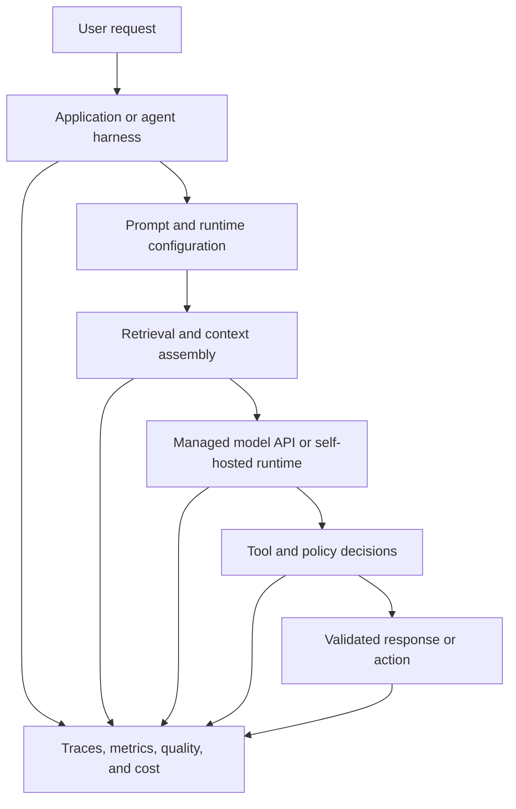
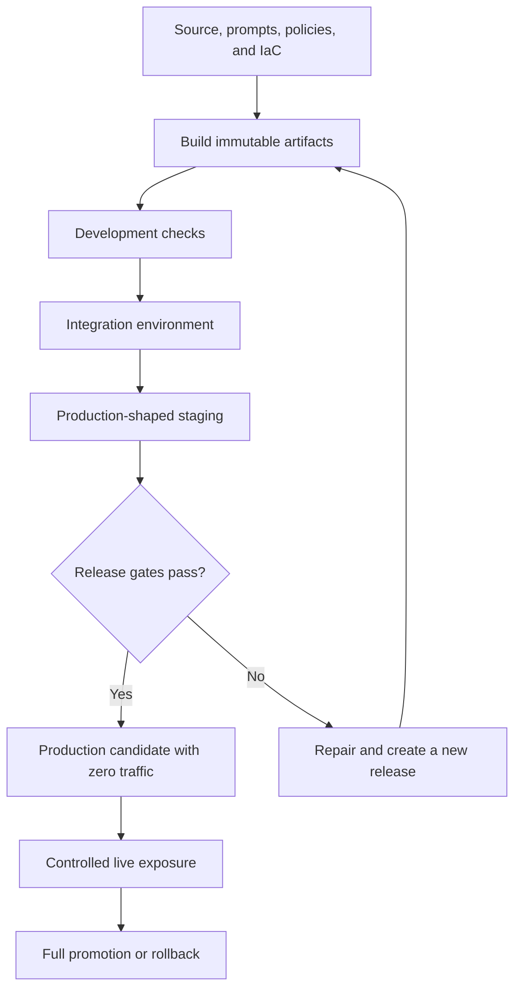
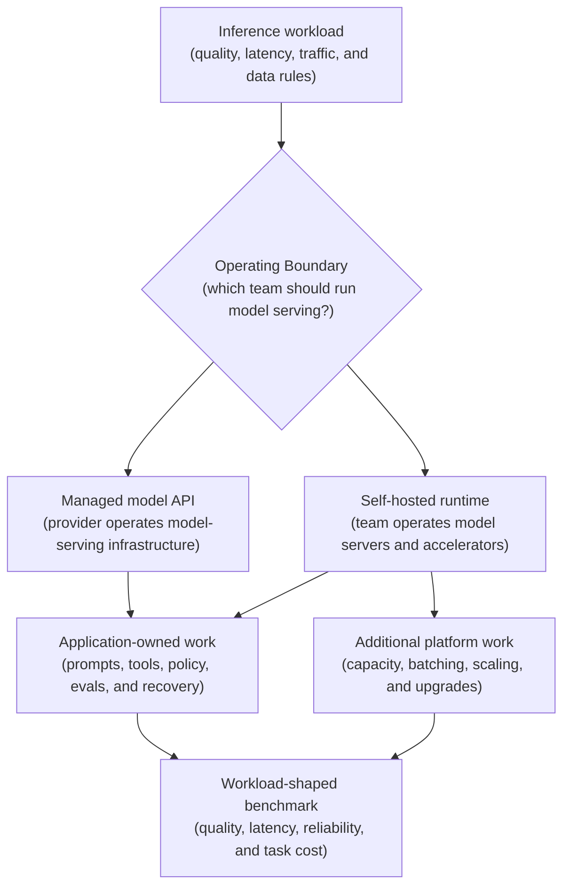
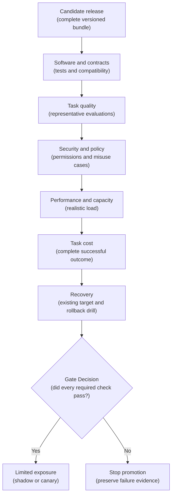
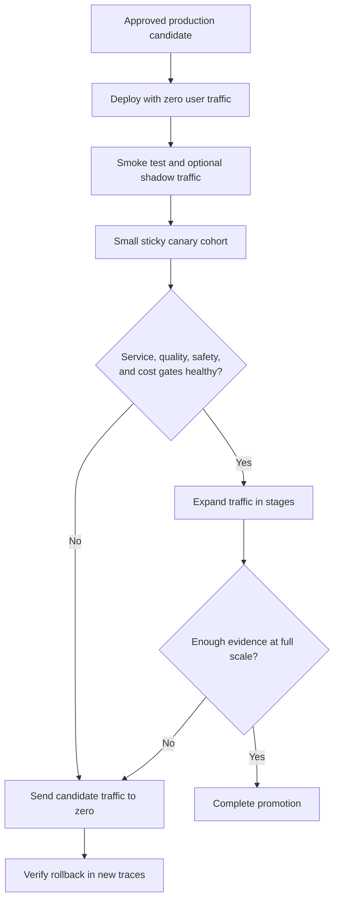
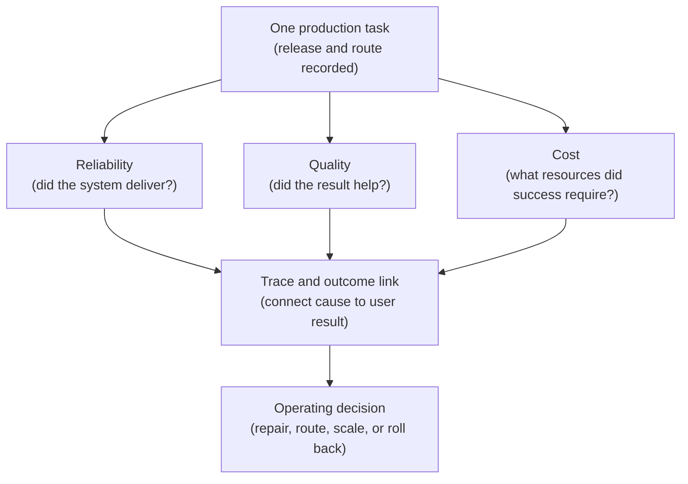

## Table of Contents

1. [What Production Deployment Actually Ships](#what-production-deployment-actually-ships)
2. [1. Decide What Must Ship Together](#1-decide-what-must-ship-together)
3. [2. Promote One Release Through Environments](#2-promote-one-release-through-environments)
4. [3. Choose Managed or Self-Hosted Inference](#3-choose-managed-or-self-hosted-inference)
5. [4. Automate Delivery and Infrastructure](#4-automate-delivery-and-infrastructure)
6. [5. Give Every Workload a Controlled Identity](#5-give-every-workload-a-controlled-identity)
7. [6. Use Release Gates to Check the Whole System](#6-use-release-gates-to-check-the-whole-system)
8. [7. Limit Exposure With Shadow and Canary Releases](#7-limit-exposure-with-shadow-and-canary-releases)
9. [8. Keep State and Schemas Compatible](#8-keep-state-and-schemas-compatible)
10. [9. Observe Reliability, Quality, and Cost Together](#9-observe-reliability-quality-and-cost-together)
11. [10. Prepare Recovery Before the Release](#10-prepare-recovery-before-the-release)
12. [A Production Deployment Blueprint](#a-production-deployment-blueprint)
13. [Deploy The Whole LLM System As One Governed Release](#deploy-the-whole-llm-system-as-one-governed-release)
14. [References](#references)

## What Production Deployment Actually Ships

<!-- section-summary: An LLM release includes the application, prompts, model route, retrieval, tools, policies, and telemetry that together produce user-visible behaviour. -->

A model endpoint alone does not ship the prompts, retrieval rules, tools, policies, and application code that users depend on. **Production deployment moves that complete LLM application into real use with controlled versions, reliable infrastructure, measured exposure, and a tested recovery path.**

It helps to begin with the word *complete*. An LLM product contains far more than a model call:

- The **application or agent harness** receives a request, builds context, calls the model, handles retries, and decides which step runs next. A harness is the surrounding software that turns a model into an application.
- The **prompt and configuration** define the instructions, output limits, timeouts, model routes, and feature flags.
- The **model endpoint** may be a managed provider API or a self-hosted inference runtime.
- The **retrieval system** selects documents, database records, or other context for the model.
- The **tools** let the model search, calculate, update a ticket, or call another service.
- The **policy layer** controls permissions, safety checks, approvals, retention, and fallbacks.
- The **telemetry layer** records traces, metrics, logs, feedback, quality signals, and cost.

A model name identifies only the inference target. A prompt version identifies only the instructions. Neither one tells an operator which application code parsed the response, which documents were retrieved, which tool schema the model saw, or which policy allowed an action.

Consider a release that changes a customer-support assistant from read-only answers to ticket updates. The model stays the same. The release still changes the tool definition, user permissions, confirmation screen, audit event, evaluation cases, and incident risk. Calling this “the same model deployment” hides most of the change.

The complete request path looks like this:


```mermaid
flowchart TD
    A["User request"] --> B["Application or agent harness"]
    B --> C["Prompt and runtime configuration"]
    C --> D["Retrieval and context assembly"]
    D --> E["Managed model API or self-hosted runtime"]
    E --> F["Tool and policy decisions"]
    F --> G["Validated response or action"]
    B --> H["Traces, metrics, quality, and cost"]
    D --> H
    E --> H
    F --> H
    G --> H

    class A user
    class B,C,D app
    class E runtime
    class F,G,H control
```

Production deployment owns this path as one operated system. The release process must answer three simple questions:

1. What exact set of components produced this behaviour?
2. What evidence allowed that set to receive user traffic?
3. How can the team restore a known-good set quickly?

These questions define the release lifecycle: assemble a complete candidate, gather evidence, control live exposure, and preserve a known-good recovery path. Each stage creates evidence for the next decision.

## 1. Decide What Must Ship Together

<!-- section-summary: A release contract records the immutable application and configuration versions that together produce one deployed behaviour. -->

The first design decision is the **release unit**: the exact collection of artifacts and configuration that moves through delivery as one candidate.

For a small chat application, the release unit may include one container image, one prompt bundle, one model route, and one evaluation report. An agent platform may also include tool schemas, approval policies, retrieval configuration, workflow graphs, sandbox images, and database migrations.

The practical goal is reproducibility. If an operator opens a failed trace, the release identity should lead back to every component that influenced the run. If a team reruns an evaluation, it should load the same candidate.

A compact release manifest can hold those references:

```yaml
release_id: support-assistant-r42
application:
  image: registry.example.com/assistant@sha256:8ab4...
  harness_config: harness-r18
prompt_bundle: support-prompts-r31
model_route: premium-route-r7
retrieval:
  embedding_model: embedding-route-r3
  index_revision: support-index-r26
tools:
  schema_bundle: support-tools-r12
  policy_bundle: tool-policy-r9
telemetry_schema: assistant-telemetry-r6
eval_report: eval-run-1842
rollback_target: support-assistant-r41
```

The container digest identifies immutable application code and dependencies. The other references identify reviewed records in a prompt registry, configuration store, model gateway, retrieval catalogue, policy store, and evaluation system. The release ID ties them together.

### Immutable and configurable have different meanings

An **immutable artifact** stays byte-for-byte identical after it is built. Container digests and signed configuration bundles are common examples. Immutability gives the team a stable object to test and promote.

**Environment configuration** describes where that artifact runs: endpoint addresses, replica limits, allowed regions, telemetry destinations, and secret references. Staging and production naturally have different values, although both environments should point to the same application digest.

The release manifest should refer to configuration versions, never copy sensitive values into source control. A secret reference such as `provider-api-key/production` belongs in configuration. The key itself belongs in a secret manager.

### Record Exactly Which Model Version Runs

Self-hosted model weights can usually be pinned by a repository revision and file digest. A managed provider may expose a stable snapshot, a named deployment, an inference profile, or a moving alias. The release contract records the most specific identifier the provider supports.

For a moving alias, reproducibility also depends on evidence. Record the provider, requested model identifier, response metadata, evaluation result, and first-seen behaviour. Re-run a small compatibility suite on a schedule and after provider notices. This protects the application even if the managed service changes the implementation behind an alias.

### Store Release Identity In A Queryable Record

Write `release_id` into the service version endpoint, traces, structured logs, deployment records, background jobs, and quality results. A user report can then lead from one request ID to the exact release and its approval evidence.

This contract creates a useful boundary. Teams can change individual components independently during development, then assemble reviewed versions into one candidate for promotion.


*The release ID identifies the complete behavior: every component that shapes the request path, the telemetry that records it, and the known-good set operators can restore.*

## 2. Promote One Release Through Environments

<!-- section-summary: Environment promotion moves the same release candidate through increasingly realistic checks while supplying each environment with its own access and capacity settings. -->

An **environment** is a controlled place where the application runs with a defined identity, configuration, data policy, and level of user exposure. Development supports fast iteration. Staging tests a production-shaped path. Production serves real traffic.

Promotion means moving the same release identity forward after its evidence passes. Rebuilding a fresh container for each environment weakens the process because staging and production may receive different dependency trees. Build once, scan once, sign once, and promote the digest.


```mermaid
flowchart TD
    A["Source, prompts, policies, and IaC"] --> B["Build immutable artifacts"]
    B --> C["Development checks"]
    C --> D["Integration environment"]
    D --> E["Production-shaped staging"]
    E --> F{"Release gates pass?"}
    F -->|"Yes"| G["Production candidate with zero traffic"]
    F -->|"No"| H["Repair and create a new release"]
    G --> I["Controlled live exposure"]
    I --> J["Full promotion or rollback"]
    H --> B

    class A,B source
    class C,D,E stage
    class F,H decision
    class G,I,J prod
```

### Test The Production Request Path In Staging

A staging endpoint is useful only if it tests the same kinds of boundaries as production. The service should authenticate a test identity, retrieve approved test documents, call the selected inference route, execute safe test tools, emit real telemetry, and apply the same policy engine.

The data can stay synthetic or carefully governed. The topology and contracts need to remain realistic.

Suppose staging replaces the production vector database with a small local file. Prompt evaluation may pass, although connection pooling, access filters, metadata schemas, and timeouts remain untested. A better staging setup uses the same database product and index schema with synthetic records. That gives the team evidence about the path it plans to operate.

### Configuration drift needs an explicit check

**Configuration drift** means the live environment differs from its reviewed definition. A manual console edit, an old feature flag, or an untracked model-route change can create drift.

Infrastructure as code and policy checks reduce this risk. The delivery pipeline should compare the desired environment with the live state, show the change, and preserve the applied revision. Runtime checks can then verify that every healthy instance loaded the declared release.

## 3. Choose Managed or Self-Hosted Inference

<!-- section-summary: Managed APIs reduce infrastructure work, while self-hosted inference provides deeper control over model weights, hardware, performance, and data placement. -->

Every LLM application needs an inference service: the system that loads or accesses a model and returns generated tokens. Two broad operating models dominate production systems.

A **managed model API** lets a provider operate the accelerators, model server, scaling, and availability layer. Your team operates the application, prompts, retrieval, tools, policies, evaluation, and provider integration.

A **self-hosted runtime** places model serving inside infrastructure controlled by your organization. Your team now owns model loading, GPU capacity, batching, autoscaling, health checks, upgrades, and serving incidents.


```mermaid
flowchart TD
    Need["Inference workload<br/>(quality, latency, traffic, and data rules)"] --> Choice{"Operating Boundary<br/>(which team should run model serving?)"}
    Choice --> Managed["Managed model API<br/>(provider operates model-serving infrastructure)"]
    Choice --> Hosted["Self-hosted runtime<br/>(team operates model servers and accelerators)"]
    Managed --> App["Application-owned work<br/>(prompts, tools, policy, evals, and recovery)"]
    Hosted --> App
    Hosted --> Platform["Additional platform work<br/>(capacity, batching, scaling, and upgrades)"]
    App --> Benchmark["Workload-shaped benchmark<br/>(quality, latency, reliability, and task cost)"]
    Platform --> Benchmark
```

### Managed APIs are the practical default for many teams

Managed inference usually fits a team that wants fast access to strong models, variable traffic, and minimal GPU operations. It also gives the team provider-supported quotas, regional choices, safety features, and enterprise controls.

The application still needs engineering around the API.

Request handling covers timeouts, rate limits, safe retries, and interrupted streams. The wider design covers provider outages, data controls, and cost attribution. A provider's successful HTTP response also says little about the answer's factual quality.

Imagine a document assistant with uneven demand during business hours. A managed API absorbs the large traffic swing. The team can spend its operational effort on retrieval permissions, answer evaluation, and user experience. A reserved GPU fleet could sit idle for much of the day.

### Self-hosting is a deliberate operational choice

Self-hosted inference makes sense for open-weight models, strict data placement, specialized hardware, custom kernels, predictable high utilization, or latency requirements that justify direct control.

**vLLM** is a serving engine designed for high-throughput language-model inference. It provides continuous batching, memory-efficient key-value cache handling, production metrics, and an OpenAI-compatible server. It is a strong starting point for teams that need to serve supported text-generation models.

**KServe** adds a Kubernetes serving control plane around runtimes such as vLLM. It can manage model resources, routing, autoscaling, caching, and multi-node or multi-GPU serving. This helps a platform team operate many model endpoints consistently.

**NVIDIA Triton Inference Server** serves models across several frameworks and exposes health and performance metrics. It is especially useful for organizations that already run Triton, need mixed model types, or compose preprocessing and inference backends. LLM deployments still need a compatible backend and performance validation.

Choose Kubernetes for an existing platform team, shared GPU scheduling, multiple endpoints, standard policy enforcement, or advanced rollout and scaling. For a single low-volume endpoint, use a managed service or a dedicated virtual machine unless the surrounding platform already depends on Kubernetes.

### Compare The Full Operating Responsibility And Cost

A managed API quote contains serving infrastructure and provider operations. A self-hosted estimate starts with accelerator use and spare replicas for failure. It also includes model loading, engineering support, observability, upgrades, and capacity headroom.

Run a workload-shaped benchmark. Measure time to first token, inter-token latency, throughput, error behaviour, quality, and cost under realistic prompt lengths and concurrency. The cheapest option per generated token may still cost more per successful user task if it produces weaker answers or frequent retries.

## 4. Automate Delivery and Infrastructure

<!-- section-summary: CI/CD turns a reviewed change into a repeatable release, while infrastructure as code defines the environment that receives it. -->

**Continuous integration**, usually shortened to **CI**, checks every proposed change. It builds the application, runs tests and evaluations, scans dependencies and images, validates schemas, and creates a release candidate.

**Continuous delivery**, or **CD**, promotes an approved candidate into an environment and records the result. CD owns deployment, traffic movement, verification, and rollback automation.

**Infrastructure as code**, commonly called **IaC**, describes cloud resources and policies in version-controlled configuration. Terraform is a common choice for networks, identities, secret references, managed endpoints, queues, databases, dashboards, and Kubernetes resources.

These three parts solve different problems:

- CI asks whether the candidate is safe enough to consider.
- IaC asks what environment and access should exist.
- CD asks how the candidate reaches that environment and receives traffic.

### A focused GitHub Actions example

GitHub Actions environments can add required reviewers, branch restrictions, protected secrets, and deployment history. A concurrency group prevents two production changes from racing. OpenID Connect, or **OIDC**, lets the workflow exchange its GitHub identity for a short-lived cloud credential.

```yaml
jobs:
  deploy-production:
    environment: production
    concurrency: production-llm-application
    permissions:
      contents: read
      id-token: write

    steps:
      - uses: actions/checkout@v4

      - name: Obtain short-lived AWS credentials
        uses: aws-actions/configure-aws-credentials@v6
        with:
          role-to-assume: ${{ vars.DEPLOY_ROLE_ARN }}
          aws-region: ${{ vars.AWS_REGION }}

      - name: Apply reviewed infrastructure plan
        run: terraform apply -input=false saved.tfplan

      - name: Deploy candidate with zero traffic
        run: ./deploy release-manifest.yaml --traffic 0

      - name: Verify loaded release and run smoke evals
        run: ./verify-release support-assistant-r42
```

The example highlights the control flow. A production repository should pin third-party actions to reviewed commit hashes, preserve the Terraform plan created from the approved commit, verify artifact signatures, and store deployment evidence.

The `id-token: write` permission allows the job to request an OIDC token. The cloud trust policy still decides which repository, branch, workflow, and environment may assume the deploy role. The workflow receives a short-lived credential for this job instead of storing a permanent cloud key in GitHub.

### Verify Application Behaviour After Deployment

A green infrastructure command proves that the control plane accepted a change. It cannot prove that the application loaded the expected prompt, can reach retrieval, has the correct tool policy, or emits useful traces.

After deployment, send a synthetic request through the production candidate at zero user traffic. Check the version endpoint, retrieval path, model call, output validator, and trace. The result should report the release ID from the manifest.

This small verification catches a common failure: the new container starts successfully while a stale configuration cache keeps the previous prompt active.

## 5. Give Every Workload a Controlled Identity

<!-- section-summary: Human operators, delivery workflows, application services, and user-triggered tools each need a distinct identity with narrowly scoped permissions. -->

An LLM system touches valuable services: model APIs, document stores, databases, queues, ticketing systems, and telemetry backends. Production deployment decides how each caller proves its identity and what that identity may do.

Four identities usually matter:

1. A **human identity** reviews releases or performs an emergency action.
2. A **delivery identity** creates infrastructure and promotes releases.
3. A **runtime identity** lets the deployed application access its approved dependencies.
4. A **user or delegated identity** limits tool actions and retrieval to the person making the request.

Combining these identities creates excessive access. A runtime service rarely needs permission to modify its own infrastructure. A deployment workflow rarely needs access to user document contents.

### Prefer short-lived workload credentials

A **workload identity** represents software, such as a GitHub Actions job, Kubernetes service account, or cloud workload. Federation lets that workload exchange a signed identity token for a short-lived credential.

GitHub Actions OIDC is one example. Kubernetes service accounts connected to cloud identities are another. Several managed model platforms also support service accounts or workload identity federation.

For a provider that requires an API key, store the key in a managed secret service, restrict which runtime identity can read it, rotate it, and keep it away from container images and repository files. The application should load the secret at runtime through the platform's supported integration.

### Limit Tool Permissions To The Current User Action

Suppose an assistant can read an order and issue a refund. The application runtime needs permission to call the order service. The user still needs authority for the specific order and refund amount.

The policy layer should evaluate the signed-in user, tenant, resource, requested action, and approval rule. The tool receives the minimum data required for that action. High-impact operations can require explicit confirmation or human approval.

This design preserves a clear audit trail: the application identity made the service call, the user identity requested it, and the policy version allowed it.

## 6. Use Release Gates to Check the Whole System

<!-- section-summary: Release gates combine software tests, LLM evaluations, security checks, performance evidence, and recovery proof before user exposure. -->

A **release gate** is a rule that the candidate must satisfy before promotion or traffic expansion. LLM applications need familiar software checks plus tests for probabilistic behaviour.

The most useful gate set covers six areas.


```mermaid
flowchart TD
    Candidate["Candidate release<br/>(complete versioned bundle)"] --> Software["Software and contracts<br/>(tests and compatibility)"]
    Software --> Quality["Task quality<br/>(representative evaluations)"]
    Quality --> Security["Security and policy<br/>(permissions and misuse cases)"]
    Security --> Performance["Performance and capacity<br/>(realistic load)"]
    Performance --> Cost["Task cost<br/>(complete successful outcome)"]
    Cost --> Recovery["Recovery<br/>(existing target and rollback drill)"]
    Recovery --> Decision{"Gate Decision<br/>(did every required check pass?)"}
    Decision -->|Yes| Release["Limited exposure<br/>(shadow or canary)"]
    Decision -->|No| Stop["Stop promotion<br/>(preserve failure evidence)"]
```

### Software and contract checks

Unit tests verify deterministic code. Integration tests exercise provider clients, retrieval, tools, queues, and output validators. Contract tests confirm that JSON schemas, events, tool arguments, and database reads remain compatible across versions.

For example, a prompt now asks the model to return `reason_code`, but the API validator still accepts only `reason`. A contract test should fail before deployment. An evaluation that reads only final text may miss the schema break.

### Quality evaluation

A curated evaluation set should represent normal tasks, important edge cases, safety risks, and recent production failures. Compare the candidate with the current release on task-specific measures such as groundedness, citation support, tool success, refusal quality, and expert judgement.

Free-form answers rarely have one perfect string. Teams often combine deterministic checks, reference-based scorers, rubric-based model judges, and human review. Important decisions need scorers calibrated against domain experts.

Imagine a retrieval assistant whose new prompt produces shorter answers. Users prefer the style, and latency improves. The same candidate drops the supporting source on questions with conflicting documents. A citation-support gate catches the regression before the shorter style wins the release decision.

### Security and policy checks

Run prompt-injection cases, permission-boundary tests, sensitive-data checks, tool misuse cases, and dependency or image scans. A tool-enabled candidate needs confirmation and authorization tests for every high-impact action.

### Performance and capacity checks

Use realistic prompt lengths, output sizes, concurrency, streaming, and tool delays. Measure the user-facing journey through time to first token and total latency. Generated-token rate, queue time, error rate, and saturation explain whether the system has enough capacity.

Self-hosted inference also needs GPU-memory and model-loading checks.

### Cost checks

Estimate cost per successful task across model calls, retrieval, tools, and evaluators. A cheaper model route may trigger extra retries or failed tasks. Cost per request alone can reward poor behaviour.

### Recovery checks

Verify that the rollback target still exists, passes a smoke suite, and can receive traffic. Run a rollback drill periodically. Recovery evidence turns the rollback plan into an operated capability.

The gate thresholds should come from product risk and measured baselines. A medical-information assistant and a brainstorming helper need different evidence. Both benefit from rules written before the team sees the candidate's results.

## 7. Limit Exposure With Shadow and Canary Releases

<!-- section-summary: Shadow traffic tests a candidate without showing its output, while canary traffic gives a small user cohort the candidate under explicit stop rules. -->

Staging cannot reproduce every production input, traffic pattern, provider condition, or user behaviour. **Progressive delivery** limits the impact while the team gathers live evidence.

Two techniques are especially useful for LLM applications.

### Shadow traffic observes without affecting the user

A **shadow release** receives a copy of selected production requests. The current release still provides the user-visible answer. The candidate output goes to a controlled evaluation path.

Shadowing helps compare latency, token use, retrieval choices, tool plans, and quality on realistic inputs. Tool execution should stay disabled or run against a safe simulator. Sending copied requests to another provider or region also requires a data-policy review.

Suppose a team wants to test a smaller model for routine support questions. Shadow traffic can show that simple answers retain quality while complex troubleshooting loses important steps. The router can then target the smaller model only for the suitable class of requests.

### Canary traffic exposes a small real cohort

A **canary release** serves a limited share of real users. Assignment should remain stable for a conversation or workflow. Switching release versions halfway through a multi-turn session can mix prompt assumptions, tool schemas, and state formats.

The canary needs explicit stop rules and enough representative traffic. Separate candidate and control views reveal changes in reliability, quality, and safety. Cost and business outcomes need the same release ID so the rollout decision reflects the whole product.


```mermaid
flowchart TD
    A["Approved production candidate"] --> B["Deploy with zero user traffic"]
    B --> C["Smoke test and optional shadow traffic"]
    C --> D["Small sticky canary cohort"]
    D --> E{"Service, quality, safety,<br/>and cost gates healthy?"}
    E -->|"Yes"| F["Expand traffic in stages"]
    E -->|"No"| G["Send candidate traffic to zero"]
    F --> H{"Enough evidence at full scale?"}
    H -->|"Yes"| I["Complete promotion"]
    H -->|"No"| G
    G --> J["Verify rollback in new traces"]

    class A,B candidate
    class C,D observe
    class E,H decision
    class F,G,I,J outcome
```

Argo Rollouts can automate canary steps and metric analysis for Kubernetes applications. KServe supports rollout strategies for suitable serving modes. Managed platforms may offer endpoint traffic splitting. An application-level gateway can also route by tenant, session, or feature flag.

### Roll Back The Component That Caused The Failure

An LLM release has several rollback targets:

- A runtime regression restores the previous container digest.
- A behaviour regression restores the previous prompt or model route.
- A retrieval regression restores the previous index revision.
- A tool risk disables the affected tool or policy bundle.
- A provider incident activates an already-evaluated fallback route.

After the traffic change, query new traces and confirm that the rollback target handles fresh requests. Check background workers and long-running sessions too. A control-plane message saying “updated” is only the start of verification.

## 8. Keep State and Schemas Compatible

<!-- section-summary: Deployments must preserve compatibility across conversations, queued jobs, tool contracts, events, databases, and retrieval indexes. -->

Many LLM applications carry work across several requests. Conversations have history. Agents pause for approval. Queues hold background tasks. Tool calls depend on schemas. Retrieval indexes outlive application processes.

This creates a deployment problem: the old and new release may run at the same time during a canary or rollback.

**Backward compatibility** means the new code can read data produced by the old release. **Forward compatibility** means the old code can safely handle data produced by the new release. Progressive delivery often needs both for a short migration period.

### Use expand-and-contract migrations

An **expand-and-contract migration** changes a shared schema in stages:

1. Add the new field or format while keeping the old one valid.
2. Deploy code that can read both forms.
3. Start writing the new form.
4. Migrate or expire old records.
5. Remove the old path after rollback no longer needs it.

Suppose a tool result changes from:

```json
{"status": "approved"}
```

to:

```json
{"status": "approved", "approval_id": "apr_7f2", "policy_revision": "refund-r9"}
```

The new consumer can treat the added fields as optional during rollout. After all producers and stored jobs use the expanded schema, the team can make them required in a later release.

Changing `status` into an entirely different structure in one step would make mixed-version execution fragile.

### Keep Long-Running Work On Its Starting Release

A queued job should carry the release ID or a compatible workflow version. A worker restart can then load the declared prompt, model route, and tool contract.

For agent workflows that pause for approval, store the graph or state-machine version alongside the checkpoint. The resumed run can continue under the same semantics or pass through an explicit migration.

### Version Retrieval Indexes And Their Data Contracts

An embedding-model change usually requires a new index. Query embeddings and document embeddings must use compatible vector spaces. Build the new index beside the current one, validate coverage and retrieval quality, then switch the release reference.

The old index should remain available through the rollback window. Overwriting it in place removes the safest recovery path.

### Structured outputs need versioned schemas

If downstream software parses model output, record the schema version and validate every response. During a canary, route each response to a consumer that understands its schema. Fallback and repair logic should also emit visible telemetry because a valid-looking repaired response may hide a model regression.


*A reviewed candidate moves through increasingly realistic checks, reaches users through limited exposure, and returns the failed layer to a known-good version when any live gate fails.*

## 9. Observe Reliability, Quality, and Cost Together

<!-- section-summary: Production telemetry connects each request to its release and shows whether the service is reliable, the output is useful, and the task is economically sustainable. -->

An LLM endpoint can return `200 OK` quickly while giving unsupported advice. It can also produce excellent answers so slowly that users leave. Production decisions therefore need three connected views.

Reliability describes whether the system completed the task within its service boundary. Quality describes whether the completed result helped the user. Cost describes the resources consumed to produce that outcome. These views need the same request, release, route, and outcome identities. Separate dashboards with unrelated identifiers cannot explain whether a costly request was also useful or whether a fast release quietly lowered answer quality.


```mermaid
flowchart TD
    Request["One production task<br/>(release and route recorded)"] --> Reliable["Reliability<br/>(did the system deliver?)"]
    Request --> Quality["Quality<br/>(did the result help?)"]
    Request --> Cost["Cost<br/>(what resources did success require?)"]
    Reliable --> Trace["Trace and outcome link<br/>(connect cause to user result)"]
    Quality --> Trace
    Cost --> Trace
    Trace --> Decision["Operating decision<br/>(repair, route, scale, or roll back)"]
```

### Measure Whether The System Can Deliver

Begin with request rate and error ratio. Time to first token, total latency, and stream interruptions describe the user experience. Queue time, retries, and saturation explain pressure inside the service.

Self-hosted runtimes also need GPU utilization, key-value cache pressure, batch size, model-loading time, and out-of-memory failures.

Time to first token describes how quickly a streamed answer starts. Total latency describes how long the complete task takes. Both matter because a fast first token can hide a long tool loop.

### Measure Whether The Result Helps

Quality signals depend on the product. A retrieval assistant may track citation support, groundedness, source coverage, and escalation. A coding agent may track test success and accepted patches. A tool-using workflow may track correct tool selection, authorization, action success, and human correction.

Automated judges can score a sample of production traces, although expert review remains important for high-risk or ambiguous cases. Calibrate judges against human decisions and monitor their own drift and cost.

### Measure The Cost Of Each Useful Outcome

Record input and output tokens, model route, retrieval calls, tool calls, retries, cache hits, and evaluator cost. Then connect those inputs to an outcome such as a resolved support case or completed workflow.

A release that cuts token cost by a third but doubles human escalations may increase total operating cost. Cost per successful task exposes that trade-off.

### Use Traces To Link Reliability, Quality, And Cost

A **trace** represents one end-to-end request. **Spans** are timed steps inside it, such as retrieval, a model call, or a tool execution. OpenTelemetry provides vendor-neutral APIs, SDKs, collectors, and semantic conventions for this telemetry.

Attach bounded operational dimensions such as `release_id`, `environment`, `model_route`, `tool_name`, and `result`. Keep raw prompts, responses, user identifiers, and retrieved content under explicit sampling, redaction, access, and retention policies.

MLflow Tracing can capture LLM and agent steps, integrate with OpenTelemetry, and run sampled production quality evaluation. Prometheus and Grafana remain common for service and infrastructure metrics. Cloud-native monitoring may cover the same jobs in managed environments.

For example, a candidate shows higher total latency. Metrics identify the release and affected route. A trace reveals that retrieval stayed fast, while the agent called the same tool three times after a prompt change. The team can restore the prompt, add a loop-limit evaluation case, and keep the model infrastructure unchanged.

## 10. Prepare Recovery Before the Release

<!-- section-summary: Recovery plans map common failure classes to traffic, configuration, data, and capacity actions that teams can execute and verify quickly. -->

Production recovery starts with a **failure class**: the part of the system that is unhealthy and the user impact it creates. Different failures need different actions.

A container crash may need a runtime rollback. A prompt regression may need a configuration rollback. A provider outage may need a fallback route or controlled load shedding. A corrupted retrieval publication may need the previous index. A tool-policy incident may need immediate tool disablement and an audit review.

### Write recovery as executable steps

A useful runbook includes:

1. The alert and evidence that identify the failure class.
2. The command or control that limits user impact.
3. The known-good release or route.
4. The verification query for new requests.
5. The owner and approval path.
6. The evidence to preserve for investigation.

Suppose a managed model route starts returning rate-limit errors. The runbook can pause low-priority batch work, reduce optional evaluation traffic, switch eligible requests to an approved fallback model, and cap output lengths. New traces should show the fallback route, lower error ratio, and an understood quality and cost profile.

The fallback must already have evaluation evidence. Choosing an untested model during the incident replaces an availability problem with unknown behaviour.

### Recovery also covers data and state

If a release exposed sensitive prompt content to telemetry, traffic rollback alone leaves a data incident. The response should stop capture, restrict access, identify affected traces, follow retention and deletion controls, rotate exposed credentials if applicable, and preserve an audit record.

If a queued workflow used an incompatible schema, inspect in-flight jobs before returning traffic. Some jobs can finish under their pinned release. Others may need cancellation and explicit recreation.

### Practice Recovery From Detection To Verification

A rollback drill should deploy a harmless candidate, create a long-running job, move a small internal cohort, restore the previous release, and verify routing, state, telemetry, and quality.

This exercise often finds issues that a container rollback test misses: an old prompt was deleted, a worker reads the newest configuration by default, a vector index was overwritten, or the dashboard cannot separate candidate traffic.

## A Production Deployment Blueprint

<!-- section-summary: A common production design keeps the application release portable while selecting managed or self-hosted inference according to operational needs. -->

A practical industrial baseline can stay simple because each tool has one clear responsibility. The aim is a release path that a small team can understand first and extend as operational needs grow.

1. Package the application or agent harness in an OCI container.
2. Store prompt, route, tool, policy, retrieval, and telemetry versions in a release manifest.
3. Use GitHub Actions, GitLab CI, or an equivalent delivery system for tests, evaluations, approvals, and promotion.
4. Define infrastructure and identities with Terraform or the cloud platform's supported IaC.
5. Start with a managed model endpoint for most teams.
6. Use vLLM for self-hosted language-model inference; add KServe if a Kubernetes platform genuinely needs shared serving controls. Use Triton where its multi-framework serving model fits the existing platform.
7. Use workload identity and short-lived credentials; keep unavoidable API keys in a managed secret store.
8. Run deterministic tests, quality evals, security checks, performance tests, cost checks, and a recovery check before live traffic.
9. Deploy at zero traffic, verify the loaded release, then use shadow or sticky canary exposure.
10. Send traces through OpenTelemetry and use MLflow or another evaluated platform for LLM-specific trace analysis and quality scoring.
11. Preserve previous prompt, route, image, index, tool, and schema versions through the rollback window.
12. Verify every promotion or rollback from fresh requests and outcomes.

Managed cloud platforms can supply many pieces of this blueprint. Self-hosted platforms assemble more of them from Kubernetes, vLLM, KServe, Triton, Argo Rollouts, Prometheus, Grafana, and OpenTelemetry. The framework stays the same: identify the whole release, gather evidence, limit exposure, observe outcomes, and preserve recovery.

## Deploy The Whole LLM System As One Governed Release

<!-- section-summary: Production deployment operates the complete LLM application as a versioned, testable, observable, and recoverable system. -->

Production deployment is the discipline that turns an LLM application into an operated service. The deployable system includes application code, prompts, model routes, retrieval, tools, policies, state contracts, and telemetry.

The strongest production path gives that system one release identity and promotes immutable artifacts through realistic environments. The team selects managed or self-hosted inference from operational needs, automates infrastructure and delivery, and gives workloads narrow identities.

Release gates establish evidence before traffic. Shadow and canary releases limit exposure. Versioned schemas and state protect mixed releases. Traces connect reliability, quality, and cost. Tested runbooks restore the affected layer and confirm recovery through fresh requests.

The result is a service whose behaviour can be explained, compared, released gradually, and recovered deliberately.


*Managed and self-hosted inference move the model-serving boundary, but both require the same complete release identity, gates, controlled exposure, observability, and recovery discipline.*

## References

- [OpenAI: Production best practices](https://developers.openai.com/api/docs/guides/production-best-practices)
- [OpenAI: Data controls](https://developers.openai.com/api/docs/guides/your-data)
- [GitHub Actions: Deploying with environments and protection rules](https://docs.github.com/en/actions/how-tos/deploy/configure-and-manage-deployments/control-deployments)
- [GitHub Actions: OpenID Connect](https://docs.github.com/en/actions/concepts/security/openid-connect)
- [Terraform: Running Terraform in automation](https://developer.hashicorp.com/terraform/tutorials/automation/automate-terraform)
- [vLLM: OpenAI-compatible server](https://docs.vllm.ai/en/latest/serving/openai_compatible_server/)
- [KServe: Generative inference runtime](https://kserve.github.io/website/docs/model-serving/generative-inference/overview)
- [NVIDIA Triton Inference Server](https://docs.nvidia.com/deeplearning/triton-inference-server/user-guide/docs/)
- [Kubernetes: Deployments](https://kubernetes.io/docs/concepts/workloads/controllers/deployment/)
- [Argo Rollouts: Canary deployment](https://argoproj.github.io/argo-rollouts/features/canary/)
- [OpenTelemetry: Semantic conventions](https://opentelemetry.io/docs/concepts/semantic-conventions/)
- [MLflow: Production tracing and monitoring](https://mlflow.org/docs/latest/genai/tracing/prod-tracing/)
