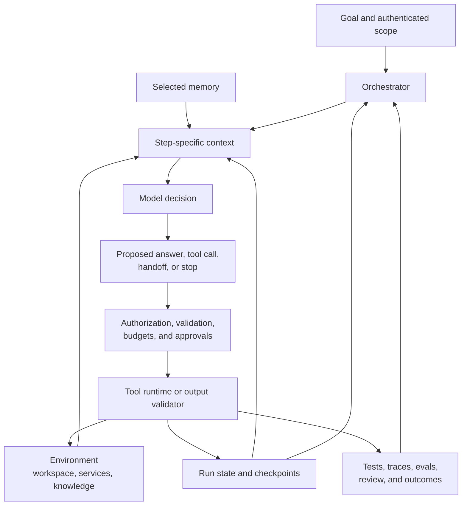
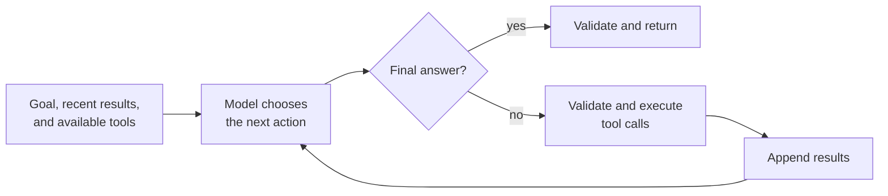
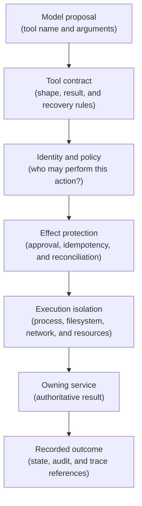
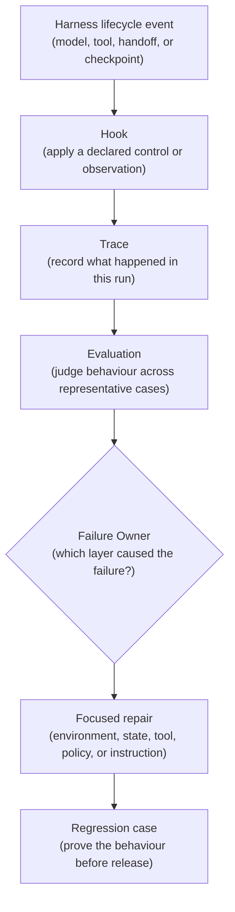
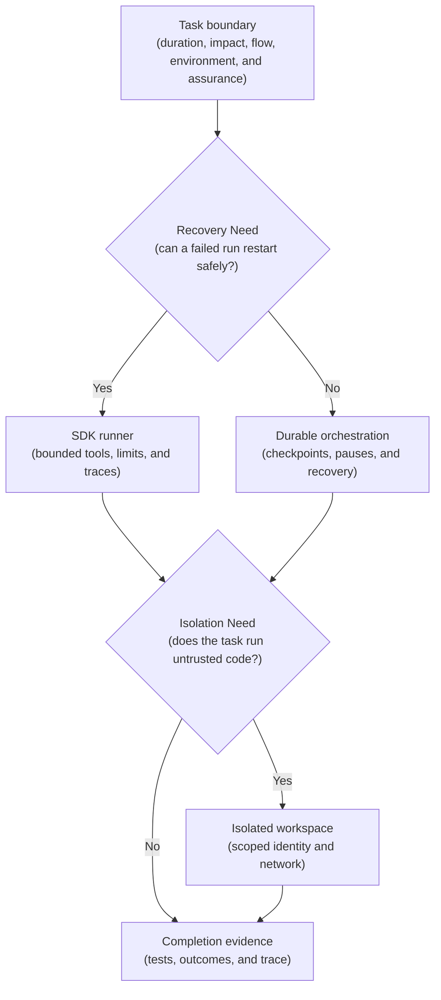

## Table of Contents

1. [What An Agent Harness Does](#what-an-agent-harness-does)
2. [Understand The Parts Before Choosing Products](#understand-the-parts-before-choosing-products)
3. [Why A Simple Agent Loop Stops Being Enough](#why-a-simple-agent-loop-stops-being-enough)
4. [Give The Agent A Controlled Environment To Inspect](#give-the-agent-a-controlled-environment-to-inspect)
5. [Build Context For The Current Step](#build-context-for-the-current-step)
6. [How The Orchestrator Controls The Run](#how-the-orchestrator-controls-the-run)
7. [Separate Run State From Long-Term Memory](#separate-run-state-from-long-term-memory)
8. [Control What The Agent Can Do](#control-what-the-agent-can-do)
9. [Use Hooks, Traces, And Evals To Detect And Improve Failures](#use-hooks-traces-and-evals-to-detect-and-improve-failures)
10. [Choose A Simple Harness That Can Recover](#choose-a-simple-harness-that-can-recover)
11. [References](#references)

## What An Agent Harness Does
<!-- section-summary: An agent harness supplies the system responsibilities that let a model inspect an environment, propose actions, preserve progress, and produce verifiable results. -->

A model can propose a plan, yet it cannot safely manage a workspace, credentials, tools, retries, and recovery by itself. **An agent harness is the engineered system around the model that supplies those operating capabilities.** The model contributes language understanding and flexible judgement; the harness supplies information, state, permissions, control flow, and evidence needed to turn that judgement into a real outcome.

Consider a small coding task. A model receives a bug report saying that an order total is sometimes wrong. Producing a plausible patch is only one part of the job. The agent first needs the correct source revision and a runtime that can execute the application. It needs architecture guidance and focused ways to search and edit the repository. It also needs a test that reproduces the bug and a record of the checks that passed. If the process stops halfway through, another worker may need to continue from the same files and plan.

The model cannot create those conditions through reasoning alone. Installing dependencies and granting a scoped identity change the execution environment. Isolating an untrusted shell command requires a security boundary. Persisting a checkpoint requires durable storage. Proving that a browser interaction now works requires observable evidence. These are software and platform responsibilities.

The same distinction appears outside software development. A support agent may judge that a refund request deserves investigation. The harness establishes the authenticated customer, retrieves the correct order, limits the available actions, checks the refund policy, records any approval, executes the payment operation once, and verifies the committed result. The model helps interpret the situation; application services remain responsible for identity and money.

This division explains why harness engineering matters even with a strong model. Better reasoning can improve the proposed plan. It cannot repair an invisible environment, a stale policy source, an overpowered credential, or a missing recovery path.


*The model interprets the request and proposes a next step. The harness establishes identity, controls authority and execution, and records the authoritative service result.*

## Understand The Parts Before Choosing Products
<!-- section-summary: The harness framework separates environment, context, orchestration, state, tools, authority, controls, and evidence so each responsibility has a clear owner. -->

The word *harness* can sound like another name for an agent software development kit, usually shortened to **SDK**. Its scope is wider. An SDK may implement the model-and-tool loop. The complete harness can also rely on application services and databases. A workflow runtime may preserve progress, a sandbox may isolate execution, an identity system may limit authority, and an observability stack may record evidence.

Eight responsibilities form a useful framework:

1. **Environment** provides the workspace, services, data, runtime, and people the task can reach.
2. **Context** selects the instructions, task facts, evidence, recent results, and tool descriptions shown to the model for one step.
3. **Orchestration** decides which step runs, which transitions are legal, and how the run pauses, resumes, or finishes.
4. **State** records current progress, completed effects, pending approvals, budgets, and other facts needed to continue this run.
5. **Memory** retains selected information that may help a later turn or a future run.
6. **Tools** expose narrow operations through which the agent reads or changes the environment.
7. **Authority and controls** enforce identity, permissions, approval, isolation, validation, timeouts, and resource limits.
8. **Evidence and feedback** report what happened through tool results, tests, traces, evaluations, reviews, and real outcomes.

These responsibilities interact during every meaningful run:


```mermaid
flowchart TB
    G["Goal and authenticated scope"] --> O["Orchestrator"]
    E["Environment<br/>workspace, services, knowledge"] --> C["Step-specific context"]
    S["Run state and checkpoints"] --> C
    M["Selected memory"] --> C
    O --> C
    C --> D["Model decision"]
    D --> P["Proposed answer, tool call,<br/>handoff, or stop"]
    P --> A["Authorization, validation,<br/>budgets, and approvals"]
    A --> T["Tool runtime or output validator"]
    T --> E
    T --> S
    S --> O
    T --> F["Tests, traces, evals,<br/>review, and outcomes"]
    F --> O

    class E,M world
    class O,C,S control
    class D,P model
    class A,T,F safety
```

The path starts from an authenticated goal. Raw prompt text cannot establish identity or authority. The orchestrator assembles a view for one decision, and the model returns a proposal. Controls decide whether that proposal can continue. A tool then interacts with the environment. State preserves the result, and feedback informs the next step.

Each responsibility needs an authoritative owner. The identity service decides who the caller is. The order service decides whether a refund committed. The checkpoint store decides which step can resume. The model can reason with projections of those facts, yet its transcript should never replace their source systems.

OpenAI's harness-engineering case study shows the same framework in a coding environment. Repository knowledge, isolated worktrees, tests, browser access, logs, metrics, traces, architecture rules, and maintenance tasks all affected what the coding agent could understand and verify. The model was one component inside a deliberately prepared engineering system.

## Why A Simple Agent Loop Stops Being Enough
<!-- section-summary: A direct model-tool loop suits short restartable work, while durable or high-impact tasks require explicit state, recovery, authority, and effect handling. -->

The smallest useful agent loop lets a model investigate instead of answering from its first impression. The model can inspect the information already in its messages, choose a tool, read the result, and use that new evidence to choose the next action. This is enough for tasks such as searching a small document set, checking a service through read-only tools, or editing code inside a disposable workspace.

The loop usually keeps progress in the current process and in the growing message history. That boundary matters. If the process disappears, the in-memory position disappears with it unless the application has stored it elsewhere. Message history can describe earlier actions, yet it does not prove that an external write committed. It also cannot preserve a pending approval as a governed object or prevent two workers from taking the same step.

The diagram below follows one pass through this loop. A goal and recent tool results enter the model. The model either returns a final answer or requests another tool. An approved tool result is appended to the messages, which gives the next model call more evidence. The cycle stops after a validated answer or an explicit limit.


```mermaid
flowchart LR
    A["Goal, recent results,<br/>and available tools"] --> B["Model chooses<br/>the next action"]
    B --> C{"Final answer?"}
    C -->|yes| D["Validate and return"]
    C -->|no| E["Validate and execute<br/>tool calls"]
    E --> F["Append results"]
    F --> B
```

This pattern already supports genuine agency because the next action can depend on evidence discovered during the run. It is a sensible choice for a short research task, a read-only diagnostic assistant, or a coding task that can restart from a clean workspace without losing important work. The OpenAI Agents SDK `Runner` implements this general loop for model calls, tool calls, handoffs, and final output, with a turn limit and tracing around the run.

Problems appear after the task crosses a boundary that a message history cannot control.

### Why Long Runs Need Durable State

A process can hold a two-minute task in memory. A run that waits several hours for approval needs a durable checkpoint and a stable run identity. The original worker may disappear while another worker, queue consumer, or scheduled process receives the event that continues the work.

The checkpoint must say which step is active, which proposal is awaiting review, which deadline applies, and which workflow version understands the stored state. Replaying a conversation from the first message is a poor substitute because the model may choose a different path and the earlier process state may already be gone.

### Why Tool Actions Need Reliable Execution

Read operations can often tolerate a retry. Writes require more care. Suppose a payment service commits a refund and its response is lost. The loop sees a timeout, although the real-world effect may already exist. A second call with a fresh operation identity could create another refund.

The harness needs an **idempotency key**, which identifies one intended effect across retries. Recovery queries the payment service with that key and classifies the outcome as committed, absent, or still unknown. The transcript can record this process, while the payment service remains authoritative for the transaction.

### Why Branches And Handoffs Need Explicit State

Parallel tools, human review, callbacks, cancellations, and subagents can all update a run. The system needs permitted transitions and concurrency rules. An approval for proposal `p1` should never authorize a later proposal `p2`. A cancellation should block new writes even if an older worker is still processing a previous model response.

### Why Permissions Need Enforcement Outside The Model

Instructions can tell a model that a refund above a threshold requires review. The execution path still needs a policy check based on trusted identity, current state, amount, and approval. A model proposal and a policy decision are different kinds of output.

These boundaries explain why a normal loop eventually needs an orchestrator. The model can keep making flexible decisions inside selected steps. Software carries the lifecycle, authority, recovery, and final definition of completion.

## Give The Agent A Controlled Environment To Inspect
<!-- section-summary: The environment provides a reproducible execution surface, discoverable knowledge, and feedback that lets the agent see the consequences of its actions. -->

The **environment** is the world available to the run. It may contain files, databases, browsers, queues, and test systems. It can also expose application programming interfaces, usually called **APIs**, that let software interact with other services. Availability alone is insufficient. The agent must be able to understand the environment and observe useful results from its work.

A coding agent illustrates the difference. A repository checkout gives the agent files. A usable engineering environment also provides:

- an exact source revision and dependency lock;
- a setup command that creates the expected runtime;
- a short repository guide that points to current architecture and product rules;
- focused search, edit, shell, and browser capabilities;
- tests, logs, screenshots, metrics, and traces that reveal behavior;
- an artifact path for the patch and verification evidence.

OpenAI describes this property as **agent legibility**. Important knowledge and application behavior must exist in a form the agent can inspect. A UI bug remains difficult to solve if the agent cannot start the application or see the page. A latency target remains abstract if the environment exposes no timing data.

Legibility and reproducibility work together. Reproducibility gives each run a known starting point. Legibility lets the agent navigate and verify that starting point. A task that fails before the model receives any input should be classified as an environment failure if the requested revision cannot be fetched or the declared test command is missing.

The environment also defines the ceiling on autonomy. Giving a coding agent permission to edit a repository adds little value if it cannot run the relevant tests. Giving it deployment credentials before it can inspect rollout health increases impact without increasing evidence.

Most teams should start with a managed or familiar execution path. An ephemeral continuous integration runner, often called a **CI runner**, works well for short repository tasks. A provider-managed container suits isolated jobs without a large platform team. An existing application worker can be enough for low-risk API work. Kubernetes and custom sandbox platforms become reasonable once scale or isolation needs justify the extra platform work.

## Build Context For The Current Step
<!-- section-summary: Context assembly selects the instructions, trusted facts, evidence, state, memory, and tool descriptions needed for one model decision. -->

An environment can contain millions of records and files. One model step needs a much smaller working view. **Context** is that temporary selection.

Imagine an agent investigating a failed deployment. The environment contains the complete repository, every release, weeks of logs, and many operational tools. The next model call needs a smaller view. It may receive the current task and failed release ID first. A focused deployment diff and three relevant error records provide the evidence. The rollback runbook and read-only diagnostic tools define what the agent can investigate next.

The harness assembles that view from sources with different authority:

- **Instructions** define the task, behavioral rules, and output contract.
- **Trusted runtime facts** carry authenticated identity, customer or organisation scope, run ID, lifecycle state, and remaining budgets.
- **Run state** records completed steps, open questions, and references to artifacts.
- **Retrieved evidence** supplies relevant code, documents, records, and observations with source identity.
- **Memory** contributes selected past information under a separate retention policy.
- **Tool definitions** describe the operations available for this step.
- **Recent feedback** reports tool results, tests, approvals, and errors.

These inputs should remain distinguishable. Retrieved text can contain hostile instructions. A log line can be wrong or incomplete. A model-generated summary can omit an important detail. The harness labels provenance and trust, keeps authentication outside model-supplied arguments, and prevents untrusted evidence from gaining instruction authority.

Context also has a budget. Sending every tool and every document increases cost and can crowd out the evidence that matters. Progressive disclosure offers a better path: give the model a compact map, then let it retrieve focused details as the task advances. OpenAI's case study reports that a large monolithic instruction file created exactly this pressure; a short repository guide that linked to deeper sources preserved more room for task-specific work.

The context projection should be reproducible enough for investigation. A trace can record the instruction bundle, state checkpoint, retrieved source IDs and versions, selected tools, compaction policy, and token counts. Sensitive source content can remain in its governed system rather than being copied into general telemetry.

## How The Orchestrator Controls The Run
<!-- section-summary: The orchestrator turns model decisions into a managed lifecycle through explicit steps, transitions, persistence, limits, interruption, and completion rules. -->

The **orchestrator** coordinates the harness during a run. It selects the next step, assembles that step's context, invokes the model or deterministic code, validates the result, dispatches approved tools, persists state, and decides what follows.

The central design decision is ownership. Some choices belong to deterministic code because they have an exact answer. Some benefit from model judgement because the evidence is ambiguous. Some require a person because the action carries legal, financial, or operational authority.

For example, a model can summarize why a deployment failed and propose a rollback. Code verifies that the proposed version exists, the target environment matches the incident, and the release policy allows automated rollback. A person may approve the action for a high-impact service. The deployment platform performs the change and reports the resulting version. The orchestrator connects these owners through explicit transitions.

A compact run contract makes this boundary visible:

```yaml
workflow: investigate-release
objective: explain the failure and produce a cited recovery proposal
model_may:
  - inspect approved logs and traces
  - compare the candidate with the previous release
  - propose rollback or forward repair
model_may_not:
  - deploy
  - change traffic
limits:
  model_steps: 8
  tool_calls: 20
  wall_time: 15m
completion:
  required:
    - evidence-backed diagnosis
    - validated recovery target
    - verification plan
```

The contract gives the model room to investigate while keeping deployment authority outside the model step. It also defines completion as system evidence. A fluent answer cannot finish the workflow if the recovery target is invalid or the required evidence is missing.

The orchestration implementation should match the failure model. A short application function or SDK runner is enough for restartable work. Ordinary application code plus a database can express a bounded state machine.

LangGraph fits an agent-centered flow whose branches and cycles need to be visible. Its graph state records the working facts, while checkpoints preserve that state between steps. Interrupts support a governed pause before the graph continues.

A durable workflow engine such as Temporal solves a broader process problem. It records workflow history and can restore progress after a worker failure. This is useful for long-running work that already coordinates service calls, timers, and external signals across a business system.

The framework supplies primitives. The application still defines the business states and the authority of each tool. It also owns retry policy and the evidence required for completion. Introducing a graph does not make an external write idempotent. Adding a checkpoint does not decide whether an old approval remains valid.

## Separate Run State From Long-Term Memory
<!-- section-summary: State preserves the facts needed to continue the current run, while memory retains selected information for later turns or future runs. -->

**State** answers, “What is true about this run now?” The active step and completed tool effects show how far the run has progressed. A pending approval or artifact reference connects that progress to an external object. Retry counts, deadlines, and remaining budgets tell the orchestrator whether another step is allowed. State needs durable storage if the run must survive a pause or worker failure.

**Memory** answers, “Which information should a later interaction receive?” A user's approved preference, a project convention, or a compact summary of an earlier investigation may qualify. Memory requires a write policy because one wrong or sensitive record can influence many future runs.

Conversation history belongs beside these concepts, yet it serves another purpose. History records exchanges. It can help resolve a reference such as “use the earlier report.” It should not decide whether a deployment committed or a payment completed.

Consider a travel agent that requested a booking before its worker crashed. The transcript contains the request and tool call. Run state records the stable booking operation ID and the fact that the outcome needs reconciliation. The airline system holds the committed reservation. Long-term memory may contain the traveler's seating preference. Each store answers a different question.


*The transcript, durable run state, airline system, and long-term memory hold different kinds of truth. Recovery starts by asking the store that owns each fact.*

Good checkpoints keep durable facts compact and refer to large artifacts by ID. During resumption, the orchestrator first loads the latest checkpoint. It reconciles any external effect whose result is uncertain. It then verifies that the current workflow version can interpret the saved state before choosing a permitted transition.

A memory record needs a source and a clear reason to exist. Its policy should define who can read it and how long it remains useful. People also need a way to correct or delete it. Persisting every transcript or model summary creates a noisy data store and can turn an earlier mistake into future context. A deliberate memory policy selects only information that has clear value beyond the current run.

## Control What The Agent Can Do
<!-- section-summary: Tools express model-facing capabilities, while trusted identity, policy, isolation, and effect controls decide what a run can actually do. -->

A **tool** is a structured capability that the model can request. Its description and input schema help the model form a valid proposal. Its implementation is ordinary application code that treats the proposal as untrusted input.

Suppose a tool exposes `read_order(order_id)`. The model can choose the tool and provide an order reference. The runtime derives the authenticated customer and organisation scope from trusted session context. It checks access before calling the service that owns the order. The runtime removes fields outside the task and returns a structured result. The model never receives the service credential.

Write tools need a deeper contract. The contract first says whether the effect can be reversed and which approval permits it. An idempotency key gives repeated attempts one stable operation identity. The timeout and retry policy must match the behavior of the owning service. If a response is lost, the result should say that the outcome is uncertain and requires reconciliation.

A single `failed` result is too vague for recovery. Invalid input needs correction. Permission denial needs a different identity or approval. Rate limiting may allow a delayed retry, while an unavailable dependency may require escalation. A lost response after a write needs an outcome check before any retry.

Permissions limit external authority. A **sandbox** limits the code and processes running inside the workspace. These controls solve different problems. A tightly sandboxed process with an administrator token can still damage an external service. A narrowly scoped token does not stop untrusted code from attacking the host if execution isolation is weak.

For a low-risk read-only assistant, a normal application process with scoped API clients may be enough. Shell access and repository execution raise the threat level because both model-generated commands and checked-out code are untrusted.

An ephemeral container gives each run a disposable filesystem and process boundary. Running as a non-root user reduces the damage available inside that container. Network access should be disabled or restricted to approved destinations, and short-lived credentials should expose only the required services. Resource limits stop one run from consuming all available compute. Hostile or multi-tenant workloads justify stronger isolation such as gVisor or a lightweight virtual machine.

The current OpenAI Agents SDK offers hosted container shell execution and a Sandbox Agents API for persistent workspaces. The Sandbox Agents API is currently beta, so teams should evaluate its lifecycle and compatibility before making it a foundational platform dependency.

Organizations that operate their own multi-tenant execution layer commonly run each task as a Kubernetes Job. Restricted Pod security limits container privileges. Network policy restricts reachable destinations, while workload identity supplies short-lived cloud access. Kubernetes `RuntimeClass` can select a sandboxed runtime such as gVisor for the pod. This path gives more control and also creates a platform that must be patched, observed, and tested continuously.

The principle stays the same across implementations: the model sees a useful capability; the runtime enforces its real boundary.


```mermaid
flowchart TD
    Proposal["Model proposal<br/>(tool name and arguments)"] --> Contract["Tool contract<br/>(shape, result, and recovery rules)"]
    Contract --> Authority["Identity and policy<br/>(who may perform this action?)"]
    Authority --> Effect["Effect protection<br/>(approval, idempotency, and reconciliation)"]
    Effect --> Isolation["Execution isolation<br/>(process, filesystem, network, and resources)"]
    Isolation --> Service["Owning service<br/>(authoritative result)"]
    Service --> Evidence["Recorded outcome<br/>(state, audit, and trace references)"]
```

## Use Hooks, Traces, And Evals To Detect And Improve Failures
<!-- section-summary: Hooks attach cross-cutting controls to lifecycle events, traces explain one run, and evaluations judge whether the harness produced acceptable behavior. -->

An agent needs feedback during the task, and the engineering team needs evidence after it. These needs connect, although they use different mechanisms.

**Hooks** are callbacks around lifecycle events. A hook can run before or after a model call, a tool call, or a handoff. This gives tracing and usage accounting one consistent attachment point. Policy checks can run before protected work, while redaction and cleanup can run around the resulting data. The OpenAI Agents SDK exposes these hooks at both run and agent level.

A hook should have an explicit failure policy. Authorization must finish before a protected tool executes and should fail closed if the policy service is unavailable. Telemetry may use a bounded buffer or local audit fallback if the exporter is temporarily unavailable. Cleanup should be safe to repeat. Hooks should observe or enforce declared boundaries rather than quietly inventing new workflow transitions.

**Traces** explain one run as connected operations. In OpenTelemetry terms, a trace represents one logical operation. It contains **spans**, which are timed records for individual parts of that operation. A harness might create one span for context assembly and another for a model call. Tool execution, checkpoint writes, approvals, and verification can add their own spans under the same run identity.

Trace attributes should help an operator compare runs without exposing their contents. Component versions and tool names show which path executed. Status categories and state transitions explain the result. Latency, token use, and cost support performance analysis. Approved record references can link to governed evidence.

Raw prompts and complete customer documents deserve stronger access and retention controls. Credentials and unrestricted shell output should stay out of general telemetry.

**Evaluations**, usually called **evals**, judge behavior across cases. One group of checks measures whether the task finished with the required evidence. Another checks tool choice, approval use, and forbidden actions. Operational checks can measure duplicate effects, recovery, latency, and cost.

Failure-injection cases reveal whether the harness handles broken conditions. A test can crash the worker after a write or expire an approval before execution. Other cases can deliver the same callback twice, hide a required source, or exhaust the run budget. The expected result may be a pause, a request for help, an abstention, or an escalation.

The three mechanisms answer different questions:

- hooks apply consistent behavior at known events;
- traces reconstruct what happened in one run;
- evals decide whether that behavior is acceptable across a release.


```mermaid
flowchart TD
    Event["Harness lifecycle event<br/>(model, tool, handoff, or checkpoint)"] --> Hook["Hook<br/>(apply a declared control or observation)"]
    Hook --> Trace["Trace<br/>(record what happened in this run)"]
    Trace --> Eval["Evaluation<br/>(judge behaviour across representative cases)"]
    Eval --> Finding{"Failure Owner<br/>(which layer caused the failure?)"}
    Finding --> Repair["Focused repair<br/>(environment, state, tool, policy, or instruction)"]
    Repair --> Regression["Regression case<br/>(prove the behaviour before release)"]
```

Production failures should improve the harness layer that caused them. Missing evidence may require environment or retrieval work. Repeated effects point to state and tool semantics. An invisible UI state points to better environment feedback. An unsafe authorized call points to policy and permission design. Another prompt paragraph is useful only if the failure truly came from instructions.

## Choose A Simple Harness That Can Recover
<!-- section-summary: Harness scope follows task duration, impact, control-flow complexity, environment needs, and the evidence required for recovery. -->

Harness design is a selection problem. Too little structure leaves the team unable to explain or recover a failed run. Too much structure turns a short, low-risk task into an expensive workflow platform. The best harness is the smallest system that can perform the task and recover from the failures the product has agreed to accept.

Consider a public-information assistant that only reads approved sources. An SDK runner can coordinate its read-only tools, and a turn limit can stop an unproductive loop. Traces provide enough evidence to investigate poor answers. Durable workflow state would add little because the request can safely restart.

A repository agent has a different failure surface. It needs a reproducible workspace and focused instructions before editing begins. Test tools and preserved artifacts let a reviewer inspect the result. Sandbox controls limit the effect of commands executed from an untrusted repository.

A claims agent may wait for documents and later trigger payment. Losing its position could strand an approval, while retrying an uncertain write could pay twice. Durable state preserves its place in the process. Explicit transitions connect each approval to one proposal. Idempotent execution and reconciliation protect the payment effect. An audit path records the evidence behind the decision. Choosing the simpler harness here would create a recovery gap, not merely a missing convenience.

Five dimensions guide the choice:

| Dimension | Low-complexity signal | Reason to add harness depth |
|---|---|---|
| Duration | finishes inside one request | waits, resumes, or outlives a worker |
| Impact | read-only or easily reversible | changes money, data, traffic, or customer state |
| Control flow | short linear loop | branches, cycles, parallel work, or human interruption |
| Environment | one API or small document set | repositories, shells, browsers, services, and runtime evidence |
| Assurance | answer can be reviewed afterward | completion requires tests, approval, trace evidence, or recovery proof |


```mermaid
flowchart TD
    Task["Task boundary<br/>(duration, impact, flow, environment, and assurance)"] --> Short{"Recovery Need<br/>(can a failed run restart safely?)"}
    Short -->|Yes| Runner["SDK runner<br/>(bounded tools, limits, and traces)"]
    Short -->|No| Resume["Durable orchestration<br/>(checkpoints, pauses, and recovery)"]
    Runner --> Execute{"Isolation Need<br/>(does the task run untrusted code?)"}
    Resume --> Execute
    Execute -->|Yes| Sandbox["Isolated workspace<br/>(scoped identity and network)"]
    Execute -->|No| Verify["Completion evidence<br/>(tests, outcomes, and trace)"]
    Sandbox --> Verify
```

Before adding a framework, name the responsibility it will absorb. LangGraph can make graph transitions explicit and persist graph state through checkpoints. Its interrupts support a governed pause inside an agent-centered flow. Temporal can retain cross-service workflow history and restore long-running work after worker failure. Its timers and signals support events that arrive later. A managed container can absorb part of workspace provisioning and isolation. OpenTelemetry can standardize how traces are created and exported.

The same test works in reverse during an incident. First identify which harness responsibility failed. Then repair that boundary and prove recovery. Mature harness engineering gives every important fact an owner. It does the same for actions and state transitions. The model remains responsible for decisions that benefit from model judgement, while the surrounding system carries authority and evidence.


*Harness depth follows the failures the system must recover from. Every production design still needs bounded tools, trusted authority, durable evidence, and a verified completion condition.*

## References

- [OpenAI: Harness engineering](https://openai.com/index/harness-engineering/)
- [OpenAI Agents SDK: Running agents](https://openai.github.io/openai-agents-python/running_agents/)
- [OpenAI Agents SDK: Tools](https://openai.github.io/openai-agents-python/tools/)
- [OpenAI Agents SDK: Human-in-the-loop](https://openai.github.io/openai-agents-python/human_in_the_loop/)
- [OpenAI Agents SDK: Sandbox Agents](https://openai.github.io/openai-agents-python/sandbox_agents/)
- [LangGraph overview](https://docs.langchain.com/oss/python/langgraph/overview)
- [LangGraph persistence](https://docs.langchain.com/oss/python/langgraph/persistence)
- [LangGraph interrupts](https://docs.langchain.com/oss/python/langgraph/interrupts)
- [Temporal Workflow Execution](https://docs.temporal.io/workflow-execution)
- [Temporal Activities](https://docs.temporal.io/activities)
- [Kubernetes RuntimeClass](https://kubernetes.io/docs/concepts/containers/runtime-class/)
- [Kubernetes Pod Security Standards](https://kubernetes.io/docs/concepts/security/pod-security-standards/)
- [gVisor security introduction](https://gvisor.dev/docs/architecture_guide/intro/)
- [OpenTelemetry tracing specification](https://opentelemetry.io/docs/specs/otel/overview/#tracing-signal)
- [Anthropic: Building effective agents](https://www.anthropic.com/engineering/building-effective-agents)
