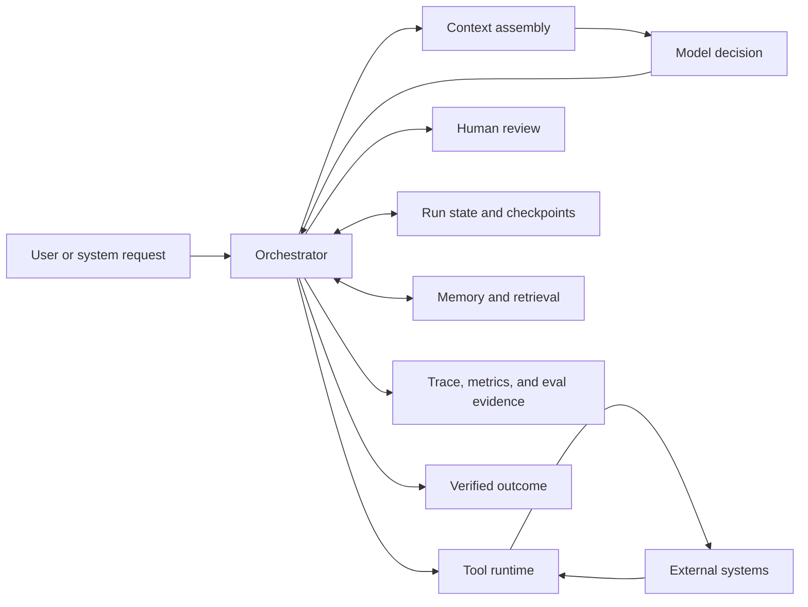
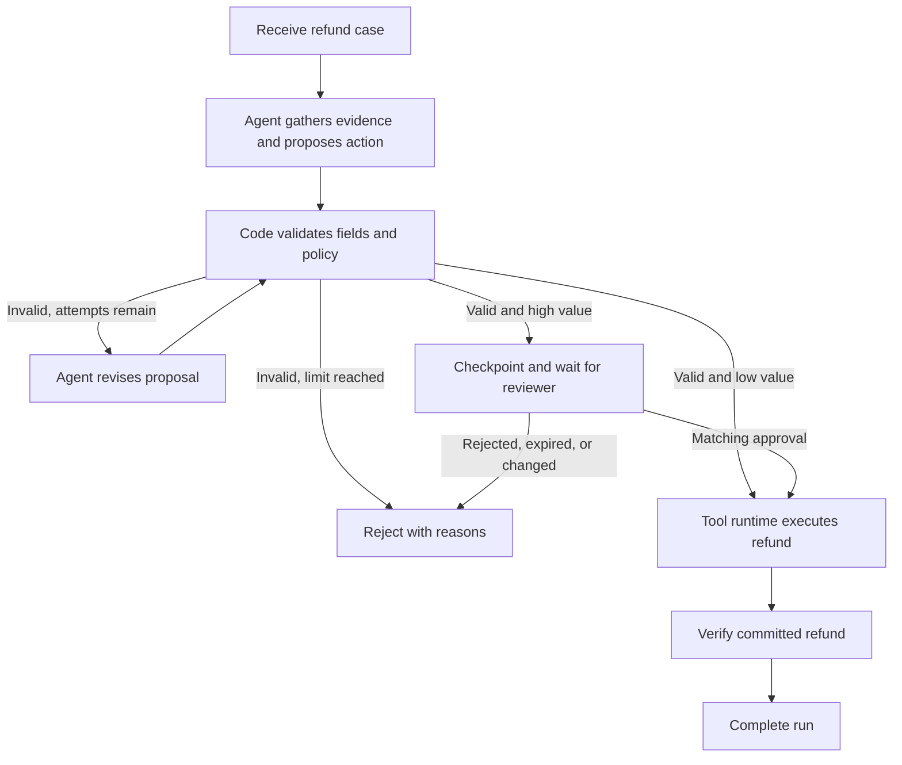
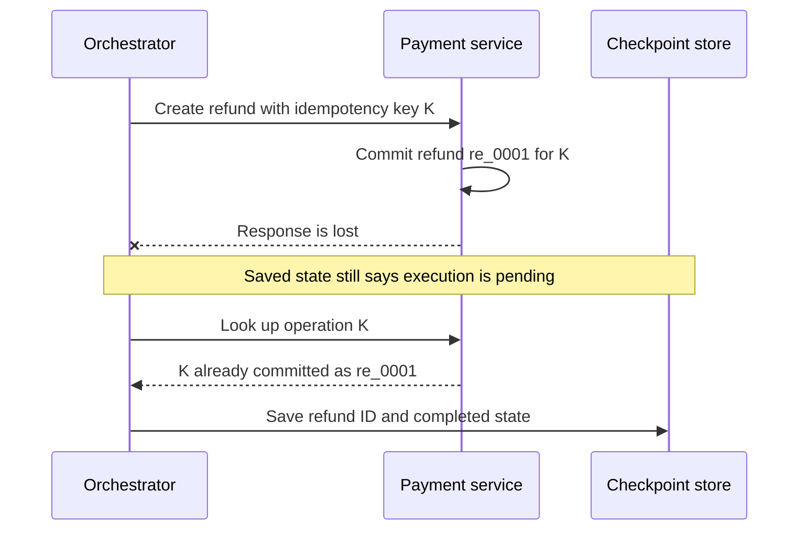

## Where Orchestration Fits in an Agent Harness
<!-- section-summary: Orchestration coordinates the model, context, memory, tools, policy, persistence, and feedback systems that make up an agent harness. -->

An **agent harness** is the engineered system around a language model. The model can interpret a request and choose an action, while the harness supplies the environment in which that choice can lead to reliable work. It assembles context, exposes tools, stores state, applies permissions, records evidence, and gives the agent feedback about what happened.

**Orchestration** is the control layer inside that harness. It decides which component runs next, which state crosses from one step to another, when a tool may execute, when a person must review an action, and when the run has actually finished. A model response is one event in that lifecycle. The orchestrator turns a sequence of events into a managed run.



The arrows matter more than the boxes. Context flows into a model call, and the model returns a proposed action. The orchestrator evaluates that proposal against the current state and policy. A tool runtime then performs approved work against an external system. Checkpoints preserve progress, while traces preserve an explanation of the path. Memory can inform a decision, yet it never replaces the operational state that says which effects already happened.

This broader view also explains why harness engineering involves more than wrapping a model in a loop. OpenAI's account of building with Codex describes the engineering work as designing environments, supplying tools and abstractions, organizing accessible context, and building feedback loops that let agents validate their own work. Orchestration connects those capabilities during a run. An excellent model inside a poorly specified environment still lacks the state and feedback required for dependable execution.

## Why a Normal Agent Loop Eventually Runs Out of Answers
<!-- section-summary: A basic model-tool loop works for short, restartable tasks, while durable work needs explicit answers for recovery, side effects, approvals, and concurrent paths. -->

The smallest useful agent runner has a simple rhythm. It sends context to the model, receives either a final answer or a tool request, executes the requested tool, appends the result, and repeats. Libraries and agent SDKs provide this loop because it covers a large and valuable class of tasks.

That design fits a short research assistant, a support-answer helper, or a coding task that can restart safely. One process can hold the state, tool calls mainly read information, and a turn limit can stop a broken loop. Adding a graph or workflow engine to this shape would introduce extra concepts without solving an actual reliability problem.

The limits appear when the task crosses a durable boundary. Consider an agent that investigates a disputed order and may issue a refund. During a single run, several events can occur:

- the process can restart after the model proposes a refund;
- a reviewer can take several hours to approve the proposal;
- the payment service can commit the refund while its response gets lost;
- two branches can inspect the order and shipping evidence at the same time;
- a user can cancel while a tool is already running;
- a newer proposal can invalidate an earlier approval.

Conversation messages contain useful evidence, though they cannot settle these operational questions on their own. A sentence saying "the refund was sent" cannot prove what the payment service committed. A tool result stored only in process memory disappears with that process. A reviewer response needs to refer to one exact proposal, and a retry needs to preserve the identity of one intended external effect.

The orchestrator therefore owns six connected responsibilities:

| Responsibility | Question it answers | Failure when it stays implicit |
|---|---|---|
| **Control flow** | Which step may run next? | Hidden branches and accidental transitions |
| **Run state** | What facts determine the next step? | Decisions based on stale conversation text |
| **Effect control** | Which external action may execute? | Unauthorized or duplicate writes |
| **Durability** | Where can another worker continue? | Full restarts and lost approvals |
| **Limits and interruption** | When must the run pause or stop? | Unbounded loops, cost, and resource use |
| **Observability** | How can a team reconstruct the run? | Failures that cannot be debugged or evaluated |

These responsibilities provide the framework for the rest of the article. A framework such as LangGraph supplies primitives for some of them. A durable workflow engine supplies a different set of primitives. Application code still defines the business states, permissions, completion conditions, and recovery rules.

## Control Flow: Put Each Decision in the Right Place
<!-- section-summary: Deterministic rules, model judgement, tool execution, and human authority belong to different parts of the control flow. -->

An agent run usually mixes four kinds of decisions. **Deterministic code** handles rules with an exact answer, such as schema validation, retry limits, and refund thresholds. The **model** handles judgement under uncertainty, such as interpreting a customer's explanation or choosing which source to inspect. The **tool runtime** controls execution against databases and services. A **person** supplies authority or judgement for actions whose risk exceeds the automated policy.

This separation is a reliability boundary. If the refund limit is £250, application code can compare the proposed amount with that limit every time. Asking the model to remember and apply the rule creates variation where the product needs consistency. The model still provides value by interpreting the request and drafting a reason supported by evidence.

A useful production design often has a fixed outer workflow and a bounded agent loop inside it. The outer workflow owns authentication, mandatory evidence, approval, publication, and final verification. The inner loop explores approved sources until it has enough evidence or reaches a limit. The system gains adaptable reasoning while retaining an inspectable business path.



The graph gives each transition an owner. The model proposes and revises. Code validates. A reviewer authorizes one high-value proposal. The payment service owns the committed transaction. The orchestrator coordinates these decisions and refuses paths that the application never declared.

## Run State: Record Facts That Control Execution
<!-- section-summary: Structured run state records operational facts, while context and memory provide selected information for reasoning. -->

Three terms often get mixed together: **state**, **context**, and **memory**. Run state contains the operational facts that control execution. Context is the information assembled for one model call. Memory stores information that may help later runs or later turns. They can share data, yet they serve different purposes.

For the refund run, state may contain the case ID, current step, proposal hash, validation result, approval ID, effect status, attempt count, deadline, and component versions. The orchestrator reads these fields to choose a transition. The model may receive the customer's request, the evidence summary, and the latest validation errors as context. A preference such as the customer's communication language may live in longer-term memory.

| Data | Best home | Reason |
|---|---|---|
| Current proposal hash | Run state | Approval and execution must refer to the same proposal |
| Validation errors | Run state and next-turn context | Code routes on them; the model needs them for revision |
| Complete raw tool output | Evidence store with a reference in state | Large content should not inflate every checkpoint |
| Customer language preference | Long-term memory | It can help across separate cases |
| Policy version | Run state and trace | The team must know which rules governed the decision |
| Full chat history | Conversation store; selected parts in context | Every model call needs only the relevant portion |

Structured state makes completion precise. A conversational answer can finish when the model returns text. The refund run finishes after the proposal passes validation, the required approval matches its hash, the payment service confirms the effect, and the final identifiers have been checkpointed. The orchestrator can test those conditions without asking the model whether it thinks the task is done.

State should remain compact and typed. Large documents, images, and logs belong in dedicated stores, referenced by stable IDs and integrity hashes. Sensitive fields need access control and retention rules because checkpoints can outlive the worker that created them.

## Graph Runtimes Make Important Transitions Visible
<!-- section-summary: A graph runtime helps when branches, cycles, interruption, and resumable state carry business meaning and deserve direct inspection. -->

A **state graph** represents a run as nodes connected by permitted transitions. A node performs one bounded step and returns a state update. An edge identifies the next permitted node, while a conditional edge selects among destinations from the saved state.

Ordinary code can express the same logic. A graph runtime earns its cost when the transitions themselves need to be inspected, resumed, visualized, and tested. The refund flow has a revision cycle, a policy branch, a long human pause, two terminal outcomes, and an external effect that requires recovery. Hiding those paths across callbacks and status fields would make reviews and incident analysis harder.

LangGraph is a current low-level orchestration runtime for long-running, stateful agents. Its core capabilities include persistence, durable execution, human interruption, streaming, and state inspection. It leaves prompts, application architecture, graph state, and transition policy to the developer. Higher-level agent frameworks or SDK runners remain a better fit when an application mainly needs a standard model-tool loop.

The following example shows the graph shape without implementing the model client, payment adapter, identity system, or database. Those dependencies deserve their own production components; including them here would hide the orchestration idea under setup code.

```python
from langgraph.graph import END, START, StateGraph
from langgraph.types import Command, interrupt

builder = StateGraph(RefundState)

builder.add_node("propose", propose_refund)
builder.add_node("validate", validate_with_policy)
builder.add_node("execute", execute_with_idempotency_key)
builder.add_node("reject", record_rejection)

def review(state: RefundState):
    decision = interrupt({
        "case_id": state["case_id"],
        "proposal_hash": state["proposal_hash"],
    })
    return Command(
        goto="execute" if decision["approved"] else "reject"
    )

builder.add_node("review", review)
builder.add_edge(START, "propose")
builder.add_edge("propose", "validate")
builder.add_conditional_edges("validate", route_from_policy)
builder.add_edge("execute", END)
builder.add_edge("reject", END)

graph = builder.compile(checkpointer=production_checkpointer)
```

The important idea sits in the boundaries. `validate_with_policy` returns structured state that `route_from_policy` can inspect. The `review` node pauses with a case ID and proposal hash, so the later decision can be matched to the same artifact. The checkpointer stores graph progress under a stable thread ID. The execution node still checks its authorization invariant and uses an idempotency key because arriving through an approved edge cannot guarantee the external service's transaction semantics.

In a real service, the resume input should carry a trusted approval record ID rather than accepting reviewer identity or roles from the browser or model. Server-side authentication resolves the reviewer. A database transaction verifies the case, proposal hash, role, expiry, decision, and one-time-use marker before the graph continues.

## Checkpoints: Let Another Worker Continue the Run
<!-- section-summary: A checkpoint preserves committed progress at a transition so the run can resume after a pause, restart, or infrastructure failure. -->

A **checkpoint** is a durable snapshot of run state at a meaningful transition. The worker that created it can disappear, and a later worker can load the same run and continue. This separates the lifecycle of the task from the lifecycle of one process.

LangGraph checkpointers persist thread-scoped graph state. Stores serve a different purpose: they hold application-defined information that can cross threads, such as user preferences or shared knowledge. Production systems need a persistent checkpointer rather than an in-memory implementation, along with retention, encryption, access, and migration policies for the stored state.

A checkpoint also defines a replay boundary. Operations before the checkpoint may run again when a node resumes or retries. Read-only calls can usually tolerate bounded replay. External writes require an explicit recovery contract because the remote system may have committed an effect before the orchestrator saved its result.



The **idempotency key** identifies one intended effect. Reusing key `K` tells the payment service that a retry refers to the same refund. The service stores that key with the transaction and returns the earlier result when it sees the key again. Keeping the key only in graph state would provide no protection at the payment boundary.

The lookup step handles an **ambiguous outcome**. A network timeout tells the caller that the response did not arrive; it says nothing certain about the remote commit. The orchestrator enters a reconciliation path, queries the operation by key, and classifies it as committed, absent, or still unknown. It escalates after a reviewed deadline rather than guessing.

This distinction is central to durable execution. A **retry** repeats one operation under an error policy. A **resume** loads a saved run and continues from a checkpoint. **Reconciliation** resolves uncertainty about an external effect. A production trace should name each event clearly because they imply different risks.

## Tool Execution: Treat Model Output as a Proposal
<!-- section-summary: The tool runtime validates and authorizes model-proposed calls, controls resources, executes the dependency, and preserves failure meaning. -->

When a model emits a tool call, it proposes a name and arguments. The tool runtime decides whether that proposal can execute. It resolves the registered tool, parses the arguments, derives identity from trusted request context, checks permission, applies time and concurrency limits, and converts the result into a structured event for the orchestrator.

This boundary prevents the model from granting itself authority. A model can request `issue_refund(order_id, amount, reason)`. The authenticated service supplies the principal and permissions. Application policy supplies the approval threshold. The payment adapter supplies the idempotency and reconciliation behavior.

Tool failures also need machine-readable meaning. A plain exception string forces the model to guess whether another attempt is safe. The runtime can instead classify outcomes and map them to deterministic transitions:

| Outcome | Meaning | Orchestrator response |
|---|---|---|
| `invalid_arguments` | No external call started | Return field errors for a bounded correction |
| `permission_denied` | Trusted identity lacks authority | Stop the path and record the denial |
| `rate_limited` | Dependency asks the caller to wait | Schedule delayed retry within the deadline |
| `dependency_unavailable` | Read or safe operation failed temporarily | Retry or use an approved fallback |
| `outcome_unknown` | A side effect may have committed | Reconcile by operation identity |
| `succeeded` | Dependency confirmed the result | Checkpoint the effect identifier |

Concurrency belongs in this layer as well. Two independent searches can run together, while two writes to the same order may need serialization. The model may suggest parallel calls, and the runtime still applies the dependency's concurrency budget and the application's conflict rules.

The domain service remains the final authority for its own invariants. The orchestrator coordinates a refund, while the payment service owns transaction integrity and account rules. Duplicating those rules inside the harness would create two sources of truth that can drift apart.

## Human Review Is a Durable Transition
<!-- section-summary: A review step persists the proposed artifact, releases the worker, and resumes only for an authorized decision that matches that artifact. -->

A human review can last minutes or days, so it should appear as an explicit waiting state. The orchestrator saves the proposal, supporting evidence, proposal hash, requested reviewer role, expiry, and current policy version. It then releases the worker. No process needs to remain blocked while a person decides.

The approval record binds the reviewer to one case and one proposal hash. If the agent changes the amount or evidence, the new hash invalidates the earlier decision. When the reviewer responds, server-side code authenticates the person, verifies the required role, consumes the decision once, and resumes the same run from its checkpoint.

LangGraph interrupts implement this pause-and-resume pattern. The runtime saves graph state through its persistence layer and resumes under the same thread ID when it receives a `Command(resume=...)`. Its documentation also warns that a resumed node starts again from the beginning of that node. Side effects placed before the interrupt therefore need idempotency, or they should move into a separate node after the review.

Approval is only one use for interruption. The same pattern can request missing data, let an operator edit a generated action, or pause after a security signal. In every case, the resume event should come from an authenticated application boundary and match the saved run state.

## Cancellation, Budgets, and Deadlines Shape the Run
<!-- section-summary: Limits and cancellation create explicit states that stop new work while preserving an honest record of effects already committed. -->

Agent loops can consume tokens, time, tool capacity, and money. The orchestrator applies turn, token, cost, wall-clock, and per-tool limits according to the product's risk. It records which limit ended the run so operators can distinguish a planned budget stop from an infrastructure failure.

Cancellation needs durable state. A `cancel_requested` flag prevents a fresh worker from resuming work after an earlier worker received the request. The running worker passes cancellation signals to tools that support them and checks the durable flag before every new side effect.

An already committed external effect still exists after cancellation. The orchestrator records that fact, stops later steps, and begins compensation only when the domain supports a reviewed compensating action. A refund may require a separate reversal process; deleting the trace or marking the whole run "cancelled with no effects" would hide reality.

Deadlines also interact with approval and reconciliation. A review request can expire, and an uncertain payment can reach an escalation deadline. Those outcomes deserve named states such as `approval_expired` or `reconciliation_required` because each state has a different owner and response.

## Observability Explains the Path, While Evals Judge the Behaviour
<!-- section-summary: Traces reconstruct one run, metrics reveal operational patterns, and evaluations compare behaviour with expected outcomes. -->

A model-call log shows prompts and responses. An orchestration trace connects those calls to state transitions, tools, checkpoints, retries, approval waits, policy versions, costs, and final external effects. This lets an engineer answer which branch ran, which proposal a reviewer approved, and whether a retry reused the original operation identity.

**Metrics** aggregate many runs. Completion rate, tool-error rate, reconciliation age, approval wait, latency, and cost per successful task reveal operational health. **Evaluations**, often shortened to **evals**, compare agent behaviour with expected cases. They can judge source quality, tool selection, policy compliance, trajectory, and final outcome.

These three views work together. A failed eval identifies a behaviour regression. The trace explains the exact path for one case. Metrics show whether the same pattern affects production traffic. Shared run, tool, prompt, policy, and effect identifiers make those joins possible.

Sensitive content needs selective capture. A trace can record hashes, categories, sizes, timings, and references without copying every customer document. The observability design should follow the same access, retention, and deletion policies as the operational system.

## Choosing the Smallest Runtime That Fits the Failure Model
<!-- section-summary: Runtime choice follows the transitions, pauses, side effects, and recovery guarantees the application actually needs. -->

Start with the simplest control layer that can survive the failures your product accepts. An application function or agent SDK runner suits short tasks that can restart safely. Add a database-backed run record when state must cross requests. Use a graph runtime when cycles, conditional paths, subgraphs, state inspection, or human interrupts form a central part of the application.

A general durable workflow engine such as Temporal, Restate, DBOS, or Dapr Workflow can coordinate an agent inside a larger business process. These systems are especially relevant when the organization already uses them for long-running services and wants one recovery model across agent and conventional workloads. LangGraph is more focused on agent-specific state and control flow. Some systems combine both layers.

The selection question is practical: **which failure must the runtime recover from, and which transition must the team inspect directly?** A three-turn research assistant may need only a bounded runner and trace. A refund agent with approval, an ambiguous payment outcome, and a two-day wait needs durable state, explicit transitions, and reconciliation.

Whichever runtime you choose, verify the same properties. A new worker can load the run. An approval matches the executed artifact. A repeated side effect preserves one operation identity. Invalid transitions fail closed. Cancellation prevents new work. The trace connects the final outcome to the state and versions that produced it.

## How the Pieces Work Together
<!-- section-summary: Reliable orchestration comes from explicit ownership of decisions, state, effects, recovery, interruption, and evidence. -->

The big picture now has a clear path. Context gives the model the information needed for one decision. The model proposes an action. The orchestrator reads structured state and chooses a permitted transition. The tool runtime validates and authorizes any external call. Checkpoints preserve progress, and reconciliation resolves uncertain effects. Human review supplies durable authority at selected boundaries. Traces, metrics, and evals connect the path to the outcome.

This structure explains why a normal loop remains valuable and why some applications need more. The extra machinery should correspond to a real lifecycle problem: a meaningful branch, a long pause, a costly side effect, a recovery requirement, or a transition that carries business authority. Once those problems appear, explicit orchestration gives the team a system it can inspect, test, resume, and operate.

## References

- [OpenAI: Harness engineering—leveraging Codex in an agent-first world](https://openai.com/index/harness-engineering/)
- [OpenAI Agents SDK: Agent orchestration](https://openai.github.io/openai-agents-python/multi_agent/)
- [OpenAI Agents SDK: Running agents](https://openai.github.io/openai-agents-python/running_agents/)
- [LangGraph overview](https://docs.langchain.com/oss/python/langgraph/overview)
- [LangGraph persistence](https://docs.langchain.com/oss/python/langgraph/persistence)
- [LangGraph interrupts](https://docs.langchain.com/oss/python/langgraph/interrupts)
- [Temporal: Durable execution](https://docs.temporal.io/temporal)
- [OpenTelemetry: Traces](https://opentelemetry.io/docs/concepts/signals/traces/)
