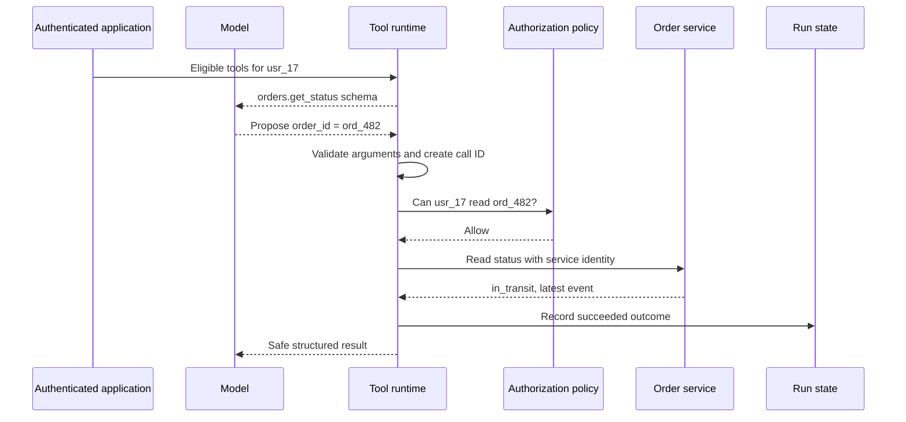
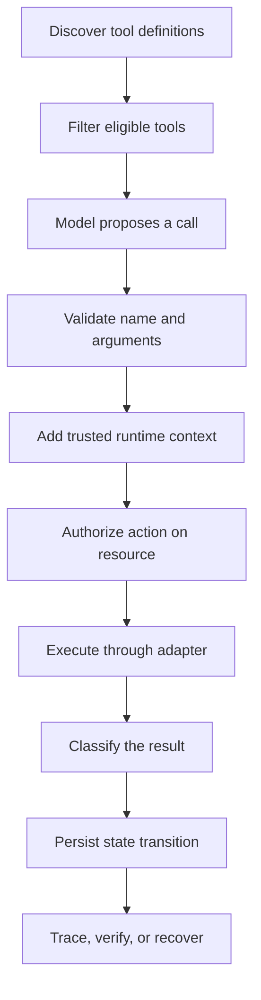
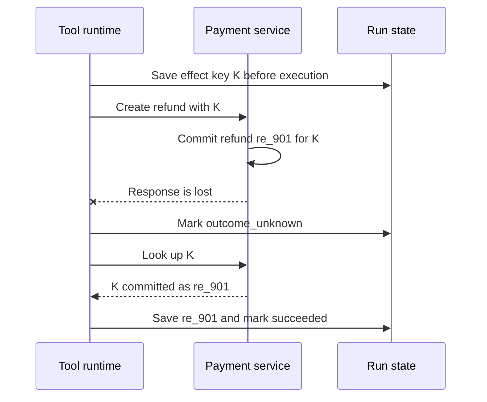
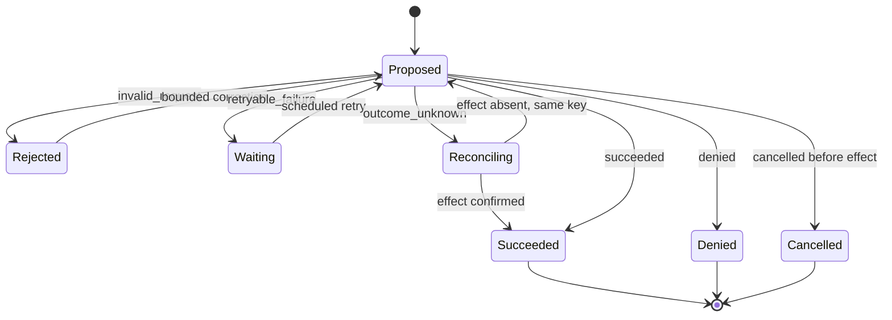

## Table of Contents

1. [Why Tool Calls Need An Execution Runtime](#why-tool-calls-need-an-execution-runtime)
2. [Follow One Complete Tool Call](#follow-one-complete-tool-call)
3. [The Ten Jobs Of A Tool Runtime](#the-ten-jobs-of-a-tool-runtime)
4. [Choose Which Tools The Model Can See And Use](#choose-which-tools-the-model-can-see-and-use)
5. [Validate Arguments And Add Trusted Context](#validate-arguments-and-add-trusted-context)
6. [Authorize The Tool Call And Translate It For The Service](#authorize-the-tool-call-and-translate-it-for-the-service)
7. [Handle Timeouts, Retries, And Duplicate Writes](#handle-timeouts-retries-and-duplicate-writes)
8. [Use The Tool Result To Choose The Next Run State](#use-the-tool-result-to-choose-the-next-run-state)
9. [Trace Tool Calls And Recover From Failure](#trace-tool-calls-and-recover-from-failure)
10. [Choose A Production Runtime Design](#choose-a-production-runtime-design)
11. [References](#references)

## Why Tool Calls Need An Execution Runtime
<!-- section-summary: A tool runtime turns a model proposal into a controlled operation by supplying trusted identity, policy, execution rules, and a durable result. -->

At a high level, **a tool runtime is the application layer that decides whether a model-requested action may run, performs the approved operation, and reports exactly what happened**. The model sees a useful capability such as “look up an order.” The runtime connects that capability to the real order service under the correct identity and policy.

Suppose a user asks, “Where is my order?” The model can recognise that an order-status tool would help. It can also extract an order number from the conversation. Those are useful language tasks. The model still cannot prove which account is signed in, decide whether that account owns the order, or establish that the order service returned a genuine record.

The runtime supplies those missing guarantees. It reads the authenticated user from the application session. It checks whether the order belongs to that user. It calls the order service with a workload credential that the model never sees. It then returns a small, structured result such as `in_transit` with the time of the latest shipping event.

This boundary matters for read-only tools. Write tools raise the stakes because they can change money or customer state. A description may guide the model toward the right action. Application code must still enforce the real rules.

The surrounding orchestrator still owns the run. It asks the model for a decision and consumes the tool outcome. The tool runtime owns the narrower execution contract between those two moments.

## Follow One Complete Tool Call
<!-- section-summary: One complete call moves through eligibility, proposal, validation, trusted context, authorization, execution, result handling, and state update. -->

Before dividing the runtime into components, it helps to watch one small call from start to finish. A tool definition shows what the model may request, although it does not show where identity, authorization, or service evidence comes from. The complete path makes those owners visible before their technical names appear.

A signed-in user with identity `usr_17` asks for order `ord_482`. The application decides that this session may use the read-only `orders.get_status` tool. The model sees the tool name, its purpose, and an argument schema containing `order_id`. It proposes `{"order_id": "ord_482"}`.

The runtime validates the proposal against the schema. It adds a unique call ID and reads `usr_17` from trusted session context. An authorization check confirms that `usr_17` may view `ord_482`. The order adapter then calls the owning service with a service credential and returns a restricted view:

```json
{
  "order_id": "ord_482",
  "status": "in_transit",
  "latest_event_at": "2026-07-29T14:20:00Z"
}
```

The runtime records a successful outcome and updates run state with the call ID. The model receives the safe result and can explain it to the user. If the authorization check fails, the order service is never called. If the dependency times out, the runtime reports a typed failure instead of inventing an order status.

The sequence diagram shows these ownership boundaries. The authenticated application supplies identity, the model supplies a proposal, policy supplies authorization, and the order service supplies the domain fact.


```mermaid
sequenceDiagram
    participant App as Authenticated application
    participant Model
    participant Runtime as Tool runtime
    participant Policy as Authorization policy
    participant Orders as Order service
    participant State as Run state

    App->>Runtime: Eligible tools for usr_17
    Runtime-->>Model: orders.get_status schema
    Model-->>Runtime: Propose order_id = ord_482
    Runtime->>Runtime: Validate arguments and create call ID
    Runtime->>Policy: Can usr_17 read ord_482?
    Policy-->>Runtime: Allow
    Runtime->>Orders: Read status with service identity
    Orders-->>Runtime: in_transit, latest event
    Runtime->>State: Record succeeded outcome
    Runtime-->>Model: Safe structured result
```

A real runtime may distribute these steps across several services. Their order still matters. Eligibility limits the model's choices before generation, while authorization makes the final decision immediately before execution.

## The Ten Jobs Of A Tool Runtime
<!-- section-summary: Ten connected responsibilities carry a proposed tool call from discovery to a recoverable state transition. -->

The complete runtime can be understood as ten responsibilities. Each one answers a different production question, and each produces an input needed by the next step. Skipping one creates a specific gap: the model may see the wrong tool, the service may receive an unsafe request, or the run may lose the meaning of a failure.

1. **Discovery** finds tool definitions from application code, a registry, or a remote tool server.
2. **Eligibility** selects the tools that this user, environment, and run state may consider.
3. **Proposal validation** checks that the chosen name and arguments follow the declared contract.
4. **Trusted context** supplies identity, run information, approved dependencies, and internal limits from outside model input.
5. **Authorization** decides whether this principal may perform this action on this resource now.
6. **Execution adapters** translate the tool contract into the owning service's application programming interface, usually shortened to **API**.
7. **Effect control** applies timeouts and concurrency limits. It also defines safe retry and idempotency behavior.
8. **Result semantics** preserve whether the call succeeded, failed safely, was denied, or may have changed an external system.
9. **State transitions** decide whether the run continues, pauses, retries, reconciles, or stops.
10. **Observability and recovery** preserve enough evidence to explain the call and repair an uncertain outcome.

These responsibilities form one path:


```mermaid
flowchart TD
    A["Discover tool definitions"] --> B["Filter eligible tools"]
    B --> C["Model proposes a call"]
    C --> D["Validate name and arguments"]
    D --> E["Add trusted runtime context"]
    E --> F["Authorize action on resource"]
    F --> G["Execute through adapter"]
    G --> H["Classify the result"]
    H --> I["Persist state transition"]
    I --> J["Trace, verify, or recover"]

    class A,B,C choice
    class D,E,F control
    class G,H effect
    class I,J evidence
```

The model participates at the proposal step. Software owns every gate around it. This separation lets a team change models without moving identity or payment policy into a prompt. It also lets the same adapter serve a deterministic workflow, a human-facing application, and an agent.

## Choose Which Tools The Model Can See And Use
<!-- section-summary: Discovery finds possible tools, while eligibility exposes only the subset relevant and permitted for the current step. -->

A small agent can receive three tool definitions in every model call. A production platform may connect to hundreds of operations across customer support, billing, data, and engineering systems. Sending the complete catalogue wastes context and gives the model many irrelevant choices.

### Discover Available Tools

**Discovery** answers, “Which tools exist?” Local function registration is the simplest implementation. The Model Context Protocol, known as **MCP**, gives clients a standard way to discover remote tools through `tools/list` and invoke one through `tools/call`. Each definition includes a name, description, and JSON Schema for its arguments. JSON Schema is a machine-readable description of the fields and value shapes a request may contain.

Discovery only finds candidates.

### Create A Per-Step Tool Allowlist

**Eligibility** decides which candidates belong in the current model step. A support agent investigating an order may receive read-only order and shipping tools. A refund tool can remain hidden until evidence has been collected and the workflow reaches a proposal state. A development environment should never expose a production deployment action simply because a registry contains it.

Eligibility should use trusted facts. Useful inputs include the authenticated role, the current workflow state, the deployment environment, and feature-release policy. The resulting allowlist can then be passed to the model.

Current OpenAI Agents SDK tooling supports conditional tool enabling. It also supports namespaces and deferred loading for larger tool surfaces. Namespaces provide a compact description such as `billing` or `shipping`, and deferred loading retrieves detailed tool definitions only after the model selects the relevant area.

Current MCP `tools/list` results include cache hints. `ttlMs` says how long the client may treat the list as fresh, while `cacheScope` says whether a cached result may cross authorization contexts. A client that needs immediate change notifications opens a `subscriptions/listen` stream with `toolsListChanged` enabled. A matching notification then invalidates the cached list.

Hiding a tool improves relevance and reduces accidental selection. It does not grant security. A stale client, crafted request, or compromised model path may still name a hidden tool. The execution path must repeat the eligibility check and perform authorization before any external call.

Tool definitions also need version and ownership metadata in the registry even if the model does not see all of it. The runtime should know which team owns the adapter, which schema revision it expects, and whether the operation is read-only or effectful. MCP tool annotations can describe behavior, although the MCP specification tells clients to treat annotations as untrusted unless the server itself is trusted.

## Validate Arguments And Add Trusted Context
<!-- section-summary: Validation checks model-controlled fields, while trusted context supplies identity and internal dependencies that the model cannot choose. -->

After the model chooses a tool, the runtime still has a string name and model-generated arguments. Both are untrusted input.

### Validate The Proposed Arguments

The first validation layer checks the contract. The runtime resolves the exact registered tool and parses its arguments with a strict schema. A refund amount declared as a positive decimal should reject `"all of it"`. An order identifier should reject an unexpected object or extra fields. Schema validation catches shape and type errors before a service call starts.

Business validation comes next. A schema can prove that `delivery_date` is a date. It cannot prove that the date falls inside the carrier's rescheduling window. Application code checks those cross-field and domain rules. Invalid requests return specific field errors so the orchestrator can permit a bounded correction.

### Add Identity And Authority Outside The Model

The runtime then adds **trusted context**. This is local application data that tool code can use without sending it to the model as editable arguments. It commonly holds the authenticated principal, run ID, policy client, service adapter, and deadline. The OpenAI Agents SDK represents this local data through `RunContextWrapper`; its documentation distinguishes local runtime context from the conversation content visible to the model.

The following focused example exposes the key boundary. The model supplies only `order_id`. The signed-in principal and the service clients come from `RuntimeDeps`, which the application created before the run.

```python
from dataclasses import dataclass
from typing import Annotated

from agents import RunContextWrapper, function_tool
from pydantic import BaseModel, Field


class OrderStatus(BaseModel):
    order_id: str
    status: str
    latest_event_at: str


@dataclass
class RuntimeDeps:
    principal_id: str
    policy: "OrderPolicy"
    orders: "OrderClient"


@function_tool(timeout=2.0, failure_error_function=None)
async def get_order_status(
    ctx: RunContextWrapper[RuntimeDeps],
    order_id: Annotated[str, Field(pattern=r"^ord_[A-Za-z0-9]+$")],
) -> OrderStatus:
    await ctx.context.policy.require_order_read(
        principal_id=ctx.context.principal_id,
        order_id=order_id,
    )
    return await ctx.context.orders.get_status(order_id)
```

The `Field` pattern rejects malformed order IDs. `RunContextWrapper` supplies dependencies outside the model-visible schema. The policy check runs before the adapter call. The two-second timeout prevents this asynchronous tool from occupying the run indefinitely. Setting `failure_error_function=None` lets the application catch failures and map them to its own structured outcome contract.

This code is one SDK implementation of the boundary. A Java service, an MCP client, or a workflow activity should preserve the same separation between proposed arguments and trusted execution context.

## Authorize The Tool Call And Translate It For The Service
<!-- section-summary: Authorization decides whether the action is permitted, and an adapter translates the approved request into the owning service's operation. -->

Validation can produce a perfectly shaped request that the caller has no right to perform. **Authorization** answers a separate question: may this authenticated principal perform this action on this resource under the current policy?

### Evaluate Policy With Current Trusted Facts

An order read may require ownership of the order. A refund may require a support role and a matching approval above a threshold. A deployment may require the target service to be inside the operator's environment scope. These checks need current records from trusted systems. A role claimed in tool arguments or quoted from a retrieved document has no authority.

The authorization decision should identify the policy version and the resource it evaluated. High-impact writes also need approval bound to the exact proposal. If the amount or destination changes after approval, the proposal hash changes and the runtime must request a new decision.

### Convert Tool Arguments Into The Service Request

After authorization, an **execution adapter** translates the stable tool contract into the API owned by the domain service. For example, `shipping.reschedule_delivery` may call a carrier API that uses different field names and status codes. The adapter normalises those details and protects the rest of the harness from provider changes.

The adapter does not replace the domain service. The carrier still owns valid delivery windows. The payment system still owns account and transaction invariants. The runtime checks harness policy, while the domain service enforces the rules of its own data.

Credentials follow the same boundary. The model sees neither a cloud token nor a customer OAuth token. The runtime obtains a short-lived workload identity or an approved delegated token for the specific service. For HTTP-based MCP authorization, the client includes an OAuth `resource` parameter that identifies the canonical MCP server URI. The server must validate that the token was issued for it as the intended audience and reject tokens meant for another resource. Authorization for any upstream API remains a separate domain boundary.

Adapters also create a controlled place for rollout. A team can route a small percentage of read traffic through a new shipping adapter, compare its structured results with the old path, and fall back without changing prompts. Write adapters need stronger verification, such as provider-side test accounts or shadow validation that never commits an effect.

## Handle Timeouts, Retries, And Duplicate Writes
<!-- section-summary: Timeouts bound waiting, retries repeat safe attempts, and idempotency preserves one intended external effect across repeated calls. -->

External services fail in several ways. A request can wait in a queue, lose its connection, receive a temporary error, or commit a write before the response disappears. Treating all four conditions as “tool failed” creates unsafe recovery.

### Set A Timeout For Each Call

A **timeout** limits how long one phase may wait. The runtime should distinguish time spent waiting for capacity from time spent inside the dependency where possible. It also needs an overall deadline inherited from the run. A two-second tool timeout cannot extend a user request whose remaining budget is half a second.

### Retry Only Failures A New Attempt Can Fix

A **retry** sends another attempt after a failure that may be temporary. Read-only calls often tolerate a small retry budget with exponential backoff and random jitter. Backoff increases the delay between attempts. Jitter spreads callers across slightly different delays so they do not all retry at once.

Permanent errors should return immediately. Invalid arguments need correction, and permission denial needs a new authorization path. Repeating either request consumes capacity without changing the cause.

### Prevent Duplicate Writes

Writes require an **idempotency key**. This key identifies one intended effect across retries. The runtime creates it before the first attempt, stores it in run state, and sends it to the service that commits the effect. The service must record the key with the transaction. Keeping the key only in the agent transcript provides no protection at the external boundary.

Consider a refund request with key `refund:case_814:proposal_3`. The payment service commits refund `re_901`, but the response is lost. The runtime must query by the same key or repeat the request under the same key. A new key could create a second refund.


```mermaid
sequenceDiagram
    participant Runtime as Tool runtime
    participant Payments as Payment service
    participant State as Run state

    Runtime->>State: Save effect key K before execution
    Runtime->>Payments: Create refund with K
    Payments->>Payments: Commit refund re_901 for K
    Payments--xRuntime: Response is lost
    Runtime->>State: Mark outcome_unknown
    Runtime->>Payments: Look up K
    Payments-->>Runtime: K committed as re_901
    Runtime->>State: Save re_901 and mark succeeded
```

The lookup is **reconciliation**. It asks the owning service whether the effect committed. A confirmed effect moves the run forward. A confirmed absence may allow a retry under the same key. An unresolved result remains in a recovery state for an operator or scheduled reconciliation job.

Temporal models failure-prone external operations as Activities and recommends idempotent Activity code. Activities provide timeouts and retry policies for tool adapters inside durable workflows. The default Activity retry policy permits repeated attempts. An effectful tool therefore needs named errors that must stop immediately and a bound on total retry time. Its idempotency and reconciliation rules must still match the domain service.

## Use The Tool Result To Choose The Next Run State
<!-- section-summary: A structured outcome preserves failure meaning so the orchestrator can choose a safe next state without asking the model to guess. -->

The model needs a useful result, while the orchestrator needs an operational fact. A single free-form string rarely serves both purposes.

Suppose an address-change tool returns `"Something went wrong"`. The model cannot tell whether it should fix an argument, ask for approval, retry later, or stop because the address already changed. The orchestrator also lacks a dependable transition.

A production outcome separates a machine-readable status from the safe message shown to the model. It can carry a call ID, tool version, attempt count, and references to governed evidence. Effectful calls also carry the idempotency key and any committed external identifier. Sensitive payloads remain in the owning system.

The main statuses should correspond to different actions:

- `invalid_request` returns field errors for a bounded model correction;
- `denied` stops execution and records the policy decision;
- `retryable_failure` allows a scheduled attempt inside the remaining deadline;
- `outcome_unknown` enters reconciliation and blocks another fresh write;
- `succeeded` records the external identifier and permits the declared next step;
- `cancelled` confirms that execution stopped before a new effect began.

These statuses belong to the runtime contract. They should not depend on the model interpreting an exception sentence.

The state diagram shows how the result controls the run. The model can revise an invalid proposal. Software owns retry, denial, reconciliation, and completion.


```mermaid
stateDiagram-v2
    [*] --> Proposed
    Proposed --> Rejected: invalid_request
    Rejected --> Proposed: bounded correction
    Proposed --> Denied: denied
    Proposed --> Waiting: retryable_failure
    Waiting --> Proposed: scheduled retry
    Proposed --> Reconciling: outcome_unknown
    Reconciling --> Succeeded: effect confirmed
    Reconciling --> Proposed: effect absent, same key
    Proposed --> Succeeded: succeeded
    Proposed --> Cancelled: cancelled before effect
    Succeeded --> [*]
    Denied --> [*]
    Cancelled --> [*]
```

Parallel calls add one more rule. Results from independent reads can merge after both complete. Writes against the same resource often need a version check or serial execution. The model may request parallel work, while the runtime enforces dependency limits and rejects conflicting effects.

## Trace Tool Calls And Recover From Failure
<!-- section-summary: Tool-call traces explain the path, while recovery procedures reconcile uncertain effects and prove that the run returned to a safe state. -->

A tool runtime is incomplete if the team cannot answer what ran, under whose authority, and what changed. Imagine an operator finding two refund records after one agent run. A generic error log cannot show whether the model proposed two calls, the runtime retried one call, or the payment service duplicated one effect. Observability preserves that path, while recovery uses it to restore a safe state.

### Trace The Call Without Copying Sensitive Payloads

OpenTelemetry represents one request path as a **trace** made of timed **spans**. A tool call can have a parent span for the agent step and child spans for authorization and the external service call. Shared trace context connects work across processes.

Useful span attributes describe the operation without copying its payload. The tool name and version identify the adapter. A call ID joins the span to run state. Outcome class and attempt number explain recovery. Policy version identifies the authorization rules. Duration and dependency name support service analysis. An approved record reference can link to governed evidence.

Raw prompts and customer documents should stay out of general telemetry. Credentials must never enter it. Unrestricted exception text can also expose source data. The trace can store a size, category, hash, or restricted record reference instead. Access and retention should follow the sensitivity of the underlying operation.

Metrics reveal patterns across calls. A rise in `invalid_request` may point to a poor schema description. Increasing `denied` outcomes may reveal stale eligibility rules. Old `outcome_unknown` records indicate that reconciliation is stuck. Latency and saturation show whether the adapter or dependency needs capacity work.

### Recover According To The Result Type

Recovery follows the outcome class. A temporary read failure can use its bounded retry policy. A permission denial goes to the access owner. An uncertain write goes to reconciliation under its original idempotency key. A schema rollout failure can route traffic back to the previous adapter version.

A useful recovery test deliberately loses the response after a test write. The run should enter `outcome_unknown`, find the committed effect by key, persist its external identifier, and finish without a duplicate. The trace should show both attempts and the reconciliation decision. This test proves that the runtime handles the failure most likely to cause hidden damage.

## Choose A Production Runtime Design
<!-- section-summary: Runtime shape follows tool location, interoperability, effect risk, and the durability required by the surrounding workflow. -->

Teams rarely need a separate tool platform on their first day. An application with a few local tools can register typed functions in its agent software development kit, usually called an **SDK**. The application process can supply trusted context, enforce policy, call ordinary service clients, and emit OpenTelemetry spans.

The current OpenAI Agents SDK can generate schemas for function tools and validate them with Pydantic. Conditional enabling filters tools for a run. Per-call timeouts bound asynchronous functions, while configurable failure handling decides whether an error returns to the model or reaches application code. This fits a Python application whose team owns both the agent and its adapters. The SDK runner coordinates the model interaction; application code still owns authorization and external effect semantics.

MCP fits a different boundary. It standardises discovery and invocation across remote tool providers written in different languages. The client still needs a policy that identifies trusted servers. It must handle authorization and disambiguate tools whose names collide. Its runtime also owns timeout rules and maps MCP results into the application's outcome contract. Connecting a server should never imply that every advertised tool is eligible for every user.

A durable workflow runtime fits effects that outlive one request. Temporal Activities can host service calls whose retries and timeouts need durable coordination. A smaller database-backed job can provide the same boundary for a bounded use case. The choice depends on the surrounding recovery requirement, not on the presence of a model.

Managed tools can remove adapter and infrastructure work for common capabilities. Web search and file retrieval are common examples. Hosted code execution also moves the execution service outside the application.

The team still needs to review the service boundary and its retention behavior. It must understand which permissions apply and how failures are reported. A managed call and a local function should both produce an outcome the orchestrator understands.

Across these shapes, keep one stable internal contract:

- model-visible name, purpose, and argument schema;
- trusted eligibility and authorization inputs;
- adapter version and effect policy;
- structured outcome and state transition;
- trace identity and recovery evidence.

That contract lets the team replace an SDK wrapper, move a tool behind MCP, or run an adapter as a workflow activity without moving domain authority into the model. Reliable tool execution comes from preserving the boundary from proposal to verified effect.

## References

- [OpenAI Agents SDK: Tools](https://openai.github.io/openai-agents-python/tools/)
- [OpenAI Agents SDK: Context management](https://openai.github.io/openai-agents-python/context/)
- [Model Context Protocol: Understanding MCP servers](https://modelcontextprotocol.io/docs/learn/server-concepts)
- [Model Context Protocol specification: Tools](https://modelcontextprotocol.io/specification/latest/server/tools)
- [Model Context Protocol specification: Caching](https://modelcontextprotocol.io/specification/latest/server/utilities/caching)
- [Model Context Protocol specification: Authorization](https://modelcontextprotocol.io/specification/latest/basic/authorization)
- [Temporal: Activities](https://docs.temporal.io/activities)
- [Temporal: Retry Policies](https://docs.temporal.io/encyclopedia/retry-policies)
- [Temporal: Detecting Activity failures](https://docs.temporal.io/encyclopedia/detecting-activity-failures)
- [OpenTelemetry: Traces](https://opentelemetry.io/docs/concepts/signals/traces/)
