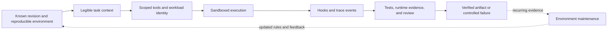

## The Environment Is Part Of Agent Reliability
<!-- section-summary: An agent environment includes the workspace, knowledge, tools, identity, isolation, and feedback through which a model performs real work. -->

An agent loop can call a model and execute tools, yet still fail at practical engineering work because the surrounding environment is incomplete. The repository may not explain its architecture. The application may be impossible to start in isolation. Logs may exist only in a dashboard the agent cannot access. A shell tool may have far more authority than the task requires.

**Environment engineering** makes the working system accessible, constrained, and verifiable. For a coding agent, the environment includes the repository, dependencies, shell, editor, test suite, running application, logs, browser, credentials, and review path. For an operations agent, it may include dashboards, deployment APIs, runbooks, and an approval system.

A reliable environment has seven properties:

1. **Reproducibility** — every run starts from a known revision and runtime.
2. **Legibility** — the agent can discover relevant architecture, rules, and current state.
3. **Capability boundaries** — tools and identities expose only the required actions.
4. **Isolation** — untrusted code cannot escape its filesystem, process, network, or resource limits.
5. **Lifecycle visibility** — hooks and traces observe important actions without hiding control flow.
6. **Fast feedback** — tests and runtime evidence show whether work is correct.
7. **Maintenance** — stale knowledge, weak patterns, and expired permissions are removed continuously.

These properties provide the framework for the article. They explain why a strong model can struggle in one repository and work reliably in another.



Isolation limits the impact of a bad action, while feedback reveals whether the action worked. Hooks observe the lifecycle between those responsibilities and should preserve the visible control flow rather than quietly changing it.

## Reproducibility Gives Every Run A Known Starting Point
<!-- section-summary: A reproducible workspace pins source, runtime, setup, and task resources so results can be replayed and compared. -->

Each run should begin from an exact source revision in its own writable workspace. Dependencies are installed through the repository's normal setup path, and the runtime image is pinned by digest when later reproduction matters. Another run receives another workspace so temporary files, local ports, and uncommitted edits cannot collide.

The platform needs a machine-readable environment contract. This example describes the inputs that create one coding workspace:

```yaml
task_id: fix-checkout-total-482
repository:
  url: https://github.com/example/checkout-service
  revision: 9d3c72f
runtime:
  image: registry.example.com/agent-python@sha256:dddddddddddddddddddddddddddddddddddddddddddddddddddddddddddddddd
  cpu: "2"
  memory: 4Gi
network:
  allow_hosts: [pypi.org, files.pythonhosted.org]
identity:
  service_account: agent-readonly-github
workspace:
  writable_path: /workspace
verification:
  focused: pytest tests/pricing/test_totals.py -q
  required: make verify
artifacts: [patch.diff, junit.xml, trace.json]
```

`revision` and the image digest make the source and toolchain replayable. The network list records the only external package hosts needed during setup. The service account can read the repository but cannot merge code. The two verification commands distinguish fast task feedback from the repository-wide release check. The artifact list tells cleanup which evidence to preserve before deleting the workspace.

Provisioning should fail before the model runs when the revision is missing, the image digest cannot be resolved, a declared verification command is absent, or the identity has broader authority than the task class allows. A useful environment test provisions the same contract twice, runs the focused check in both workspaces, and compares the resolved revision, runtime digest, lockfile hash, and test result. A difference is an environment failure, so the platform should not count it as an agent regression.

The task record should keep the repository revision, runtime identity, setup result, and important configuration. A replay can then separate an agent-behaviour change from a changed compiler, dependency, or test service.

Ephemeral workspaces also simplify cleanup. The platform preserves approved artifacts such as a patch, trace, or test report and destroys the task filesystem afterward. Shared build caches can improve speed, but they need separate trust and tenancy rules; a writable cache shared across users can bypass otherwise careful isolation.

## Legibility Turns Hidden Knowledge Into Usable Context
<!-- section-summary: Agent legibility places architecture, task guidance, application state, and verification paths where the agent can discover them while working. -->

OpenAI's harness-engineering case study uses **agent legibility** for a crucial property: if the agent cannot access a fact or observe a result during its run, that fact effectively does not exist for the agent.

Repository knowledge should therefore live close to the code and point outward through progressive disclosure. A short entry guide can name the project layout, setup command, required checks, and deeper sources of truth. Focused documents then explain architecture, product behaviour, operations, and current plans. Generated references such as schemas should come from their authoritative systems rather than being copied by hand.

Documentation alone cannot preserve architecture. Important dependency directions, schema boundaries, and security invariants should also appear in tests, linters, or policy checks where possible. The document explains why a rule exists; the mechanical check detects when code violates it and gives the agent actionable feedback.

Application state must also be legible. A frontend agent needs a way to start and inspect the UI. A service agent needs structured logs and traces. A performance task needs measurable timings. The environment should expose the evidence that defines success instead of asking the model to infer it from source code alone.

## Tools And Identities Define Available Capability
<!-- section-summary: Tools describe possible actions, while scoped runtime identities enforce which resources a particular run may use. -->

A tool is the model-facing capability. The runtime identity is the system-facing authority. Keeping them separate is essential. Hiding a production-deploy tool from the model reduces accidental selection, while a scoped credential ensures the run cannot call the production API through another path.

Capability follows the task. A code-review run may read the repository and test output without write access. An implementation run may edit an isolated worktree and publish a patch artifact. Opening a pull request can be a separate approved tool. Production credentials should not enter either workspace.

Use short-lived credentials tied to the task, repository, tenant, and permitted actions. Derive identity from trusted runtime context rather than model-supplied arguments. Revoke the credential when the run ends or is cancelled.

Least privilege improves reliability as well as security. When the environment exposes fewer irrelevant systems, the agent has fewer confusing paths and the operator can interpret a trace more confidently.

## Sandboxes Contain Untrusted Execution
<!-- section-summary: A sandbox limits processes, files, resources, and network access when an agent executes repository or model-generated code. -->

Coding agents execute shell commands and repository scripts. Both model-generated code and checked-out repository code must be treated as untrusted. A **sandbox** contains that execution inside an enforced boundary.

At minimum, the run should use a non-root identity, an isolated writable workspace, a read-only base image where practical, and limits for CPU, memory, processes, disk, and wall time. The sandbox should not mount the host container socket or broad host paths. Network policy should allow only destinations required for setup and testing.

A standard container is a packaging and namespace boundary, but some threat models require stronger isolation. gVisor interposes a user-space application kernel, while Kata Containers uses lightweight virtual machines. Kubernetes `RuntimeClass` can select an appropriate runtime for a workload. The choice depends on the code's trust level, multi-tenancy, performance needs, and the impact of escape.

The following Kubernetes Job shows how those choices reach the workload. The cluster administrator has already created a `RuntimeClass` named `gvisor`; writing this manifest alone does not install gVisor.

```yaml
apiVersion: batch/v1
kind: Job
metadata:
  name: agent-fix-checkout-total-482
spec:
  backoffLimit: 0
  activeDeadlineSeconds: 900
  template:
    spec:
      runtimeClassName: gvisor
      serviceAccountName: agent-readonly-github
      automountServiceAccountToken: false
      restartPolicy: Never
      containers:
        - name: worker
          image: registry.example.com/agent-python@sha256:dddddddddddddddddddddddddddddddddddddddddddddddddddddddddddddddd
          securityContext:
            runAsNonRoot: true
            allowPrivilegeEscalation: false
            readOnlyRootFilesystem: true
            capabilities:
              drop: ["ALL"]
          resources:
            requests: {cpu: "500m", memory: 1Gi}
            limits: {cpu: "2", memory: 4Gi}
          volumeMounts:
            - {name: workspace, mountPath: /workspace}
      volumes:
        - name: workspace
          emptyDir: {sizeLimit: 5Gi}
```

`runtimeClassName` selects the stronger runtime. The security context removes root and Linux capabilities, blocks privilege escalation, and keeps the image filesystem read-only. The writable `emptyDir` holds only task files and has a size ceiling. `activeDeadlineSeconds` stops the entire job after fifteen minutes, while CPU and memory limits constrain a process that loops or allocates unexpectedly. `automountServiceAccountToken: false` prevents an unused Kubernetes credential from appearing in the container; repository access should arrive through a separate short-lived mechanism when the task needs it.

This manifest still needs a namespace-level NetworkPolicy, admission policy, image-signature policy, and log controls. An **image signature** is cryptographic evidence that an approved builder signed the exact container image digest. Resource limits cannot stop data exfiltration, and gVisor cannot compensate for a credential that authorizes production changes. Before enabling real tasks, run a sandbox conformance suite that attempts to write outside `/workspace`, run as UID 0, open a forbidden host, exceed the process or memory limit, and read a Kubernetes token. Every attempt should fail, and the trace should record which control produced the denial.

The checks need executable assertions. This script can run as the first command inside the candidate sandbox image:

```bash
#!/usr/bin/env bash
set -euo pipefail

fail_if_succeeds() {
  if "$@" >/workspace/probe.out 2>/workspace/probe.err; then
    echo "sandbox probe unexpectedly succeeded: $*" >&2
    exit 1
  fi
}

test "$(id -u)" -ne 0
fail_if_succeeds touch /usr/local/bin/sandbox-escape-probe
fail_if_succeeds sh -c 'echo probe > /etc/sandbox-escape-probe'
test ! -e /var/run/secrets/kubernetes.io/serviceaccount/token
fail_if_succeeds curl --fail --max-time 3 https://forbidden.example.net/probe
touch /workspace/conformance-write-ok
rm /workspace/conformance-write-ok
rm -f /workspace/probe.out /workspace/probe.err
```

Cluster-level fixtures cover limits that cannot be proved from a happy-path shell. One probe Job forks past the reviewed PID ceiling, one allocates beyond its memory limit, and one sleeps past `activeDeadlineSeconds`. The conformance runner requires the expected termination reason and rejects an image when any probe exits normally. Run the suite after a runtime, base-image, admission-policy, or NetworkPolicy change; saving the results with the image digest turns “sandboxed” into a tested property.

Isolation and authorization solve different problems. A well-isolated process holding an administrator credential can still damage external systems. A narrowly authorized process running on a shared host can still damage the host. Reliable environments apply both.

## Hooks Observe Cross-Cutting Events
<!-- section-summary: Lifecycle hooks attach tracing, budgets, policy checks, and cleanup to explicit runtime events without replacing the orchestrator. -->

A **lifecycle hook** runs before or after a known event such as a model call, tool call, handoff, or complete run. Hooks are useful for cross-cutting concerns that should apply consistently: tracing, usage accounting, rate limits, policy checks, redaction, and cleanup.

Hooks should remain subordinate to explicit control flow. The orchestrator should still reveal that a run is editing, testing, waiting for approval, or complete. A large collection of hooks that silently changes transitions makes recovery difficult to explain and test.

The OpenAI Agents software development kit (SDK) exposes agent and run lifecycle hooks, while other frameworks provide middleware or callbacks with related purposes. Whichever mechanism is used, a hook should have clear ordering, timeout, failure, and retry semantics. A telemetry hook may be best-effort; an authorization hook must fail closed according to policy.

```ts
async function within<T>(label: string, ms: number, work: Promise<T>): Promise<T> {
  let timer: ReturnType<typeof setTimeout>;
  try {
    return await Promise.race([
      work,
      new Promise<T>((_, reject) => {
        timer = setTimeout(() => reject(new Error(`${label}_timeout`)), ms);
      }),
    ]);
  } finally {
    clearTimeout(timer!);
  }
}

async function authorizeBeforeTool(call: ToolCall, run: RunContext) {
  const decision = await within(
    "authorization", 250,
    policy.authorize(run.identity, call)
  ).catch(() => "policy_unavailable" as const);
  if (decision !== "allow") return decision;

  const budget = await within("budget", 100, budgets.check(run.id))
    .catch(() => "budget_unavailable" as const);
  if (budget !== "allow") return budget;

  within(
    "telemetry", 50,
    trace.record("tool.authorized", { runId: run.id, tool: call.name })
  ).catch((error) => localAudit.append({
    runId: run.id, tool: call.name, event: "telemetry_degraded",
    reason: String(error),
  }));
  return "allow" as const;
}

async function dispatchTool(call: ToolCall, run: RunContext) {
  const decision = await authorizeBeforeTool(call, run);
  if (decision !== "allow") {
    await localAudit.append({ runId: run.id, tool: call.name, decision });
    return { status: "blocked", reason: decision };
  }
  return toolExecutor.execute(call, run);
}
```

The ordering is deliberate. Authorization and budget checks finish before degradable telemetry begins. A policy timeout returns `policy_unavailable` and never reaches `toolExecutor`. Telemetry has a short timeout and a local audit fallback, so an observability outage cannot delay the authorization decision or accidentally grant permission. `dispatchTool` is the only route to the executor; calling hooks from scattered tool implementations would leave bypasses.

Hook failure policy needs the same precision as tool failure policy. If `trace.record` times out, the platform may buffer a minimal audit event locally and continue a read-only call. If `policy.authorize` cannot return a decision, the call must stop because “policy unavailable” is different from “allowed.” If `budgets.check` reports exhaustion, the orchestrator should enter a terminal `budget_exceeded` state rather than letting the model try another tool name.

Test hooks as an ordered boundary. A fake tool executor can record `authorize -> budget -> trace -> execute`, inject a timeout at each step, and assert whether execution occurred. The important negative test makes the policy service unavailable and verifies that the budget, telemetry, and tool implementation received zero calls. A budget timeout must return `budget_unavailable` with zero tool calls. Another test makes telemetry unavailable and verifies that execution continues only after an allow decision and that the local audit fallback receives the event. These tests catch a common mistake where broad exception handling turns a failed authorization hook into permission to continue.

## Feedback Lets The Agent Verify Its Work
<!-- section-summary: Fast, task-relevant tests and runtime observations turn agent actions into an evidence-guided engineering loop. -->

An environment supports productive work when it can answer, “Did that change work?” A unit test can expose a local regression. An integration test can reveal a contract mismatch. A browser screenshot can show a layout failure. Logs and traces can reveal which branch the application executed.

Feedback should arrive in layers. Run the smallest relevant check first so a local error is cheap to fix. Widen to integration and repository-required checks after the focused result passes. For UI and operational tasks, verify the running application rather than relying only on compilation.

Failures need actionable output. An architecture linter should name the forbidden dependency and the allowed direction. A data validator should show the changed field and expected schema. Clear feedback reduces repeated model turns and teaches the intended system structure at the moment it matters.

The evidence also supports review. A proposed patch can carry the failing result before the change, the passing focused test afterward, the wider verification output, and a trace or screenshot when appropriate. A reviewer can then focus on design and residual risk rather than reproducing every mechanical step.

## Autonomy Expands Only With Controls And Evidence
<!-- section-summary: Wider permissions are justified by evaluation and operational evidence gathered at a narrower level of impact. -->

Agent autonomy is a sequence of authority decisions. An agent may begin by suggesting a patch. Later it may edit an isolated workspace and run tests. It may eventually publish a draft pull request after checks pass. Merge or deployment authority introduces another level of impact and needs separate evidence and controls.

Success at one level does not automatically justify the next. A safe sandbox patch does not prove that the agent can merge changes without review. Evaluation cases should match the proposed authority, including recovery from failures, permission denials, ambiguous tool results, and adversarial repository content.

Human approval should bind to an exact artifact. If the patch or deployment plan changes after review, the earlier approval expires. This keeps human oversight connected to the thing that actually executes.

## Traces Connect Actions To Outcomes
<!-- section-summary: Environment traces show which workspace, knowledge, tools, permissions, tests, and review decisions produced the final artifact. -->

A useful trace connects the task and source revision to context retrieval, model calls, file or shell tools, policy decisions, test results, approvals, and the final artifact. It records tool and environment versions as well as latency and cost.

Sensitive source code, secrets, user data, and unrestricted shell output require deliberate redaction and access policy. A trace should make the run explainable without turning observability into a second uncontrolled data store.

Repeated trace failures point to system improvements. An obsolete document suggests a link or ownership problem. Malformed tool calls suggest a weak contract. Duplicate side effects suggest missing idempotency. A hidden UI state suggests missing application legibility. Prompt changes are appropriate for instruction problems, while environment problems need environment repairs.

## Maintenance Prevents The Harness From Teaching Bad Patterns
<!-- section-summary: Continuous cleanup removes stale knowledge, duplicated abstractions, expired exceptions, weak tests, and permission drift before agents reproduce them. -->

Agents learn from the environment they inspect. If a repository contains three competing helpers, stale documents, and ignored architecture exceptions, future runs may extend those patterns. High generation throughput can spread inconsistency faster than periodic human cleanup can catch it.

OpenAI describes recurring cleanup work that scans for documentation drift and architectural decay. Teams can encode stable principles in linters, link checks, dependency rules, quality reports, and targeted maintenance tasks. Teams should convert repeated human review feedback into durable guidance or enforcement.

Maintenance also covers the operational surface: remove unused tools, expire credentials, review network destinations, update sandbox images, retest recovery, and refresh evaluation sets. The harness is a living platform, so its reliability depends on the quality of the environment future agents inherit.

## The Environment Completes The Harness
<!-- section-summary: Reproducibility, legibility, scoped capability, isolation, hooks, feedback, evidence, and maintenance turn model actions into controlled engineering work. -->

The model and orchestrator decide and sequence work. The environment determines what work is possible, what authority it carries, and whether success can be proved. Reproducible workspaces provide a known starting point. Repository and application legibility provide usable knowledge. Tools, identities, and sandboxes constrain reach. Hooks and traces expose the lifecycle. Tests and review provide feedback. Maintenance protects the next run from today's drift.

This wider engineering harness is why reliable agent work is a systems problem. Improving the model may help judgement, but it cannot repair an invisible application, an unreproducible workspace, an overpowered credential, or a missing verification path.

## References

- [OpenAI: Harness engineering](https://openai.com/index/harness-engineering/)
- [OpenAI Agents SDK: Agents and lifecycle hooks](https://openai.github.io/openai-agents-python/agents/)
- [OpenAI Agents SDK: Sandbox agents](https://openai.github.io/openai-agents-python/sandbox/)
- [Kubernetes: Jobs](https://kubernetes.io/docs/concepts/workloads/controllers/job/)
- [Kubernetes: RuntimeClass](https://kubernetes.io/docs/concepts/containers/runtime-class/)
- [gVisor documentation](https://gvisor.dev/docs/)
- [OpenTelemetry: Traces](https://opentelemetry.io/docs/concepts/signals/traces/)
