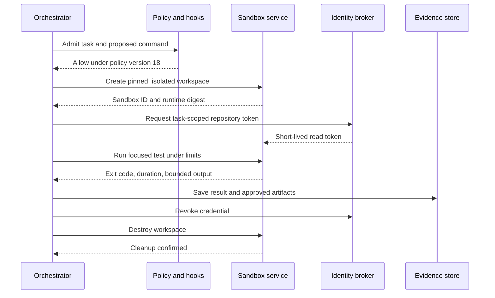
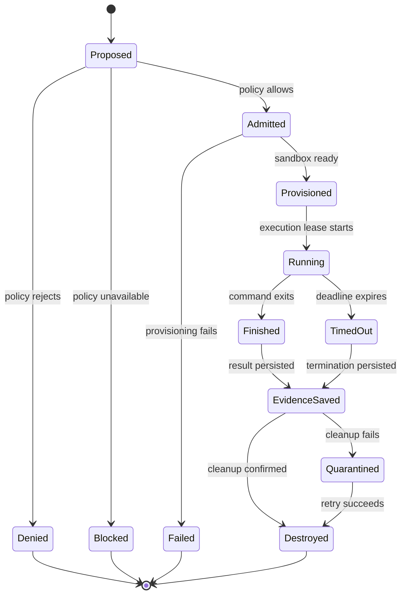

## Table of Contents

1. [Hooks And Sandboxes Guard Different Boundaries](#hooks-and-sandboxes-guard-different-boundaries)
2. [Follow One Safe Execution Path](#follow-one-safe-execution-path)
3. [Hooks Attach Rules And Evidence To The Lifecycle](#hooks-attach-rules-and-evidence-to-the-lifecycle)
4. [Hook Failure Policy Determines What Can Continue](#hook-failure-policy-determines-what-can-continue)
5. [Sandbox Design Starts With A Threat Model](#sandbox-design-starts-with-a-threat-model)
6. [Isolation Has Several Independent Dimensions](#isolation-has-several-independent-dimensions)
7. [Credentials And Network Access Need Their Own Boundaries](#credentials-and-network-access-need-their-own-boundaries)
8. [Recovery And Cleanup Belong To The Execution Path](#recovery-and-cleanup-belong-to-the-execution-path)
9. [Choose The Smallest Credible Isolation Shape](#choose-the-smallest-credible-isolation-shape)
10. [Prove The Boundary Before Expanding Autonomy](#prove-the-boundary-before-expanding-autonomy)
11. [References](#references)

## Hooks And Sandboxes Guard Different Boundaries
<!-- section-summary: Hooks control and observe named lifecycle events, while sandboxes contain the processes, files, and resources used by agent-generated execution. -->

An agent that can only answer questions stays inside a fairly narrow boundary. An agent that can run tests, install packages, edit files, or launch build scripts crosses into a different kind of system. Its output now causes real processes to execute against real resources.

At a high level, **hooks make important moments in an agent run visible and enforceable, while sandboxes limit what executed code can reach and consume.** These are separate responsibilities. A hook can enforce authorization before a command starts. It can also record evidence after the command finishes.

A sandbox controls the command's files and processes. It also bounds network access, credential exposure, resource use, and lifetime.

The simplest implementation often connects a model to `subprocess.run()` and adds callbacks around the call. That proves the basic interaction, although it leaves the real safety boundary unclear.

A child process usually inherits much of its parent's world. It may see the same filesystem, environment variables, network, user identity, and host kernel. Starting a second process therefore creates execution, yet it supplies very little isolation by itself.

A callback has another limitation. It runs inside application control flow and usually carries the same authority as the application. A callback after execution can record a deletion, though it arrives too late to prevent that deletion. A callback before execution can deny a command only if every command must pass through that exact path. Scattered callbacks create bypasses and ambiguous ordering during failure.

The harness needs two explicit boundaries:

- the **lifecycle boundary** decides which event is happening, which rule applies, what evidence is required, and what failure permits;
- the **execution boundary** creates a disposable environment and enforces what the code inside it may access.

The orchestrator remains in charge of the run. It chooses the next state and owns pauses, retries, approvals, and recovery. Hooks attach consistent work to declared events. The sandbox executor owns process containment. This separation gives each failure a clear owner.

```mermaid
flowchart TD
    A["Orchestrator<br/>owns run state"] --> B["Lifecycle hook boundary<br/>policy and evidence"]
    B --> C["Sandbox executor<br/>files, process, network, resources"]
    C --> D["Command or test<br/>runs in isolation"]
    D --> E["Structured result<br/>and approved artifacts"]
    E -. "guides the next state" .-> A

    classDef control fill:#FFE04F,stroke:#536A9A,stroke-width:3px,color:#111827; classDef isolate fill:#2DD4BF,stroke:#536A9A,stroke-width:3px,color:#0F172A
    classDef work fill:#93C5FD,stroke:#536A9A,stroke-width:3px,color:#0F172A; classDef result fill:#FB7185,stroke:#536A9A,stroke-width:3px,color:#111827
    class A,B control; class C isolate; class D work; class E result
    linkStyle default stroke:#7C8DB5,stroke-width:2px
```

## Follow One Safe Execution Path
<!-- section-summary: A safe run admits the task, creates an isolated workspace, leases narrow credentials, executes under limits, preserves evidence, and destroys the workspace. -->

Before examining individual controls, follow one complete piece of work. A repository agent has proposed running a focused test after changing a pricing function. The requested command is `pytest tests/pricing/test_totals.py -q`.

The harness first records the task, authenticated user, repository revision, proposed command, and current policy version. A pre-execution policy check confirms that this task class may run tests and that the requested repository belongs to the authenticated project. The sandbox provisioner then creates a fresh workspace from a pinned runtime image and checks out the approved revision.

The base image is read-only. `/workspace` is the only general writable path. The process runs as a non-root user with CPU, memory, process-count, disk, output, and wall-clock limits. Network access starts closed. If package access is genuinely required, the run reaches an approved package proxy. A credential broker issues a short-lived repository token with read access; the token expires with the task and never appears in the model prompt.

The executor starts the test and streams bounded output. A successful command produces a structured result containing the exit code, duration, termination reason, and references to approved artifacts such as the test report and patch. A post-execution hook records those facts. Cleanup revokes the credential, copies the approved artifacts to durable storage, and destroys the workspace.


```mermaid
sequenceDiagram
    participant O as Orchestrator
    participant P as Policy and hooks
    participant S as Sandbox service
    participant I as Identity broker
    participant E as Evidence store

    O->>P: Admit task and proposed command
    P-->>O: Allow under policy version 18
    O->>S: Create pinned, isolated workspace
    S-->>O: Sandbox ID and runtime digest
    O->>I: Request task-scoped repository token
    I-->>S: Short-lived read token
    O->>S: Run focused test under limits
    S-->>O: Exit code, duration, bounded output
    O->>E: Save result and approved artifacts
    O->>I: Revoke credential
    O->>S: Destroy workspace
    S-->>O: Cleanup confirmed
```

Each failure also has a defined result. A policy outage stops the command before a sandbox receives work. A provisioning error returns `environment_unavailable`. A timeout terminates the full process tree and returns `deadline_exceeded`. A cleanup failure removes network access and credentials, marks the workspace `quarantined`, and schedules another deletion attempt. The user receives a controlled outcome instead of a generic exception.

This path shows the relationship between hooks and sandboxes. Hooks attach policy and evidence to the transitions. The sandbox service enforces the operating boundary. Durable run state connects the two and provides enough information for recovery after a worker crash.

## Hooks Attach Rules And Evidence To The Lifecycle
<!-- section-summary: Lifecycle hooks run at named events so policy, accounting, tracing, redaction, and cleanup follow one consistent path. -->

A mature run has repeated concerns that belong at many points. Every model call needs usage accounting. Every protected execution needs policy evaluation. Every completed command needs a safe result record. Every sandbox needs cleanup, including runs that end through cancellation or failure.

A **lifecycle hook** is application code attached to one of those named events. The event supplies trusted run context, such as the run ID, authenticated identity, tool call ID, sandbox ID, and policy version. The hook observes the event or enforces a rule and returns a defined outcome.

For example, a proposed shell command can produce this small event before execution:

```json
{
  "event": "tool.before_execute",
  "run_id": "run_482",
  "tool_call_id": "call_17",
  "action": "shell.exec",
  "target": "repo:pricing-service",
  "policy_version": "18"
}
```

The runtime supplies these fields from trusted state. The policy hook can return `deny`, or it can issue a short-lived execution lease for this exact call. The hook never has to infer the target or identity from the command text.

### Name the lifecycle before adding callbacks

The useful lifecycle follows the real work. Common events include:

1. run admitted;
2. agent or model call started and finished;
3. tool proposed;
4. policy allowed or denied the proposal;
5. sandbox requested, provisioned, and started;
6. command started and finished;
7. artifact accepted or rejected;
8. sandbox stopped, archived, and destroyed;
9. run completed, cancelled, or escalated.

The OpenAI Agents SDK exposes `RunHooks` for a complete runner invocation and `AgentHooks` for one agent. Its current hook surface includes events around agents, model calls, local tools, and handoffs. These callbacks are useful places for tracing and accounting. An application can define additional events around its sandbox service because workspace provisioning and deletion happen beyond the model-call lifecycle.

The hook name should describe a fact that has already been defined by the orchestrator. `tool.before_execute` is clear because the runtime knows which proposal is awaiting authorization. A hook named `maybe_continue_work` hides the state transition and forces later investigators to read its implementation to learn what happened.

### Put enforcement before the effect

Timing changes the meaning of a hook. A pre-execution policy hook can stop a command. A post-execution hook can classify its result and preserve evidence. The post-execution hook cannot undo a network request or a deleted file.

For a protected action, the only route to the executor should perform these steps in order:

`validate proposal → derive trusted identity → authorize → create execution lease → run → record result`

The model proposes the action. Trusted identity comes from authenticated run context. The policy decision binds that identity, the proposed action, the target resource, and the policy version. An **execution lease** is a short-lived permission for this exact admitted operation. It prevents an old approval from authorizing a later, changed command.

### Use hooks for cross-cutting work

Hooks fit work that should happen consistently around many operations. Tracing and usage accounting are common examples. Policy checks, redaction, and deadline propagation also benefit from one attachment point. Cleanup hooks help every terminal path reach the same teardown logic. Domain decisions stay in the application service that owns the effect. A refund policy, for example, belongs to the payment domain. A generic hook may enforce that an approved refund decision exists before the payment adapter runs.

This boundary keeps a hook understandable. It receives a declared event, performs one bounded responsibility, and returns a result that the orchestrator can interpret. It never invents a hidden branch in the workflow.

## Hook Failure Policy Determines What Can Continue
<!-- section-summary: Each hook needs explicit ordering, timeout, retry, and failure behavior because a failed control has a different meaning from failed telemetry. -->

A hook is ordinary software, so it can time out, crash, receive a duplicate event, or lose its connection to a dependency. The harness must decide the consequence before production traffic arrives.

The right response comes from the hook's responsibility.

An authorization hook protects the effect. If its policy service cannot decide, execution stops with `policy_unavailable`. Continuing would turn a service outage into permission. The same fail-closed rule usually applies to a required approval check, tenant boundary, or legal hold.

Telemetry has a different role. A short exporter outage may allow a low-risk read to continue after the runtime stores a minimal audit event in a bounded local buffer. Some regulated operations require durable audit evidence before execution; those operations should stop if the evidence sink and its fallback are both unavailable. “Telemetry may degrade” is therefore a policy choice tied to the action class.

Cleanup deserves a third response. It should be **idempotent**, meaning repeated calls produce the same safe final state. A timeout triggers another cleanup attempt. A sandbox that remains reachable enters quarantine: credentials are revoked, network is closed, new commands are denied, and an operator receives an alert.


```mermaid
stateDiagram-v2
    [*] --> Proposed
    Proposed --> Denied: policy rejects
    Proposed --> Admitted: policy allows
    Proposed --> Blocked: policy unavailable
    Admitted --> Provisioned: sandbox ready
    Admitted --> Failed: provisioning fails
    Provisioned --> Running: execution lease starts
    Running --> Finished: command exits
    Running --> TimedOut: deadline expires
    Finished --> EvidenceSaved: result persisted
    TimedOut --> EvidenceSaved: termination persisted
    EvidenceSaved --> Destroyed: cleanup confirmed
    EvidenceSaved --> Quarantined: cleanup fails
    Quarantined --> Destroyed: retry succeeds
    Denied --> [*]
    Blocked --> [*]
    Failed --> [*]
    Destroyed --> [*]
```

Ordering also needs tests. A policy denial should produce zero executor calls. A telemetry timeout should follow an allow decision and create its fallback event. A cancellation should reach cleanup even if result processing raises an error. Duplicate `command.finished` events should update one result record instead of producing two artifacts or two bills.

One especially important failure occurs after an external effect and before the post-hook finishes. The absence of a completion event cannot prove that nothing happened. The executor should write `running` durably before the effect, use a stable operation ID, and write the terminal outcome afterward. A reconciliation worker can then inspect old `running` records and query the owning service before any retry. Hooks support this evidence path; durable state protects it across process failure.

## Sandbox Design Starts With A Threat Model
<!-- section-summary: A sandbox design identifies untrusted inputs, protected assets, possible escape paths, and the impact that each control must contain. -->

The word **sandbox** can describe anything from a temporary directory to a hardware-backed virtual machine. The label says very little about protection. A useful design starts by asking what may be hostile and what must remain safe.

For an agent that works on code, two inputs deserve suspicion. The model may propose a damaging command. The checked-out repository may contain scripts that run during package installation, compilation, tests, or Git hooks. Even a sensible command such as `npm install` can execute repository-controlled lifecycle scripts.

The protected assets extend beyond the current files. They include the host, neighbouring runs, the sandbox control plane, cloud metadata endpoints, credentials, private source data, artifact storage, and external services reachable through the network.

Consider a test script that tries to read `/var/run/docker.sock`, scan the home directory, call the cloud metadata IP, and upload the result. A temporary working directory blocks none of those actions. A container with the host Docker socket mounted can ask the daemon to start a privileged container. A locked-down container with a broad production token can still call the production API. Each path crosses a different boundary.

```mermaid
flowchart TD
    A["Untrusted inputs<br/>model command and repository code"] --> B["Sandbox boundary"]
    B --> C["Files and processes"]
    B --> D["Network and credentials"]
    B --> E["Resources and lifetime"]
    C --> F["Protect host<br/>and neighbouring runs"]
    D --> G["Protect private data<br/>and external services"]
    E --> H["Protect capacity<br/>and cost"]

    classDef source fill:#FB7185,stroke:#536A9A,stroke-width:3px,color:#111827; classDef boundary fill:#FFE04F,stroke:#536A9A,stroke-width:3px,color:#111827
    classDef control fill:#2DD4BF,stroke:#536A9A,stroke-width:3px,color:#0F172A; classDef asset fill:#93C5FD,stroke:#536A9A,stroke-width:3px,color:#0F172A
    class A source; class B boundary; class C,D,E control; class F,G,H asset
    linkStyle default stroke:#7C8DB5,stroke-width:2px
```

The threat model therefore describes at least four questions:

- Which code and data enter the workspace?
- Which host, tenant, and control-plane resources require protection?
- Which network destinations and external actions are permitted?
- What is the acceptable result after escape, credential theft, resource exhaustion, or cleanup failure?

From those answers, the team chooses several layers of control. Isolation limits the process. Authorization limits external authority. Network policy limits destinations. Resource controls limit consumption. Evidence and recovery show whether the controls worked.

No single layer carries the whole promise. A stronger runtime cannot repair an administrator credential inside the guest. A short-lived credential cannot protect a shared host from a kernel escape. A default-deny network policy cannot protect a secret copied into command output. The sandbox is a defence-in-depth system whose layers address different paths.

## Isolation Has Several Independent Dimensions
<!-- section-summary: Filesystem, process, kernel, resource, and lifetime controls combine to contain code execution and preserve only approved results. -->

The execution boundary has several independent dimensions. Each one answers a concrete question: what can code inside the sandbox read, change, consume, or keep?

### Filesystem controls define what can change

A fresh workspace should start from a known source revision and runtime image. The image is pinned by digest where reproduction matters. Its root filesystem stays read-only, while a dedicated task volume provides the writable `/workspace` directory.

Mounts deserve careful review because they create direct paths across the boundary. The sandbox should never receive the host container socket, broad home directories, cluster administration files, or another run's workspace. Read-only source mounts reduce accidental changes, although hostile code can still read and exfiltrate their contents. Sensitive input should enter only if the task truly needs it.

The workspace also needs a size limit. Logs, temporary files, and package caches can fill a disk.

Archive extraction needs separate thresholds. They cap the compressed input, total extracted bytes, and number of files. Without these thresholds, a small archive can expand until the node fails.

At completion, the platform copies only approved artifacts. A patch, test report, and small structured log may qualify. Package caches, arbitrary archives, secret files, and the complete home directory should disappear with the workspace.

### Process and kernel controls limit local power

Inside the guest, execution should use a non-root user, drop Linux capabilities, block privilege escalation, and apply a seccomp profile. Process namespaces separate the task from host processes. A PID limit prevents a fork bomb from exhausting the node.

Ordinary Linux containers share the host kernel. Namespaces, cgroups, capabilities, seccomp, and mandatory access controls provide useful defence, though a kernel vulnerability still creates a possible path to the host.

gVisor adds a user-space application kernel that intercepts the sandboxed workload's system calls. This reduces the direct surface exposed to the host kernel and keeps the container interface familiar. The tradeoff is syscall compatibility and performance overhead, so the team should test the actual compiler, package manager, browser, or model workload it plans to run.

A microVM places a virtual-machine boundary around the guest kernel. Firecracker uses Linux KVM and a minimal device model. A companion jailer adds host-side restrictions. This shape provides a strong tenant boundary for highly untrusted workloads. The surrounding platform still needs to build images, update guest kernels, connect networks and storage, schedule work, and collect evidence.

### Resource and lifetime controls contain runaway work

Compute and storage need explicit budgets. The runtime should cap CPU, memory, process count, writable space, and open files.

The executor should also cap output and wall-clock time. These controls protect availability and cost. They turn an infinite loop into a classified failure the orchestrator can handle.

Kubernetes requests help the scheduler place a Pod. Limits are enforced through the container runtime and operating system. A memory breach commonly ends in an out-of-memory termination. A CPU limit commonly throttles the process. Neither control supplies a task deadline, so a Job also needs a wall-clock deadline and the executor must terminate the full process tree.

The following fragment shows the important controls for a Kubernetes Job. The cluster already has a `RuntimeClass` named `gvisor`; the manifest selects it but cannot install the runtime. Network policy and short-lived credential delivery remain separate controls.

```yaml
spec:
  backoffLimit: 0
  activeDeadlineSeconds: 900
  template:
    spec:
      runtimeClassName: gvisor
      automountServiceAccountToken: false
      restartPolicy: Never
      securityContext:
        runAsNonRoot: true
        seccompProfile:
          type: RuntimeDefault
      containers:
        - name: executor
          image: registry.example/agent-runtime@sha256:<reviewed-digest>
          securityContext:
            allowPrivilegeEscalation: false
            readOnlyRootFilesystem: true
            capabilities:
              drop: ["ALL"]
          resources:
            requests: {cpu: 500m, memory: 1Gi, ephemeral-storage: 1Gi}
            limits: {cpu: "2", memory: 4Gi, ephemeral-storage: 5Gi}
          volumeMounts:
            - {name: workspace, mountPath: /workspace}
      volumes:
        - name: workspace
          emptyDir: {sizeLimit: 5Gi}
```

Kubernetes' Restricted Pod Security Standard supplies a useful baseline for non-root execution, disabled privilege escalation, seccomp, and dropped capabilities. Admission policy should enforce that baseline so one missing field cannot silently weaken a task. The sandbox conformance suite then proves the effective runtime behaviour, including controls supplied by the cluster.

## Credentials And Network Access Need Their Own Boundaries
<!-- section-summary: Task-scoped identity limits external authority, while default-deny networking restricts where sandboxed code can send requests. -->

Useful tasks sometimes need private resources. A test may clone a repository, read a fixture from object storage, or send results to an artifact service. Giving the sandbox the platform's general credential would expose far more authority than the task requires.

A credential broker should issue a short-lived token for one task, tenant, audience, and set of actions. The executor receives it through a narrow channel after policy approval. The model receives a tool outcome or resource reference, never the secret value. Revocation happens at cancellation and cleanup, with expiry providing a second boundary.

Kubernetes service-account tokens should stay unmounted if the workload has no reason to call the Kubernetes API. `automountServiceAccountToken: false` expresses that decision. If cloud access is required, workload identity or a brokered credential should bind the Pod identity to one approved cloud role. Static secrets in an image, repository, task prompt, or general environment contract create long-lived exposure.

Kubernetes Secrets can deliver confidential values, though their base64 representation provides no encryption. The cluster still needs encryption at rest and tight access control. Any user who can create a Pod that mounts a Secret can usually expose its contents from that Pod.

Teams therefore keep each secret short-lived and restrict namespace access. They mount it only into the consuming container. Audit records show its use, while application-side redaction keeps the value out of output.

Network access controls the other half of the path. The safest starting state is no egress. A run that needs a package can reach an approved, logged package proxy. A run that needs a private Git repository can reach the Git service. It should have no path to cloud metadata, internal databases, production control planes, or arbitrary public hosts.

A private-repository read can follow this path:

```mermaid
flowchart TD
    A["Policy allows<br/>one repository read"] --> B["Credential broker issues<br/>a short-lived token"]
    B --> C["Sandbox receives token<br/>after admission"]
    C --> D["Default-deny egress"]
    D -->|"approved Git route"| E["Private Git service"]
    D -->|"other destination"| F["Deny and record"]
    E --> G["Cleanup revokes token"]

    classDef policy fill:#FFE04F,stroke:#536A9A,stroke-width:3px,color:#111827; classDef identity fill:#2DD4BF,stroke:#536A9A,stroke-width:3px,color:#0F172A
    classDef network fill:#93C5FD,stroke:#536A9A,stroke-width:3px,color:#0F172A; classDef deny fill:#FB7185,stroke:#536A9A,stroke-width:3px,color:#111827
    class A policy; class B,C,G identity; class D,E network; class F deny
    linkStyle default stroke:#7C8DB5,stroke-width:2px
```

Kubernetes `NetworkPolicy` controls traffic at IP address and port level, and it only works with a network plugin that enforces the policy. A default-deny egress policy also blocks DNS until an explicit DNS rule is added. Hostname-level rules, TLS inspection, and a central outbound audit usually require an egress proxy or gateway beyond the built-in NetworkPolicy API.

Imagine a repository test that unexpectedly runs `curl https://upload.example`. The DNS request may resolve, but the egress gateway rejects the destination because it is absent from the task's allowlist. The executor records `network_denied`, the run stops, and the security team can inspect the command and repository revision. If the same request succeeds in a conformance test, the environment should stay out of service until the network boundary is repaired.

## Recovery And Cleanup Belong To The Execution Path
<!-- section-summary: Durable state, leases, bounded output, credential revocation, and idempotent cleanup return failed runs to a known safe condition. -->

Execution platforms fail in awkward places. A worker can disappear after the command starts. A test can spawn grandchildren that survive the parent. The evidence store can reject an oversized log. The sandbox provider can time out during deletion.

A durable run record connects the task to its sandbox ID and workspace revision. It also records the runtime image, command digest, credential lease, start time, deadline, and latest execution state. A supervisor owns the sandbox independently of the model worker. If the worker disappears, the supervisor can reach the deadline, terminate the sandbox, revoke the credential, and finish cleanup.

Timeout handling must stop the entire task environment. Killing only the top-level shell can leave a compiler, development server, or child script running. Container or microVM termination provides a reliable final boundary after a short graceful shutdown period.

Output also needs a contract. The executor caps stdout and stderr, records that truncation occurred, and preserves the tail or a safe summary needed for diagnosis. Artifact rules cover maximum size and file count. They also restrict file types and paths. Secrets and unrestricted source payloads stay out of general traces and logs.

Cleanup follows a safe order. The supervisor first denies new commands, revokes task credentials, and closes network access. It can then preserve the structured result and approved artifacts before destroying the workspace.

```mermaid
flowchart TD
    A["Worker lost or<br/>run cancelled"] --> B["Supervisor denies<br/>new commands"]
    B --> C["Revoke credentials<br/>and close network"]
    C --> D["Preserve result<br/>and approved artifacts"]
    D --> E["Destroy sandbox"]
    E -->|"deletion confirmed"| F["Safe terminal state"]
    E -->|"deletion fails"| G["Quarantine and alert"]
    G --> H["Retry cleanup"]
    H --> E

    classDef failure fill:#FB7185,stroke:#536A9A,stroke-width:3px,color:#111827; classDef control fill:#FFE04F,stroke:#536A9A,stroke-width:3px,color:#111827
    classDef evidence fill:#93C5FD,stroke:#536A9A,stroke-width:3px,color:#0F172A; classDef safe fill:#2DD4BF,stroke:#536A9A,stroke-width:3px,color:#0F172A
    class A,G failure; class B,C,E,H control; class D evidence; class F safe
    linkStyle default stroke:#7C8DB5,stroke-width:2px
```

Deletion confirmation enters durable run state. A failed deletion keeps the workspace in quarantine until the retry succeeds or an operator resolves the incident.

Some systems need resumable workspaces. A saved snapshot should refer to a known sandbox format, source revision, and integrity digest. Resumption creates or reconnects through the sandbox service under a fresh authorization decision. A task should avoid trusting an unknown leftover process after a crash; restoring approved files into a clean sandbox often provides a clearer recovery path.

The current OpenAI Agents SDK sandbox lifecycle illustrates this distinction. The runner can own creation and cleanup for a run, or the developer can own a live session across several runs. In the developer-owned form, the application also owns the final close. The SDK's Sandbox Agents feature is currently beta, so production adoption should account for API and capability changes.

Cleanup success is an observable result. A task is complete after approved evidence is durable and the execution lease, credentials, network path, processes, and workspace have reached their terminal state. A quarantined sandbox remains an incident even if the agent produced a correct patch.

## Choose The Smallest Credible Isolation Shape
<!-- section-summary: Isolation strength follows code trust, tenancy, external authority, workload compatibility, and the team's ability to operate the platform. -->

The strongest runtime carries real cost, and the cheapest runtime may leave an unacceptable escape path. The choice should follow the threat model and the team's operating context.

The first decision separates trusted local development from production or shared execution. Production work usually starts with a managed service because the provider absorbs much of the host lifecycle. Kubernetes fits an existing platform team that needs custom scheduling, identity, network, or admission controls. The final branch chooses the isolation boundary required by hostile or cross-tenant code.

```mermaid
flowchart TD
    A{"Trusted local<br/>development?"} -->|"yes"| B["Local process"]
    A -->|"no"| C{"Managed service<br/>meets the controls?"}
    C -->|"yes"| D["Managed sandbox<br/>or container"]
    C -->|"no"| E{"Already operate<br/>Kubernetes?"}
    E -->|"no"| F["Revisit provider fit<br/>or fund a platform"]
    E -->|"yes"| G["Kubernetes Job"]
    G --> H{"Required isolation"}
    H -->|"stronger container boundary"| I["gVisor runtime"]
    H -->|"hardware VM boundary"| J["Firecracker-based platform"]

    classDef question fill:#FFE04F,stroke:#536A9A,stroke-width:3px,color:#111827; classDef simple fill:#93C5FD,stroke:#536A9A,stroke-width:3px,color:#0F172A
    classDef managed fill:#2DD4BF,stroke:#536A9A,stroke-width:3px,color:#0F172A; classDef platform fill:#FB7185,stroke:#536A9A,stroke-width:3px,color:#111827
    class A,C,E,H question; class B simple; class D managed; class F,G,I,J platform
    linkStyle default stroke:#7C8DB5,stroke-width:2px
```

### A local process fits trusted development

A local process or temporary directory is useful for developer experiments with trusted code and low-value data. It offers speed and direct debugging. It should be described honestly as a development environment, since it usually shares the developer's files, network, credentials, and kernel.

The OpenAI Agents SDK currently provides `UnixLocalSandboxClient` for this local workflow. Its own client guide recommends Docker or a hosted provider for stronger isolation or production-style parity.

### A managed sandbox or container is the practical default

For most teams adding code execution, a managed sandbox or managed container service is a sensible first production choice. The provider operates provisioning, host patching, scheduling, and destruction. The customer still verifies the identity and network model. It must also check data region and retention, runtime-image control, resource limits, audit evidence, and cleanup guarantees.

Docker or another ordinary container runtime can also fit trusted single-tenant workers and controlled CI workloads. It supplies packaging and a useful namespace boundary. Highly untrusted or cross-tenant execution raises the need for a stronger kernel boundary.

For applications built with the OpenAI Agents SDK, Sandbox Agents keep the agent definition separate from the sandbox client. The same agent can use a local, Docker, or hosted client. The feature remains beta, so teams should evaluate it through controlled adoption before treating it as a platform default.

### Kubernetes fits teams that already need a platform

Kubernetes Jobs fit organisations that already operate Kubernetes and need queued execution with custom images. Quotas and admission controls set the cluster boundary. Workload identity and network policy connect each job to approved external resources. `RuntimeClass` selects a configured runtime for a Pod and is stable in Kubernetes. A platform team must still install and patch that runtime on the nodes.

Kubernetes also introduces a platform to operate. The team owns cluster security, capacity, upgrades, policy enforcement, and telemetry. It must prevent one tenant from exhausting shared nodes. A team without those needs often receives a safer result sooner from a managed sandbox service.

### gVisor fits hostile container-style workloads

gVisor fits multi-tenant or hostile workloads that benefit from a user-space kernel while keeping the container model. It narrows direct interaction with the host kernel. Compatibility and performance tests matter because build tools, browsers, debuggers, and machine-learning libraries can exercise unusual system calls.

### Firecracker fits a purpose-built microVM platform

Firecracker fits platforms that require a hardware-virtualization boundary with high microVM density. It is a virtual machine monitor built around KVM, a minimal device model, and a jailer. These primitives are suitable for secure multi-tenant execution. Firecracker supplies the virtualization foundation; a complete agent sandbox service still needs a control plane and the surrounding lifecycle.

A team choosing this path owns guest kernels, root filesystems, snapshot integrity, networking, storage, scheduling, patching, image provenance, evidence collection, and deletion. Many product teams should consume a managed service built on similar isolation instead of assembling these pieces directly.

Across every choice, the decision comes down to five practical dimensions: how hostile the code may be, how many tenants share infrastructure, which external authority enters the guest, which workload features must remain compatible, and who can operate the boundary continuously.

## Prove The Boundary Before Expanding Autonomy
<!-- section-summary: Conformance tests and failure injection verify the effective sandbox, hook ordering, evidence path, and cleanup result before wider authority is allowed. -->

A configuration file expresses intent. A conformance test checks what the running system actually permits. This distinction matters because effective controls come from several layers at once. The manifest may request a read-only root filesystem, the admission controller may add policy, and the runtime may enforce the final kernel boundary. Testing through the production entry path shows the combined result that real agent code receives.

The test suite should enter the sandbox through the same production path as an agent command. It then tries to:

- run as root and gain extra privilege;
- write outside `/workspace`;
- read a host path, container socket, cluster token, or neighbouring workspace;
- reach cloud metadata and an unapproved public host;
- exceed CPU, memory, process, disk, output, and wall-clock limits;
- preserve an unapproved artifact;
- execute after cancellation;
- keep a process alive after cleanup.

Each attempt has an expected denial or termination reason. The evidence record identifies the sandbox image, runtime class, and policy version. It also carries the test case, result, and cleanup confirmation. This turns “sandboxed” into a property that can be compared across releases.

A write probe can leave a compact result like this:

```json
{
  "test": "deny_write_outside_workspace",
  "command": "touch /etc/sandbox-probe",
  "expected": "denied",
  "observed": "read_only_filesystem",
  "cleanup": "confirmed"
}
```

The expected and observed fields make a policy regression visible. A result of `exit_0` would fail the candidate environment immediately because the command changed a path outside the approved workspace.

Hook tests cover the lifecycle around those controls. A policy outage must prevent provisioning or execution according to the declared boundary. A telemetry outage must exercise its exact fallback. A worker crash after command start must end through the supervisor. A deletion outage must revoke credentials and network access before quarantine.

New images, runtimes, kernels, network plugins, admission policies, secret delivery paths, and sandbox-provider versions can change the effective boundary. A safe rollout sends conformance cases to the candidate environment first, then a small set of low-risk tasks, and only later wider traffic. The previous environment stays available until the candidate proves compatibility and cleanup.

Autonomy should expand one capability at a time. Reading a repository, editing an isolated workspace, publishing a patch, opening a pull request, merging, and deploying all carry different impact. Evidence from one level informs the next level, while each new authority receives its own policy, isolation, evaluation, and recovery test.

Hooks and sandboxes work well together because they answer complementary questions. The lifecycle boundary decides whether work may start and which evidence must survive. The execution boundary contains the code that performs the work. Durable state and cleanup connect the decision to a verified final condition.

## References

- [OpenAI: Harness engineering](https://openai.com/index/harness-engineering/)
- [OpenAI Agents SDK: Agents and lifecycle hooks](https://openai.github.io/openai-agents-python/agents/)
- [OpenAI Agents SDK: Lifecycle API reference](https://openai.github.io/openai-agents-python/ref/lifecycle/)
- [OpenAI Agents SDK: Sandbox concepts and lifecycle](https://openai.github.io/openai-agents-python/sandbox/guide/)
- [OpenAI Agents SDK: Sandbox clients](https://openai.github.io/openai-agents-python/sandbox/clients/)
- [Kubernetes: Jobs](https://kubernetes.io/docs/concepts/workloads/controllers/job/)
- [Kubernetes: Pod Security Standards](https://kubernetes.io/docs/concepts/security/pod-security-standards/)
- [Kubernetes: Security contexts](https://kubernetes.io/docs/tasks/configure-pod-container/security-context/)
- [Kubernetes: Resource management](https://kubernetes.io/docs/concepts/configuration/manage-resources-containers/)
- [Kubernetes: RuntimeClass](https://kubernetes.io/docs/concepts/containers/runtime-class/)
- [Kubernetes: NetworkPolicy](https://kubernetes.io/docs/concepts/services-networking/network-policies/)
- [Kubernetes: Good practices for Secrets](https://kubernetes.io/docs/concepts/security/secrets-good-practices/)
- [gVisor: Security architecture](https://gvisor.dev/docs/architecture_guide/intro/)
- [gVisor: Kubernetes quick start](https://gvisor.dev/docs/user_guide/quick_start/kubernetes/)
- [Firecracker](https://firecracker-microvm.github.io/)
