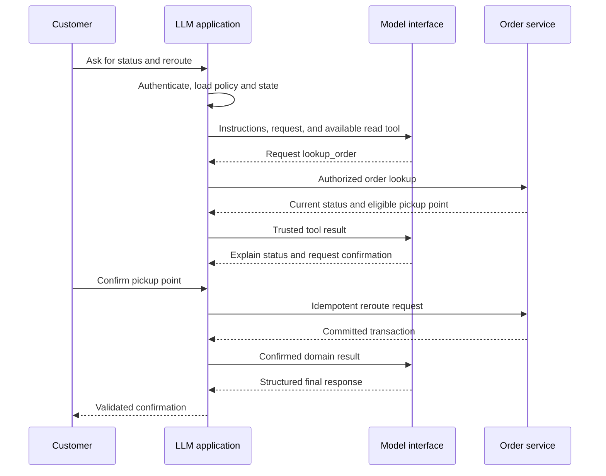
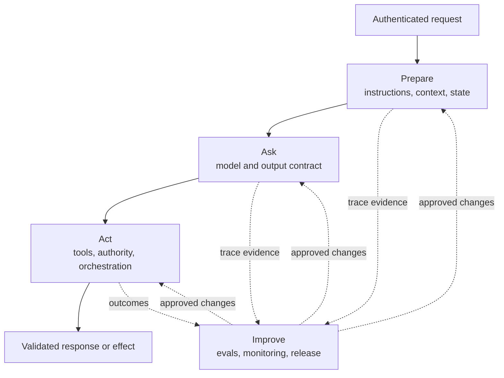
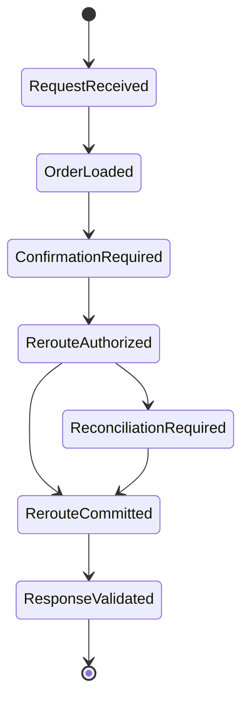
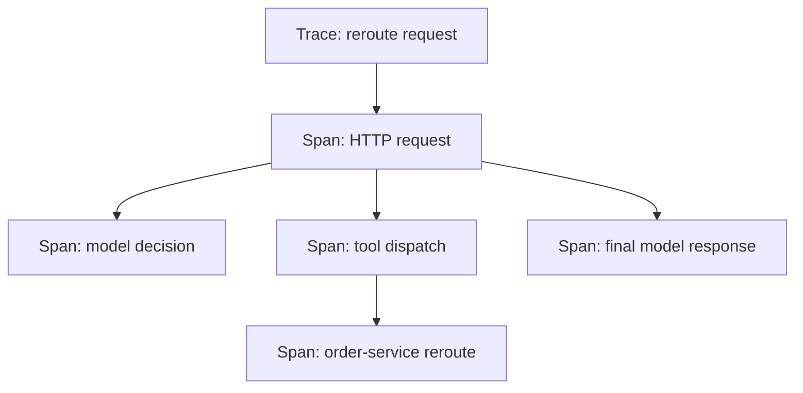
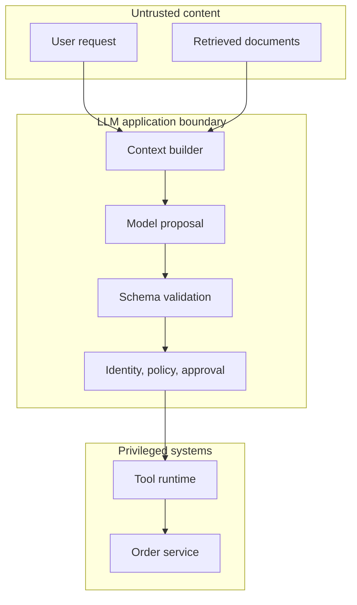
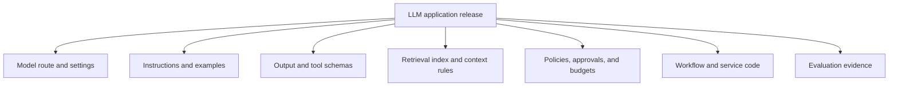
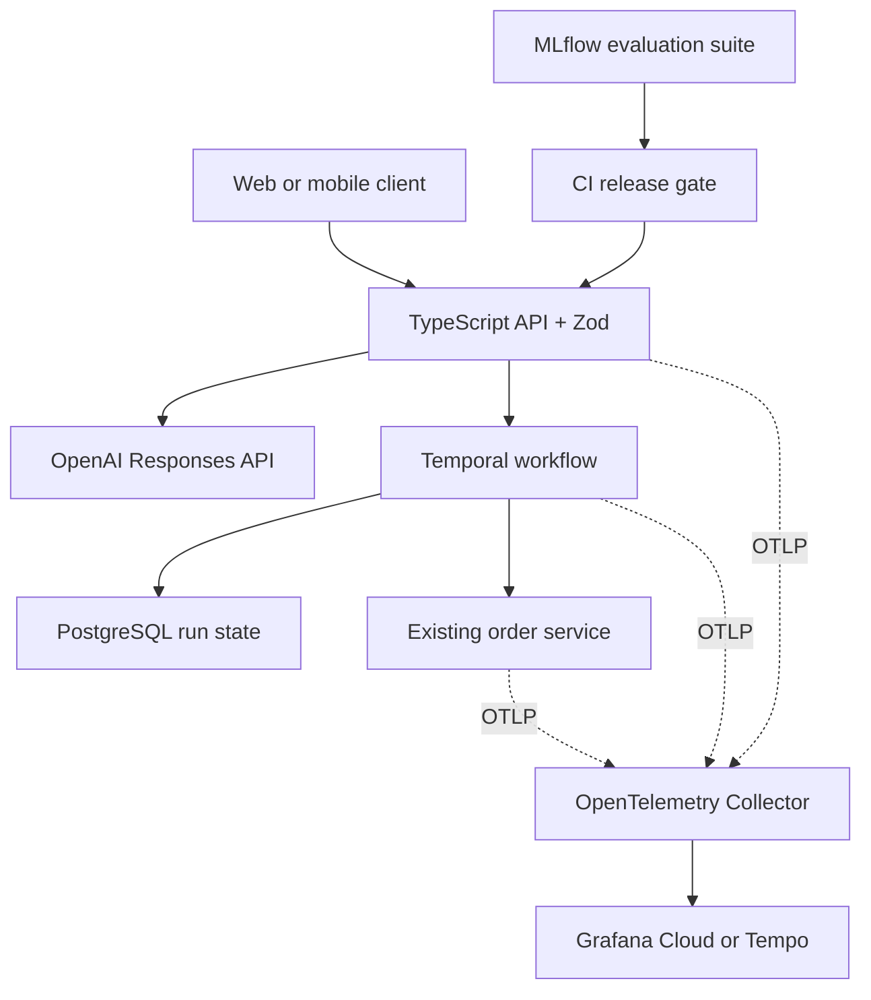

## Table of Contents

1. [See the Whole Application Through One Request](#see-the-whole-application-through-one-request)
2. [Use Four Responsibilities to Understand the Architecture](#use-four-responsibilities-to-understand-the-architecture)
3. [Choose The Information The Model Receives](#choose-the-information-the-model-receives)
4. [Connect The Application To The Model Through One Interface](#connect-the-application-to-the-model-through-one-interface)
5. [Turn Model Proposals Into Controlled Actions](#turn-model-proposals-into-controlled-actions)
6. [Use State and Orchestration to Control the Run](#use-state-and-orchestration-to-control-the-run)
7. [Define Quality With Evaluations](#define-quality-with-evaluations)
8. [Use Observability to Explain Live Behaviour](#use-observability-to-explain-live-behaviour)
9. [Build Safety Into Every Boundary](#build-safety-into-every-boundary)
10. [Release Every Component That Can Change Behaviour](#release-every-component-that-can-change-behaviour)
11. [Map Current Technology Stacks Onto the Framework](#map-current-technology-stacks-onto-the-framework)
12. [Review The Path From User Request To Final Action](#review-the-path-from-user-request-to-final-action)
13. [References](#references)

At a high level, a **large language model application** is software that uses a model to interpret information or propose a response inside a controlled product workflow. The model supplies flexible language judgement. The surrounding application supplies trusted data, permissions, tools, state, validation, measurement, and recovery.

This distinction explains why a polished prototype can still be far from production. A model may produce a convincing answer from one prompt. A real service also needs to know who made the request, which facts are current, which actions are permitted, what happened after a timeout, and whether a new release improves the user outcome.

You can think of the model as one decision-making component inside a larger system. The rest of the architecture makes that component useful, observable, and accountable.

## See the Whole Application Through One Request

<!-- section-summary: One complete support request shows how identity, context, model output, tools, state, validation, and feedback cooperate around the model. -->

A request that needs both language judgement and a real business action exposes the complete architecture. Following it from the user to the committed result reveals which part of the system owns each decision.

Imagine that a customer asks a delivery assistant, “Where is order BC-77124, and can I reroute it to the nearest pickup point?”

The question sounds simple, but it contains two different kinds of work. Finding the delivery status is a read operation. Changing the destination is a side effect that needs authentication, eligibility checks, explicit confirmation, and a recoverable transaction.

The application authenticates the customer before calling a model. It records a request ID and loads a small state object for the conversation. It supplies instructions explaining the assistant's role and exposes a read tool called `lookup_order`. The model requests that tool with the order ID.

Application code adds the authenticated customer ID, checks the tool schema, and calls the order service. The result says that the parcel is in transit and still eligible for pickup-point delivery. The model explains the current status and asks the customer to confirm the proposed pickup point.

After confirmation, the orchestrator exposes a separate write tool, `reroute_order`. The tool receives an idempotency key so a retry cannot create a second change. The order service commits the reroute and returns a transaction reference. The model then produces a structured outcome containing a user-facing message, the confirmed destination, and the transaction reference.

The application validates that outcome, stores the committed state, and returns the response. A trace records the model and tool steps. Later, the final delivery outcome can show whether the reroute actually succeeded and can supply a new evaluation case if the interaction failed.



Responsibility for this interaction is distributed across the system. The model API handles generation and tool requests. Application code owns identity and authorization. The order service owns business truth and the transaction. The orchestrator owns progress and recovery. Evaluation and observability show whether the complete system behaves well.

## Use Four Responsibilities to Understand the Architecture

<!-- section-summary: A production LLM application prepares a working view, asks the model through a contract, acts through controlled services, and improves from evidence. -->

An LLM application can contain many products and libraries, so a long component list obscures how they work together. Four responsibilities provide a simpler framework for understanding the system.

### Prepare The Information The Model Needs

**Prepare** builds the model's working view for the current decision. It combines instructions, authenticated facts, relevant conversation state, retrieved knowledge, and the tools available at this step. Preparation decides which information reaches the model and how each source is labelled.

### Ask The Model For A Typed Response

**Ask** sends that working view through a model interface. The interface identifies the model and runtime settings, then receives text, structured data, or a tool request. Output schemas and tool definitions turn important responses into machine-readable contracts.

### Act Through Trusted Application Code

**Act** interprets the model's proposal inside trusted application code. The system validates arguments, authorizes the operation, calls domain services, records results, and decides whether the model needs another turn. State and orchestration make the run recoverable.

### Improve Through Evaluation And Monitoring

**Improve** uses evaluations, traces, monitoring, and outcome data to guide releases. Teams test expected behaviour before deployment, inspect real runs after deployment, and roll back the complete behaviour bundle if quality or safety degrades.



Safety crosses all four responsibilities. Preparation filters and labels untrusted content. The model interface limits output shapes and available capabilities. The action path enforces real permissions. The improvement loop tests abuse cases and watches live outcomes.

## Choose The Information The Model Receives

<!-- section-summary: Context engineering selects the instructions, trusted runtime facts, retrieved knowledge, and state needed for one model decision. -->

A model can use only the information supplied in its input or obtained through tools. The surrounding organization may hold millions of documents and records, but one decision usually needs a small, carefully selected view. Building that view is called **context engineering**.

### Instructions explain the job

Instructions tell the model its role, objective, boundaries, available evidence, and completion criteria. For the delivery assistant, they may say to use the order tool for current status, request confirmation before a reroute, and avoid exposing internal fraud fields.

Instructions guide model behaviour. Business enforcement still belongs in code and authoritative services. A sentence saying “only show the customer's orders” helps the model respond appropriately, while the order service must also filter every lookup by the authenticated customer identity.

Keep instructions versioned and reviewable. A small wording change can alter tool selection, response length, refusals, and escalation. Reusable examples can clarify difficult judgement, provided they represent the real traffic and remain part of the same release evidence.

### Bring Current Or Private Knowledge Into The Request

**Retrieval** searches an external knowledge source during the request and returns a small set of relevant passages or records. It is useful for policies, product documentation, runbooks, contracts, and other information that changes independently from the model.

A production retrieval result needs more than text. Preserve the source ID, version, access policy, and ranking score. Label retrieved text as evidence, and reserve instruction authority for application-controlled sources. The model can cite a policy paragraph without gaining permission to alter the system's rules.

Retrieval quality and answer quality are separate. If the correct return policy never reaches the model, even excellent reasoning cannot cite it. Teams therefore evaluate search recall and ranking before evaluating the final response.

### Record What Has Actually Happened

**State** is the durable record of the run. In the delivery interaction, it includes the authenticated customer, current step, selected pickup point, confirmation status, tool results, and committed transaction reference.

Conversation history provides useful context; application state remains authoritative. A user may say “I already confirmed,” while the application state shows that confirmation belongs to an earlier proposal. A model message may say “the reroute succeeded,” while the order service has not committed the transaction.

Long histories also create cost and distraction. Store authoritative facts in application state, keep recent conversational details that affect the next decision, and retrieve older evidence through stable references. This approach lets the model see a compact working view while the full audit history remains available elsewhere.

## Connect The Application To The Model Through One Interface

<!-- section-summary: The model interface combines model choice, instructions, input items, structured outputs, and tool requests into a versioned contract. -->

The **model interface** is the boundary between application code and a model provider or serving platform. It sends prepared input and receives typed response items. The provider may expose different names, but most modern interfaces support text or multimodal input, system-level instructions, structured output, streaming, and tool requests.

### Select models with task evidence

Choose a model by measuring it on the task. A small model may handle classification or field extraction with lower latency and cost. A stronger reasoning model may perform better on ambiguous policy interpretation or multi-step investigation. Context length, modality, regional availability, tool behaviour, and data controls also matter.

Benchmark scores and provider labels cannot make the production decision alone. Run representative evaluations on the complete application path. A model that scores well in isolation may call the wrong tool more often, produce slower first tokens, or struggle with the application's schema.

### Use Structured Output For Data The Application Must Read

Free-form text works for a draft shown directly to a person. Software usually needs explicit fields. In the delivery example, the final result can contain `message`, `order_status`, `reroute_status`, and `transaction_reference`.

**Structured output** asks the model to produce data that follows a schema such as JSON Schema. Native schema-constrained generation is stronger than asking for “valid JSON” in an instruction. Schema adherence guarantees shape; application validation still checks meaning. A syntactically valid transaction reference can still point to the wrong customer or a failed operation.

The following TypeScript fragment shows the important boundary with Zod. It validates a model-produced object, then checks the transaction against trusted state before returning it:

```ts
import { z } from "zod";

const DeliveryOutcome = z.object({
  message: z.string(),
  order_status: z.enum(["in_transit", "delivered"]),
  reroute_status: z.enum(["not_requested", "confirmed"]),
  transaction_reference: z.string().nullable()
});

const outcome = DeliveryOutcome.parse(modelOutput);

if (
  outcome.reroute_status === "confirmed" &&
  outcome.transaction_reference !== state.committedTransaction
) {
  throw new Error("MODEL_RESULT_DOES_NOT_MATCH_COMMITTED_STATE");
}
```

This check illustrates two validation layers. Zod verifies the response shape. The comparison with `state.committedTransaction` verifies a business fact. The application also needs explicit states for refusal, missing output, schema failure, and semantic failure so each condition follows a deliberate recovery path.

## Turn Model Proposals Into Controlled Actions

<!-- section-summary: Tools let a model request information or actions, while trusted application code retains execution, credentials, authorization, and transaction control. -->

A **tool** is a named capability described with a purpose and an input schema. The model can request a tool; the runtime decides whether and how to execute it. This distinction is the foundation of safe tool use.

### Use Read Tools To Fetch Current Facts

A read tool can query an authoritative record, such as the current state of an order. Search tools find relevant items in a catalog or document collection, while inspection tools read live deployment information. Every result should expose the smallest useful projection. `lookup_order` may return delivery state and reroute eligibility while omitting payment details, internal fraud scores, and other tenants' information.

Read tools still require authorization and timeouts. They also need stable error meanings. `ORDER_NOT_VISIBLE` can cover a missing or unauthorized order without revealing which case occurred. The model receives enough information to give a safe response, while detailed diagnostics remain in protected logs.

### Control Tools That Change External Systems

Write tools change an external system. The application should validate their schemas, attach trusted identity, enforce policy, and require confirmation or approval where risk demands it. Credentials stay in the tool runtime and never enter model context.

Side effects need **idempotency**, which means repeated delivery of the same operation creates one committed effect. If `reroute_order` times out after the order service commits, the orchestrator can retry with the same idempotency key or query the transaction reference. Without that contract, a network timeout leaves the application unsure whether repeating the call is safe.

The handler below shows where trust enters a write-tool path. The model supplies two schema-checked business fields. The session supplies customer identity, the policy layer authorizes the exact operation, and the runtime derives the idempotency key from durable state.

```ts
const RerouteArgs = z.object({
  orderId: z.string(),
  pickupPointId: z.string()
});

async function executeReroute(toolCall: ToolCall, session: Session, state: RunState) {
  const args = RerouteArgs.parse(toolCall.arguments);
  policy.require("reroute_order", { customerId: session.customerId, ...args });

  return orderService.reroute({
    ...args,
    customerId: session.customerId,
    idempotencyKey: `${state.runId}:reroute`
  });
}
```

Tool names should represent stable domain capabilities. `lookup_order`, `quote_reroute`, and `execute_confirmed_reroute` expose clearer authority and failure boundaries than a general `call_api` tool. MCP can standardize how hosts discover and invoke tools or resources. The business service still owns tenancy, authorization, and transaction semantics.

## Use State and Orchestration to Control the Run

<!-- section-summary: Orchestration decides which step happens next, while durable state lets the application resume, reconcile, and explain the run. -->

The **orchestrator** is the application layer that advances the interaction. After each model or tool result, it decides whether to continue, request user input, execute an approved operation, retry a transient failure, or finish.

### Match control flow to the task

A single model call fits extraction, classification, rewriting, and other tasks with a known input and output. A fixed workflow fits a business process whose steps are understood in advance. An agent loop fits work where the model must choose among several investigations as evidence arrives.

Additional autonomy increases uncertainty, latency, and cost. Begin with the smallest control pattern that satisfies the task. Use fixed transitions for known business stages, reserve model-selected transitions for decisions that genuinely need adaptive judgement, and add durable graph execution only where interruption or branching makes persisted control flow necessary.

### Save Progress After Important Changes

Persist state after events that change what the system knows or what it has committed. Useful checkpoints include `order_loaded`, `confirmation_requested`, `reroute_authorized`, and `reroute_committed`. A stored checkpoint lets the service resume after a crash without replaying every model response.



State also gives failures an owner. A model timeout before any effect can use a bounded retry. A tool timeout after a possible write enters reconciliation. A rejected confirmation returns to the user without calling the write tool. A schema-invalid final response can be repaired or replaced while the committed domain result remains unchanged.

## Define Quality With Evaluations

<!-- section-summary: Evaluations convert product expectations into repeatable cases and graders that guide development and release decisions. -->

An **evaluation**, often shortened to **eval**, runs the application on known cases and scores its behaviour. It answers a practical question: does this version perform the task well enough for the traffic and risk it will face?

Start with the product outcome. For the delivery assistant, successful behaviour means finding the correct order, preserving tenant isolation, requesting confirmation, choosing the correct tool, avoiding duplicate effects, and explaining the final state clearly. Generic language metrics cannot cover those requirements.

Use deterministic graders for facts that code can verify: schema validity, citation presence, exact calculations, allowed tool names, state transitions, and transaction IDs. Model-based graders can assess qualities such as clarity or evidence use after human reviewers confirm that the grader agrees with the intended standard. Human review remains essential for subjective or high-impact judgements.

### Test One Complete Safety Rule At A Time

Suppose the customer asks for a reroute but never confirms the pickup point. The wording of the assistant's response may vary, so the grader focuses on observable behaviour: the read tool runs, the write tool stays blocked, no committed transaction appears, and the response asks for confirmation.

```yaml
case: reroute_requires_confirmation
input: "Move order BC-77124 to the suggested pickup point"
setup:
  order_status: in_transit
  reroute_eligible: true
assert:
  lookup_order_calls: 1
  reroute_order_calls: 0
  committed_transaction: null
  final_state: confirmation_required
```

This case turns a safety principle into a repeatable release check. A companion case supplies confirmation and expects exactly one reroute call with the authenticated customer and one idempotency key.

LLM behaviour is probabilistic, so repeat important cases and compare distributions. Record pass rates, latency, token use, tool errors, and human corrections. Slice results by request type, language, model route, and risk level. A high overall score can hide a serious failure in one customer segment.

Production traces should continuously add evaluation cases. A reroute that failed because a pickup point closed, an unusual multilingual request, or a tool error handled poorly can become a regression test. This keeps the evaluation set connected to real use instead of freezing around launch examples.

## Use Observability to Explain Live Behaviour

<!-- section-summary: Traces reconstruct individual runs, metrics summarize system health, and product outcomes reveal whether the application helped the user. -->

Observability shows what the released system is doing. LLM applications need ordinary service telemetry and application-specific evidence because a request can return HTTP `200` while producing a poor answer or an incorrect tool choice.

A **trace** follows one request across model calls, retrieval, tools, state transitions, approvals, and domain services. Each operation is represented by a **span** with timing and relevant attributes. OpenTelemetry provides a vendor-neutral way to emit traces and metrics, with evolving semantic conventions for generative AI operations.

### A trace is a tree of timed operations

The root span measures the complete request. Child spans measure the model call, tool dispatch, and order-service request. This parent-child structure shows both total latency and the component responsible for a delay or failure.



Useful trace metadata starts with the application release, model route, and prompt version. Retrieval spans record source IDs, while tool spans record the requested capability and its outcome. Run-level attributes connect state transitions and the final result with token use and latency.

Inputs and outputs can contain personal or confidential data. Redaction removes or masks fields outside the operator's diagnostic need. Access controls limit who can inspect retained content, while sampling and retention policies control how much is stored and for how long.

Metrics summarize many runs. Service metrics cover latency, error rate, traffic, and saturation. LLM-path metrics cover tool-selection errors, schema failures, retrieval misses, escalation, refusals, token use, and cost. Product outcomes show whether the user achieved the goal, such as a successful reroute or a repeated support contact.

These signals answer different questions. A trace explains one delayed request. A metric shows that tool latency increased across the service. Outcome data reveals that users still abandon the reroute flow despite healthy infrastructure. Connecting all three prevents teams from treating “the API is up” as proof that the LLM feature works.

## Build Safety Into Every Boundary

<!-- section-summary: Safety combines identity, data controls, prompt-injection resistance, tool authorization, output handling, human review, and incident response. -->

Safety is a system property. A content filter can identify some harmful text, but it cannot enforce tenant isolation, prevent duplicate payments, validate a deployment command, or decide which customer records a tool may read.

Begin with a threat model for the use case. Identify untrusted inputs, sensitive data, available actions, high-impact decisions, external dependencies, and likely misuse. NIST's Generative AI Profile organizes risk work across governance, mapping, measurement, and management, which helps teams connect technical controls to the wider product lifecycle.

Treat user input and retrieved documents as untrusted content. A policy document may contain text that tells the model to ignore earlier instructions. Context assembly should label its origin, restrict access, and keep system authority outside that content. Prompt-attack detectors can add a useful signal, while authorization and tool design remain the decisive controls.

The strongest boundary sits between model output and privileged execution. User text and retrieved documents can influence a proposal. They cannot cross into the order service until trusted code validates the schema, restores authenticated identity, applies policy, and records approval.



Enforce least privilege at action time. The model receives only tools relevant to the current step. Tools use workload identity or a server-side credential with narrow scope. High-impact proposals require explicit confirmation or approval bound to the exact action. Sandboxes and network policy contain code execution or browser automation.

Validate outputs before rendering, storing, or executing them. Escape generated HTML, parameterize database operations, scan generated files where appropriate, and verify citations or transaction references against authoritative data. Release tests should cover prompt injection, data exfiltration, excessive agency, malformed tool calls, and failure recovery.

## Release Every Component That Can Change Behaviour

<!-- section-summary: A production release identifies every model, instruction, schema, tool, retrieval source, policy, and runtime rule that can change behaviour. -->

Changing an LLM application means more than changing the model. Instructions, examples, output schemas, tool descriptions, retrieval indexes, routing rules, safety policies, and orchestration limits can all alter the result.

Treat these dependencies as one **behaviour bundle**. Give each approved combination a release identity so a trace can reconstruct what produced a response. The bundle can reference separately versioned components, but production needs one top-level identity that ties them together.



The release path follows risk. Run unit and contract tests, then representative and adversarial evals. Compare the candidate with the current production version. Use shadow traffic or a canary where appropriate, watch quality, latency, cost, safety, and product outcomes, and keep a tested rollback target.

Rollback must match the changed layer. A prompt regression may restore an earlier prompt bundle. A retrieval problem may restore the previous index. A broad behavioural change may require rolling back the whole application release. Every rollback target therefore needs the component versions, migration compatibility, and evaluation evidence required to restore service safely.

## Map Current Technology Stacks Onto the Framework

<!-- section-summary: Provider APIs and open-source platforms implement parts of the architecture; teams still assign ownership across every layer. -->

The framework separates stable application responsibilities from products that change over time. This lets a team adopt managed services or open-source components without losing sight of identity, state, authority, and release evidence. The following choices illustrate how widely used stacks fit those responsibilities.

At the model-interface layer, common managed choices include OpenAI's Responses API, Anthropic's Messages API, Google models through the Gen AI SDK and Vertex AI, and Amazon Bedrock's Responses, Messages, or Converse interfaces. These APIs expose related primitives with different request objects, state options, tool integrations, and data controls. Choose from measured task fit, compliance, regional availability, latency, cost, and operational support.

For application contracts, JSON Schema is the shared foundation. TypeScript teams commonly validate with Zod; Python teams often use Pydantic. Provider-native structured output and strict tool schemas constrain generation, while application validators and domain services verify meaning.

Managed retrieval options include provider file search, cloud knowledge bases, and governed platforms such as Databricks Vector Search. Teams that operate their own search layer commonly use Elasticsearch, OpenSearch, or PostgreSQL with `pgvector`.

Access control determines which sources each user may search. Freshness determines how quickly changed documents reach the index. Citation requirements call for stable source identities, while scale and the existing data platform narrow the engine choice.

A vector database supplies similarity search. The application still needs an ingestion path and permission filtering. It must also preserve source identity, combine retrieval with ranking, and evaluate whether the right evidence reaches the model.

State usually belongs in an application database such as PostgreSQL, with Redis used for short-lived caching or coordination. Ordinary application code is a sound default for short flows. Temporal or a cloud workflow service fits durable known processes. LangGraph fits stateful graph-shaped agent execution whose transitions and checkpoints need inspection.

OpenTelemetry is the common observability foundation, feeding cloud monitoring or platforms such as Grafana, Datadog, and Honeycomb. LLM-focused tracing and evaluation can come from managed provider tools or platforms such as MLflow, LangSmith, Arize Phoenix, Braintrust, and Weights & Biases Weave. The important requirement is stable run and release identities across whichever tools the team chooses.

Managed safety services can classify content or prompt attacks, and cloud IAM can control service access. Application policy then decides how to use those signals. Authorization limits real capabilities, sandboxes contain risky execution, output validation protects consumers, and human review covers selected high-impact decisions.

For the delivery scenario, one concrete implementation can map the framework to widely used components. A TypeScript API validates contracts with Zod and calls the OpenAI Responses API. Temporal persists the confirmation and reroute workflow, while PostgreSQL stores application state and the existing order service owns the transaction. OpenTelemetry sends spans through the Collector to Grafana Cloud or a Tempo backend, and MLflow runs the trace-based evaluation suite in CI.



Treat this as one implementation. A team can replace the model provider, workflow engine, telemetry backend, or evaluation platform while keeping the same identities and contracts at each boundary.

## Review The Path From User Request To Final Action

<!-- section-summary: A strong LLM foundation keeps model judgement visible while trusted software owns identity, authority, state, evidence, and recovery. -->

Review an LLM architecture by following one authenticated request from its input to the final action and evidence. At each step, identify which component supplied the facts, authorized the action, and recorded the effect. The four-responsibility framework turns that walkthrough into a practical review method:

1. **Prepare:** Can the team explain which instructions, facts, retrieved sources, state, and tools reach the model?
2. **Ask:** Is the model interface versioned, and do important outputs use explicit contracts?
3. **Act:** Does trusted code validate, authorize, execute, persist, and recover every external effect?
4. **Improve:** Do evals, traces, monitoring, outcomes, and release identities describe the complete behaviour?

An unclear answer reveals a real design gap. Missing source identity points to context. A tool with broad credentials points to action control. Lost progress points to state and orchestration. A regression that reaches every user points to evaluation or release practice.

That is the foundation of a production LLM application: probabilistic model judgement inside an engineered path whose information, authority, lifecycle, evidence, and recovery remain understandable.

## References

- [OpenAI: Migrate to the Responses API](https://developers.openai.com/api/docs/guides/migrate-to-responses)
- [OpenAI: Structured model outputs](https://developers.openai.com/api/docs/guides/structured-outputs)
- [OpenAI: Function calling](https://developers.openai.com/api/docs/guides/function-calling)
- [OpenAI: Evaluation best practices](https://developers.openai.com/api/docs/guides/evaluation-best-practices)
- [Anthropic: Building effective agents](https://www.anthropic.com/engineering/building-effective-agents)
- [Anthropic: Messages API](https://platform.claude.com/docs/en/api/messages)
- [Google Cloud: Function calling](https://docs.cloud.google.com/gemini-enterprise-agent-platform/models/tools/function-calling)
- [Amazon Bedrock: Supported inference APIs](https://docs.aws.amazon.com/bedrock/latest/userguide/apis.html)
- [Model Context Protocol specification](https://modelcontextprotocol.io/specification/latest)
- [OpenTelemetry semantic conventions](https://opentelemetry.io/docs/specs/semconv/)
- [OpenTelemetry Collector](https://opentelemetry.io/docs/collector/)
- [Temporal documentation](https://docs.temporal.io/)
- [Zod documentation](https://zod.dev/)
- [MLflow: Evaluating production traces](https://www.mlflow.org/docs/latest/genai/eval-monitor/running-evaluation/traces/)
- [NIST Generative AI Profile](https://nvlpubs.nist.gov/nistpubs/ai/NIST.AI.600-1.pdf)
