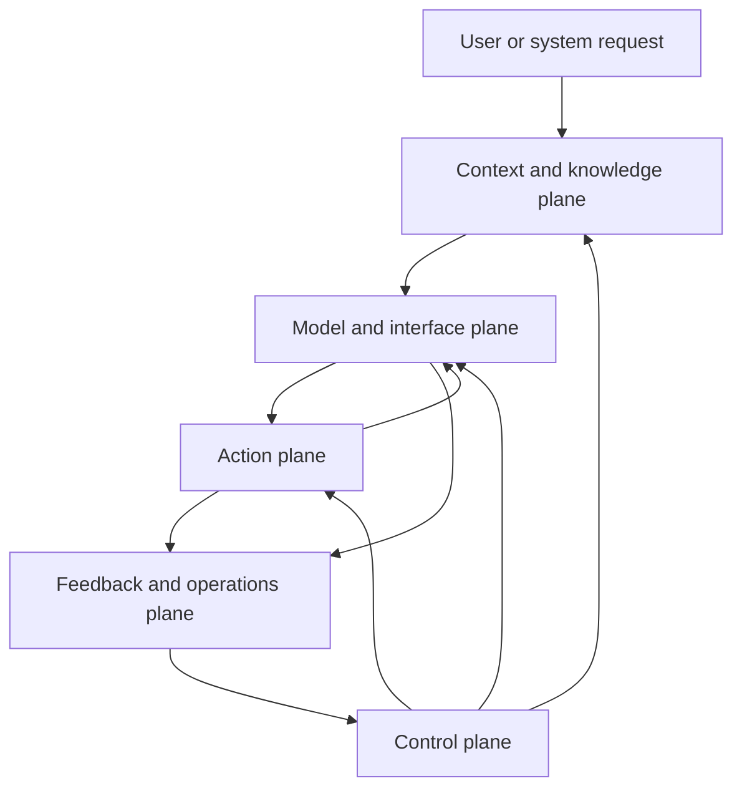
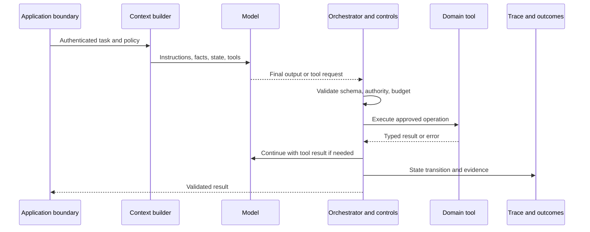
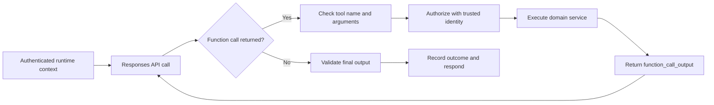

## An LLM System Is More Than A Model Call
<!-- section-summary: A production LLM system surrounds model judgement with context, action, state, control, and feedback owned by application software. -->

A **large language model (LLM)** accepts instructions and input, then produces language or structured items such as tool calls. An **LLM system** is the application that decides which input the model receives, which actions it may request, how those actions execute, what state survives, and how the team measures the result.

A prompt-only prototype can answer a question or produce a draft. Production work adds requirements the model cannot satisfy by itself. Customer identity must come from authentication. Current policy must come from a governed source. A tool request needs schema validation and authorization. Long-running work needs state and recovery. Important actions need approval. Released behaviour needs traces, evaluations, budgets, and rollback.

The model remains important, but it occupies one position inside a larger execution path. System quality therefore depends on the interaction among five planes:

1. **Model and interface plane** — model selection, instructions, input and output contracts.
2. **Context and knowledge plane** — runtime facts, retrieval, conversation history, state projection, and memory.
3. **Action plane** — tools and business services through which the system reads or changes the environment.
4. **Control plane** — orchestration, identity, permissions, validation, approvals, isolation, and budgets.
5. **Feedback and operations plane** — traces, evaluations, monitoring, release, cost, and incident recovery.

These planes form the framework for modern LLM applications. A provider SDK may combine several of them, while responsibility stays with the product team.



The vertical relationship is important. The control plane surrounds model, context, and action rather than appearing as one final safety check. The feedback plane observes the whole path and feeds evidence into release and policy decisions.

## Follow The Execution Path Before Choosing Tools
<!-- section-summary: A provider-neutral run lifecycle reveals which system owns every decision and effect. -->

Every LLM feature can be understood through one execution path.

The request first enters through an application boundary. The system authenticates the caller, establishes tenant and policy context, and records the task identity. A context builder then selects instructions, trusted runtime facts, relevant state, retrieved knowledge, and currently available tools. The model receives that prepared input and returns either a final result, a structured object, or a requested action.

If the model requests a tool, application code validates the arguments, checks authority, executes the domain operation, and records the result. The orchestrator decides whether another model step is needed, whether a person must review the proposal, or whether the run can end. State is updated at meaningful transitions. The final response is validated for the product surface, then the trace and outcome feed evaluation and monitoring.

This lifecycle separates language judgement from system authority. The model may infer that a refund is appropriate. The application establishes the customer and order, the policy service evaluates eligibility, an approval system handles exceptions, and the payment service owns the transaction. Fluent output never substitutes for authenticated state or a committed effect.

The same path fits a coding agent. The request identifies a repository and task. Context points to architecture and relevant code. Tools expose files, shell, tests, and a browser inside an isolated workspace. An orchestrator controls edits and verification. Evidence contains the diff, test results, trace, and review decision.



## The Model And Interface Plane Defines The Reasoning Contract
<!-- section-summary: The model interface specifies instructions, input items, structured outputs, and tool requests while preserving application ownership. -->

The model plane covers model choice first. Teams should select a model from measured task quality, latency, cost, context needs, modality, and tool behaviour. A more capable model can reduce orchestration complexity for difficult judgement, while a smaller model may serve narrow classification or extraction more efficiently. Model routing should follow evaluation rather than provider marketing labels.

Instructions describe the task, priorities, constraints, and completion criteria. They should remain versioned because a wording change can alter tool use and escalation. Stable policy belongs in authoritative services as well as legible instructions; the prompt helps the model reason, while application code enforces the rule.

Input and output are contracts. Free-form text is appropriate when the product displays a draft directly. Structured output is preferable when code consumes fields such as category, citations, proposed action, or confidence. A schema constrains shape, not truth. The system must still verify values, references, and business conditions.

Current OpenAI applications commonly use the Responses API, which represents messages, tool calls, tool outputs, and other model items in a unified response flow. Other providers expose related primitives. The durable architecture is the same: the provider produces model output, while the application owns execution and authority.

## The Context And Knowledge Plane Builds The Model's Working View
<!-- section-summary: Context assembly selects trusted facts, retrieved knowledge, state, and tool descriptions for the current decision. -->

The model can reason only over information included in its current input or accessible through tools. The environment may contain millions of documents and records, so the application needs **context engineering**: selecting, ordering, labeling, and trimming the material needed for one decision.

Context usually contains stable instructions, user input, authenticated runtime facts, a projection of run state, retrieved documents, tool descriptions, and recent results. These sources need distinct trust labels. A customer message or retrieved web page is untrusted content. Tenant identity and authorization come from the application. A document can supply evidence without gaining authority to rewrite system instructions.

Retrieval supplies current or private knowledge at request time. A useful retrieval system preserves source IDs, versions, effective dates, ownership, and access controls. Chunking and ranking quality matter because the answer model cannot cite evidence the retrieval step failed to find. Retrieval evaluations should therefore measure source recall and ranking separately from final-answer quality.

Conversation history is one context source. **State** records authoritative progress for the current run. **Memory** retains selected information across runs under a policy. Mixing these concepts produces subtle bugs: a transcript may say that an action was requested, while only a domain service can confirm it completed.

Context has a budget even when a model supports a large window. Excess material increases cost and can distract from relevant instructions. Progressive disclosure provides a small map first, then retrieves deeper knowledge when the task reaches it. Compaction can summarize earlier material while retaining references to authoritative records.

## The Action Plane Connects Language To Real Systems
<!-- section-summary: Tools expose narrow, typed capabilities while domain services retain validation, authorization, and transaction ownership. -->

A **tool** is a structured capability the model can request. Read tools retrieve orders, documents, logs, or search results. Write tools create tickets, send messages, change configurations, or trigger workflows. The action plane is where an LLM feature gains practical value and where operational risk increases sharply.

A production tool contract includes a purpose, schema, trusted runtime context, permission rule, timeout, retry policy, error categories, and side-effect semantics. Credentials remain outside model context. Identity comes from the authenticated run rather than from model-supplied arguments.

Read operations can often be retried safely. Side effects need idempotency or reconciliation. **Reconciliation** means querying the authoritative service after an uncertain outcome to learn whether the effect committed. If a network timeout follows a payment request, the system cannot assume failure. The payment service should accept an idempotency key and return the earlier transaction on replay. The orchestrator records the committed result before continuing.

Tool granularity balances clarity and business safety. Tiny primitives can force the model to reconstruct a transaction from fragile steps. One universal business tool hides authority and failure semantics. Stable domain capabilities such as `lookup_order`, `quote_refund`, and `execute_approved_refund` usually create better boundaries.

The Model Context Protocol can standardize how a host discovers tools and resources. It does not define the product's authorization, tenancy, approval, privacy, or side-effect policy. Those remain system responsibilities.

## The Control Plane Owns Lifecycle And Authority
<!-- section-summary: Orchestration and enforced controls determine how a run advances and what it is permitted to do. -->

The **orchestrator** decides what happens after each model or tool result. A simple application may use one model-tool loop. A known business process may use a fixed workflow with a bounded agent step. Long-running stateful work may use a graph runtime or durable workflow engine.

The choice follows duration, branching, side effects, interruption, and recovery. A short read-only assistant can often restart safely. A run that waits for human approval or commits external actions needs durable state, checkpoints, and explicit transitions. The harness-engineering module develops these choices in depth.

Controls enforce the run's real authority. Input validation, scoped identity, retrieval filtering, tool authorization, sandboxes, network policy, rate limits, cost budgets, human approval, output validation, and audit all address different failures. A single generic guardrail cannot replace these layers.

Human review should protect decisions that need human judgement or carry high impact. Reviewers need the exact proposal, evidence, reason for escalation, and available alternatives. Approval binds to a version or hash; a changed proposal requires a new decision. Routine low-risk work should remain automated so human attention does not degrade into ceremonial clicking.

The control plane also owns cancellation and fallback. A run that reaches a deadline or budget stops new work, releases resources, and reports committed effects honestly. When the model, retrieval, or tool path fails, the product may return a bounded answer, use a deterministic rule, queue human review, or preserve the current production behaviour.

## The Feedback Plane Separates Traces, Evals, And Monitoring
<!-- section-summary: Traces explain individual runs, evaluations compare expected behaviour, and monitoring measures live operation and outcomes. -->

A **trace** reconstructs one run. It connects model and prompt versions, context sources, tool calls, state transitions, approvals, errors, latency, token use, cost, and final outcome. Sensitive inputs and outputs need redaction, access control, and retention limits.

An **evaluation**, or eval, tests behaviour against cases and criteria. Deterministic graders can check schemas, citations, tool restrictions, and exact calculations. Model-based graders can assess nuanced qualities after calibration. Human reviewers remain important for high-risk or subjective decisions. Stochastic systems need repeated trials and distributions rather than one lucky run.

Monitoring measures released behaviour. Service metrics cover latency, errors, and saturation. LLM-specific signals cover tool failures, retrieval quality, escalation, refusal, token use, and cost. Product outcomes determine whether the feature helps users. A release can remain technically healthy while answer quality or decision impact degrades.

These three views connect through stable identities. A bad production trace can supply a new eval case. An eval regression can block a release. Monitoring can reveal that the eval set no longer represents current traffic. Feedback improves the system only when failure is assigned to the correct layer—context, model, tool, control, environment, or product policy.

## Simple Calls, Workflows, And Agents Use The Same Planes
<!-- section-summary: Autonomy changes who selects the next step, while the system planes and production responsibilities remain. -->

A **simple call** has a known input and output. Classification, extraction, rewriting, and summarization often fit this pattern. The application owns the sequence.

A **workflow** connects several known steps. Code may retrieve evidence, call a model for extraction, validate the result, and write an artifact. A model participates without controlling the entire path.

An **agent** chooses among tools or substeps as new evidence arrives. This is useful when the path cannot be fully specified in advance. Agency increases the importance of state, limits, tool semantics, and evaluation because more control-flow decisions are probabilistic.

Start with the least autonomous pattern that solves the task. A fixed workflow is easier to test and operate when the path is known. Add an agent loop where adaptive judgement improves outcomes. Add durable orchestration when the run must survive interruption or coordinate side effects.

## A Current API Maps Onto The Framework
<!-- section-summary: The Responses API can implement model, tool, and continuation primitives after the application framework is clear. -->

The OpenAI Responses API can produce function calls as typed response items. The application reads those items, validates the requested capability, executes the trusted domain operation, and returns a `function_call_output` linked by `call_id`. The model can then produce a final response from the tool result.

The API supplies the model interaction primitive. The application still supplies the run boundary. That distinction can be shown before any code:



The following server-side fragment defines one strict read tool. It stays small because the purpose is to show the interface, not to hide the architecture inside a full handler.

```ts
import OpenAI from "openai";

const client = new OpenAI();

const response = await client.responses.create({
  model: process.env.SUPPORT_MODEL!,
  instructions: "Draft a support answer. Use tools for current order facts.",
  input: "Where is order BC-77124?",
  tools: [{
    type: "function",
    name: "lookup_order",
    description: "Return support-safe status for one authenticated customer's order.",
    strict: true,
    parameters: {
      type: "object",
      properties: { order_id: { type: "string" } },
      required: ["order_id"],
      additionalProperties: false
    }
  }]
});
```

The first response can either contain a final answer or request `lookup_order`. A request is a proposal, not permission. Application code should accept only the declared tool name, parse arguments against the same schema, and combine `order_id` with a trusted `customerId` from the authenticated session. The model must not supply the customer boundary.

The domain service returns a support-safe projection such as order ID, status, and estimated delivery. Internal payment, fraud, and warehouse fields stay outside model context. A missing or unauthorized order can use one stable `ORDER_NOT_VISIBLE` result so the response does not reveal whether another customer owns the identifier.

After execution, the application returns a `function_call_output` using the original `call_id`. It may use `previous_response_id` to continue the provider-side response flow, or send the needed prior items explicitly when its storage and retention design requires that. Either choice is conversation transport. The application still persists its own run ID, release identity, authorization result, tool outcome, and committed state.

Failures should remain distinct:

| Failure | Meaning | Control response |
| --- | --- | --- |
| Invalid arguments | Model output violated the tool contract | Reject or allow one bounded repair turn |
| Unexpected tool | Requested capability was not exposed | Stop and record a contract failure |
| `ORDER_NOT_VISIBLE` | Authoritative domain result | Continue with a safe user explanation |
| Transient read failure | Dependency may recover | Apply a short application retry policy |
| Timeout after a write | Commit status is uncertain | Reconcile using a stable idempotency key |
| Turn or cost limit | Run exceeded its budget | Stop new work and report known state |

Tests should protect the boundary rather than mirror SDK syntax. One test verifies that authenticated customer identity is added by the application. Another verifies that the tool projection excludes restricted fields. A third returns an unexposed tool name and confirms that no domain call or final answer occurs. A write-tool test simulates a timeout after commit and confirms that reconciliation finds the earlier operation instead of repeating it.

File search, structured outputs, conversation continuation, and an agent SDK can add useful provider capabilities. They map onto context, interface, state, and orchestration responsibilities that the application still has to design.

## Production Release Treats The Whole System As A Version
<!-- section-summary: A release identifies the model, instructions, tools, knowledge, controls, and evaluation evidence that produce behaviour. -->

Changing the model is only one kind of LLM-system release. A prompt edit, tool-schema change, retrieval-index rebuild, memory policy, routing rule, or approval threshold can alter behaviour. Release evidence should identify these components together.

Before wider traffic, the team runs representative and adversarial evals, checks latency and cost, verifies tool and approval paths, and compares the candidate with the current system. A canary limits exposure while traces and product signals reveal live behaviour. Rollback may restore a prompt version, model route, tool configuration, retrieval index, or entire service release.

Cost control belongs to the same release process. Teams reduce irrelevant context, use caching where current provider semantics and economics justify it, route tasks only after evals, batch offline work, and cap turns or output. Dashboards connect spend to workflow, model, prompt, tenant, and successful outcome rather than showing one unexplained provider bill.

## The Architecture Holds The Model Accountable
<!-- section-summary: A modern LLM product is operable when every model decision is connected to context, authority, state, evidence, and recovery. -->

The five-plane framework gives each failure a home. Missing evidence points to context or retrieval. An unreasonable plan points to model behaviour or instructions. An unsafe accepted action points to tool or control design. Lost progress points to orchestration and state. An undetected regression points to evaluation, monitoring, or release practice.

That is the practical shift from an LLM demo to an LLM system. The model supplies probabilistic judgement inside a product whose interfaces, authority, lifecycle, evidence, and recovery remain engineered and reviewable.

## References

- [OpenAI: Migrate to the Responses API](https://developers.openai.com/api/docs/guides/migrate-to-responses)
- [OpenAI: Function calling](https://developers.openai.com/api/docs/guides/function-calling)
- [OpenAI: File search](https://developers.openai.com/api/docs/guides/tools-file-search)
- [OpenAI: Retrieval](https://developers.openai.com/api/docs/guides/retrieval)
- [OpenAI: Evaluation best practices](https://developers.openai.com/api/docs/guides/evaluation-best-practices)
- [OpenAI Agents SDK: Running agents](https://openai.github.io/openai-agents-python/running_agents/)
- [OpenAI Agents SDK: Tracing](https://openai.github.io/openai-agents-python/tracing/)
- [OpenTelemetry: Semantic conventions](https://opentelemetry.io/docs/specs/semconv/)
