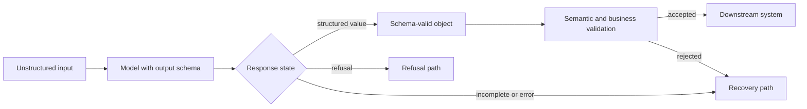
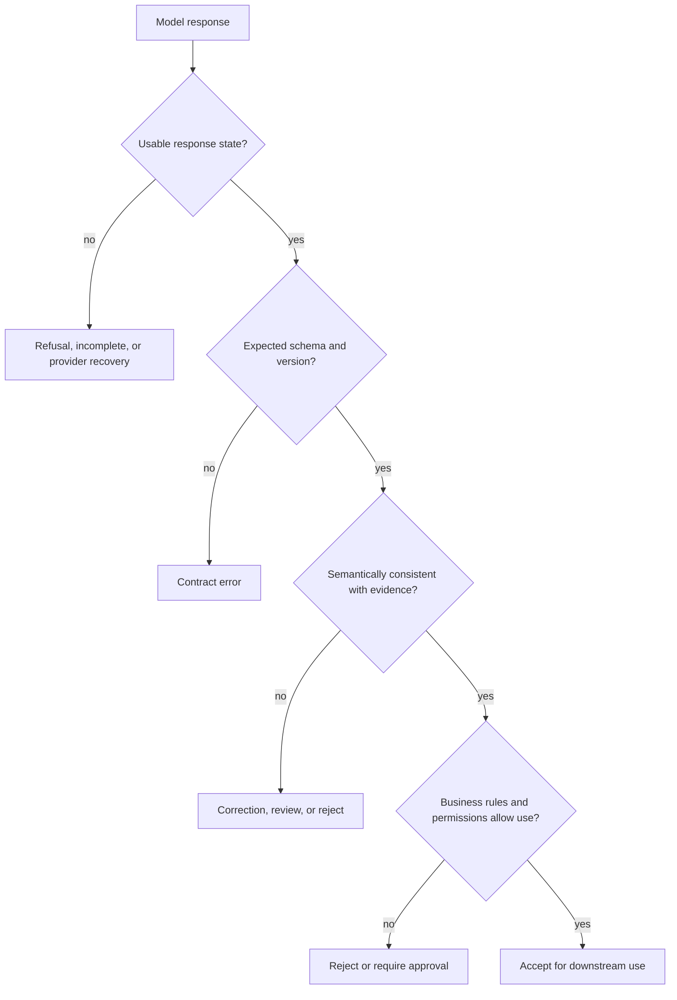
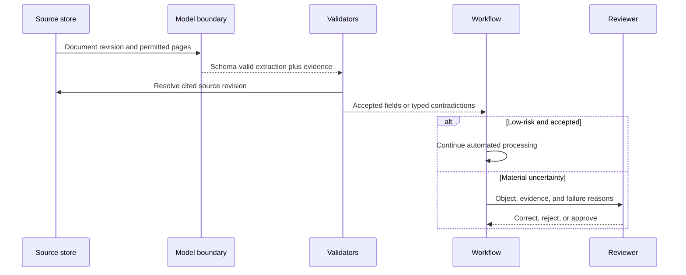
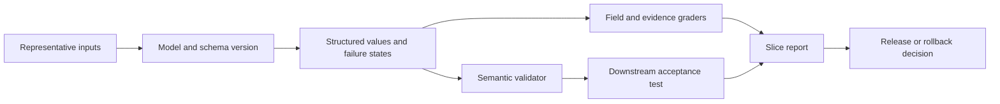

## Structured Output Is an Interface Boundary

<!-- section-summary: Structured output lets a model return data through a defined schema so application code can consume it without parsing prose. -->

An LLM can explain an invoice in natural language, but a billing workflow may need fields such as invoice number, currency, line items, and total. Asking for "JSON" in a prompt is not enough: the model may omit a key, change a field name, invent an enum value, or wrap the object in prose.

**Structured output** constrains the response to a schema, usually JSON Schema. This creates a typed boundary between probabilistic model generation and deterministic software. The application can parse the response into a known shape and route it to validation, storage, or another workflow step.



The crucial limit is in the name: the feature guarantees **structure**, not **truth**. An object can satisfy every type and still contain the wrong invoice number, an unsupported diagnosis, or a date that violates business policy. Schema conformance is the first gate in a larger data contract.

## Decide What the Object Means Before Writing the Schema

<!-- section-summary: A useful schema represents one downstream decision or artifact with explicit meaning and ownership. -->

Begin with the consumer. What will it do with the result? Which fields are required to make that decision? Which values are unknown, optional, or not applicable? Which mistakes would be dangerous?

A strong target object has one clear purpose. An extraction result, routing decision, UI component description, and tool proposal should normally be separate schemas because they have different validation and ownership. A giant object called `analysis` often hides several decisions inside free-form strings.

For each field, define:

- its business meaning, not only its data type;
- whether absence is allowed and what absence means;
- the valid units, timezone, currency, or identifier namespace;
- where the value must come from;
- which system validates it after generation;
- whether downstream code may act on it automatically.

This work reveals problems that prompt changes cannot solve. If reviewers disagree about the allowed risk categories, the schema has exposed a missing product definition. If the source document does not contain a reliable customer ID, the model should return `null` or an explicit status rather than infer one.

## Use the Schema to Remove Ambiguity

<!-- section-summary: Narrow types, enums, required fields, and explicit absence make the model-software contract easier to test. -->

JSON Schema can express objects, arrays, strings, numbers, booleans, required properties, enums, ranges, and nested structures. Provider-supported subsets vary, so check current documentation and validate the schema before release.

Consider an invoice extraction result:

```json
{
  "type": "object",
  "additionalProperties": false,
  "properties": {
    "document_status": {
      "type": "string",
      "enum": ["invoice", "not_invoice", "unreadable"]
    },
    "invoice_id": { "type": ["string", "null"] },
    "currency": { "type": ["string", "null"] },
    "total_minor": { "type": ["integer", "null"], "minimum": 0 },
    "evidence": {
      "type": "array",
      "items": {
        "type": "object",
        "additionalProperties": false,
        "properties": {
          "field": { "type": "string", "enum": ["invoice_id", "currency", "total_minor"] },
          "page": { "type": "integer", "minimum": 1 },
          "source_text": { "type": "string", "maxLength": 200 }
        },
        "required": ["field", "page", "source_text"]
      }
    }
  },
  "required": ["document_status", "invoice_id", "currency", "total_minor", "evidence"]
}
```

Several design choices matter more than the syntax. `document_status` gives the model a valid way to say that the input is not usable. Nullable fields distinguish missing evidence from an empty string. Money uses integer minor units rather than binary floating-point. Evidence carries a page and short source excerpt so a reviewer can verify important values. Extra properties are forbidden so the contract does not expand silently.

Avoid fields such as `confidence: 0.92` unless you have shown that the value is calibrated against labelled data. A model-generated confidence number is not automatically a probability. Often, evidence availability, extraction status, or a separate calibrated verifier is more useful.

## Understand the Four Validation Layers

<!-- section-summary: Structure, semantics, business rules, and authority are separate checks with different failure meanings. -->

### 1. Transport and response state

First determine whether the request completed and whether the provider returned a structured value, a safety refusal, or an incomplete response. Refusal and truncation should be first-class states. Do not send them through the parser as if they were malformed business data.

### 2. Schema conformance

The value must match the expected schema and version. Native structured-output features can enforce this for supported schemas. When using plain JSON mode or another provider, the application still needs validation and may receive syntactically valid JSON with the wrong shape.

### 3. Semantic validation

Check relationships that the schema cannot express or that depend on the source. Line-item totals should reconcile with the document total. Evidence for `invoice_id` should actually contain that identifier. A start date should not be after an end date. Identifiers should resolve in the expected system.

### 4. Business and authority validation

Before any side effect, apply current domain rules and permissions. An extracted refund amount may be correct but above the caller’s approval limit. A medical classification may require human review regardless of schema validity. Structured output never grants authority.



Keeping the layers separate makes failures diagnosable. A contract error belongs to the model-interface team. A source contradiction may belong to extraction quality. A policy rejection can be correct system behaviour rather than a model failure.

## Follow One Object From Source to Consumer

<!-- section-summary: A structured object gains meaning from its source evidence, validation record, version, and downstream use rather than from JSON shape alone. -->

The easiest way to see the complete boundary is to follow one field. Suppose the invoice image contains `Total due: £1,248.50`. The model emits `currency: "GBP"` and `total_minor: 124850`. Schema validation confirms that one field is a supported string and the other is a non-negative integer. Those checks still leave several questions open: Did the model read the grand total or a subtotal? Did it infer GBP from the symbol correctly? Does the evidence point to the same page and region? Does the purchase-order system accept this currency for the supplier?

A production extraction record should therefore travel with an **evidence and validation envelope**. The envelope can contain the schema version, source document identity and digest, model-system version, evidence locations, semantic-validator results, and final disposition. The business object stays small, while the envelope makes its derivation reviewable.



This trace clarifies the boundary between **generation** and **commit**. Generation proposes a typed interpretation. Commit means a downstream system has accepted that interpretation under its own rules. The workflow should retain both states. If a reviewer changes `total_minor`, keep the original proposal, the corrected value, the reason, and the reviewer identity. That record can later supply evaluation data without pretending the first extraction was correct.

Derived fields need the same care. If the application computes tax variance from extracted amounts, record that the arithmetic came from deterministic code rather than the model. If a model classifies the invoice into a cost centre, record the source evidence and classifier version separately. Combining extracted, inferred, and computed values into one unlabeled object makes error analysis difficult.

The consumer should also declare how much certainty it needs. A search index may accept a partially populated object and mark missing fields. An automated payment workflow may require exact supplier identity, reconciled totals, currency agreement, and a purchase-order match. The same schema can serve both consumers only when the acceptance policy remains outside the object and each decision records which policy ran.

This end-to-end view explains why a high schema-validity rate can coexist with poor product outcomes. The model may consistently produce valid fields from the wrong document region, the evidence resolver may point at a superseded document, or the workflow may commit objects that a reviewer would reject. Measure each transition so improvements target the owning layer.

## Choose the Right Boundary: Data or Action

<!-- section-summary: Use structured response formats for data returned to the application and tool schemas for actions the model proposes. -->

Structured output is commonly used in two different ways.

A **response schema** describes data the application wants back: an extraction, plan, classification, UI structure, or review result. The model returns the object as its output.

A **tool schema** describes arguments for an action the model wants the runtime to perform. The model proposes the call; trusted code validates authorization, approval, and business state before executing it.

Both use schemas, but the security boundary differs. Treating a tool call as if it were already an authorized action is dangerous. Conversely, forcing every structured extraction into a fake tool can make the application flow harder to understand. Choose based on whether the model is returning data or requesting an effect.

## Design Recovery Around Failure Meaning

<!-- section-summary: Recovery should distinguish refusals, incomplete responses, contract errors, and semantic rejection instead of retrying every problem. -->

A bounded retry may help after a transient provider error or an incomplete response. Repeating the same request rarely fixes a business contradiction or unsupported input. Recovery should follow the failure class:

- **Refusal:** show an appropriate message or route to an approved alternative; do not disguise it as missing data.
- **Incomplete response:** retry with an adjusted output budget or smaller task when policy allows.
- **Contract error:** alert on model/schema compatibility and use a controlled fallback.
- **Semantic rejection:** provide the contradiction or missing evidence to a correction step, or require human review.
- **Business rejection:** return a stable reason and next action; another model call cannot override policy.

Retries need limits, trace identity, and total cost accounting. A system that calls the model three times to obtain one valid object has different latency and economics from a single successful call.

## Version the Schema With Its Consumers

<!-- section-summary: Schema changes are API changes that must be coordinated with prompts, parsers, storage, and downstream workflows. -->

An added required field can break an older prompt or consumer. Changing an enum value can alter routing. Changing `total` from a decimal string to integer minor units changes meaning even when the field name stays the same.

Version the schema, prompt or instruction bundle, parser, semantic validator, and downstream mapping together. Prefer additive optional changes when absence is unambiguous. Use a new version for renamed fields, changed meanings, or new required behaviour. During migration, accept only explicitly supported versions and measure remaining use of the old contract.

Store the schema version with every produced object and trace. Historical data should remain interpretable after the current schema changes.

## Evaluate the Boundary, Not Just the Parser

<!-- section-summary: Evaluation must cover field accuracy, evidence, invalid inputs, downstream consequences, and stability across important slices. -->

Build an eval set from realistic inputs: normal cases, missing fields, contradictory documents, long inputs, poor scans, multiple languages, adversarial instructions, and examples that are not the target document type. Label both the expected object and the acceptable failure state.

Measure field-level exactness where appropriate, tolerance-aware numeric and date accuracy, enum classification quality, evidence support, false extraction on absent fields, and end-to-end business acceptance. Slice results by document type, language, source quality, length, and risk.



Also test the contract in ordinary software CI: schema compilation, valid fixtures, rejected fixtures, compatibility, and each recovery state. Model evals measure probabilistic quality; contract tests protect deterministic integration.

## What a Reliable Structured Boundary Provides

<!-- section-summary: A mature structured-output system combines a precise schema with explicit semantics, recovery, versioning, and outcome evaluation. -->

A reliable boundary starts with one clearly defined downstream artifact. Its schema uses narrow types, explicit absence, bounded arrays and strings, and evidence where verification matters. The application distinguishes structured values from refusals and incomplete responses, then applies semantic, business, and authority checks. Failure classes lead to bounded recovery instead of blind retries.

Structured output removes one source of uncertainty: the shape of the model response. It does not remove uncertainty from the model’s interpretation or transfer responsibility from the application. That is why the schema belongs inside a broader data contract with owners, versions, validators, evals, traces, and safe downstream behaviour.

## References

- [OpenAI structured model outputs](https://developers.openai.com/api/docs/guides/structured-outputs)
- [OpenAI function calling](https://developers.openai.com/api/docs/guides/function-calling)
- [OpenAI safety best practices](https://developers.openai.com/api/docs/guides/safety-best-practices)
- [JSON Schema documentation](https://json-schema.org/learn/getting-started-step-by-step)
- [OpenAPI specification](https://spec.openapis.org/oas/latest.html)
- [OpenAI evaluation best practices](https://developers.openai.com/api/docs/guides/evaluation-best-practices)
