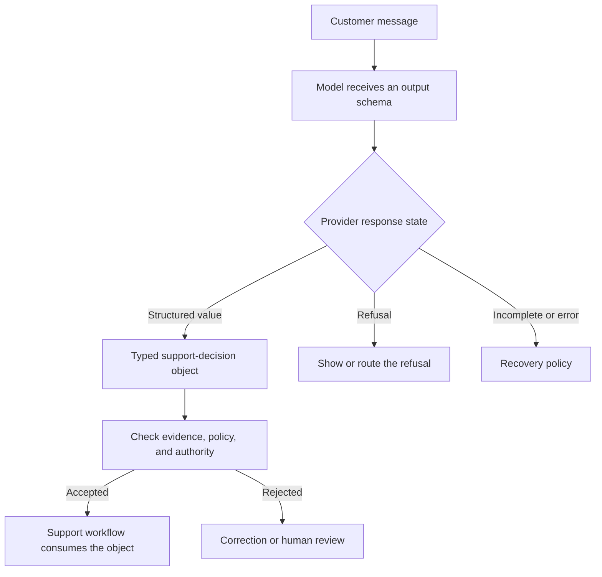
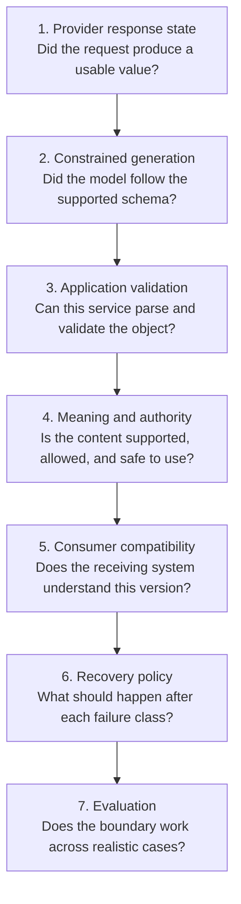
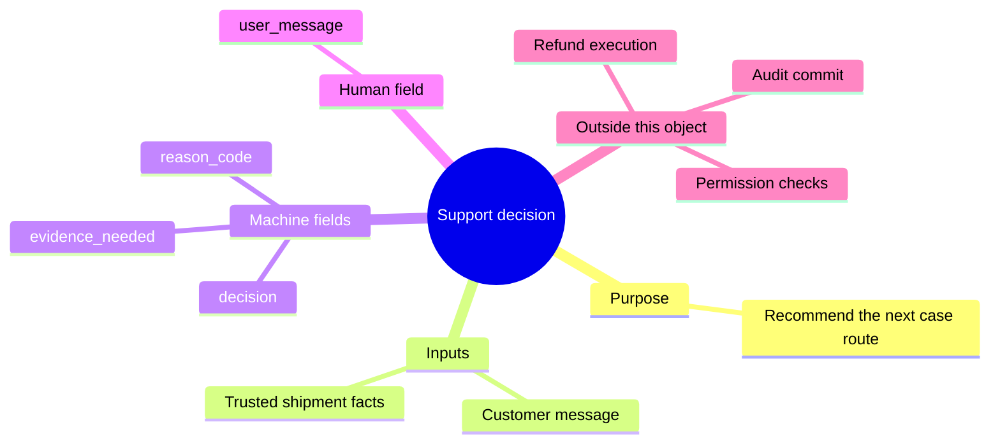
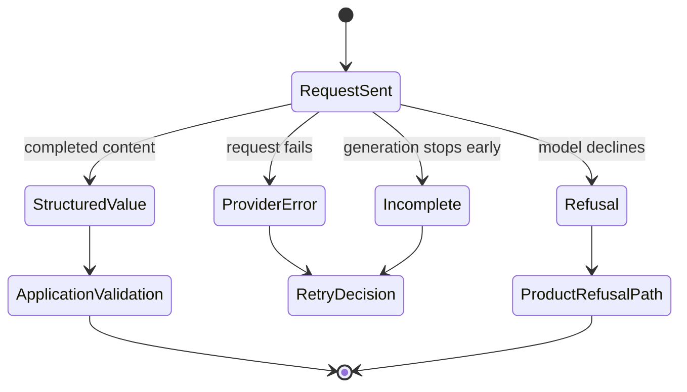
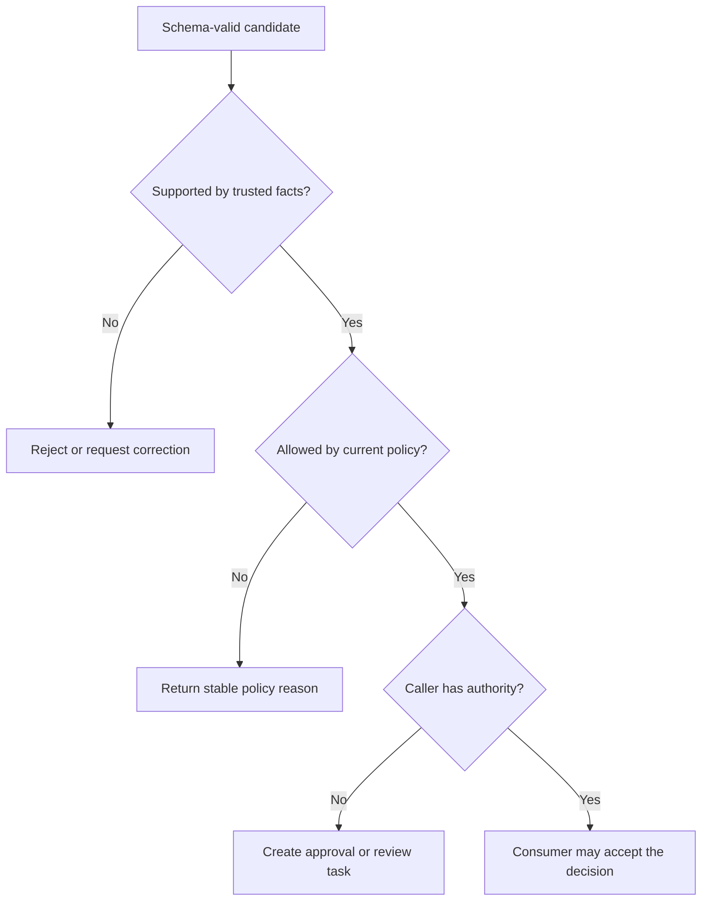
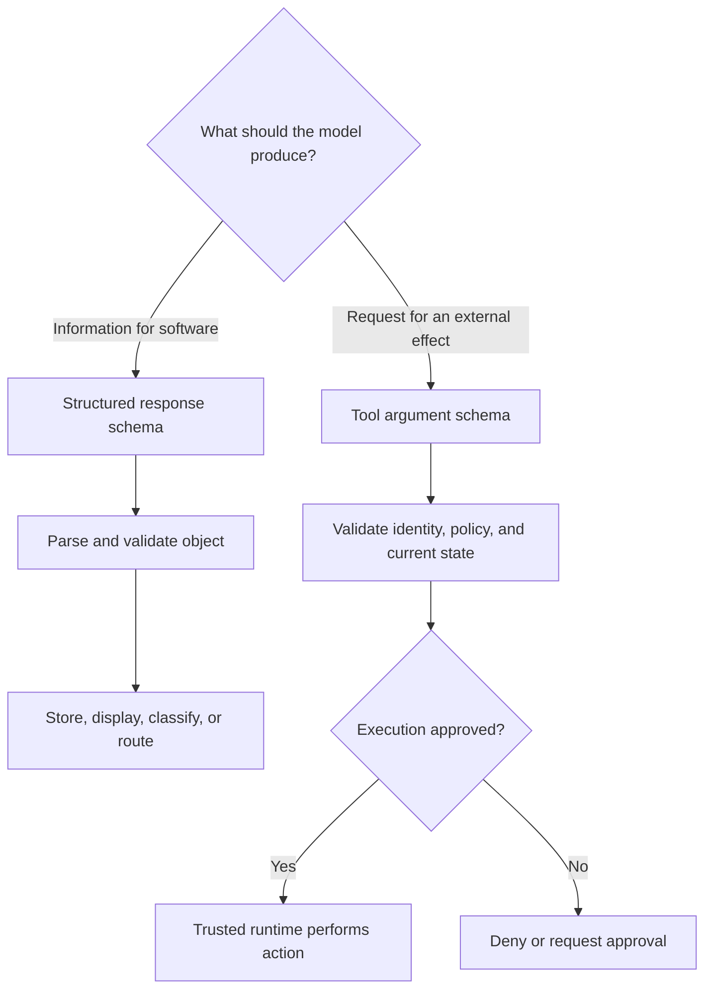
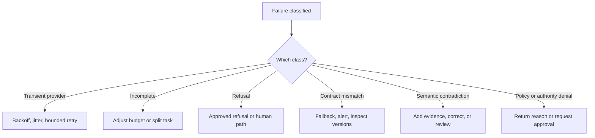
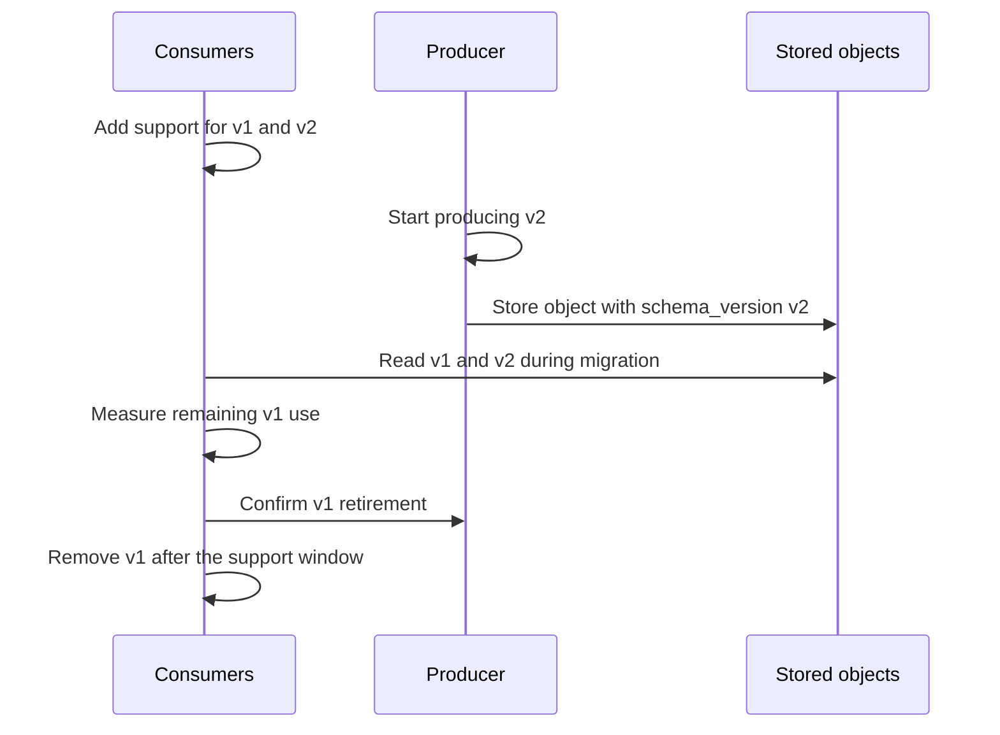
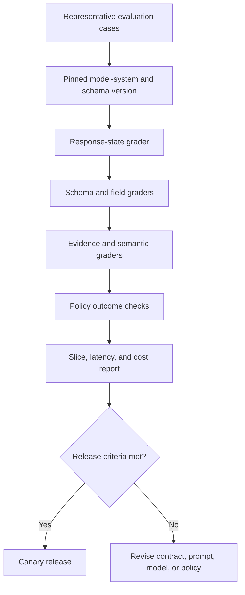

## Table of Contents

1. [Structured Output Gives Software a Dependable Object](#structured-output-gives-software-a-dependable-object)
2. [Check Structured Output At Seven Separate Layers](#check-structured-output-at-seven-separate-layers)
3. [Define the Object Before the Schema](#define-the-object-before-the-schema)
4. [JSON Schema Describes the Allowed Shape](#json-schema-describes-the-allowed-shape)
5. [Read the Provider Response State First](#read-the-provider-response-state-first)
6. [Constrain Generation and Validate in the Application](#constrain-generation-and-validate-in-the-application)
7. [Validate Meaning, Policy, and Authority](#validate-meaning-policy-and-authority)
8. [Separate Returned Data From Requested Actions](#separate-returned-data-from-requested-actions)
9. [Match Recovery to the Failure](#match-recovery-to-the-failure)
10. [Update Structured Output Safely Across Its Consumers](#update-structured-output-safely-across-its-consumers)
11. [Test Structured Output From Generation To Final Action](#test-structured-output-from-generation-to-final-action)
12. [What to Carry Into Production](#what-to-carry-into-production)
13. [References](#references)

## Structured Output Gives Software a Dependable Object

<!-- section-summary: Structured output turns a model response into a defined data object that application code can inspect, validate, and pass to another system. -->

At a high level, **structured output** asks a language model to answer with a specific data shape. A person can read a paragraph and work out what it means. Software needs something more dependable: known field names, known value types, and a clear way to represent missing information.

Imagine a customer writes, “My parcel never arrived. Tracking stopped after it reached the local depot.”

A model could reply, “The case probably needs an investigation before a refund.” That sounds sensible to a person, yet a support workflow still has to extract the decision, find the reason, and decide which evidence to request. Small wording changes can break a parser built around the sentence.

A structured response gives the workflow an object such as:

```json
{
  "decision": "investigate",
  "reason_code": "delivery_not_confirmed",
  "evidence_needed": ["carrier_scan"],
  "user_message": "We need to check the latest carrier scan before deciding the refund."
}
```

The workflow can now route `investigate` to the right queue, display `user_message`, and ask the carrier system for `carrier_scan`. In essence, the model translates flexible human language into a small software contract.

The object is still a model-generated interpretation. It may have the right keys and the wrong decision. Structured output solves the **shape problem**; the application must still solve the **meaning and safety problems**.


```mermaid
flowchart TD
    A["Customer message"] --> B["Model receives an output schema"]
    B --> C{"Provider response state"}
    C -->|"Structured value"| D["Typed support-decision object"]
    C -->|"Refusal"| E["Show or route the refusal"]
    C -->|"Incomplete or error"| F["Recovery policy"]
    D --> G["Check evidence, policy, and authority"]
    G -->|"Accepted"| H["Support workflow consumes the object"]
    G -->|"Rejected"| I["Correction or human review"]

    class A input
    class B model
    class C,G gate
    class D,H good
    class E,F,I stop
```

Three terms are easy to confuse:

- **JSON** is a text format for representing values, arrays, and objects.
- **JSON Schema** describes which JSON values are allowed.
- **Structured output** is a model-provider feature that constrains generation to a supplied schema.

Asking a model to “return JSON” only targets the first item. The response may be valid JSON and still omit `decision`, invent a new reason code, or use a string where the application expects an array. A schema gives the contract enough precision for machines to check it.

## Check Structured Output At Seven Separate Layers

<!-- section-summary: A production boundary has seven separate layers, from provider response state through evaluation, and each layer answers a different question. -->

A production system checks structured output at seven separate layers. Each layer answers one question, and passing one layer does not prove that the layers below it will pass.


```mermaid
flowchart TD
    L1["1. Provider response state<br/>Did the request produce a usable value?"] --> L2["2. Constrained generation<br/>Did the model follow the supported schema?"]
    L2 --> L3["3. Application validation<br/>Can this service parse and validate the object?"]
    L3 --> L4["4. Meaning and authority<br/>Is the content supported, allowed, and safe to use?"]
    L4 --> L5["5. Consumer compatibility<br/>Does the receiving system understand this version?"]
    L5 --> L6["6. Recovery policy<br/>What should happen after each failure class?"]
    L6 --> L7["7. Evaluation<br/>Does the boundary work across realistic cases?"]

    class L1 provider
    class L2,L3,L5 contract
    class L4 safety
    class L6,L7 operation
```

The first layer belongs to the API exchange. A timeout, refusal, and completed structured value are different outcomes. The second layer belongs to the model-provider interface: the provider constrains generation to the supported part of a schema. The third layer belongs to your application and its runtime validator.

The fourth layer is where domain knowledge enters. A support decision can be schema-valid while citing evidence that does not exist. It can also recommend a refund that violates policy or exceeds the current operator’s permissions. The fifth layer treats the schema as an API shared by producers and consumers. The sixth defines deliberate recovery. The seventh measures the complete behaviour using representative inputs.

This separation gives a team useful failure names. “The parser failed,” “the evidence did not support the reason,” and “the refund required approval” point to different owners and different remedies.

## Define the Object Before the Schema

<!-- section-summary: Good structured-output design begins with the object's purpose, field meanings, source evidence, and downstream consumer. -->

A schema describes an object, so the team first needs to agree on what that object represents. Start with the consumer and its next decision.

For the support example, the consumer is a case-routing service. It uses a proposed route to choose the queue. A controlled reason code makes routing and reporting consistent. The evidence list tells the workflow what to collect, and the customer message explains the next step in ordinary language.

That sentence already tells us more than “return a support analysis as JSON.” It gives the object one job: **describe the recommended next step for this case**. It does not also execute a refund, update the case, or write an audit record.

For every field, answer five practical questions:

1. What does the field mean in plain language?
2. Which source may support its value?
3. How is “unknown” represented?
4. Which component checks it?
5. What may the consumer do with it?

Consider `reason_code`. The plain-language meaning might be “the strongest supported reason for the proposed route.” Its value must come from the customer message and trusted shipment data. `null` may mean that the evidence is too weak to choose a reason. A semantic validator checks the evidence, and the routing service may use an accepted value to choose a queue.

Now consider `user_message`. It is presentation text, so it needs different treatment. The application might scan it for sensitive data, localise it, and show it to a human reviewer. It should not be used as a hidden source of routing logic. Putting machine control and human explanation into separate fields prevents prose from quietly driving the workflow.

An explicit status is often clearer than a collection of nullable fields. For example, `decision` could include `needs_more_information`. The model then has a legitimate response for an underspecified case. Without that option, it may force uncertain evidence into one of the normal routes simply because the schema demands a choice.


```mermaid
mindmap
  root((Support decision))
    Purpose
      Recommend the next case route
    Inputs
      Customer message
      Trusted shipment facts
    Machine fields
      decision
      reason_code
      evidence_needed
    Human field
      user_message
    Outside this object
      Refund execution
      Permission checks
      Audit commit
```

The mind map marks the boundary around the object. The items outside it still matter, but another trusted component owns them. A precise, compact object gives reviewers clear field meanings, gives validators focused rules, and gives consumers a stable contract. A large `analysis` object filled with free-form strings provides none of those controls.

## JSON Schema Describes the Allowed Shape

<!-- section-summary: JSON Schema uses types and validation keywords to define the keys, values, and constraints that a JSON document must satisfy. -->

**JSON Schema** is a standard vocabulary for describing JSON data. The JSON value being checked is called the **instance**. The document containing the rules is the **schema**. You can think of the schema as a machine-readable form specification: it names the available fields and states what counts as a valid answer for each one.

The current published JSON Schema specification is Draft 2020-12. A general-purpose schema normally declares its dialect with `$schema`. Model providers commonly support a subset of the full standard, so a production team should keep the provider-compatible schema separate from any richer internal validation rules.

Here is a compact schema for the support-decision object:

```json
{
  "$schema": "https://json-schema.org/draft/2020-12/schema",
  "type": "object",
  "additionalProperties": false,
  "properties": {
    "decision": {
      "type": "string",
      "enum": ["investigate", "refund_review", "needs_more_information"]
    },
    "reason_code": {
      "type": ["string", "null"],
      "enum": ["delivery_not_confirmed", "item_damaged", "wrong_item", null]
    },
    "evidence_needed": {
      "type": "array",
      "items": {
        "type": "string",
        "enum": ["carrier_scan", "delivery_photo", "item_photo", "order_record"]
      }
    },
    "user_message": {
      "type": "string",
      "minLength": 1,
      "maxLength": 400
    }
  },
  "required": ["decision", "reason_code", "evidence_needed", "user_message"]
}
```

The important keywords each remove a specific ambiguity:

- `type: "object"` requires a key-value object.
- `properties` describes the known fields and the rule for each value.
- `required` requires those keys to exist. A property listed under `properties` is optional unless `required` also names it.
- `enum` limits a value to an agreed vocabulary. The model cannot invent `send_to_logistics_team` as a new route.
- `items` applies a rule to every element in an array.
- `minLength` and `maxLength` place useful bounds on text.
- `additionalProperties: false` rejects unexpected keys. Standard JSON Schema otherwise allows extra properties by default.

`null` and a missing key have different meanings. A required `reason_code` with a `null` value says, “This field was considered, but no supported reason was found.” An absent `reason_code` says that the object did not satisfy the contract. Decide which meaning the product needs and encode it consistently.

Schema descriptions and field names should use domain language that reviewers understand. A type alone cannot explain whether `date` means the customer’s local calendar date or an instant in UTC. It cannot say whether `customer_id` came from a trusted account record or was copied from user text. Those meanings belong in the contract documentation, prompt instructions, and semantic checks.

Complex schemas can use nested objects, reusable definitions, conditional rules, patterns, and formats. Add complexity only for a real consumer requirement. Deeply nested unions may be difficult for people to review and may fall outside a provider’s supported subset. Validate the exact schema against the chosen provider during CI and again during release testing.

## Read the Provider Response State First

<!-- section-summary: The API response can represent completion, refusal, truncation, or an error, and only one of those paths contains a usable business object. -->

Before looking at business fields, inspect what happened at the provider boundary. A successful HTTP request does not guarantee a completed structured value. The response can report several states:

- **Completed with structured content:** the candidate object can move to application validation.
- **Refusal:** the model declined the request and the provider exposes that refusal separately.
- **Incomplete:** generation stopped early, often because an output limit was reached.
- **Provider or network error:** no candidate object was produced.

These states deserve their own application types. Treating a refusal as invalid JSON produces a misleading parser alert. Treating an incomplete value as a normal empty result can send a case down the wrong route.


```mermaid
stateDiagram-v2
    [*] --> RequestSent
    RequestSent --> ProviderError: request fails
    RequestSent --> Incomplete: generation stops early
    RequestSent --> Refusal: model declines
    RequestSent --> StructuredValue: completed content
    StructuredValue --> ApplicationValidation
    ProviderError --> RetryDecision
    Incomplete --> RetryDecision
    Refusal --> ProductRefusalPath
    ApplicationValidation --> [*]
    ProductRefusalPath --> [*]
```

In the support scenario, a refusal might lead to an approved customer message and a human queue. An incomplete response may justify one retry with a larger output allowance. A provider timeout may use exponential backoff. These paths share no business meaning, even though all three lack a usable `SupportDecision`.

Store provider status, request ID, model identifier, token usage, and error category with the trace. Keep sensitive customer text under the product’s logging and retention policy. This operational record lets the team separate provider failures from schema failures and from wrong-but-well-formed decisions.

## Constrain Generation and Validate in the Application

<!-- section-summary: Provider-native structured output constrains model generation, while runtime schemas such as Zod or Pydantic give the application a typed validation boundary. -->

Schema-constrained generation and application validation guard two separate entry points. The provider applies a schema while the model creates its response. The application applies a runtime schema as data enters trusted code. Using both guards gives the service a well-defined model boundary and protects every later handoff that may receive stored, delayed, or externally supplied data.

The provider uses a supported JSON Schema during generation. This prevents common formatting failures such as missing required fields or invalid enum values. JSON mode alone only guarantees valid JSON; it does not guarantee the shape described by your contract.

The application still needs a runtime schema because the object often leaves the process that created it. A queue may deliver the value hours later, after the producer has changed versions. The consumer must therefore treat the payload as unknown data and validate the contract at its own boundary.

TypeScript types disappear at runtime, so they cannot reject that payload. Zod parses unknown values in TypeScript applications and returns either typed data or validation issues. Pydantic provides the corresponding model-validation boundary for Python applications.

The OpenAI JavaScript SDK can derive the provider format from a Zod schema and return a parsed value through the Responses API:

```ts
import OpenAI from "openai";
import { zodTextFormat } from "openai/helpers/zod";
import { z } from "zod";

const SupportDecision = z.object({
  decision: z.enum(["investigate", "refund_review", "needs_more_information"]),
  reason_code: z
    .enum(["delivery_not_confirmed", "item_damaged", "wrong_item"])
    .nullable(),
  evidence_needed: z.array(
    z.enum(["carrier_scan", "delivery_photo", "item_photo", "order_record"])
  ),
  user_message: z.string().min(1).max(400),
});

const response = await new OpenAI().responses.parse({
  model: process.env.SUPPORT_MODEL!,
  input: [
    { role: "system", content: "Return the proposed support decision." },
    { role: "user", content: customerMessage },
  ],
  text: { format: zodTextFormat(SupportDecision, "support_decision") },
});

const candidate = response.output_parsed;
if (!candidate) throw new Error("No parsed support decision");
```

The model name comes from a reviewed deployment configuration so the service can pin, canary, and roll back model changes. The Zod object is more than a TypeScript convenience: the SDK converts it into a supported structured-output format and parses the returned data.

Production response handling should inspect incomplete and refusal content before accepting `output_parsed`. The provider documentation exposes incomplete response details on the response and refusal items inside message content. Keep those checks in one adapter so the rest of the application receives a small union such as `structured`, `refused`, `incomplete`, or `provider_error`.

At later boundaries, validate again:

```ts
const result = SupportDecision.safeParse(queueMessage.payload);

if (!result.success) {
  return deadLetter(queueMessage, {
    reason: "structured_output_contract_error",
    issues: result.error.issues,
  });
}

return routeSupportDecision(result.data);
```

This second example protects the consumer from stale producers, manual database edits, and malformed messages. It also gives contract errors an observable destination instead of allowing an unchecked cast such as `payload as SupportDecision`.

## Validate Meaning, Policy, and Authority

<!-- section-summary: A schema-valid object still needs checks for factual support, domain rules, and permission to affect the outside world. -->

A schema checks whether fields and values have the expected shape. It cannot open a carrier record, apply the current refund policy, or prove that the current operator has permission to approve money. Those responsibilities form three more gates: semantic validation checks the claim, business validation checks the policy, and authority validation checks who may act.

Suppose the model returns:

```json
{
  "decision": "refund_review",
  "reason_code": "delivery_not_confirmed",
  "evidence_needed": [],
  "user_message": "Your order qualifies for a refund review."
}
```

Every field can satisfy the schema. The object may still be wrong. Perhaps the trusted carrier record contains a signed delivery scan. Perhaps the order is outside the refund window. Perhaps the current support agent may investigate cases but cannot approve refunds.

That leads to three checks after schema validation.

### Semantic validation checks the claim

**Semantic validation** asks whether the values make sense together and whether trusted evidence supports them. In plain language, it checks the content rather than the container.

For this case, the validator resolves the order and carrier records using identifiers supplied by trusted application context. It verifies that `delivery_not_confirmed` agrees with the latest carrier state. It can also require `carrier_scan` in `evidence_needed` if the shipment state is unknown.

Some semantic rules fit deterministic code:

```ts
function validateMeaning(
  decision: z.infer<typeof SupportDecision>,
  facts: ShipmentFacts
) {
  if (
    decision.reason_code === "delivery_not_confirmed" &&
    facts.deliveryConfirmed
  ) {
    return { ok: false, reason: "carrier_record_contradicts_reason" };
  }

  return { ok: true };
}
```

For extraction tasks, semantic checks might reconcile line-item totals, verify that a cited quote appears in the source, or ensure a start date precedes an end date. A model-based judge can assist with nuanced checks, but high-risk decisions still need deterministic controls or human review.

### Business validation checks the current policy

**Business validation** applies rules owned by the product or organisation. Refund windows, monetary thresholds, account status, regional requirements, and mandatory review categories belong here.

Keep volatile policy outside the prompt and model schema. The support service can query the current refund policy and record its version alongside the decision. This prevents a model-generated object from freezing old rules into a plausible-looking answer.

### Authority validation checks who may act

**Authority validation** asks whether this caller and workflow may perform the next operation. A correct recommendation does not grant permission.

The service should derive identity and permissions from trusted runtime context. Never ask the model to provide `is_authorized: true` and treat that field as proof. For a high-value refund, the accepted structured object may create an approval task; only the approval service can authorize the eventual payment.


```mermaid
flowchart TD
    A["Schema-valid candidate"] --> B{"Supported by trusted facts?"}
    B -->|"No"| X["Reject or request correction"]
    B -->|"Yes"| C{"Allowed by current policy?"}
    C -->|"No"| Y["Return stable policy reason"]
    C -->|"Yes"| D{"Caller has authority?"}
    D -->|"No"| Z["Create approval or review task"]
    D -->|"Yes"| E["Consumer may accept the decision"]

    class A candidate
    class B,C,D gate
    class X,Y,Z stop
    class E accept
```

Record the result of each gate separately. “Semantic contradiction,” “policy denied,” and “approval required” support much better operations and evaluation than a single `validation_failed` status.

## Separate Returned Data From Requested Actions

<!-- section-summary: A response schema returns an object for the application to consume, while a tool call proposes an action for trusted runtime code to consider. -->

Structured response data and tool calls both use schemas, which makes them look similar in API code. Their roles are different.

A **structured response** returns data. The support decision is an example: the application asked for a typed recommendation and received one. Reading the object has no external side effect.

A **tool call** proposes an action. A call such as `create_refund({ order_id, amount_minor })` asks the runtime to change another system. The runtime must validate arguments, load trusted order data, enforce policy, check identity, request approval where necessary, and make the operation idempotent.


```mermaid
flowchart TD
    A{"What should the model produce?"}
    A -->|"Information for software"| B["Structured response schema"]
    B --> C["Parse and validate object"]
    C --> D["Store, display, classify, or route"]
    A -->|"Request for an external effect"| E["Tool argument schema"]
    E --> F["Validate identity, policy, and current state"]
    F --> G{"Execution approved?"}
    G -->|"Yes"| H["Trusted runtime performs action"]
    G -->|"No"| I["Deny or request approval"]

    class A,G question
    class B,C,D data
    class E,F action
    class H good
    class I stop
```

For the parcel case, the model can return `decision: "refund_review"` as data. That value may create a review task. It should not directly issue money. After approval, a trusted application component can call the payment API with an amount read from the order system, not copied from untrusted customer text.

Use a response schema for classification, extraction, plans, UI descriptions, and review findings. Use a tool schema for proposed effects such as sending a message, changing a record, running a query, or creating a refund. Keep the action boundary visible in code and telemetry.

## Match Recovery to the Failure

<!-- section-summary: Recovery policies should respond to the cause of failure, because retries help transient failures and can worsen permanent or policy failures. -->

A recovery strategy begins by asking whether another attempt has a reasonable chance of changing the outcome. Transient infrastructure and output-budget failures may improve on a later attempt. Evidence contradictions, policy denials, and permission failures need a different response.

A network timeout or rate limit is an operational failure. Use the provider’s retry guidance, exponential backoff with jitter, a retry cap, and an overall deadline. Preserve one trace across attempts and record the total latency and token cost.

An incomplete response often means the output budget was too small or the task asked for too much data. One bounded retry with a larger allowance may be appropriate. A large extraction can also be split into smaller, independently validated units.

A refusal is an intentional provider response. Route it through the product’s refusal experience or an approved human path. Repeatedly changing the wording to evade the refusal is neither reliable recovery nor a sound safety practice.

A contract error suggests a schema, SDK, model, or deployment mismatch. Stop automatic retries after a small bound, capture the schema and model-system versions, and use a controlled fallback. A sudden increase in contract errors should page the owning team because every consumer may be affected.

A semantic contradiction needs new evidence, a correction step, or a reviewer. If the carrier record proves delivery, asking the same model the same question again only spends more tokens. Give a correction attempt the concrete contradiction and prevent it from overriding trusted facts.

A business denial is a valid policy result. Return a stable reason code and the permitted next step. No model retry should turn an ineligible refund into an eligible one.


```mermaid
flowchart TD
    A["Failure classified"] --> B{"Which class?"}
    B -->|"Transient provider"| C["Backoff, jitter, bounded retry"]
    B -->|"Incomplete"| D["Adjust budget or split task"]
    B -->|"Refusal"| E["Approved refusal or human path"]
    B -->|"Contract mismatch"| F["Fallback, alert, inspect versions"]
    B -->|"Semantic contradiction"| G["Add evidence, correct, or review"]
    B -->|"Policy or authority denial"| H["Return reason or request approval"]

    class A,B question
    class C,D retry
    class F,G review
    class E,H stop
```

Set a total attempt budget for the complete user request, not a separate generous budget for every layer. A provider retry followed by a correction retry and a fallback model call can quietly multiply latency and cost. The final trace should show every attempt and the object chosen for downstream use.

## Update Structured Output Safely Across Its Consumers

<!-- section-summary: A structured-output schema is an API contract, so changes must account for producers, stored objects, and every downstream consumer. -->

Downstream services depend on the structured object, so its schema is an API contract. Adding required fields, renaming keys, or changing field meanings can break those consumers.

Adding a required `evidence_needed` field breaks older producers that never send it. Renaming `reason` to `reason_code` breaks consumers that still read the old key. Reusing the same field name with a new meaning is especially dangerous because parsing continues to succeed.

Manage the contract as a coordinated release:

1. Give the schema an application-level version such as `support-decision.v2`.
2. Add fixtures for accepted and rejected objects.
3. Test every active consumer against the new version.
4. Deploy consumers that can read both versions.
5. Deploy the new producer.
6. Measure remaining `v1` traffic and retire it deliberately.

For a compatible addition, an optional field can be introduced if absence has a clear meaning and older consumers ignore it safely. Use a new major contract version for renamed fields, new required fields, changed enum meaning, or changed units.


```mermaid
sequenceDiagram
    participant C as Consumers
    participant P as Producer
    participant S as Stored objects
    C->>C: Add support for v1 and v2
    P->>P: Start producing v2
    P->>S: Store object with schema_version v2
    C->>S: Read v1 and v2 during migration
    C->>C: Measure remaining v1 use
    C->>P: Confirm v1 retirement
    C->>C: Remove v1 after the support window
```

Store `schema_version` beside every object, along with the model-system version and validation result. Historical records then retain their original meaning. A support decision produced under `v1` can be interpreted correctly after the live service moves to `v2`.

Keep provider schemas and internal domain schemas related but separately owned. Provider constraints may support only part of JSON Schema. The internal validator can enforce additional limits and cross-field rules without pretending the provider enforces them during generation.

## Test Structured Output From Generation To Final Action

<!-- section-summary: Evaluation should measure response states, schema reliability, field correctness, evidence support, business outcomes, and compatibility across realistic slices. -->

A parser test proves that software accepts a fixture. It does not prove that the model chooses the right route, that the reason has evidence, or that the workflow handles refusals safely.

Build an evaluation set from real task shapes with privacy controls. For support decisions, include ordinary delivery questions, missing order context, conflicting carrier records, damaged items, irrelevant requests, long conversations, several languages, and adversarial text that tries to rewrite the system instructions.

Each case needs more than one expected JSON object. Label the acceptable provider or product state, required and forbidden fields, evidence expectations, and downstream outcome. Some inputs may have several acceptable user messages but only one valid reason code.

```yaml
case_id: delivery-scan-conflict
input:
  customer_message: "My parcel never arrived."
trusted_facts:
  delivery_confirmed: true
expected:
  provider_state: structured
  forbidden_reason_codes:
    - delivery_not_confirmed
  allowed_outcomes:
    - needs_more_information
    - human_review
```

This focused case catches a serious error that schema validation cannot see: a valid enum contradicting trusted evidence.

Measure the boundary at several levels:

- **Response-state rate:** completed values, refusals, incomplete responses, and provider errors.
- **Schema-valid rate:** candidates accepted by the application runtime schema.
- **Field quality:** accuracy for enums, identifiers, dates, amounts, and required evidence.
- **Semantic support:** agreement with trusted source facts and cross-field consistency.
- **Policy outcome:** correct approvals, denials, escalations, and review rates.
- **Slice quality:** results by language, input length, case type, source quality, and risk.
- **Operational cost:** end-to-end latency, attempts per accepted object, and tokens per case.


```mermaid
flowchart TD
    A["Representative evaluation cases"] --> B["Pinned model-system and schema version"]
    B --> C["Response-state grader"]
    C --> D["Schema and field graders"]
    D --> E["Evidence and semantic graders"]
    E --> F["Policy outcome checks"]
    F --> G["Slice, latency, and cost report"]
    G --> H{"Release criteria met?"}
    H -->|"Yes"| I["Canary release"]
    H -->|"No"| J["Revise contract, prompt, model, or policy"]

    class A input
    class B,C,D,E,F test
    class G,H report
    class I good
    class J stop
```

Ordinary CI should also compile the schema, validate good and bad fixtures, test refusal and incomplete branches, and run producer-consumer compatibility tests. Model evaluation covers probabilistic behaviour. Contract tests protect the deterministic software around it. Both are needed before release.

## What to Carry Into Production

<!-- section-summary: Production structured output combines a narrow object, explicit response states, layered validation, deliberate recovery, versioning, and end-to-end evaluation. -->

Structured output gives an LLM application a dependable data shape. Its value comes from the complete boundary around that shape.

Define one object with one clear job. Explain every field in domain language. Use JSON Schema to constrain keys, types, enums, arrays, and absence. Read the provider response state before touching business data. Validate the object again at application and asynchronous boundaries.

Then check what the schema cannot prove: factual support, cross-field meaning, current business policy, and caller authority. Keep returned data separate from tool calls that propose side effects. Give each failure class a bounded recovery path, version the contract with its consumers, and evaluate realistic cases from provider response through product outcome.

The schema makes the model’s answer machine-readable. The surrounding engineering makes that answer safe and useful.

## References

- [OpenAI structured model outputs](https://developers.openai.com/api/docs/guides/structured-outputs)
- [OpenAI function calling](https://developers.openai.com/api/docs/guides/function-calling)
- [OpenAI evaluation best practices](https://developers.openai.com/api/docs/guides/evaluation-best-practices)
- [JSON Schema: creating your first schema](https://json-schema.org/learn/getting-started-step-by-step)
- [JSON Schema Draft 2020-12](https://json-schema.org/draft/2020-12)
- [JSON Schema object reference](https://json-schema.org/understanding-json-schema/reference/object)
- [Zod schema documentation](https://zod.dev/api)
- [Pydantic models](https://pydantic.dev/docs/validation/latest/concepts/models/)
