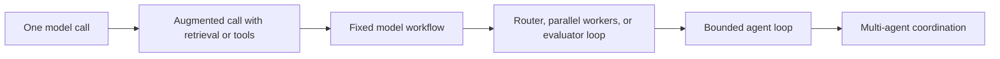
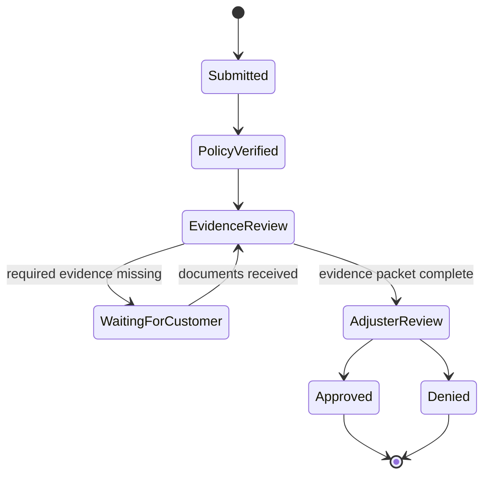
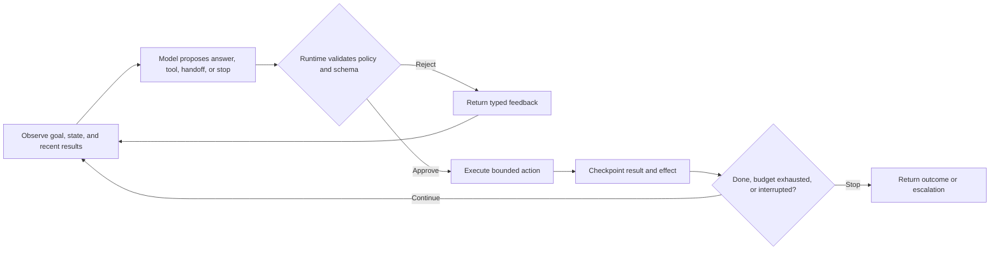
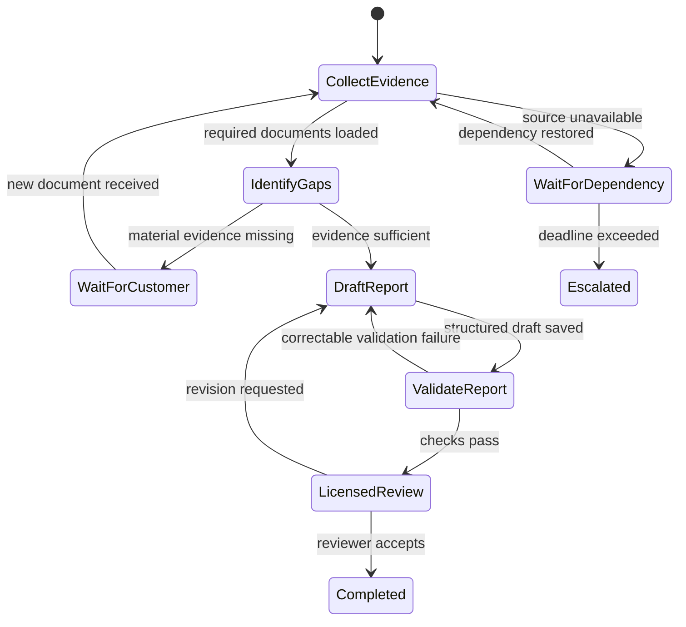

A **workflow** follows paths defined by application code. It can branch, retry, wait, and call models or tools, but the allowed transitions are designed ahead of time. An **agent** lets a model decide parts of the path at runtime: what to inspect, which tool to request, whether more evidence is needed, or which specialist should continue.

They are not competing product categories. Most reliable agentic applications combine them. Software owns lifecycle, authority, and irreversible effects; a model handles interpretation and adaptive choices inside those boundaries.

## Start With The Simplest Control Pattern
<!-- section-summary: Agentic complexity forms a progression from one model call to fixed workflows and bounded agent loops; each additional control layer needs evidence that it improves the task. -->

Use Harbor Mutual, a home insurer. A customer reports storm damage, uploads photos, and asks what happens next. The company must verify policy status, collect required evidence, route high-risk claims, and preserve an audit trail. The text and documents are messy, so a model can help interpret and summarize them.

Several patterns are available:



Move right only when evaluation shows the simpler pattern cannot meet the task. Extra calls add latency, cost, state, failure paths, and harder evaluation.

| Pattern | Control owner | Good fit |
| --- | --- | --- |
| Single augmented call | application selects context and tools | one bounded decision or draft |
| Prompt chain | code fixes the sequence | known stages with validation between them |
| Router | rules or classifier selects a path | distinct task families or risk classes |
| Parallel workers | code fans out and combines | independent subtasks or evidence sources |
| Evaluator–optimizer | code controls a bounded critique loop | measurable refinement with a clear stop rule |
| Agent loop | model chooses next tool or action proposal | path depends on observations discovered during work |
| Multi-agent system | coordinator and specialists share work | distinct ownership or context boundaries justify separation |

Harbor Mutual can use a fixed workflow for claim intake, a router for claim type, parallel workers to extract independent documents, and a bounded agent loop for evidence investigation. Final coverage and payment remain governed business decisions.

## Workflows Put Business State On Rails
<!-- section-summary: A workflow defines durable states, permitted transitions, evidence, deadlines, and effects so the process can be inspected and resumed. -->

Before adding an agent, draw the business process. For a storm claim:



Each transition should name its preconditions, inputs, owner, timeout, retry policy, effects, and audit evidence. This is stronger than a transcript saying “the agent moved to review.” The workflow store knows the current state and which transitions are legal.

Models can participate in nodes without owning the graph. A model may classify documents or propose that evidence is missing. Application code checks the proposal against requirements and changes durable state. Human approval can interrupt the graph and resume it later from a checkpoint.

Use ordinary code for deterministic checks. If policy dates are structured fields, compare dates in code. If a claim over a threshold requires licensed review, encode that policy. Asking a model to rediscover a stable rule on every run increases variability without adding judgment.

## An Agent Loop Is Observe, Decide, Act, Repeat
<!-- section-summary: An agent loop repeatedly gives the model current observations and tools, validates its proposal, executes one bounded action, and returns the result until a stop condition. -->

The basic loop is small:



For Harbor Mutual, the agent sees the evidence-review objective, current document inventory, relevant policy references, and a small tool set. It may open the contractor estimate, search an endorsement, or request roof photos. Each tool returns a typed result. The runtime enforces authorization, idempotency, timeouts, and budgets.

The loop alone is not a production architecture. It does not provide durable state after a crash, reconcile a tool call whose outcome is unknown, bind an approval to an exact proposal, prevent duplicate effects, or explain why a run stopped. Those responsibilities belong to the surrounding **orchestrator** or **agent harness**.

## The Orchestrator Owns Lifecycle And Authority
<!-- section-summary: The orchestrator assembles context, invokes models, validates actions, executes tools, checkpoints progress, enforces budgets, handles interruptions, and records traces. -->

The orchestrator is the control layer around the model. It should own:

- model and prompt selection;
- step-specific context assembly;
- tool availability, schemas, and permissions;
- durable run state and checkpoints;
- effect IDs and reconciliation;
- retry, timeout, cancellation, and concurrency;
- token, tool, time, and cost budgets;
- human approval and resumption;
- traces, audit, and final outcome.

Frameworks can implement this layer. OpenAI Agents SDK provides agents, tools, handoffs, guardrails, sessions, and tracing. LangGraph provides graph state, checkpoints, interrupts, and durable execution. Other products emphasize managed workflows, multi-agent coordination, or visual design. The framework does not choose the business authority model; it helps implement it.

A run contract can express the boundary without embedding framework code in the explanation:

```yaml
workflow: storm-claim-evidence-review-v6
agent_step:
  objective: produce a cited evidence-gap report
  allowed_tools: [open_claim_document, search_policy, request_document]
  forbidden_actions: [approve_claim, deny_claim, issue_payment]
budgets:
  model_steps: 8
  tool_calls: 12
  wall_time: 5m
interrupts:
  - customer_input_required
  - licensed_adjuster_approval
completion:
  schema: evidence-gap-report-v3
  required_citations: true
```

This contract makes clear what the agent may decide and which outcomes the workflow owns.

## Design the Run as Explicit Transitions

<!-- section-summary: A durable agent run moves through named states with allowed transitions, entry evidence, exit evidence, and an owner for every pause or failure. -->

The orchestrator needs more than a loop counter. It needs a **state machine**, which is a set of named run states and the transitions allowed between them. The state machine keeps business progress separate from the model’s narration. A model may say “the report is complete,” while the workflow stays in `validate_report` until deterministic checks pass.

For the claim review, a useful state sequence could be `collect_evidence`, `identify_gaps`, `wait_for_customer`, `draft_report`, `validate_report`, and `licensed_review`. Each state defines four things:

- the evidence required to enter;
- the decisions the agent may make there;
- the tools and effects available there;
- the conditions that permit each exit.

The diagram makes recovery paths visible alongside the ordinary path:



A transition should store the fact that justified it. `DraftReport -> ValidateReport` might record the artifact ID and schema version. `WaitForCustomer -> CollectEvidence` might record the uploaded document ID. `LicensedReview -> Completed` should record the reviewer, approval scope, and final artifact digest. These facts let another worker resume without asking the model to reconstruct progress from prose.

The state machine also limits autonomy in a precise way. During `collect_evidence`, the agent may read approved claim documents. During `wait_for_customer`, it should not continue generating speculative conclusions. During `licensed_review`, it has no authority to mark the claim completed. Tool availability follows state and identity rather than a permanent list attached to an agent persona.

## Give Every Failure an Owner and Recovery Rule

<!-- section-summary: Model, tool, state, policy, and dependency failures require different recovery actions, so the orchestrator classifies them before retrying. -->

Retries are safe only when the failed operation and its effects are understood. A transient model timeout before any output may allow another attempt. A malformed structured result may allow one correction attempt with the validation error. A policy denial should stop that path. A tool timeout after an external write requires reconciliation because the effect may already exist.

Use a small failure taxonomy:

| Failure class | Example | Orchestrator response |
| --- | --- | --- |
| model transport | request timed out before a response | bounded retry or approved route fallback |
| model behaviour | unsupported claim or invalid plan | correction step, stronger route, or review |
| tool input | missing document identifier | return typed error to the decision step |
| tool outcome unknown | booking request lost its response | reconcile by effect ID before any replay |
| policy | caller lacks permission | reject or request an authorized handoff |
| dependency | evidence store unavailable | durable wait, deadline, and escalation |
| budget | step or cost limit reached | save state and return partial or escalated outcome |

Each retry consumes the run’s shared deadline and budget. If the model layer retries three times and the tool adapter retries three times, one decision can create nine downstream attempts. Put retry ownership at one clear layer and record every attempt under the same effect and trace identity.

Recovery paths belong in evaluation. Crash a worker after a tool succeeds and before its result is checkpointed. Resume a run after an approval expires. Deliver the same event twice. Hold a dependency beyond the deadline. These tests show whether the orchestration design preserves one coherent business outcome under failures, which is the reason a production system needs more than the basic agent loop.

## Tools Turn Model Decisions Into Environmental Feedback
<!-- section-summary: Tools provide observations or side effects through narrow contracts, while the runtime—not the model—owns authentication, validation, idempotency, and execution. -->

A model proposes a tool call from a schema. The runtime validates structure, business rules, caller permissions, workflow state, and approval. It derives trusted context such as tenant and effect identity rather than accepting them from model arguments.

Read tools should return concise, source-labelled data. Write tools need idempotency keys and clear result states: committed, rejected, pending, not found, or unknown. A timeout does not prove that a write failed. Query the authoritative service before retrying.

Tool results enter the observation stream for the next step and stay outside permanent memory unless a governed write policy selects them. Large results should be paged or summarized with references. Tool errors should be typed so the agent can distinguish a user-fixable input problem from a transient dependency failure or a policy denial.

High-impact tools often need approval. Bind the approval to a digest of the exact proposal, resource, amount, and expiry. If any material field changes, request approval again.

## State Makes The System Resumable
<!-- section-summary: Durable typed state records workflow progress, completed effects, pending approvals, budgets, and next transitions; conversation history alone cannot safely resume work. -->

An agent transcript records communication. It is weak as the only state store. If the system crashes after a repair appointment is booked but before the model sees the result, replaying the transcript may create another booking.

Typed state records the active workflow node, input and artifact identities, completed and uncertain effects, checkpoint version, pending interrupt, remaining budgets, and next allowed transition. Domain services remain authoritative for committed business facts.

Checkpoint after meaningful steps and external effects. On resume, load the latest checkpoint, reconcile uncertain operations, verify that the workflow version can interpret the state, and continue only through a permitted transition. Long-running work may require state migration or pinning to an older workflow definition.

## Multi-Agent Design Needs A Real Boundary
<!-- section-summary: Specialists are justified by capability, context, trust, or ownership boundaries; otherwise one agent with tools is often simpler. -->

Do not create agents merely to give each prompt a job title. Separate agents when they require different tools or permissions, different context and retention, independent ownership, parallel work, or a meaningful handoff of responsibility.

A coordinator can keep control and call specialists as tools. A handoff can transfer active control. A graph can join structured state from parallel branches. Remote agents may use A2A when they are independently operated. Each pattern needs a typed input, output, failure policy, and merge rule.

Multi-agent systems add routing errors, duplicated context, conflicting results, larger cost, and harder traces. Compare them with a single capable agent and a well-designed tool set on the same tasks.

## Evaluate Trajectories And Outcomes
<!-- section-summary: Agent evaluation measures final task success and the path taken: tool choice, evidence, policy, effects, retries, budgets, and escalation. -->

Single-turn answer grading is insufficient. Build realistic environments where tools return controlled state and side effects can be checked. Grade the final artifact, domain state, required evidence, forbidden actions, effect count, approval use, latency, cost, and whether escalation occurred when it should.

Include missing data, ambiguous requests, tool timeouts, duplicate responses, prompt injection in documents, exhausted budgets, interrupted runs, stale approvals, and impossible tasks. A strong agent should sometimes ask, abstain, or hand off.

Trace every model, retrieval, tool, guardrail, checkpoint, handoff, and approval step under one run. Turn production failures into replay cases. Release changes to prompts, tools, models, graphs, or routing as versioned system bundles with offline gates, shadow evaluation, canaries, and rollback.

The durable rule is: workflows provide the rails, agent loops provide bounded adaptive judgment, and the orchestrator connects them through state, tools, authority, and evidence. Start simple and add autonomy only when it improves measured task outcomes enough to justify the new operating surface.

## References

- [Anthropic: building effective agents](https://www.anthropic.com/engineering/building-effective-agents)
- [OpenAI Agents SDK orchestration](https://openai.github.io/openai-agents-python/multi_agent/)
- [OpenAI Agents SDK running agents](https://openai.github.io/openai-agents-python/running_agents/)
- [OpenAI Agents SDK tools](https://openai.github.io/openai-agents-python/tools/)
- [LangGraph overview](https://docs.langchain.com/oss/python/langgraph/overview)
- [LangGraph persistence](https://docs.langchain.com/oss/python/langgraph/persistence)
- [LangGraph interrupts](https://docs.langchain.com/oss/python/langgraph/interrupts)
