## Table of Contents

1. [Control Ownership Defines the Design](#control-ownership-defines-the-design)
2. [Use the Lowest Sufficient Degree of Autonomy](#use-the-lowest-sufficient-degree-of-autonomy)
3. [Deterministic Workflows Keep Stable Paths in Code](#deterministic-workflows-keep-stable-paths-in-code)
4. [A Bounded Agent Loop Handles Adaptive Work](#a-bounded-agent-loop-handles-adaptive-work)
5. [An Agent Loop Needs an Orchestrator](#an-agent-loop-needs-an-orchestrator)
6. [The Orchestrator Owns Lifecycle and Authority](#the-orchestrator-owns-lifecycle-and-authority)
7. [Durable State and Checkpoints Preserve Progress](#durable-state-and-checkpoints-preserve-progress)
8. [Tools, Effects, Approvals, and Interrupts Need Separate Controls](#tools-effects-approvals-and-interrupts-need-separate-controls)
9. [Budgets and Stop Conditions Bound Autonomy](#budgets-and-stop-conditions-bound-autonomy)
10. [Recovery and Reconciliation Protect One Business Outcome](#recovery-and-reconciliation-protect-one-business-outcome)
11. [Current Runtimes Fit at Different Layers](#current-runtimes-fit-at-different-layers)
12. [Multi-Agent Design Needs a Real Boundary](#multi-agent-design-needs-a-real-boundary)
13. [Evaluate Outcomes and Trajectories](#evaluate-outcomes-and-trajectories)
14. [What to Carry Into Production](#what-to-carry-into-production)
15. [References](#references)

At a high level, workflows and agents are two ways to decide **what happens next** in an LLM application.

A **workflow** puts that decision in application code. The software knows the allowed steps and moves the run through them. A model can still classify text, extract fields, or draft an answer inside a workflow step.

An **agent** gives the model some responsibility for choosing the next step. The model may decide which tool to use, which evidence to inspect, whether to continue investigating, or whether it has enough information to answer.

Production systems often combine both. Software owns the business lifecycle, permissions, budgets, and irreversible effects. The model receives bounded freedom inside a particular state. The central design question asks which decisions belong to code and which decisions genuinely need model judgment.

## Control Ownership Defines the Design

<!-- section-summary: Workflow and agent architecture is mainly a decision about who chooses the next transition, who may create effects, and who decides that the run is finished. -->

The word **autonomy** can sound as though an entire application is either autonomous or controlled. Real systems divide control at a much finer level.

A model may choose the next document to inspect while code fixes the surrounding process. It may draft a refund recommendation while policy code decides eligibility. It may propose a deployment rollback while an operator approves the exact version and environment. Each choice has its own owner.

Four questions reveal that ownership:

1. Who chooses the next step?
2. Who decides which tools are available?
3. Who authorizes an external effect?
4. Who decides that the work is complete?

In a deterministic workflow, code answers most of these questions. In a bounded agent loop, the model answers part of the first question from a controlled set of options. The orchestrator still answers the other three.

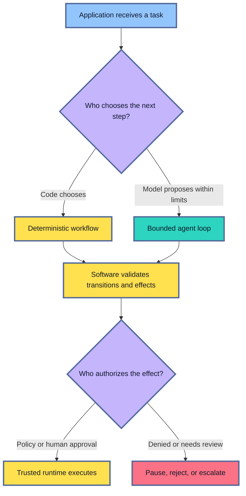
```mermaid
flowchart TD
    A["Application receives a task"] --> B{"Who chooses the next step?"}
    B -->|"Code chooses"| C["Deterministic workflow"]
    B -->|"Model proposes within limits"| D["Bounded agent loop"]
    C --> E["Software validates transitions and effects"]
    D --> E
    E --> F{"Who authorizes the effect?"}
    F -->|"Policy or human approval"| G["Trusted runtime executes"]
    F -->|"Denied or needs review"| H["Pause, reject, or escalate"]

    classDef input fill:#93C5FD,stroke:#536A9A,stroke-width:3px,color:#0F172A
    classDef choice fill:#C4B5FD,stroke:#536A9A,stroke-width:3px,color:#0F172A
    classDef code fill:#FFE04F,stroke:#536A9A,stroke-width:3px,color:#111827
    classDef model fill:#2DD4BF,stroke:#536A9A,stroke-width:3px,color:#0F172A
    classDef stop fill:#FB7185,stroke:#536A9A,stroke-width:3px,color:#111827
    class A input
    class B,F choice
    class C,E,G code
    class D model
    class H stop
```

Tool count and autonomy measure different things. A fixed workflow can call many tools in a predefined order. An agent may have only two read tools yet choose between them repeatedly. Autonomy concerns decision ownership.

The safest place for model judgment is usually a reversible choice with observable feedback. Searching another log source is reversible and produces evidence. Sending money or deleting a resource has a lasting effect and deserves deterministic policy, explicit authorization, and strong recovery controls.

## Use the Lowest Sufficient Degree of Autonomy

<!-- section-summary: LLM application designs progress from a single bounded call to workflows, agent loops, orchestration, and multi-agent systems as the task requires more adaptive control. -->

More autonomy creates more possible paths through the system. That can solve tasks whose steps cannot be predicted in advance. It also raises latency, cost, operational state, and the number of behaviours that evaluation must cover.

The practical progression has five levels.

### A single model call handles one bounded judgment

Use one call for a self-contained classification, extraction, rewrite, summary, or structured decision. Application code prepares the context and consumes the output. For example, a help-desk service can ask a model to classify one ticket into a small set of queues, validate the structured result, and route it.

A retrieved context can still belong to one bounded model call. Code runs a known search, attaches the results, and sends the prepared context to the model. The model makes one bounded judgment.

### A deterministic workflow handles a known sequence

Use a workflow if the stages and legal transitions are known. A document process might validate the upload, extract fields, check them against a database, request review, and publish the approved record. Models can perform the language-heavy steps while code owns the sequence.

Routing, parallel workers, prompt chains, and evaluator loops can all remain deterministic workflows. Code decides which branches exist, how outputs join, and how many refinement rounds are allowed.

### A bounded agent loop handles an unknown path

Use a model-directed loop if the next useful action depends on evidence discovered during the run. During incident investigation, the first query may reveal that the failure is isolated to one region. The agent can choose a regional log tool next instead of following a fixed global checklist.

The loop must operate inside a defined tool set, state, budget, and stop policy. “Keep working until solved” gives the system no dependable operating boundary.

### An orchestrator operates the run

The orchestrator is software around the workflow or agent. It assembles context, validates actions, executes tools, records checkpoints, enforces limits, pauses for approval, and handles recovery. No additional model is implied by this operating layer.

### Multiple agents serve real separation

Several agents are justified by distinct permissions, context boundaries, owners, or independently verifiable parallel work. Prompt titles such as “planner,” “researcher,” and “writer” provide no production boundary by themselves.

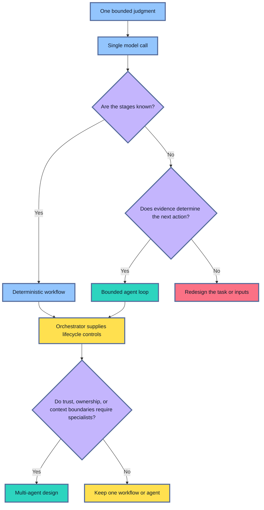
```mermaid
flowchart TD
    A["One bounded judgment"] --> B["Single model call"]
    B --> C{"Are the stages known?"}
    C -->|"Yes"| D["Deterministic workflow"]
    C -->|"No"| E{"Does evidence determine the next action?"}
    E -->|"Yes"| F["Bounded agent loop"]
    E -->|"No"| G["Redesign the task or inputs"]
    D --> H["Orchestrator supplies lifecycle controls"]
    F --> H
    H --> I{"Do trust, ownership, or context boundaries require specialists?"}
    I -->|"Yes"| J["Multi-agent design"]
    I -->|"No"| K["Keep one workflow or agent"]

    classDef question fill:#C4B5FD,stroke:#536A9A,stroke-width:3px,color:#0F172A
    classDef simple fill:#93C5FD,stroke:#536A9A,stroke-width:3px,color:#0F172A
    classDef adaptive fill:#2DD4BF,stroke:#536A9A,stroke-width:3px,color:#0F172A
    classDef control fill:#FFE04F,stroke:#536A9A,stroke-width:3px,color:#111827
    classDef stop fill:#FB7185,stroke:#536A9A,stroke-width:3px,color:#111827
    class A,B,D simple
    class C,E,I question
    class F,J adaptive
    class H,K control
    class G stop
```

Each step up this progression needs evaluation evidence. If one structured call meets the quality target, a loop adds operating cost without adding product value. If a deterministic workflow repeatedly fails because the required investigation path differs across cases, a bounded agent may be justified.

## Deterministic Workflows Keep Stable Paths in Code

<!-- section-summary: A deterministic workflow defines business states and legal transitions in software while models perform bounded language tasks inside individual steps. -->

A **deterministic workflow** is a process whose possible paths are defined before the run starts. Inputs can still change the chosen branch. The key point is that application code owns the branch logic.

Consider a document-publishing process. The service accepts a file, checks its type and size, extracts structured metadata, validates identifiers, requests human review, and publishes the approved record. A model may extract the title and summary. Code checks the schema, resolves the identifier, and moves the record into review.

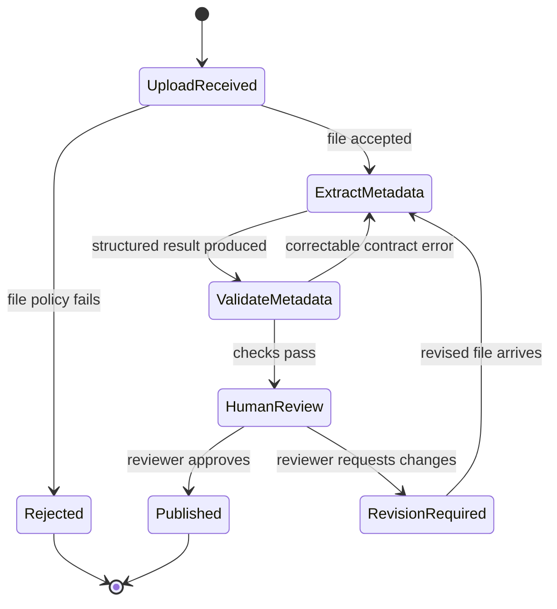
```mermaid
stateDiagram-v2
    [*] --> UploadReceived
    UploadReceived --> Rejected: file policy fails
    UploadReceived --> ExtractMetadata: file accepted
    ExtractMetadata --> ValidateMetadata: structured result produced
    ValidateMetadata --> ExtractMetadata: correctable contract error
    ValidateMetadata --> HumanReview: checks pass
    HumanReview --> Published: reviewer approves
    HumanReview --> RevisionRequired: reviewer requests changes
    RevisionRequired --> ExtractMetadata: revised file arrives
    Published --> [*]
    Rejected --> [*]
```

Every state should have a plain meaning. `HumanReview` means the machine checks have passed and a named reviewer owns the next decision. `Published` means the publishing effect completed and its identifier was recorded. Business state carries these meanings independently of the wording in a model transcript.

Stable rules stay in ordinary code. File limits, required approvals, monetary thresholds, date comparisons, and permission checks are deterministic decisions. Code gives those rules repeatable behaviour and focused tests.

Model calls fit inside workflow nodes for tasks that require language or visual judgment. The node should have a typed input and output, a timeout, a failure classification, and a clear transition for unusable results. A model result proposes evidence for the next state; the workflow runtime commits the state transition.

This pattern provides strong operational visibility. A support engineer can see that a record is waiting in `HumanReview`, identify its owner, inspect the artifact that entered the state, and apply a deadline or escalation. A chat transcript alone lacks that lifecycle.

## A Bounded Agent Loop Handles Adaptive Work

<!-- section-summary: A bounded agent loop lets the model choose among permitted next actions using environmental feedback, while the runtime validates each proposal and enforces completion limits. -->

An **agent loop** repeats a small cycle: observe the current situation, decide on a next action, perform that action through trusted software, and add the result to the next observation. The model directs the investigation because each tool result can change what should happen next.

Suppose an operations assistant investigates an API latency alert. The assistant first reads service metrics. A regional spike may lead it to deployment history for that region. A database saturation signal may lead it to query traces for slow calls. The useful path depends on evidence that was unavailable at the start.

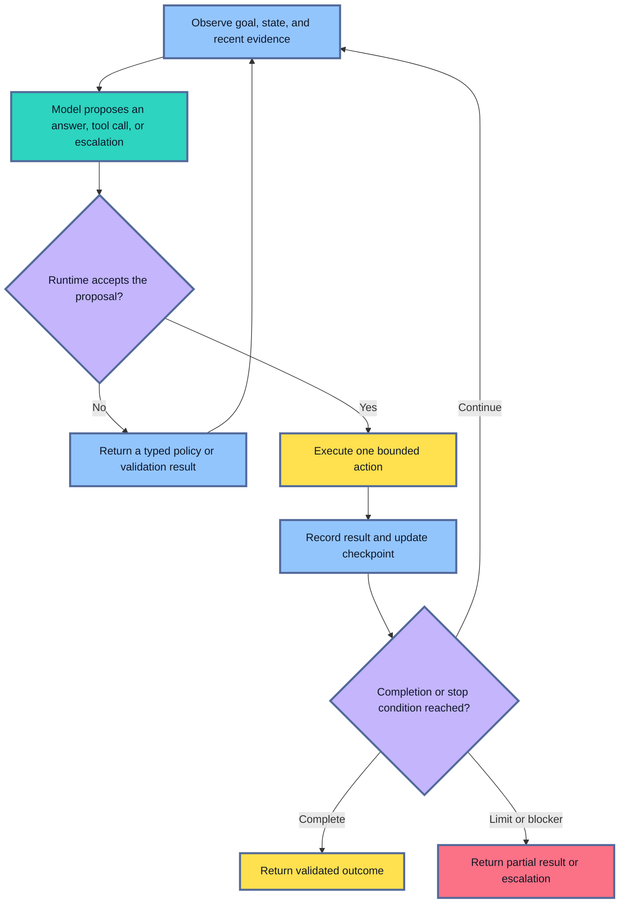
```mermaid
flowchart TD
    A["Observe goal, state, and recent evidence"] --> B["Model proposes an answer, tool call, or escalation"]
    B --> C{"Runtime accepts the proposal?"}
    C -->|"No"| D["Return a typed policy or validation result"]
    D --> A
    C -->|"Yes"| E["Execute one bounded action"]
    E --> F["Record result and update checkpoint"]
    F --> G{"Completion or stop condition reached?"}
    G -->|"Continue"| A
    G -->|"Complete"| H["Return validated outcome"]
    G -->|"Limit or blocker"| I["Return partial result or escalation"]

    classDef observe fill:#93C5FD,stroke:#536A9A,stroke-width:3px,color:#0F172A
    classDef model fill:#2DD4BF,stroke:#536A9A,stroke-width:3px,color:#0F172A
    classDef gate fill:#C4B5FD,stroke:#536A9A,stroke-width:3px,color:#0F172A
    classDef action fill:#FFE04F,stroke:#536A9A,stroke-width:3px,color:#111827
    classDef stop fill:#FB7185,stroke:#536A9A,stroke-width:3px,color:#111827
    class A,D,F observe
    class B model
    class C,G gate
    class E,H action
    class I stop
```

The observation should contain the task goal, current workflow state, recent evidence, remaining budget, and tools permitted for this step. Dumping the entire run history into every turn increases cost and can bury the facts that matter. The orchestrator should assemble a step-specific view.

The model produces a **proposal**. A tool call sends a request to trusted runtime code and provides no direct access to the outside world. The runtime validates the schema, caller identity, workflow state, business rules, and approval status before execution.

Tool results provide environmental feedback. A typed result such as `dependency_unavailable`, `permission_denied`, or `record_not_found` supports a better next decision than an unstructured error string. The loop may choose another source after a missing record, wait after a dependency failure, or escalate after a permission denial.

Completion also needs a contract. The model can propose that it is done, while deterministic validation checks every required field and resolves the cited evidence. Domain checks confirm that the proposed outcome makes sense for the current state. An incident report, for example, may require a verified affected service and time window. It can finish only after the report also includes evidence links and a safe next action.

## An Agent Loop Needs an Orchestrator

<!-- section-summary: The basic model-tool loop lacks durable lifecycle, effect reconciliation, approvals, budgets, and recovery, so production execution needs a software control layer around it. -->

The loop explains how a model can make progress. Process crashes, day-long approval waits, and uncertain external writes leave lifecycle questions for the surrounding runtime.

Consider an agent that books an appointment. The tool sends the booking request, and the provider creates the appointment. The worker crashes before saving the success result. After restart, a transcript-based loop sees no success message and may send the same request again.

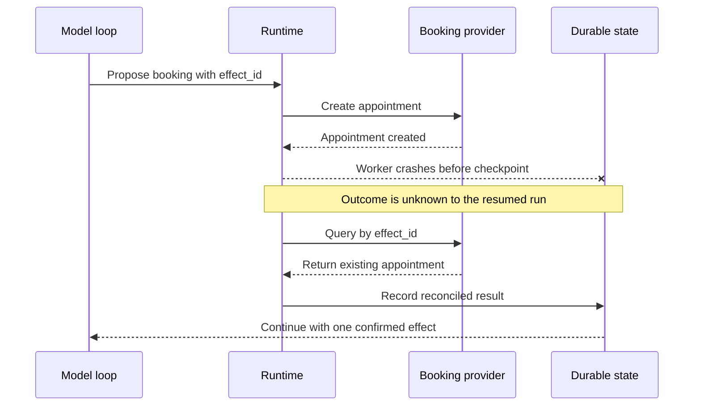
```mermaid
sequenceDiagram
    participant M as Model loop
    participant R as Runtime
    participant P as Booking provider
    participant S as Durable state

    M->>R: Propose booking with effect_id
    R->>P: Create appointment
    P-->>R: Appointment created
    R--xS: Worker crashes before checkpoint
    Note over R,S: Outcome is unknown to the resumed run
    R->>P: Query by effect_id
    P-->>R: Return existing appointment
    R->>S: Record reconciled result
    S-->>M: Continue with one confirmed effect
```

The missing capability is **reconciliation**: checking the authoritative system to discover whether an uncertain effect already happened. Reconciliation requires a durable effect identity, a place to store uncertain state, and code that runs before any replay.

The same gap appears with approvals. A chat question such as “Is this okay?” leaves the scope ambiguous. Production approval identifies the exact operation and target resource. It records the values that determine impact, the approver’s identity, the decision, and the expiry. A changed proposal requires a new decision.

Budgets also live outside the loop. A deadline limits elapsed time. Turn and tool-call limits bound repeated work, while token and cost ceilings control consumption.

The normal terminal state is `completed`. Runs can instead end as `needs_input`, `escalated`, `cancelled`, or `budget_exhausted`, and each state records its specific reason.

These responsibilities belong to the **orchestrator**, sometimes called the agent runtime or harness. It turns a sequence of model turns into one governable production run.

## The Orchestrator Owns Lifecycle and Authority

<!-- section-summary: The orchestrator is trusted software that assembles context, controls transitions and tools, enforces authority and budgets, checkpoints progress, and records the run outcome. -->

An **orchestrator** is the software control plane around model calls. In essence, it decides what the model is allowed to see, choose, and affect at each point in the run. This operating layer is trusted application software.

Its first responsibility is **context assembly**. It selects the current objective, trusted application facts, recent evidence, relevant instructions, and permitted tool definitions. This context should come from governed sources and the current workflow state.

Its second responsibility is **transition control**. It checks that the proposed next step is legal from the current state. An agent investigating a failed deployment may read logs and propose a rollback. It cannot move the deployment record to `rolled_back` until trusted execution reports success.

Its third responsibility is **authority**. The orchestrator derives user, tenant, role, and resource permissions from authenticated runtime context. Model arguments cannot grant permission. High-impact operations can interrupt the run for approval.

Its fourth responsibility is **operations**. It enforces deadlines, retries, concurrency, cancellation, tool-call limits, token limits, and cost limits. It stores checkpoints and creates traces that connect model calls, tool calls, approvals, and external effects.

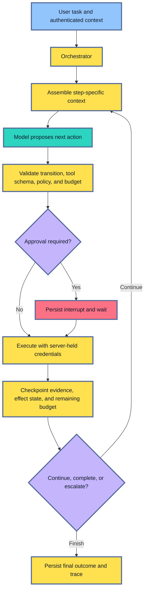
```mermaid
flowchart TD
    A["User task and authenticated context"] --> B["Orchestrator"]
    B --> C["Assemble step-specific context"]
    C --> D["Model proposes next action"]
    D --> E["Validate transition, tool schema, policy, and budget"]
    E --> F{"Approval required?"}
    F -->|"Yes"| G["Persist interrupt and wait"]
    F -->|"No"| H["Execute with server-held credentials"]
    G --> H
    H --> I["Checkpoint evidence, effect state, and remaining budget"]
    I --> J{"Continue, complete, or escalate?"}
    J -->|"Continue"| C
    J -->|"Finish"| K["Persist final outcome and trace"]

    classDef input fill:#93C5FD,stroke:#536A9A,stroke-width:3px,color:#0F172A
    classDef control fill:#FFE04F,stroke:#536A9A,stroke-width:3px,color:#111827
    classDef model fill:#2DD4BF,stroke:#536A9A,stroke-width:3px,color:#0F172A
    classDef gate fill:#C4B5FD,stroke:#536A9A,stroke-width:3px,color:#0F172A
    classDef interrupt fill:#FB7185,stroke:#536A9A,stroke-width:3px,color:#111827
    class A input
    class B,C,E,H,I,K control
    class D model
    class F,J gate
    class G interrupt
```

A concrete run policy keeps the boundary reviewable:

```yaml
run_type: incident-investigation.v3
objective: produce a cited diagnosis or an explicit escalation
allowed_tools:
  - read_service_metrics
  - search_deployment_history
  - query_trace_summary
forbidden_effects:
  - change_production
  - rotate_credentials
limits:
  model_turns: 8
  tool_calls: 12
  deadline_seconds: 240
  cost_usd: 1.50
completion:
  output_schema: incident-diagnosis.v2
  required_evidence_links: 2
```

This is application policy rather than syntax from a particular framework. A production service can store it with the run version, validate it during deployment, and include its identifier in traces. The policy makes autonomy concrete: the agent may investigate and diagnose; production changes remain outside its authority.

## Durable State and Checkpoints Preserve Progress

<!-- section-summary: Durable typed state records business progress, evidence, effects, approvals, and remaining limits so another worker can resume the run safely. -->

**State** is the information the system needs to continue correctly. **Durable state** survives process restarts and long waits. A **checkpoint** is a persisted snapshot of that state at a meaningful point in the run.

Conversation history is one part of state. It records what was said. Durable workflow state separately records the committed business transition, uncertain effects, pending approvals, and remaining budget.

A useful checkpoint can include:

- the run ID and workflow version;
- the active state and permitted next transitions;
- trusted input and artifact identifiers;
- accepted evidence and validation results;
- completed, rejected, pending, and uncertain effects;
- pending approval or external input;
- remaining time, turn, tool, token, and cost budgets;
- the prompt, model, tool-contract, and policy versions used.

Domain systems remain authoritative for committed facts. A checkpoint may record that appointment `apt_4821` was confirmed, but the booking service owns the appointment itself. Resume logic can verify the reference instead of trusting a copied summary.

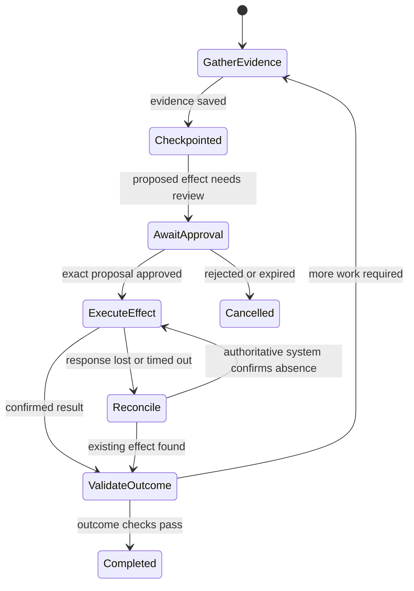
```mermaid
stateDiagram-v2
    [*] --> GatherEvidence
    GatherEvidence --> Checkpointed: evidence saved
    Checkpointed --> AwaitApproval: proposed effect needs review
    AwaitApproval --> ExecuteEffect: exact proposal approved
    AwaitApproval --> Cancelled: rejected or expired
    ExecuteEffect --> Reconcile: response lost or timed out
    ExecuteEffect --> ValidateOutcome: confirmed result
    Reconcile --> ValidateOutcome: existing effect found
    Reconcile --> ExecuteEffect: authoritative system confirms absence
    ValidateOutcome --> Completed: outcome checks pass
    ValidateOutcome --> GatherEvidence: more work required
```

Transitions should store the evidence that justified them. `AwaitApproval -> ExecuteEffect` records the approver, decision, proposal digest, and expiry. `Reconcile -> ValidateOutcome` records the authoritative lookup result. Another worker can then resume from facts instead of asking the model to reconstruct the run from prose.

LangGraph implements thread-scoped checkpoints through a checkpointer. Its production documentation recommends a durable backend such as PostgreSQL rather than an in-memory saver. Interrupts use the checkpoint plus a `thread_id` to pause and resume a graph:

```python
from langgraph.checkpoint.postgres import PostgresSaver
from langgraph.types import Command, interrupt

def approval_node(state):
    decision = interrupt({
        "proposal_id": state["proposal_id"],
        "summary": state["proposal_summary"],
    })
    return {"approval": decision}

with PostgresSaver.from_conn_string(DB_URI) as checkpointer:
    checkpointer.setup()
    graph = builder.compile(checkpointer=checkpointer)
    config = {"configurable": {"thread_id": run_id}}

    graph.invoke(initial_state, config=config)
    graph.invoke(Command(resume={"approved": True}), config=config)
```

Run database setup and migrations during deployment initialization. The example includes that initialization to keep the snippet complete. A durable pointer identifies the checkpoint, the interrupt carries JSON-serializable review data, and the resume command continues the same thread.

Long-running state also needs a change policy. A checkpoint created under `workflow.v3` may not fit `workflow.v4`. Teams can keep older workers for active runs, migrate compatible state, or route resumed work through an explicit upgrade transition. Silent interpretation by new code is risky.

## Tools, Effects, Approvals, and Interrupts Need Separate Controls

<!-- section-summary: Tool calls are model proposals; trusted runtime code validates them, obtains approval for sensitive effects, and records the authoritative result. -->

A **tool** gives the model a named way to request information or propose an action. A tool schema helps the model produce valid arguments. The runtime still owns authentication, authorization, current-state checks, credentials, idempotency, and execution.

Read tools and write tools have different risk. A read tool retrieves evidence and should return source-labelled, bounded data. A write tool changes the environment and needs a durable effect identity plus explicit result states such as `committed`, `rejected`, `pending`, and `unknown`.

An **interrupt** pauses a run and persists what it is waiting for. Human approval is one kind of interrupt. Missing customer input, a dependency outage, or a scheduled deadline can use the same lifecycle idea.

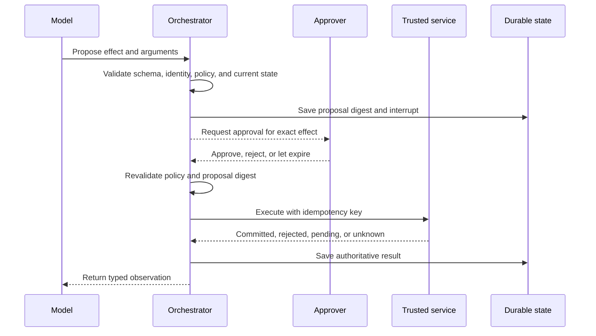
```mermaid
sequenceDiagram
    participant M as Model
    participant O as Orchestrator
    participant A as Approver
    participant T as Trusted service
    participant S as Durable state

    M->>O: Propose effect and arguments
    O->>O: Validate schema, identity, policy, and current state
    O->>S: Save proposal digest and interrupt
    O-->>A: Request approval for exact effect
    A-->>O: Approve, reject, or let expire
    O->>O: Revalidate policy and proposal digest
    O->>T: Execute with idempotency key
    T-->>O: Committed, rejected, pending, or unknown
    O->>S: Save authoritative result
    O-->>M: Return typed observation
```

Approval should bind to the exact proposal. A refund approval can include the order, amount, currency, destination, policy version, and expiry. A material change to any field creates a new proposal and a new approval request.

Revalidation after the pause matters because the world may change while a person decides. The order could already be refunded, the operator’s role could change, or the approval could expire. The runtime checks current state immediately before execution.

The OpenAI Agents SDK exposes tool approvals as interruptions. A paused result can be converted to `RunState`, serialized for a later process, approved or rejected, and passed back to the runner. LangGraph interrupts persist graph state through a checkpointer and resume with a command value. Both mechanisms help implement pause and resume; application code still defines which actions need approval and what evidence the approver sees.

Side effects around checkpoints require idempotency. LangGraph documents that a node can re-run from its start after an interrupt, so an effect before that interrupt may execute again. Separate effectful work into a controlled node or operation, supply an idempotency key, and reconcile uncertain outcomes.

## Budgets and Stop Conditions Bound Autonomy

<!-- section-summary: A production agent receives explicit limits on turns, tools, time, tokens, cost, and repeated behaviour, plus defined outcomes for completion and escalation. -->

A model-directed loop needs a bounded operating envelope. The model should know the remaining allowance, while trusted software performs the accounting.

Use several budgets because no single limit captures the whole risk. A run can stay under eight turns and still issue expensive tools in parallel. It can stay under a token limit and still wait too long for a user. Common limits cover model turns, tool calls, wall-clock time, tokens, cost, parallel actions, and effect count.

The OpenAI Agents SDK runner supports a maximum turn count. Application code should add the other budgets around tool adapters and provider usage. Graph and workflow runtimes can also place limits at particular states, branches, or activities.

Stop conditions need business meaning:

- **Completed:** the output contract and outcome checks passed.
- **Needs input:** a named person or system must provide specific information.
- **Escalated:** the run found a risk, permission boundary, or ambiguous result that requires another owner.
- **Cancelled:** a user or operator intentionally ended the run.
- **Budget exhausted:** the run saved a partial result and the exact limit that stopped it.
- **Failed:** a permanent technical error prevented a valid outcome.

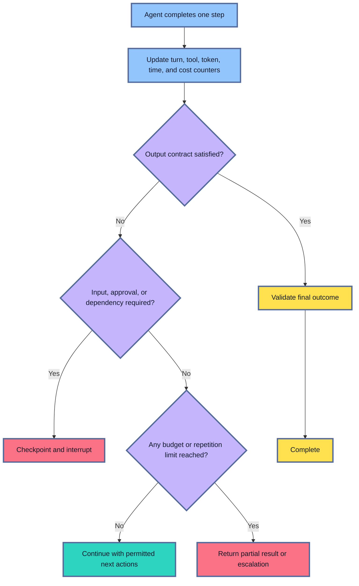
```mermaid
flowchart TD
    A["Agent completes one step"] --> B["Update turn, tool, token, time, and cost counters"]
    B --> C{"Output contract satisfied?"}
    C -->|"Yes"| D["Validate final outcome"]
    C -->|"No"| E{"Input, approval, or dependency required?"}
    E -->|"Yes"| F["Checkpoint and interrupt"]
    E -->|"No"| G{"Any budget or repetition limit reached?"}
    G -->|"No"| H["Continue with permitted next actions"]
    G -->|"Yes"| I["Return partial result or escalation"]
    D --> J["Complete"]

    classDef step fill:#93C5FD,stroke:#536A9A,stroke-width:3px,color:#0F172A
    classDef gate fill:#C4B5FD,stroke:#536A9A,stroke-width:3px,color:#0F172A
    classDef continue fill:#2DD4BF,stroke:#536A9A,stroke-width:3px,color:#0F172A
    classDef control fill:#FFE04F,stroke:#536A9A,stroke-width:3px,color:#111827
    classDef stop fill:#FB7185,stroke:#536A9A,stroke-width:3px,color:#111827
    class A,B step
    class C,E,G gate
    class H continue
    class D,J control
    class F,I stop
```

Progress checks catch loops that simple turn counts miss. Repeating the same failed tool call with equivalent arguments, generating unchanged plans, or revisiting the same state without new evidence should trigger correction or escalation. The system should record the reason instead of silently presenting an unfinished answer as success.

Budgets also affect product design. A three-minute interactive assistant and an overnight research run need different deadlines, interruption paths, and user expectations. Define those expectations before selecting a runtime.

## Recovery and Reconciliation Protect One Business Outcome

<!-- section-summary: Recovery classifies failures before retrying, and reconciliation checks authoritative systems so uncertain effects do not turn into duplicates. -->

Recovery has two goals: continue safely after a technical failure and preserve one intended business outcome. The orchestrator first classifies the failed layer, then determines whether the last operation was read-only or may have changed an external system. That second question decides whether the next step is a retry, a correction, a durable wait, a policy stop, or reconciliation.

A provider timeout before any model output is a transport failure. A bounded retry with backoff may be appropriate. An invalid structured result is a model-contract failure and may justify one correction attempt with the validation issues. A policy denial is a completed control decision. Another model call cannot grant the missing permission.

Tool failures need more care. A read timeout can usually be retried under the shared deadline. A write timeout creates an **unknown outcome**: the request may have committed even though the response was lost.

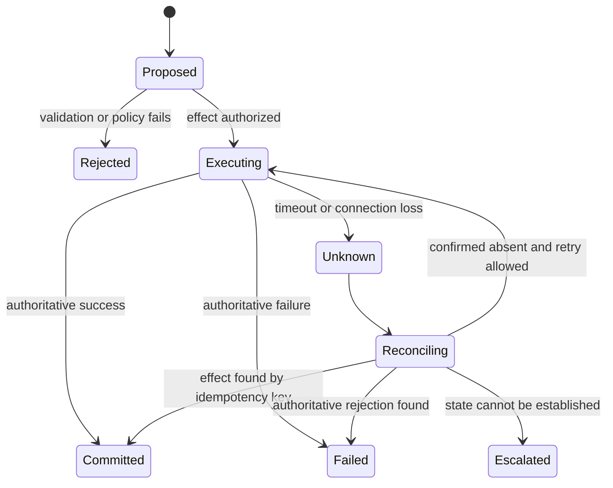
```mermaid
stateDiagram-v2
    [*] --> Proposed
    Proposed --> Rejected: validation or policy fails
    Proposed --> Executing: effect authorized
    Executing --> Committed: authoritative success
    Executing --> Failed: authoritative failure
    Executing --> Unknown: timeout or connection loss
    Unknown --> Reconciling
    Reconciling --> Committed: effect found by idempotency key
    Reconciling --> Failed: authoritative rejection found
    Reconciling --> Executing: confirmed absent and retry allowed
    Reconciling --> Escalated: state cannot be established
```

An idempotency key gives the external service a stable identity for one intended effect. Reconciliation queries the service using that key or another governed identifier. The runtime retries the write only after the authoritative system confirms absence and policy still allows the effect.

Retry ownership should sit at one clear layer. Three model retries wrapped around three tool-adapter retries can create nine attempts. The orchestrator owns the total attempt count and deadline, while lower layers expose their retry behaviour and return typed results.

Durable workflow engines support this operating model. Temporal, for example, records workflow event history and replays deterministic workflow code after failures. External calls, database queries, and LLM invocations belong in Activities outside the replay path. Temporal recommends idempotent Activities because a failed Activity attempt can run again.

Test recovery deliberately. Crash a worker after an effect commits and before the result checkpoint. Deliver the same event twice. Resume after an approval expires. Hold a dependency beyond the deadline. The expected result is one coherent business outcome with a trace that explains every attempt.

## Current Runtimes Fit at Different Layers

<!-- section-summary: Provider SDKs, agent SDKs, state-graph runtimes, and durable workflow engines solve different parts of the control stack and can be combined. -->

A framework should match the control problem. No single product removes the need to define state, authority, effects, budgets, and outcomes.

### Direct model APIs fit bounded calls and code-owned workflows

Ordinary application code plus a provider SDK is often enough for one bounded transformation or a short sequence. For example, code can classify a request, validate the structured result, and select a known route. The application owns every transition and stores the required state. The team can inspect each prompt, response, and failure directly.

### OpenAI Agents SDK fits model-tool loops

The OpenAI Agents SDK provides a runner that repeatedly calls the model, executes tool calls, follows handoffs, and stops on final output or a maximum turn limit. It also provides tools, guardrails, sessions, tracing, and serializable run state for approval interruptions.

This layer fits a bounded assistant or investigator whose model-directed turns need an SDK runtime. The surrounding application still owns domain state, business permissions, total budgets, effect reconciliation, and release policy. The SDK documentation also describes integrations with durable execution systems for runs that cross long waits or process restarts.

### LangGraph fits explicit state graphs

LangGraph is a low-level orchestration runtime for long-running, stateful agents. It mixes deterministic nodes with model-driven nodes, represents allowed transitions as a graph, and supports checkpoints and interrupts.

This layer fits an application that needs visible branches, loops, resumable state, or human pauses inside an agentic process. A production deployment uses a durable checkpointer and designs nodes with replay and idempotency in mind.

### Durable workflow engines fit long business lifecycles

Temporal and managed cloud workflow services fit processes that may run for hours, days, or months; wait for events; survive worker restarts; enforce timers; and coordinate retries across services. They are especially valuable where the business process exists beyond one conversational turn.

In a Temporal design, deterministic workflow code owns the business lifecycle. An Activity performs the LLM or agent run because model calls are non-deterministic external operations. Another Activity executes an external effect. The workflow records the results and waits for approvals or signals.

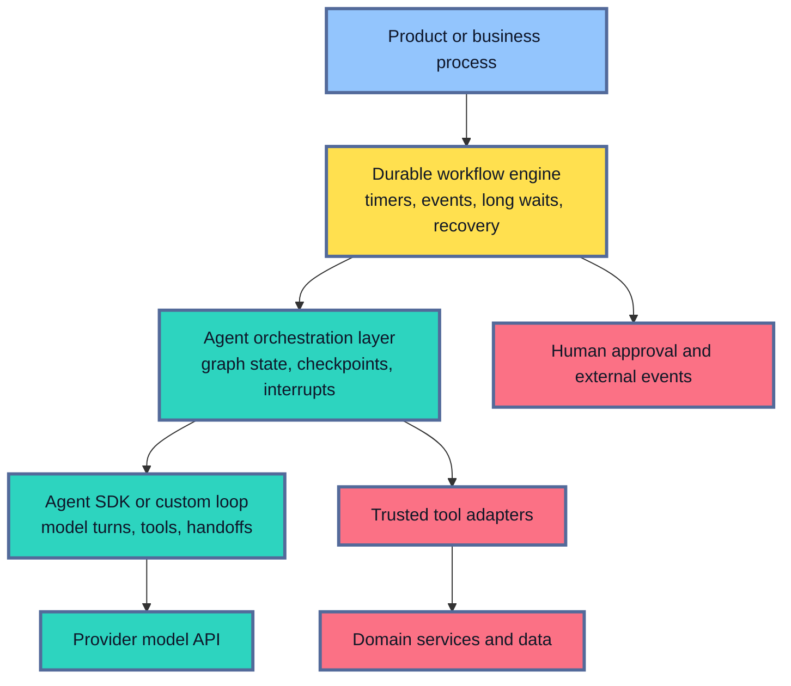
```mermaid
flowchart TD
    A["Product or business process"] --> B["Durable workflow engine<br/>timers, events, long waits, recovery"]
    B --> C["Agent orchestration layer<br/>graph state, checkpoints, interrupts"]
    C --> D["Agent SDK or custom loop<br/>model turns, tools, handoffs"]
    D --> E["Provider model API"]
    C --> F["Trusted tool adapters"]
    F --> G["Domain services and data"]
    B --> H["Human approval and external events"]

    classDef product fill:#93C5FD,stroke:#536A9A,stroke-width:3px,color:#0F172A
    classDef durable fill:#FFE04F,stroke:#536A9A,stroke-width:3px,color:#111827
    classDef agent fill:#2DD4BF,stroke:#536A9A,stroke-width:3px,color:#0F172A
    classDef external fill:#FB7185,stroke:#536A9A,stroke-width:3px,color:#111827
    class A product
    class B durable
    class C,D,E agent
    class F,G,H external
```

Most deployments use only the layers their requirements need. A short read-only assistant may need an agent SDK and an application database. A regulated process with week-long approvals may use a durable workflow engine around one or more agent steps. LangGraph can serve as the orchestration layer for explicit agent state, while Temporal owns the larger business lifecycle.

Choose the smallest combination that meets the durability and control requirements. Evaluate failure recovery and operational visibility before committing to a framework, because abstraction alone does not supply a correct business model.

## Multi-Agent Design Needs a Real Boundary

<!-- section-summary: Multiple agents are justified by separate trust, context, ownership, or parallel-work boundaries, and each interaction needs a typed contract and merge policy. -->

A multi-agent system contains more than one model-directed worker or specialist. The separation should correspond to something the production system actually needs.

One specialist may require access to sensitive financial records while the coordinator sees only a redacted summary. Another may run in an isolated coding workspace. Two independent teams may own separate services and release schedules. Parallel specialists may inspect unrelated evidence sources whose results can be joined deterministically.

These are real boundaries: permission, context, execution environment, ownership, or independent work.

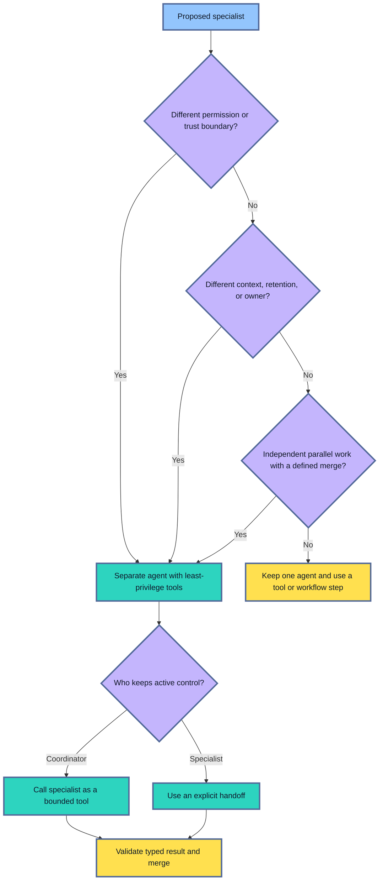
```mermaid
flowchart TD
    A["Proposed specialist"] --> B{"Different permission or trust boundary?"}
    B -->|"Yes"| G["Separate agent with least-privilege tools"]
    B -->|"No"| C{"Different context, retention, or owner?"}
    C -->|"Yes"| G
    C -->|"No"| D{"Independent parallel work with a defined merge?"}
    D -->|"Yes"| G
    D -->|"No"| E["Keep one agent and use a tool or workflow step"]
    G --> H{"Who keeps active control?"}
    H -->|"Coordinator"| I["Call specialist as a bounded tool"]
    H -->|"Specialist"| J["Use an explicit handoff"]
    I --> K["Validate typed result and merge"]
    J --> K

    classDef question fill:#C4B5FD,stroke:#536A9A,stroke-width:3px,color:#0F172A
    classDef separate fill:#2DD4BF,stroke:#536A9A,stroke-width:3px,color:#0F172A
    classDef simple fill:#93C5FD,stroke:#536A9A,stroke-width:3px,color:#0F172A
    classDef control fill:#FFE04F,stroke:#536A9A,stroke-width:3px,color:#111827
    class A simple
    class B,C,D,H question
    class G,I,J separate
    class E,K control
```

The OpenAI Agents SDK documents two common coordination patterns. In the manager pattern, a coordinator keeps the user-facing turn and calls a specialist as a tool. A handoff transfers active control to the selected specialist. Use the manager pattern for bounded assistance and synthesis. Use a handoff for a genuine transfer of interaction responsibility.

Every specialist receives a typed input and returns a typed output. Its contract sets a timeout and budget, explains failure handling, and limits the context it may receive. Parallel results need a deterministic merge or a clear conflict route. A coordinator should not silently choose between contradictory high-risk findings.

Multi-agent systems introduce routing errors, duplicated context, conflicting outputs, larger cost, and deeper traces. Compare the design against one capable agent with well-designed tools on the same evaluation set. Separate agents only if the boundary improves measured outcomes or enforces a necessary production constraint.

## Evaluate Outcomes and Trajectories

<!-- section-summary: Agent evaluation measures both the final business result and the sequence of tools, transitions, approvals, retries, and evidence used to reach it. -->

A workflow can produce a polished final answer after taking an unsafe or wasteful path. It can also take a sensible path and escalate because the required evidence is genuinely missing. Evaluation therefore needs two views.

**Outcome evaluation** checks what the system ultimately produced or changed. For an incident investigation, that includes the diagnosis, evidence links, affected service, recommended action, and final workflow state. For a tool-using process, it also checks the authoritative domain state and number of external effects.

**Trajectory evaluation** checks the path. It asks whether the agent selected appropriate tools, respected permissions, used approval, avoided repeated calls, stayed within budgets, and escalated at the right point. OpenAI’s agent-evaluation guidance uses traces and graders for these workflow-level questions.

```yaml
case_id: regional-latency-with-missing-traces
environment:
  metrics: regional_latency_spike
  trace_service: unavailable
expected_outcomes:
  - status: escalated
  - status: needs_input
forbidden_effects:
  - change_production
trajectory_checks:
  max_tool_calls: 6
  must_use: [read_service_metrics]
  must_not_repeat_failed_call: query_trace_summary
```

The case permits more than one safe outcome because the missing trace service blocks a fully supported diagnosis. It still forbids a production change and limits repeated work.

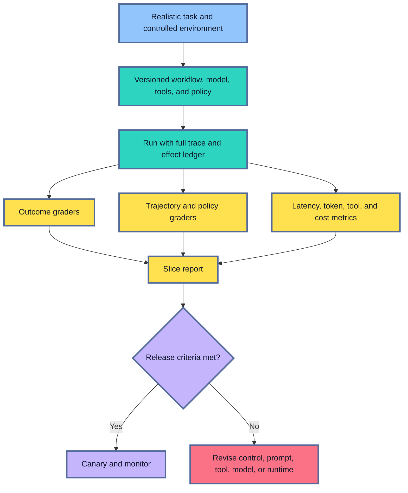
```mermaid
flowchart TD
    A["Realistic task and controlled environment"] --> B["Versioned workflow, model, tools, and policy"]
    B --> C["Run with full trace and effect ledger"]
    C --> D["Outcome graders"]
    C --> E["Trajectory and policy graders"]
    C --> F["Latency, token, tool, and cost metrics"]
    D --> G["Slice report"]
    E --> G
    F --> G
    G --> H{"Release criteria met?"}
    H -->|"Yes"| I["Canary and monitor"]
    H -->|"No"| J["Revise control, prompt, tool, model, or runtime"]

    classDef input fill:#93C5FD,stroke:#536A9A,stroke-width:3px,color:#0F172A
    classDef run fill:#2DD4BF,stroke:#536A9A,stroke-width:3px,color:#0F172A
    classDef grade fill:#FFE04F,stroke:#536A9A,stroke-width:3px,color:#111827
    classDef gate fill:#C4B5FD,stroke:#536A9A,stroke-width:3px,color:#0F172A
    classDef stop fill:#FB7185,stroke:#536A9A,stroke-width:3px,color:#111827
    class A input
    class B,C run
    class D,E,F,G grade
    class H,I gate
    class J stop
```

The evaluation environment should control tool results and inspect side effects. Include ambiguous tasks, missing data, hostile instructions inside retrieved documents, tool timeouts, duplicate responses, expired approvals, budget exhaustion, process crashes, and impossible goals.

Trace model calls, retrieval, tool calls, guardrails, transitions, checkpoints, handoffs, approvals, and effects under one run ID. Keep sensitive content under an explicit retention policy. Production failures should become replay cases in the evaluation set.

Release the full system bundle: model, prompts, tool schemas, orchestration graph, policies, and validators. Offline evaluation, shadow runs, canaries, and rollback protect the interactions among those components.

## What to Carry Into Production

<!-- section-summary: Production design gives models bounded adaptive judgment while trusted software owns state, authority, effects, recovery, budgets, and evaluation. -->

Control ownership is the foundation of workflow and agent design. Use a single model call for one bounded judgment. Use a deterministic workflow for known states and transitions. Add a bounded agent loop for tasks whose next useful action depends on evidence discovered during execution.

Place an orchestrator around every production loop. It assembles context, validates transitions, controls tools and effects, persists checkpoints, handles interrupts, accounts for budgets, reconciles uncertain outcomes, and records the final result.

Use multiple agents for genuine trust, context, execution, ownership, or parallel-work boundaries. Select runtime layers according to the control problem: direct APIs for bounded calls, an agent SDK for model-tool turns, LangGraph for explicit stateful graphs, and durable workflow engines for long business lifecycles.

Evaluate the business outcome and the trajectory that produced it. The final answer, external effects, evidence, approvals, retries, stops, latency, and cost all belong to the quality contract.

## References

- [Anthropic: building effective agents](https://www.anthropic.com/engineering/building-effective-agents)
- [OpenAI Agents SDK: running agents](https://openai.github.io/openai-agents-python/running_agents/)
- [OpenAI Agents SDK: agent orchestration](https://openai.github.io/openai-agents-python/multi_agent/)
- [OpenAI Agents SDK: human-in-the-loop](https://openai.github.io/openai-agents-python/human_in_the_loop/)
- [OpenAI: evaluate agent workflows](https://developers.openai.com/api/docs/guides/agent-evals)
- [LangGraph overview](https://docs.langchain.com/oss/python/langgraph/overview)
- [LangGraph persistence](https://docs.langchain.com/oss/python/langgraph/persistence)
- [LangGraph interrupts](https://docs.langchain.com/oss/python/langgraph/interrupts)
- [Temporal workflow execution](https://docs.temporal.io/workflow-execution)
- [Temporal workflow definitions and deterministic constraints](https://docs.temporal.io/workflow-definition)
- [Temporal Activities](https://docs.temporal.io/activities)
